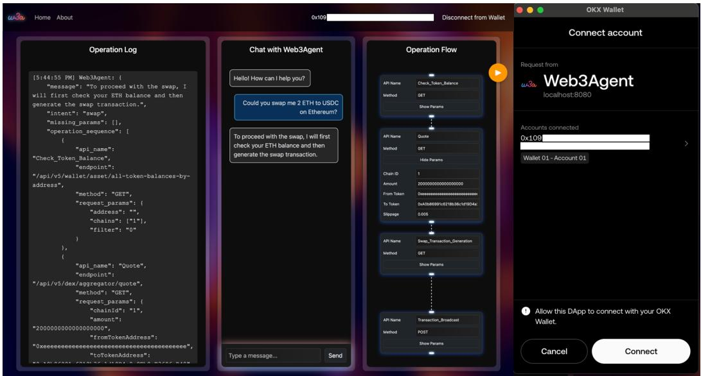
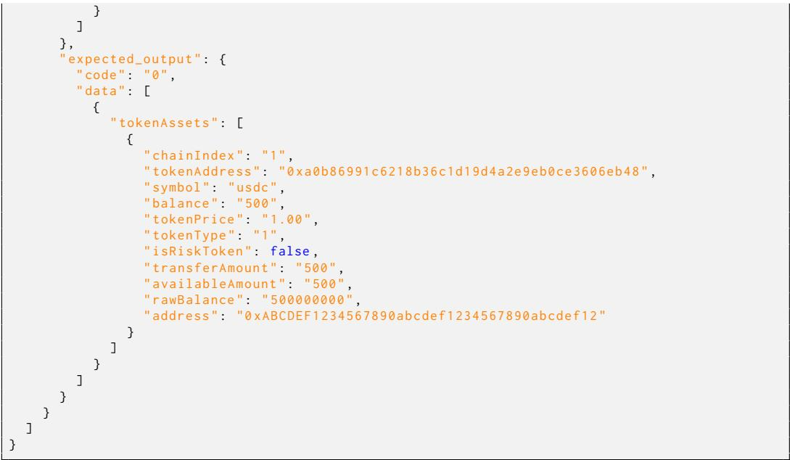

Latest updates: hps://dl.acm.org/doi/10.1145/3777446 

RESEARCH-ARTICLE 

# Web3Agent: Automating On-Chain Operations via Natural Language Interfaces

SIZHENG FAN, University of International Business and Economics, Beijing, China 

TIAN MIN, Keio University, Tokyo, Japan 

Open Access Support provided by: 

Keio University 

University of International Business and Economics 


PDF Download 

3777446.pdf 

15 March 2026 

Total Citations: 0 

Total Downloads: 267 

Published: 19 February 2026 

Online AM: 17 November 

Accepted: 07 October 2025 

Revised: 19 August 2025 

Received: 14 April 2025 

Citation in BibTeX format 

# Web3Agent: Automating On-Chain Operations via Natural Language Interfaces

SIZHENG FAN, University of International Business and Economics, Beijing, China TIAN MIN, Faculty of Science and Technology, Keio University, Yokohama, Japan 

Recent advances in large language models (LLMs) have enabled the emergence of intelligent agents capable of performing complex multi-step tasks across various domains. In parallel, the growth of Web3 has introduced a decentralized web infrastructure, yet remains largely inaccessible to non-technical users due to operational complexity, fragmented information, and security risks. In this article, we present Web3Agent, an AI agent system that integrates LLM-based interaction with blockchain environments to enable language-driven on-chain operations. Web3Agent automatically decomposes user instructions into structured workflows, dynamically queries blockchain data and APIs, and performs multi-step operations such as asset transfers, token swaps, and smart contract execution. Web3Agent incorporates real-time inspection, error handling, and interaction transparency across its operation log, and flow visualization components. We evaluate the system and perform ablation study with customized dataset in a simulated environment, demonstrating its feasibility in orchestrating complex Web3 tasks and highlighting implications for agent-based abstraction in decentralized systems. 

CCS Concepts: • Human-centered computing Human computer interaction (HCI); • Computing methodologies Natural language processing; $\bullet$ Information systems World Wide Web; 

Additional Key Words and Phrases: Web3, blockchain, intelligent virtual assistants, large language models, process automation 

# ACM Reference Format:

Sizheng Fan and Tian Min. 2026. Web3Agent: Automating On-Chain Operations via Natural Language Interfaces. ACM Trans. Web 20, 1, Article 9 (February 2026), 27 pages. https://doi.org/10.1145/3777446 

# 1 Introduction

In recent years, Web3, as a decentralized web based on blockchain technology, has become a critical direction for the future development of the Internet [4, 11]. This emerging field, characterized by transparency, immutability, and user sovereignty, has injected fresh momentum into the digital ecosystem and is beginning to reshape the core logic of the Internet [12]. Globally, particularly in the United States, policies and increased research investments are actively driving the adoption and application of this technology [38]. For instance, the U.S. Securities and Exchange Commission 

This work was supported in part by in part by JST Keio-SPRING (Grant Number Y01GQ25160) and “the Fundamental Research Funds for the Central Universities” in UIBE 25QD46. 

Authors’ Contact Information: Sizheng Fan, University of International Business and Economics, Beijing, Beijing, China; e-mail: sizhengfan@uibe.edu.cn; Tian Min (corresponding Author), Faculty of Science and Technology, Keio University, Yokohama, Kanagawa, Japan; e-mail: welkinmin@keio.jp. 

Permission to make digital or hard copies of all or part of this work for personal or classroom use is granted without fee provided that copies are not made or distributed for profit or commercial advantage and that copies bear this notice and the full citation on the first page. Copyrights for components of this work owned by others than the author(s) must be honored. Abstracting with credit is permitted. To copy otherwise, or republish, to post on servers or to redistribute to lists, requires prior specific permission and/or a fee. Request permissions from permissions@acm.org. 

$\circledcirc$ 2026 Copyright held by the owner/author(s). Publication rights licensed to ACM. 

ACM 1559-1131/2026/02-ART9 

https://doi.org/10.1145/3777446 

(SEC) has started providing clearer regulatory frameworks for crypto assets and blockchain applications, while also supporting innovative experiments and technology deployments [39]. These policy measures not only create favorable conditions for the sustained development of Web3 but also highlight its strategic significance. 

Despite its immense potential, the large-scale adoption of Web3 faces numerous limitations. The current decentralized web encounters three core barriers that significantly restrict access and participation for the average user, from the aspect of operational complexity, information overload, and security concerns. (1) The operational complexity of Web3 lies in the need for users to acquire a range of skills and knowledge, including creating and managing crypto wallets, understanding the basic logic of smart contracts (SCs), and becoming familiar with decentralized applications (dApps). This high technical barrier makes it challenging for non-technical users to effectively access and utilize the services offered by Web3. (2) The information overload underscores the accessibility barrier from another aspect. The content and services provided by Web3 ecosystem are highly fragmented, leaving users overwhelmed by an influx of information without effective filtering and organization. For instance, the sheer growing number of decentralized finance (DeFi) platforms makes it difficult for users to quickly identify the solutions that meet their needs. (3) The security concerns stem from the growing number of vulnerabilities in SCs [3], social engineering scams, phishing attacks [40], and inadequate private key management [13], which issues are expected to become increasingly pronounced as the Web3 user base continues to expand. 

With the rapid advancement and evolution of Large Language Models, AI Agents powered by LLMs have already demonstrated strong task execution and decision-making capabilities across a variety of complex domains [9]. For instance, in the financial sector, AI Agents are widely applied in automated investment advisory and intelligent risk management systems, offering real-time investment recommendations based on dynamic market conditions [43]. In healthcare, AI Agents assist physicians in diagnostic decision-making and personalized health management, while also providing multi-step support in handling complex cases [33]. Moreover, in customer service and Internet of Thing (IoT) applications, AI Agents autonomously parse complex user instructions and execute multi-step tasks seamlessly [5]. These successful cross-domain applications underscore the maturity and reliability of AI Agents in handling sophisticated tasks, thereby laying a solid technical foundation for their integration into Web3 ecosystems. 

Through intelligent interaction design and efficient feature integration, AI Agents can significantly enhance user experiences within decentralized web environments, laying a solid foundation for the widespread adoption of Web3 technology. AI Agents exhibit notable advantages in addressing the first challenge, operational complexity. Leveraging Natural Language Processing (NLP) technologies and intelligent interaction interfaces, AI Agents can provide users with intuitive and user-friendly experiences. For example, users no longer need to learn complex blockchain terminologies or operational procedures, as AI Agents can automatically handle wallet creation, asset transfers, and SC interactions based on user needs. For the second challenge of information overload, AI Agents rely on machine learning algorithms and personalized recommendation mechanisms to deliver precise information filtering and content curation for users. For instance, recent studies have begun exploring the application of LLMs within the crypto ecosystem, such as evaluating their ability to recognize and process DeFi-specific entities [32] or proposing a multi-agent framework for cryptocurrency investment that leverages LLMs to coordinate decision-making, portfolio management, and risk control across diverse market conditions [25]. These advancements indicate the potential for AI Agents to, in the future, provide personalized investment insights based on users’ risk preferences, historical behaviors, and market dynamics, while continuously monitoring market changes for real-time updates. This approach not only improves the efficiency of acquiring relevant information but also significantly reduces the cognitive burden required 

for decision-making. Finally, AI Agents address the third challenge of relative security concerns by enabling real-time monitoring and dynamic analysis of SC operations to help detect potential security threats. While recent studies have begun exploring the use of LLMs for identifying smart contract vulnerabilities and abnormal transaction behaviors [15, 22], current findings suggest that the effectiveness of such techniques remains limited and that substantial technical advances are still required. Nevertheless, these early efforts indicate that AI Agents may, in the future, assist in flagging vulnerabilities in SCs or suspicious transaction behaviors and promptly alerting users. Additionally, AI Agents can assist users in optimizing key management strategies, such as recommending the use of multi-signature and distributed key storage to prevent asset loss due to single points of failure. The integration of these features not only strengthens user asset security but also provides technical assurance for the overall security of decentralized web environments. 

Building upon these advances, we propose Web3Agent, a novel AI agent system specifically designed to address the critical challenges of Web3 environments by integrating LLM-based intelligent agents with blockchain networks through seamless API communication. Unlike existing AI assistants that mainly focus on simple conversational tasks, Web3Agent represents the first agent framework that enables fully automated, multi-step interactions within decentralized blockchainbased ecosystems, offering end-to-end support from understanding user instructions to securely executing on-chain operations. 

Web3Agent leverages LLM-Based Process Automation to decompose complex user intents into executable Web3 tasks, directly interacting with SCs, dApps, and blockchain infrastructure through standardized API calls. This approach allows Web3Agent to perform intricate operations such as wallet creation, asset transfers, DeFi interactions, and NFT transactions, all initiated via natural language commands. Unlike traditional assistants that are confined to rigid API sequences, Web3Agent emulates human-like operation flows, including contract interaction verification, transaction status monitoring, and error handling, thereby supporting safe, efficient, and intuitive Web3 experiences. 

To the best of our knowledge, this is the first study that demonstrates the deployment and evaluation of an LLM-powered AI agent in real-world Web3 applications, overcoming three critical obstacles previously outlined: 

— First, in addressing operational complexity, Web3Agent autonomously orchestrates multi-step blockchain workflows through natural conversations, relieving users from understanding complex SC mechanisms and wallet operations. For example, users can simply request “Swap 2 ETH for USDC on Uniswap,” and Web3Agent will handle contract querying, transaction creation, gas fee estimation, and execution. 

— Second, in mitigating information overload, Web3Agent incorporates AI-driven aggregation and recommendation mechanisms to curate fragmented and overwhelming Web3 content. It can compare DeFi rates, recommend safer protocols based on security audits, and continuously monitor market conditions to update users with actionable insights, thus reducing the cognitive load associated with navigating decentralized ecosystems. 

— Third, in enhancing security assurance, Web3Agent dynamically analyzes SC risks, transaction anomalies, and social engineering patterns through AI-powered security heuristics. Before executing any transaction, it can alert users about potential contract vulnerabilities or abnormal gas fees, and recommend multi-signature or time-lock solutions to prevent unauthorized asset movements. 

# 2 Related Works

# 2.1 Web3 Architecture

As shown in Figure 1, the period from 1990 to 2004 is widely known as the era of Web 1.0, characterized by static webpages with content served from file systems rather than databases. User 


Fig. 1. The development of the web.


interaction was minimal—there were no logins, comments, or personalized services—leading to its description as a “read-only” web. Most websites were non-commercial, and the Internet functioned more as a linked information repository than a participatory platform. Technological advances such as Flash and JavaScript gradually introduced limited interactivity, but users remained primarily content consumers. 

Web 2.0, emerging around 2004, marked a shift toward user-generated content and interactive services. Platforms like Facebook, YouTube, and Google began collecting user data to personalize content and enable targeted advertising. While users became active participants, this era also brought concerns over privacy and data centralization, as control over content and infrastructure became concentrated in a few large corporations. 

Web3 represents a decentralized alternative, built on blockchain technology. It replaces centralized servers with distributed networks and intermediaries with SCs. Governance and decision-making are handled by decentralized autonomous organizations (DAOs), enabling community-led development through token-based voting. Web3 aims at restoring user ownership over data, identity, and digital assets, fostering a more open and trustless Internet ecosystem. 

# 2.2 Web Agents: From Web2 to Web3

Figure 2 presents a high-level comparison between Web2 and Web3Agents, highlighting their architectural differences and operational modalities. In Web2 settings, agents operate by interpreting HTML-based visual interfaces and executing user tasks on centralized applications. Web2 agents are typically deployed within browser-based environments to complete user-specified tasks, a problem commonly referred to as the Web Navigation Problem [14]. These agents translate natural language commands into executable steps and simulate user interactions to perform tasks such as form-filling, email composition, and online shopping. To function in real-world scenarios—where web pages are often noisy and structurally dynamic—agents must understand interface layouts, generalize across related tasks, and adapt to unseen configurations [2, 45]. 

Early methods trained agents using reinforcement learning (RL) to imitate human behaviors in simulated environments [28, 41]. However, RL-based agents struggled with real-world HTML due to limited semantic reasoning. To address this, recent work incorporates large language models for structured parsing and decision making. For example, Mind2Web [6] leverages HTML-specialized LLMs to interpret page structure and predict actions, while WebGum [14] integrates LLMs with visual encoders for multimodal perception of complex web environments. 


Web2 Agents


Web3 Agents


Fig. 2. Web2 agent and Web3Agent.


Unlike their Web2 counterparts, Web3Agents operate within decentralized and trustless ecosystems. As shown in Figure 2 (right), these agents rely on on-chain data and domain-specific blockchain knowledge—including SCs, wallet protocols, and decentralized identity (DID) systems [23, 26] to execute tasks such as token swaps [12], governance voting [11], or SC invocation [13]. They do not simulate clicks on visual interfaces, but instead reason about blockchain states and programmatic APIs. 

This shift in paradigm is aligned with the broader Web3 architecture, which includes dApp frontends, decentralized storage, and programmable SCs on chains like Ethereum1 or Solana.2 Tools like MetaMask3 act as secure bridges for transaction signing and identity verification. The backend is often enhanced by AI-driven services or decentralized protocols. As a result, Web3Agents must be not only semantically capable, but also transaction-aware, context-sensitive, and safe-by-design. 

Although no standardized framework for Web3Agents exists, foundational tools such as Web3.py4 and Ethers.js5 have enabled programmable SC interaction. Additionally, recent works explore combining LLMs with blockchain APIs to support natural language to contract translation, semantic retrieval of chain data, and wallet operation guidance. 

To bridge this gap, our work introduces the first systematic framework for LLM-powered Web3Agents. Our system, Web3Agent, integrates capabilities such as instruction decomposition, dynamic API state interpretation, historical action summarization, and controllable action prediction. It enables a fully autonomous loop from natural language input to safe, multi-step blockchain execution—providing a foundation for scalable, secure, and generalizable Web3-native agents. In contrast to prior API-grounded LLM frameworks, Gorilla focuses on single-step code synthesis for individual APIs, without multi-task planning or dynamic environment adaptation. API-Bank extends this to multi-step execution by decomposing static Web2 tasks into API calls via a plan–retrieve–execute pipeline, yet operates over a fixed API set and does not incorporate 

real-time state changes. Sy-Hong-Duc Nguyen et al. [29] implements a multi-agent collaborative prototype that uses natural language to drive blockchain API queries and basic operations, but it targets comparatively simple tasks and does not provide cross-chain reasoning, dynamic multistep planning, or robustness mechanisms. Web3Agent, by comparison, is designed for dynamic, stateful Web3 environments: its execution logic performs semantic-to-API translation coupled with on-chain state grounding, its chunk granularity explicitly separates high-level operations (e.g., cross-chain swap) from atomic API calls, and its grounding fidelity ensures each execution step reflects live blockchain conditions such as account balances, gas fees, and transaction confirmations. Furthermore, Web3Agent augments execution reliability through RAG-based knowledge retrieval, execution-time verification, and error-recovery routines, substantially increasing its capacity to handle complex, multi-step, and time-sensitive on-chain tasks that the above systems were not designed to address. 

# 2.3 Retrieval-augmented Generation

Retrieval-Augmented Generation (RAG) has emerged as a prominent technique for enhancing language models with external knowledge. A typical RAG pipeline consists of a document database, a retriever to identify relevant content, and a mechanism to incorporate retrieved passages into the language model’s context. Prior work has demonstrated the effectiveness of RAG systems in open-domain QA [21], biomedical reasoning [30], and tool-augmented agents [27]. More recent efforts explore modular and agent-based RAG frameworks [20, 42], where retrieval is dynamically invoked and aligned with intermediate reasoning steps. 

Several RAG enhancements have been proposed, including a priori prompting, which guides the retriever using latent task structure [36], and a posteriori prompting, where retrieved evidence is verified post hoc to detect hallucinations [27]. Active RAG [36] further re-generates queries or answer tokens in response to uncertain or low-confidence predictions. In parallel, retrieval methods continue to evolve: traditional keyword or sparse retrieval (e.g., BM25 [34]) is increasingly complemented or replaced by dense retrieval using pre-trained embeddings (e.g., text-embeddingada-002) and learned ranking models [18]. 

In our work, we adopt a modular, instruction-driven RAG framework tailored to the Web3 execution domain. We design domain-partitioned semantic chunk stores, indexed using vector embeddings and filtered with metadata-based routing. Each sub-module (e.g., Instruction Chain Generator or Action Prediction) queries only its relevant chunk types (e.g., operation, API spec, error patterns), ensuring prompt relevance and reducing retrieval noise. Our design is closely related to structured RAG pipelines [20], but differs by incorporating domain-specific execution logic and external Web3 APIs. 

# 3 Operations on Web3

Blockchain-based systems support a wide variety of on-chain interactions. In this study, we categorized a total of 36 interactions into two fundamental types: Query On-Chain Information (31) and On-Chain Operations (5). Querying on-chain information is an essential prerequisite for safely and effectively conducting on-chain operations, as users and decentralized agents must rely on up-to-date blockchain states to make informed decisions. 

In this section, we systematically classify and describe these two types of operations, which together form the core primitives of interaction within decentralized ecosystems. 

# 3.1 Querying On-chain Information

Querying on-chain information (31 entries) refers to read-only interactions with the blockchain to retrieve real-time state data, which are essential for understanding the on-chain environment and 


Fig. 3. Classification of on-chain information query and operations.


facilitating secure interactions with dApps. Such queries do not modify on-chain records, ensuring system integrity while providing necessary context for subsequent transactions, including token swaps, staking, or SC interactions. In this work, we categorize on-chain queries into three layers, allowing structured access to blockchain data across different system components, as shown in Figure 3. 

System Layer: Queries in this layer focus on providing global information about the blockchain infrastructure and the system’s operational state. These queries are foundational for ensuring system health and facilitating informed decision-making in the blockchain environment. The components of this layer include Supported Blockchains, which provides information about the blockchain networks the system supports, ensuring interoperability between decentralized ecosystems and enabling seamless cross-chain interactions. Another essential component is Pre-Transaction Information, a set of queries that retrieve critical data required for executing a transaction, such as network fees, nonce values, gas prices and gas limits. These queries are vital for preparing transactions, ensuring both efficiency and correctness in processing. 

Externally Owned Account (EOA) Layer: This layer focuses on user-specific queries related to EOA. It encompasses essential data points that are directly tied to individual users’ on-chain activities. The three key operations for assessing and managing a user’s blockchain activities include asset holdings, transaction history, and approval and permission checks. The Asset Holdings query retrieves the user’s balance of native tokens (e.g., ETH, BNB), ERC-20 tokens, and NFTs (ERC-721, ERC-1155). This is essential for evaluating available balances and ensuring sufficient funds for transactions like token swaps or staking. The Transaction History query provides a detailed record of all transactions, including contract interactions and token transfers, offering transparency and auditability of the user’s blockchain activity. Finally, the Approval and Permission query checks the permissions granted by the user to various SCs, particularly token transfer allowances and their remaining balances. This operation is crucial before initiating token swaps, as it ensures the user has granted the necessary permissions for the transaction to be processed. 

SC Layer: The SC Layer focuses on retrieving information related to SCs. This layer is pivotal for enabling complex dApps to interact with users and other system components. The subqueries within this layer include Coin Prices and Project Information, which retrieves real-time coin prices, historical price data, and detailed project information for specific cryptocurrencies, helping users assess market conditions before executing transactions. The Contract and Token Information query 

provides access to metadata of fungible tokens, including their names, symbols, decimals, and total supply, ensuring that users can verify the characteristics of tokens and contracts before interacting with them. The Market and Price Data query retrieves real-time asset prices, liquidity pool depth, token swap rates, and oracle-based price feeds, which are essential for users to make informed decisions about trading, liquidity provision, and other DeFi activities. Lastly, the Contract Interaction Records query analyzes historical interactions with a given SC, including function calls, event logs, and dApp-specific operational data, such as staking pool activities, providing transparency and helping evaluate the trustworthiness of a contract. 

These categorized on-chain queries are fundamental for facilitating DeFi operations, ensuring user safety, and optimizing transaction strategies. For example, before executing a token swap on a decentralized exchange (DEX), it is crucial to verify the user’s token balance and ensure that the DEX router has the necessary approval to execute the transaction. Furthermore, querying historical contract interactions helps to assess the reliability of the contract, ensuring users engage only with trusted SCs that are aligned with their intentions. 

# 3.2 On-chain Operations

The core of on-chain operations lies in the transfer and management of value, particularly in the liquidity management of fungible tokens (5 entries). Each operation relies on multiple on-chain queries to ensure the validity, compliance, and security of transactions. The following outlines three key blockchain operations that facilitate the flow of assets within Web3 ecosystems: 

Fungible Tokens Transfer Between Externally Owned Accounts (EOAs). The transfer of fungible tokens between EOAs represents a fundamental form of value transfer between accounts. This operation begins with querying the asset holdings to ensure that the sending account has sufficient tokens for the transaction. Subsequently, pre-transaction queries, such as network fees and gas prices, are made to ensure the transaction’s validity and efficiency. Prior to execution, the system verifies the transaction’s nonce value to prevent errors caused by duplicate transactions. 

Fungible Token Transfers Between Users and Smart Contracts on the Same Chain. In DeFi settings, interactions between users and smart contracts involving fungible token transfers are central to various common operations, including token swaps via DEXs, product subscriptions and redemptions, and reward claiming. These interactions typically require more sophisticated permission checks and function-level validations. Specifically, the system first queries the contract metadata to verify whether the targeted smart contract supports the intended operation and to confirm that the user has granted sufficient token allowance to the contract. Subsequently, pre-transaction information—such as current gas prices and network congestion—is retrieved to construct and broadcast the transaction. This process ensures compliance with both the blockchain network’s protocol-level rules and the logic embedded in the smart contract. 

Fungible Tokens Transfer Across Blockchains (Cross-Chain Interoperability). Crosschain transfer refers to the flow of assets across different blockchains, enabling dApps to interact within a multi-chain ecosystem. Web3Agent currently supports cross-chain operations across a wide range of networks, including major EVM-compatible chains such as Ethereum, BNB Smart Chain, and Avalanche C-Chain; leading Ethereum Layer-2 networks such as Arbitrum One, Optimism, zkSync Era, Base, and Polygon zkEVM; as well as prominent non-EVM chains including Solana and Sui. Before initiating the operation, the system queries the interoperability of both the source and target blockchains and retrieves the necessary pre-transaction data. Through a cross-chain bridge, tokens are locked on the source chain and a corresponding token is minted on the destination chain, completing the cross-chain asset transfer. 

These operations not only represent the mechanism of value transfer within blockchain networks but also ensure the liquidity and security of tokens across different environments. As the Web3agent 


Fig. 4. Architecture of intelligent virtual Web3 assistants.


system, based on LLMs, continues to develop, it will expand to include operations for more complex asset types, such as NFTs, providing users with broader dApp interaction capabilities. 

# 4 System Overview and Methodology

Web3Agent is an intelligent agent system powered by LLMs, designed to autonomously execute complex, multi-step tasks in decentralized blockchain environments. By simulating authentic user interactions with dApps, the system is capable of performing a wide range of on-chain operations such as token approvals, asset swaps, staking, and transaction signing in a fully automated manner. 

As shown in Figure 4, the end-to-end workflow of Web3Agent can be abstracted into four high-level stages: intent understanding, instruction decomposition, context-aware reasoning, and action execution. To implement these stages, the system adopts a six-module architecture derived from a functional decomposition of the agent execution lifecycle, particularly tailored for complex, stateful, and multi-step API tasks in real-world Web3 environments. Each module serves a distinct computational role and communicates with others via standardized data interfaces to ensure modularity, interpretability, and error isolation. 

— Chatbot and Intent Extraction: Parses the user’s natural language input into structured sub-tasks, capturing the core intent and parameters for subsequent processing. 

— Instruction Chains Generator: Decomposes each sub-task into a sequence of semantically aligned atomic operations, enabling modular execution across heterogeneous APIs. 

— Previous Action Description Generator: Translates prior execution history into symbolic natural language summaries, providing temporal grounding for context-aware reasoning. 

— Action Prediction: Integrates task intent, instruction steps, execution history, and on-chain context to infer the next appropriate on-chain action. It also incorporates error feedback and candidate constraints to support robust decision making. 

— Controllable Calibration: Validates the predicted action for logical consistency and contextual feasibility before execution, serving as a safeguard against hallucinations or invalid operations. 

— Executor: Executes the validated action via real-time API calls and returns normalized feedback, including success responses or error signals for downstream recovery and adaptation. 

To illustrate the end-to-end data flow of Web3Agent, we take the example of swapping 1000 $USDC for $\$ 5\mathrm { T H }$ on Ethereum. The user’s natural language request is progressively pro-

cessed through intent extraction, instruction decomposition, action prediction, and controllable calibration, before being executed as a validated API call by the Executor. The blockchain network then returns a normalized JSON response (e.g., transaction hash, status flag, or error code), which is logged into the system’s action history and reintegrated into the reasoning context. Throughout this workflow, structured JSON exchanges mediate inter-module communication, thereby ensuring transparency, modular coordination, and robust error recovery across the Web3 execution pipeline. 

A key technical innovation of Web3Agent lies in its integration of a domain-specific, modular RAG mechanism. Rather than relying solely on the LLM’s parametric knowledge, the system dynamically retrieves task-relevant external information from multiple semantically partitioned vector databases. Specifically, it maintains three dedicated knowledge sources: (1) operation chunks encoding standardized workflows for high-level tasks such as “SwapTokens” or “StakeAssets”; (2) API chunks describing the parameter structure and functionality of Web3 API endpoints; and (3) error chunks containing known failure codes and recovery strategies. These retrieved contents are selectively integrated into the LLM’s input prompt to enhance factual grounding and reduce hallucinations during reasoning. Unlike multi-agent or multi-LLM systems, Web3Agent adopts a streamlined architecture where a single general-purpose LLM performs all reasoning tasks, while retrieval modules function as lightweight knowledge routers. 

Through the coordination of modular components and knowledge-augmented reasoning, Web3Agent delivers end-to-end automation for user-specified blockchain operations, addressing the procedural complexity and high technical barriers that are prevalent in decentralized financial ecosystems. 

# 4.1 Notations and Definitions

In this section, we provide the key definitions used throughout the article to formalize the components of Web3Agent. 

Definition 1 (action). Let $\mathcal { A }$ denote the action space. For any action $a \in { \mathcal { A } }$ , we define it as $a = f ( o , \nu )$ . Here, ?? represents the target object of the action, which is typically an actionable element identified from API responses (e.g., a contract address, token address, or transaction endpoint). ?? denotes the value associated with the action, and $f$ is the function that defines the type of action, where $f \in \cdot$ {approve, swap, stake, transfer, input}. Only actions of type input require a specific value ??, such as the amount to swap. 

Definition 2 (API state). The API state refers to the structured response data returned from interacting with blockchain endpoints, including wallet balances, approval statuses, pool information, gas estimates, and error codes. Formally, the API state at step ?? is denoted as $s _ { i }$ , and serves as the primary environment context for action prediction and validation. The API state $s _ { i }$ can be decomposed as: 

$$
s _ {i} = \{\text {s t a t u s}, \text {d a t a}, \text {e r r o r} \}
$$

where status indicates the success or failure of the previous API call, data contains relevant blockchain state (e.g., balances, pool data), and error contains any error messages or codes returned by the blockchain interface. This differs from page-based content as all actionable context is derived directly from API interactions rather than UI elements. 

Definition 3 (Candidate Action Elements). During action prediction, we define a candidate set of possible next actions, denoted as $C _ { i }$ , which consists of a fixed set of four action types—Next Step, Retry, Go Back, and Interrupt. At each execution point, the model selects one action from $C _ { i }$ based on the current task status, history actions, and API state $s _ { i }$ . These candidate actions are all grounded in the previously generated instruction chains: Next Step advances to the subsequent instruction in 

the chain, Retry re-executes the current instruction when failures or unmet conditions occur, Go Back rolls back to an earlier instruction for re-execution or correction, and Interrupt terminates the workflow in unrecoverable cases. The candidate set is explicitly incorporated into the input prompt to guide the prediction process, thereby constraining the reasoning space and reducing the likelihood of hallucinated outputs from the language model. 

# 4.2 Domain-specific Retrieval-augmented Reasoning

While LLMs exhibit impressive generalization capabilities, relying solely on their parametric knowledge often results in factual inconsistency, hallucination, or inability to generalize across specialized domains such as Web3. To enhance the factual grounding and task specificity of LLMdriven agents, we integrate a modular RAG mechanism into Web3Agent. This mechanism provides dynamic access to external structured knowledge and supports context-aware reasoning across different task stages. 

Chunk Typing and Semantic Partitioning. A central design principle of our RAG architecture is the use of domain-specific chunk stores, each aligned with a particular semantic function in the agent pipeline. Specifically, we define three major chunk types: 

— Operation Chunks: encapsulate the canonical execution logic and structural requirements for each high-level Web3 task type (e.g., SwapTokens, StakeAssets, Transfer). Each chunk includes two key components: (1) a detailed specification of required and optional parameters for the task, and (2) a multi-step execution workflow describing the ordered API calls and logical dependencies needed to complete the operation. These chunks serve as schemaaligned retrieval units in the Chatbot and Intent Extraction and Instruction Chains Generator module, enabling the model to produce structured and executable plans grounded in task semantics. 

— API Chunks: Represent structured descriptions of Web3 APIs, including endpoint names, required parameters, data types, response parameters, and sample payloads. These are accessed during Action Prediction for parameter alignment and interface compliance. 

— Error Chunks: Contain mappings between common blockchain error codes (e.g., insuffic ient_funds, approval_required) and their semantic interpretations, along with recommended resolution strategies. These chunks are retrieved and utilized by the Previous Action Description Generator module to support failure-aware reasoning, generate informative error feedback, and guide fallback or corrective planning. 

Each chunk is stored independently to avoid semantic interference and to support selective retrieval based on the downstream task context. This partitioned design enables modularity, interpretability, and domain-aligned retrieval. 

Vector-Based Retrieval with Filtering. To support efficient and semantically aligned chunk retrieval, we embed all chunk contents into dense vector representations using OpenAI’s text-embeddingada- $\cdot 0 0 2 ^ { 6 }$ model, which serves as the fixed encoder for all domain-specific vector stores in our system. Given a task-specific query generated during inference, we compute the top- $k$ most relevant chunks via cosine similarity search over the corresponding chunk store. The overall retrieval and reasoning pipeline is illustrated in Figure 5. 

To further improve retrieval accuracy, especially in multi-domain settings, we incorporate a metadata-aware filtering strategy during retrieval. Each chunk is annotated with a domain tag (e.g., type=api, type $=$ operation) and auxiliary metadata (e.g., supported network, function signature). This allows us to apply domain-level filters or conditional routing when constructing the context 


Fig. 5. The RAG architecture of Web3Agent is consist of three parts: Operation chunk, API chunk, and error chunk.


window for the LLM. Our retrieval strategy follows best practices from recent retrieval-enhanced frameworks such as RePlug [37] and DSPy [1], but is tailored to Web3 semantics. 

Retrieval-Prompt-Reasoning Integration. Retrieved chunks are organized into structured prompt segments based on their semantic roles, in other words, only chunk types relevant to the current module are included. For example, the Instruction Chains Generator uses only operation chunks, while Action Prediction incorporates API and error chunks. This routing ensures prompt efficiency and avoids contamination from irrelevant information. 

# 4.3 Chatbot and Intent Extraction

The Chatbot and Intent Extraction module constitutes the initial interface of the Web3Agent system, responsible for interpreting natural language user commands and transforming them into structured task representations. Given the inherent ambiguity, diversity, and informality in user expressions—particularly within DeFi and blockchain contexts—this module incorporates multi-turn interaction mechanisms when necessary to elicit and disambiguate user intent. 

To perform intent parsing, the module applies entity recognition and semantic pattern extraction techniques to identify key attributes of the task, such as the operation type (e.g., swap, staking, cross-chain), asset symbols, transaction amounts, and target blockchain networks. These attributes are then converted into a standardized intermediate representation, which serves as the formal input to downstream modules. 

For instance, given the command “Swap 1000 $USDC to $ETH on Ethereum”, the system identifies the operation as a token swap, parses USDC as the source asset, ETH as the target asset, 1000 as the transaction amount, and Ethereum as the execution network. This parsed structure is then encoded into a machine-readable task schema, which guides the subsequent instruction decomposition and execution planning stages. 

# 4.4 Instruction Chains Generator

The Instruction Chains Generator module is responsible for constructing a structured, step-wise plan to guide downstream execution. Given the structured user intent produced by the intent extraction module—typically consisting of operation type, asset symbols, amounts, and target blockchain—the system retrieves a matching operation chunk from the vector store to identify a canonical execution workflow, as shown in Figure 6. 


Fig. 6. An example showing the process of phrasing user input into the instruction chain.


The retrieval process leverages the operation chunk store introduced in Section 4.2. Using the parsed intent as the query, the system performs a semantic similarity search to retrieve the topranked chunk corresponding to the specified operation (e.g., SwapTokens). This avoids reliance on hand-coded rules or static templates, and enables the plan to generalize across token pairs, chains, or use cases. 

The retrieved operation chunk is then parsed into an explicit instruction chain, which defines the sequence of executable steps needed to complete the task. These steps serve as high-level guides for action prediction and API invocation in later stages. In practice, each instruction chain captures task-specific subtasks such as balance checks, approval handling, quote fetching, transaction construction, and broadcasting. This process is illustrated in Figure 6, which shows how a user’s natural language command is transformed step-by-step into a structured instruction chain through intent parsing and operation chunk retrieval. 

# 4.5 Previous Action Description Generator

Effective reasoning in multi-step blockchain tasks requires not only a correct high-level plan, but also a coherent representation of execution history. The Previous Action Description Generator module addresses this need by producing natural language summaries of past actions and their outcomes, thereby preserving the semantic continuity of task progression. 

This module operates after the instruction chain has been partially or fully executed. At each step ??, the system maintains a history of executed actions $A = \left\{ a _ { 1 } , a _ { 2 } , \ldots , a _ { i - 1 } \right\}$ and their corresponding API responses $R = \{ r _ { 1 } , r _ { 2 } , \ldots , r _ { i - 1 } \}$ . These elements are used to construct a cumulative summary of task progress. Unlike modules that rely on external knowledge sources via retrieval (see Section 2.X), this component relies solely on internal execution traces. 

To formally model this process, we treat multi-step execution as a sequential decision problem. Let ?? denote the fixed user intent, and $f _ { i - 1 }$ the description of prior steps. The input tuple $( a _ { i } , r _ { i } , f _ { i - 1 } )$ is passed to a description generation function $z ( \cdot )$ , typically implemented via an LLM-based decoder, to produce the updated context: 

$$
f _ {i} = z (a _ {i}, r _ {i}, f _ {i - 1}).
$$

This recursive formulation ensures that the model builds an evolving narrative of what has been done, which informs downstream decision making. 

Example. Consider a scenario where the agent executes an approval step: approve_USDC $\longrightarrow$ API response: success. The description generator would produce a summary such as: “Successfully approved 1000 USDC for swapping on Ethereum.” 


Fig. 7. LLM-based action prediction with execution context.


These natural language summaries serve two critical roles: (i) they provide interpretable, compact feedback to downstream modules (e.g., Action Prediction), and (ii) they abstract away low-level API semantics while preserving decision-relevant signals. 

By maintaining a running, human-readable account of the agent’s activity, this module supports better reasoning, reduces ambiguity, and helps enforce consistency across task steps. 

# 4.6 Action Prediction

The Action Prediction module serves as the decision core of Web3Agent, responsible for selecting the next executable on-chain action at each step of the task. This decision is based on a rich contextual prompt constructed by integrating multiple sources of information from upstream modules, as shown in Figure 7. Specifically, the input prompt includes: (1) the task description representing the user’s intent, (2) the current instruction step derived from the instruction chain, (3) the sequence of previously executed actions, (4) natural language summaries of those actions generated by the Previous Action Description Generator, (5) API responses reflecting the current on-chain state (including both successful outputs and error returns), and (6) the candidate action set that explicitly bounds the model’s generation space. 

To ensure that the model’s predictions remain both accurate and operationally feasible, the candidate set $C _ { i }$ defined in Definition 3 is directly incorporated into the input prompt at each execution point. Rather than relying on open-ended generation, the model performs reasoning over this bounded, instruction-aligned action space, which improves controllability and robustness. 

The prompt also retains structured feedback from previously executed steps. In addition to chain state updates such as balances or quotes, it captures failure signals such as contract reverts, RPC errors, or missing approvals. These error responses are parsed from the executor’s API return and included in the input context for subsequent prediction. When the Executor module returns an error, the Action Prediction module integrates the associated status code and surrounding context to determine the most appropriate fallback action—whether retrying, going back, skipping, or interrupting the workflow entirely. 

A key feature of this module is its use of RAG to incorporate external knowledge about Web3 API specifications. Prior to prompt construction, the system identifies the current instruction step (e.g., “fetch swap quote”) and uses it as a semantic query to retrieve the most relevant API chunk from the vector store. This instruction-driven retrieval ensures that only semantically aligned interfaces—containing endpoint names, required parameters, and expected response fields—are included in the prompt. By embedding the retrieved API specification into the context, the model is equipped with actionable knowledge needed to invoke the correct Web3 function, without memorizing or inferring low-level interface details. 

By integrating user intent, execution history, candidate actions, error feedback, and retrieved API specifications, the Action Prediction module enables context-aware and controllable decision 

making under dynamic blockchain conditions. To ensure reliability, predicted actions are not directly executed, but are first passed to the Controllable Calibration module for validation, as detailed in the next section. 

# 4.7 Controllable Calibration

The Controllable Calibration module provides a critical layer of verification to ensure that the action predicted by the language model is both logically valid and contextually feasible before being executed on-chain. Given the possibility of hallucinations or reasoning inconsistencies inherent to LLMs, this module functions as a safeguard to maintain the reliability and safety of autonomous execution in Web3Agent. 

Specifically, the calibration process performs two levels of validation: (1) a logical consistency check, which ensures that the predicted action conforms to the predefined instruction chain and respects the sequence of previously executed steps, and (2) a contextual feasibility check, which verifies that the predicted action is executable under the current blockchain state, based on extracted API responses. For instance, an action to initiate a token swap will be rejected if the required approval has not been completed, or if the user’s token balance is insufficient. 

If the action passes both checks, it is forwarded to the Executor module for simulated execution and final dispatch. If either check fails, the action is returned to the Action Prediction module, triggering a re-prediction process. This mechanism ensures that only semantically sound and executable actions proceed to actual blockchain interaction, thereby enhancing the overall robustness and trustworthiness of the system. 

# 4.8 Executor

The Executor module is responsible for performing actual interactions with blockchain infrastructure based on the action plan validated by prior modules. Unlike upstream components that involve language models or reasoning, this module focuses purely on executing API calls, collecting execution results, and recording system-level responses for subsequent feedback loops. 

Given an action that has passed validation, the Executor encodes the action into a standardized API request and dispatches it to the corresponding Web3 service or SC endpoint. Upon receiving a response, the module extracts relevant information, including (1) a status indicator (e.g., success or failure), (2) structured response data (e.g., transaction hash, gas usage, pool state), and (3) error codes and messages, if applicable. All outputs are then normalized into a unified schema and passed back to the system. 

This execution feedback serves two primary purposes: (i) it updates the on-chain state context for the next decision cycle, and (ii) it provides semantic grounding for the natural language summaries generated by the Previous Action Description module. In cases where dry-run or simulation interfaces are available (e.g., static call APIs), the Executor can also operate in a non-committal mode to pre-validate transactions before actual broadcast. 

By decoupling action reasoning from execution and exposing a uniform interface for blockchain invocation, the Executor ensures safe, consistent, and auditable integration of language-based planning with low-level transactional infrastructure. 

# 5 User Interface

To ensure secure and user-controllable interactions in the context of financial Web3 operations, we designed a user interface that foregrounds real-time transparency and allows for immediate user intervention when needed. On-chain activities often entail non-trivial risks due to their irreversible nature and sensitivity to parameter configuration. Consequently, providing users with detailed 




Fig. 8. The web-based user interface for Web3Agent and the connection with crypto wallet.


inspection and traceability throughout the interaction is essential for maintaining trust, reducing friction, and supporting safe execution. 

As shown in Figure 8, to address these needs, we developed a Web-based application powered by Vue.js7 and crypto-js,8 which interfaces with the user’s crypto wallet via a third-party browser extension, without directly operate user’s private key or signature. The interface is composed of three primary components: the Chatbot, the Operation Log, and the Operation Flow. 

At the center of the UI lies the Chatbot component, which serves as the primary entry point for users to interact with the Web3Agent through natural language. Beyond processing on-chain operations, we further enhance the LLM with prompt engineering techniques to maintain task focus, discourage off-topic dialogue, and reduce the risk of instruction misalignment that could compromise transaction safety. To the left, the Operation Log offers a real-time stream of structured outputs from the LLM, including the inferred user intent, the parsed operation sequence, and any relevant parameters. This log is updated with each LLM response, enabling users to trace decision-making and inspect intermediate parsing results in a transparent and verifiable manner. On the right, the Operation Flow provides a visual and interactive representation of the operation sequence. Once the sequence is generated, each step is rendered as a node within a directed graph. Users can inspect the order of execution, review individual parameters, and modify the structure if needed. Upon confirmation, the user can trigger execution with the orange “play” button; the system will then highlight each node during runtime to reflect ongoing progress and provide immediate feedback. 

Together, these interface components form a cohesive interaction loop between natural language commands, structured representations, and visual feedback. This design ensures that users maintain oversight and agency during high-stakes Web3 operations, while also enabling more intuitive and trustworthy interactions with LLM-based agents. 

# 6 Experiment

To rigorously evaluate Web3Agent’s ability to autonomously perform complex blockchain operations, we adopt an offline simulation framework rather than direct deployment on live blockchains. Although Web3Agent has demonstrated operational feasibility in real on-chain environments, executing transactions on-chain incurs substantial gas fees, limiting scalability. Moreover, comprehensive testing requires control over both user-level variables—such as wallet balances, token types, and swap amounts—and blockchain-level dynamics, including slippage and gas prices, which are difficult to manipulate in live settings. Offline simulation thus provides a cost-efficient and controllable environment for evaluating robustness under diverse and edge-case scenarios. 

Building upon this framework, we conduct a comprehensive set of experiments to assess Web3Agent’s performance across multiple dimensions of execution competence. Our evaluation spans the full task pipeline—from natural language understanding and intent recognition, to structured parameter retrieve, to the generation and execution of multi-step API plans. Specifically, we organize our evaluation into three components: (1) dataset construction that captures realistic Web3 usage patterns and linguistic variation; (2) intent and parameter retrieve to test language understanding capabilities; and (3) execution-level evaluation, including a detailed ablation study to isolate the contributions of key reasoning modules such as instruction chaining, calibration logic, and retrieval-augmented planning. 

# 6.1 System Implementation

To implement Web3Agent, we deploy a modular RAG framework integrated with GPT-4 as the core reasoning engine. GPT-4 is selected for its superior instruction-following capabilities and real-time response latency, making it suitable for multi-turn interactions in dynamic Web3 environments. 

# 6.2 Dataset Construction

To systematically evaluate Web3Agent’s ability across multiple stages of task execution—from intent recognition to multi-step API planning—we construct a comprehensive offline evaluation dataset. This dataset is designed to reflect realistic Web3 usage scenarios, incorporating diverse user expressions, parameter sparsity, and task complexity. All instances are annotated with ground-truth to support quantitative performance measurement. 

The dataset covers a total of 35 representative Web3 tasks, as detailed in Section 3, and is divided into two categories: Query Tasks, which involve stateless, read-only operations such as retrieving token prices or checking approval status; and On-Chain Operation Tasks, which consist of multi-step, state-changing actions like token swaps, asset staking, and cross-chain bridging. This taxonomy ensures comprehensive coverage of user intents typically encountered in decentralized applications. 

For each task, we generate five natural language instructions using GPT-4 to simulate variation in real-world user inputs. These samples cover a range of communication styles: fully specified formal requests (e.g., “Swap 100 USDC to ETH on Arbitrum”), informal dialogue-style prompts (e.g., “can u help me move 100 usdc to eth?”), and under-specified expressions with missing information (e.g., “Could you help me buy some eth?”). To systematically create sparse inputs, we apply a parameter dropout strategy: for each task, four of the five samples randomly omit each key parameter (such as token, chain, or amount) with a $3 0 \%$ probability. An example annotation is shown in Listing 1, illustrating a swap request with the amount field omitted. This challenges the agent’s ability to infer or recover missing values from context and external tools. 

Each natural language instruction is manually annotated with a structured representation. This includes the intended operation type (one of the 35 task types), a complete set of ground-truth parameters, and a list of missing parameters specific to each input. These annotations provide a unified reference for evaluating both intent recognition and parameter retrieve performance. 

```json
{
"utterance": "Could you help me swap some USDC to ETH on Arbitrum?", "operation": "swap_tokens",
"paramsGroundtruth": {
"fromTokenAddress": "0xA0b86991c6218b36c1d19d4a2e9eb0ce3606eb48",
"ToTokenAddress": "0xEeeeeEeeeEeeeEeeeEEEEEEEEEEEEEEEEEE",
"amount": "100",
"slippage": "0.5",
"userWalletAddress": "0x1234abcd5678ef90123456789abcdef012345678",
"chainIndex": "arbitrum"
},
"params_present": {
"fromTokenAddress": "0xA0b86991c6218b36c1d19d4a2e9eb0ce3606eb48",
"ToTokenAddress": "0xEeeeeEeeeEeeeEeeeEEEEEEEEEEEEEEEEEE",
"slippage": "0.5",
"userWalletAddress": "0x1234abcd5678ef90123456789abcdef012345678",
"chainIndex": "arbitrum"
},
"params MISSING": [
"amount"
] 
```


Listing 1. Example of Annotated Swap Operation Input with Amount Omitted.


To facilitate step-level and task-level execution analysis, each structured instance is further expanded into an executable action plan. This plan specifies the ordered API calls required to complete the task, along with the logical dependencies among steps (for example, verifying the validity of an address before querying its token balance, as shown in Listing 2). In addition, we simulate realistic API responses—including both success and failure cases—by injecting common error codes such as insufficient_funds, approval_required, and slippage_too_high. These simulated environments allow us to evaluate not just whether the system can generate the correct steps but also whether it can robustly respond to dynamic blockchain state and error handling conditions. 

```json
{
    "task_id": "query_usdc_balance",
    "goal": "Query the USDC balance of address 0xABC on Ethereum",
    "steps": [
        "step_id": "step1 Validate_address",
        "api": "GET /api/v5/wallet/pre-transaction/validate-address",
        "input": {
            "chainIndex": "1",
            "address": "0xABCDEF1234567890abcdef1234567890abcdef12"
       },
        "expected_output": {
            "code": "#",
            "data": [
                "addressType": "1",
                "hitBlacklist": false
            ]
        }
    ],
    {
        "step_id": "step2_query_usdc_balance",
        "api": "POST /api/v5/wallet/asset-token-balances-by-address",
        "depends_on": "step1Validate_address",
        "condition": "addressType == '1' and hitBlacklist == false",
        "input": {
            "address": "0xABCDEF1234567890abcdef1234567890abcdef12",
            "tokenAddresses": [
                "chainIndex": "1",
                "tokenizerAddress": "0xa0b86991c6218b36c1d19d4a2e9eb0ce3606eb48"
            ]
        }
    }
} 
```




Listing 2. Case: Query USDC Balance for a Valid Address.


# 6.3 Intent and Parameter Retrieve Evaluation

We evaluate Web3Agent’s language understanding performance using the dataset described in Section 6.2. Each natural language instruction is paired with ground-truth annotations for both the task intent and its corresponding structured parameters. Given an input utterance, the agent is expected to output: 

— An operation type (e.g., SwapToken, BridgeAsset). 

— A structured parameter set that recovers all necessary fields, even if some were missing in the original input. 

Metrics. As shown in Table 1, we adopt two standard metrics for this task: (1) Intent Parsing Accuracy (IPA): The percentage of utterances for which the predicted operation type exactly matches the ground truth. (2) Parameter Retrieve Accuracy (PRA): The percentage of required parameters correctly extracted or inferred in the output, averaged across all inputs. We compare the following systems: 

Overall, Web3Agent significantly outperforms both GPT-4 baselines, achieving the highest accuracy in both intent parsing $( 9 3 . 9 \% )$ and parameter retrieval $( 8 9 . 6 \% )$ . This demonstrates the effectiveness of combining structured prompts with RAG for handling complex Web3 tasks. 

Breaking down the results, we observe that Intent Parsing Accuracy (IPA) remains relatively stable across models, ranging from $8 3 . 3 \%$ in the zero-shot setting to $9 3 . 9 \%$ with Web3Agent. This modest improvement suggests that most user queries contain explicit intent cues that even generalpurpose LLMs can identify. 

In contrast, PRA exhibits a much larger gap. GPT-4 (zero-shot) achieves only $3 7 . 1 \%$ PRA due to frequent omissions and hallucinations of parameters (e.g., defaulting to “ETH” or “mainnet”), while GPT-4 with prompt engineering (w/o RAG) improves moderately to $6 5 . 4 \%$ . Our Web3Agent, equipped with task-specific retrieval, substantially outperforms both, achieving $8 9 . 6 \%$ PRA by grounding each input against operation-specific argument schemas. 

Further error analysis reveals that in $7 3 \%$ of intent classification failures, the input was missing one or more critical parameters (e.g., chain, token, or action verb), which led to misclassification— 


Table 1. Intent and Parameter Retrieve Accuracy Comparison


<table><tr><td>System</td><td>IPA</td><td>PRA</td></tr><tr><td>GPT-4 (zero-shot)</td><td>83.3%</td><td>37.1%</td></tr><tr><td>GPT-4 w/o RAG</td><td>88.9%</td><td>65.4%</td></tr><tr><td>Web3Agent (ours)</td><td>93.9%</td><td>89.6%</td></tr></table>


Table 2. Step and Task Success Rate by System Variant and Task Type


<table><tr><td>System Variant</td><td>Task Type</td><td>Step SR</td><td>Task SR</td></tr><tr><td rowspan="2">w/o Instruction Chain Generator</td><td>Query</td><td>76.6%</td><td>80.9%</td></tr><tr><td>Operation</td><td>15.2%</td><td>48.3%</td></tr><tr><td rowspan="2">w/o Previous Action Description</td><td>Query</td><td>85.2%</td><td>70.1%</td></tr><tr><td>Operation</td><td>52.5%</td><td>59.4%</td></tr><tr><td rowspan="2">w/o Calibration</td><td>Query</td><td>89.6%</td><td>86.8%</td></tr><tr><td>Operation</td><td>78.3%</td><td>71.5%</td></tr><tr><td rowspan="2">Full Web3Agent</td><td>Query</td><td>96.8%</td><td>94.1%</td></tr><tr><td>Operation</td><td>91.2%</td><td>80.3%</td></tr></table>

such as confusing SwapToken with BridgeAsset. This confirms that intent recognition is tightly coupled with parameter recovery, and thus motivates their joint evaluation as a unified metric of task understanding. 

# 6.4 Ablation Study

To better understand the contribution of individual components in Web3Agent’s reasoning and planning pipeline, we conduct an ablation study focused on execution accuracy. We evaluate the model variants under two dimensions: (1) task type—query-based vs. on-chain operations, and (2) architectural modules—such as instruction guidance, prior action memory, calibration logic, and retrieval augmentation. 

Metrics. We adopt two execution-focused metrics: 

— Step Success Rate (Step SR): A step is considered successful if the system generates the correct API call (endpoint, method, parameters) and handles the API response appropriately, including retrying or adjusting when necessary [6]. 

— Task Success Rate (Task SR): A task is successful if all required steps are executed correctly in sequence, with appropriate condition handling, resulting in a valid final action plan [44]. 

Tables 2 and 3 reports the step-level success rate (Step SR) and task-level success rate (Task SR) across query and operation tasks under different module ablations. Overall, the Full Web3Agent configuration achieves the best performance across all dimensions, with a Step SR of $9 6 . 8 \%$ and Task SR of $9 4 . 1 \%$ for query tasks, and 91.2% / $8 0 . 3 \%$ respectively for operations. These results confirm the effectiveness of combining instruction chaining, feedback-aware planning, and calibration in supporting robust end-to-end execution. 

Removing the Instruction Chain module leads to the most significant performance degradation, especially for operation tasks (Step SR drops to $1 5 . 2 \%$ , Task SR to $4 8 . 3 \%$ ), as the model fails to generate coherent multi-step execution plans. For query tasks, task success remains relatively high $( 8 0 . 9 \% )$ due to the simplicity of single-step API calls. However, the Step SR drops sharply to $7 6 . 6 \%$ , as our evaluation strictly compares the generated API sequence against the ground-truth. For example, retrieving token prices typically requires a prior token validation step. Without instruction chaining, 


Table 3. Step and Task Success Rate by System Variant and Task Type


<table><tr><td>System Variant</td><td>Task Type</td><td>Step SR</td><td>Task SR</td></tr><tr><td rowspan="2">w/o operation chunks</td><td>Query</td><td>51.4%</td><td>63.3%</td></tr><tr><td>Operation</td><td>10.1%</td><td>25.6%</td></tr><tr><td rowspan="2">w/o error chunks</td><td>Query</td><td>92.3%</td><td>87.9%</td></tr><tr><td>Operation</td><td>81.4%</td><td>74.7%</td></tr><tr><td rowspan="2">Full Web3Agent</td><td>Query</td><td>96.8%</td><td>94.1%</td></tr><tr><td>Operation</td><td>91.2%</td><td>80.3%</td></tr></table>

such validation is often skipped, resulting in an incomplete execution sequence despite the task outcome being correct. This discrepancy highlights that Step SR measures procedural alignment rather than functional success. 

Removing the Previous Action Description module causes moderate performance drops, particularly for operation tasks (Step SR: $5 2 . 5 \%$ , Task SR: $5 9 . 4 \%$ . The model struggles to interpret the semantic results of prior API calls, leading to incorrect follow-ups and execution breaks or inconsistency in parameters. 

Removing the Calibration module results in comparatively minor impact among other modules. While Step SR and Task SR for operations decline slightly to $7 8 . 3 \%$ and $7 1 . 5 \%$ , most plans remain functionally sound. This suggests that while calibration improves logical consistency, it is less critical for task-level success than instruction chaining or previous action interpretation. 

Fine-grained RAG Ablation. To further understand the impact of RAG, we decompose it into three subcomponents and disable each independently: 

Removing Operation Chunks led to a notable decline in Web3Agent’s Task SR. Specifically, when the prompt lacked structured references to the expected sequence of steps, the agent became more prone to reasoning errors and exhibited increased hallucination behavior. This included generating non-existent steps, fabricating parameter fields, or producing ill-formed API calls that deviated from the intended operation structure. This phenomenon is consistent with known limitations of large language models when tasked with multi-step procedural reasoning. Without grounded priors or constraints, it often over-generalize based on previous distribution heuristics. While the omission of execution order information significantly impacted task-level accuracy, its effect on step-level correctness was comparatively limited. However, even at the step level, the absence of structured parameter descriptions, such as those found in the operation chunk, led to a drop in Step SR. Without explicit references to required fields, types, or constraints, the agent frequently hallucinated parameter names or omitted critical inputs. 

Removing the Error Chunk module results in a moderate performance drop, particularly on operation tasks. While query performance remains relatively stable (Step SR: $9 2 . 3 \%$ , Task SR: $8 7 . 9 \%$ , the accuracy for operation tasks declines noticeably (Step SR: $8 1 . 4 \%$ , Task SR: $7 4 . 7 \%$ ). This confirms that error chunks play a crucial role in interpreting blockchain-specific failure signals (e.g., insufficient_funds, approval_required, slippage_too_high) and guiding fallback or corrective actions. Compared to the system without calibration, the slightly higher step-level accuracy suggests that GPT-4 is able to implicitly compensate for the absence of explicit error-handling logic. 

# 7 Discussion

# 7.1 System Modularity

As described in Section 4, to address the procedural complexity and safety requirements of endto-end Web3 automation, we adopt a six-module architecture, each responsible for a distinct and 

non-trivial stage in the agent execution lifecycle. This decomposition follows two design principles: (i) functional isolation: each module addresses a distinct reasoning or execution responsibility, thereby reducing coupling and facilitating independent optimization; and (ii) interface clarity: structured intermediate representations are exchanged between modules, making the data flow explicit and enabling safe integration with heterogeneous Web3 APIs. 

From an empirical perspective, our ablation results suggest that this modular split is effective: removing key components such as the Instruction Chains Generator or the Previous Action Description Generator leads to notable declines in multi-step operation success, indicating that both explicit planning and contextual summarization are critical for reliable task execution. While the Controllable Calibration module yields smaller performance gains in a simulated setting, its role as a safeguard becomes increasingly important in irreversible, high-stakes blockchain contexts. 

It is important to emphasize that this design is an exploratory attempt rather than a definitive solution [35]. The current split reflects a baseline architecture centered around a single-agent paradigm. As LLM capabilities evolve and multi-agent coordination becomes more viable, certain functional roles, currently realized as dedicated modules, may be replaced or restructured to better suit collaborative or task-specific workflows. For example, context maintenance could be merged into reasoning components, or calibration logic could be embedded within a more autonomous execution engine. Such evolutions may enable more optimized, domain-tailored designs while preserving the core principle of maintaining explicit and verifiable execution steps. 

# 7.2 Agent Reasoning in High-stakes Domains

Blockchain-based financial operations represent a high-stakes application domain for AI-driven agents: transactions are irreversible, and a wide range of parameters, from slippage tolerance to gas configuration, can cause unintended outcomes if misconfigured [31]. Notably, such misconfigurations are not unique to AI; even human users regularly make errors in these environments. The operational context is further complicated by rapid market shifts, evolving smart contracts, and fluctuating transaction fees. These characteristics make the domain uniquely challenging for automated reasoning, but also present an opportunity: an AI agent, if properly designed, can systematically enforce procedural checks and prompt users for confirmation, potentially reducing the frequency of costly mistakes [8]. 

In this article, Web3Agent follows a step-by-step execution paradigm common to other goaloriented agents [7], but we designed it to aim for the goal of effectiveness in high-stakes contexts, and putting LLM reasoning under the human oversight. Rather than expecting an LLM to autonomously handle all contingencies, the system is designed to keep the human in the loop through explicit intermediate outputs, structured execution plans, and pre-execution validations. This approach aligns with the reality that, at present, LLMs alone cannot be fully trusted to execute irreversible Web3 operations without external checks. Looking ahead, improving reasoning reliability in such domains may require multi-agent collaboration, e.g., combining a dedicated risk assessment agent with a planning agent, alongside real-time transaction simulations and policy-guided confirmations. Producing verifiable reasoning traces, potentially anchored on-chain. Ultimately, however, human auditing and confirmation remain essential safeguards until AI systems demonstrate the robustness needed to operate independently. 

It is important to note that Web3Agent deliberately avoids directly managing private keys or performing raw transaction signing. Instead, these critical functions are delegated to established and trusted wallet browser extensions (e.g., MetaMask, OKX), which handle authentication and key custody in accordance with existing user trust models. This boundary both reduces the attack surface of the agent and aligns the system with prevailing practices in Web3 security, though it also limits the scope of our present contribution. Beyond financial transactions, however, the same 

architectural principle, treating the agent as a mediator rather than a custodian, could naturally extend to emerging areas such as decentralized identifiers and verifiable credentials, where issues of security and delegation are equally central. 

# 7.3 Practical Deployment and User Experience

Beyond system design, deploying Web3 agents in practice also requires considering the broader user experience and developer integration workflows. For non-technical users, natural language interfaces can lower the entry barrier to Web3, but also risk over-simplifying critical parameters that determine financial safety. Thus, in our preliminary interface design as shown in Section 5, we ensured that key details, such as transaction costs or contract addresses, remain visible and interpretable. For developers, such agents may serve as higher-level abstractions that streamline testing or integration across multiple dApps, but adoption depends on whether the system integrates smoothly with existing wallets, APIs, and toolchains. 

# 8 Future Vision and Limitations

# 8.1 Scalability and Generalization

The current single-LLM, modular architecture of Web3Agent offers functional separation and empirical reliability under controlled evaluation, but its scalability and ability to generalize across heterogeneous Web3 environments remain open challenges. On the scalability side, executing long dependency chains or servicing multiple concurrent requests may push the limits of context length, latency, and API throughput. On the generalization side, our chunk-based retrieval design, while effective for supported dApps, implicitly assumes that tasks follow recognizable patterns. This assumption can limit performance when facing previously unseen dApp structures, non-standard wallet flows, or protocols with idiosyncratic interaction models. More broadly, LLM-based agents in most domains require an architecture that can ingest and adapt to new knowledge—whether through RAG [19], fine-tuning [16], or other adaptive mechanisms, and many of these techniques could be transferred and adapted to better serve Web3-specific agents. 

Addressing these challenges is a non-trivial system design problem, and multiple directions may be worth exploring. One possible avenue is a more specialized multi-agent paradigm, where distinct components focus on dedicated roles such as risk assessment, bridge selection, and chain-aware planning. Another is to evolve the interface layer with schema abstraction and self-describing API adapters, enabling automated alignment with novel contract interfaces and cross-chain protocols. However, the viability and tradeoffs of these approaches depend on factors such as coordination overhead, fault isolation, and maintainability, which require careful empirical investigation. 

Future research on improving scalability and generalization in Web3 agents could proceed along several complementary directions. First, designing adaptive retrieval strategies that dynamically adjust to new dApp schemas and protocol changes could help reduce brittleness. Second, exploring hybrid architectures that combine symbolic reasoning for transaction constraints with neural planning for high-level intent understanding may improve robustness in multi-chain settings. Third, understanding the human factors in scaling, such as how interface design supports oversight when an agent interacts with unfamiliar protocols, remains an open question. 

# 8.2 Trust and Human Factors

This work primarily focuses on the system structure and execution logic of Web3Agent. While we have implemented a user interface to facilitate interaction, it was not designed or evaluated as a core contribution of this article. As such, we have not systematically examined the human factors that influence how users perceive, trust, and supervise an AI agent operating in high-stakes Web3 environments. 

In security-critical domains like blockchain, human supervision is a central safeguard. Even the advanced reasoning modules and pre-execution checks cannot fully eliminate the possibility of LLM errors, adversarial inputs, or unforeseen protocol changes. A human-in-the-loop architecture, where the agent produces transparent intermediate outputs and seeks explicit confirmation before committing to irreversible actions, remains the most reliable final validation barrier. This design principle aligns with both security best practices and established HCI research on trust calibration in automation [17]. 

Future research could explore how Web3 users form and adjust trust in such agents, and how interface design can support effective oversight without creating excessive cognitive burden. Controlled user studies could assess dimensions such as perceived safety, task efficiency, and mental workload when using an AI-assisted Web3 interface. Participatory design methods may help uncover user-specific needs, risk tolerances, and preferred verification mechanisms, enabling the co-creation of interaction patterns that balance automation with user control. Other promising directions include longitudinal field deployments to observe trust dynamics over time [24], scenario-based evaluations to probe decision-making under varying risk levels, and experimental manipulations of feedback granularity to identify the most effective cues for prompting human intervention. 

# 8.3 Comparative Evaluation and Baselines

This work has not yet performed a systematic end-to-end comparison against alternative Web3 automation approaches, such as general-purpose LLM pipelines, scripted rule-based frameworks (e.g., Web3.py), or other LLM-agent toolkits. Our decision to focus on internal ablation studies was motivated in part by the absence of an agreed-upon benchmarking protocol for this emerging area, and by the difficulty of ensuring consistent execution conditions across heterogeneous systems. In practice, differences in prompt engineering, retrieval infrastructure, transaction execution environments, or even hardware of running the LLM make it hard to fully replicate the conditions of other systems [16], and thus to conduct fair head-to-head comparisons. 

Nevertheless, comparative evaluation remains an important next step. Future work could develop a unified evaluation harness with a standardized task set, shared interface definitions, debugging [10], and deterministic task replays. This would allow multi-tiered benchmarking: offline simulation to measure reasoning accuracy (e.g., step success rate, task success rate, failure attribution), testnet deployments to evaluate operational robustness, and, where safe, controlled mainnet trials to assess performance under live network conditions. 

# 9 Conclusion

In this article, we presented Web3Agent, a feasibility-oriented system that explores the integration of LLM-based agents with Web3 infrastructures for end-to-end on-chain task automation. By bridging natural language understanding and structured blockchain execution, Web3Agent enables users to initiate complex Web3 operations — such as asset transfers, smart contract interactions, and DeFi transactions — through intuitive conversational interfaces. The modularized system architecture collectively forming a closed feedback loop between user intent and decentralized execution. We demonstrated the potential of LLM agents to abstract away operational complexity, reduce cognitive overhead, and support structured control over decentralized workflows. We believe that Web3Agent serves as a stepping stone toward more transparent, user-aligned, and intelligent interaction paradigms for the next generation of decentralized systems. 

# References


[1] Omar Khattab, Arnav Singhvi, Paridhi Maheshwari, Zhiyuan Zhang, Keshav Santhanam, Sri Vardhamanan, Saiful Haq, Ashutosh Sharma, Thomas T. Joshi, Hanna Moazam, Heather Miller, Matei Zaharia, and Christopher Potts. 


2023. DSPy: Compiling declarative language model calls into self-improving pipelines. arXiv:2310.03714 [cs.CL] https://arxiv.org/abs/2310.03714 


[2] Anton Bakhtin, David J. Wu, Adam Lerer, Jonathan Gray, Athul Paul Jacob, Gabriele Farina, Alexander H. Miller, and Noam Brown. 2022. Mastering the game of no-press diplomacy via human-regularized reinforcement learning and planning. arXiv:2210.05492 [cs.GT] https://arxiv.org/abs/2210.05492 


[3] Wei Cai, Zehua Wang, Jason B. Ernst, Zhen Hong, Chen Feng, and Victor C. M. Leung. 2018. Decentralized applications: The blockchain-empowered software system. IEEE Access 6 (2018), 53019–53033. DOI:10.1109/ACCESS.2018.2870644 


[4] Hongzhou Chen, Haihan Duan, Maha Abdallah, Yufeng Zhu, Yonggang Wen, Abdulmotaleb El Saddik, and Wei Cai. 2023. Web3 metaverse: State-of-the-art and vision. ACM Transactions on Multimedia Computing, Communications and Applications 20, 4 (2023), 1–42. 


[5] Hongwei Cui, Yuyang Du, Qun Yang, Yulin Shao, and Soung Chang Liew. 2025. LLMind: Orchestrating AI and IoT with LLM for complex task execution. IEEE Communications Magazine 63, 4 (2025), 214–220. DOI:10.1109/M-COM.002.2400106 


[6] Xiang Deng, Yu Gu, Boyuan Zheng, Shijie Chen, Sam Stevens, Boshi Wang, Huan Sun, and Yu Su. 2023. Mind2Web: Towards a Generalist Agent for the Web. In Advances in Neural Information Processing Systems, A. Oh, T. Naumann, A. Globerson, K. Saenko, M. Hardt, and S. Levine (Eds.). Vol. 36. Curran Associates, Inc., 28091–28114. https://proceedings. neurips.cc/paper_files/paper/2023/file/5950bf290a1570ea401bf98882128160-Paper-Datasets_and_Benchmarks.pdf 


[7] Yang Deng, An Zhang, Yankai Lin, Xu Chen, Ji-Rong Wen, and Tat-Seng Chua. 2024. Large language model powered agents in the Web. In Companion Proceedings of the ACM Web Conference 2024 (Singapore, Singapore). Association for Computing Machinery, New York, NY, USA, 1242–1245. DOI:https://doi.org/10.1145/3589335.3641240 


[8] Zehang Deng, Yongjian Guo, Changzhou Han, Wanlun Ma, Junwu Xiong, Sheng Wen, and Yang Xiang. 2025. AI agents under threat: A survey of key security challenges and future pathways. ACM Computing Surveys 57, 7 (2025), 36 pages. DOI:https://doi.org/10.1145/3716628 


[9] Xin Luna Dong, Seungwhan Moon, Yifan Ethan Xu, Kshitiz Malik, and Zhou Yu. 2023. Towards next-generation intelligent assistants leveraging llm techniques. In Proceedings of the 29th ACM SIGKDD Conference on Knowledge Discovery and Data Mining. 5792–5793. 


[10] Will Epperson, Gagan Bansal, Victor C Dibia, Adam Fourney, Jack Gerrits, Erkang (Eric) Zhu, and Saleema Amershi. 2025. Interactive debugging and steering of multi-agent AI systems. In Proceedings of the 2025 CHI Conference on Human Factors in Computing Systems. Association for Computing Machinery, New York, NY, USA, Article 156, 15 pages. DOI:https://doi.org/10.1145/3706598.3713581 


[11] Sizheng Fan, Tian Min, Xiao Wu, and Wei Cai. 2023. Altruistic and profit-oriented: Making sense of roles in web3 community from airdrop perspective. In Proceedings of the 2023 CHI Conference on Human Factors in Computing Systems. 1–16. 


[12] Sizheng Fan, Tian Min, Xiao Wu, and Cai Wei. 2023. Towards understanding governance tokens in liquidity mining: a case study of decentralized exchanges. World Wide Web 26, 3 (2023), 1181–1200. 


[13] Sizheng Fan, Hongbo Zhang, Yuchen Zeng, and Wei Cai. 2020. Hybrid blockchain-based resource trading system for federated learning in edge computing. IEEE Internet of Things Journal 8, 4 (2020), 2252–2264. 


[14] Hiroki Furuta, Kuang-Huei Lee, Ofir Nachum, Yutaka Matsuo, Aleksandra Faust, Shixiang Shane Gu, and Izzeddin Gur. 2024. Multimodal web navigation with instruction-finetuned foundation models. arXiv:2305.11854 [cs.LG] https://arxiv.org/abs/2305.11854 


[15] Rundong Gan, Liyi Zhou, Le Wang, Kaihua Qin, and Xiaodong Lin. 2024. DeFiAligner: Leveraging symbolic analysis and large language models for inconsistency detection in decentralized finance. In Proceedings of the 6th Conference on Advances in Financial Technologies. , Rainer Böhme and Lucianna Kiffer (Eds.), Leibniz International Proceedings in Informatics (LIPIcs), Vol. 316, Schloss Dagstuhl – Leibniz-Zentrum für Informatik, Dagstuhl, Germany, 7:1–7:24. DOI:https://doi.org/10.4230/LIPIcs.AFT.2024.7 


[16] Yanchu Guan, Dong Wang, Zhixuan Chu, Shiyu Wang, Feiyue Ni, Ruihua Song, and Chenyi Zhuang. 2024. Intelligent agents with LLM-based process automation. In Proceedings of the 30th ACM SIGKDD Conference on Knowledge Discovery and Data Mining (Barcelona, Spain). Association for Computing Machinery, New York, NY, USA, 5018–5027. DOI:https://doi.org/10.1145/3637528.3671646 


[17] William Hunt, Toby Godfrey, and Mohammad D. Soorati. 2024. Conversational language models for human-inthe-loop multi-robot coordination. In Proceedings of the 23rd International Conference on Autonomous Agents and Multiagent Systems (Auckland, New Zealand). International Foundation for Autonomous Agents and Multiagent Systems, Richland, SC, 2809–2811. 


[18] Vladimir Karpukhin, Barlas Oguz, Sewon Min, Patrick Lewis, Ledell Wu, Sergey Edunov, Danqi Chen, and Wen-tau Yih. 2020. Dense passage retrieval for open-domain question answering. In Proceedings of the EMNLP. 


[19] Nafiz Imtiaz Khan and Vladimir Filkov. 2025. EvidenceBot: A privacy-preserving, customizable rag-based tool for enhancing large language modell interactions. In Proceedings of the 33rd ACM International Conference on the 


Foundations of Software Engineering (Clarion Hotel Trondheim, Trondheim, Norway). Association for Computing Machinery, New York, NY, USA, 1188–1192. DOI:https://doi.org/10.1145/3696630.3728607 


[20] Jakub Lála, Odhran O’Donoghue, Aleksandar Shtedritski, Sam Cox, Samuel G. Rodriques, and Andrew D. White. 2023. PaperQA: Retrieval-augmented generative agent for scientific research. arXiv:2312.07559 [cs.CL] https://arxiv.org/ abs/2312.07559 


[21] Patrick Lewis, Ethan Perez, Aleksandra Piktus, Fabio Petroni, Vladimir Karpukhin, Naman Goyal, Devi Kulkarni, Da Ju, Yuxiang Mikel, Tom Barta, et al. 2020. Retrieval-augmented generation for knowledge-intensive NLP tasks. Advances in Neural Information Processing Systems 33 (2020), 9459–9474. 


[22] Zongwei Li, Xiaoqi Li, Wenkai Li, and Xin Wang. 2025. SCALM: Detecting bad practices in smart contracts through LLMs. Proceedings of the AAAI Conference on Artificial Intelligence 39, 1 (2025), 470–477. DOI:https://doi.org/10.1609/ aaai.v39i1.32026 


[23] Yizhong Liu, Boyu Zhao, Zedan Zhao, Jianwei Liu, Xun Lin, Qianhong Wu, and Willy Susilo. 2024. SS-DID: A secure and scalable web3 decentralized identity utilizing multilayer sharding blockchain. IEEE Internet of Things Journal 11, 15 (2024), 25694–25705. DOI:10.1109/JIOT.2024.3380068 


[24] Tao Long, Katy Ilonka Gero, and Lydia B. Chilton. 2024. Not just novelty: A longitudinal study on utility and customization of an AI workflow. In Proceedings of the 2024 ACM Designing Interactive Systems Conference (Copenhagen, Denmark). Association for Computing Machinery, New York, NY, USA, 782–803. DOI:https://doi.org/10.1145/3643834. 3661587 


[25] Yichen Luo, Yebo Feng, Jiahua Xu, Paolo Tasca, and Yang Liu. 2025. LLM-powered multi-agent system for automated crypto portfolio management. arXiv:2501.00826 [q-fin.TR] https://arxiv.org/abs/2501.00826 


[26] Carlo Mazzocca, Abbas Acar, Selcuk Uluagac, Rebecca Montanari, Paolo Bellavista, and Mauro Conti. 2025. A survey on decentralized identifiers and verifiable credentials. IEEE Communications Surveys and Tutorials (2025). 


[27] Grégoire Mialon, Roberto Dessì, Maria Lomeli, Christoforos Nalmpantis, Ram Pasunuru, Roberta Raileanu, Baptiste Roziére, Timo Schick, Jane Dwivedi-Yu, Asli Celikyilmaz, Edouard Grave, Yann LeCun, and Thomas Scialom. 2023. Augmented language models: a survey. arXiv:2302.07842 [cs.CL] https://arxiv.org/abs/2302.07842 


[28] Reiichiro Nakano, Jacob Hilton, Suchir Balaji, Jeff Wu, Long Ouyang, Christina Kim, Christopher Hesse, Shantanu Jain, Vineet Kosaraju, William Saunders, Xu Jiang, Karl Cobbe, Tyna Eloundou, Gretchen Krueger, Kevin Button, Matthew Knight, Benjamin Chess, and John Schulman. 2022. WebGPT: Browser-assisted question-answering with human feedback. arXiv:2112.09332 [cs.CL] https://arxiv.org/abs/2112.09332 


[29] Sy-Hong-Duc Nguyen, Tuan-Dat Trinh, and Quoc-Viet-Quang Tran. 2024. Multi-agent chatbot for efficient interaction with blockchain APIs. In Proceedings of the International Symposium on Information and Communication Technology. Springer, 425–440. 


[30] Chengrui Wang, Qingqing Long, Meng Xiao, Xunxin Cai, Chengjun Wu, Zhen Meng, Xuezhi Wang, and Yuanchun Zhou. 2024. BioRAG: A RAG-LLM framework for biological question reasoning. arXiv:2408.01107 [cs.CL] https: //arxiv.org/abs/2408.01107 


[31] Atharv Singh Patlan, Peiyao Sheng, S. Ashwin Hebbar, Prateek Mittal, and Pramod Viswanath. 2025. Real AI agents with fake memories: Fatal context manipulation attacks on Web3 agents. arXiv:2503.16248 [cs.CR] https://arxiv.org/ abs/2503.16248 


[32] Joshua Carter Pearlson, Xiaoyuan Liu, Chengsong Huang, Kripa Ann George, Dawn Song, and Chenguang Wang. 2024. Evaluating large language models in an emerging domain: A pilot study in decentralized finance. In Proceedings of the ICLR 2024 Workshop on Navigating and Addressing Data Problems for Foundation Models. Retrieved from https://openreview.net/forum?id=sfnz81T3pm 


[33] Jianing Qiu, Kyle Lam, Guohao Li, Amish Acharya, Tien Yin Wong, Ara Darzi, Wu Yuan, and Eric J Topol. 2024. LLM-based agentic systems in medicine and healthcare. Nature Machine Intelligence 6, 12 (2024), 1418–1420. 


[34] Stephen Robertson and Hugo Zaragoza. 2009. The probabilistic relevance framework: BM25 and beyond. Foundations and Trends in Information Retrieval 3, 4 (2009), 333–389. 


[35] Meng Shen, Zhehui Tan, Dusit Niyato, Yuzhi Liu, Jiawen Kang, Zehui Xiong, Liehuang Zhu, Wei Wang, and Xuemin (Sherman) Shen. 2024. Artificial intelligence for Web 3.0: A comprehensive survey. ACM Comput. Surv. 56, 10 (2024), 39 pages. DOI:https://doi.org/10.1145/3657284 


[36] Percy Liang, Rishi Bommasani, Tony Lee, Dimitris Tsipras, Dilara Soylu, Michihiro Yasunaga, Yian Zhang, Deepak Narayanan, Yuhuai Wu, Ananya Kumar, Benjamin Newman, Binhang Yuan, Bobby Yan, Ce Zhang, Christian Cosgrove, Christopher D. Manning, Christopher Ré, Diana Acosta-Navas, Drew A. Hudson, Eric Zelikman, Esin Durmus, Faisal Ladhak, Frieda Rong, Hongyu Ren, Huaxiu Yao, Jue Wang, Keshav Santhanam, Laurel Orr, Lucia Zheng, Mert Yuksekgonul, Mirac Suzgun, Nathan Kim, Neel Guha, Niladri Chatterji, Omar Khattab, Peter Henderson, Qian Huang, Ryan Chi, Sang Michael Xie, Shibani Santurkar, Surya Ganguli, Tatsunori Hashimoto, Thomas Icard, Tianyi Zhang, Vishrav Chaudhary, William Wang, Xuechen Li, Yifan Mai, Yuhui Zhang, and Yuta Koreeda. 2023. Holistic Evaluation of Language Models. arXiv:2211.09110 [cs.CL] https://arxiv.org/abs/2211.09110 


[37] Weijia Shi, Sewon Min, Michihiro Yasunaga, Minjoon Seo, Rich James, Mike Lewis, Luke Zettlemoyer, and Wen tau Yih. 2023. REPLUG: Retrieval-augmented black-box language models. arXiv:2301.12652 [cs.CL] https://arxiv.org/abs/ 2301.12652 


[38] The White House. 2025. Strengthening american leadership in digital financial technology. Retrieved March 18, 2025 from https://www.whitehouse.gov/presidential-actions/2025/01/strengthening-american-leadership-in-digitalfinancial-technology/ 


[39] U.S. Securities and Exchange Commission. 2025. Crypto Assets. Retrieved March 18, 2025 from https://www.sec.gov/ securities-topics/crypto-assets 


[40] Jingjing Yang, Jieli Liu, Dan Lin, Jiajing Wu, Baoying Huang, Quanzhong Li, and Zibin Zheng. 2024. Who stole my NFT? Investigating Web3 NFT phishing scams on ethereum. IEEE Transactions on Information Forensics and Security 19 (2024), 9301–9314. DOI:10.1109/TIFS.2024.3463541 


[41] Shunyu Yao, Howard Chen, John Yang, and Karthik Narasimhan. 2022. WebShop: Towards scalable real-world web interaction with grounded language agents. In Advances in Neural Information Processing Systems, S. Koyejo, S. Mohamed, A. Agarwal, D. Belgrave, K. Cho, and A. Oh (Eds.). Vol. 35. Curran Associates, Inc., 20744–20757. https://proceedings.neurips.cc/paper_files/paper/2022/file/82ad13ec01f9fe44c01cb91814fd7b8c-Paper-Conference.pdf 


[42] Shunyu Yao, Jeffrey Zhao, Dian Yu, Nan Du, Izhak Shafran, Karthik Narasimhan, and Yuan Cao. 2023. ReAct: Synergizing reasoning and acting in language models. arXiv:2210.03629 [cs.CL] https://arxiv.org/abs/2210.03629 


[43] Yangyang Yu, Zhiyuan Yao, Haohang Li, Zhiyang Deng, Yuechen Jiang, Yupeng Cao, Zhi Chen, Jordan W. Suchow, Zhenyu Cui, Rong Liu, Zhaozhuo Xu, Denghui Zhang, Koduvayur Subbalakshmi, Guojun Xiong, Yueru He, Jimin Huang, Dong Li, and Qianqian Xie. 2024. FinCon: A synthesized LLM multi-agent system with conceptual verbal reinforcement for enhanced financial decision making. In Advances in Neural Information Processing Systems, A. Globerson, L. Mackey, D. Belgrave, A. Fan, U. Paquet, J. Tomczak, and C. Zhang (Eds.). Vol. 37. Curran Associates, Inc., 137010–137045. DOI:10.52202/079017-4354 


[44] Zhuosheng Zhang and Aston Zhang. 2024. You only look at screens: Multimodal chain-of-action agents. In Findings of the Association for Computational Linguistics: ACL 2024, Lun-Wei Ku, Andre Martins, and Vivek Srikumar (Eds.). Association for Computational Linguistics, Bangkok, Thailand, 3132–3149. DOI:10.18653/v1/2024.findings-acl.186 


[45] Shuyan Zhou, Frank F. Xu, Hao Zhu, Xuhui Zhou, Robert Lo, Abishek Sridhar, Xianyi Cheng, Tianyue Ou, Yonatan Bisk, Daniel Fried, Uri Alon, and Graham Neubig. 2024. WebArena: A Realistic Web Environment for Building Autonomous Agents. arXiv:2307.13854 [cs.AI] https://arxiv.org/abs/2307.13854 


Received 14 April 2025; revised 19 August 2025; accepted 7 October 2025 