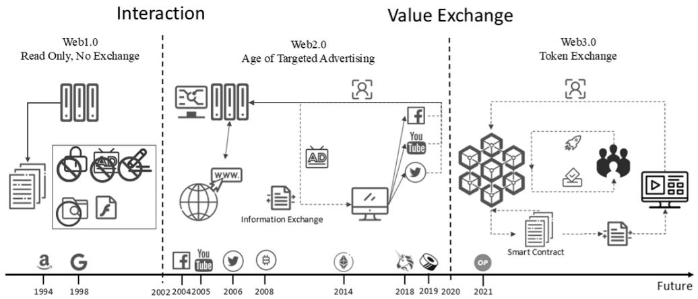
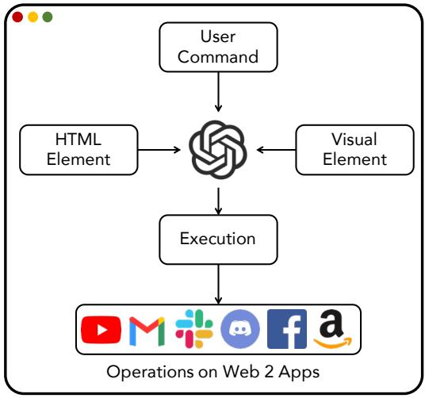
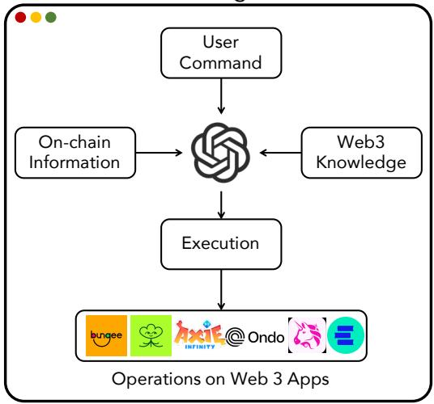

[← 返回 README](../README.md)

# 2 Related Works

## 📌 预览
Related Work 覆盖三个方面：Web3 架构演进（Web1→Web2→Web3）、Web Agent 从 Web2 到 Web3 的范式转变、以及 RAG 技术在知识增强中的应用。作者通过对比 Web2 Agent 和 Web3 Agent 的差异，明确了 Web3Agent 系统的技术定位。

---

## 2.1 Web3 Architecture

As shown in Figure 1, the period from 1990 to 2004 is widely known as the era of Web 1.0, characterized by static webpages with content served from file systems rather than databases. User

*Fig. 1. The development of the web.*

interaction was minimal—there were no logins, comments, or personalized services—leading to its description as a "read-only" web. Most websites were non-commercial, and the Internet functioned more as a linked information repository than a participatory platform. Technological advances such as Flash and JavaScript gradually introduced limited interactivity, but users remained primarily content consumers.

Web 2.0, emerging around 2004, marked a shift toward user-generated content and interactive services. Platforms like Facebook, YouTube, and Google began collecting user data to personalize content and enable targeted advertising. While users became active participants, this era also brought concerns over privacy and data centralization, as control over content and infrastructure became concentrated in a few large corporations.

Web3 represents a decentralized alternative, built on blockchain technology. It replaces centralized servers with distributed networks and intermediaries with SCs. Governance and decision-making are handled by decentralized autonomous organizations (DAOs), enabling community-led development through token-based voting. Web3 aims at restoring user ownership over data, identity, and digital assets, fostering a more open and trustless Internet ecosystem.

> 💡 **Web 演进概述**: Web1→Web2→Web3 的三段式描述非常经典，几乎所有 Web3 论文都这样写。作者的叙述简洁但不深——例如没有提到 Web3 的具体技术栈（如以太坊的 EVM、共识机制等）。这一节更像是为非区块链读者提供的背景铺垫，对 ACM TWEB 的读者群来说是合理的。值得注意的是 Figure 1 用了一张时间线图来可视化 Web 演进，直观但信息密度不高。

## 2.2 Web Agents: From Web2 to Web3

Figure 2 presents a high-level comparison between Web2 and Web3Agents, highlighting their architectural differences and operational modalities. In Web2 settings, agents operate by interpreting HTML-based visual interfaces and executing user tasks on centralized applications. Web2 agents are typically deployed within browser-based environments to complete user-specified tasks, a problem commonly referred to as the Web Navigation Problem [14]. These agents translate natural language commands into executable steps and simulate user interactions to perform tasks such as form-filling, email composition, and online shopping. To function in real-world scenarios—where web pages are often noisy and structurally dynamic—agents must understand interface layouts, generalize across related tasks, and adapt to unseen configurations [2, 45].

Early methods trained agents using reinforcement learning (RL) to imitate human behaviors in simulated environments [28, 41]. However, RL-based agents struggled with real-world HTML due to limited semantic reasoning. To address this, recent work incorporates large language models for structured parsing and decision making. For example, Mind2Web [6] leverages HTML-specialized LLMs to interpret page structure and predict actions, while WebGum [14] integrates LLMs with visual encoders for multimodal perception of complex web environments.

> 💡 **Web2 Agent 综述**: 这段对 Web2 Agent 的描述涵盖了从 RL（WebShop [41]、WebGPT [28]）到 LLM（Mind2Web [6]、WebGum [14]）的技术演进。关键区别是：Web2 Agent 操作的是 **HTML DOM + 视觉界面**，本质上是模拟人类点击；而 Web3 Agent 需要操作的是 **API + 链上状态**，是程序化交互。这个范式差异是 Web3Agent 区别于现有 Web Agent 工作的核心论据。

*Web2 Agents*

*Web3 Agents*

*Fig. 2. Web2 agent and Web3Agent.*

Unlike their Web2 counterparts, Web3Agents operate within decentralized and trustless ecosystems. As shown in Figure 2 (right), these agents rely on on-chain data and domain-specific blockchain knowledge—including SCs, wallet protocols, and decentralized identity (DID) systems [23, 26] to execute tasks such as token swaps [12], governance voting [11], or SC invocation [13]. They do not simulate clicks on visual interfaces, but instead reason about blockchain states and programmatic APIs.

This shift in paradigm is aligned with the broader Web3 architecture, which includes dApp frontends, decentralized storage, and programmable SCs on chains like Ethereum or Solana. Tools like MetaMask act as secure bridges for transaction signing and identity verification. The backend is often enhanced by AI-driven services or decentralized protocols. As a result, Web3Agents must be not only semantically capable, but also transaction-aware, context-sensitive, and safe-by-design.

> 💡 **Web3 Agent 的独特挑战**: 这段精准地总结了 Web3 Agent 与 Web2 Agent 的根本差异——不是模拟点击，而是推理链上状态和调用 API。作者提出的三个要求（transaction-aware, context-sensitive, safe-by-design）很好地预示了后续系统设计中的 Controllable Calibration（安全）、Previous Action Description（上下文感知）和 Action Prediction（交易意识）模块。

Although no standardized framework for Web3Agents exists, foundational tools such as Web3.py and Ethers.js have enabled programmable SC interaction. Additionally, recent works explore combining LLMs with blockchain APIs to support natural language to contract translation, semantic retrieval of chain data, and wallet operation guidance.

To bridge this gap, our work introduces the first systematic framework for LLM-powered Web3Agents. Our system, Web3Agent, integrates capabilities such as instruction decomposition, dynamic API state interpretation, historical action summarization, and controllable action prediction. It enables a fully autonomous loop from natural language input to safe, multi-step blockchain execution—providing a foundation for scalable, secure, and generalizable Web3-native agents. In contrast to prior API-grounded LLM frameworks, Gorilla focuses on single-step code synthesis for individual APIs, without multi-task planning or dynamic environment adaptation. API-Bank extends this to multi-step execution by decomposing static Web2 tasks into API calls via a plan–retrieve–execute pipeline, yet operates over a fixed API set and does not incorporate real-time state changes. Sy-Hong-Duc Nguyen et al. [29] implements a multi-agent collaborative prototype that uses natural language to drive blockchain API queries and basic operations, but it targets comparatively simple tasks and does not provide cross-chain reasoning, dynamic multistep planning, or robustness mechanisms. Web3Agent, by comparison, is designed for dynamic, stateful Web3 environments: its execution logic performs semantic-to-API translation coupled with on-chain state grounding, its chunk granularity explicitly separates high-level operations (e.g., cross-chain swap) from atomic API calls, and its grounding fidelity ensures each execution step reflects live blockchain conditions such as account balances, gas fees, and transaction confirmations. Furthermore, Web3Agent augments execution reliability through RAG-based knowledge retrieval, execution-time verification, and error-recovery routines, substantially increasing its capacity to handle complex, multi-step, and time-sensitive on-chain tasks that the above systems were not designed to address.

> 💡 **与现有工作的对比**: 这段是 Related Work 中最重要的部分。作者将 Web3Agent 与三类先前工作对比：
> - **Gorilla**: 单步 API 代码生成，无多步规划
> - **API-Bank**: 多步执行但 API 集合固定，无实时状态适应
> - **Nguyen et al. [29]**: 多 Agent 区块链原型，但只做简单任务，无跨链推理
>
> 对比维度包括 execution logic、chunk granularity、grounding fidelity，非常系统化。不过 Gorilla 和 API-Bank 并不是 Web3 领域的工作，这说明 Web3 Agent 系统级工作确实稀缺，也侧面证明了 Web3Agent 的首创性。值得质疑的是：作者在这里声称 "first systematic framework"，但没有引用 Gorilla 和 API-Bank 的具体文献编号（可能在正式版中有），使得这个 claim 的可验证性稍弱。

## 2.3 Retrieval-augmented Generation

Retrieval-Augmented Generation (RAG) has emerged as a prominent technique for enhancing language models with external knowledge. A typical RAG pipeline consists of a document database, a retriever to identify relevant content, and a mechanism to incorporate retrieved passages into the language model's context. Prior work has demonstrated the effectiveness of RAG systems in open-domain QA [21], biomedical reasoning [30], and tool-augmented agents [27]. More recent efforts explore modular and agent-based RAG frameworks [20, 42], where retrieval is dynamically invoked and aligned with intermediate reasoning steps.

Several RAG enhancements have been proposed, including a priori prompting, which guides the retriever using latent task structure [36], and a posteriori prompting, where retrieved evidence is verified post hoc to detect hallucinations [27]. Active RAG [36] further re-generates queries or answer tokens in response to uncertain or low-confidence predictions. In parallel, retrieval methods continue to evolve: traditional keyword or sparse retrieval (e.g., BM25 [34]) is increasingly complemented or replaced by dense retrieval using pre-trained embeddings (e.g., text-embedding-ada-002) and learned ranking models [18].

> 💡 **RAG 技术综述**: 作者对 RAG 的综述比较全面，覆盖了从基础 RAG（Lewis et al. [21]）到模块化 RAG（PaperQA [20]、ReAct [42]）再到增强策略（a priori/a posteriori prompting、Active RAG）。但引用 [36] 同时被标注为 "a priori prompting" 和 "Active RAG"——实际上 [36] 是 HELM（Holistic Evaluation of Language Models），这两个概念可能不准确地归因了。这段的核心作用是为 Section 4.2 的 Domain-specific RAG 设计提供理论基础。

In our work, we adopt a modular, instruction-driven RAG framework tailored to the Web3 execution domain. We design domain-partitioned semantic chunk stores, indexed using vector embeddings and filtered with metadata-based routing. Each sub-module (e.g., Instruction Chain Generator or Action Prediction) queries only its relevant chunk types (e.g., operation, API spec, error patterns), ensuring prompt relevance and reducing retrieval noise. Our design is closely related to structured RAG pipelines [20], but differs by incorporating domain-specific execution logic and external Web3 APIs.

> 💡 **Web3Agent 的 RAG 定位**: 最后一段把 Web3Agent 的 RAG 方案与通用 RAG 区分开来——关键创新是 **domain-partitioned chunk stores**（操作块、API 块、错误块的三分法）和 **metadata-based routing**（每个模块只查询相关类型的 chunk）。这种设计避免了检索噪声，在后续 ablation study 中证明了去掉 operation chunks 会导致性能大幅下降。不过这种分区设计也意味着系统对新类型的 Web3 操作缺乏灵活适应能力——需要人工创建新的 chunk 类型。
