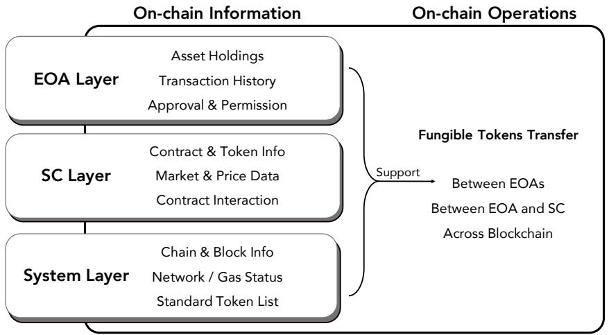

[← 返回 README](../README.md)

# 3 Operations on Web3

## 📌 预览
本节系统性地分类了 36 种链上交互：31 种查询操作（只读）和 5 种链上操作（状态修改）。查询操作分为三层（System / EOA / SC），链上操作聚焦于可替代代币的转移与管理（同链 EOA 间、EOA 与合约间、跨链）。

---

Blockchain-based systems support a wide variety of on-chain interactions. In this study, we categorized a total of 36 interactions into two fundamental types: Query On-Chain Information (31) and On-Chain Operations (5). Querying on-chain information is an essential prerequisite for safely and effectively conducting on-chain operations, as users and decentralized agents must rely on up-to-date blockchain states to make informed decisions.

In this section, we systematically classify and describe these two types of operations, which together form the core primitives of interaction within decentralized ecosystems.

> 💡 **操作分类体系**: 31:5 的查询与操作比例很有意思——说明 Web3 交互中绝大多数是**读取操作**（余额查询、价格查询、权限检查等），而真正修改链上状态的操作只有 5 种。这反映了区块链的实际使用模式：大量的准备和验证工作，少量的状态变更。这个分类也决定了后续实验中 Query 和 Operation 两类任务的不同评估标准。

## 3.1 Querying On-chain Information

Querying on-chain information (31 entries) refers to read-only interactions with the blockchain to retrieve real-time state data, which are essential for understanding the on-chain environment and

*Fig. 3. Classification of on-chain information query and operations.*

facilitating secure interactions with dApps. Such queries do not modify on-chain records, ensuring system integrity while providing necessary context for subsequent transactions, including token swaps, staking, or SC interactions. In this work, we categorize on-chain queries into three layers, allowing structured access to blockchain data across different system components, as shown in Figure 3.

**System Layer:** Queries in this layer focus on providing global information about the blockchain infrastructure and the system's operational state. These queries are foundational for ensuring system health and facilitating informed decision-making in the blockchain environment. The components of this layer include Supported Blockchains, which provides information about the blockchain networks the system supports, ensuring interoperability between decentralized ecosystems and enabling seamless cross-chain interactions. Another essential component is Pre-Transaction Information, a set of queries that retrieve critical data required for executing a transaction, such as network fees, nonce values, gas prices and gas limits. These queries are vital for preparing transactions, ensuring both efficiency and correctness in processing.

**Externally Owned Account (EOA) Layer:** This layer focuses on user-specific queries related to EOA. It encompasses essential data points that are directly tied to individual users' on-chain activities. The three key operations for assessing and managing a user's blockchain activities include asset holdings, transaction history, and approval and permission checks. The Asset Holdings query retrieves the user's balance of native tokens (e.g., ETH, BNB), ERC-20 tokens, and NFTs (ERC-721, ERC-1155). This is essential for evaluating available balances and ensuring sufficient funds for transactions like token swaps or staking. The Transaction History query provides a detailed record of all transactions, including contract interactions and token transfers, offering transparency and auditability of the user's blockchain activity. Finally, the Approval and Permission query checks the permissions granted by the user to various SCs, particularly token transfer allowances and their remaining balances. This operation is crucial before initiating token swaps, as it ensures the user has granted the necessary permissions for the transaction to be processed.

> 💡 **三层查询架构**: System → EOA → SC 的三层分类很好地映射了区块链的实际结构层次。System 层关注全局状态（gas 价格、支持的链）；EOA 层关注用户个人状态（余额、交易历史、授权）；SC 层关注合约和市场数据。这种分层设计不仅是概念上的梳理，也直接影响了 Web3Agent 的 Instruction Chain 生成——例如执行 swap 前需要先查 EOA 层的余额和授权，再查 SC 层的价格和流动性。

**SC Layer:** The SC Layer focuses on retrieving information related to SCs. This layer is pivotal for enabling complex dApps to interact with users and other system components. The subqueries within this layer include Coin Prices and Project Information, which retrieves real-time coin prices, historical price data, and detailed project information for specific cryptocurrencies, helping users assess market conditions before executing transactions. The Contract and Token Information query provides access to metadata of fungible tokens, including their names, symbols, decimals, and total supply, ensuring that users can verify the characteristics of tokens and contracts before interacting with them. The Market and Price Data query retrieves real-time asset prices, liquidity pool depth, token swap rates, and oracle-based price feeds, which are essential for users to make informed decisions about trading, liquidity provision, and other DeFi activities. Lastly, the Contract Interaction Records query analyzes historical interactions with a given SC, including function calls, event logs, and dApp-specific operational data, such as staking pool activities, providing transparency and helping evaluate the trustworthiness of a contract.

These categorized on-chain queries are fundamental for facilitating DeFi operations, ensuring user safety, and optimizing transaction strategies. For example, before executing a token swap on a decentralized exchange (DEX), it is crucial to verify the user's token balance and ensure that the DEX router has the necessary approval to execute the transaction. Furthermore, querying historical contract interactions helps to assess the reliability of the contract, ensuring users engage only with trusted SCs that are aligned with their intentions.

> 💡 **SC 层的实用价值**: 合约交互记录查询（Contract Interaction Records）是一个特别值得关注的子查询——通过分析历史交互来评估合约可信度，这实际上是 Web3 安全评估的重要手段。不过作者没有详细说明 Web3Agent 如何量化"可信度"，也没有提到是否使用了已有的合约审计工具（如 Slither、Mythril 等）。

## 3.2 On-chain Operations

The core of on-chain operations lies in the transfer and management of value, particularly in the liquidity management of fungible tokens (5 entries). Each operation relies on multiple on-chain queries to ensure the validity, compliance, and security of transactions. The following outlines three key blockchain operations that facilitate the flow of assets within Web3 ecosystems:

**Fungible Tokens Transfer Between Externally Owned Accounts (EOAs).** The transfer of fungible tokens between EOAs represents a fundamental form of value transfer between accounts. This operation begins with querying the asset holdings to ensure that the sending account has sufficient tokens for the transaction. Subsequently, pre-transaction queries, such as network fees and gas prices, are made to ensure the transaction's validity and efficiency. Prior to execution, the system verifies the transaction's nonce value to prevent errors caused by duplicate transactions.

**Fungible Token Transfers Between Users and Smart Contracts on the Same Chain.** In DeFi settings, interactions between users and smart contracts involving fungible token transfers are central to various common operations, including token swaps via DEXs, product subscriptions and redemptions, and reward claiming. These interactions typically require more sophisticated permission checks and function-level validations. Specifically, the system first queries the contract metadata to verify whether the targeted smart contract supports the intended operation and to confirm that the user has granted sufficient token allowance to the contract. Subsequently, pre-transaction information—such as current gas prices and network congestion—is retrieved to construct and broadcast the transaction. This process ensures compliance with both the blockchain network's protocol-level rules and the logic embedded in the smart contract.

> 💡 **操作复杂度递进**: 三种操作的复杂度递进设计合理：EOA→EOA 最简单（余额检查+nonce 验证）；EOA→SC 涉及 approval 和合约逻辑验证；跨链操作最复杂（需要源链和目标链的互操作性验证+跨链桥）。这种分层恰好对应了后续 ablation study 中 Operation 类任务难度显著高于 Query 类任务的实验结果（Task SR: 80.3% vs 94.1%）。

**Fungible Tokens Transfer Across Blockchains (Cross-Chain Interoperability).** Cross-chain transfer refers to the flow of assets across different blockchains, enabling dApps to interact within a multi-chain ecosystem. Web3Agent currently supports cross-chain operations across a wide range of networks, including major EVM-compatible chains such as Ethereum, BNB Smart Chain, and Avalanche C-Chain; leading Ethereum Layer-2 networks such as Arbitrum One, Optimism, zkSync Era, Base, and Polygon zkEVM; as well as prominent non-EVM chains including Solana and Sui. Before initiating the operation, the system queries the interoperability of both the source and target blockchains and retrieves the necessary pre-transaction data. Through a cross-chain bridge, tokens are locked on the source chain and a corresponding token is minted on the destination chain, completing the cross-chain asset transfer.

> 💡 **跨链支持范围**: Web3Agent 支持的链相当广泛——不仅包括 EVM 兼容链（Ethereum、BNB、Avalanche），还包括 L2（Arbitrum、Optimism、zkSync、Base、Polygon zkEVM）和非 EVM 链（Solana、Sui）。这说明系统不是针对单一链设计的，而是有一定的通用性。但跨链桥的安全性是 Web3 中最大的风险点之一（如 2022 年 Ronin Bridge 被黑 6.25 亿美元），作者在 Discussion 中没有充分讨论跨链操作的安全风险。

These operations not only represent the mechanism of value transfer within blockchain networks but also ensure the liquidity and security of tokens across different environments. As the Web3agent system, based on LLMs, continues to develop, it will expand to include operations for more complex asset types, such as NFTs, providing users with broader dApp interaction capabilities.
