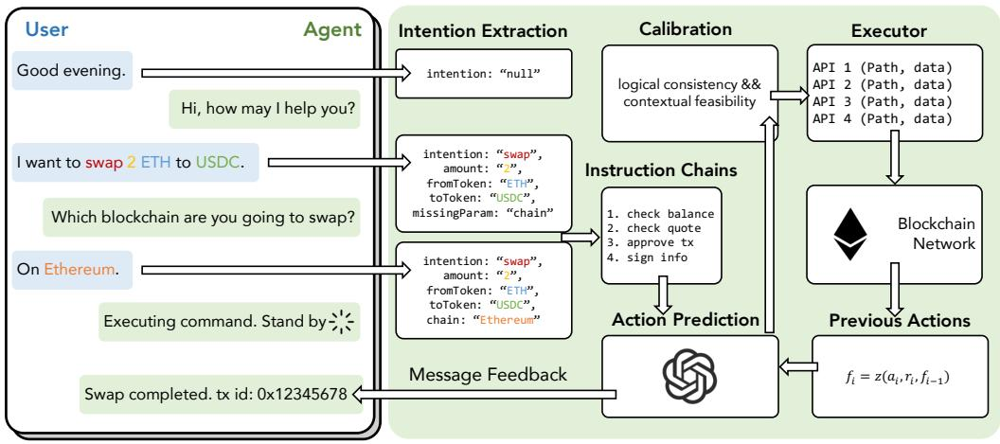
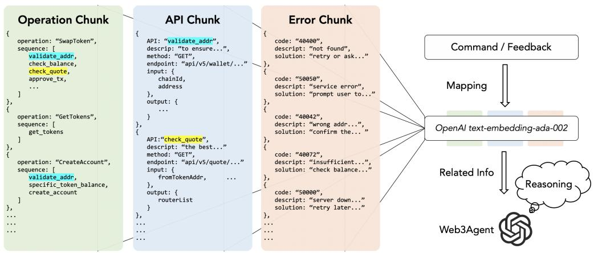
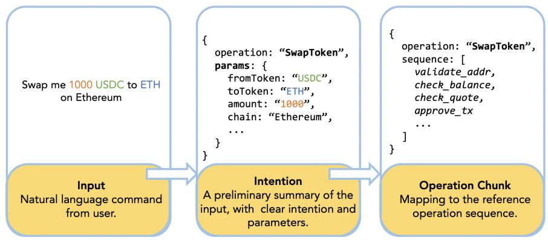
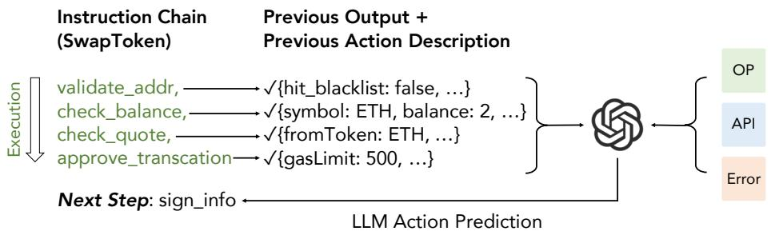

[← 返回 README](../README.md)

# 4 System Overview and Methodology

## 📌 预览
Web3Agent 的核心架构：六模块流水线（Chatbot/Intent → Instruction Chain → Previous Action Description → Action Prediction → Controllable Calibration → Executor），配合三类 RAG 知识源（Operation/API/Error Chunks）。本节逐一详解每个模块的功能、数学形式化和技术细节。

---

Web3Agent is an intelligent agent system powered by LLMs, designed to autonomously execute complex, multi-step tasks in decentralized blockchain environments. By simulating authentic user interactions with dApps, the system is capable of performing a wide range of on-chain operations such as token approvals, asset swaps, staking, and transaction signing in a fully automated manner.

*Fig. 4. Architecture of intelligent virtual Web3 assistants.*

As shown in Figure 4, the end-to-end workflow of Web3Agent can be abstracted into four high-level stages: intent understanding, instruction decomposition, context-aware reasoning, and action execution. To implement these stages, the system adopts a six-module architecture derived from a functional decomposition of the agent execution lifecycle, particularly tailored for complex, stateful, and multi-step API tasks in real-world Web3 environments. Each module serves a distinct computational role and communicates with others via standardized data interfaces to ensure modularity, interpretability, and error isolation.

— Chatbot and Intent Extraction: Parses the user's natural language input into structured sub-tasks, capturing the core intent and parameters for subsequent processing.

— Instruction Chains Generator: Decomposes each sub-task into a sequence of semantically aligned atomic operations, enabling modular execution across heterogeneous APIs.

— Previous Action Description Generator: Translates prior execution history into symbolic natural language summaries, providing temporal grounding for context-aware reasoning.

— Action Prediction: Integrates task intent, instruction steps, execution history, and on-chain context to infer the next appropriate on-chain action. It also incorporates error feedback and candidate constraints to support robust decision making.

— Controllable Calibration: Validates the predicted action for logical consistency and contextual feasibility before execution, serving as a safeguard against hallucinations or invalid operations.

— Executor: Executes the validated action via real-time API calls and returns normalized feedback, including success responses or error signals for downstream recovery and adaptation.

> 💡 **六模块架构评价**: 这个架构设计体现了清晰的关注点分离原则。六个模块可以大致映射到经典 Agent 架构的三阶段：感知（Chatbot + Intent）、规划（Instruction Chain + Action Prediction）、执行（Calibration + Executor）。特别值得注意的是 **Previous Action Description Generator** 的引入——它不是简单记录历史，而是用 LLM 将执行历史翻译成自然语言摘要，为后续推理提供语义上下文。这种设计比直接将 API response JSON 拼入 prompt 更高效，也更符合 LLM 的处理方式。不过整个系统只用一个 LLM 实例完成所有推理任务（而非多 Agent），这在简化系统复杂度的同时也限制了并行处理能力。

To illustrate the end-to-end data flow of Web3Agent, we take the example of swapping 1000 $USDC for $ETH on Ethereum. The user's natural language request is progressively processed through intent extraction, instruction decomposition, action prediction, and controllable calibration, before being executed as a validated API call by the Executor. The blockchain network then returns a normalized JSON response (e.g., transaction hash, status flag, or error code), which is logged into the system's action history and reintegrated into the reasoning context. Throughout this workflow, structured JSON exchanges mediate inter-module communication, thereby ensuring transparency, modular coordination, and robust error recovery across the Web3 execution pipeline.

A key technical innovation of Web3Agent lies in its integration of a domain-specific, modular RAG mechanism. Rather than relying solely on the LLM's parametric knowledge, the system dynamically retrieves task-relevant external information from multiple semantically partitioned vector databases. Specifically, it maintains three dedicated knowledge sources: (1) operation chunks encoding standardized workflows for high-level tasks such as "SwapTokens" or "StakeAssets"; (2) API chunks describing the parameter structure and functionality of Web3 API endpoints; and (3) error chunks containing known failure codes and recovery strategies. These retrieved contents are selectively integrated into the LLM's input prompt to enhance factual grounding and reduce hallucinations during reasoning. Unlike multi-agent or multi-LLM systems, Web3Agent adopts a streamlined architecture where a single general-purpose LLM performs all reasoning tasks, while retrieval modules function as lightweight knowledge routers.

Through the coordination of modular components and knowledge-augmented reasoning, Web3Agent delivers end-to-end automation for user-specified blockchain operations, addressing the procedural complexity and high technical barriers that are prevalent in decentralized financial ecosystems.

## 4.1 Notations and Definitions

In this section, we provide the key definitions used throughout the article to formalize the components of Web3Agent.

**Definition 1 (action).** Let $\mathcal{A}$ denote the action space. For any action $a \in \mathcal{A}$, we define it as $a = f(o, \nu)$. Here, $o$ represents the target object of the action, which is typically an actionable element identified from API responses (e.g., a contract address, token address, or transaction endpoint). $\nu$ denotes the value associated with the action, and $f$ is the function that defines the type of action, where $f \in$ {approve, swap, stake, transfer, input}. Only actions of type input require a specific value $\nu$, such as the amount to swap.

**Definition 2 (API state).** The API state refers to the structured response data returned from interacting with blockchain endpoints, including wallet balances, approval statuses, pool information, gas estimates, and error codes. Formally, the API state at step $i$ is denoted as $s_i$, and serves as the primary environment context for action prediction and validation. The API state $s_i$ can be decomposed as:

$$s_i = \{\text{status}, \text{data}, \text{error}\}$$

where status indicates the success or failure of the previous API call, data contains relevant blockchain state (e.g., balances, pool data), and error contains any error messages or codes returned by the blockchain interface. This differs from page-based content as all actionable context is derived directly from API interactions rather than UI elements.

> 💡 **形式化定义**: 作者的形式化定义简洁但有效。Action 被定义为 $a = f(o, \nu)$，其中 $f$ 的类型空间很小（仅 5 种），这说明 Web3Agent 的操作原语是有限且可枚举的。API State 的三元组分解 {status, data, error} 也很实用。不过需要注意的是，与 Web2 Agent 的 page state（DOM 元素、截图等）不同，这里的 state 完全来自 API 返回值——这是 Web3 Agent 和 Web2 Agent 的本质技术差异。

**Definition 3 (Candidate Action Elements).** During action prediction, we define a candidate set of possible next actions, denoted as $C_i$, which consists of a fixed set of four action types—Next Step, Retry, Go Back, and Interrupt. At each execution point, the model selects one action from $C_i$ based on the current task status, history actions, and API state $s_i$. These candidate actions are all grounded in the previously generated instruction chains: Next Step advances to the subsequent instruction in the chain, Retry re-executes the current instruction when failures or unmet conditions occur, Go Back rolls back to an earlier instruction for re-execution or correction, and Interrupt terminates the workflow in unrecoverable cases. The candidate set is explicitly incorporated into the input prompt to guide the prediction process, thereby constraining the reasoning space and reducing the likelihood of hallucinated outputs from the language model.

> 💡 **候选动作集设计**: 将候选动作限制为 {Next Step, Retry, Go Back, Interrupt} 四种是一个巧妙的设计决策。这种约束大幅缩小了 LLM 的生成空间，减少了幻觉风险。本质上，这把 Action Prediction 从一个开放式生成问题转化为了一个**受限选择问题**——LLM 只需要决定"做什么类型的动作"和"作用于哪个对象"，而不是自由生成任意操作。Retry 和 Go Back 的设计特别重要——它们赋予了系统错误恢复能力，这在区块链操作中至关重要（因为 gas 费用、网络拥塞等问题可能导致步骤失败）。

## 4.2 Domain-specific Retrieval-augmented Reasoning

While LLMs exhibit impressive generalization capabilities, relying solely on their parametric knowledge often results in factual inconsistency, hallucination, or inability to generalize across specialized domains such as Web3. To enhance the factual grounding and task specificity of LLM-driven agents, we integrate a modular RAG mechanism into Web3Agent. This mechanism provides dynamic access to external structured knowledge and supports context-aware reasoning across different task stages.

**Chunk Typing and Semantic Partitioning.** A central design principle of our RAG architecture is the use of domain-specific chunk stores, each aligned with a particular semantic function in the agent pipeline. Specifically, we define three major chunk types:

— **Operation Chunks:** encapsulate the canonical execution logic and structural requirements for each high-level Web3 task type (e.g., SwapTokens, StakeAssets, Transfer). Each chunk includes two key components: (1) a detailed specification of required and optional parameters for the task, and (2) a multi-step execution workflow describing the ordered API calls and logical dependencies needed to complete the operation. These chunks serve as schema-aligned retrieval units in the Chatbot and Intent Extraction and Instruction Chains Generator module, enabling the model to produce structured and executable plans grounded in task semantics.

— **API Chunks:** Represent structured descriptions of Web3 APIs, including endpoint names, required parameters, data types, response parameters, and sample payloads. These are accessed during Action Prediction for parameter alignment and interface compliance.

— **Error Chunks:** Contain mappings between common blockchain error codes (e.g., insufficient_funds, approval_required) and their semantic interpretations, along with recommended resolution strategies. These chunks are retrieved and utilized by the Previous Action Description Generator module to support failure-aware reasoning, generate informative error feedback, and guide fallback or corrective planning.

Each chunk is stored independently to avoid semantic interference and to support selective retrieval based on the downstream task context. This partitioned design enables modularity, interpretability, and domain-aligned retrieval.

> 💡 **RAG 三分法的设计逻辑**: 三种 chunk 类型分别服务于不同模块：Operation Chunks → Instruction Chain Generator（规划阶段）；API Chunks → Action Prediction（执行阶段）；Error Chunks → Previous Action Description Generator（错误处理阶段）。这种**一对一映射**的设计非常干净，避免了检索时的语义混淆。但也有局限——如果一个新的 Web3 协议需要新类型的 chunk（例如治理投票的规则 chunk），系统需要手动扩展。相比 ReAct [42] 那种动态工具调用的方式，这里的 RAG 更偏向于**静态知识库**模式。

**Vector-Based Retrieval with Filtering.** To support efficient and semantically aligned chunk retrieval, we embed all chunk contents into dense vector representations using OpenAI's text-embedding-ada-002 model, which serves as the fixed encoder for all domain-specific vector stores in our system. Given a task-specific query generated during inference, we compute the top-$k$ most relevant chunks via cosine similarity search over the corresponding chunk store. The overall retrieval and reasoning pipeline is illustrated in Figure 5.

*Fig. 5. The RAG architecture of Web3Agent is consist of three parts: Operation chunk, API chunk, and error chunk.*

To further improve retrieval accuracy, especially in multi-domain settings, we incorporate a metadata-aware filtering strategy during retrieval. Each chunk is annotated with a domain tag (e.g., type=api, type=operation) and auxiliary metadata (e.g., supported network, function signature). This allows us to apply domain-level filters or conditional routing when constructing the context window for the LLM. Our retrieval strategy follows best practices from recent retrieval-enhanced frameworks such as RePlug [37] and DSPy [1], but is tailored to Web3 semantics.

**Retrieval-Prompt-Reasoning Integration.** Retrieved chunks are organized into structured prompt segments based on their semantic roles, in other words, only chunk types relevant to the current module are included. For example, the Instruction Chains Generator uses only operation chunks, while Action Prediction incorporates API and error chunks. This routing ensures prompt efficiency and avoids contamination from irrelevant information.

## 4.3 Chatbot and Intent Extraction

The Chatbot and Intent Extraction module constitutes the initial interface of the Web3Agent system, responsible for interpreting natural language user commands and transforming them into structured task representations. Given the inherent ambiguity, diversity, and informality in user expressions—particularly within DeFi and blockchain contexts—this module incorporates multi-turn interaction mechanisms when necessary to elicit and disambiguate user intent.

To perform intent parsing, the module applies entity recognition and semantic pattern extraction techniques to identify key attributes of the task, such as the operation type (e.g., swap, staking, cross-chain), asset symbols, transaction amounts, and target blockchain networks. These attributes are then converted into a standardized intermediate representation, which serves as the formal input to downstream modules.

For instance, given the command "Swap 1000 $USDC to $ETH on Ethereum", the system identifies the operation as a token swap, parses USDC as the source asset, ETH as the target asset, 1000 as the transaction amount, and Ethereum as the execution network. This parsed structure is then encoded into a machine-readable task schema, which guides the subsequent instruction decomposition and execution planning stages.

> 💡 **Intent Extraction 实现细节不足**: 这个模块的描述相对抽象——提到了 "entity recognition and semantic pattern extraction" 但没有说明是通过 prompt engineering 实现还是有专门的 NER 模型。从后续实验来看，整个系统使用 GPT-4 作为唯一推理引擎，所以 Intent Extraction 大概率是通过精心设计的 prompt 来完成的，而非独立的 NLP 模型。这种做法简单有效但可能对模糊输入（如 "帮我搞点 ETH"）的鲁棒性不够。

## 4.4 Instruction Chains Generator

The Instruction Chains Generator module is responsible for constructing a structured, step-wise plan to guide downstream execution. Given the structured user intent produced by the intent extraction module—typically consisting of operation type, asset symbols, amounts, and target blockchain—the system retrieves a matching operation chunk from the vector store to identify a canonical execution workflow, as shown in Figure 6.

*Fig. 6. An example showing the process of phrasing user input into the instruction chain.*

The retrieval process leverages the operation chunk store introduced in Section 4.2. Using the parsed intent as the query, the system performs a semantic similarity search to retrieve the top-ranked chunk corresponding to the specified operation (e.g., SwapTokens). This avoids reliance on hand-coded rules or static templates, and enables the plan to generalize across token pairs, chains, or use cases.

The retrieved operation chunk is then parsed into an explicit instruction chain, which defines the sequence of executable steps needed to complete the task. These steps serve as high-level guides for action prediction and API invocation in later stages. In practice, each instruction chain captures task-specific subtasks such as balance checks, approval handling, quote fetching, transaction construction, and broadcasting. This process is illustrated in Figure 6, which shows how a user's natural language command is transformed step-by-step into a structured instruction chain through intent parsing and operation chunk retrieval.

> 💡 **Instruction Chain 的核心地位**: 从 ablation study 的结果来看，去掉 Instruction Chain Generator 导致 Operation 类任务的 Step SR 从 91.2% 暴跌到 15.2%——这是所有模块中去掉后影响最大的。这说明**多步操作的规划能力**几乎完全依赖于这个模块。它的工作原理本质上是：从向量库中检索出标准操作流程（canonical workflow），然后将其转化为可执行的步骤序列。这种"检索+结构化"的方式比让 LLM 从头生成操作序列要可靠得多。

## 4.5 Previous Action Description Generator

Effective reasoning in multi-step blockchain tasks requires not only a correct high-level plan, but also a coherent representation of execution history. The Previous Action Description Generator module addresses this need by producing natural language summaries of past actions and their outcomes, thereby preserving the semantic continuity of task progression.

This module operates after the instruction chain has been partially or fully executed. At each step $i$, the system maintains a history of executed actions $A = \{a_1, a_2, \ldots, a_{i-1}\}$ and their corresponding API responses $R = \{r_1, r_2, \ldots, r_{i-1}\}$. These elements are used to construct a cumulative summary of task progress. Unlike modules that rely on external knowledge sources via retrieval (see Section 2.X), this component relies solely on internal execution traces.

To formally model this process, we treat multi-step execution as a sequential decision problem. Let $q$ denote the fixed user intent, and $f_{i-1}$ the description of prior steps. The input tuple $(a_i, r_i, f_{i-1})$ is passed to a description generation function $z(\cdot)$, typically implemented via an LLM-based decoder, to produce the updated context:

$$f_i = z(a_i, r_i, f_{i-1})$$

This recursive formulation ensures that the model builds an evolving narrative of what has been done, which informs downstream decision making.

**Example.** Consider a scenario where the agent executes an approval step: approve_USDC → API response: success. The description generator would produce a summary such as: "Successfully approved 1000 USDC for swapping on Ethereum."

> 💡 **递归摘要机制**: $f_i = z(a_i, r_i, f_{i-1})$ 的递归公式很优雅——每一步的描述都基于当前动作、API 响应和之前的累积描述来生成。这意味着随着步骤增加，摘要会不断膨胀。作者没有提到是否有摘要压缩或滑动窗口机制来控制 context 长度。在长链操作（如跨链 swap 可能涉及 10+ 步）中，这可能会导致 prompt 过长。Ablation 结果显示去掉这个模块后 Operation Task SR 从 80.3% 降到 59.4%，说明历史上下文对多步推理确实重要。

*Fig. 7. LLM-based action prediction with execution context.*

These natural language summaries serve two critical roles: (i) they provide interpretable, compact feedback to downstream modules (e.g., Action Prediction), and (ii) they abstract away low-level API semantics while preserving decision-relevant signals.

By maintaining a running, human-readable account of the agent's activity, this module supports better reasoning, reduces ambiguity, and helps enforce consistency across task steps.

## 4.6 Action Prediction

The Action Prediction module serves as the decision core of Web3Agent, responsible for selecting the next executable on-chain action at each step of the task. This decision is based on a rich contextual prompt constructed by integrating multiple sources of information from upstream modules, as shown in Figure 7. Specifically, the input prompt includes: (1) the task description representing the user's intent, (2) the current instruction step derived from the instruction chain, (3) the sequence of previously executed actions, (4) natural language summaries of those actions generated by the Previous Action Description Generator, (5) API responses reflecting the current on-chain state (including both successful outputs and error returns), and (6) the candidate action set that explicitly bounds the model's generation space.

To ensure that the model's predictions remain both accurate and operationally feasible, the candidate set $C_i$ defined in Definition 3 is directly incorporated into the input prompt at each execution point. Rather than relying on open-ended generation, the model performs reasoning over this bounded, instruction-aligned action space, which improves controllability and robustness.

The prompt also retains structured feedback from previously executed steps. In addition to chain state updates such as balances or quotes, it captures failure signals such as contract reverts, RPC errors, or missing approvals. These error responses are parsed from the executor's API return and included in the input context for subsequent prediction. When the Executor module returns an error, the Action Prediction module integrates the associated status code and surrounding context to determine the most appropriate fallback action—whether retrying, going back, skipping, or interrupting the workflow entirely.

> 💡 **Prompt 工程的精髓**: Action Prediction 的 prompt 设计可能是整个系统最复杂的部分——同时整合了 6 种信息源（用户意图、当前步骤、历史动作、动作描述、API 状态、候选集）。这种"万物皆入 prompt"的策略在 GPT-4 的长上下文窗口下是可行的，但 prompt 的组织方式和信息优先级对结果影响很大。作者没有展示具体的 prompt 模板，这是一个遗憾——读者很难复现。Figure 7 给出了高层视图但缺少实际的 prompt 结构细节。

A key feature of this module is its use of RAG to incorporate external knowledge about Web3 API specifications. Prior to prompt construction, the system identifies the current instruction step (e.g., "fetch swap quote") and uses it as a semantic query to retrieve the most relevant API chunk from the vector store. This instruction-driven retrieval ensures that only semantically aligned interfaces—containing endpoint names, required parameters, and expected response fields—are included in the prompt. By embedding the retrieved API specification into the context, the model is equipped with actionable knowledge needed to invoke the correct Web3 function, without memorizing or inferring low-level interface details.

By integrating user intent, execution history, candidate actions, error feedback, and retrieved API specifications, the Action Prediction module enables context-aware and controllable decision making under dynamic blockchain conditions. To ensure reliability, predicted actions are not directly executed, but are first passed to the Controllable Calibration module for validation, as detailed in the next section.

## 4.7 Controllable Calibration

The Controllable Calibration module provides a critical layer of verification to ensure that the action predicted by the language model is both logically valid and contextually feasible before being executed on-chain. Given the possibility of hallucinations or reasoning inconsistencies inherent to LLMs, this module functions as a safeguard to maintain the reliability and safety of autonomous execution in Web3Agent.

Specifically, the calibration process performs two levels of validation: (1) a logical consistency check, which ensures that the predicted action conforms to the predefined instruction chain and respects the sequence of previously executed steps, and (2) a contextual feasibility check, which verifies that the predicted action is executable under the current blockchain state, based on extracted API responses. For instance, an action to initiate a token swap will be rejected if the required approval has not been completed, or if the user's token balance is insufficient.

If the action passes both checks, it is forwarded to the Executor module for simulated execution and final dispatch. If either check fails, the action is returned to the Action Prediction module, triggering a re-prediction process. This mechanism ensures that only semantically sound and executable actions proceed to actual blockchain interaction, thereby enhancing the overall robustness and trustworthiness of the system.

> 💡 **Calibration 的有限影响**: 有趣的是，ablation study 显示去掉 Calibration 模块后性能下降最小（Operation Step SR: 78.3% vs 91.2%）。这可能说明 GPT-4 的推理能力已经足够强，很少生成逻辑不一致的动作。但作者在 Discussion 中正确指出，Calibration 在**真实链上环境**中的价值远大于模拟环境——因为链上操作不可逆，一次错误的 swap 可能导致实际资金损失。这是一个"模拟 vs 真实"评估差距的典型案例。

## 4.8 Executor

The Executor module is responsible for performing actual interactions with blockchain infrastructure based on the action plan validated by prior modules. Unlike upstream components that involve language models or reasoning, this module focuses purely on executing API calls, collecting execution results, and recording system-level responses for subsequent feedback loops.

Given an action that has passed validation, the Executor encodes the action into a standardized API request and dispatches it to the corresponding Web3 service or SC endpoint. Upon receiving a response, the module extracts relevant information, including (1) a status indicator (e.g., success or failure), (2) structured response data (e.g., transaction hash, gas usage, pool state), and (3) error codes and messages, if applicable. All outputs are then normalized into a unified schema and passed back to the system.

This execution feedback serves two primary purposes: (i) it updates the on-chain state context for the next decision cycle, and (ii) it provides semantic grounding for the natural language summaries generated by the Previous Action Description module. In cases where dry-run or simulation interfaces are available (e.g., static call APIs), the Executor can also operate in a non-committal mode to pre-validate transactions before actual broadcast.

By decoupling action reasoning from execution and exposing a uniform interface for blockchain invocation, the Executor ensures safe, consistent, and auditable integration of language-based planning with low-level transactional infrastructure.

> 💡 **Executor 的设计哲学**: Executor 是整个系统中唯一不使用 LLM 的模块——它纯粹是一个 API 调用执行器。这种"推理与执行分离"的设计是合理的：LLM 负责思考做什么，Executor 负责机械地执行。dry-run 模式（通过 static call 预验证）是一个很好的安全特性，可以在不消耗 gas 的情况下检查交易是否会成功。但作者没有详细说明 Executor 如何处理超时、重试逻辑、以及并发请求的情况。
