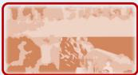

[← 返回 README](../README.md)

# 1 Introduction

## 📌 预览
动机来自 mental imagery 认知理论：人类推理时用简化草图而非照片级画面。Mirage 让 VLM 在 latent space 做同样的事。

---

Vision–language models (VLMs) jointly encode images and text and attain impressive results on visual-understanding benchmarks through text-only decoding [Wang et al., 2024]. Techniques such as chain-of-thought prompting and reinforcement-learning fine-tuning can lengthen these textual reasoning traces and yield extra gains. Nonetheless, VLMs still stumble on multimodal reasoning tasks such as spatial reasoning, which demand more than passive perception; they require a coherent understanding and manipulation of visual elements.

> 💡 **批注**: 开篇指出 VLM 的根本矛盾：输入是多模态的（图+文），但输出/推理只有文本。CoT 只是让文字链更长，并没有解决"视觉推理"的本质需求。

---

Consider the jigsaw puzzle in Fig. 1. Instead of textualizing every candidate piece, people picture how the two fragments might align and decide on the correct match. This reasoning unfolds in a native multimodal fashion, not through language alone. Recent studies [Team, 2024, Tong et al., 2024, Chern et al., 2024, Chen et al., 2025] have pre-trained VLMs for large-scale image generation so a single model can produce both words and pictures. Yet the cognitive demands of logical reasoning differ sharply from the task of synthesizing pixels, and asking one model to master both goals often degrades its reasoning quality [Wang et al., 2025]. In addition, the image decoders cannot produce interleaved trajectories pertinent to input images. Consequently, fully exploiting the dormant multimodal reasoning capacity of VLMs remains an open challenge.

> 💡 **批注**: 
> - 统一模型（如 Chameleon）的问题：像素生成和逻辑推理目标冲突，"asking one model to master both goals often degrades its reasoning quality"
> - 另一个问题：image decoder 无法生成与输入图片相关的 interleaved trajectories（生成的是独立图片，不是推理过程中的视觉线索）

---

*Figure 1: Multimodal Reasoning Examples. Mirage interleaves latent visual tokens with explicit text tokens to solve diverse spatial reasoning multimodal tasks.*

> 💡 **Figure 1 批读**:
> - 展示三个任务：Spatial Planning（迷宫导航）、Jigsaw（拼图补全）、SAT（空间关系推理）
> - 关键模式：文本推理 → `<latent>` tokens（4个） → 继续文本推理 → 最终答案
> - Latent tokens 不可见（不解码为图片），但它们在 hidden state 层面编码了视觉信息
> - 注意：每个示例只用 4 个 latent token（k=4），非常紧凑

---

According to imagery theory, humans do not summon photorealistic pictures while thinking. We instead construct and manipulate mental images, simplified sketches that capture only task-relevant information, a process known as mental imagery [Shepard and Metzler, 1971, Farah, 1985, Kosslyn, 1996]. In the jigsaw example, we examine fragment contours to decide whether two pieces fit. Likewise, when searching for misplaced keys, we recall the outline of the shelf edge rather than the full room. Inspired by this behavior, we ask whether VLMs can reason directly in their latent visual embedding space, weaving compact visual embeddings into the text stream and dispensing with the need for explicit image generation.

> 💡 **批注**: 
> - **Mental imagery 理论核心**: 人类心理意象是"simplified sketches that capture only task-relevant information"，不是照片级回忆
> - 这个类比很精准——Mirage 的 latent token 就是 4 个压缩向量，不是完整图片
> - **与 VisMem 的对比**: VisMem 也受 human memory 启发，但用的是心理学的 short-term/long-term memory 框架；Mirage 用的是 mental imagery 框架。两者都在 latent space 操作，但设计哲学不同

---

To this end, we present Mirage, a decoding mechanism that interleaves latent visual representations among text tokens. Prior studies have shown that LLMs can reason directly within the latent space. Building upon this insight, in our Mirage framework, when the model chooses to reason visually by producing a special token, it then reuses its current hidden state as a compact visual embedding and appends it to the context, skipping the language projection. These internal embeddings furnish focused visual cues for later reasoning steps. As illustrated in Fig. 1, Mirage yields a chain-of-thought trajectory without any external image decoder.

> 💡 **核心机制详解**:
> - 触发方式：模型生成一个 special token（`<latent>`）
> - 执行方式：此时**不经过 language head**（lm_head / output projection），而是直接取最后一层 hidden state
> - 这个 hidden state 被当作下一个 token 的 embedding 插入上下文
> - **关键洞察**: 在 VLM 中，图片也是经过 vision encoder → projector → embedding 变成 token 的。Mirage 的 latent token 本质上就是在模拟这个过程，只不过来源是 LLM 自己的 hidden state 而不是外部 vision encoder
> - **与 Coconut (ICLR 2025) 的关系**: Coconut 也是在 latent space 推理（LLM hidden state 直接作为下一步输入），但 Coconut 是纯文本 LLM。Mirage 把这个思路扩展到了多模态

---

As illustrated in Fig. 2, we adopt a two-stage fine-tuning paradigm to equip the model with interleaved reasoning. In the first stage, with annotated interleaving trajectories, we supervise both modalities: the model predicts the next word while reconstructing a compact latent visual vector obtained from compressed image embeddings. This dual objective anchors the latent tokens in the visual subspace and teaches the model to weave visual cues into its output.

The second stage removes direct supervision on the latent vectors and optimizes only the text tokens, letting the model treat its autoregressively generated latent embeddings as priors that guide subsequent word generation. This relaxation yields a more flexible interleave reasoning trajectory without forcing the latent channel to match any predetermined embedding. After these two stages, we apply reinforcement learning to further boost the reasoning performance.

> 💡 **两阶段训练总结**:
> - **Stage 1 (Joint Supervision)**: text loss + cosine loss on latent tokens → 确保 latent token 落在视觉子空间
> - **Stage 2 (Text-Only Supervision)**: 只有 text loss，但梯度通过 latent tokens 反传 → latent token 自由适应任务目标
> - **为什么需要两阶段？** 只有 Stage 1 → 过度约束（latent token 被迫完美重建图片 embedding，分散了推理能力）；只有 Stage 2 → latent token 漂移到无意义区域（没有视觉锚点）

---

Extensive experiments and superior performance across multiple benchmarks demonstrate that our proposed Mirage significantly enhances the reasoning ability of VLMs compared with text-only decoding. More concretely, our contributions are threefold,

- We introduce Mirage, which enables VLMs to generate interleaved reasoning trajectories that mix latent visual tokens with ordinary text, without relying on external visual decoders.
- Our two-stage training paradigm empowers VLMs to produce stable yet flexible interleaved reasoning and shows that reinforcement learning can further boost performance.
- Mirage achieves consistent gains across diverse multimodal reasoning benchmarks. Further analysis reveals that the latent tokens embody meaningful visual cues, underscoring the potential to unlock deeper multimodal reasoning capabilities in VLMs.

> 💡 **贡献总结**:
> 1. 机制创新：latent visual token（hidden state 复用）
> 2. 训练创新：两阶段 SFT + RL
> 3. 实证验证：多 benchmark 一致提升 + t-SNE 证明 latent token 确实编码视觉信息

---

## 🔖 Section 总结

### 核心洞察
1. **问题定位精准**: VLM 的推理瓶颈不在感知，而在于推理过程中缺乏视觉操作能力
2. **Mental imagery 类比**: 人类不生成照片，而是用简化草图推理 → latent token 模拟这一过程
3. **技术关键**: hidden state 直接当 visual embedding 用，跳过 lm_head → 最轻量的"图片生成"
4. **与统一模型的差异**: Chameleon/Anole 要生成像素 → 重（大量预训练）且伤推理；Mirage 只在 embedding 空间操作 → 轻且不伤推理
