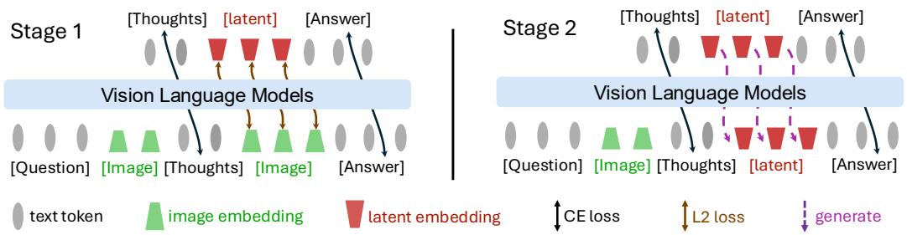
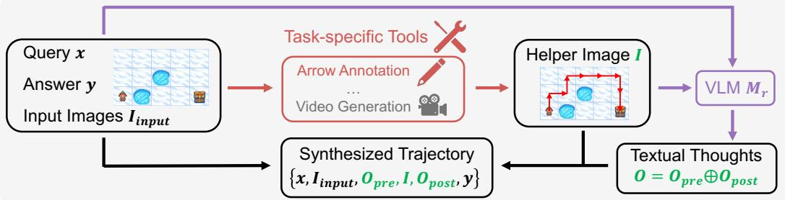

[← 返回 README](../README.md)

# 3 Multimodal Reasoning with Latent Visual Tokens

## 📌 预览
Mirage 的核心方法：(1) 合成含 helper image 的 interleaved 推理数据；(2) Stage 1 联合监督——cosine loss 锚定 latent token 到视觉子空间；(3) Stage 2 纯文本监督——梯度回传让 latent token 自由适应任务；(4) GRPO 强化学习。

---

Inspired by the cognitive process of mental imagery, we introduce Mirage, a framework that lets VLMs reason in interleaved multimodal trajectories. In contrast to prior unified models that integrate an external image decoder and pre-train on large-scale image generation, our method generates compact latent embeddings that serve as visual tokens. By sidestepping image generation, the model can devote its capacity to reasoning, producing only the essential visual cues and thereby echoing the concise, sketch-like representations humans employ during reasoning.

> 💡 **Section 概览**: 核心思路——不生成图片，只在 embedding 空间生成"视觉草图"。三个子节：
> 1. Sec 3.1: 如何造训练数据（helper image + interleaved reasoning chain）
> 2. Sec 3.2: Stage 1 — 联合监督（text CE loss + visual cosine loss）
> 3. Sec 3.3: Stage 2 — 纯文本监督（去掉 cosine loss，梯度通过 latent token 回传）

---

*Figure 2: Pipeline of Mirage Framework. Stage 1 jointly supervises text and latent visual tokens, grounding the latter in the visual subspace; Stage 2 drops the latent supervision, anchoring the grounded latent tokens for subsequent text generation.*

> 💡 **Figure 2 批读**:
> - **Stage 1 (左)**: 输入 x → 模型生成 $o_{\text{pre}}$（文本）→ 生成 latent tokens（用 cosine loss 对齐到 GT image embedding）→ 生成 $o_{\text{post}}$（文本）
> - **Stage 2 (右)**: 同样流程，但 latent tokens 没有直接 loss，只通过 $o_{\text{post}}$ 的 text loss 反传梯度
> - 关键区别：Stage 1 的 latent token 用 GT image embedding 监督（蓝色虚线），Stage 2 的 latent token 是模型自己生成的（红色箭头）

---

In this section, we first explain how we synthesize informative multimodal reasoning data (Sec. 3.1). Next, we introduce our first joint supervision training stage in Sec. 3.2. Finally, we explain the second stage, which applies text-only supervision while relaxing the latent constraints (Sec. 3.3).

---

## 3.1 Data Generation

> 💡 **3.1 要点预览**: 如何合成 interleaved 推理数据？关键是先为每个任务造一张 helper image，然后让大模型生成包含该图片的推理链。

---

Consider the multimodal reasoning task where the VLMs need to generate responses $y$ to the input that consists of one or more images and a textual query. For simplicity, we denote the input that contains both image and text as $x$.

Given VLMs naturally generating text tokens only, they require additional supervised fine-tuning to learn an interleaved reasoning pattern. We therefore begin by synthesizing a training corpus that pairs each input $x$ with a task-specific helper image $I$ (See Fig. 3). For example, in the navigation task, the helper image can be generated by taking the ground truth action list and manually drawing the corresponding path on the starting map with red arrows. Similarly, for the jigsaw task, we can concatenate the candidate fragments to form a composite image that captures the relationship among pieces. More details on the image generation procedures for different tasks can be found in the supplementary materials. In general, we obtain a help image that delivers precisely the visual cues needed to supervise latent reasoning.

> 💡 **批注**: Helper image 的设计很巧妙——每个任务定制不同的"辅助图片"：
> - 迷宫导航 → 在地图上画红色箭头路径
> - 拼图 → 把候选碎片拼接到参考图旁边
> - SAT → 用 CogVideoX-5B 视频生成模型渲染目标视角
> - COMT → 直接使用数据集自带的 interleaved 轨迹
> 
> 这些 helper image 本质上是"推理时需要的视觉线索"，训练时用来监督 latent token 应该编码什么信息。

---

With the helper image $I$ prepared, we next synthesize a reasoning chain where the LLM incorporates the helper image to generate the final solution. Specifically, we first feed a large reasoning VLM $M$ with the original input $x$, the ground-truth answer $y$, and the helper image $I$ and prompt it to generate a step-by-step reasoning that incorporates the helper image. For example, the prompt can be *Generate a step-by-step reasoning that leads to the ground-truth answer while properly incorporating the helper image in reasoning.* Denote the model response as

$$
o = M(x, y, I).
$$

Here $o$ is a step-by-step reasoning with the helper image embedded in the reasoning process. Since the helper image is embedded in the reasoning chain, it splits the reasoning chain into two parts. Without loss of generality, we represent $o = o_{\text{pre}} \oplus I \oplus o_{\text{post}}$, where $\oplus$ is the concatenation operation, $o_{\text{pre}}$ is the reasoning chain before the helper image while $o_{\text{post}}$ is the reasoning chain after the helper image. By prompt the large reasoning VLM with different inputs, we can thus collect a training dataset $\mathcal{D} = \{x^{(i)}, I^{(i)}, o^{(i)}, y^{(i)}\}_{i=1}^{N}$, where each $o^{(i)}$ is a synthesized reasoning chain with text and image interleaved.

> 💡 **批注**: 数据生成流程：
> 1. 准备：输入 $x$ + GT 答案 $y$ + helper image $I$
> 2. 用大模型 $M$（Qwen2.5-VL-32B）生成包含 helper image 的推理链
> 3. 推理链结构：$o_{\text{pre}}$（文字推理前半段）→ $I$（helper image）→ $o_{\text{post}}$（文字推理后半段）
> 4. 每个样本生成 3 条不同推理轨迹（增加多样性）
> 
> **关键限制**: 推理链质量受限于 Qwen2.5-VL-32B 的能力，作者也承认"they are not flawless"

---

*Figure 3: Data-generation Pipeline. For each question–answer pair, we first create a helper image with task-specific tools, then prompt a VLM to produce textual reasoning that embeds this image.*

> 💡 **Figure 3 批读**:
> - 左侧：原始输入（迷宫地图 + 问题）
> - 中间：用 GT action list 生成 helper image（红色箭头路径）
> - 右侧：大模型生成 interleaved 推理链，helper image 嵌入其中
> - 训练时：helper image 的位置将被 latent tokens 替代

---

## 3.2 Joint Supervision for Latent Grounding

> 💡 **3.2 要点预览**: Stage 1 的核心——把 helper image 编码成压缩 embedding，训练模型的 hidden state 去逼近这些 embedding（cosine loss）。同时保持文本生成能力（CE loss）。

---

To teach the model an interleaved style of reasoning, one naive solution is to directly train a VLM on the data collected above. However, the effectiveness can be negatively affected by the model's limited capability of synthesizing helper images. Therefore, we propose a novel training strategy: pass the helper images to the VLM first to convert the helper images in the synthetic training data into patch-level features; then fine-tune the VLM to output such features as latent reasoning tokens, thus eliminating the need to generate helper images by the VLM.

> 💡 **批注**: 为什么不直接训 VLM 生成 helper image？因为生成像素级图片太难了。替代方案：
> 1. 先用 VLM 的 vision encoder 把 helper image 编码成 patch features
> 2. 训练 VLM 的 hidden state 去匹配这些 features
> 3. 这样就绕过了图片生成，只需要在 embedding 空间对齐

---

More specifically, for each training example $(x, I, o, y) \in \mathcal{D}$, we pass the helper image $I$ through the VLM $f_\theta(\cdot)$ with parameter $\theta$ to obtain its patch-level features $\{e_1, ..., e_n\} = f_\theta(I)$. Rather than asking the model to reproduce every patch, we mimic human mental imagery by compressing these features into $k$ salient vectors, $\{\hat{e}_1, \dots, \hat{e}_k\} = \text{Compress}(\{e_1, \dots, e_n\})$, that retain only task-critical visual cues. In this work, we realize $\text{Compress}(\cdot)$ with simple average pooling over the original patch features, a lightweight yet surprisingly effective strategy that supplies a concise visual summary for supervision. We then train our model to (1) generate the response $o_{\text{pre}}$ conditioned on the input $x$, (2) generate the latent tokens $\{\hat{e}_1, \dots, \hat{e}_k\}$ conditioned on $x$ and $o_{\text{pre}}$, where the last layer hidden states at corresponding positions will be regarded as the generated latent tokens, and (3) generate the response $o_{\text{post}}$ conditioned on the proceeding content.

> 💡 **核心机制详解**:
> - **Compress 操作**: 把 $n$ 个 patch feature 压缩成 $k$ 个向量（默认 $k=4$）。方法极其简单：**average pooling**
>   - 例如 224×224 图片 → 196 个 patch → 均匀分成 4 组 → 每组 49 个 patch 取平均 → 4 个向量
> - **Latent token 生成**: 模型在 `<latent>` 位置的 **最后一层 hidden state** 直接作为 latent token
>   - 不经过 lm_head（language modeling head），不解码为 vocabulary
>   - 这些 hidden state 被当作 "visual embedding" 插入下一步的上下文
> - **与 VisMem 的关键区别**: VisMem 用独立的 Memory Former 模块生成 latent memory token；Mirage 直接复用 LLM backbone 的 hidden state

---

For the training objective for latent token generation, we adopt the cosine similarity between the last layer hidden states of the model and the target latent tokens:

$$
\mathcal{L}_{\text{visual}} = \ell_{\text{cos}}(\hat{e}_j, g_\theta(o_{\text{pre}}, \hat{e}_{1:j-1}))
$$

where $g_\theta(o_{\text{pre}}, \hat{e}_{1:j-1})$ denotes the model's prediction for the $j$-th latent token conditioned on the preceding context. This loss grounds the latent tokens firmly in the visual representation space.

> 💡 **批注**: 
> - **Cosine similarity loss**: 不要求 hidden state 和 GT embedding 完全相同，只要求方向一致
> - 这比 MSE loss 更合理——embedding 的方向（语义）比幅值更重要
> - 注意是 **autoregressive**: 第 $j$ 个 latent token 依赖前 $j-1$ 个

---

Meanwhile, we train the surrounding textual tokens using the standard cross-entropy loss for next token prediction. For the left segment $o_{\text{pre}}$ the model conditions only on earlier words, whereas for the right segment $o_{\text{post}}$ it also attends to the $k$ compressed visual embeddings.

$$
\mathcal{L}_{\text{text}} = \sum_{i=1}^{|o_{\text{pre}}|} \ell_{\text{CE}}(o_{\text{pre},i}, f_\theta(x, o_{\text{pre},<i})) + \sum_{i=1}^{|o_{\text{post}}|} \ell_{\text{CE}}(o_{\text{post},i}, f_\theta(x, o_{\text{pre}}, \{\hat{e}_j\}_1^k, o_{\text{post},<i}))
$$

Here $f_\theta(x)$ denotes the next token prediction probability conditioned on the input and $\{\hat{e}_j\}_1^k$ is the set of the ground-truth latent tokens. The overall training objective in this stage combines this term with the visual-alignment loss $\mathcal{L}_1 = \mathcal{L}_{\text{visual}} + \gamma \mathcal{L}_{\text{text}}$, where the $\gamma$ is the loss coefficient, thereby anchoring the latent tokens in visual space while teaching the model to weave them naturally into its textual thoughts.

> 💡 **批注**:
> - **Stage 1 总 loss**: $\mathcal{L}_1 = \mathcal{L}_{\text{visual}} + \gamma \mathcal{L}_{\text{text}}$，默认 $\gamma = 0.1$
> - 注意 $\gamma$ 很小 → **视觉对齐 loss 占主导**（Stage 1 的重点是锚定视觉空间）
> - $o_{\text{post}}$ 的生成条件包含 **GT latent tokens**（不是模型自己生成的）→ teacher forcing

---

## 3.3 Text-Only Supervision with Latent Relaxation

> 💡 **3.3 要点预览**: Stage 2 去掉 cosine loss，让 latent token 自由进化。关键在于梯度可以从 $o_{\text{post}}$ 的 text loss 回传到 latent token。

---

The first stage grounds the latent tokens by forcing the model to reconstruct the compressed image embeddings. Although effective for visual alignment, this can over-constrain the model, diverting capacity from its primary goal of answering the question correctly, degrading the reasoning performance. Therefore, in the second stage, we remove the cosine loss altogether and keep only the cross-entropy loss over text tokens.

> 💡 **批注**: Stage 1 的问题——over-constrain。latent token 被迫精确匹配 GT image embedding，但这不一定是"最有利于回答问题"的表示。类比：学生被要求画出标准答案的草图，而不是画出自己理解的草图。

---

Although the latent tokens no longer carry an explicit loss, we still anchor them so that they meaningfully guide the following thoughts. For each training instance, the model first autoregressively produces its own latent tokens $\{e_i\}_{i=1}^k$, with

$$
e_j = f_\theta(x, o_{\text{pre}}, e_{<j}).
$$

These self-generated embeddings replace the compressed image vectors used in Stage 1 and serve as priors for the tokens that follow the image placeholder. Therefore, the training objective becomes

$$
\mathcal{L}_{\text{text}} = \sum_{i=1}^{|o_{\text{pre}}|} \ell_{\text{CE}}(o_{\text{pre},i}, f_\theta(x, o_{\text{pre},<i})) + \sum_{i=1}^{|o_{\text{post}}|} \ell_{\text{CE}}(o_{\text{post},i}, f_\theta(x, o_{\text{pre}}, \{e_j\}_1^k, o_{\text{post},<i}))
$$

Due to the continuous property of $\{e_i\}_{i=1}^k$, these self-generated latent tokens are fully differentiable. Since the next token prediction of $o_{\text{post}}$ is a function of the latent tokens, the gradient can be propagated to these latent tokens when minimizing the above loss on the textual tokens. This allows us to optimize the generation of the latent tokens within the learned visual subspace, acting as flexible priors that guide subsequent text generation and yield a more adaptive, task-focused reasoning.

> 💡 **Stage 2 核心机制**:
> - **关键变化**: $o_{\text{post}}$ 条件中的 latent token 从 GT embedding 变成模型自己生成的
> - **梯度流**: text loss on $o_{\text{post}}$ → 反传到 latent tokens $\{e_j\}$ → 反传到生成 latent tokens 的参数
> - 因为 latent token 是连续的（不经过 argmax/sampling），所以梯度可以直接流过
> - **效果**: latent token 从"尽量像 GT image embedding"变成"尽量有利于生成正确答案"
> - **与 VisMem 对比**: VisMem 用 GRPO 训练（不可微的 token），Mirage Stage 2 用可微的梯度回传 → 更直接的优化

---

The overall framework of our two-stage pipeline is provided in Fig. 2. These two stages jointly endow VLMs with the ability to generate interleaved multimodal reasoning with latent visual tokens. Empirical results in Sec. 4.2 further validate the effectiveness of our latent reasoning over naive text-only decoding.

---

## 3.4 Reinforcement Learning

After the two supervised fine-tuning stages, the model has already learned to reason using both interleaved text and latent tokens. Here, we further explore whether the model's performance can be improved using reinforcement learning (RL), inspired by recent long-CoT language models [Xie et al., 2025, Shen et al., 2025]. Specifically, we adopt group relative policy optimization (GRPO) [Shao et al., 2024b] for RL training. For each input query in the training set, we sample multiple responses from the model. During RL, we explicitly optimize the probabilities of textual tokens while allowing gradients to flow through the latent tokens. Following LMM-R1 [Peng et al., 2025], we adopt two types of rewards: accuracy and format. We consider both accuracy and format rewards. For accuracy reward, we set $r_{\text{acc}}(o, x) = 1$ if the final answer is correct, and 0 otherwise. For the format reward, we check whether the thinking process is enclosed between `<think>` and `</think>` tags and whether the final answer format is formatted as `\boxed{}` in the output response $o$. If the format is correct, the reward is 0.1; otherwise, it is 0. We then use the aggregated reward for optimization.

> 💡 **RL 阶段批读**:
> - **方法**: GRPO（与 DeepSeek-Math 相同的 RL 算法）
> - **Reward**: accuracy (0/1) + format (0/0.1) → 简单二元奖励
> - **关键细节**: "explicitly optimize the probabilities of textual tokens while allowing gradients to flow through the latent tokens"
>   - 即 RL loss 只作用在 text token 上，但梯度通过 latent token 传播
>   - 与 Stage 2 的思路一致：latent token 通过下游 text loss 间接优化
> - **效果**: 在 VSP 上额外 +2%，提升有限但一致
> - **与 VisMem 对比**: VisMem 的两阶段都用 GRPO 直接优化；Mirage 的 SFT 阶段更重要，RL 是锦上添花

---

## 🔖 Section 总结

### 关键数字速查
| 指标 | 数值 |
|------|------|
| Latent token 数量 $k$ | 4（默认） |
| Loss coefficient $\gamma$ | 0.1（默认） |
| Compress 方法 | Average pooling |
| 数据合成模型 | Qwen2.5-VL-32B |
| 每样本推理轨迹数 | 3 |
| RL 算法 | GRPO |

### 核心洞察
1. **Hidden state 复用是最轻量的视觉生成**: 不需要 decoder，不需要 pixel loss，只需要 cosine loss 锚定方向
2. **两阶段设计精妙**: Stage 1 解决"latent token 该编码什么"（视觉信息），Stage 2 解决"latent token 该怎么用"（辅助回答）
3. **Average pooling 的简洁**: 把 196 个 patch feature 压缩成 4 个向量，竟然够用 → 说明空间推理任务不需要细粒度视觉信息
4. **可微性是关键优势**: latent token 是连续的 → 梯度可以直接流过 → 比 discrete token（需要 RL）更容易优化
5. **数据质量是瓶颈**: 作者反复提到合成数据的不完美限制了性能上限
