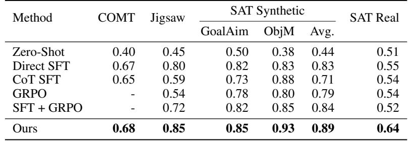
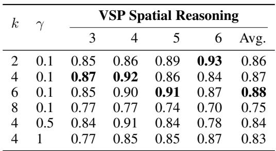
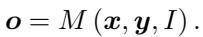
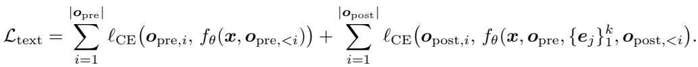

[← 返回 README](../README.md)

# 4 Experiments

## 📌 预览
四个空间推理 benchmark（VSP、Jigsaw、SAT、COMT），Mirage 一致超越 text-only baseline 和统一模型。消融实验验证两阶段训练的必要性 + 超参数鲁棒性。

---

## 4.1 Experimental Settings

**Benchmarks.** We evaluate our approach on four spatial reasoning benchmarks. VSP [Wu et al., 2024] measures spatial planning in a simulated maze-navigation environment. In addition to its main task, we adopt its spatial reasoning subtask, which asks the model to predict the outcome of a prescribed action sequence. We extend the original binary choice to a three-way classification. BLINK-Jigsaw [Fu et al., 2024] systematically evaluates the capacity of multimodal large language models to extrapolate global structural and semantic information from incomplete visual inputs, thereby assessing their proficiency in reasoning about spatial organization and maintaining perceptual coherence at a fine-grained level. SAT [Ray et al., 2024] evaluates both static and dynamic spatial relations. Additionally, we include the Mathematical Geometry subset of the recent COMT [Cheng et al., 2025b] to assess formal spatial reasoning in mathematical contexts. Full dataset details are provided in the supplementary material.

> 💡 **Benchmark 概览**:
> | Benchmark | 任务类型 | 核心能力 |
> |-----------|---------|---------|
> | VSP Spatial Reasoning | 迷宫导航结果预测 | 空间状态推理 |
> | VSP Spatial Planning | 迷宫路径规划 | 空间规划 |
> | BLINK-Jigsaw | 拼图补全 | 空间组织 + 感知一致性 |
> | SAT | 相机视角变换 | 静态/动态空间关系 |
> | COMT | 数学几何 | 形式化空间推理 |

---

**Data Synthesis.** For each task, we sample 1k training instances for fine-tuning and 2k instances for reinforcement learning. COMT uniquely provides interleaved multimodal reasoning trajectories, which we directly use as both helper images and reasoning supervision. For the other benchmarks, we synthesize helper images and reasoning thoughts following the procedure outlined in Sec. 3.1. For VSP, the helper image is either the start map annotated with the red-arrow path (planning task) or the agent's current state snapshot (reasoning subtask). In Jigsaw, we concatenate one candidate patch beside the reference image. For SAT, we prompt a powerful video generation model CogVideoX-5B [Yang et al., 2024b] to render a scene that matches the textual description. With the generated helper image, we then employ Qwen2.5-VL 32B [Bai et al., 2025] as the external reasoning model $M_r$ to generate textual thoughts. Specifically, three distinct reasoning trajectories are generated per helper image to encourage diversity in model outputs. Full synthesis details are provided in the supplementary material.

> 💡 **批注**: 数据量很小——每个任务只有 1k SFT + 2k RL 样本。这说明 Mirage 框架数据效率不错。SAT 任务用 CogVideoX-5B 生成 helper image → 视频生成模型质量是弱环节。

---

**Baselines.** We compare our approach against both text-only baselines and recent unified multimodal models. First, we fine-tune the model directly using answer labels and also evaluate zero-shot reinforcement learning without any supervised warm-up. Next, using our synthetic data, we perform chain-of-thought supervised fine-tuning (CoT SFT) and then add reinforcement learning, giving a fair comparison. In addition, we benchmark against a unified model Anole [Chern et al., 2024], training with the same multimodal supervision, and MVoT [Li et al., 2025a], which generates action and state images but does not incorporate explicit reasoning thoughts during training.

**Implementation Details.** In this work, unless stated otherwise, all experiments use Qwen2.5-VL 7B as the base model. We perform supervised fine-tuning using a batch size of 8 and a cosine learning rate scheduler with an initial learning rate of 1e-5 for both stages. The random seed is fixed at 42 to ensure reproducibility. Reinforcement learning is implemented with the Verl framework. Unless stated otherwise, we use a latent token size of $k = 4$ and a loss coefficient of $\gamma = 0.1$.

---

## 4.2 Experimental Results

We first evaluate the effectiveness of our method on the VSP benchmark. The results are shown in Tab. 1. We highlight the following findings.

*Table 1: Experimental Results on Visual-Spatial Planning (VSP) tasks.*

> 💡 **Table 1 批读**:
> - **Spatial Reasoning**: Mirage (CoT+GRPO) = **0.89** vs CoT SFT+GRPO = 0.85 → **+4%**
> - **Spatial Planning**: Mirage (Direct) = **0.76** vs Direct SFT = 0.72 → **+4%**; Mirage (CoT) = 0.58 vs CoT SFT = 0.47 → **+11%**
> - **统一模型惨败**: Anole 在 Planning 上几乎为 0（无法生成有效答案）；MVoT 也很差
> - **Direct > CoT 在 Planning 上**: 直接训练比 CoT 训练效果好 → 作者解释为"某些视觉任务不受益于显式推理"+ 合成 thought 的噪声

---

First, adding latent visual tokens to the reasoning process significantly improves the reasoning capability of VLMs compared to text-only baselines. Compared to directly fine-tuning the VLM with the synthesized data, our method achieves 3% higher accuracy on the spatial reasoning task and 11% on the spatial planning task. Also, with our two-stage training, Mirage improves the CoT SFT+GRPO, by 2% and 7%, respectively. This demonstrates the effectiveness of the proposed two-stage training method. Also, we test our method on COMT, Jigsaw, and SAT tasks and present the results in Tab. 2, where we observe the consistent performance gains on both tasks, underscoring that interleaving compact visual cues consistently strengthens spatial reasoning ability.

*Table 2: Experimental Results on COMT, Jigsaw, and SAT tasks.*

> 💡 **Table 2 批读**:
> - **COMT**: 0.77 vs CoT SFT 0.75 → +2%
> - **Jigsaw**: 0.88 vs Direct SFT 0.87 → +1%（最小提升）
> - **SAT Synthetic**: 0.98 vs 0.95 → +3%（接近饱和）
> - **SAT Real**: 0.72 vs 0.67 → +5%（real-world 泛化提升明显）

---

Additionally, we observe that unified model-based baselines such as MVoT and Anole, despite explicitly generating image tokens, perform poorly when faced with text and image interleave reasoning. After fine-tuning on the same data, they achieve only 61% accuracy on the spatial reasoning task and 11% on the spatial planning task. Notably, Anole struggles to even generate valid answers for the spatial planning task post fine-tuning. Following the setup in Li et al. [2025a], we construct interleaved reasoning trajectories by combining textual thoughts with simulated state images after each action step for the spatial reasoning task. While our reproduced results are lower than those reported in their paper, we attribute this discrepancy to the difference in training data. They use 6,846 samples, whereas we training with the same 1,000 samples to ensure a fair comparison. Even when compared to their reported results, our model still gains an additional 2% improvement. These findings further underscore the advantage of our latent design over current unified approaches.

> 💡 **批注**: 统一模型失败的原因分析：
> - Anole/MVoT 需要生成像素级图片 → 像素生成目标与推理目标冲突
> - MVoT 没有 reasoning thoughts → 只有 action+state image 交替，缺乏逻辑推理
> - Mirage 的优势：latent token 是连续 embedding（轻量），不需要像素解码

---

We notice that on VSP spatial planning task, fine-tuning with synthesized reasoning thoughts performs significantly worse than training directly on answer labels, both with and without our latent design. Two factors likely contribute to this outcome. First, as noted in prior work [Li et al., 2025b], certain visual tasks that rely heavily on perception may not benefit from explicit reasoning during fine-tuning. Second, the synthesized thoughts are generated by Qwen2.5-VL-32B; although generally sound, they are not flawless, and any imperfections propagate into the base model. Likely, in SAT, the helper images are produced by a video generation model without ground-truth annotations, which can introduce further noise to the latent prior. Despite these challenges, our latent reasoning pipeline still closes much of the performance gap, highlighting its practical robustness.

> 💡 **批注**: 这是一个重要的 caveat——CoT 不总是好的。在 perception-heavy 任务（如路径规划），直接训练可能更好。Mirage 的 latent design 在两种模式下都有提升，但不能解决合成数据噪声问题。

---

Moreover, reinforcement learning can further improve the performance of our method. As shown in Tab. 1, by weaving latent visual tokens within the text trajectories, instead of placing them at the start, our model can naturally explore diverse sequences. After optimizing with GRPO, Mirage achieves extra gains (+2% accuracy) on VSP tasks. These results further confirm that interleaved latent cues provide informative guidance with flexible reasoning, highlighting the potential of our latent design.

---

## 4.3 Ablation Study

In this section, we first conduct an ablation study to evaluate the influence of the two stages of our framework.

*Table 4 (Figure 4): Ablation Study of Training Stages on VSP Spatial Planning task.*

> 💡 **消融实验批读（训练阶段）**:
> - **完整 Mirage**: 0.58
> - **w/o Stage 1** (只有 Stage 2): 0.52 → 下降 6%，但仍比 text-only baseline (0.47) 好
> - **w/o Stage 2** (只有 Stage 1): **0.21** → 灾难性下降！
> - **关键结论**: Stage 1 单独不行（过度约束），Stage 2 单独也差（latent token 漂移），两者缺一不可
> - **与 Coconut 的对比**: Coconut 发现 unsupervised latent vectors 能帮助 LLM 推理，但 Mirage 发现 VLM 中不行 → "visual and textual subspaces in VLMs remain heterogeneous enough that a grounding phase is effective"

---

To delve deeper into the robustness of our framework, we investigate the influence of hyperparameters: latent token size $k$ and the multimodal loss coefficient $\gamma$.

*Table 5 (Figure 5): Ablation Study of Latent Size k and Loss Coefficient γ on VSP Spatial Reasoning.*

> 💡 **超参数消融批读**:
> - **$k$ = 2,4,6**: 性能稳定（0.86-0.88），$k=8$ 显著下降到 0.75
> - $k=8$ 下降原因："error accumulation in longer latent sequences under autoregressive non-decoding generation"
> - **$\gamma$ = 0.1, 0.5, 1**: 影响适中，$\gamma=0.1$ 最优
> - $\gamma$ 越大 → Stage 1 中 visual loss 权重越低 → 视觉锚定越弱
> - **鲁棒性**: $k \in [2,6]$ 都可以，不需要精细调参

---

## 🔖 Section 总结

### 关键数字速查
| 指标 | 数值 |
|------|------|
| VSP Reasoning 最佳 | 0.89 (CoT+GRPO) |
| VSP Planning 最佳 | 0.76 (Direct) |
| 统一模型最佳 (MVoT) | 0.61 / 0.11 |
| Stage 1 only | 0.21 (Planning) |
| Stage 2 only | 0.52 (Planning) |
| 最优 $k$ | 2-6 |

### 核心洞察
1. **Latent token 一致有效**: 所有任务、所有模式（Direct/CoT/+GRPO）都有提升
2. **两阶段缺一不可**: 特别是 Stage 1 的 grounding 至关重要（w/o Stage 2 = 0.21）
3. **统一模型不如 latent design**: 像素生成是沉重负担，latent embedding 更适合推理
4. **CoT 不总是好的**: Perception-heavy 任务可能不受益于 CoT
5. **数据效率高**: 只需 1k 样本就能获得显著提升
