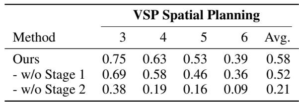
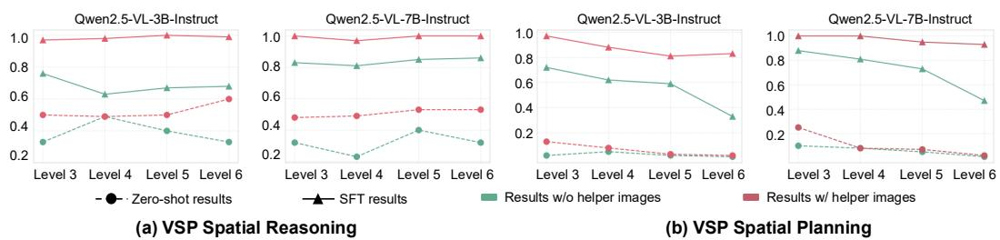
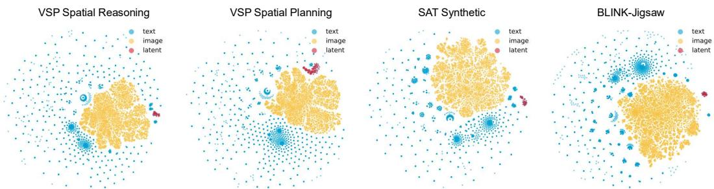

[← 返回 README](../README.md)

# 5 Analysis

## 📌 预览
三个深度分析：(1) 3B 小模型也有效；(2) Helper image 质量验证；(3) t-SNE 可视化显示 latent token 在视觉子空间附近但有偏移。

---

## Generalization to Smaller Models

To further investigate the impact of our latent design, we also evaluate performance using the Qwen2.5-VL 3B model. As shown in Tab. 3, results are consistent with those observed on the 7B model, demonstrating clear performance gains across both tasks. Notably, compared to text-only baselines, our Mirage achieves even larger improvements—5% on the Jigsaw task and 10% on the SAT Real task. These findings further highlight the strength of our latent design and its potential to generalize across different model scales.

*Table 3: Experimental Results with Qwen2.5-VL 3B on COMT, Jigsaw, and SAT tasks.*

> 💡 **Table 3 批读**:
> - 3B 模型上提升**更大**: Jigsaw 0.85 vs 0.80 (+5%), SAT Real 0.64 vs 0.55 (+9%)
> - 说明小模型更能从 latent visual token 中受益——可能因为小模型的文本推理能力更弱，视觉线索的补充更关键
> - 这对实际部署很有意义：小模型 + Mirage 可能比大模型纯文本推理更优

---

## Synthesized Data Quality

Data quality plays a critical role in model performance. In this section, we investigate whether the helper images generated by various tools are genuinely informative for VLM reasoning. For the two VSP tasks, we supply the helper image as prior input and evaluate model performance in both zero-shot and fine-tuned settings.

*Figure 6: Performance with Helper Images as Input Priors. The results highlight the informativeness of the generated images and confirm their high data quality.*

> 💡 **Figure 6 批读**:
> - 给模型 helper image 作为输入 → 接近 100% 准确率（两个 VSP 任务）
> - 这证明 helper image 包含充分的视觉信息
> - 但 Mirage 的 latent token（4 个压缩向量）远达不到 100% → 信息瓶颈在压缩环节
> - **性能上限**: 如果 latent token 能完美编码 helper image 的信息，理论上可达近 100%

As shown in Fig. 6, providing the helper image leads both models to achieve nearly 100% accuracy on both tasks. Even in the zero-shot setting, we observe substantial performance gains on the spatial reasoning task. However, improvements on the spatial planning task are limited to simpler map layouts in the zero-shot setting. We attribute this to the inherent difficulty of extracting and leveraging spatial information from the helper image without task-specific fine-tuning. These results suggest that the synthesized helper images do indeed enhance VLM reasoning. Moreover, if the model's latent thoughts can fully internalize the information encoded in these images, it would represent a strong performance upper bound for our Mirage.

---

## Latent Behavior Analysis

During the first stage, the model learns to reproduce compressed image embeddings, anchoring its latent tokens in the visual subspace. However, after the second stage, these latent tokens receive no direct supervision. Therefore, it is unclear whether they still encode visual representations. Therefore, in this section, we further investigate the latent behaviors of our Mirage.

By sampling 100 examples from each dataset, we obtain the corresponding latent token vectors alongside the text and visual embeddings. Next, we use t-SNE to embed all vectors into two dimensions for better visualization with a perplexity of 30, and initialize the embeddings via PCA.

*Figure 7: Visualization of Latent Embeddings. Our latent tokens cluster near, yet just outside, the visual representation subspace, consistent with the two-stage training design.*

> 💡 **Figure 7 批读（非常重要）**:
> - **蓝色**: text embeddings → 散射分布在整个空间
> - **黄色**: visual (image) embeddings → 紧密聚簇在一个区域（视觉子空间）
> - **红色**: Mirage latent tokens → 聚簇在**视觉子空间附近但有偏移**
> - **关键解读**:
>   1. Stage 1 把 latent token 锚定到视觉子空间（红色靠近黄色）
>   2. Stage 2 让 latent token 偏移到更有利于任务的位置（红色不完全重叠黄色）
>   3. Latent token 明确**远离**文本分布 → 确实编码了视觉信息，不是退化为文本
> - **与 VisMem 的对比**: VisMem 没有做类似的 t-SNE 可视化。Mirage 的分析更透彻，证明了 latent token 的语义

As shown in Fig. 7, the text embeddings (blue dots) fill the entire plot in a radial scattering pattern, while the visual token embeddings (yellow dots) cluster tightly inside a distinct visual subspace, consistent with previous findings. Our latent embeddings (red dots) form a compact cloud that sits just outside that visual cluster, shifted by the second training stage, which tailors the latent embeddings to answer generation. However, we notice that our latent tokens remain clearly separated from the text distribution and closer to the visual embedding across diverse tasks. This pattern shows that even without an explicit decoder, the latent tokens stay close to the visual manifold while retaining the flexibility introduced in the second stage, echoing the way mental imagery abstracts rather than reproduces visual input.

> 💡 **批注**: "echoing the way mental imagery abstracts rather than reproduces visual input" — 很好的总结。Latent token 不是图片的精确复制品，而是抽象的视觉草图。这正是 mental imagery 的特点。

---

## 🔖 Section 总结

### 核心洞察
1. **小模型受益更大**: 3B 模型上提升比 7B 更显著 → latent visual token 对弱模型更有价值
2. **Helper image 信息充分**: 给模型 helper image → 接近 100% → 瓶颈在 latent token 的压缩
3. **t-SNE 证实设计有效**: latent token 在视觉子空间附近但有偏移，与两阶段训练设计一致
4. **Mental imagery 类比成立**: latent token 是抽象的视觉表示，不是精确重建
