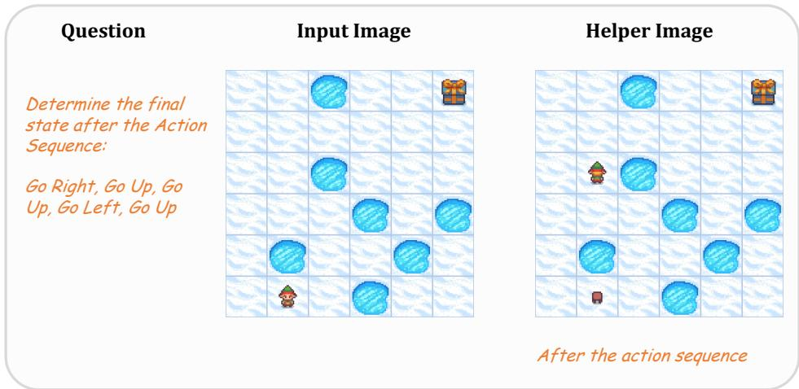
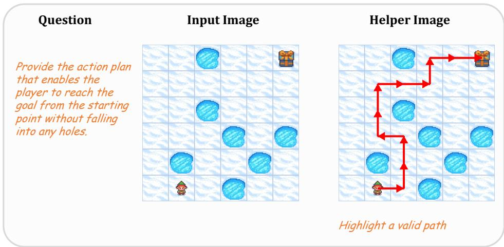
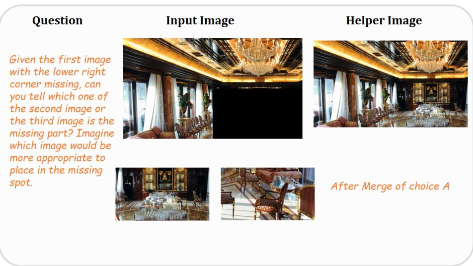
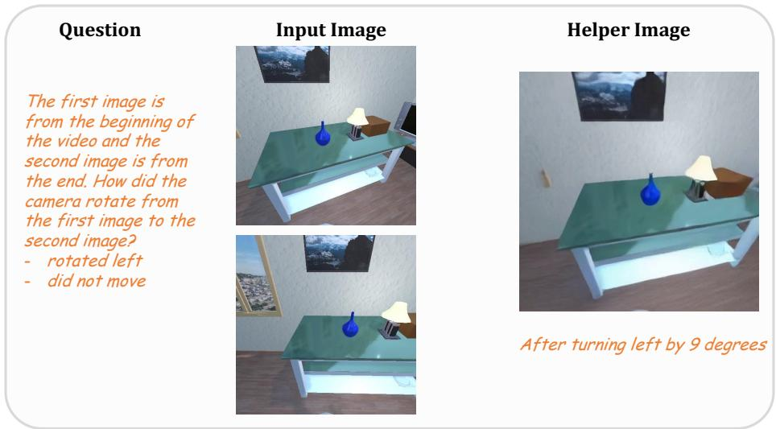

[← 返回 README](../README.md)

# Appendix

## 📌 预览
数据生成细节（每个任务的 helper image 生成方式）+ 实现细节（训练超参数）+ 效率分析。

---

## A Datasets

### A.1 Helper Image Generation

Diverse task-specific tools are employed to generate the helper images used in fine-tuning.

**VSP Spatial Reasoning.** To assist in inferring the final state after a sequence of actions, we leverage the map layout visualization as the helper image, including the agent position after part of the action trajectory. Following the VSP implementation, we render this state with the OpenAI Gym package [Brockman et al., 2016], using the initial map and the action sequence as inputs.

*Figure 8: An example of the helper image of the VSP Spatial Reasoning task.*

**VSP Spatial Planning.** For the planning task, we provide a map annotated with the ground-truth path, turning the problem into simply reading the highlighted trajectory. Specifically, we select one valid action sequence for each sample and highlight its steps as a red arrow that begins at the agent's start position and ends at the goal.

*Figure 9: An example of the helper image of the VSP Spatial Planning task.*

**Blink Jigsaw.** The Jigsaw task asks which candidate patch completes the reference image. For each instance we create a helper image by inserting one randomly chosen candidate patch into the masked region. The model then can judge whether the composite looks seamless: if the patch blends smoothly, it is the correct answer; if not, the other candidate should be chosen.

*Figure 10: An example of the helper image of the BLINK task.*

**SAT.** For the SAT task, we focus on the GoalAim and ObjM subtasks, which require reasoning about a specified camera pose movement. Providing the target view as a helper image would ease the model's spatial reasoning burden. Therefore, given the recent advance in world model research, we adopt a high-quality video generation model CogVideoX-5B to generate this image. To further ensure the image quality, we restrict the action condition for generation to three primitives: move forward, turn left, and turn right. Sampling 9 frames along each trajectory, we instruct a VLM to choose the most informative frame. The chosen frame is then used as the helper image.

*Figure 11: An example of the helper image of the SAT task.*

> 💡 **Helper Image 生成总结**:
> | 任务 | 生成方式 | GT 依赖 |
> |------|---------|---------|
> | VSP Reasoning | OpenAI Gym 渲染中间状态 | GT action sequence |
> | VSP Planning | 在地图上画红色箭头路径 | GT action sequence |
> | Jigsaw | 将候选碎片拼接到缺失区域 | GT 候选 |
> | SAT | CogVideoX-5B 视频生成 | 文字描述（无 GT 图片） |
> | COMT | 数据集自带 | 已有 |
> 
> SAT 是唯一没有 GT image 的任务 → 也是性能提升最不稳定的（SAT Real 上的 noise）

---

### A.2 Textual Thoughts Generation

For each task, we generate the textual thoughts instead of leveraging closed-source outputs. We feed the helper image and the ground truth answer to a large reasoning model Qwen2.5-VL 32B. Task-specific prompts are applied.

> 💡 **批注**: 完整的 prompt 模板在论文 Table 4-7 中，这里省略。关键点：
> - 用 Qwen2.5-VL-32B 而非 GPT-4o → 全开源流程
> - 每个任务 3 条不同推理轨迹 → 增加训练数据多样性
> - Prompt 设计比较简单（"Generate step-by-step reasoning..."），作者承认有改进空间

---

### A.3 Data Configuration

| Task | # SFT | # RL | # Test |
|------|-------|------|--------|
| VSP Spatial Reasoning | 3,000 | 2,000 | 400 |
| VSP Spatial Planning | 3,000 | 2,000 | 400 |
| Blink Jigsaw | 1,000 | 2,000 | 150 |
| SAT | 1,000 | 2,000 | 500 |
| COMT | 820 | - | 200 |

> 💡 **批注**: VSP 的 SFT 数据是 3,000 而非 1,000——因为每个样本 3 条轨迹。实际样本数仍是 1k。

---

## B Experiments

### B.1 Implementation Details

**Fine-tuning.** We adopt Qwen2.5-VL-7B-Instruct as our base VLM. During fine-tuning, all components of the model are trainable except for the vision encoder. The training objective combines a cross-entropy loss for next-token prediction with a cosine similarity loss for aligning latent visual tokens. The loss weight $\gamma$ for the visual alignment loss is set to the default value of 0.1.

| Config | Value | Config | Value |
|--------|-------|--------|-------|
| optimizer | Adam | batch size | 8 |
| β1 | 0.9 | gradient accumulation | 2 |
| β2 | 0.95 | warmup steps | 10 |
| weight decay | 0.01 | training epochs | 10 |
| learning rate | 1e-5 | loss weight γ | 0.1 |

> 💡 **批注**: Vision encoder 冻结 → 只训练 LLM 部分。这意味着 latent token 的视觉能力完全来自 LLM 的 hidden state，而非 vision encoder 的适应。

**Reinforcement Learning.** We adopt VERL as the RL framework with GRPO.

| Config | Value | Config | Value |
|--------|-------|--------|-------|
| prompt length limit | 1024 | response length limit | 1024 |
| learning rate | 1e-6 | batch size | 32 |
| gradient accumulation | 4 | rollout num | 5 |
| training epochs | 15 | mini batch size | 8 |
| σ_f (format weight) | 0.1 | σ_c (correctness weight) | 0.9 |
| λ_kl | 0.01 | λ_en | 0.0 |

> 💡 **批注**: KL divergence on latent visual tokens is **omitted** during RL training → 只约束 text token 的分布偏移

---

### B.2 Efficiency Analysis

Both training stages of Mirage are conducted on a single NVIDIA H100 GPU. Taking the VSP spatial reasoning task as an example, Stage 1 completes in approximately 3.5 hours, while Stage 2 takes around 7.2 hours. For reference, text-only CoT SFT on the same hardware requires about 5.5 hours.

> 💡 **效率分析**:
> - Stage 1: 3.5h（比 CoT SFT 5.5h 更快——因为 visual loss 计算轻量）
> - Stage 2: 7.2h（比 CoT SFT 慢——因为 latent token 的梯度需要额外传播）
> - 总计: 10.7h vs CoT SFT 5.5h → **约 2x 训练成本**
> - 单卡 H100 即可 → 资源需求合理

---

## 🔖 Section 总结

### 核心洞察
1. **数据量小但多样**: 每个任务 1k 样本 × 3 轨迹 = 3k 训练数据
2. **Vision encoder 冻结**: latent token 的视觉能力完全来自 LLM hidden state 的适应
3. **训练成本合理**: 单卡 H100，总计约 10.7h（含两阶段）
4. **RL 训练不约束 latent token 的 KL**: 给 latent token 更大自由度
