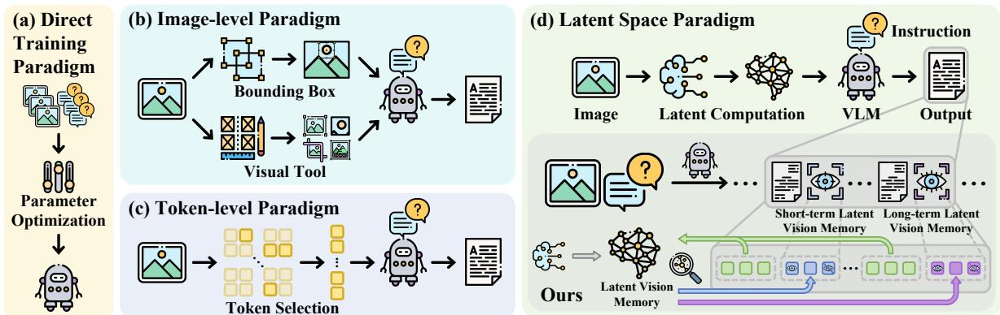

[← 返回 README](../README.md)

# 1. Introduction

## 📌 预览
阐述 visual processing bottleneck 的本质，梳理现有四类范式（直接训练/图像级/token 级/隐空间）的局限性，引出 Dennis Norris Theory 作为认知心理学基础，提出 VisMem 框架。

---

Visual-Language Models (VLMs) have demonstrated impressive capabilities in visual understanding, reasoning and generation [31, 50]. Latest flagship models, both closed-sourced [2, 11, 39] and open-sourced [1, 4, 55, 56, 63], represent a significant leap towards a general-purpose intelligent model that can both perceive and think about the visual world. Despite their success, VLMs still face significant inherent challenges when tackling complicated tasks that require advanced visual abilities, such as fine-grained perception, multi-step reasoning, or maintaining fidelity over long generative sequences [17, 25]. A fundamental limitation stems from the pervasive propensity, exhibited during deep autoregressive decoding, toward a deficit in visual memory, which prioritizes accumulated textual context over the initial visual evidence and lacks visual semantic knowledge [52, 90]. It manifests as a "visual processing bottleneck" that impairs performance in fine-grained visual understanding, efficient reasoning, and robust generation.

> 💡 **问题引入**: VLM 尽管成就显著，在以下三类任务上仍有明显缺陷，尤其在长序列生成时：
> - **Fine-grained perception**：细粒度视觉感知（细节识别、精确定位）
> - **Multi-step reasoning**：多步视觉推理（跨步骤保持视觉上下文）
> - **Fidelity maintaining**：长序列生成中的保真度维持（生成不跑偏）
>
> **根本原因**：深度自回归解码过程中，随着生成 token 不断累积，文本上下文持续增长，模型对初始视觉证据的依赖被文本上下文覆盖（prioritizes accumulated textual context over initial visual evidence），同时缺乏视觉语义知识的持续维护——合称 **visual memory deficit**。本质上是自回归机制的结构性问题：越往后生成，视觉信息在上下文中的比重越低，记忆越模糊。
>
> **Bottleneck 定义**：上述根因导致的 **visual processing bottleneck**，具体表现为三个方面的能力损伤：fine-grained visual understanding、efficient reasoning、robust generation。

Prior efforts to overcome this limitation have explored several distinct strategic axes, which can be primarily categorized into four paradigms, as illustrated in Fig. 1. One intuitive paradigm is the (a) direct training paradigm, which optimizes model parameters via fine-tuning or reinforcement learning [26, 35, 44, 66]. This relatively brute-force approach often sacrifices generalization for task-specific performance, leading to catastrophic forgetting. Another axis concerns the representation space of the intervention, (b) image-level paradigm, operating in the pixel space by explicitly synthesizing new visual inputs, which offers image-level thinking but at a prohibitive computational cost [13, 24, 29, 48, 49, 87]. Conversely, (c) token-level paradigm constrains operations to visual tokens, which is more efficient but fundamentally non-generative, limiting the model to merely re-surfacing what it has already encoded [8, 16, 28, 75]. Recently, a promising direction lies in the (d) latent space paradigm, which introduces continuous latent contexts in the sequential inference process. Unfortunately, existing latent space methods either rely solely on the language space [21, 30, 47, 68, 81] or require auxiliary visual data [70], limiting their application in VLMs.

> 💡 **四范式对比**:
> | 范式 | 代表方法 | 优点 | 缺点 |
> |------|---------|------|------|
> | (a) Direct Training | SFT, Visual-RFT, VLM-R1, Vision-R1 | 简单直接 | 灾难性遗忘，泛化差 |
> | (b) Image-level | Sketchpad, OpenThinkImg, PixelReasoner | 图像级推理 | 计算成本极高，依赖外部工具 |
> | (c) Token-level | ICoT, MINT-CoT, SCAFFOLD | 高效 | 只能重新呈现已编码信息，不能生成新视觉证据 |
> | (d) Latent Space | Coconut, MemGen, Mirage | 效率-效果平衡 | 现有方法要么纯语言空间，要么需要额外标注数据 |
> 
> 注意 MemGen [81] 被归入 (d) latent space paradigm，但它是纯语言隐空间，不处理视觉信息。VisMem 补上了这个缺口。

To overcome this problem, we resort to cognitive psychology, specifically the Dennis Norris Theory [38]:

*Short-term memory and long-term memory are two distinct storage systems that can be modeled on their neural underpinnings, the former is governed by vision, while the latter holds sway over abstract semantics.*

> 💡 **Dennis Norris Theory**: 这是 2017 年的认知心理学理论，核心观点：短期记忆依赖视觉皮层等感知脑区（视觉主导），长期记忆依赖颞叶等语义脑区（语义主导）。这个理论对应到 VLM 架构就是：
> - 短期记忆 → 挂载在 **vision encoder** 上的 LoRA adapter
> - 长期记忆 → 挂载在 **language model** 上的 LoRA adapter

While this cognitive theory reveals the essence of human cognition, it can be smoothly translated into an architectural principle of VLMs: short-term memory is visually-dominant, enhancing perception of the current visual scenes, while long-term memory is semantically-dominant, providing generalized knowledge and contextualized semantic, completing the full cognitive chain.

*Figure 1. Four primary paradigms for enhancing visual capabilities: (a) the direct training paradigm, (b) the image-level paradigm, (c) the token-level paradigm, and (d) the latent space paradigm. Our VisMem belongs to the last one, featuring latent vision memory.*

> 💡 **Figure 1 批读**: 四种范式的可视化对比。VisMem 属于 (d) latent space paradigm，关键区别在于它引入了**双路视觉记忆**（短期 + 长期），而不是像 Coconut/MemGen 那样只用单一的 latent context。图中清晰展示了每种范式的操作空间。

Based on such inspiration, we propose VisMem, a novel and cognitively-aligned framework that systematically incorporates short- and long-term latent vision memory into VLMs. VisMem functions by non-intrusively extending the vocabulary of VLMs with special tokens that trigger on-demand latent vision memory invocation during autoregressive generation. Upon generating an invocation token, a lightweight query builder assesses the hidden states, which contains the current multi-modal cognition, to formulate a contextual-aware query which is then dispatched to one of two specialized, lightweight memory formers: short-term memory former that generates latent tokens encoding fine-grained, perceptual evidences of current visual inputs; long-term memory former that synthesizes tokens representing abstract, high-level semantic knowledge. These generated latent memory tokens are seamlessly inserted into the generation stream, enriching the contexts and enabling it to output with a seamless integration of detailed visual information and generalized semantic knowledge.

> 💡 **VisMem 框架机制**: VisMem 将短期 + 长期视觉潜在记忆注入 VLM 的自回归生成流，具体通过三步实现：
> 1. **无侵入式扩展词表**：添加特殊调用 token，自回归生成中按需触发记忆，不改动原始模型结构
> 2. **Query Builder**：生成调用 token 后，提取当前 hidden states（融合了图像 + 文本的多模态上下文）构造 contextual-aware query——这是一个查询请求，携带当前生成状态的上下文信息，用于向 memory former 查询相关记忆
> 3. **双路 Memory Former**：接收 query 后返回对应的 latent token：
>    - **短期 Memory Former** → 生成 latent token，编码当前视觉输入的 fine-grained 感知证据
>    - **长期 Memory Former** → 生成 latent token，合成抽象高层语义知识
>
> 生成的 latent memory token 无缝插回生成流，使后续解码同时具备细粒度视觉细节与泛化语义知识。

With a two-stage training paradigm based on reinforcement learning tailored for our proposed framework, the model learns to first generate effective memory contents, based on which the optimal patterns for invoking the memory is then learned. Our extensive experiments across a wide range of benchmarks spanning visual understanding, reasoning, and generation demonstrate that our approach can substantially enhance the comprehensive visual capabilities on various base models, while also improving cross-domain generalization and mitigating the problem of catastrophic forgetting. Our contributions are listed as follows:

- We propose a novel paradigm to proactively harness vision memory, alleviating the "visual processing bottleneck" and augmenting advanced visual capabilities.
- We propose a short- and long-term latent vision memory system with distinct purposes and mechanisms, which is analogous to the cognitive psychology.
- We propose a dynamic memory invocation mechanism for seamlessly invoking and inserting latent memory tokens into the autoregressive inference process.
- We evaluate the framework on extensive benchmarks, showcasing significant improvements in advanced visual capacities, cross-domain generalization, catastrophic forgetting mitigation, and compatibility across base models.

> 💡 **两阶段 RL 训练与收益**: 训练分两阶段解耦优化——第一阶段先训记忆内容质量（优化 memory former，让它生成有效的视觉记忆）；第二阶段再训调用策略（优化 policy model，让它学会在合适时机触发记忆）。实验覆盖理解 / 推理 / 生成三类 benchmark，在多个 base model 上均有显著提升，同时带来两个额外收益：**cross-domain generalization 提升** 和 **catastrophic forgetting 缓解**。
> | 挂载 | 语言模型 | Vision encoder + Language model |

---

## 🔖 Section 总结

### 核心洞察
1. Visual processing bottleneck 来源于自回归解码中视觉信息被文本上下文稀释
2. 四范式分类清晰，VisMem 定位在 latent space paradigm，填补了视觉维度的空白
3. 认知心理学的短期/长期记忆二分法提供了优雅的架构设计灵感
4. 两阶段 RL 训练：先训记忆质量，再训调用策略——解耦优化
