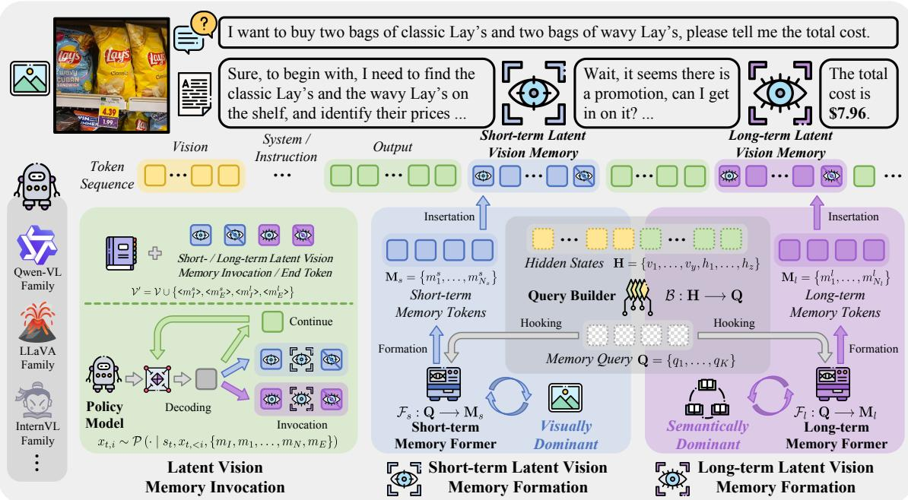

[← 返回 README](../README.md)

# 3. Methodology

## 📌 预览
VisMem 的完整技术细节。三个核心模块：(1) Memory Invocation（特殊 token 触发机制）；(2) Memory Formation（Query Builder + 双路 Memory Former）；(3) Training Recipe（两阶段 GRPO）。



*Figure 2. The overview of our proposed VisMem.*

> 💡 **Figure 2 批读**: VisMem 的完整架构图。关键信息：
> 1. **左侧**：输入的 instruction + image 经过 VLM 标准处理
> 2. **中间**：自回归生成中，遇到 invocation token 时触发 memory formation
> 3. **右侧**：Query Builder 从 hidden states 提取查询 → 分发给短期/长期 Memory Former
> 4. **短期 Memory Former** 挂载在 vision encoder（LoRA）→ 生成视觉细节 token
> 5. **长期 Memory Former** 挂载在 language model（LoRA）→ 生成语义知识 token
> 6. 生成的 latent memory token 插回生成流
>
> 注意：Query Builder 是共享的，但两个 Memory Former 是独立的 LoRA adapter。

---

## 3.1. Preliminary

**Problem Formulation.** Based on the interaction process of VLMs, we formulate the problem and introduce the notations used. We first define a policy model $\mathcal{P}$, which is powered by a base VLM. Given a visual task to be solved, feeding a instruction-vision pair $(I, V)$ sampled from a task distribution $\mathcal{D}$, the policy model unfolds a corresponding trajectory $\tau$ at a timestep $t$, including pairs of current state $s_t$ of the environment and the action $a_t$ performed by the model. Here, the state of the environment includes textual contexts and visual observations. Internally, the action is generated sequentially by the token-by-token autoregressive decoding of the model, yielding the output token sequence $\{x_{t,1}, x_{t,2}, \ldots, x_{t,l}\}$. The generation of $i$-th output token $x_{t,i}$ could be presented as:

$$x_{t,i} \sim \mathcal{P}(\cdot \mid s_t, x_{<i}),$$

where the prediction is conditioned on the current environment state and previously generated tokens. To endow the model with vision memory, a vision memory system $\mathcal{M}$ is adhered to the policy model, thus, the objective is to optimize the memory-enhanced model jointly and to maximize its expected performance:

$$\max_{\mathcal{P}, \mathcal{M}} \mathbb{E}_{(I,V) \sim \mathcal{D}, \tau \sim (\mathcal{P}, \mathcal{M})} [S(\tau)],$$

where $S(\cdot)$ denotes the quantifiable performance results, e.g., accuracy or signal from a reward model.

> 💡 **Problem Formulation**:
>
> 定义 **policy model** $\mathcal{P}$（由 base VLM 驱动）。给定视觉任务，输入为从任务分布 $\mathcal{D}$ 采样的 **instruction-vision pair** $(I, V)$。模型在时间步 $t$ 展开一条 **trajectory** $\tau$，每步包含：
> - **state** $s_t$：当前环境状态，包含已有的文本上下文 + 视觉观测
> - **action** $a_t$：模型的输出，即逐 token 自回归解码得到的序列 $\{x_{t,1}, x_{t,2}, \ldots, x_{t,l}\}$
>
> 第 $i$ 个 token 的生成：
> $$x_{t,i} \sim \mathcal{P}(\cdot \mid s_t, x_{<i})$$
> 每个 token 同时条件于当前环境状态 $s_t$ 和已生成的所有前驱 token $x_{<i}$。**视觉遗忘的根源正在于此**：随着 $x_{<i}$ 不断增长，$s_t$ 中的视觉信息在上下文中的比重越来越低。
>
> 为引入视觉记忆，在 policy 之外附加 **vision memory system** $\mathcal{M}$，联合优化目标：
> $$\max_{\mathcal{P}, \mathcal{M}} \mathbb{E}_{(I,V) \sim \mathcal{D},\ \tau \sim (\mathcal{P}, \mathcal{M})} [S(\tau)]$$
> $S(\cdot)$ 为可量化性能指标（accuracy 或 reward model 信号）。$\mathcal{P}$ 和 $\mathcal{M}$ 同时被优化，目标是让记忆系统与推理协同提升整条 trajectory 的质量。

---

**Motivation.** Building on the Dennis Norris Theory [38], which aligns with contemporary models of human memory, the coordinated operation of short- and long-term visual memories surmounts the "visual processing bottleneck". Short-term latent visual memory maintains fine-grained detail for immediate use and is thus visually dominant; by contrast, long-term latent visual memory abstracts across experiences to enable flexible reuse and is therefore semantically dominant. Taking the task illustrated in Fig. 2 as a case in point, "find the classic Lay's on the shelf" entails the deployment of short-term vision memory, retaining visual details for immediate perceptual demands, while "get in the promotion" triggers generalized semantic knowledge about the "promotion label" acquired from historical scenarios, which is grounded in long-term latent memory, to facilitate the comprehension of the task-based sight. Existing paradigms for enhancing visual capabilities fail to adequately consider vision memory, thus, our VisMem proposes a latent memory method to bridge this gap. More theoretical foundations are in Appendix 6.

> 💡 **Motivation（结合 Figure 2）**:
>
> 基于 Dennis Norris Theory，短期与长期视觉记忆协同运作可突破 visual processing bottleneck，两者定义如下：
> - **短期记忆**：维持 fine-grained detail 供即时使用，视觉主导（visually dominant）
> - **长期记忆**：跨经验抽象，提炼可灵活复用的泛化知识，语义主导（semantically dominant）
>
> Figure 2 用超市购物场景具体说明分工。任务："我想买两袋 classic Lay's 和两袋 wavy Lay's，告诉我总价。"
>
> 模型推理中出现两次记忆调用：
> - **第一次**（短期记忆触发）："需要找到货架上的 Lay's 并识别价格" → 需要感知当前图片的 fine-grained 细节（产品位置、价格标签）→ 调用 **Short-term Latent Vision Memory**
> - **第二次**（长期记忆触发）："好像有促销活动，能参加吗？" → 不需要看当前图，而是从历史经验中提取"促销标签长什么样"的抽象语义知识 → 调用 **Long-term Latent Vision Memory**
>
> 现有方法（四范式）均未充分考虑视觉记忆机制，VisMem 提出 latent memory 方法填补这一空白。

**Memory System.** Based on previous contents, the task could be further disassembles into two main interactive parts: memory invocation (Sec. 3.2): related to "where and how to invoke the short- or long-term vision memory"; memory formation (Sec. 3.3): related to "what content should the short- or long-term vision memory convey". Additionally, these two decomposed processes interact closely with each other, with distinct priorities and objectives, requiring a meticulously designed training recipe (Sec. 3.4).

> 💡 **Memory System 结构拆解**：整个系统分为两个相互交织的子问题：
> - **Memory Invocation**（Sec. 3.2）：**在哪里、如何触发**短期或长期记忆——解决的是"什么时候调用"的问题
> - **Memory Formation**（Sec. 3.3）：**短期或长期记忆应该传递什么内容**——解决的是"记忆里装什么"的问题
>
> 两个子问题相互依赖、优先级和目标各异，因此需要专门设计的训练方案（Sec. 3.4）分阶段解耦优化。这也是后续三节的整体框架。

---

## 3.2. Memory Invocation


As illustrated in Fig. 2, our latent vision memory invocation strategy largely aligns with the standard generation pipeline of VLMs, thereby preserving their robust fundamental visual capabilities. Typically, VLMs generate rationales and answers; however, such pure text sequences lack the granularity to capture fine-grained visual perceptions and semantics, which poses challenges to accurate visual understanding, reasoning, and generation. This limitation arises because during inference, VLMs tend to prioritize accumulated textual context over visual evidence, a phenomenon particularly pronounced in long sequences [17, 25, 72, 78]. To address this, we extend the vocabulary $\mathcal{V}$ of VLMs by incorporating four additional memory-operation tokens, resulting in $\mathcal{V}' = \mathcal{V} \cup \{<m_I^s>, <m_E^s>, <m_I^l>, <m_E^l>\}$. Here, $<m_I>$ and $<m_E>$ form paired invocation and end tokens, where the superscripts $s$ and $l$ denote short- or long-term memory, respectively. Specifically, we register these as indivisible special tokens in the tokenizer and enlarge the embedding matrix from $\mathbb{R}^{|\mathcal{V}| \times d}$ to $\mathbb{R}^{(|\mathcal{V}|+4) \times d}$, where $d$ is the dimension of the model. Furthermore, we initialize the embeddings of the invocation tokens ($<m_I^s>$ and $<m_I^l>$) using the embedding vector of a delimiter token with small perturbations, and update these embeddings during training to facilitate faster convergence. The two end tokens ($<m_E^s>$ and $<m_E^l>$) are treated as structural markers; they are initialized analogously with a lower learning rate. In practice, we also employ constrained decoding to encourage well-formed invocation-end pairs.

> 💡 **问题重述**：VLM 标准生成流只产生 rationale 和 answer 文本，纯文本序列无法捕捉 fine-grained 视觉感知和语义细节，给理解、推理、生成带来挑战。根本原因在于推理过程中文本 token 不断累积，使视觉证据在上下文中的比重持续降低（与 3.1 Problem Formulation 的根因一致）。
>
> 💡 **解决思路**：扩充词表，引入 4 个特殊记忆操作 token，让模型在自回归生成中按需触发记忆，而不修改原始生成流程。在原词表 $\mathcal{V}$ 基础上加入 4 个 token，得到 $\mathcal{V}' = \mathcal{V} \cup \{<m_I^s>, <m_E^s>, <m_I^l>, <m_E^l>\}$：
>
> | Token | 含义 | 初始化策略 |
> |-------|------|--------|
> | `<m_I^s>` | 短期记忆调用开始 | 分隔符 embedding + 小扰动，正常 lr |
> | `<m_E^s>` | 短期记忆调用结束 | 分隔符 embedding + 小扰动，低 lr |
> | `<m_I^l>` | 长期记忆调用开始 | 同上，正常 lr |
> | `<m_E^l>` | 长期记忆调用结束 | 同上，低 lr |
>
> 实现上：将 4 个 token 注册为 tokenizer 中的不可分割特殊 token，embedding 矩阵从 $\mathbb{R}^{|\mathcal{V}| \times d}$ 扩展为 $\mathbb{R}^{(|\mathcal{V}|+4) \times d}$。调用 token 用分隔符 embedding 初始化（语义位置吻合，加速收敛），结束 token 作为结构标记用更低 lr 更新。推理时采用 constrained decoding 保证调用-结束 token 成对出现。

Specifically, the latent vision memory invocation tokens function as triggers for initiating memory insertion, based on the continuous internal cognitive states. During autoregressive generation (see Eq. (4)), upon the output of an invocation token, the memory former immediately initiates the latent vision memory formation procedure:

$$x_{t,i} \to \begin{cases} \text{invocation,} & x_{t,i} \in \{<m_I^s>, <m_I^l>\} \\ \text{continue,} & \text{otherwise} \end{cases}.$$

The resulting latent vision memory, whether short- or long-term as dictated by the specific token type, is subsequently inserted right after the already output invocation token. Following this insertion, the corresponding end token for short ($<m_E^s>$) or long memory ($<m_E^l>$) is automatically appended to resume token-by-token decoding:

$$x_{t,i} \sim \mathcal{P}(\cdot \mid s_t, x_{t,<i}, \{m_I, m_1, ..., m_N, m_E\}).$$

> 💡 **触发机制**：自回归解码中，每个 token 判断是否为调用 token：
> $$x_{t,i} \to \begin{cases} \text{invocation} & x_{t,i} \in \{<m_I^s>, <m_I^l>\} \\ \text{continue} & \text{otherwise} \end{cases}$$
> 一旦触发，立即启动 Memory Formation，生成 N 个 latent memory token，连同首尾标记一起插入上下文，再恢复正常解码：
> $$x_{t,i} \sim \mathcal{P}(\cdot \mid s_t,\ x_{t,<i},\ \underbrace{\{m_I,\ m_1, \ldots, m_N,\ m_E\}}_{\text{插入的记忆段}})$$
> 其中四类 token 的含义：
> - $m_I$（`<m_I^s/l>`）：**调用 token**，由模型自回归解码主动输出，触发记忆
> - $m_1, \ldots, m_N$：**latent memory token**，Memory Former 根据 query 生成的记忆内容
> - $m_E$（`<m_E^s/l>`）：**结束 token**，系统自动追加（非模型解码），标记记忆段落结束
>
> 关键点：$\{m_I, m_1, \ldots, m_N, m_E\}$ 作为一整段"视觉记忆注释"插入上下文，policy 在生成后续 token 时可以 attend 到这段记忆，但自身输出仍是正常文本 token——生成流完全无侵入。生成流结构示意：
> `... 正常文本 | m_I | m_1...m_N | m_E | 正常文本继续 ...`

---

## 3.3. Memory Formation

> 💡 **3.3 要点预览**: 记忆"装什么"？由两个组件决定——Query Builder（提问）和 Memory Former（回答）。

To activate the vision memory capability of VLMs, we integrate two memory components: short-term vision memory, which encodes rich visual evidence, and long-term vision memory, which primarily encodes high-level, knowledge-based visual pertinent semantics, without modifying the core VLM and damaging general abilities. This integration leverages short-term memory to enhance advanced visual perception and comprehension, while long-term memory enables the generalization of semantic experiences during reasoning, thus comprehensively enhancing the overall visual performance. As illustrated in Fig. 2, the memory formation process hinges on two core components: a query builder $\mathcal{B}$, which is responsible for generating queries to hook memory; and memory formers $\mathcal{F}_s$ and $\mathcal{F}_l$, which are dedicated to constructing latent visual memories.

### Query Builder

Through this process, we transform hidden states incorporating current cognition into a more efficient and accurate memory query. Initially, we instantiate a lightweight transformer encoder denoted as $\mathcal{B}$ and a learnable memory query $\mathbf{Q}_{init} = \{q_1, ..., q_K\}$, where $K$ represents the length of the query sequence and each $q \in \mathbb{R}^d$. Given the state at a particular time, $\mathcal{B}$ encodes the query sequence based on internal visual and contextual hidden states to retrieve the corresponding latent memory contents. During each invocation, as the policy model generates the current output token sequence, i.e., the token sequence starting from the initial position or from the end of the previous invocation, it accordingly produces a sequence of hidden state vectors $\{h_1, \ldots, h_z\}$. Similarly, visual encoder produces visual hidden state vectors $\{v_1, \ldots, v_y\}$. Thus, the combination of them $\mathbf{H} = \{v_1, \ldots, v_y, h_1, \ldots, h_z\} \in \mathbb{R}^{(y+z) \times d}$, characterizing the multi-modal cognitive state at the time, where $y$ and $z$ denote the lengths. Subsequently, we concatenate the initialized memory query to the rear of these hidden states to update the queried semantic information:

$$\mathbf{Q} = \mathcal{B}([\mathbf{H}, \mathbf{Q}_{init}])[-K:],$$

where we select the output of the last layer of the encoder (see Eq. (10)), and take the last $K$ encoded vectors as the memory query $\mathbf{Q} \in \mathbb{R}^{K \times d}$ to hook latent memory. Furthermore, we employ a masked attention to exclusively enable attention propagation from the query to the hidden states $\mathbf{H}$, while suppressing attention in the reverse direction, i.e., from $\mathbf{H}$ to $\mathbf{Q}$ (see Eq. (11)). Here, both short- and long-term memory share the same query builder $\mathcal{B}$.

> 💡 **Query Builder 完整流程**：
>
> **组件定义**：
> - $\mathcal{B}$：轻量 transformer encoder，Query Builder 的主体
> - $\mathbf{Q}_{init} = \{q_1, \ldots, q_K\} \in \mathbb{R}^{K \times d}$：K 个可学习向量（"空槽"），训练时更新，代表"待填充的查询"
> - $K$：query 序列长度（超参数）
>
> **Step 1 — 收集多模态 hidden states $\mathbf{H}$**：
> 每次 invocation token $m_I$ 触发时，从两路收集 hidden states：
> - 视觉 hidden states $\{v_1, \ldots, v_y\}$：vision encoder 对输入图片的输出，全程固定
> - 文本 hidden states $\{h_1, \ldots, h_z\}$：从上一次 $m_E$ 结束位置（第一次则从头）到当前 $m_I$ 之间所有生成 token 的 hidden states
> - 拼合：$\mathbf{H} = \{v_1, \ldots, v_y, h_1, \ldots, h_z\} \in \mathbb{R}^{(y+z) \times d}$，表示当前多模态认知状态
>
> **Step 2 — 更新 query**：将 $\mathbf{Q}_{init}$ 拼在 $\mathbf{H}$ 之后，送入 $\mathcal{B}$：
> $$\mathbf{Q} = \mathcal{B}([\mathbf{H},\ \mathbf{Q}_{init}])[-K:]$$
> 用 **masked attention**：$\mathbf{Q}_{init}$ 可以 attend to $\mathbf{H}$（空槽主动从多模态上下文提取信息），但 $\mathbf{H}$ 不能 attend to $\mathbf{Q}_{init}$（防止污染原始 hidden states）
>
> **Step 3 — 输出 memory query**：取 encoder 最后一层输出的最后 $K$ 个向量（对应 $\mathbf{Q}_{init}$ 的位置），得到 $\mathbf{Q} \in \mathbb{R}^{K \times d}$——此时 $K$ 个"空槽"已融合当前视觉+文本上下文，成为上下文感知的 memory query
>
> **注意**：短期和长期记忆**共享同一个 $\mathcal{B}$**，区别在于后续送给哪个 Memory Former。

### Latent Memory Former

Distinct from many existing paradigms [26, 44, 70], we internalize the latent vision memory into lightweight formers, preserving the general abilities of base VLMs and ensuring the compatibility of our paradigm. We initialize two lightweight LoRA adapters, which are respectively designated as the short-term memory former $\mathcal{F}_s$ and long-term memory former $\mathcal{F}_l$, attached to the vision encoder and the final language model of the VLM, without directly tampering with the core parameters. More precisely, we first append the generated memory query $\mathbf{Q}$ along with a set of learnable memory tokens after the corresponding target token sequence $\mathbf{X}$. Then we process it by short-term or long-term memory former, which contextualizes and embeds the latent memory information:

$$\mathbf{M}_{s/l} = \mathcal{F}_{s/l}([\mathbf{X}, \mathbf{Q}, \mathbf{M}_{init}])[-N_{s/l}:],$$

where short- and long-term latent vision memory $\mathbf{M}_{s/l} \in \mathbb{R}^{N_{s/l} \times d}$, while $N_s$ and $N_l$ are the predetermined lengths of memory tokens, which can be taken from $\{2, 4, 8, 16, 32\}$. For the short-term pathway, the resultant memory representation is concatenated with the visual token stream, and pass through the original projector to align it with the representation space of the language model. The two memory formers serve as dedicated memory carriers, exclusively storing visual evidences and semantic knowledge within themselves. When the policy model executes a memory invocation, the incoming memory query triggers externalization of useful short- or long-term memory. These memories are seamlessly inserted into the token generation process alongside the invocation and end signals and barely interfere with the original generation, as specified in Eq. (4).

> 💡 **Latent Memory Former 完整流程**：
>
> **组件定义**：
> - $\mathcal{F}_s$：短期 Memory Former，LoRA adapter 挂载在 vision encoder 上
> - $\mathcal{F}_l$：长期 Memory Former，LoRA adapter 挂载在 language model 上
> - $\mathbf{M}_{init}$：可学习的"空记忆槽"（与 $\mathbf{Q}_{init}$ 设计对称），训练时更新
> - $N_{s/l}$：输出记忆 token 数量，可选 $\{2, 4, 8, 16, 32\}$
>
> **核心公式**：
> $$\mathbf{M}_{s/l} = \mathcal{F}_{s/l}([\mathbf{X},\ \mathbf{Q},\ \mathbf{M}_{init}])[-N_{s/l}:]$$
>
> **输入三部分**：
> - $\mathbf{X}$：目标 token 序列——短期时是 vision encoder 的视觉 token，长期时是 language model 的文本 token
> - $\mathbf{Q}$：Query Builder 生成的 memory query，携带当前多模态上下文
> - $\mathbf{M}_{init}$：空记忆槽，拼在末尾，通过 attention 从 $\mathbf{X}$ 和 $\mathbf{Q}$ 中提取信息
>
> **LoRA 怎么起作用**：LoRA 叠加在原始模型（vision encoder 或 LM）的 attention/FFN 层上，不改动原始参数。三段 $[\mathbf{X}, \mathbf{Q}, \mathbf{M}_{init}]$ 拼接后送进带 LoRA 的模型，$\mathbf{M}_{init}$ 在 attention 中可以 attend to $\mathbf{X}$ 和 $\mathbf{Q}$，从中提取所需的视觉/语义信息并写入自身。
>
> **输入输出形状**：
> - 输入：$[\mathbf{X},\ \mathbf{Q},\ \mathbf{M}_{init}]$，总形状 $\mathbb{R}^{(L + K + N_{s/l}) \times d}$
>   - $\mathbf{X}$：短期为视觉 token $\mathbb{R}^{L_v \times d}$，长期为文本 token $\mathbb{R}^{L_t \times d}$
>   - $\mathbf{Q} \in \mathbb{R}^{K \times d}$
>   - $\mathbf{M}_{init} \in \mathbb{R}^{N_{s/l} \times d}$
> - 输出：取最后 $N_{s/l}$ 个向量，$\mathbf{M}_{s/l} \in \mathbb{R}^{N_{s/l} \times d}$，其中 $N_{s/l} \in \{2, 4, 8, 16, 32\}$ 为超参数
>
> **取 $[-N_{s/l}:]$**：与 Query Builder 的 $[-K:]$ 完全对称——末尾的 $\mathbf{M}_{init}$ 经过 LoRA 变换后已融合上下文信息，取最后 $N$ 个输出向量即为最终记忆内容 $\mathbf{M}_{s/l}$。进去是空槽，出来装了记忆。
>
> | | 短期 $\mathcal{F}_s$ | 长期 $\mathcal{F}_l$ |
> |--|---|---|
> | **挂载位置** | Vision Encoder | Language Model |
> | **$\mathbf{X}$ 来源** | 视觉 token | 文本 token |
> | **输出 token 数** | $N_s$（较小） | $N_l$（较大） |
> | **存储内容** | 细粒度视觉证据 | 抽象语义知识 |

---

## 3.4. Training Recipe

> 💡 **3.4 要点预览**: 两阶段 GRPO 训练。Stage I 训记忆内容（冻结 policy），Stage II 训调用策略（冻结 memory former）。

We design a two-stage training procedure based on GRPO [43], whose optimization objectives are to optimize the effective formation and invocation of latent memory. The first stage enhances the utility of memory, while the second stage maximizes the reward of each invocation, thereby accelerating the convergence of different components steadily. More detailed algorithms and implementations are present in Appendix 7.2 and 8.3.

### Stage I: Memory Formation Optimization

In this stage, we update the query builder $\mathcal{B}$, and memory formers $\mathcal{F}_{s/l}$ while keeping the policy model $\mathcal{P}$ frozen. Initially, during the autoregressive generation process, we randomly invoke either short- or long-term memory upon detecting the delimiter, thereby acquiring initial memory capabilities. Then, the scope of memory invocations is extended to the intervals between delimiters, this not only provides a richer trajectory of memory interactions but also enables memory invocation at arbitrary positions within the generation sequence. The core objective is to maximize the performance improvement relative to trajectory without memory integration $\Delta S(\tau) = S(\tau) - S(\tau_{base})$, thereby enhancing the quality of the memory formation (full function in Eq. (14)):

$$\max_{\mathcal{F}_{s/l}, \mathcal{B}} \mathbb{E}_{\tau \sim \mathcal{P}(\cdot|x, \mathbf{M}_{s/l}), \mathbf{M}_{s/l} \sim \mathcal{F}_{s/l}(\mathbf{Q}), \mathbf{Q} \sim \mathcal{B}(\mathbf{H})} [\Delta S(\tau)].$$

> 💡 **Stage I：Memory Formation Optimization**:
> - **冻结**：Policy model $\mathcal{P}$
> - **联合训练**：Query Builder $\mathcal{B}$ + Memory Formers $\mathcal{F}_{s/l}$（端到端，$\mathcal{B}$ 生成 query → $\mathcal{F}_{s/l}$ 生成记忆，同一 reward 反向传播）
> - **训练方法**：**GRPO**（非 SFT）
> - **触发方式**：先在分隔符处随机触发（热身），再扩展到任意位置
> - **Reward**：$\Delta S(\tau) = S(\tau) - S(\tau_{base})$，即有记忆 vs 无记忆的分数差。$\Delta S > 0$ 说明记忆有帮助被强化，$\Delta S < 0$ 被惩罚
> - **优化目标**：
> $$\max_{\mathcal{F}_{s/l}, \mathcal{B}} \mathbb{E}_{\tau \sim \mathcal{P}(\cdot|x, \mathbf{M}_{s/l}),\ \mathbf{M}_{s/l} \sim \mathcal{F}_{s/l}(\mathbf{Q}),\ \mathbf{Q} \sim \mathcal{B}(\mathbf{H})} [\Delta S(\tau)]$$

### Stage II: Memory Invocation Optimization

In this process, we update part parameters $\theta$ of the policy model $\mathcal{P}$, and keeps all the memory formation components frozen. At this stage, the policy model $\mathcal{P}$ is required to invoke memory efficiently and accurately, which entails two core requirements: selecting the correct memory type and avoiding invalid invocations. Thus, we add two penalties to the objective, which could be optimized by (full function in Eq. (15)):

$$\max_{\theta} \mathbb{E}_{\tau \sim \mathcal{P}(\cdot|x, \mathbf{M}_{s/l})} [\Delta S(\tau) - \alpha(p_{type} + p_{neg})],$$

where $\alpha$ denotes the penalty intensity. The type penalty, $p_{type} = \max(0, S(\tau_{rev}) - S(\tau))$, serves to penalize the erroneous selection of memory types, where $\tau_{rev}$ represents the invocation of an alternative memory type. In parallel, the negative penalty $p_{neg} = \max(0, \bar{S} - S(\tau))$ is designed to penalize invocations with negative returns, aiming to enhance efficiency. Here, $\bar{S}$ denotes the mean of quantifiable scores across candidate trajectories.

> 💡 **Stage II：Memory Invocation Optimization**:
> - **冻结**：Query Builder $\mathcal{B}$ + Memory Formers $\mathcal{F}_{s/l}$
> - **训练**：Policy model 部分参数 $\theta$（学习何时、在哪里输出调用 token，以及调用哪种类型）
> - **训练方法**：**GRPO**
> - **Reward**：在 $\Delta S(\tau)$ 基础上加两个惩罚项：
>   $$\Delta S(\tau) - \alpha(p_{type} + p_{neg})$$
>   - $p_{type} = \max(0,\ S(\tau_{rev}) - S(\tau))$：选错记忆类型的惩罚——若换另一种类型反而分数更高，说明选错了
>   - $p_{neg} = \max(0,\ \bar{S} - S(\tau))$：无效调用的惩罚——若调用后分数低于候选 trajectory 均值 $\bar{S}$，说明不该调用
>   - $\alpha$：惩罚强度超参数
> - **优化目标**：
> $$\max_{\theta} \mathbb{E}_{\tau \sim \mathcal{P}(\cdot|x, \mathbf{M}_{s/l})} [\Delta S(\tau) - \alpha(p_{type} + p_{neg})]$$

---

## 🔖 Section 总结

### 架构速查
```
VLM 自回归解码
  ↓ 输出 <m_I^s> 或 <m_I^l>
  ↓
Query Builder (共享, transformer encoder)
  ├── 输入: 视觉 H_v + 文本 H_t + learnable Q_init
  ├── Masked attention: Q→H ✓, H→Q ✗
  └── 输出: memory query Q (K=8 tokens)
  ↓
Memory Former (LoRA adapter)
  ├── Short-term: 挂 vision encoder → N_s=8 latent tokens → projector → 插入生成流
  └── Long-term: 挂 language model → N_l=16 latent tokens → 直接插入生成流
  ↓
<m_E^s> 或 <m_E^l> → 恢复正常解码
```

### 关键数字速查
| 参数 | 值 |
|------|-----|
| Memory query 长度 $K$ | 8 |
| 短期记忆 token 数 $N_s$ | 8 |
| 长期记忆 token 数 $N_l$ | 16 |
| 特殊 token 数 | 4 |
| LoRA rank | 16 |
| LoRA α | 32 |
| Stage I lr | 5e-5 |
| Stage II lr | 1e-5 |
| GRPO group size | 16 |

### 核心洞察
1. Query Builder 类似 Q-Former，用 masked attention 从多模态 hidden states 提取查询
2. 短期记忆挂 vision encoder（视觉主导），长期记忆挂 language model（语义主导）——与认知理论完美对应
3. 两阶段训练解耦了"记忆质量"和"调用策略"，避免了同时优化的不稳定性
4. Type penalty 和 negative penalty 保证模型学会选对类型、避免无效调用
