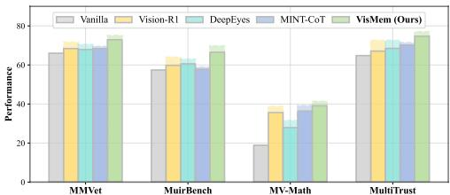
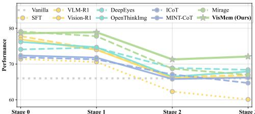
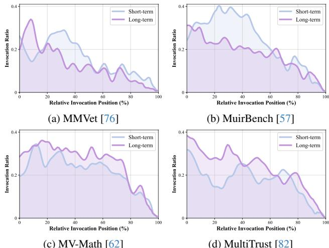
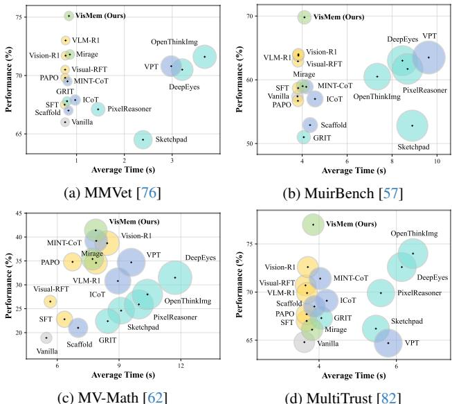

[← 返回 README](../README.md)

# 4. Experiments

## 📌 预览
12 个 benchmark 全面评估，三大增强（视觉能力/跨域泛化/灾难性遗忘缓解），三个观察（跨模型兼容/动态自适应调用/低推理延迟）。

---

## 4.1. Settings

**Benchmarks.** We select 12 benchmarks to comprehensively evaluate three main abilities of VLMs, i.e., understanding, reasoning and generation [31]. These benchmarks include: (1) understanding: MMStar [7], MMVet [76], MMT [73], BLINK [15], MuirBench [57]; (2) reasoning: MMMU [79], LogicVista [67], MathVista [37], MV-Math [62]; (3) generation: HallBench [19], MultiTrust [82], MMVU [34]. Details are in Appendix 8.2.

**Baselines.** We compare our VisMem against 15 baselines, falling into four categories: (a) direct training methods: SFT, Visual-RFT [35], VLM-R1 [44], Vision-R1 [26] and PAPO [66]; (b) image-level methods: GRIT [13], Sketchpad [24], MVoT [29], OpenThinkImg [49] and DeepEyes [87]; (c) token-level methods: Scaffold [28], MINTCoT [8], ICoT [16], and VPT [75]; (d) latent space methods: Mirage [70]. Details are in Appendix 8.3.

**Implementation Details.** All experiments (except for Tab. 2) are implemented on Qwen2.5-VL-7B [4] based on 8 NVIDIA H200 141G GPUs. The length of memory query $K$ is set to 8, and the lengths of short-term $N_s$ and long-term latent vision memory $N_l$ are 8 and 16, respectively. More implementation details are listed in Appendix 8.4.

> 💡 **实验设置总结**:
> - **Base model**: Qwen2.5-VL-7B（主实验），另外测了 9 个 base model（3B~38B）
> - **硬件**: 8×H200 141G
> - **12 个 Benchmark**: 5 理解 + 4 推理 + 3 生成，覆盖面很全
> - **15 个 Baseline**: 四大范式各有代表，对比公平

---

## 4.2. Main Results

The main experimental results demonstrate that our proposed memory system VisMem unlocks the untapped potentials with three key enhancements: [Enh.1] advanced visual capabilities, [Enh.2] cross-domain generalization, [Enh.3] catastrophic forgetting alleviation.

### [Enh.1] VisMem enables advanced and comprehensive visual capabilities.

As presented in Tab. 1, our proposed method demonstrates distinct superiority over other baseline models. Compared with the vanilla model, VisMem achieves a notable average improvement of 11.0% across all benchmarks. When compared with the top three baselines (i.e., Vision-R1 [26], VLM-R1 [44], and OpenThinkImg [49]), our method still maintains improvements of 3.0%, 4.2%, and 4.9%, respectively. Furthermore, it consistently enhances performance across the three core domains of visual tasks, namely, understanding, reasoning, and generation. Our latent vision memory mechanism yields comprehensive enhancements in visual capabilities, with specific gains of +8.9% in visual understanding, +14.4% in reasoning, and +10.6% in generation, relative to the vanilla model. It is also noteworthy that direct RL-based methods (e.g., VLM-R1 [44] and Vision-R1 [26]) also achieve relatively better performance than most other paradigms. However, this approach of directly modifying parameters relies on incremental parameter updates, which may lead to the overwriting of prior general knowledge and result in catastrophic forgetting.

> 💡 **Table 1 核心数字**:
> | 对比 | 理解 Avg | 推理 Avg | 生成 Avg | 总 Avg |
> |------|---------|---------|---------|--------|
> | Vanilla | 59.3 | 46.6 | 57.7 | 54.5 |
> | VisMem | **68.2** | **60.2** | **68.3** | **65.5** |
> | 提升 | +8.9 | +14.4 | +10.6 | +11.0 |
> 
> 推理提升最大（+14.4%），这说明长期语义记忆对多步推理帮助最大。理解和生成也有显著提升。
> 
> **vs 最强 baseline**:
> - vs Vision-R1: +3.0%（Vision-R1 是直接 RL 方法，容易灾难性遗忘）
> - vs OpenThinkImg: +4.9%（OpenThinkImg 是 image-level 方法，计算成本高）

As illustrated in Tab. 5 and 6, we conduct additional evaluations on selected subsets of MuirBench [57] and LogicVista [67]. Endowed with short- and long-term vision memory, our VisMem outperforms all baseline methods by a substantial margin in tasks demanding fine-grained visual evidence, such as counting (+7.0%), visual retrieval (+9.4%), and grounding (13.1%), while also yielding notable improvements in visual reasoning tasks, including inductive (+5.7%) and deductive (+7.1%) learning.

> 💡 **子任务分析揭示记忆分工**:
> - **短期记忆擅长**: counting, grounding, retrieval（需要回看图片细节）
> - **长期记忆擅长**: inductive/deductive reasoning（需要语义知识）
> - 两者互补 → 合体效果远超单独使用

---

### [Enh.2] VisMem showcases great cross-domain generalization.

To evaluate the cross-domain generalization capability of our model, specifically whether its stored latent visual memory can transfer across diverse unseen tasks, we exclusively train our VisMem and comparative baseline models on two datasets: Visual CoT [42] and Mulberry [71], then subsequently assess their performance on four unseen target benchmarks. As demonstrated in Fig. 3, 7, and Tab. 7, VisMem not only consistently achieves significant performance gains on out-of-domain tasks (+6.9% on MMVet [76], +9.1% on MuirBench [57], +20.2% on MV-Math [62], and +9.9% on MultiTrust [82]), but also maintains leading performance relative to all baselines. Notably, our method outperforms the second-ranked model by a substantial margin of 2.7-6.8% across all four benchmarks, while narrowing the performance gap relative to results obtained with full training data. This observation underscores its robust cross-domain knowledge transfer capability.

*Figure 3. Results of the cross-domain generalization study. Models are only trained on Visual CoT and Mulberry. Dashed bar indicates the results with full training data.*

> 💡 **Figure 3 批读**: 跨域泛化实验。只在 2 个数据集上训练，测试 4 个 unseen benchmark。
> - VisMem 在所有 4 个 benchmark 上都领先第二名 2.7-6.8%
> - 与 full training 的差距仅 ~2%（比 VLM-R1 的 5.3% gap 小很多）
> - 说明 latent vision memory 学到的是**通用的视觉认知能力**，而非任务特定的 trick

---

### [Enh.3] VisMem alleviates catastrophic forgetting.

As illustrated in Fig. 4, 8, and Tab. 8, we conduct sequential training of the models across four stages, with performance assessed on MMVet [76] after each stage. At stage 0, the model was trained exclusively on the base task, and in subsequent stages, we incrementally incorporated selected benchmarks into the training process. From the continual learning results, our VisMem demonstrates significantly stronger knowledge retention capabilities. Although direct training paradigms yield relatively excellent overall performance in offline learning tasks with once-off training, they suffer from severe catastrophic forgetting. For instance, SFT exhibits over 10% performance degradation throughout the training process, the highest among all baselines. Additionally, at stage 0, VLM-R1 [44] and Vision-R1 [35] achieve performance improvements of 11.8% and 10.9% respectively compared to the vanilla model, however, these improvements are retained by less than 0.5% at stage 4. In contrast, our method effectively mitigates catastrophic forgetting, exhibiting the smallest performance gap relative to original full-data training among all baselines. It is further worth noting that our latent vision memory enhances performance at stages 1 and 3 without any degradation, reflecting superior cross-task generalization.

*Figure 4. Results of four-stage continual learning on MMVet. Stage 0 only includes itself, while stage 1, 2, 3 sequentially train models on different additional training data combinations.*

> 💡 **Figure 4 批读**: 持续学习实验。关键发现：
> - **SFT**: 性能降 >10%（最严重的灾难性遗忘）
> - **VLM-R1/Vision-R1**: Stage 0 提升 ~11%，到 Stage 4 几乎全部丧失（<0.5% 留存）
> - **VisMem**: Stage 0→3 保持 72.1%，是所有方法中遗忘最少的
> - VisMem 在 Stage 1 和 3 甚至**继续提升**，说明记忆机制有正向迁移效应
> 
> 为什么 VisMem 抗遗忘？因为记忆存在 **LoRA adapter** 中，不直接改动 VLM 核心参数。新任务训练时，核心知识不被覆盖。

---

## 4.3. Additional Analyses

### [Obs.1] VisMem is robustly compatible across various base models.

As detailed in Tab. 2 and Fig. 11, to evaluate the generalizability of our approach across diverse base models, we assess nine widely used base models, encompassing Qwen2.5-VL-3B/32B [4], LLaVA-OV-1.5-4B/8B [1], InternVL-3.5-4B/8B/14B/38B [63], with parameter scales ranging from 3B to 38B. The results indicate that our latent vision memory paradigm exhibits strong compatibility across various models, yielding significant performance improvements across most visual tasks.

> 💡 **Table 2 核心发现**:
> - 9 个 base model（3 个系列，3B~38B），**全部获得显著提升**
> - 小模型提升更大（Qwen2.5-VL-3B: 平均 +12.3%），大模型也有明显提升（InternVL-3.5-38B: 平均 +7.0%）
> - 这证明 VisMem 是 **model-agnostic** 的架构设计

---

### [Obs.2] The memory invocations are dynamic and self-adaptive.

To elaborate on the effectiveness of our dual latent memory system, we characterize the properties of the short- and long-term memories it forms. As illustrated in Fig. 5, we first analyze the type-specific invocation ratios and their relative positions within the output sequence across four benchmarks. In summary, invocation ratios are self-adaptive across tasks, while both memory types exhibit a dynamic downward trend in invocation frequency throughout the output sequence. Task-specific comparisons in Fig. 9 further reveal that short-term latent memories are invoked more frequently to retrieve fine-grained details during visual information acquisition and understanding, particularly in multi-image scenarios, such as MuirBench [57]. Conversely, long-term latent vision memories play a more critical role in reasoning, e.g., in MV-Math [62], by providing abstract semantic knowledge relevant to the current task. Furthermore, Tab. 5 and 6, which detail the sub-task performance of MuirBench [57] and LogicVista [67] respectively, further illustrate that short-term and long-term latent visual memories are complementary. Their dynamic invocation yields superior performance compared to relying on a single memory type or the absence of vision memory.

*Figure 5. Results of memory invocation ratio and invocation relative position across four benchmarks.*

> 💡 **Figure 5 批读**: 记忆调用的动态模式分析。
> - **调用频率随序列位置递减**: 开头调用多（需要视觉信息），后面调用少（已积累足够上下文）
> - **任务自适应**: MuirBench（多图理解）→ 短期记忆调用更多；MV-Math（数学推理）→ 长期记忆调用更多
> - 这说明模型通过 Stage II 的 RL 训练，确实学会了**按需调用**，而不是机械地每步都插入

---

### [Obs.3] VisMem incurs minimal inference latency while yielding substantial performance gains.

As showcased in Fig. 6 and Tab. 12, we compare the average inference time and task performance on four benchmarks to quantify the efficiency-performance trade-off of our method. Our VisMem, by harnessing the capabilities of dual vision memory, attains the best performance while incurring insignificant inference latency. Notably, image-level paradigms significantly elevate inference latency, particularly for tasks involving long thinking paths. In contrast, our VisMem exhibits remarkable effectiveness while maintaining average inference latency comparable to that of direct training optimization and token-level methods.

*Figure 6. Results of average inference time and performance across four benchmarks. The size is proportional to its y-value.*

> 💡 **Figure 6 批读**: 效率-性能气泡图。
> - VisMem 在右上角（高性能 + 适中延迟）
> - Image-level 方法在右下角（高延迟 + 中等性能）
> - 延迟增加仅 8.2%~43.8%（相对于 vanilla），远低于 image-level 的 2x

---

### Ablation Study and Sensitivity Analysis

As reported in Tab. 3, we conduct ablative studies on the memory invocation and dual memory formation. The results reveal that both short-term and long-term memory components contribute to performance across diverse visual tasks, while their complementarity synergistically drives the optimal performance. Additionally, as detailed in Tab. 9, our design achieves a favorable balance between effectiveness and efficiency, with accurate and non-redundant memory invocation. As shown in Fig. 10 and Tab. 10, 11, we conduct sensitivity analyses of the sequence lengths of the memory query $K$, short-term $N_s$ and long-term $N_l$ latent memory tokens. As observed, performance generally improves with increasing sequence lengths within a reasonable range. Notably, our selected hyper-parameters achieve a favorable balance between performance and computational efficiency.

> 💡 **Ablation 关键发现** (Tab. 3):
> | 配置 | MMVet | MuirBench | MV-Math | MultiTrust |
> |------|-------|-----------|---------|------------|
> | Vanilla | 66.0 | 57.4 | 18.9 | 64.8 |
> | Random 25% | 69.2 | 59.4 | 29.8 | 69.4 |
> | Random 50% | 71.9 | 63.2 | 26.1 | 68.5 |
> | Random 75% | 73.6 | 62.7 | 21.9 | 63.7 |
> | Full 100% | 73.4 | 56.0 | 17.5 | 62.6 |
> | Short only | 71.5 | 65.6 | 29.6 | 73.6 |
> | Long only | 69.4 | 60.2 | 36.1 | 69.8 |
> | **Complete** | **75.1** | **69.8** | **41.4** | **77.0** |
> 
> - **100% 调用反而下降**: 过度记忆干扰正常推理（noise > signal）
> - **Short only vs Long only**: MuirBench（理解）→ Short 好；MV-Math（推理）→ Long 好
> - **合体远超单独**: 说明两种记忆确实互补

---

## 🔖 Section 总结

### 关键数字速查
| 指标 | 数值 |
|------|------|
| 平均提升 (vs vanilla) | +11.0% |
| 理解提升 | +8.9% |
| 推理提升 | +14.4% |
| 生成提升 | +10.6% |
| vs 最强 baseline (Vision-R1) | +3.0% |
| 跨域泛化 (2 数据集训练) | +6.9~20.2% |
| 持续学习保持 (MMVet Stage 3) | 72.1% |
| 兼容 base model 数量 | 9 个 (3B~38B) |
| 推理延迟增加 | 8.2%~43.8% |

### 核心洞察
1. VisMem 在所有 12 个 benchmark 上全面领先，推理任务提升最大
2. 跨域泛化和抗遗忘是 VisMem 相对 direct training 方法的核心优势
3. 记忆调用是动态自适应的：理解任务偏短期记忆，推理任务偏长期记忆
4. 过度记忆有害（100% 调用反而降低），按需调用是关键
