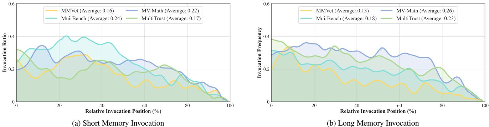
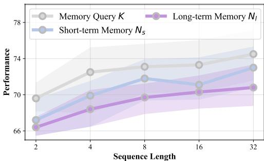
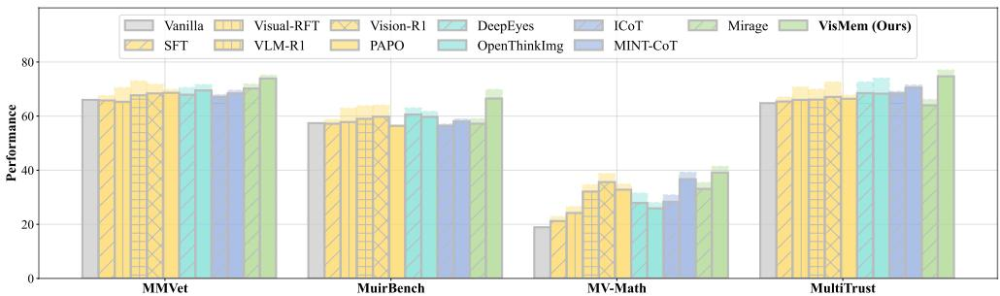
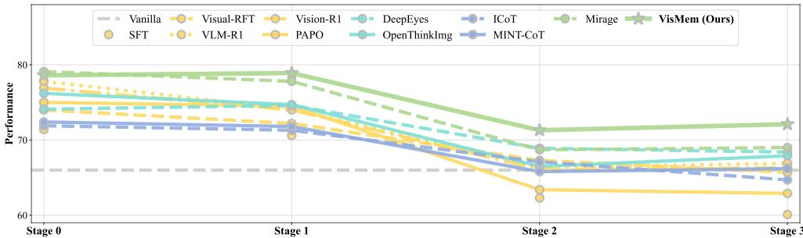

[← 返回 README](../README.md)

# Appendix (Supplementary Material)

## 📌 预览
理论基础、方法细节（Query Builder 公式、完整 GRPO 目标函数）、训练数据、benchmark 细节、更多实验结果。

---

## 6. Theoretical Foundations

As the mainstream position in anthropological cognitive psychology since the 20th century, short-term memory and long-term memory are two distinct storage systems that can be differentiated based on their functional and neural underpinnings [3, 38]. Specifically, the Dennis Norris Theory [38] proposes that short-term memory requires processing new visual information, temporarily storing multiple tokens, and enabling variable signals. It relies neurologically on vision-specific brain regions, e.g., the visual cortex and the posterior superior temporal lobe associated with verbal short-term memory), exhibiting visual dominance; long-term memory, however, centers on abstract semantic representations and relies on semantic-related brain regions like the medial temporal lobe and mid-temporal lobe.

> 💡 **认知心理学基础**:
> - **短期记忆** → 视觉皮层 + 后上颞叶 → **视觉主导**
> - **长期记忆** → 内侧颞叶 + 中颞叶 → **语义主导**
> 
> 对应到 VisMem：短期记忆挂 vision encoder，长期记忆挂 language model——脑区对应到模型组件。

Thus, we propose a framework termed VisMem to invoke dual short and long latent memory during the token-by-token autoregressive generation. Aligned with Dennis Norris Theory [38], we instantiate these roles in a VLM backbone via latent vision memory invocation and latent vision memory formation, which together produce distinct short and long latent memory tokens and integrate them into the generation stream of the model.

---

## 7. Methodology Details

### 7.1. Query Builder

As described in Sec. 3.3, we initialize a lightweight transformer-based encoder as memory builder $\mathcal{B}$. We feed the concatenated memory query $\mathbf{Q}$ and hidden states of vision and output $\mathbf{H}$ into the builder to encode query as memory hook (see Eq. (5)). The transformer-based builder has $L$ layers of encoders, the output process of the $\ell$ layer could be summarized as:

$$\text{SA}(x) = \text{SM}\left(\frac{(xW_q)(xW_k)^\top}{\sqrt{d_k}} + M\right)(xW_v),$$

$$x^\ell = \text{FF}(\text{LN}(x^{\ell-1} + \text{SA}(\text{LN}(x^{\ell-1}))))+ x^{\ell-1},$$

where we simplify the input sequence to $x$, and SM, MHA, FF, LN denote the softmax, multi-head self-attention, feed-forward layer, layer normalization operations, respectively. In addition, $M$ is the mask which only allows attention from memory query $\mathbf{Q}$ to hidden states $\mathbf{H}$, and blocks the reverse direction:

$$M_{ij} = \begin{cases} -C, & i < K \text{ and } j \geq K \\ 0, & \text{otherwise} \end{cases},$$

where $C \gg 0$ is constant, thus the attention is close to $-\infty$.

> 💡 **Mask 设计细节**: 注意这里的 mask 是"前 K 个位置（Q_init）不能被后面的 H attend to"。实际排列是 $[\mathbf{H}, \mathbf{Q}_{init}]$，所以 mask 阻止的是 H 位置 attend to Q 位置。这保证了 VLM 原始的 hidden states 不受 query 的影响。

---

### 7.2. Training Recipe

As mentioned in Sec. 3.4, we design a two-stage training pipeline. We update the models based on reinforcement learning, i.e., GRPO strategy [43]. Specifically, for each instruction-vision pair $(I, V)$, the policy model $\mathcal{P}$ generates a group of $G$ distinct candidate trajectories, termed as $\mathcal{T} = \{\tau_1, \dots, \tau_G\}$. For each trajectory, we utilize $S(\cdot)$ to quantify the performance. Then, a group-relative baseline is calculated via averaging and standardizing all trajectories within the candidate group $G$:

$$\bar{S} = \frac{1}{G}\sum_{i=1}^{G} S(\tau_i), \quad \hat{S} = \sqrt{\frac{1}{G}\sum_{i=1}^{G}(S(\tau_i) - \bar{S})^2}.$$

Consequently, the group-relative advantage of each trajectory could be formulated as:

$$\hat{A} = \frac{S(\tau) - \bar{S}}{\hat{S} + \epsilon}.$$

> 💡 **GRPO 回顾**: Group Relative Policy Optimization 是 DeepSeekMath 提出的 RL 算法。与 PPO 不同，GRPO 不需要 value network，而是用 group 内的相对排名作为 baseline。更轻量、更稳定。MemGen 也用 GRPO。

**Stage I** objective function (memory formation):

$$\mathcal{L}_{GRPO}^{stage1}(\phi) = \mathbb{E}_{\tau, \mathbf{M}_{s/l}, \mathbf{Q}} \left[\frac{1}{G}\sum_{i=1}^{G} \min(\rho_i(\phi)\hat{A}_i, \text{clip}(\rho_i(\phi), 1-\epsilon, 1+\epsilon)\hat{A}_i)\right] - \beta D_{KL}[\pi_\tau^\phi \| \pi_{ref}^\phi],$$

where $\epsilon$ controls the group-relative advantage $\hat{A}$, $\beta$ regulates the KL divergence penalty, and the updated policy parameters $\pi^\phi = \pi^\phi(\mathbf{Q}|\mathbf{H}) \cdot \pi^\phi(\mathbf{M}_{s/l}|\mathbf{Q})$.

**Stage II** objective function (memory invocation):

$$\mathcal{L}_{GRPO}^{stage2}(\theta) = \mathbb{E}_{\tau, x} \left[\frac{1}{G}\sum_{i=1}^{G} \min(\rho_i(\theta)\hat{A}_i, \text{clip}(\rho_i(\theta), 1-\epsilon, 1+\epsilon)\hat{A}_i)\right] - \beta D_{KL}[\pi_\tau^\theta \| \pi_{ref}^\theta].$$

> 💡 **两阶段 GRPO 的关键区别**:
> - Stage I: $\phi$ 是 Query Builder + Memory Former 的参数，$\pi^\phi$ 是记忆生成的概率
> - Stage II: $\theta$ 是 Policy Model 的参数，$\pi^\theta$ 是 token 生成的概率（包括是否输出调用 token）
> - 两阶段的 KL penalty 系数不同：Stage I $\beta=0.015$，Stage II $\beta=0.030$（后者更保守，因为在改 policy model）

---

## 8. Experiment Details

### 8.1. Training Data

During the two-stage training procedure, we use the same training data to optimize both the memory invocation and memory formation. Initially, we include the training split dataset of the selected benchmarks and retain their original data division. Additionally, we incorporate the Visual CoT [42] and Mulberry [71], improving the reasoning abilities.

### 8.4. Implementations

> 💡 **超参数速查** (Tab. 4):
> | 参数 | 值 |
> |------|-----|
> | LoRA rank | 16 |
> | LoRA α | 32 |
> | LoRA dropout | 0.1 |
> | LoRA target | q-proj, v-proj |
> | Batch size | 8 |
> | Epoch | 2 |
> | Stage I lr | 5e-5 |
> | Stage II lr | 1e-5 |
> | Group size $G$ | 16 |
> | Clip ratio | 0.2 |
> | KL $\beta$ (I/II) | 0.015 / 0.030 |
> | Penalty $\alpha$ | 0.3 (Stage II only) |

---

## 9. Additional Results

### 9.5. Ablation Study (Extended)

> 💡 **Tab. 9 扩展消融（含推理效率）**:
> - Random 100% invocation: 推理时间增加 2-5x，性能反而下降 → **过度记忆有害**
> - Complete VisMem 的推理速度仅比 vanilla 慢 ~10%（MMVet: 1.32→1.19 samples/s）
> - Short-only 和 Long-only 推理速度相近，说明主要开销在 query building，而非 memory formation

### 9.6. Analysis of Latent Vision Memory

*Figure 9. Results of memory invocation ratio and relative position across four benchmarks (detailed per-type breakdown).*

> 💡 **Figure 9 批读**: 按记忆类型分别展示调用模式。
> - MuirBench: 短期记忆在序列前半段密集调用（多图理解需要频繁回看）
> - MV-Math: 长期记忆在中段集中调用（推理中段需要语义知识支撑）

### 9.7. Sensitivity Analysis

*Figure 10. Results of sensitivity analysis on the sequence length of memory query K, short- and long-term memory $N_s$ and $N_l$.*

> 💡 **Figure 10 批读**: 敏感度分析。
> - $K$: 8→32 提升不大（8 已足够编码查询意图）
> - $N_s$: 4→8 提升明显，8→32 趋于饱和
> - $N_l$: 8→16 提升明显，16→32 提升微弱
> - 选择 $K=8, N_s=8, N_l=16$ 是性能-效率的甜点

### 9.2-9.4. 跨域泛化 / 灾难性遗忘 / 多模型兼容 (补充)

*Figure 7. Results of various models of the cross-domain generalization study.*

*Figure 8. Results of four-stage continual learning on MMVet (detailed).*

> 💡 **补充实验总结**:
> - 跨域泛化：VisMem 与 full training 的 gap 仅 ~2%，direct training 方法 gap 高达 5%+
> - 持续学习：VLM-R1 在 Stage 3 性能低于 vanilla，VisMem 始终高于 vanilla
> - 多模型兼容：小模型提升更大（3B: +12%），大模型也有显著提升（38B: +7%）

---

## 🔖 Section 总结

### 核心洞察
1. Dennis Norris Theory 提供了严格的认知心理学基础，不只是 motivation
2. GRPO 两阶段训练的完整目标函数清晰，Stage I 优化记忆质量，Stage II 优化调用策略
3. 超参数选择已充分验证，K=8, N_s=8, N_l=16 是性能-效率甜点
4. 过度记忆有害（100% 调用），按需调用是关键设计
