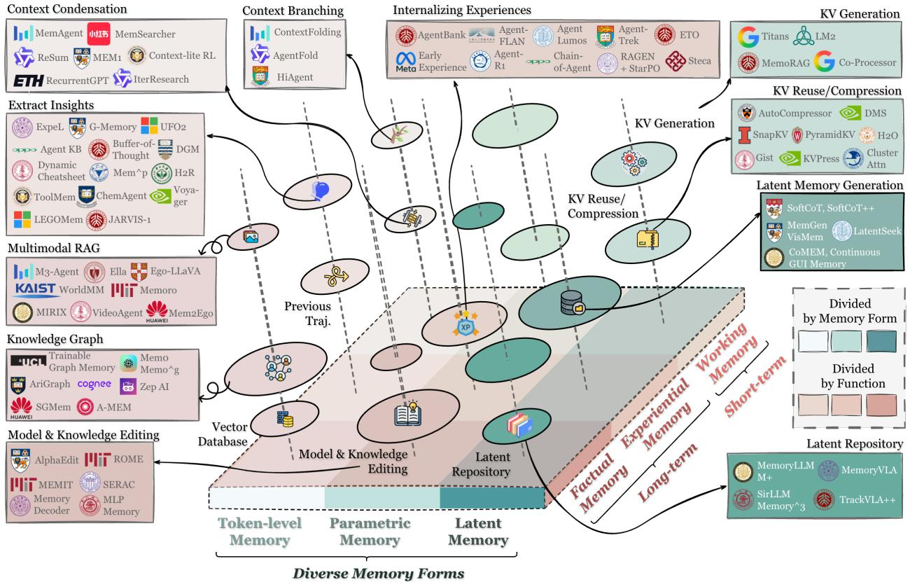

[← 返回 README](../README.md)

# Memory in the Age of AI Agents: A Survey Forms, Functions and Dynamics

> 💡 **批注**: 这篇 survey 来自 NUS (Guibin Zhang 组织)，作者阵容豪华涵盖 NUS、人大、复旦、北大等多所高校。Survey 聚焦 agent memory，提出 Forms-Functions-Dynamics 三角分类框架。

Yuyang $\mathbf { H } \mathbf { u } ^ { \dagger }$ , Shichun Liu†, Yanwei Yue†, Guibin Zhang†ò, Boyang Liu, Fangyi Zhu, Jiahang Lin, Honglin Guo, Shihan Dou, Zhiheng Xi, Senjie Jin, Jiejun Tan, Yanbin Yin, Jiongnan Liu, Zeyu Zhang, Zhongxiang Sun, Yutao Zhu, Hao Sun, Boci Peng, Zhenrong Cheng, Xuanbo Fan, Jiaxin Guo, Xinlei Yu, Zhenhong Zhou, Zewen Hu, Jiahao Huo, Junhao Wang, Yuwei Niu, Yu Wang, Zhenfei Yin, Xiaobin Hu, Yue Liao, Qiankun Li, Kun Wang, Wangchunshu Zhou, Yixin Liu, Dawei Cheng, Qi Zhang, Tao Gui‡, Shirui Pan, Yan Zhang‡, Philip Torr, Zhicheng Dou‡, Ji-Rong Wen, Xuanjing Huang‡, Yu-Gang Jiang, Shuicheng Yan‡

†Core Contributors with Names Listed Alphabetically. ò Project Organizer. ‡Core Supervisors.

Affiliations: National University of Singapore, Renmin University of China, Fudan University, Peking University, Nanyang Technological University, Tongji University, University of California San Diego, Hong Kong University of Science and Technology (Guangzhou), Griffith University, Georgia Institute of Technology, OPPO, Oxford University

Memory has emerged, and will continue to remain, a core capability of foundation model-based agents. It underpins long-horizon reasoning, continual adaptation, and effective interaction with complex environments. As research on agent memory rapidly expands and attracts unprecedented attention, the field has also become increasingly fragmented. Existing works that fall under the umbrella of agent memory often differ substantially in their motivations, implementations, assumptions, and evaluation protocols, while the proliferation of loosely defined memory terminologies has further obscured conceptual clarity. Traditional taxonomies such as long/short-term memory have proven insufficient to capture the diversity and dynamics of contemporary agent memory systems. This survey aims to provide an up-to-date and comprehensive landscape of current agent memory research. We begin by clearly delineating the scope of agent memory and distinguishing it from related concepts such as LLM memory, retrieval augmented generation (RAG), and context engineering. We then examine agent memory through the unified lenses of forms, functions, and dynamics. From the perspective of forms, we identify three dominant realizations of agent memory, namely token-level, parametric, and latent memory. From the perspective of functions, we move beyond coarse temporal categorizations and propose a finer-grained taxonomy that distinguishes factual, experiential, and working memory. From the perspective of dynamics, we analyze how memory is formed, evolved, and retrieved over time as agents interact with their environments. To support empirical research and practical development, we compile a comprehensive summary of representative benchmarks and open source memory frameworks. Beyond consolidation, we articulate a forward-looking perspective on emerging research frontiers, including automation-oriented memory design, the deep integration of reinforcement learning with memory systems, multimodal memory, shared memory for multi-agent systems, and trustworthiness issues. We hope this survey serves not only as a reference for existing work, but also as a conceptual foundation for rethinking memory as a first-class primitive in the design of future agentic intelligence.

> 💡 **批注**: Abstract 清晰地勾勒了 agent memory 领域的核心问题：概念碎片化（episodic/semantic/parametric 等术语混用）和传统 long/short-term 分类的不足。提出的 token-level / parametric / latent 三种 form 分类是本文的核心贡献之一。

# Main Contact: guibinz@u.nus.edu, yuyang.hu@ruc.edu.cn, liusc24@m.fudan.edu.cn, ywyue25@stu.pku.edu.cn Github: https://github.com/Shichun-Liu/Agent-Memory-Paper-List

# Contents

# 1 Introduction

# 2 Preliminaries: Formalizing Agents and Memory 6

2.1 LLM-based Agent Systems 6   
2.2 Agent Memory Systems 7   
2.3 Comparing Agent Memory with Other Key Concepts . 8   
2.3.1 Agent Memory vs. LLM Memory 9   
2.3.2 Agent Memory vs. RAG 10   
2.3.3 Agent Memory vs. Context Engineering 11

# Form: What Carries Memory? 12

# 3.1 Token-level Memory . . 13

3.1.1 Flat Memory (1D) 15   
3.1.2 Planar Memory (2D) 20   
3.1.3 Hierarchical Memory (3D) 21   
3.2 Parametric Memory 22   
3.2.1 Internal Parametric Memory 22   
3.2.2 External Parametric Memory 24   
3.3 Latent Memory . 26   
3.3.1 Generate 26   
3.3.2 Reuse 28   
3.3.3 Transform 28   
3.4 Adaptation 30

# Functions: Why Agents Need Memory? 31

# 4.1 Factual Memory 32

4.1.1 User factual memory 35   
4.1.2 Environment factual memory 36   
4.2 Experiential Memory . . 37   
4.2.1 Case-based Memory 39   
4.2.2 Strategy-based Memory 40   
4.2.3 Skill-based Memory 41   
4.2.4 Hybrid memory . 42   
4.3 Working Memory . 42   
4.3.1 Single-turn Working Memory 43   
4.3.2 Multi-turn Working Memory 45

# 5 Dynamics: How Memory Operates and Evolves? 46

# 5.1 Memory Formation . . 48

5.1.1 Semantic Summarization 48   
5.1.2 Knowledge Distillation . 50   
5.1.3 Structured Construction 51   
5.1.4 Latent Representation 53   
5.1.5 Parametric Internalization . 54   
5.2 Memory Evolution 55   
5.2.1 Consolidation 55   
5.2.2 Updating 57   
5.2.3 Forgetting . 58   
5.3 Memory Retrieval 59   
5.3.1 Retrieval Timing and Intent . 60   
5.3.2 Query Construction 62   
5.3.3 Retrieval Strategies . . 62   
5.3.4 Post-Retrieval Processing 64

# 6 Resources and Frameworks 65

6.1 Benchmarks and Datasets 65   
6.1.1 Benchmarks for Memory / Lifelong / Self-Evolving Agents 65   
6.1.2 Other Related Benchmarks 67   
6.2 Open-Source Frameworks 68

# 7 Positions and Frontiers

# 69

7.1 Memory Retrieval vs. Memory Generation . 69   
7.1.1 Look Back: From Memory Retrieval to Memory Generation 69   
7.1.2 Future Perspective . . 69   
7.2 Automated Memory Management . . 70   
7.2.1 Look-Back: From Hand-crafted to Automatically Constructed Memory Systems. 70   
7.2.2 Future Perspective . . 70   
7.3 Reinforcement Learning Meets Agent Memory . 71   
7.3.1 Look-Back: RL is Internalizing Memory Management Abilities for Agents. . 71   
7.3.2 Future Perspective 72   
7.4 Multimodal Memory 72   
7.4.1 Look-Back . 72   
7.4.2 Future Perspective 73   
7.5 Shared Memory in Multi-Agent Systems 73   
7.5.1 Look-Back: From Isolated Memories to Shared Cognitive Substrates 73   
7.5.2 Future Perspective 73   
7.6 Memory for World Model 74   
7.6.1 Look-Back . 74   
7.6.2 Future Perspective 74   
7.7 Trustworthy Memory . . 75   
7.7.1 Look-Back: From Trustworthy RAG to Trustworthy Memory 75   
7.7.2 Future Perspective 75   
7.8 Human-Cognitive Connections 76   
7.8.1 Look Back . . 76   
7.8.2 Future Perspective . . 76

  
Figure 1 Overview of agent memory organized by the unified taxonomy of forms (Section 3), functions (Section 4), and dynamics (Section 5). The diagram positions memory artifacts by their dominant form and primary function. It further maps representative systems into this taxonomy to provide a consolidated landscape.

