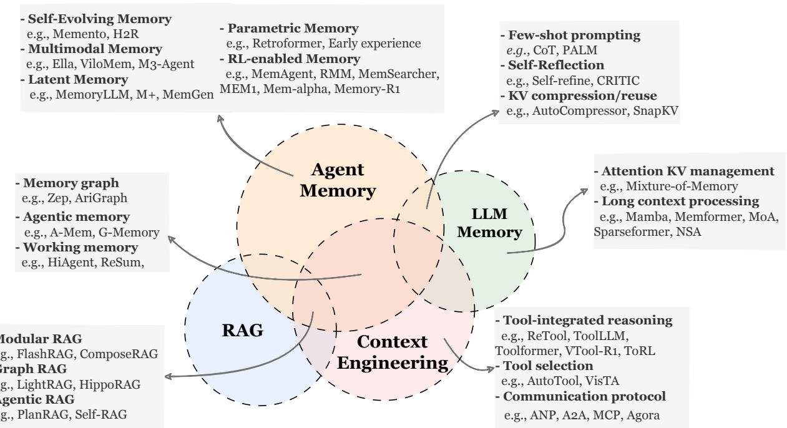

[← 返回 README](../README.md)

# 2 Preliminaries: Formalizing Agents and Memory

LLM agents increasingly serve as the decision-making core of interactive systems that operate over time, manipulate external tools, and coordinate with humans or other agents. To study memory in such settings, we begin by formalizing LLM-based agent systems in a manner that encompasses both single-agent and multi-agent configurations. We then formalize the memory system coupled to the agent’s decision process through read/write interactions, enabling a unified treatment of memory phenomena that arise both within a task (inside-trial / short-term memory) and across tasks (cross-trial / long-term memory).

> 💡 **批注**: Section 2 的形式化定义非常重要 — 它统一了 single-agent 和 multi-agent 场景，并将 memory system 抽象为 Formation-Evolution-Retrieval 三个算子，为后续讨论奠定了数学基础。

# 2.1 LLM-based Agent Systems

Agents and Environment Let $\mathcal { I } = \{ 1 , \ldots , N \}$ denote the index set of agents, where $N = 1$ corresponds to the single-agent case (e.g., ReAct), and $N > 1$ represents multi-agent settings such as debate (Li et al., 2024c) or planner–executor architectures (Wan et al., 2025). The environment is characterized by a state space $\boldsymbol { S }$ . At each time step $t$ , the environment evolves according to a controlled stochastic transition model

$$
s _ { t + 1 } \sim \Psi \big ( s _ { t + 1 } \mid s _ { t } , a _ { t } \big ) ,
$$

where $a _ { t }$ denotes the action executed at time $t$ . In multi-agent systems, this abstraction allows for either sequential decision-making (where a single agent acts at each step) or implicit coordination through environment-mediated effects. Each agent $i \in \mathcal { Z }$ receives an observation

$$
o _ { t } ^ { i } = O _ { i } ( s _ { t } , h _ { t } ^ { i } , \mathcal { Q } ) ,
$$

where $h _ { t } ^ { i }$ denotes the portion of the interaction history visible to agent $i$ . This history may include previous messages, intermediate tool outputs, partial reasoning traces, shared workspace states, or other agents’ contributions, depending on the system design. $\mathcal { Q }$ denotes the task specification, such as a user instruction, goal description, or external constraints, which is treated as fixed within a task unless otherwise specified.

Action Space A distinguishing feature of LLM-based agents is the heterogeneity of their action space. Rather than restricting actions to plain text generation, agents may operate over a multimodal and semantically structured action space, including:

• Natural-language generation, such as producing intermediate reasoning, explanations, responses, or instructions (Li et al., 2023b; Wu et al., 2024b; Hong et al., 2024; Qian et al., 2024).   
• Tool invocation actions, which call external APIs, search engines, calculators, databases, simulators, or code execution environments (Qin et al., 2025; Li et al., 2025h; Zhou et al., 2023c, 2024c).   
• Planning actions, which explicitly output task decompositions, execution plans, or subgoal specifications to guide later behavior (CAMEL-AI, 2025; Liu et al., 2025g; Pan et al., 2024).   
• Environment-control actions, where the agent directly manipulates the external environment (e.g., navigation in embodied settings (Shridhar et al., 2021; Wang et al., 2022a), editing a software repository (Jimenez et al., 2024; Aleithan et al., 2024), or modifying a shared memory buffer).

• Communication actions, enabling collaboration or negotiation with other agents through structured messages (Marro et al., 2024).

These actions, though diverse in semantics, are unified by the fact that they are produced through an autoregressive LLM backbone conditioned on a contextual input. Formally, each agent $i$ follows a policy

$$
a _ { t } = \pi _ { i } ( o _ { t } ^ { i } , m _ { t } ^ { i } , \mathcal { Q } ) ,
$$

where $m _ { t } ^ { i }$ is a memory-derived signal defined in Section 2.2. The policy may internally generate multi-step reasoning chains, latent deliberation, or scratchpad computations prior to emitting an executable action; such internal processes are abstracted away and not explicitly modeled.

Interaction Process and Trajectories A full execution of the system induces a trajectory

$$
\tau = ( s _ { 0 } , o _ { 0 } , a _ { 0 } , s _ { 1 } , o _ { 1 } , a _ { 1 } , \dots , s _ { T } ) ,
$$

where $T$ is determined by task termination conditions or system-specific stopping criteria. At each step, the trajectory reflects the interleaving of (i) environment observation, (ii) optional memory retrieval, (iii) LLM-based computation, and (iv) action execution that drives the next state transition.

This formulation captures a broad class of agentic systems, ranging from a single agent solving reasoning tasks with tool augmentation to teams of role-specialized agents collaboratively developing software (Qian et al., 2024; Wang et al., 2025l) or conducting scientific inquiry (Weng et al., 2025). We next formalize the memory systems that integrate into this agent loop.

# 2.2 Agent Memory Systems

While an LLM-based agent interacts with an environment, its instantaneous observation $o _ { t } ^ { i }$ is often insufficient for effective decision-making. Agents therefore rely on additional information derived from prior interactions, both within the current task and across previously completed tasks. We formalize this capability through a unified agent memory system, represented as an evolving memory state

> 💡 **批注**: Memory lifecycle 的三个算子 F/E/R 是本文的核心抽象。注意 memory 被定义为 unified state $\mathcal{M}_t$，short-term 和 long-term 的区别不在于架构而在于 temporal invocation patterns — 这是一个重要的观点转变。

$$
\mathcal { M } _ { t } \in \mathbb { M } ,
$$

where M denotes the space of admissible memory configurations. No specific internal structure is imposed on $\mathcal { M } _ { t }$ ; it may take the form of a text buffer, key–value store, vector database, graph structure, or any hybrid representation. At the beginning of a task, $\mathcal { M } _ { t }$ may already contain information distilled from prior trajectories (cross-trial memory). During task execution, new information accumulates and functions as short-term, task-specific memory. Both roles are supported within a single memory container, with temporal distinctions emerging from usage patterns rather than architectural separation.

Memory Lifecycle: Formation, Evolution, and Retrieval The dynamics of the memory system are characterized by three conceptual operators.

Memory Formation At time step $t$ , the agent produces informational artifacts $\phi _ { t }$ , which may include tool outputs, reasoning traces, partial plans, self-evaluations, or environmental feedback. A formation operator

$$
\mathcal { M } _ { t + 1 } ^ { \mathrm { f o r m } } = F ( \mathcal { M } _ { t } , \phi _ { t } )
$$

selectively transforms these artifacts into memory candidates, extracting information with potential future utility rather than storing the entire interaction history verbatim.

Memory Evolution Formed memory candidates are integrated into the existing memory base through an evolution operator

$$
\mathcal { M } _ { t + 1 } = E ( \mathcal { M } _ { t + 1 } ^ { \mathrm { t o r m } } ) ,
$$

which may consolidate redundant entries (Zhao et al., 2024), resolve conflicts (Rasmussen et al., 2025; Li et al., 2025l), discard low-utility information (Wang et al., 2025r), or restructure memory for efficient retrieval. The resulting memory state persists across subsequent decision steps and tasks.

Memory Retrieval When selecting an action, agent $i$ retrieves a context-dependent memory signal

$$
m _ { t } ^ { i } = R ( { \mathcal { M } } _ { t } , o _ { t } ^ { i } , { \mathcal { Q } } ) ,
$$

where $R$ denotes a retrieval operator that constructs a task-aware query and returns relevant memory content. The retrieved signal $m _ { t } ^ { i }$ is formatted for direct consumption by the LLM policy, for example as a sequence of textual snippets or a structured summary.

Temporal Roles Within the Agent Loop Although memory is represented as a unified state $\mathcal { M } _ { t }$ , the three lifecycle operators (formation $F$ , evolution $E$ , and retrieval $R$ ) need not be invoked at every time step. Instead, different memory effects arise from distinct temporal invocation patterns. For instance, some systems perform retrieval only once at task initialization,

$$
m _ { t } ^ { i } = \left\{ \begin{array} { l l } { R ( \mathcal { M } _ { 0 } , o _ { 0 } ^ { i } , \mathcal { Q } ) , } & { t = 0 , } \\ { \perp , } & { t > 0 , } \end{array} \right.
$$

where $\perp$ denotes null retrieval strategy. Others may retrieve memory intermittently or continuously based on contextual triggers. Similarly, memory formation may range from minimal accumulation of raw observations,

$$
\mathcal { M } _ { t + 1 } ^ { \mathrm { f o r m } } = \mathcal { M } _ { t } \cup \{ o _ { t } ^ { i } \} ,
$$

to sophisticated extraction and refinement of reusable patterns or abstractions. Thus, inside a task, short-term memory effects may arise from lightweight logging just as in Yao et al. (2023b); Chen et al. (2023a) or from more elaborate iterative refinement (Hu et al., 2025a); across tasks, long-term memory may be updated episodically at task boundaries or continuously throughout operation. Short-term and long-term memory phenomena therefore emerge not from discrete architectural modules but from the temporal patterns with which formation, evolution, and retrieval are engaged.

Memory–Agent Coupling The interaction between memory and the agent’s decision process is similarly flexible. In general, the agent policy is written as

$$
a _ { t } = \pi _ { i } ( o _ { t } ^ { i } , m _ { t } ^ { i } , \mathcal { Q } ) ,
$$

where the retrieved memory signal $m _ { t } ^ { i }$ may be present or absent depending on the retrieval schedule. When retrieval is disabled at a given step, $m _ { t } ^ { i }$ can be treated as a distinguished null input.

Consequently, the overall agent loop consists of observing the environment, optionally retrieving memory, computing an action, receiving feedback, and optionally updating memory through formation and evolution. Different agent implementations instantiate different subsets of these operations at different temporal frequencies, giving rise to memory systems that range from passive buffers to actively evolving knowledge bases.

# 2.3 Comparing Agent Memory with Other Key Concepts

> 💡 **批注**: 这三组对比（Agent Memory vs. LLM Memory / RAG / Context Engineering）是本文的重要贡献。特别是指出 2023-2024 年期间 'LLM agent' 定义的模糊性导致了大量工作被错误归类。

Despite the growing interest in agentic systems endowed with memory, the community’s understanding of what constitutes agent memory remains fragmented. In practice, researchers and practitioners often conflate agent memory with related constructs such as LLM memory (Wu et al., 2025g), retrieval-augmented generation (RAG) (Gao et al., 2024), and context engineering (Mei et al., 2025). Although these concepts are intrinsically connected by their involvement in how information is managed and utilized in LLM-driven systems, they differ in scope, temporal characteristics, and functional roles.

These overlapping yet distinct notions have led to ambiguity in the literature and practice. To clarify these distinctions and situate agent memory within this broader landscape, we examine how agent memory relates to, and diverges from, LLM memory, RAG, and context engineering in the subsequent subsubsections. Figure 2 visually illustrates the commonalities and distinctions among these fields through a Venn diagram.

  
Figure 2 Conceptual comparison of Agent Memory with LLM Memory, RAG, and Context Engineering. The diagram illustrates shared technical implementations (e.g., KV reuse, graph retrieval) while highlighting fundamental distinctions: unlike the architectural optimizations of LLM Memory, the static knowledge access of RAG, or the transient resource management of Context Engineering, Agent Memory is uniquely characterized by its focus on maintaining a persistent and self-evolving cognitive state that integrates factual knowledge and experience. The listed categories and examples are illustrative rather than strictly parallel, serving as representative reference points to clarify conceptual relationships rather than to define a rigid taxonomy.

# 2.3.1 Agent Memory vs. LLM Memory

At a high level, agent memory almost fully subsumes what has traditionally been referred to as LLM memory. Since 2023, many works describing themselves as “LLM memory mechanisms” (Zhong et al., 2024; Packer et al., 2023a; Wang et al., 2023b) are more appropriately interpreted, under contemporary terminology, as early instances of agent memory. This reinterpretation arises from the historical ambiguity surrounding the very notion of an “LLM agent.” During 2023–2024, the community had no stable or coherent definition: in some cases, prompting an LLM to call a calculator already sufficed to qualify the system as an agent (Wu et al., 2024c); in other cases, agency required substantially richer capabilities such as explicit planning, tool use, memory, and reflective reasoning (Ruan et al., 2023). Only recently has a more unified and structured definition begun to emerge (e.g., LLM-based agent = LLM + reasoning $^ +$ planning + memory $^ +$ tool use + self-improvement $^ +$ multi-turn interaction $^ +$ perception, as discussed by Zhang et al. (2025f)), though even this formulation is not universally applicable. Against this historical backdrop, early systems such as MemoryBank (Zhong et al., 2024) and MemGPT (Packer et al., 2023a) framed their contributions as providing LLM memory. Yet what they fundamentally addressed were classical agentic challenges, for example enabling an LLM-based conversational agent to track user preferences, maintain dialogue-state information, and accumulate experience across multi-turn interactions. Under a modern and more mature understanding of agency, such systems are naturally categorized as instances of agent memory.

That said, the subsumption is not absolute. A distinct line of research genuinely concerns LLM-internal memory: managing the transformer’s key–value (KV) cache, designing long-context processing mechanisms, or modifying model architectures (e.g., RWKV (Peng et al., 2023), Mamba (Gu and Dao, 2024; Lieber et al., 2024), diffusion-based LMs (Nie et al., 2025)) to better retain information as sequence length grows. These works focus on intrinsic model dynamics and typically address tasks that do not require agentic behavior, and thus should be considered outside the scope of agent memory.

Overlap Within our taxonomy, the majority of what has historically been called “LLM memory” corresponds to forms of agent memory. Techniques such as few-shot prompting (Prabhumoye et al., 2022; Ma et al., 2023a) can be viewed as a form of long-term memory, where past exemplars or distilled task summaries serve as reusable knowledge incorporated through retrieval or context injection. Self-reflection and iterative refinement methods (Madaan et al., 2023; Mousavi et al., 2023; Han et al., 2025c) naturally align with short-term, inside-trial memory, as the agent repeatedly leverages intermediate reasoning traces or outcomes from prior attempts within the same task. Even KV compression and context-window management (Yoon et al., 2024; Jiang et al., 2023), when used to preserve salient information across the course of a single task, function as short-term memory mechanisms in an agentic sense. These techniques all support the agent’s ability to accumulate, transform, and reuse information throughout a task’s execution.

Distinctions In contrast, memory mechanisms that intervene directly in the model’s internal state—such as architectural modifications for longer effective context, cache rewriting strategies, recurrent-state persistence, attention-sparsity mechanisms, or externalized KV-store expansions—are more appropriately classified as LLM memory rather than agent memory. Their goal is to expand or reorganize the representational capacity of the underlying model, not to furnish a decision-making agent with an evolving external memory base. They do not typically support cross-task persistence, environment-driven adaptation, or deliberate memory operations (e.g., formation, evolution, retrieval), and therefore lie outside the operational scope of agent memory as defined in this survey.

# 2.3.2 Agent Memory vs. RAG

> 💡 **批注**: Agent Memory vs. RAG 的边界正在模糊化。关键区别：RAG 通常是 static knowledge + single invocation，而 agent memory 是 self-evolving + multi-turn/multi-task。但 HippoRAG 等系统同时被两个社区认领，说明界限并不清晰。

At a conceptual level, agent memory and retrieval-augmented generation (RAG) exhibit substantial overlap: both systems construct, organize, and leverage auxiliary information stores to extend the capabilities of LLM/agents beyond their native parametric knowledge. For instance, structured representations such as knowledge graphs and indexing strategies appear in both communities’ methods, and recent developments in agentic RAG demonstrate how autonomous retrieval mechanisms can interact with dynamic databases in ways reminiscent of agent memory architectures (Singh et al., 2025). Indeed, the engineering stacks underlying many RAG and agent memory systems share common building blocks, including vector indices, semantic search, and context expansion modules.

Despite these technological convergences, the two paradigms have historically been distinguished by the contexts in which they are applied. Classical RAG techniques primarily augment an LLM with access to static knowledge sources, whether flat document stores, structured knowledge bases, or large corpora externally indexed to support retrieval on demand (Zhang et al., 2025q; Han et al., 2025b). These systems are designed to ground generation in up-to-date facts, mitigate hallucinations, and improve accuracy in knowledge-intensive tasks, but they generally do not maintain an internal, evolving memory of past interactions. In contrast, agent memory systems are instantiated within an agent’s ongoing interaction with an environment, continuously incorporating new information generated by the agent’s own actions and environmental feedback into a persistent memory base (Wang et al., 2024m; Zhao et al., 2024; Sun et al., 2025e).

In early formulations the distinction between RAG and agent memory was relatively clear: RAG retrieved from externally maintained knowledge for a single task invocation, whereas agent memory evolved over multi-turn, multi-task interaction. However, this boundary has become increasingly blurred as retrieval systems themselves become more dynamic. For example, certain retrieval tasks continuously update relevant context during iterative querying (e.g., multi-hop QA settings where related context is progressively added). Interestingly, systems such as HippoRAG/HippoRAG2 (Gutierrez et al., 2024; Gutiérrez et al., 2025) have been interpreted by both RAG and memory communities as addressing long-term memory challenges for LLMs. Consequently, a more practical (though not perfectly separable) distinction lies in the task domain. RAG is predominantly applied to augment LLMs with large, externally sourced context for individual inference tasks, exemplified by classical multi-hop and knowledge-intensive benchmarks such as HotpotQA (Yang et al., 2018), 2WikiMQA (Ho et al., 2020), and MuSiQue (Trivedi et al., 2022). By contrast, agent memory systems are typically evaluated in settings requiring sustained multi-turn interaction, temporal dependency, or environment-driven adaptation. Representative benchmarks include long-context dialogue evaluations such as LoCoMo (Maharana et al., 2024) and LongMemEval (Wu et al., 2025a), complex problem-solving and deep-research benchmarks such as GAIA (Mialon et al., 2023), XBench (Chen et al., 2025c), and BrowseComp (Wei et al., 2025b), code-centric agentic tasks such as SWE-bench Verified (Jimenez et al., 2024), as well as lifelong learning benchmarks such as StreamBench (Wu et al., 2024a). We provide a comprehensive summary of memory-related benchmarks in Section 6.1.

Nevertheless, even this domain-based distinction contains substantial gray areas. Many works self-described as agent memory systems are evaluated under long-document question-answering tasks such as HotpotQA (Wang et al., 2025g,p), while numerous papers foregrounded as RAG systems in fact implement forms of agentic selfimprovement, continually distilling and refining knowledge or skills over time. As a result, titles, methodologies, and empirical evaluations frequently blur the conceptual boundary between the two paradigms. To further clarify these relationships, the following three paragraphs draw upon established taxonomies of RAG from (Mei et al., 2025): modular RAG, graph $R A G$ , and agentic $R A G$ , and examine how the core techniques associated with each lineage manifest within both RAG and agent memory systems.

Modular RAG Modular RAG refers to architectures in which the retrieval pipeline is decomposed into clearly specified components, such as indexing, candidate retrieval, reranking, filtering, and context assembly, that operate in a largely static and pipeline-like fashion (Singh et al., 2025). These systems treat retrieval as a well-engineered, modular subsystem external to the LLM, designed primarily for injecting relevant knowledge into the model’s context window during inference. Within the agent memory perspective, the corresponding techniques typically appear in the retrieval stage, where memory access is realized through vector search, semantic similarity matching, or rule-based filtering, as seen in popular agent memory frameworks like Memary (Memary, 2025), MemOS (Li et al., 2025l), and Mem0 (Chhikara et al., 2025).

Graph RAG Graph RAG systems structure the knowledge base as a graph, ranging from knowledge graphs to concept graphs or document-entity relations, and leverage graph traversal or graph-based ranking algorithms to retrieve context (Peng et al., 2024). This representation enables multi-hop relational reasoning, which has proven effective for knowledge-intensive tasks (Edge et al., 2025; Han et al., 2025b; Dong et al., 2025a). In the context of agent memory, graph-structured memory arises naturally when agents accumulate relational insights over time, such as linking concepts, tracking dependencies among subtasks, or recording causal relations inferred through interaction. Several well-established practices include Mem $0 ^ { g }$ (Chhikara et al., 2025), A-MEM (Xu et al., 2025c), Zep (Rasmussen et al., 2025), and G-memory (Zhang et al., 2025c). Notably, graph-based agent memory systems may construct, extend, or reorganize its internal graph throughout the agent’s operation. Consequently, graph-based retrieval forms the structural backbone for both paradigms, but only agent memory treats the graph as a living, evolving representation of experience. We provide further analysis on graph-based memory forms in Section 3.1.2 and also refer the readers to a relevant survey (Liu et al., 2025h).

Agentic RAG Agentic RAG integrates retrieval into an autonomous decision-making loop, where an LLM agent actively controls when, how, and what to retrieve (Singh et al., 2025; Sun et al., 2025e). These systems often employ iterative querying, multi-step planning, or self-directed search procedures, enabling the agent to refine its information needs through deliberate reasoning, as implemented in PlanRAG (Lee et al., 2024b) and Self-RAG (Asai et al., 2023). For a more detailed understanding of agentic RAG, we refer the readers to Singh et al. (2025). From the agent memory perspective, agentic RAG occupies the closest conceptual space: both systems involve autonomous interaction with an external information store, both support multi-step refinement, and both may incorporate retrieved insights into subsequent reasoning. The key distinction is that classical agentic RAG typically operates over an external and often task-specific database, whereas agent memory maintains an internal, persistent, and self-evolving memory base that accumulates knowledge across tasks (Yan et al., 2025b; Xu et al., 2025c).

# 2.3.3 Agent Memory vs. Context Engineering

> 💡 **批注**: Context Engineering 作为 2025 年新兴概念，与 agent memory 的关系是 intersection 而非 subsumption。核心区别：CE 是 resource management paradigm（优化 context window），AM 是 cognitive modeling paradigm（维护持久认知状态）。

The relationship between agent memory and context engineering is best understood as an intersection of distinct operational paradigms rather than a hierarchical subsumption. Context engineering is a systematic design methodology that treats the context window as a constrained computational resource. It rigorously optimizes the information payload, including instructions, knowledge, state, and memory, to mitigate the asymmetry between massive input capacity and the model’s generation capability (Mei et al., 2025). While agent memory focuses on the cognitive modeling of a persistent entity with an evolving identity, context engineering operates under a resource management paradigm. From the perspective of context engineering, agent memory is merely one variable within the context assembly function that requires efficient scheduling to maximize inference efficacy. Conversely, from the perspective of an agent, context engineering serves as the implementation layer that ensures cognitive continuity remains within the physical limits of the underlying model.

Overlap The two fields converge significantly in the technical realization of working memory during longhorizon interactions and often employ functionally identical mechanisms to address the constraints imposed by a finite context window (Hu et al., 2025a; Zhang et al., 2025r; Kang et al., 2025c; Yu et al., 2025a). Both paradigms rely on advanced information compression (Zhou et al., 2025b; Wu et al., 2025f), organization (Xu et al., 2025c; Zhang et al., 2025c; Anokhin et al., 2024), and selection (Zhang et al., 2025r) techniques to preserve operational continuity over extended interaction sequences. For example, token pruning and importance-based selection methods (Jiang et al., 2023; Li et al., 2023c) that are central to context engineering frameworks play a fundamental role in agentic memory systems by filtering noise and retaining salient information. Similarly, the rolling summary technique serves as a shared foundational primitive, functioning simultaneously as a buffer management strategy and a transient episodic memory mechanism (Yu et al., 2025a; Lu et al., 2025b). In practice, the boundary between engineering the context and maintaining an agent’s short-term memory effectively dissolves in these scenarios, as both rely on the same underlying summarization, dynamic information retrieval, and recursive state updates (Tang et al., 2025b; Yoon et al., 2024).

Distinctions The distinction becomes most pronounced when moving beyond short-term text processing to the broader scope of long-lived agents. Context engineering primarily addresses the structural organization of the interaction interface between LLMs and their operational environment. This includes optimizing tool-integrated reasoning and selection pipelines (Qin et al., 2024a; Schick et al., 2023; Jia and Li, 2025) and standardizing communication protocols, such as MCP (Qiu et al., 2025c). These methods focus on ensuring that instructions, tool calls, and intermediate states are correctly formatted, efficiently scheduled, and executable within the constraints of the context window. As such, context engineering operates at the level of resource allocation and interface correctness, emphasizing syntactic validity and execution efficiency.

In contrast, agent memory defines a substantially broader cognitive scope. Beyond transient context assembly, it encompasses the persistent storage of factual knowledge (Zhong et al., 2024), the accumulation and evolution of experiential traces (Zhao et al., 2024; Tang et al., 2025d; Zhang et al., 2025d), and, in some cases, the internalization of memory into model parameters (Wang et al., 2025o). Rather than managing how information is presented to the model at inference time, agent memory governs what the agent knows, what it has experienced, and how these elements evolve over time. This includes consolidating repeated interactions into knowledge (Tan et al., 2025c), abstracting procedural knowledge from past successes and failures (Ouyang et al., 2025), and maintaining a coherent identity across tasks and episodes (Wang et al., 2024f).

From this perspective, context engineering constructs the external scaffolding that enables perception and action under resource constraints, whereas agent memory constitutes the internal substrate that supports learning, adaptation, and autonomy. The former optimizes the momentary interface between the agent and the model, while the latter sustains a persistent cognitive state that extends beyond any single context window.

