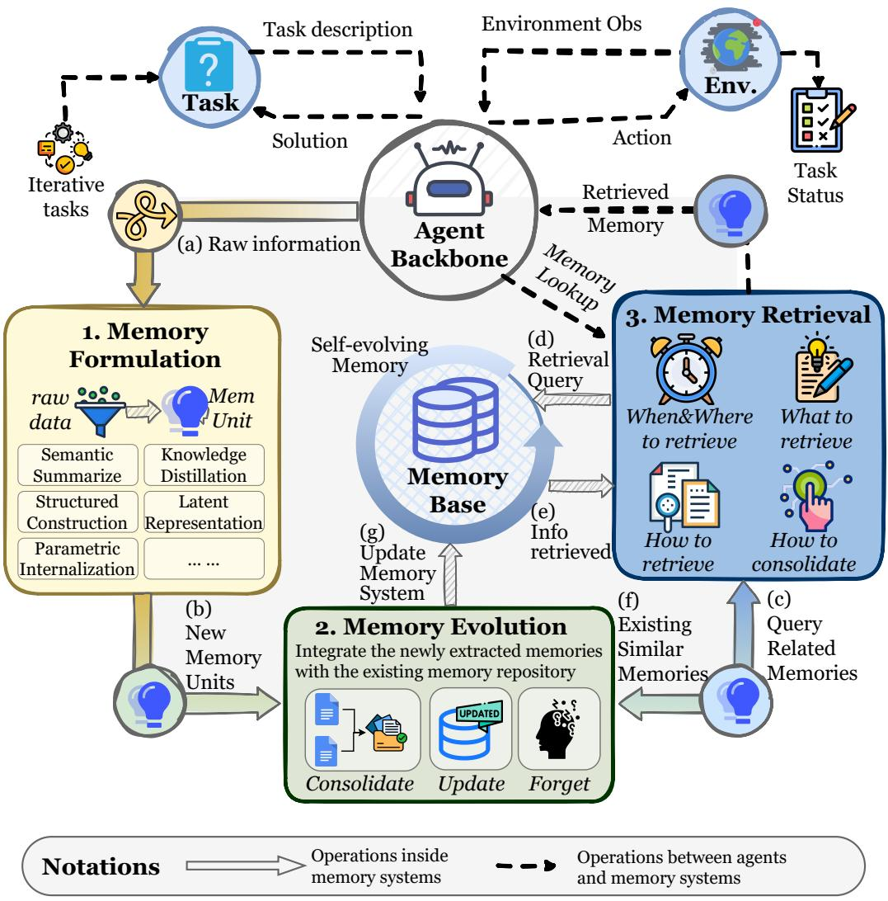
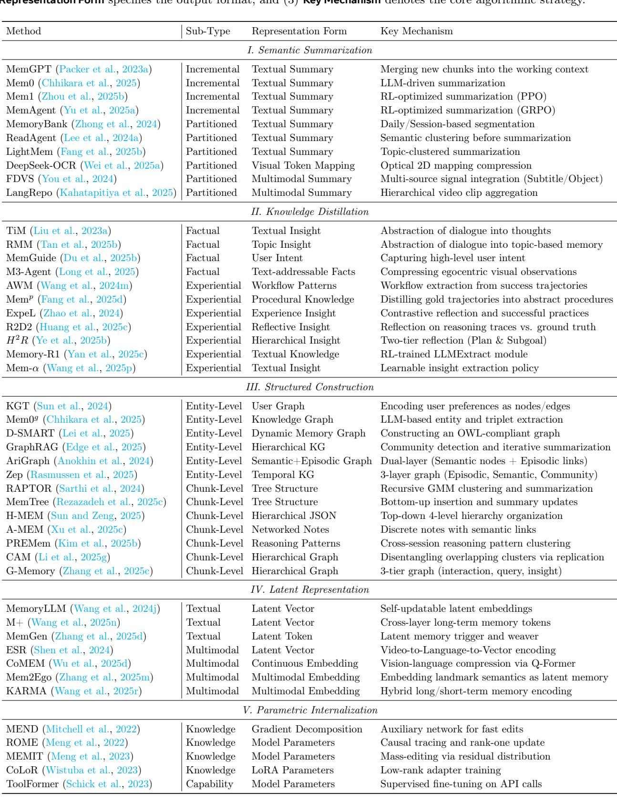
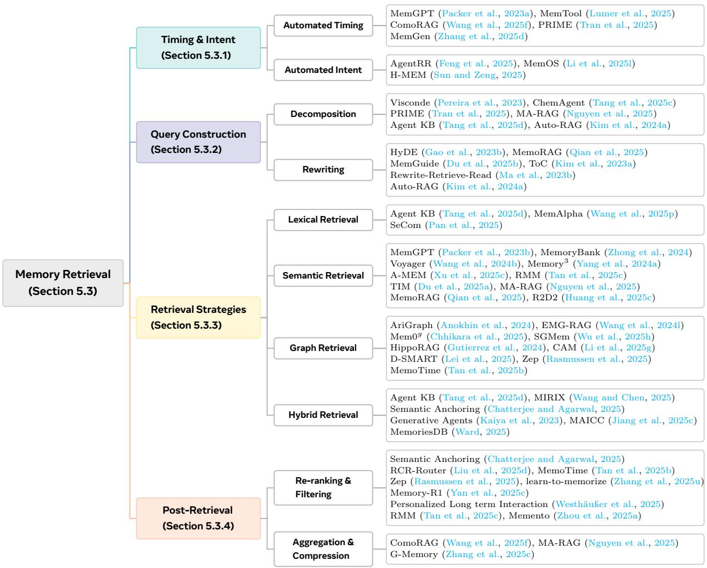

[← 返回 README](../README.md)

# 5 Dynamics: How Memory Operates and Evolves?

> 💡 **批注**: Section 5 回答 "How memory operates and evolves?" — Formation / Evolution / Retrieval 三个过程构成了 memory 的完整生命周期。这部分内容最丰富，覆盖了从原始数据到可用知识的全流程。

The preceding sections introduced the architectural forms (Section 3) and functional roles (Section 4) of memory, outlining a relatively static conceptual framework for agent memory. However, such a static view overlooks the inherent dynamism that fundamentally characterizes agentic memory. Unlike knowledge that is statically encoded in model parameters or fixed databases, an agentic memory system can dynamically construct and update its memory store and perform customized retrieval conditioned on different queries. This adaptive capability is crucial for enabling agents to self-evolve and engage in lifelong learning.

Accordingly, this section investigates the paradigm shift from static storage to dynamic memory management and utilization. This paradigm shift reflects the foundational operational advantages of agentic memory over static database approaches. In practice, an agentic memory system can autonomously extract refined, generalizable knowledge based on reasoning traces and environmental feedback. By dynamically fusing and updating this newly extracted knowledge with the existing memory base, the system ensures continuous adaptation to evolving environments and mitigates cognitive conflicts. Based on the constructed memory base, the system executes targeted retrieval from designated memory modules at precise moments, thereby enhancing reasoning effectively. To systematically analyze “how” the memory system operates and evolves, we examine the complete memory lifecycle by decomposing it into three fundamental processes. Figure 8 provides a holistic illustration of this dynamic memory lifecycle, highlighting how memory formation, evolution, and retrieval interact to support adaptive and self-evolving agent behavior.

  
Figure 8 The operational dynamics of agent memory. We decouple the complete memory lifecycle into three fundamental processes that drive the system’s adaptability and self-evolution: (1) Memory Formation transforms raw interactive experiences into information-dense knowledge units by selectively identifying patterns with long-term utility; (2) Memory Evolution dynamically integrates new memories into the existing repository through consolidation, updating, and forgetting mechanisms to ensure the knowledge base remains coherent and efficient; and (3) Memory Retrieval executes context-aware queries to access specific memory modules, thereby optimizing reasoning performance with precise information support. The alphabetical order denotes the sequence of operations within the memory systems.

# Three Fundamental Process in Memory Systems

1. MemoryFormation(Section 5.1): This process focuses on transforming raw experience into informationdense knowledge. Instead of passively logging all interaction history, the memory system selectively identifies information with long-term utility, such as successful reasoning patterns or environmental constraints. This part answers the question: “How to extract the memory?”.

2. Memory Evolution(Section 5.2): This process represents the dynamic evolution of the memory system. It focuses on integrating newly formed memories with the existing memory base. Through mechanisms such as the consolidation of correlated entries, conflict resolution, and adaptive pruning, the system ensures that the memory remains generalizable, coherent, and efficient in an ever-changing environment. This part answers the question: “How to refine the memory?”.

3. Memory Retrieval(Section 5.3): This process determines the quality of the retrieved memory. Conditioned on the context, the system constructs a task-aware query and uses a carefully designed retrieval strategy to access the appropriate memory bank. The retrieved memory is therefore both47 semantically relevant and functionally critical for reasoning. This part answers the question: “How to utilize the memory?”.

These three processes are not independent; rather, they form an interconnected cycle that drives the dynamic evolution and operation of the memory system. Memory extracted during the memory formation stage is integrated and updated with the existing memory base during the memory evolution stage. Leveraging the memory base constructed through these first two stages, the memory retrieval stage enables targeted access to optimize reasoning. In turn, reasoning outcomes and environmental feedback feed back into memory formation to extract new insights and into memory evolution to refine the memory base. Collectively, these components enable LLMs to transition from static conditional generators into dynamic systems that continuously learn from and respond to changing environments.

# 5.1 Memory Formation

We define memory formation as the process of encoding raw contexts (e.g., dialogues or images) into compact knowledge. The necessity for memory formation emerges from the scaling limitations inherent in processing lengthy, noisy, and highly redundant raw contexts. Full-context prompting often encounters computational overhead, prohibitive memory footprints, and degraded reasoning performance on out-of-distribution input lengths. To mitigate these issues, recent memory systems distill essential information into efficiently storable and precisely retrievable representations, enabling more efficient and effective inference.

Memory formation is not independent of the preceding sections. Depending on the task type, the memory formation process selectively extracts different architectural memories described in Section 3 to fulfill the corresponding functions outlined in Section 4. Based on the granularity of information compression and the logic of encoding, we categorize the memory formation process into five distinct types. Table 7 summarizes representative methods under each category, comparing their sub-types, representation forms, and key mechanisms.

# Five Categories of Memory Formation Operations

• Semantic Summarization(Section 5.1.1) transforms lengthy raw data into compact summaries, filtering out redundancy while preserving global, high-level semantic information to reduce contextual overhead.

• Knowledge Distillation (Section 5.1.2) extracts specific cognitive assets, ranging from factual details to experiential planning strategies.

• Structured Construction(Section 5.1.3) organizes amorphous source data into explicit topological representations, such as knowledge graphs or hierarchical trees, to enhance the explainability of memory and support multi-hop reasoning.

• Latent Representation(Section 5.1.4) encodes raw experiences directly into machine-native formats (e.g., vector embeddings or KV states) within a continuous latent space.

• Parametric Internalization(Section 5.1.5) consolidates external memories directly into the model’s weight space through parameter updates, effectively transforming retrievable information into the agent’s intrinsic competence and instincts.

Although we categorize these methods into five types, we argue that these memory formation strategies are not mutually exclusive. A single algorithm can integrate multiple memory formation strategies and translate knowledge across different representations (Li et al., 2025l).

# 5.1.1 Semantic Summarization

> 💡 **批注**: Memory Formation 的五种方式：Semantic Summarization / Knowledge Distillation / Structured Construction / Latent Representation / Parametric Internalization，从简单的文本压缩到深层的参数内化，抽象层次逐步递进。

Semantic summarization transforms raw observational data into compact and semantically rich summaries. The resulting summaries capture the global, high-level information of the original data, rather than specific factual or experiential details (Zhao et al., 2024; Anokhin et al., 2024). Typical examples of such summaries include the overarching narrative of a document (Kim and Kim, 2025; Yu et al., 2025a), the procedural flow of a task (Ye et al., 2025a; Zhang et al., 2025r), or a user’s historical profile (Zhang, 2024; Westhäußer et al., 2025). By filtering out redundant content while preserving task-relevant global semantics, semantic summarization provides a high-level guiding blueprint for subsequent reasoning without introducing excessive contextual overhead. To achieve these effects, the compression process can be implemented in two primary ways: incremental and partitioned semantic summarization.

Table 7 Taxonomy of memory formation methods. We classify approaches based on the memory formation operations. Methods are analyzed across three technical dimensions: (1) Sub-Type identifies the specific variation or scope, (2) Representation Form specifies the output format, and (3) Key Mechanism denotes the core algorithmic strategy.   

Incremental Semantic Summarization This paradigm employs a temporal integration mechanism that continuously fuses newly observed information with the existing summary, producing an evolving representation of global semantics. This chunk-by-chunk paradigm supports incremental learning (McCloskey and Cohen, 1989), circumvents the $O ( n ^ { 2 } )$ computational burden of full-sequence processing (Yu et al., 2025a), and promotes progressive convergence toward global semantics (Chen et al., 2024b). Early implementations such as MemGPT (Packer et al., 2023a) and Mem0 (Chhikara et al., 2025) directly merged new chunks with existing summaries at appropriate moments, relying solely on the LLM’s inherent summarization ability. However, this approach was constrained by the model’s limited capacity, often resulting in inconsistency or semantic drift. To alleviate these issues, Chen et al. (2024b) and Wu et al. (2025i) incorporated external evaluators to filter redundant or incoherent content, using a convolutional-based discriminator for consistency verification and DeBERTa (He et al., 2020) for filtering trivial content, respectively. Instead of relying on auxiliary networks, subsequent methods, such as Mem1 (Zhou et al., 2025b) and MemAgent (Yu et al., 2025a), enhanced the LLM’s own summarization capability through reinforcement learning with PPO (Schulman et al., 2017) and GRPO (Shao et al., 2024).

As incremental summarization advanced from heuristic fusion to filtered integration and ultimately to learning-based optimization, the summarization competence became increasingly internalized within the model, thereby reducing cumulative errors across iterations. Nevertheless, the serial update nature still poses computational bottlenecks (Fang et al., 2025b) and potential information forgetting, motivating the development of Partitioned semantic summarization approaches.

Partitioned Semantic Summarization This paradigm adopts a spatial decomposition mechanism, dividing information into distinct semantic partitions and generating separate summaries for each. Early studies typically adopted heuristic partitioning strategies for handling long contexts. MemoryBank (Zhong et al., 2024) and COMEDY (Chen et al., 2025d) summarize and aggregate long-term dialogues by treating each day or session as a basic unit. Along the structural dimension, Wu et al. (2021) and Bailly et al. (2025) generate summaries of summaries by segmenting long documents into chapters or paragraphs. While intuitive, such approaches often suffer from semantic discontinuity across partitions. To address this issue, methods such as ReadAgent (Lee et al., 2024a) and LightMem (Fang et al., 2025b) introduce semantic or topical clustering before summarization, thereby enhancing inter-chunk coherence. Extending beyond textual compression, DeepSeek-OCR (Wei et al., 2025a) pioneers the idea of compressing long contexts via optical 2D mapping, achieving higher compression ratios in multimodal scenarios. In the video memory domain, FDVS (You et al., 2024) and LangRepo (Kahatapitiya et al., 2025) segment long videos into clips and generate textual summaries by integrating multi-source signals such as subtitles, object detection, and scene descriptions, which are then hierarchically aggregated into a global long video story.

Compared with incremental summarization, the partitioned approach offers superior efficiency and captures finer-grained semantics. However, its independent processing of each sub-chunk can lead to the loss of cross-partition semantic dependencies.

Summary Semantic summarization operates as a lossy compression mechanism, aiming to distill the gist from lengthy interaction logs. Unlike verbatim storage, it prioritizes global semantic coherence over local factual precision, transforming linear streams into compact narrative blocks. The primary strength of semantic summarization is efficiency: it drastically reduces context length, making it ideal for long-term dialogue. However, the trade-off is resolution loss: specific details or subtle cues may be smoothed out, limiting their utility in evidence-critical tasks.

# 5.1.2 Knowledge Distillation

While semantic summarization captures the global semantics of raw data at a macro level, knowledge distillation operates at a finer granularity, extracting reusable knowledge from interaction trajectories or documents. In a broad sense, knowledge refers to the various forms of factual and experiential memory described in Section 4, depending on the task’s underlying functions.

Distilling Factual Memory This process focuses on transforming raw interactions and documents into explicit, declarative knowledge regarding users and environmental states. This process ensures that the agent maintains consistency and adaptability by retaining verifiable facts rather than transient context. In the domain of user modeling, systems such as TiM (Liu et al., 2023a), RMM (Tan et al., 2025c), and EMem (Zhou and Han, 2025b) employ abstraction mechanisms to convert dialogue turns into high-level thoughts or enriched elementary discourse units, thereby preserving long-term persona coherence. For users’ objective modeling, approaches like MemGuide (Du et al., 2025b) extract user intent descriptions from dialogues. During reasoning, it captures and updates goal states, separating confirmed constraints from unresolved intents to mitigate goal drift. Furthermore, this distillation extends to multimodal environments, where agents like ESR (Shen et al., 2024) and M3-Agent (Long et al., 2025) compress egocentric visual observations into text-addressable facts about object locations and user routines. Furthermore, by equipping agents with multimodal understanding capabilities, Video-RAG (Luo et al., 2025b) converts audio, subtitles, and objects in videos into textual notes, i.e., factual memories, to enhance long-video understanding.

Distilling Experiential Memory This process focuses on extracting the strategies underlying task execution from historical trajectories. By deriving planning principles from successful rollouts and corrective signals from failures, this paradigm enhances the agent’s problem-solving ability on specific tasks. Through abstraction and generalization, it further supports cross-task knowledge transfer. As a result, experiential generalization enables the agent to continually refine its competence and move toward lifelong learning.

This line of research aims to derive high-level planning strategies and key insights from both successful and failed trajectories. Some approaches focus on success-based distillation, where systems such as AgentRR (Feng et al., 2025) and AWM (Wang et al., 2024m) summarize overall task plans from successful cases. Mem $_ { p }$ (Fang et al., 2025d) analyzes and summarizes the gold trajectories from the training set, distilling them into abstract procedural knowledge. Others adopt failure-driven reflection, exemplified by Matrix (Liu et al., 2024), SAGE (Liang et al., 2025), and R2D2 (Huang et al., 2025c), which compare reasoning traces against ground-truth answers to identify error sources and extract reflective insights. Combining both, ExpeL (Zhao et al., 2024), From Experience to Strategy (Xia et al., 2025), and ReMe (Cao et al., 2025b) contrast successful and failed experiences to uncover holistic planning insights.

However, prior work primarily focuses on summarizing task-level planning knowledge, lacking fine-grained, step-level insights. To address this gap, $\mathrm { H ^ { 2 } R }$ (Ye et al., 2025b) introduces a two-tier reflection mechanism: it follows ExpeL to construct a pool of high-level planning insights, while further segmenting trajectories by subgoal sequences to derive step-wise execution insights.

Earlier methods relied on fixed prompts for insight extraction, making their performance sensitive to prompt design and the underlying LLM’s capacity. Recently, trainable distillation methods have become prevalent. Learn-to-Memorize (Zhang et al., 2025u) optimizes task-specific prompts for different agents. On the other hand, Memory-R1 (Yan et al., 2025c) uses an LLMExtract module to obtain experiential and factual knowledge, while only the subsequent fusion component is trained to integrate these outputs into the memory bank. Although these approaches adopt an end-to-end framework, they still fall short in enhancing the LLM’s intrinsic ability to distill insights. To overcome this limitation, Mem- $\alpha$ (Wang et al., 2025p) explicitly trains the LLM on what insights to extract and how to preserve them.

Summary This part focuses on extracting function-specific knowledge from the raw context, without addressing the structure of memory storage. Each piece of knowledge can be viewed as a flat memory unit. Simply storing multiple units in an unstructured table ignores the semantic and hierarchical relations among them. To address this, the memory formation process can apply structured rules to derive insights and store them within a hierarchical architecture. Simple but essential, the single knowledge distillation method introduced here serves as a foundational component for more complex and structured memory formation mechanisms.

# 5.1.3 Structured Construction

While Semantic Summarization (Section 5.1.1) and Knowledge Distillation (Section 5.1.2) effectively compress summaries and knowledge at different levels of granularity, they often treat memory as isolated units. In contrast, Structured Construction transforms amorphous data into organized topological representations. This process is not merely a change in storage format, but an active structural operation that determines how information is linked and layered. Unlike unstructured plaintext summarization, structured extraction significantly enhances both interpretability and retrieval efficiency. Crucially, such structural prior excels at capturing complex logic and dependencies in multi-hop reasoning tasks, offering substantial advantages over traditional retrieval-augmented methods.

Based on the operational granularity of how the underlying structure is derived, we categorize existing methods into two paradigms: Entity-Level Construction, which builds underlying topology by atomizing text into entities and relations, and Chunk-Level Construction, which builds structure by organizing intact text segments or memory items.

Entity-Level Construction The foundational structure of this paradigm is derived from relational triples extraction, which decomposes the raw context into its finest-grained semantic atomic entities and relations. Traditional approaches model memory as a planar knowledge graph. For instance, KGT (Sun et al., 2024) introduces a real-time personalization mechanism where user preferences and feedback are directly encoded as nodes and edges within a user-specific knowledge graph. Similarly, Mem0 $_ { g }$ (Chhikara et al., 2025) utilizes LLMs to convert conversation messages directly into entities and relation triplets in the extraction phase.

However, these direct extraction methods are often limited by the inherent capabilities of the LLM, leading to potential noise or structural errors. To improve the quality of the constructed graph, D-SMART (Lei et al., 2025) adopts a refined approach: it first employs an LLM to distill core semantic content into concise, assertionlike natural language statements, and subsequently extracts an OWL-compliant knowledge graph fragment through a neuro-symbolic pipeline. Additionally, Ret-LLM (Modarressi et al., 2023) applies supervised fine-tuning to the LLM, enabling more robust read-write interactions with the relational graph.

While the aforementioned methods focus on planar structures, recent advancements have progressed towards constructing hierarchical memory to capture high-level abstractions. For example, GraphRAG (Edge et al., 2025) derives an entity knowledge graph from source documents and applies community detection algorithms to extract graph communities and generate community summaries iteratively. This hierarchical approach identifies higher-level cluster associations between entities, enabling the extraction of generalized insights and facilitating flexible retrieval at varying granularities.

To better reflect the internal coherence and temporal information of the original data, some works extend the semantic knowledge graph by incorporating an episodic graph. AriGraph (Anokhin et al., 2024) and HippoRAG (Gutierrez et al., 2024) establish a dual-layer structure comprising the semantic and episodic graph. They extract semantic triplets from dialogues while connecting nodes that occur simultaneously or establishing node–paragraph indices. Zep (Rasmussen et al., 2025) further formalizes this into a three-layer temporal graph architecture: an episodic subgraph ( $\mathcal { G } _ { e }$ ) that logs the occurrence and processing times of raw messages via a bi-temporal model, a semantic subgraph ( $\mathcal { G } _ { s }$ ) for entities and time-bounded facts, and a community subgraph ( $\mathscr { G } _ { c }$ ) for high-level clustering and summarization of entities.

Chunk-Level Construction This paradigm treats continuous text spans or discrete memory items as nodes, preserving local semantic integrity while organizing them into topological structures. The evolution of this field progresses from static, planar (2D) extraction from fixed corpora to dynamic adaptation with incoming trajectories, and ultimately to hierarchical (3D) architectures.

Early approaches focused on organizing fixed text libraries into static planar structures. HAT (A et al., 2024) processes long texts by segmenting them and progressively aggregating summaries to construct a hierarchical tree. Similarly, RAPTOR (Sarthi et al., 2024) recursively clusters text chunks using UMAP for dimensionality reduction and Gaussian Mixture Models for soft clustering, iteratively summarizing these clusters to form a tree. However, these static methods lack the flexibility to handle streaming data without costly reconstruction.

To address this, dynamic planar approaches incrementally build memory structures as new trajectories arrive, differing based on their foundational elements. Methods based on raw text include MemTree (Rezazadeh et al., 2025c) and H-MEM (Sun and Zeng, 2025). MemTree adopts a bottom-up approach where new text fragments retrieve the most similar nodes and are inserted as children or iteratively into a subtree, triggering bottom-up summary updates for all parent nodes. Conversely, H-MEM utilizes a top-down strategy, prompting the LLM to organize data into a four-level JSON hierarchy comprising the domain, category, memory trace, and episode layer. Alternatively, A-MEM ( $\mathrm { X }$ u et al., 2025c) and PREMem (Kim et al., 2025b) focus on reorganizing the extracted memory items. A-MEM summarizes knowledge into discrete notes and links relevant ones to construct a networked memory. PREMem clusters extracted factual, experiential, and subjective memories to identify and store higher-dimensional cross-session reasoning patterns.

Recent advancements move beyond planar layouts to construct hierarchical structures, offering richer semantic depth. SGMem (Wu et al., 2025h) constructs a hierarchy by using NLTK to split text into sentences, forming a KNN graph across all sentence nodes, and subsequently calling an LLM to extract summaries, facts, and insights corresponding to each dialogue. To support the incremental construction of hierarchical structures as streaming data arrives, CAM (Li et al., 2025g) establishes edges between text blocks based on semantic relevance and narrative coherence. It iteratively summarizes the ego graph and handles new memory insertions by explicitly disentangling overlapping clusters through node replication. In multi-agent scenarios, G-memory (Zhang et al., 2025c) extends this dynamic 3D approach by maintaining three distinct graphs: an interaction graph for raw chat history, a query graph for specific tasks, and an insight graph. This structure enables each agent to receive customized memory at varying levels of granularity.

Summary The main advantage of structured construction is explainability and the ability to handle complex relational queries. Such methods capture intricate semantic and hierarchical relationships between memory elements, support reasoning over multi-step dependencies, and facilitate integration with symbolic or graph-based reasoning frameworks. However, the downside is schema rigidity: pre-defined structures may fail to represent nuanced or ambiguous information, and the extraction and maintenance costs are typically high.

# 5.1.4 Latent Representation

The previous chapters focused on how to build token-level memory; this part focuses on encoding memory into the machine’s native latent representation. Latent representation encodes raw experiences into embeddings that reside in a latent space. Unlike semantic compression and structured extraction, which summarize experiences before embedding them into vectors, latent encoding inherently stores experiences in latent space, thereby reducing information loss during summarization and text embedding. Furthermore, latent encoding is more conducive to machine cognition, enabling a unified representation across different modalities and ensuring both density and semantic richness in memory representation.

Textual Latent Representation Although originally designed to accelerate inference, the KV cache can also be viewed as a form of latent representation within the context of memory (Li et al., 2025c; Jiang et al., 2025b). It utilizes additional memory to store past information, thereby avoiding redundant computation. MEMORYLLM (Wang et al., 2024j) and M+ (Wang et al., 2025n) represent memory as self-updatable latent embeddings, which are injected into transformer layers during inference. Moreover, MemGen (Zhang et al., 2025d) introduces a memory trigger to monitor the agent’s reasoning state and determine when to explicitly invoke memory, as well as a memory waiver that leverages the agent’s current state to construct a latent token sequence. This sequence acts as machine-native memory, enriching the agent’s reasoning capabilities.

Multimodal Latent Representation In multimodal memory research, CoMEM (Wu et al., 2025d) compresses vision-language inputs into fixed-length tokens via a Q-Former, enabling dense, continuous memory and supporting plug-and-play usage for infinite context lengths. Encode-Store-Retrieve (Shen et al., 2024) converts egocentric video frames into language encodings using Ego-LLaVA, which are subsequently transformed into vector representations through an embedding model. Although embedding models are employed to ensure semantic alignment, these methods often face a trade-off between compression loss and computational overhead, particularly in handling gradient flow in long-context sequences.

When integrated with Embodied AI, multimodal latent memory can fuse data from multiple sensors. For example, Mem2Ego (Zhang et al., 2025m) dynamically aligns global contextual information with local perception, embedding landmark semantics as latent memory to enhance spatial reasoning and decisionmaking in long-horizon tasks. KARMA (Wang et al., 2025r) adopts a hybrid long- and short-term memory form that encodes object information into multimodal embeddings, achieving a balance between immediate responsiveness and consistent representation. These explorations underscore the advantages of latent encoding in providing unified and semantically rich representations across modalities.

Summary Latent representation bypasses human-readable formats, encoding experiences directly into machine-native vectors or KV-caches. This high-density format preserves rich semantic signals that might be lost in text decoding, enabling smoother integration with the model’s internal computations. And it supports multimodal alignment seamlessly. However, it suffers from opaqueness. The latent memory is a black box, making it difficult for humans to debug, edit, or verify the knowledge it stores.

# 5.1.5 Parametric Internalization

As LLMs increasingly incorporate memory systems to support long-term adaptation, a central research question is how these external memories should be consolidated into parametric form. While the latent representation methods discussed above parameterize memory externally to the model, parametric internalization directly adjusts the model’s internal parameters. It leverages the model’s capacity to encode and generalize information through its learned parameter space. This paradigm fundamentally enhances the model’s intrinsic competence, eliminating the overhead of external storage and retrieval while seamlessly supporting continual updates. As we discussed in Section 4, not all memory content serves the same function: some entries provide declarative knowledge, while others encode procedural strategies that shape an agent’s reasoning and behavior. This distinction motivates a finer-grained view of memory internalization, separating it into knowledge internalization and capability internalization.

Knowledge Internalization This strategy entails converting externally stored factual memories, such as conceptual definitions or domain knowledge, into the model’s parameter space. Through this process, the model can directly recall and utilize these facts without relying on explicit retrieval or external memory modules. In practice, knowledge internalization is typically achieved through model editing (Sinitsin et al., 2020; De Cao et al., 2021). Early work, such as MEND (Mitchell et al., 2022), introduced an auxiliary network that enables rapid, single-step edits by decomposing fine-tuning gradients, thereby minimizing interference with unrelated knowledge. Building on this line of work, ROME (Meng et al., 2022) refined the editing process by using causal tracing to precisely locate the MLP layers that store specific facts and applying rank-one updates to inject new information with higher precision and better generalization. MEMIT (Meng et al., 2023) further advanced this line by supporting batch edits, enabling thousands of facts to be updated simultaneously through multi-layer residual distributions and batch formulas, which substantially improves scalability. With the rise of parameter-efficient paradigms like LoRA (Hu et al., 2022), knowledge internalization can be performed through lightweight adapters rather than direct parameter modification. For instance, CoLoR (Wistuba et al., 2023) freezes the pretrained Transformer parameters and trains only small LoRA adapters to internalize new knowledge, avoiding the high cost of full-parameter fine-tuning. Despite these advances, these approaches can still incur off-target effects (De Cao et al., 2021) and remain vulnerable to catastrophic forgetting in continual learning scenarios.

Capability Internalization This strategy seeks to embed experiential knowledge, such as procedural expertise or strategic heutistics, into the model’s parameter space. The paradigm represents a memory formation operation in a broad sense, shifting from the acquisition of factual knowledge to the internalization of experiential capabilities. Specifically, these capabilities include domain-specific solution schemas, strategic planning, and the effective deployment of agentic skills, among others. Technically, capability internalization is achieved by learning from reasoning traces, through supervised fine-tuning (Wei et al., 2022; Zelikman et al., 2022; Schick et al., 2023; Mukherjee et al., 2023) or preference-guided optimization methods such as DPO (Rafailov et al., 2023; Tunstall et al., 2023; Yuan et al., 2024c; Grattafiori et al., 2024) and GRPO (Shao et al., 2024; DeepSeek-AI et al., 2025). As an attempt to integrate external RAG with parameterized training, Memory Decoder (Cao et al., 2025a) is a plug-and-play method that does not modify the base model, like external RAG, while achieving parameter-internalized inference speed by eliminating external retrieval overhead. Such plug-and-play parameterized memory may have broad potential.

Summary Parametric internalization represents the ultimate consolidation of memory, where external knowledge is fused into the model’s weights via gradients. This shifts the paradigm from retrieving information to possessing capability, mimicking biological long-term potentiation. As knowledge becomes effectively instinctive, access is zero-latency, enabling the model to respond immediately without querying external memory. However, this approach faces several challenges, including catastrophic forgetting and high update costs. Unlike external memory, parameterized internalization is difficult to modify or remove precisely without unintended side effects, limiting flexibility and adaptability.

# 5.2 Memory Evolution

> 💡 **批注**: Memory Evolution 三种机制 — Consolidation（合并泛化）、Updating（冲突修正）、Forgetting（过期清理）— 共同维护 memory 的泛化性、准确性和时效性。这些机制使 memory 成为真正的 "活" 系统。

Memory Formation introduced in Section 5.1 extracts memory from raw data. The next important step is to integrate the newly extracted memories with the existing memory repository, enabling the dynamic evolution of the memory system. A naive strategy is simply appending new entries to the existing memory bank. However, it overlooks the semantic dependencies and potential contradictions between memory entries and neglects the temporal validity of information. To address these limitations, we introduce Memory Evolution. This mechanism consolidates new and existing memories to synthesize high-level insights, resolve logical conflicts, and prune obsolete data. By ensuring the compactness, consistency, and relevance of long-term knowledge, this approach enables the memory system to adapt its cognitive processes and contextual understanding as environments and tasks evolve.

Based on the objectives of memory evolution, we categorize it into the following mechanisms:

# Three Mechanisms of Memory Evolution

• Memory Consolidation (Section 5.2.1) merges new and existing memories and performs reflective integration, forming more generalized insights. This ensures that learning is cumulative rather than isolated.

• Memory Updating (Section 5.2.2) resolves conflicts between new and existing memories, correcting and supplementing the repository to maintain accuracy and relevance. It allows the agent to adapt to changes in the environment or task requirements.

• Memory Forgetting (Section 5.2.3) removes outdated or redundant information, freeing capacity and improving efficiency. This prevents performance degradation due to knowledge overload and ensures that the memory repository remains focused on actionable and current knowledge.

These mechanisms collectively maintain the generalization, accuracy, and timeliness of the memory repository. By actively managing memory evolution, these mechanisms underscore the agentic capabilities of the memory system, facilitating continuous learning and autonomous self-improvement. Figure 9 provides a unified view of these memory evolution mechanisms, illustrating their operational roles and representative frameworks within a shared memory database.

# 5.2.1 Consolidation

Memory consolidation aims to transform newly acquired short-term traces into structured and generalizable long-term knowledge. Its core mechanism is to identify semantic relationships between new and existing memories and to integrate them into higher-level abstractions or insights. This process serves two main purposes. First, it reorganizes fragmented pieces of information into coherent structures, preventing the loss of critical details during short-term retention and enabling the formation of stable knowledge schemas. Second, by abstracting, compressing, and generalizing experiential data, consolidation extracts reusable patterns from specific events, yielding insights that support cross-task generalization.

A central challenge is determining the granularity at which new memories should be matched and merged with existing ones. Prior work spans a spectrum of consolidation strategies, from local content merging to cluster-level fusion and global integration.

Local Consolidation This operation focuses on fine-grained updates involving highly similar memory fragments. In RMM (Tan et al., 2025c), each new topic memory retrieves its top-K most similar candidates, and an LLM decides whether merging is appropriate, thereby reducing the risk of incorrect generalization. In multimodal settings, VLN (Song et al., 2025b) triggers a pooling mechanism when capacity is saturated. It identifies the most similar or redundant memory pairs and compresses them into higher-level abstractions. These approaches refine detailed knowledge while preserving the global structure of the memory store, improving precision and storage efficiency. However, they cannot fully capture cluster-level relations or the higher-order dependencies that emerge across semantically related memories.

  
Figure 9 The landscape of Memory Evolution mechanisms. We categorize the evolution process into three distinct branches that maintain the central Memory Database: (a) Consolidation synthesizes insights by processing raw materials through local consolidation, cluster fusion, and global integration; (b) Updating ensures accuracy and consistency by performing conflict resolution on external databases and applying parameter updates to the internal model; and (c) Forgetting optimizes efficiency by pruning data based on specific criteria: time expiration, low access frequency, and low informational value. The outer ring displays representative frameworks and agents associated with each evolutionary mechanism.

Cluster-level Fusion Adopting cluster-level fusion is essential for capturing cross-instance regularities as memory grows. Across clusters, PREMem (Kim et al., 2025b) aligns new memory clusters with similar existing ones and applies fusion modes such as generalization and refinement to form higher-order reasoning units, substantially improving interpretability and reasoning depth. EverMemOS (Hu et al., 2026a) computes the similarity between a newly generated MemCell and the centroids of all MemScenes, and merges it into the MemScene that is sufficiently similar. Within a cluster, TiM (Liu et al., 2023a) periodically invokes an LLM to examine memories that share the same hashing bucket and merges semantically redundant entries. CAM (Li et al., 2025g) merges all nodes within the target cluster into a representative summary, yielding higher-level and consistent cross-sample representations. These methods reorganize the memory structure at a broader scale and mark an important step toward structured knowledge.

Global Integration This operation performs holistic consolidation to maintain global coherence and to distill system-level insights from accumulated experience. Compared with Section 5.1.1, semantic summarization focuses on deriving a global summary from the existing context and can be viewed as the initial construction of the summary. In contrast, this paragraph emphasizes how new information is integrated into an existing summary as additional data arrives. For user factual memory, MOOM (Chen et al., 2025e) constructs stable role profiles by integrating temporary role snapshots with historical traces using rule-based processing, embedding methods, and LLM-driven abstraction. For experiential memory, Matrix (Liu et al., 2024) performs iterative optimization to combine execution trajectories and reflective insights with global memory, distilling task-agnostic principles that support reuse across scenarios. As single-step reasoning contexts and environmental feedback lengthen, methods like AgentFold (Ye et al., 2025a) and Context Folding (Zhang et al., 2025r) internalize the ability to compress working memory. In multi-step interactions, including web navigation, these methods automatically summarize and condense the global context after each step, supporting efficient and effective reasoning. Global integration consolidates high-level, structured knowledge from the complete history of experience, providing a reliable contextual foundation while improving generalization, reasoning accuracy, and personalized decision-making.

Summary Consolidation is the cognitive process of reorganizing fragmented short-term traces into coherent long-term schemas. It moves beyond simple storage to synthesize connections between isolated entries, forming a structured worldview. It enhances generalization and reduces storage redundancy. However, it risks information smoothing, where outlier events or unique exceptions are lost during the abstraction process, potentially reducing the agent’s sensitivity to anomalies and specific events.

# 5.2.2 Updating

Memory Update refers to the process by which an agent revises or replaces its existing memory when conflicts arise or new information is acquired. The goal is to maintain factual consistency and continual adaptation without full model retraining. Unlike memory consolidation described in Section 5.2.1, which focuses on abstraction and generalization, memory update emphasizes localized correction and synchronization, enabling the agent to remain aligned with an evolving environment.

Through continuous updating, agentic memory systems preserve the accuracy and timeliness of knowledge, preventing outdated information from biasing reasoning. It is thus a core mechanism for achieving lifelong learning and self-evolution. Depending on where the memory resides, updates fall into two categories: (1) External Memory Update: updates to external memory stores and (2) Model Editing: model-internal editing within the parameter space.

External Memory Update Entries in vector databases or knowledge graphs are revised whenever contradictions or new facts emerge. Instead of altering model weights, this approach maintains factual alignment through dynamic modifications of external storage. Static memories inevitably accumulate outdated or conflicting entries, leading to logical inconsistencies and reasoning errors. Updating external memories enables lightweight corrections while avoiding the cost of full retraining or re-indexing.

The development of external memory update mechanisms has progressed along a trajectory, moving from rule-based corrections to temporally aware soft deletion, then to delayed-consistency strategies, and ultimately to fully learned update policies. Early systems such as MemGPT (Packer et al., 2023a), D-SMART (Lei et al., 2025), and $\operatorname { M e m } 0 ^ { g }$ (Chhikara et al., 2025) followed a straightforward pipeline in which the LLM detects conflicts between new information and then invokes replace or delete operations to update the memory. Although effective for basic factual repair, these systems relied on destructive replacement, erasing valuable historical context and breaking temporal continuity. To address this issue, Zep (Rasmussen et al., 2025) introduced temporal annotations, marking conflicting facts with invalid timestamps rather than deleting them, thereby preserving both semantic consistency and temporal integrity. This marked a shift from hard replacement to soft, time-aware updating. However, real-time updates impose significant computational and I/O burdens under high-frequency interaction. MOOM (Chen et al., 2025e) and LightMem (Fang et al.,

2025b), therefore, introduced dual-phase updating: a soft online update for real-time responsiveness, followed by an offline reflective consolidation phase where similar entries are merged and conflicts resolved via LLM reasoning. This eventual consistency paradigm balances latency and coherence. As agentic reinforcement learning matured, it became possible to enhance the LLM’s intrinsic memory update decision-making through reinforcement learning. Mem- $\alpha$ (Wang et al., 2025p) formulated memory updating as a policy-learning problem, enabling the LLM to learn when, how, and whether to update, thereby achieving dynamic trade-offs between stability and freshness.

Overall, external memory updates have transitioned from manually triggered corrections to self-regulated, temporally aware learning processes, maintaining factual consistency and structural stability through LLMdriven retrieval, conflict detection, and revision.

Model Editing Model editing performs direct modifications within the model’s parameter space to correct or inject knowledge without full retraining, representing implicit knowledge updates. Retraining is costly and prone to catastrophic forgetting. Model editing enables precise, low-cost corrections that enhance adaptability and internal knowledge retention.

Approaches of model editing fall into two main categories. (1) Explicit localization and modification: ROME (Tan et al., 2025b) identifies the parameter region encoding specific knowledge via gradient tracing and performs targeted weight updates; Model Editor Networks (Tang et al., 2025c) trains an auxiliary meta-editor network to predict optimal parameter adjustments. (2) Latent-space self-updating: MEMORYLLM ( $\mathrm { X }$ u et al., 2025c) embeds a memory pool within Transformer layers, periodically replacing memory tokens to integrate new knowledge; M+ (Wang et al., 2025n) maintains dual-layer memories, discarding obsolete short-term entries and compressing key information into long-term storage.

Hybrid approaches such as ChemAgent (Tang et al., 2025c) further combine external memory updates with internal model editing, synchronizing factual and representational changes for rapid cross-domain adaptation.

Summary From an implementation standpoint, memory updating focuses on resolving conflicts and revising knowledge triggered by the arrival of new memories, whereas memory consolidation emphasizes the integration and abstraction of new and existing knowledge. The two memory updating strategies discussed above establish a dual-pathway mechanism involving conflict resolution in external databases and parameter editing within the model, enabling agents to perform continuous self-correction and support long-term evolution. The key challenge is the stability–plasticity dilemma: determining when to overwrite existing knowledge versus when to treat new information as noise. Incorrect updates can overwrite critical information, leading to knowledge degradation and faulty reasoning.

# 5.2.3 Forgetting

Memory forgetting refers to the deliberate removal of outdated, redundant, or low-value information to free capacity and maintain focus on salient knowledge. Unlike update mechanisms, which resolve conflicts between memories, forgetting prioritizes eliminating outdated information to ensure efficiency and relevance. Over time, unbounded memory accumulation leads to increased noise, retrieval delays, and interference from outdated knowledge. Controlled forgetting helps mitigate overload and maintain cognitive focus. Yet, overly aggressive pruning risks erasing rare but essential knowledge, harming reasoning continuity in long-term contexts.

Forgetting mechanisms can be categorized into Time-based Forgetting, Frequency-based Forgetting, and Importance-driven Forgetting, corresponding respectively to creation time, retrieval activity, and integrated semantic valuation.

Time-based Forgetting Time-driven forgetting considers only the creation time of memories, gradually decaying their strength over time to emulate human memory fading. MemGPT (Packer et al., 2023a) evicts the earliest messages upon context overflow. Xu et al. (2025c) and Wang et al. (2025n) employ stochastic token replacement, with a replacement ratio of K/N, to simulate exponential forgetting in human cognition, discarding the oldest entries once the pool exceeds capacity. Unlike explicit deletion of old memories, MAICC (Jiang et al., 2025c) implements soft forgetting by gradually decaying the weights of memories over time. This process mirrors natural forgetting, ensuring continuous adaptation without historical overload.

Frequency-based Forgetting Frequency-driven forgetting prioritizes memory based on retrieval behavior, retaining frequently accessed entries while discarding inactive ones. XMem (Cheng and Schwing, 2022) employs an LFU policy to remove low-frequency entries; KARMA (Wang et al., 2025r) uses counting Bloom filters to track access frequency; MemOS (Li et al., 2025l) applies an LRU strategy, removing long-unused items while archiving highly active ones. This ensures efficient retrieval and storage equilibrium. By distinguishing between creation time and retrieval frequency, these two axes form a more orthogonal taxonomy: time-based decay captures natural temporal aging, while frequency-based forgetting reflects usage dynamics, together maintaining system efficiency and recency.

Importance-driven Forgetting Importance-driven forgetting integrates temporal, frequency, and semantic signals to retain high-value knowledge while pruning redundancy. Early works such as Zhong et al. (2024) and Chen et al. (2025e) quantified importance via composite scores combining temporal decay and access frequency, achieving numeric-based selective forgetting. Later methods evolved toward semantic-level evaluation: VLN (Song et al., 2025b) pools semantically redundant memories via similarity clustering, while Livia ( $\mathrm { X i }$ and Wang, 2025) incorporates emotional salience and contextual relevance to model emotion-driven selective forgetting. As LLMs develop increasingly powerful judgment capabilities, TiM (Liu et al., 2023a) and MemTool (Lumer et al., 2025) leverage LLMs to assess memory importance and explicitly prune or forget less important memories. This shift reflects a transition from static numeric scoring to semantic intelligence. Agents can now perform conscious forgetting and selectively retain memories most pertinent to the task context, semantics, and affective cues.

Summary Time-based decay reflects the natural temporal fading of memory, frequency-based forgetting ensures efficient access to frequently used memories, and importance-driven forgetting introduces semantic discernment. These three forgetting mechanisms jointly govern how agentic memory remains timely, efficiently accessible, and semantically relevant. However, heuristic forgetting mechanisms like LRU may eliminate long-tail knowledge, which is seldom accessed but essential for correct decision-making. Therefore, when storage cost is not a critical constraint, many memory systems avoid directly deleting certain memories.

The above discussion describes how prior work manually designs memory architectures at different stages, enabling agents’ memory contents to evolve online. More recently, MemEvolve (Zhang et al., 2025h) proposes a meta-evolutionary framework that jointly evolves both agents’ experiential knowledge and their underlying memory architecture, allowing the memory framework itself to continuously learn and adapt.

# 5.3 Memory Retrieval

> 💡 **批注**: Memory Retrieval 分解为四步：Timing & Intent → Query Construction → Retrieval Strategies → Post-Retrieval Processing。从 "什么时候检索" 到 "检索什么" 到 "如何检索" 到 "如何后处理"，是一个完整的检索 pipeline。

Building on the memory bank established in Section 5.1 and Section 5.2, the next critical step is how to retrieve and utilize memories during reasoning. We define memory retrieval as the process of retrieving relevant and concise knowledge fragments from a certain memory repository to support current reasoning tasks at the right moment. The key challenge lies in efficiently and accurately locating the required knowledge fragments within a large-scale memory store. To address this, many algorithms employ heuristic strategies or learnable models to optimize various stages of the retrieval process. Based on the execution order of retrieval, this process can be decomposed into four aspects. Figure 10 provides a structured overview of this retrieval pipeline, organizing existing methods according to their roles across retrieval stages.

# Four Steps of Memory Retrieval

• Retrieval Timing and Intent(Section 5.3.1) determines the specific moments and objectives for memory retrieval, shifting from passive, instruction-driven triggers to autonomous, self-regulated decisions.

• Query Construction(Section 5.3.2) bridges the semantic gap between the user’s raw input and the stored memory index by decomposing or rewriting queries into effective retrieval signals.

• Retrieval Strategies(Section 5.3.3) executes the search over the memory repository, employing paradigms ranging from sparse lexical matching to dense semantic embedding and structure-aware graph traversal.

• Post-Retrieval Processing(Section 5.3.4) refines the retrieved raw fragments through re-ranking, filtering, and aggregation, ensuring that the final context provided to the model is concise and coherent.

Collectively, these mechanisms transform memory retrieval from a static search operation into a dynamic cognitive process. Retrieval timing and intent determine when and where to retrieve. Next, query construction specifies what to retrieve, and retrieval strategies focus on how to execute the retrieval. Finally, post-retrieval processing decides how the retrieved information is integrated and used. A robust agentic system typically orchestrates these components within a unified pipeline, enabling agents to approximate human-like associative memory activation for efficient knowledge access.

# 5.3.1 Retrieval Timing and Intent

The retrieval intent and timing determine when to trigger the retrieval mechanism and which memory store to query. Existing memory systems adopt different design choices in this regard, ranging from always-on retrieval to retrieval triggered by explicit instructions or internal signals (Zhao et al., 2024; Wang et al., 2025p; Fang et al., 2025b). For example, MIRIX (Wang and Chen, 2025) performs retrieval from all six memory databases for each query and concatenates the retrieved contents, reflecting a design that prioritizes comprehensive memory access. Other approaches instead aim to trigger retrieval more selectively, allowing the model to decide both the timing and scope of memory access, which can lead to more targeted and efficient use of memory resources. In this subsection, we review the literature from two complementary perspectives: automated retrieval timing and automated retrieval intent.

Automated Retrieval Timing This term refers to the model’s ability to autonomously determine when to trigger a memory retrieval operation during reasoning. The simplest strategy is to delegate the decision to either the LLM or an external controller, allowing it to determine solely from the query whether retrieval is necessary. For example, MemGPT (Packer et al., 2023a) and MemTool (Lumer et al., 2025) allow the LLM itself to invoke retrieval functions, enabling efficient access to external memory within an operating-system-like framework. However, these methods rely on static judgments from the query alone, neglecting the model’s dynamically evolving cognitive state during reasoning.

To address this limitation, recent work integrates fast–slow thinking mechanisms into retrieval timing. ComoRAG (Wang et al., 2025f) and PRIME (Tran et al., 2025), for instance, first produce a fast response and then let the agent evaluate its adequacy. If the initial reasoning is deemed insufficient, the system triggers deeper retrieval and reasoning based on failure feedback. MemGen (Zhang et al., 2025d) further refines the triggering mechanism by converting the explicit agent-level decision into a latent, trainable process. It introduces memory triggers that detect critical retrieval moments from latent rollout states, thereby improving the precision of retrieval timing while preserving end-to-end differentiability.

Automated Retrieval Intent This aspect concerns the model’s ability to autonomously decide which memory source to access within a hierarchical storage form. AgentRR (Feng et al., 2025), for example, dynamically switches between low-level procedural templates and high-level experiential abstractions based on environmental feedback. However, its reliance on explicit feedback limits applicability in open-ended reasoning settings.

  
Figure 10 Taxonomy of memory retrieval methodologies in agentic systems. The mindmap organizes existing literature into four distinct phases of the retrieval pipeline: Timing and Intent, which governs the initiation of the process; Query Construction, covering techniques for query decomposition and rewriting; Retrieval Strategies, categorizing search paradigms into lexical, semantic, graph-based, and hybrid approaches; and Post-Retrieval Processing, which focuses on refining outputs through re-ranking, filtering, and aggregation.

To overcome this constraint, MemOS (Li et al., 2025l) employs a MemScheduler that dynamically selects among parametric, activation, and plaintext memory based on user-, task-, or organization-level context. Yet, this flat selection scheme overlooks the hierarchical structure of the memory system. H-MEM (Sun and Zeng, 2025) addresses this by introducing an index-based routing mechanism, which performs coarse-to-fine retrieval, moving from the domain layer to the episode layer and gradually narrowing the search space to the most relevant sub-memories. This hierarchical routing not only improves retrieval precision but also mitigates information overload.

Summary Autonomous timing and intent help reduce computational overhead and suppress unnecessary noise, but they also create a potential vulnerability. When an agent overestimates its internal knowledge and fails to initiate retrieval when needed, the system can fall into a silent failure mode in which knowledge gaps may lead to hallucinated outputs. Therefore, a balance needs to be achieved: providing the agent with essential information at the right moments while avoiding excessive retrieval that introduces noise.

# 5.3.2 Query Construction

After initiating the retrieval process, the next challenge lies in transforming the raw query into an effective retrieval signal aligned with the memory index. Query construction acts as the translation layer between the user’s surface utterance and the memory’s latent storage. Traditional approaches typically perform retrieval directly based on the user query, which is simple but fails to align the query semantics with those of the memory index. To bridge this gap, agentic memory systems proactively perform query decomposition or query rewriting, generating intermediate retrieval signals that better match the latent structure of the memory.

Query Decomposition This approach breaks down a complex query into simpler sub-queries, allowing the system to retrieve more fine-grained and relevant information. Such decomposition alleviates the one-shot retrieval bottleneck by enabling modular retrieval and reasoning over intermediate results. For instance, Visconde (Pereira et al., 2023) and ChemAgent (Tang et al., 2025c) employ LLMs to decompose the original question into sub-problems, retrieve candidate results for each from the memory, and finally aggregate them into a coherent answer. However, these methods lack global planning. To address this issue, PRIME (Tran et al., 2025) and MA-RAG (Nguyen et al., 2025) introduce a Planner Agent, inspired by the ReAct (Yao et al., 2023b) paradigm, that first formulates a global retrieval plan before decomposing it into sub-queries. Yet, these approaches mainly rely on problem-driven decomposition and thus cannot explicitly identify what specific knowledge the model is missing. To make sub-queries more targeted, Agent KB (Tang et al., 2025d) adopts a two-stage retrieval process in which a teacher model observes the student model’s failures and generates fine-grained sub-queries accordingly. This targeted decomposition improves retrieval precision and reduces irrelevant results, particularly in knowledge-intensive tasks.

Query Rewriting Instead of decomposing, this strategy rewrites the original query or generates a hypothetical document to refine its semantics before retrieval. Such rewriting mitigates the mismatch between user intent and the memory index. HyDE (Gao et al., 2023b), for example, instructs the LLM to generate a hypothetical document in a zero-shot manner and performs retrieval using its semantic embedding. The generated document encapsulates the desired semantics, effectively bridging the gap between the user query and the target memory. MemoRAG (Qian et al., 2025) extends this idea by incorporating global memory into hypothetical document generation. It first compresses the global memory and then generates a draft answer conditioned on both the query and the compressed memory; this draft is then used as a rewritten query. Since the draft has access to the global memory context, it captures user intent more faithfully and uncovers implicit information needs. Similarly, MemGuide (Du et al., 2025b) leverages the dialogue context to prompt an LLM to produce a concise, command-like phrase that serves as a high-level intent description for retrieval. Beyond directly prompting an LLM to rewrite the query, Rewrite-Retrieve-Read (Ma et al., 2023b) trains a small language model as a dedicated rewriter through reinforcement learning, while ToC (Kim et al., 2023a) employs a Tree of Clarifications to progressively refine and specify the user’s retrieval objective.

Summary These two paradigms, decomposition and rewriting, are not mutually exclusive. Auto-RAG (Kim et al., 2024a) integrates both by evaluating HyDE and Visconde under identical retrieval conditions and then selecting the strategy that performs best for the given task. The findings of this work demonstrate that the quality of the memory-retrieval query has a substantial impact on reasoning performance. In contrast to earlier research, which primarily focused on designing sophisticated memory architectures, recent studies (Yan et al., 2025b) place increasing emphasis on the retrieval construction process, shifting the role of memory toward serving retrieval. The choice of what to retrieve with is, unsurprisingly, a critical component of this process.

# 5.3.3 Retrieval Strategies

After clarifying the retrieval objective, we obtain a query with a well-defined intent. The next core challenge lies in leveraging this query to efficiently and accurately retrieve truly relevant knowledge from a large and complex memory repository. Retrieval strategies serve as the bridge between queries and the memory base, and their design directly determines both retrieval efficiency and result quality. In this section, we systematically review various retrieval paradigms and analyze their strengths, limitations, and application scenarios—from traditional sparse retrieval based on keyword matching, to modern dense retrieval using semantic embeddings, to graph-based retrieval for structured knowledge, to the emerging class of generative retrieval methods, and finally to hybrid retrieval techniques that integrate multiple paradigms.

Lexical Retrieval This strategy relies on keyword matching to locate relevant documents, with representative methods including TF-IDF (SPARCK JONES, 1972) and BM25 (Robertson and Zaragoza, 2009). TF-IDF measures the importance of keywords based on term frequency and inverse document frequency, enabling fast and interpretable retrieval. BM25 further refines this approach by incorporating term frequency saturation and document length normalization. Such methods are often employed in precision-oriented retrieval scenarios, where accuracy and relevance of results take precedence over recall (Tang et al., 2025d; Wang et al., 2025p; Pan et al., 2025). However, purely lexical matching struggles to capture semantic variations and contextual relationships, making it highly sensitive to linguistic expression differences and thus less effective in open-domain knowledge or multimodal memory settings.

Semantic Retrieval This strategy encodes queries and memory entries into a shared embedding space and matches them based on semantic similarity rather than lexical overlap. Representative approaches utilize semantic encoders, including Sentence-BERT (Reimers and Gurevych, 2019) and CLIP (Radford et al., 2021). Within memory systems, this approach better captures task context and supports semantic generalization and fuzzy matching, making it the default choice in most agentic memory frameworks (Lewis et al., 2020; Wang et al., 2024b; Yang et al., 2024a; Xu et al., 2025c; Tan et al., 2025c; Nguyen et al., 2025; Qian et al., 2025; Hassell et al., 2025; Huang et al., 2025c). However, semantic drift and forced top-K retrieval often introduce retrieval noise and spurious recall. To address these issues, recent systems incorporate dynamic retrieval policies, reranking modules, and hybrid retrieval schemes.

Graph Retrieval This strategy leverages not only semantic signals but also the explicit topological structure of graphs, enabling inherently more precise and structure-aware retrieval. By directly accessing structural paths, these methods exhibit stronger multi-hop reasoning capabilities and can more effectively explore long-range dependencies. Moreover, treating relational structure as a constraint on inference paths naturally supports retrieval governed by exact rules and symbolic constraints. Representative approaches such as AriGraph (Anokhin et al., 2024), EMG-RAG (Wang et al., 2024l), Mem0 $_ { g }$ (Chhikara et al., 2025), and SGMem (Wu et al., 2025h) first identify the most relevant nodes or triples and then expand to their semantically related K-hop neighbors to construct an ego-graph. HippoRAG (Gutierrez et al., 2024) performs personalized PageRank (Page et al., 1999) seeded on the retrieved nodes and ranks the rest of the graph by their proximity to these seeds, enabling effective multi-hop retrieval. Going beyond fixed expansion rules, CAM (Li et al., 2025g) and D-SMART (Lei et al., 2025) employ LLMs to steer subgraph exploration: CAM uses an LLM to select informative neighbors and children of a central node for associative exploration, while D-SMART treats the LLM as a planner that performs beam search over a KG memory to retrieve one-hop neighbors of target entities and the relations connecting a given entity pair. For temporal graphs, Zep (Rasmussen et al., 2025) and MemoTime (Tan et al., 2025b) further enable entity-subgraph construction and relation retrieval under explicit temporal constraints, ensuring that the returned results satisfy the required time rules.

Generative Retrieval This strategy replaces lexical or semantic retrieval with a model that directly generates the identifiers of relevant documents (Tay et al., 2022; Wang et al., 2022b). By framing retrieval as a conditional generation task, the model implicitly stores candidate documents in its parameters and performs deep query–document interaction during decoding(Li et al., 2025k). Leveraging the semantic capabilities of pretrained language models, this paradigm often outperforms traditional retrieval methods, particularly in small-scale settings(Zeng et al., 2024). However, generative retrieval requires additional training to internalize the semantics of all candidate documents, resulting in limited scalability when the corpus evolves (Yuan et al., 2024b). For these reasons, agentic memory systems have paid relatively little attention to this paradigm, although its tight integration of generation and retrieval suggests untapped potential.

Hybrid Retrieval This strategy integrates the strengths of multiple retrieval paradigms. Systems such as Agent KB (Tang et al., 2025d) and MIRIX (Wang and Chen, 2025) combine lexical and semantic retrieval to balance precise term or tool matching with broader semantic alignment. Similarly, Semantic

Anchoring (Chatterjee and Agarwal, 2025) performs parallel searches over semantic embeddings and symbolic inverted indices to achieve complementary coverage. Some other methods combine multiple evaluation signals to guide retrieval. Generative Agents (Kaiya et al., 2023), for example, illustrate this multi-factor approach through a scoring scheme that accumulates recency, importance, and relevance. MAICC (Jiang et al., 2025c) adopts a mixed-utility scoring function that integrates similarity with both global and predicted individual returns. In graph-based settings, retrieval typically proceeds in two stages: semantic retrieval first identifies relevant nodes or triples, and graph topology is subsequently leveraged to expand the search space (Anokhin et al., 2024; Wang et al., 2024l; Gutierrez et al., 2024; Li et al., 2025g).

At the database infrastructure level, MemoriesDB (Ward, 2025) introduces a temporal–semantic–relational database designed for long-term agent memory, providing a hybrid retrieval architecture that integrates these dimensions into a unified storage and access framework.

By fusing heterogeneous retrieval signals, hybrid approaches preserve the precision of keyword matching while incorporating the contextual understanding of semantic methods, ultimately yielding more comprehensive and relevant results.

# 5.3.4 Post-Retrieval Processing

Initial retrieval often returns fragments that are redundant, noisy, or semantically inconsistent. Directly injecting these results into the prompt can lead to excessively long contexts, conflicting information, and reasoning distracted by irrelevant content. Post-retrieval processing, therefore, becomes essential for ensuring prompt quality. Its goal is to distill the retrieved results into a concise, accurate, and semantically coherent context. In practice, two components are central: (1) Re-ranking and Filtering: performing fine-grained relevance estimation to remove irrelevant or outdated memories and reorder the remaining fragments, thereby reducing noise and redundancy. (2) Aggregation and Compression: integrating the retrieved memories with the original query, eliminating duplication, merging semantically similar information, and reconstructing a compact and coherent final context.

Re-ranking and Filtering To maintain a concise and coherent context, initial retrieval results are re-ranked and filtered to ensure a concise and coherent context by removing low-relevance items. Early approaches rely on heuristic criteria for evaluating semantic consistency. For example, Semantic Anchoring (Chatterjee and Agarwal, 2025) integrates vector similarity with entity- and discourse-level alignment, whereas RCR-Router (Liu et al., 2025d) combines multiple handcrafted signals, including role relevance, task-stage priority, and recency. These methods, however, often require extensive hyperparameter tuning to balance heterogeneous importance scores. To alleviate this burden, learn-to-memorize (Zhang et al., 2025u) formulates score aggregation as a reinforcement-learning problem, enabling the model to learn optimal weights over retrieval signals. While these techniques primarily optimize semantic coherence, scenarios demanding strict temporal reasoning require additional constraints: Rasmussen et al. (2025) and Tan et al. (2025b) filter memories based on their timestamps and validity windows to satisfy complex temporal dependencies.

With the increasing capability of LLMs, recent methods leverage their intrinsic language understanding to assess memory quality directly. Memory-R1 (Yan et al., 2025c) and Westhäußer et al. (2025) both introduce LLM-based evaluators (Answer Agents or Self-Validator Agents) that filter retrieved content before producing the final response. However, prompt-based filtering remains limited by the LLM’s inherent capacity and by mismatches between prompt semantics and downstream usage. Consequently, many systems train auxiliary models to estimate memory importance more robustly (Tan et al., 2025c). Memento (Zhou et al., 2025a) uses Q-learning (Watkins and Dayan, 1992) to predict the probability that a retrieved item contributes to a correct answer, and MemGuide (Du et al., 2025b) fine-tunes LLaMA-8B (Grattafiori et al., 2024) to re-rank candidates using marginal slot-completion gain. Together, these re-ranking and filtering strategies refine retrieval results without modifying the underlying retriever, enabling compatibility with any pre-trained retrieval model while supporting task-specific optimization.

Aggregation and Compression Another approach to improving both the quality and efficiency of downstream reasoning through post-retrieval processing is the aggregation and compression. This process integrates the retrieved evidence with the query to form a coherent and compact context. Unlike filtering and re-ranking, which mainly address noise and prioritization, this stage focuses on merging multiple fragmented memory items into higher-level and distilled knowledge representations, and on refining these representations when task-specific adaptations are required. ComoRAG (Wang et al., 2025f) illustrates this idea through its Integration Agent, which identifies historical signals that are semantically aligned with the query and combines them into an abstract global summary that provides broad contextual grounding. The Extractor Agent in MA-RAG (Nguyen et al., 2025) performs fine-grained content selection over the retrieved documents, retaining only the key information that is strongly relevant to the current subquery and producing concise snippets tailored to local reasoning needs.

Furthermore, G-Memory (Zhang et al., 2025c) extends aggregation and compression into the personalization for multi-agent systems. It consolidates retrieved high-level insights and sparsified trajectories, and then uses an LLM to customize these condensed experiences according to the agent’s role. This process refines general knowledge into role-specific prompts that populate the agent’s personalized memory.

Summary In conclusion, post-retrieval processing acts as a crucial intermediate step that transforms noisy, fragmented retrieval results into a precise and coherent context for reasoning. Through the above mechanisms, the post-retrieval processing not only enhances the density and fidelity of the memories supplied to the model but also aligns the information with task requirements and agent characteristics.

