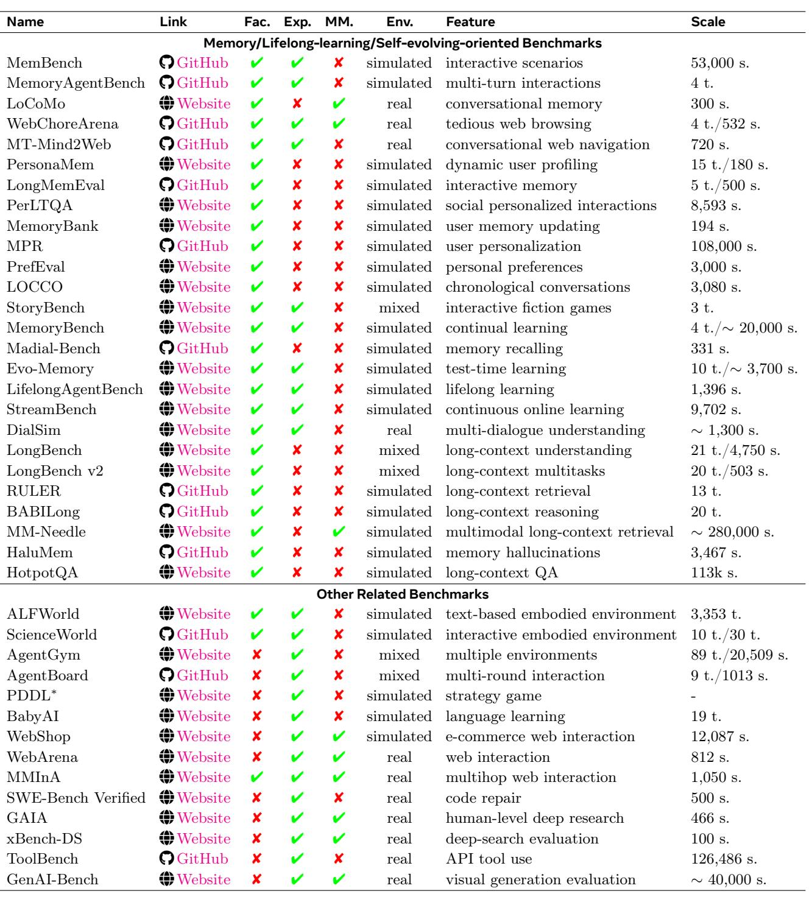
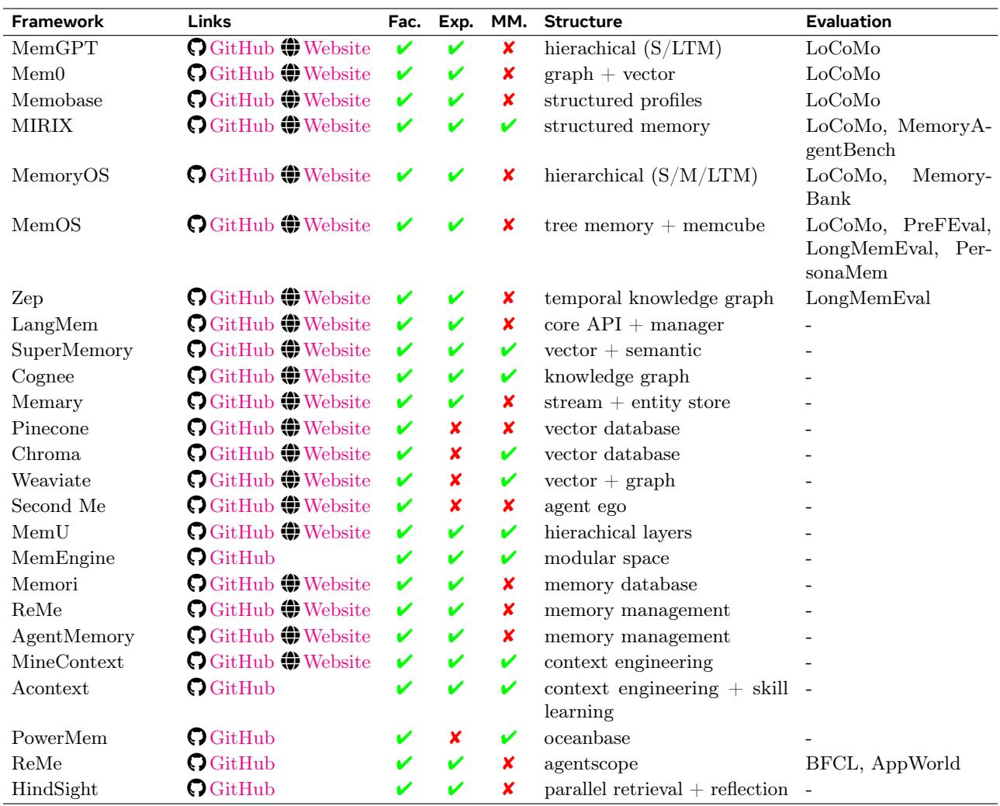

[← 返回 README](../README.md)

# 6 Resources and Frameworks

> 💡 **批注**: Section 6 是实用参考 — 汇总了 memory 相关的 benchmark 和开源框架。Table 8 的 benchmark 分类（memory-oriented / lifelong / self-evolving / other related）非常全面，是做 agent memory 研究的必备参考。

# 6.1 Benchmarks and Datasets

In this section, we survey representative benchmarks and datasets that have been used (or could be used) to evaluate the memory, long-term, continual-learning, or long-context capabilities of LLM-based agents. We classify these benchmarks into two broad categories: (1) those explicitly designed for memory / lifelong learning / self-evolving agents, and (2) those originally developed for other purposes (e.g., tool-use capacity, web search, embodied action) but nevertheless relevant for memory evaluation due to their long-horizon, multi-task, or sequential nature.

# 6.1.1 Benchmarks for Memory / Lifelong / Self-Evolving Agents

Memory-oriented benchmarks focus primarily on how well an agent can construct, maintain, and exploit an explicit memory of past interactions or world facts. These tasks typically probe the retention and retrieval of information across multi-turn dialogues, user-specific sessions, or long synthetic narratives, sometimes including multimodal signals.

A consolidated overview of these benchmarks, including their memory focus, environment type, modality, and evaluation scale, is provided in Table 8, which serves as a structured reference for comparing their design objectives and evaluation settings. Representative examples such as MemBench (Tan et al., 2025a), LoCoMo (Maharana et al., 2024), WebChoreArena (Miyai et al., 2025), MT-Mind2Web (Deng et al., 2024), PersonaMem (Jiang et al., 2025a), PerLTQA (Du et al., 2024), MPR (Zhang et al., 2025v), PrefEval (Zhao et al., 2025d), LOCCO (Jia et al., 2025), StoryBench (Wan and Ma, 2025), Madial-Bench (He et al., 2025), DialSim (Zheng et al., 2025b), LongBench (Bai et al., 2024), LongBench v2 (Bai et al., 2025), RULER (Hsieh et al., 2024), BALILong (Kuratov et al., 2024) MM-Needle (Wang et al., 2025e), and HaluMem (Chen et al., 2025a) stress user modeling, preference tracking, and conversation-level consistency, often under simulated settings where ground-truth memories can be precisely controlled.

Lifelong-learning benchmarks extend beyond isolated memory retrieval to examine how agents continually acquire, consolidate, and update knowledge over long horizons and evolving task distributions. Benchmarks such as LongMemEval (Wu et al., 2025a), MemoryBank (Zhong et al., 2024), MemoryBench (Ai et al., 2025), LifelongAgentBench (Zheng et al., 2025b), and StreamBench (Wu et al., 2024a), are designed around sequences of tasks or episodes in which new information gradually arrives and earlier information may become obsolete or conflicting. These setups emphasize phenomena like catastrophic forgetting, forward and backward transfer, and test-time adaptation, making them suitable for studying how memory mechanisms interact with continual-learning objectives. In many cases, performance is tracked not only on the current task but also on previously seen tasks or conversations, thereby quantifying how well the agent preserves useful knowledge while adapting to new users, domains, or interaction patterns.

Table 8 Overview of benchmarks relevant to LLM agent memory, long-term, lifelong learning, and self-evolving evaluation. The table covers two categories of benchmarks: (i) benchmarks explicitly designed for memory-, lifelong learning-, or self-evolving agent evaluation, and (ii) other agent-oriented benchmarks that implicitly stress long-horizon memory through sequential, multi-step, or multi-task interactions. Fac. and Exp. indicate whether a benchmark evaluates factual memory or experiential (interaction-derived) memory, respectively. MM. denotes the presence of multimodal inputs, while Env. indicates whether the benchmark is conducted in a simulated or real environment. Feature summarizes the primary capability under evaluation, and Scale reports the approximate benchmark size in terms of samples (s.) or tasks (t.). PDDL denotes commonly used PDDL-based planning subsets.   

Self-evolving-agent benchmarks go a step further by treating the agent as an open-ended system that can iteratively refine its own memory, skills, and strategies through interaction. Here, the focus is not only on storing and recalling information, but also on meta-level behaviors such as self-reflection, memory editing, tool-augmented storage, and policy improvement over multiple episodes or games. Benchmarks like MemoryAgentBench (Hu et al., 2025c), Evo-Memory (Wei et al., 2025e), and other multi-episode or mission-style environments can be instantiated in a self-evolving setting by allowing the agent to accumulate trajectories, synthesize higher-level abstractions, and adjust its behavior in future runs based on its own past performance. When viewed through this lens, these benchmarks provide a testbed for evaluating whether an agent can autonomously bootstrap more capable behaviors over time-turning static tasks into arenas for long-term adaptation, strategy refinement, and genuinely self-improving memory use.

# 6.1.2 Other Related Benchmarks

Beyond benchmarks explicitly designed for memory or lifelong learning, a wide range of agent-oriented and long-horizon evaluation suites are also relevant for studying memory-related capabilities in LLM-based agents. Although these benchmarks were originally introduced to assess other aspects such as tool use, embodied interaction, or knowledge-intensive reasoning, their sequential, multi-step, and multi-task nature implicitly places strong demands on long-term information retention, context management, and state tracking.

Embodied and interactive environments constitute a major class of such benchmarks. Frameworks like ALFWorld (Shridhar et al., 2021) and ScienceWorld (Wang et al., 2022a) evaluate agents in simulated textbased or partially grounded environments where success requires remembering past observations, intermediate goals, and environment dynamics across extended action sequences. Similarly, BabyAI (Chevalier-Boisvert et al., 2019) focuses on language-conditioned instruction following over temporally extended episodes, implicitly testing an agent’s ability to maintain task-relevant state throughout interaction. While these benchmarks do not explicitly model external memory modules, effective performance often depends on the agent’s capacity to preserve and reuse information over long horizons.

Another prominent category includes web-based and tool-augmented interaction benchmarks. WebShop (Yao et al., 2023a), WebArena (Zhou et al., 2024b), and MMInA (Tian et al., 2025b) assess agents operating in realistic or semi-realistic web environments involving multi-step navigation, information gathering, and decision making. These settings naturally induce long-context trajectories in which earlier actions, retrieved information, or user constraints must be recalled and integrated at later stages. ToolBench (Qin et al., 2024a) further extends this paradigm by evaluating an agent’s ability to select and invoke APIs across complex workflows, where memory of prior tool outputs and tool-use experience is critical for coherent execution.

Multi-task and general agent evaluation platforms also provide indirect but valuable signals about memory usage. AgentGym (Xi et al., 2024b) and AgentBoard (Xi et al., 2024b) aggregate diverse environments or tasks into unified evaluation suites, requiring agents to adapt across tasks while retaining task-specific knowledge and strategies. PDDL-based planning environments, commonly used in agent benchmarks, evaluate strategic reasoning over structured action spaces, where agents benefit from accumulating and reusing experience across episodes to improve long-horizon planning performance.

Finally, several recent benchmarks target demanding real-world or near-real-world reasoning scenarios that inherently stress long-context and cross-step consistency. SWE-Bench Verified (Jimenez et al., 2024) evaluates code repair over realistic software repositories, where agents must reason over long files and evolving code states. GAIA (Mialon et al., 2023) and xBench (Chen et al., 2025c) assess deep research and search-intensive tasks that require synthesizing information gathered across multiple steps and sources. GenAI-Bench (Li et al., 2024a), while focusing on multimodal generation quality, similarly involves complex workflows in which memory of prior prompts, intermediate outputs, or visual constraints plays a nontrivial role.

Taken together, these benchmarks complement memory-oriented evaluations explicitly by situating LLM-based agents in rich, interactive, and long-horizon settings. Although memory is not always an explicit target of measurement, sustained performance in these environments implicitly depends on an agent’s ability to manage long contexts, preserve relevant information, and integrate past experience into ongoing decision making, making them valuable testbeds for studying memory-related behaviors in practice.

Table 9 Overview of representative open-source memory frameworks for LLM-based agents. The table compares widely used frameworks in terms of the types of memory they support (factual vs. experiential), multimodality, internal memory structure, and reported evaluation benchmarks. Fac. and Exp. denote factual and experiential memory, respectively, MM. indicates multimodal memory support, and Structure summarizes the core memory abstraction or organization mechanism adopted by each framework. Evaluation lists publicly reported benchmarks used to assess memory-related capabilities, when available.   

# 6.2 Open-Source Frameworks

> 💡 **批注**: Table 9 对比了 20+ 开源 memory framework，从 MemGPT、Mem0 等成熟系统到 Pinecone、Chroma 等向量数据库。注意 evaluation coverage 的差异 — 很多框架缺乏标准化评估。

A rapidly growing ecosystem of open-source memory frameworks aims to provide reusable infrastructure for building memory-augmented LLM agents. A structured comparison of representative open-source memory frameworks, including their supported memory types, architectural abstractions, and evaluation coverage, is summarized in Table 9. Most of these frameworks support factual memory via vector or structured stores, and an increasing subset also models experiential traces, such as dialogue histories, user actions, and episodic summaries, with multimodal memory emerging more recently. Open-source memory frameworks for LLM agents span a spectrum from agent-centric systems with rich, hierarchical memory abstractions to more generalpurpose retrieval or memory-as-a-service backends, e.g., MemGPT (Packer et al., 2023b), Mem0 (Chhikara et al., 2025), Memobase, MemoryOS (Kang et al., 2025a), MemOS (Li et al., 2025l), Zep (Rasmussen et al., 2025), LangMem (LangChain, 2025), SuperMemory (Supermemory, 2025), Cognee (Cognee, 2025), Memary (Memary, 2025), Pinecone, Chroma, Weaviate, Second Me, MemU, MemEngine (Zhang et al., 2025t), Memori, ReMe (AgentScope, 2025), AgentMemory, and MineContext (MineContext, 2025). Many of them explicitly separate short- and long-term stores and offer graph-based, profile-based, or modular memory spaces, and some have begun to report results on memory-based benchmarks. The others typically provide scalable vector or graph databases, APIs, and semantic or streaming entity layers that help organize context but often leave agent behavior and evaluation protocols to the application. Overall, these frameworks are rapidly maturing in their representational flexibility and system design.

