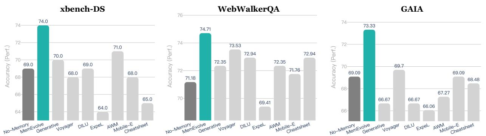
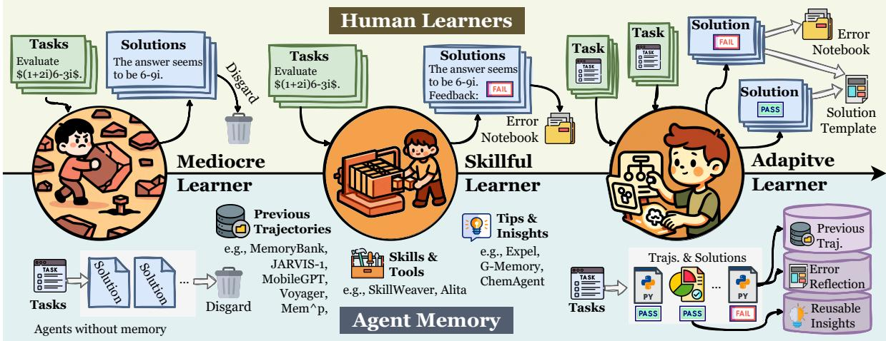

[← 返回 README](../README.md)

# Abstract

## 📌 预览
MemEvolve 的核心主张：现有记忆系统只能帮 agent 进化，但记忆架构本身是静态的。MemEvolve 提出让记忆架构也能"元进化"。配套 EvolveLab 统一代码库。

---

Self-evolving memory systems are unprecedentedly reshaping the evolutionary paradigm of large language model (LLM)-based agents. Prior work has predominantly relied on manually engineered memory architectures to store trajectories, distill experience, and synthesize reusable tools, enabling agents to evolve on the fly within environment interactions. However, this paradigm is fundamentally constrained by the staticity of the memory system itself: while memory facilitates agent-level evolving, the underlying memory architecture cannot be meta-adapted to diverse task contexts.

> 💡 **核心问题**: 现有范式的根本局限 — 记忆帮 agent 进化，但记忆架构本身不能进化。就像一个老师的教学方法永远不变，虽然学生在学，但学习效率受限于固定的教学模式。

To address this gap, we propose MemEvolve, a meta-evolutionary framework that jointly evolves agents' experiential knowledge and their memory architecture, allowing agent systems not only to accumulate experience but also to progressively refine how they learn from it.

> 💡 **MemEvolve 核心思想**: "双进化" — 不仅进化经验（内容），还进化记忆架构（容器）。类似于不仅要学习知识，还要优化学习方法本身。

To ground MemEvolve in prior research and foster openness in future self-evolving systems, we introduce EvolveLab, a unified self-evolving memory codebase that distills twelve representative memory systems into a modular design space (encode, store, retrieve, manage), providing both a standardized implementation substrate and a fair experimental arena.

> 💡 **EvolveLab**: 把 12 种记忆系统（Voyager, ExpeL, AWM, G-Memory 等）统一为 4 组件接口。这是一个非常有价值的工程贡献，相当于给记忆系统做了一个 "统一 API"。

Extensive evaluations on four challenging agentic benchmarks demonstrate that MemEvolve achieves (I) substantial performance gains, improving frameworks such as SmolAgent and Flash-Searcher by up to 17.06%; and (II) strong cross-task and cross-LLM generalization, designing memory architectures that transfer effectively across diverse benchmarks and backbone models.

> 💡 **关键结果**: 17.06% 的提升来自 Kimi K2 在 WebWalkerQA 上的表现。更重要的是跨任务泛化：在 TaskCraft 上进化的架构直接迁移到 xBench/WebWalkerQA 仍有 2-9% 增益，说明搜索到的不是 task-specific hack。

Date: December 23, 2025 | Code: https://github.com/bingreeky/MemEvolve

---

*Figure 1: The comparison between MemEvolve and several popular self-evolving agent memory systems across benchmarks. The underlying framework is Flash-Searcher + GPT-5-Mini.*

> 💡 **Figure 1 批读**:
> - MemEvolve（红色）在所有 4 个 benchmark 上都优于手工设计的记忆系统
> - 注意 ExpeL 和 DILU 在某些 benchmark 上甚至不如 No-Memory，验证了"没有万能记忆架构"的论点
> - 这个雷达图很好地展示了不同记忆系统的"偏科"现象

---

*Figure 2: The paradigm of agent self-evolution admits a natural analogy to human learning. Mediocre learner → Skillful learner → Adaptive learner.*

> 💡 **Figure 2 批读**:
> - 三层递进类比非常清晰：
>   - **平庸学习者** (No Memory): 犯错不记录
>   - **熟练学习者** (Fixed Memory): 固定方式提炼经验（如 ExpeL 总结 insights）
>   - **自适应学习者** (MemEvolve): 根据科目动态调整学习策略
> - 这正是 MemEvolve 的核心定位：从 "skillful" 到 "adaptive" 的跃迁

---

## 🔖 Section 总结

### 核心洞察
1. 记忆架构的静态性是当前 agent 自进化的瓶颈
2. MemEvolve = 内容进化 + 架构进化（双层优化）
3. EvolveLab 提供了 12 种记忆系统的统一模块化实现
4. 跨任务/跨模型泛化能力是最有说服力的结果
