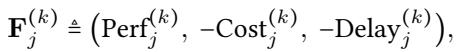

[← 返回 README](../README.md)

# 3 EvolveLab: A Unified Codebase for Self-Evolving Memory

## 📌 预览
EvolveLab 的三个核心：(1) 形式化 Agent 系统和记忆模块 (2) 四组件模块化设计空间 (3) 统一代码库实现 12 种记忆系统。Table 1 是最重要的参考表。

---

In this section, we first formalize the LLM-based agentic system and its associated memory architecture, then present the modular design space of EvolveLab, which comprehensively captures the characteristics of existing self-evolving agent memories, and finally introduce the unified codebase EvolveLab.

## 3.1 Preliminary

We formalize an LLM-based agentic system as $\mathcal{M} = \langle \mathcal{Z}, \mathcal{S}, \mathcal{A}, \Psi, \Omega \rangle$, where $\mathcal{T}$ indexes the $\{1, \cdots, N\}$ agents, $\mathcal{S}$ denotes the shared state space, $A = \bigcup_{i \in \mathcal{T}} A_i$ represents the joint action space, and $\Psi(s_{t+1} | s_t, a_t, \mu(t))$ describes the environment dynamics with $\mu(t) \in \mathcal{T}$ indicating the active agent at time step $t$. The system leverages a memory module $\Omega$, which maintains a continuously evolving memory state $M_t$. At each step, the active agent observes the current state $s_t$, considers a task-specific query $\mathcal{Q}_i$, and interacts with $\Omega$ to retrieve contextually relevant memory $c_t$ conditioned on its interaction history $\mathcal{H}_t$. The agent $\mu_t$'s policy $\pi_{\mu_t}$ then delivers an action:

$$a_t = \pi_{\mu(t)}(s_t, \mathcal{H}_t, \mathcal{Q}, c_t), \quad c_t \sim \Omega(M_t, s_t, \mathcal{H}_t, \mathcal{Q}).$$

> 💡 **形式化要点**:
> - 多 Agent 系统，每步一个 active agent
> - 记忆模块 Ω 维护状态 $M_t$，根据当前状态和历史提供上下文 $c_t$
> - Agent 的行动同时依赖环境状态、历史、任务查询和**记忆上下文**

Following task execution, a trajectory $\tau = (s_0, a_0, \ldots, s_T)$ is recorded, with an overall performance evaluated via a terminal reward $R(\tau)$. The memory system assimilates new experience units $\epsilon$, which can vary in granularity (from individual state-action transitions to aggregated segments or complete trajectories), and updates the memory state as

$$M_{t+1} = \Omega(M_t, \epsilon),$$

where $\Omega$ abstracts the memory's mechanisms for integrating and organizing new experiences or knowledge.

> 💡 **记忆更新**: 经验粒度可以是 step-level 或 trajectory-level，这在后面的 Table 1 中有详细分类。

---

## 3.2 Modular Design Space of Memory Systems

> 💡 **3.2 要点预览**: 这是全文最核心的设计之一 — 把任意记忆系统分解为 (Encode, Store, Retrieve, Manage) 四个独立但相互依赖的组件。

The heterogeneous and rapidly evolving landscape of self-improving agent memories presents challenges for systematic analysis and controlled experimentation. To address this, we propose a modular design space that decomposes any memory system $\Omega$ into four functionally distinct yet interdependent components: $\Omega = (\mathcal{E}, \mathcal{U}, \mathcal{R}, \mathcal{G})$, representing encode, store, retrieve, and manage operations, respectively.

- **Encode** ($\mathcal{E}$): Transforms raw experiences, such as trajectory segments $\tau_t = (s_t, a_t, s_{t+1})$, tool outputs, or self-critiques, into structured representations $e_t = \mathcal{E}(\epsilon_t)$. Encoding may be as simple as compressing raw traces (Zheng et al., 2023) or as sophisticated as extracting generalizable lessons (Zheng et al., 2025).

- **Store** ($\mathcal{U}$): Integrates encoded experiences into the persistent memory $M_t$, yielding $M_{t+1} = \mathcal{U}(M_t, e_t)$. Storage can be vector databases (Zhao et al., 2024), knowledge graphs (Zhang et al., 2025b; Rasmussen et al., 2025), or others.

- **Retrieve** ($\mathcal{R}$): Provides task-relevant memory content, formalized as $c_t = \mathcal{R}(M_t, s_t, \mathcal{Q})$, which informs the agent's policy decision $a_t$. Retrieved content may include reusable tools (Zhang et al., 2025f), planning experience (Tang et al., 2025), or distilled procedural knowledge (Wu et al., 2025b; Yang et al., 2025; Fang et al., 2025b).

- **Manage** ($\mathcal{G}$): Performs offline and asynchronous operations such as consolidation, abstraction, or selective forgetting to maintain long-term memory quality and efficiency, denoted as $M_t' = \mathcal{G}(M_t)$.

> 💡 **四组件详解**:
> | 组件 | 输入 → 输出 | 代表方法 |
> |------|-------------|----------|
> | Encode | 原始轨迹 → 结构化经验 | 压缩 trace / 提取 insights / 生成 API |
> | Store | 经验 → 持久化存储 | Vector DB / Graph / JSON / Tool Library |
> | Retrieve | 查询 → 相关记忆 | Semantic search / Graph traversal / Contrastive |
> | Manage | 记忆库 → 优化后的记忆库 | 去重 / 遗忘 / 合并 / 剪枝 |
>
> **关键洞察**: 这四个组件的排列组合构成了记忆系统的"基因型"(genotype)，MemEvolve 就是在这个基因空间中做进化搜索。

This modular abstraction allows us to represent each memory system as a specific combination of programmatic implementations for $(\mathcal{E}, \mathcal{U}, \mathcal{R}, \mathcal{G})$, forming a "genotype" that facilitates the meta-evolutionary process of MemEvolve.

---

*Table 1: A taxonomy of self-improving agent memory systems implemented in EvolveLab.*

> 💡 **Table 1 批读 — 12 种记忆系统的详细分类**:
>
> **按 Encode 模态分**:
> - Trajectory + Tips: Voyager, ExpeL, Generative
> - Tips & Shortcuts: Mobile-E, Cheatsheet
> - Workflows: AWM, G-Memory, Agent-KB, Memp, EvolveR
> - APIs: SkillWeaver
>
> **按 Store 分**:
> - Vector DB（主流）: Voyager, ExpeL, Generative, DILU, AWM, Mobile-E
> - JSON: Cheatsheet, Memp, EvolveR
> - Graph: G-Memory
> - Hybrid DB: Agent-KB
> - Tool Library: SkillWeaver
>
> **按 Manage 分** — 这是最大的差异点：
> - 大多数系统 **没有 Manage**（N/A）！
> - 有 Manage 的：SkillWeaver (pruning), G-Memory (episodic consolidation), Agent-KB (dedup), Memp (failure-driven), EvolveR (update & pruning)
>
> **关键观察**: G-Memory（同作者 Guibin Zhang）是唯一用 Graph 存储 + 有 Episodic Consolidation 的系统，最全面。

---

## 3.3 EvolveLab Codebase

Based on the above design space, we introduce EvolveLab, a unified and extensible codebase designed for the systematic implementation and evaluation of self-evolving memories, serving as a standardized resource for the community.

**Implementation.** The cornerstone of EvolveLab is its modular and hierarchical design. Every memory architecture re-implemented in our codebase (see Table 1) inherits from a singular abstract base class, BaseMemoryProvider, which enforces the unified four-component interface: ♣ Encode, ♠ Store, ♥ Retrieve, and ♠ Manage. This ensures that diverse memory mechanisms can be managed, modified, and evolved under a consistent programmatic structure. More details on the implementations can be found at Section A.

> 💡 **工程设计**: 所有 12 种记忆系统都继承自 `BaseMemoryProvider`，统一接口。这使得 MemEvolve 可以方便地替换/进化任意组件。

**Evaluation.** Beyond unified implementation, EvolveLab provides a standardized testbed for rigorously assessing memory architectures across diverse agentic tasks. The framework offers out-of-the-box support for multiple challenging benchmarks, including GAIA (Mialon et al., 2023), xBench (Chen et al., 2025), and DeepResearchBench (Du et al., 2025). EvolveLab accommodates two evaluation paradigms: an **online mode**, where the experiential memory base is updated on-the-fly as the agent system processes a continuous stream of tasks, and an **offline mode**, where the memory system first accumulates experience from a static set of trajectories before being assessed on separate, unseen tasks. To ensure robust and versatile assessment, we support multiple evaluation protocols, including exact string matching and flexible LLM-as-a-Judge.

> 💡 **评测模式**:
> - **Online**: 边做任务边更新记忆（更真实）
> - **Offline**: 先积累经验库，再在新任务上评测
> - 两种模式可以测试不同的记忆特性

---

## 🔖 Section 总结

### 关键数字速查
| 指标 | 数值 |
|------|------|
| 实现的记忆系统 | 12 种 |
| 模块化组件 | 4 个 (E, U, R, G) |
| 支持的 Benchmark | GAIA, xBench, DeepResearchBench 等 |
| 评测模式 | Online + Offline |

### 核心洞察
1. **四组件分解是 MemEvolve 的基石** — 使得记忆架构搜索变得可操作
2. **大多数现有系统缺少 Manage 组件** — 暗示记忆维护是被忽视的重要方向
3. **G-Memory 是最完整的系统** — 同时具备 Graph 存储和 Episodic Consolidation
4. **EvolveLab 本身就是一个重要贡献** — 统一了碎片化的记忆系统实现
