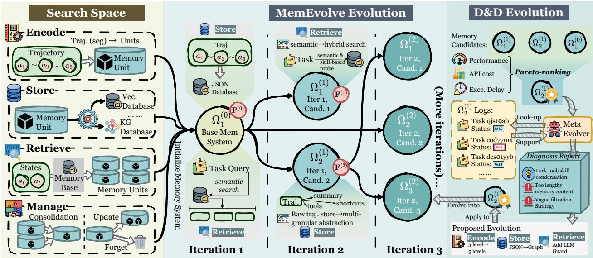

[← 返回 README](../README.md)

# 4 MemEvolve: A Meta-Evolving Memory Framework

## 📌 预览
MemEvolve 的核心方法：(1) 双层进化过程 — 内层经验进化 + 外层架构进化 (2) Diagnose-and-Design 进化算子 — 先诊断缺陷，再约束性重设计。这是全文最重要的技术 Section。

---

## 4.1 Dual-Evolution Process

> 💡 **4.1 要点预览**: 传统方法 = 固定架构 Ω + 迭代更新经验 M。MemEvolve = 维护一组候选架构 {Ω_j}，通过内层评估 + 外层选择进化。

Traditional self-improving memory systems operate under a fixed memory architecture, where the memory interface $\Omega$ is predefined and remains static. Within this architecture, the agent iteratively populates and updates its memory state $M_t$ through interaction with the environment and task experiences. For a trajectory $\tau$ induced by a query $\mathcal{Q}$, the memory evolution follows

$$M_{t+1} = \Omega(M_t, \epsilon_\tau), \quad \epsilon_\tau \in \mathcal{E}(\tau),$$

where $\mathcal{E}(\cdot)$ denotes an experience extraction operator that maps a trajectory to a set of experience units, and $\epsilon_\tau$ is an element sampled from this set. While this enables the accumulation of knowledge, it fundamentally precludes architectural adaptation, as the memory interface $\Omega$ itself remains immutable.

> 💡 **传统范式的局限**: Ω 是固定的，只有 M 在更新。这就像只换教材内容但不改教学方法。

To transcend this limitation, we propose a dual-evolution process that jointly evolves (i) the agent's memory base and (ii) the underlying memory architectures (as illustrated in Figure 3). Instead of a single static $\Omega$, we maintain, at each evolutionary iteration k, a finite set of candidate memory systems $\{\Omega_j^{(k)}\}_{j \in \mathcal{I}^{(k)}}$. Each $\Omega_j^{(k)}$ is instantiated as a concrete realization of the four-component memory interface $\Omega_j^{(k)} \triangleq (\mathcal{E}_j^{(k)}, \mathcal{U}_j^{(k)}, \mathcal{R}_j^{(k)}, \mathcal{G}_j^{(k)})$. The initial iteration starts from a singleton set $|\mathcal{I}^{(0)}| = 1$, corresponding to a hand-designed baseline memory, while later iterations admit multiple competing candidates.

> 💡 **进化种群**: 每轮维护多个候选架构，每个都是 (E, U, R, G) 的具体代码实现。初始只有一个（手工设计的基线），之后扩展为多个竞争者。

---


*Figure 3: The overview of our proposed MemEvolve.*

> 💡 **Figure 3 批读**:
> - 左侧 **Inner Loop**: Agent 用固定记忆架构处理一批任务，生成轨迹和反馈
> - 右侧 **Outer Loop**: 根据反馈诊断架构缺陷，设计新架构
> - 底部 **Iteration**: 新架构进入下一轮内层评估
> - 关键：每轮开始时记忆库 M 是**空的**（从零积累），这样才能公平比较不同架构的学习效率

---

Given a batch of trajectories $\mathcal{T}_j^{(k)}$ independently generated by executing the agent with memory system $\Omega_j^{(k)}$, the dual-evolution process consists of two nested loops:

### Inner Loop (Experience Evolution)

For each candidate memory system $\Omega_j^{(k)}$, the associated memory state $M_{t,j}^{(k)}$, initialized as an empty memory at the beginning of iteration k, is updated via trajectories $\tau \in \mathcal{T}_j^{(k)}$:

$$M_{t+1,j}^{(k)} = \Omega_j^{(k)}(M_{t,j}^{(k)}, \epsilon_\tau), \quad \epsilon_\tau \in \mathcal{E}_j^{(k)}(\tau).$$

Executing the agent with $\Omega_j^{(k)}$ over $\mathcal{T}_j^{(k)}$ yields, for each trajectory $\tau$, a feedback vector $\mathbf{f}_j(\tau) \in \mathbb{R}^d$, where $d = 3$ corresponds to the number of evaluation metrics (i.e., task success, token consumption, and latency). An aggregation operator $\mathcal{S}$ summarizes the inner-loop outcomes for each candidate as

$$\mathbf{F}_j^{(k)} = \mathcal{S}(\{\mathbf{f}_j(\tau)\}_{\tau \in \mathcal{T}_j^{(k)}}), \quad j \in \mathcal{I}^{(k)}.$$

> 💡 **内层循环关键细节**:
> - 每轮从**空记忆**开始，测试架构的学习效率而非积累量
> - 反馈向量 3 维：**任务成功率、token 消耗、延迟** — 多目标优化
> - 每个候选架构独立评估，确保公平比较

### Outer Loop (Architectural Evolution)

The set of memory architectures is then updated based on the collection of summaries $\{\mathbf{F}_j^{(k)}\}_{j \in \mathcal{I}^{(k)}}$. A meta-evolution operator $\mathcal{F}$ selects high-performing candidates and proposes new variants, producing the next iteration's candidate set:

$$\{\Omega_{j'}^{(k+1)}\}_{j' \in \mathcal{I}^{(k+1)}} = \mathcal{F}\left(\{\Omega_j^{(k)}\}_{j \in \mathcal{I}^{(k)}}, \{\mathbf{F}_j^{(k)}\}_{j \in \mathcal{I}^{(k)}}\right).$$

Specifically, $\mathcal{F}$ ranks candidates according to $\mathbf{F}_j^{(k)}$, retains the top-$K$ memory systems, and generates new architectures by modifying or recombining all four components $(\mathcal{E}, \mathcal{U}, \mathcal{R}, \mathcal{G})$ of the selected candidates, where $K$ denotes a fixed survivor budget. We detail the implementation of $\mathcal{F}(\cdot)$ in Section 4.2.

> 💡 **外层循环**: 经典的进化算法范式 — 评估 → 选择 → 变异 → 下一代。但这里的"个体"不是参数向量，而是**代码实现**。

### Unified View

At a higher level, each iteration $k$ alternates between (i) evolving the memory experience base from an empty initialization under a fixed set of architectures, and (ii) evolving the memory architectures themselves based on the induced performance:

$$\{\mathcal{I}^{(k)}, \{\Omega_j^{(k)}\}\} \xrightarrow{\text{inner}} (\{M_{t+1,j}^{(k)}\}, \{\Omega_j^{(k)}\}) \xrightarrow{\text{outer}} (\{M_{t+1,j}^{(k)}\}, \{\Omega_{j'}^{(k+1)}\})$$

By iterating this dual-evolution process, the agent does not merely accumulate experience within a fixed memory system; instead, both the memory base and the governing memory architectures co-evolve, yielding increasingly adaptive and resource-aware memory-driven behavior over time.

> 💡 **统一视角**: 每轮两步 — (1) 内层：固定架构，积累经验 (2) 外层：固定经验反馈，进化架构。这与 MAML 的 inner/outer loop 结构完全对应。

---

## 4.2 Diagnose-and-Design Evolution

> 💡 **4.2 要点预览**: 进化算子 $\mathcal{F}$ 的具体实现。不是随机变异，而是**有理有据的诊断 + 约束性重设计**。这是 MemEvolve 区别于盲目搜索的关键。

We now detail the meta-evolution operator $\mathcal{F}$, which governs the architectural update in each evolutionary iteration. Conceptually, $\mathcal{F}$ decomposes into two coordinated components: (i) architectural selection, which identifies a subset of high-performing memory systems to serve as evolutionary parents, and (ii) diagnose-and-design evolution, which generates new memory architectures from each selected parent through a structured diagnosis procedure followed by a constrained redesign within the modular memory design space.

### Architectural Selection

Given the candidate set $\{\Omega_j^{(k)}\}_{j \in \mathcal{I}^{(k)}}$ and their corresponding summaries $\{\mathbf{F}_j^{(k)}\}$, we define

$$\mathbf{F}_j^{(k)} \triangleq (\text{Perf}_j^{(k)}, -\text{Cost}_j^{(k)}, -\text{Delay}_j^{(k)}),$$

where higher values are preferred in all dimensions. Candidates are first ranked by non-dominated sorting over $\mathbf{F}_j^{(k)}$ yielding a Pareto rank $\rho_j^{(k)}$. Within the same Pareto rank, candidates are further ordered by the primary performance metric $\text{Perf}_j^{(k)}$. The top-$K$ candidates are selected as the parent set:

$$\mathcal{P}^{(k)} = \text{Top-K}_{j \in \mathcal{I}^{(k)}}(\rho_j^{(k)}, \text{Perf}_j^{(k)}).$$

> 💡 **多目标选择**:
> - 三个目标：性能↑、成本↓、延迟↓
> - 用 **Pareto 非支配排序**（NSGA-II 式）做初筛
> - 同 Pareto 层内按性能排序
> - 实际实验中 K=1（只保留最优），S=3（生成 3 个后代）
> - 这意味着每轮只有 3 个新候选 + 最后一轮从 3 个中选 1 个

### Diagnose-and-Design Evolution

For each parent architecture $\Omega_p^{(k)} \in \mathcal{P}^{(k)}$, $\mathcal{F}$ generates a set of $S$ descendants $\{\Omega_{p,s}^{(k+1)}\}_{s=1}^S$ through a two-phase process:

**Diagnosis.** Each parent architecture is examined using trajectory-level evidence from its own execution batch $\mathcal{T}_p^{(k)}$. For each trajectory, the agent provides outcome statistics (e.g., success indicators, token costs) together with a structured description of the associated task query. A replay interface grants access to the corresponding trajectories $\tau \in \mathcal{T}_p^{(k)}$, enabling targeted inspection of memory behavior, including retrieval failures, ineffective abstractions, or storage inefficiencies. The diagnosis phase thus produces a structured defect profile $\mathcal{D}(\Omega_p^{(k)})$ characterizing architectural bottlenecks across the four memory components $(\mathcal{E}_p^{(k)}, \mathcal{U}_p^{(k)}, \mathcal{R}_p^{(k)}, \mathcal{G}_p^{(k)})$.

> 💡 **诊断阶段的关键**:
> - 不是盲目变异！而是**有据可查的分析**
> - 查看具体的失败轨迹，找出记忆系统的瓶颈
> - 例如：检索失败（R 的问题）、编码信息不足（E 的问题）、存储冗余（G 的问题）
> - 输出是结构化的**缺陷报告** $\mathcal{D}$，指向具体组件
> - 这里的"诊断"很可能是用 LLM 做的（GPT-5-Mini 分析轨迹）

**Design.** Conditioned on the defect profile $\mathcal{D}(\Omega_p^{(k)})$, a redesigned architecture is constructed by modifying only the permissible implementation sites within the modular interface, thereby ensuring compatibility and isolating architectural changes to the designated design space. The design step produces $S$ variants by instantiating distinct but valid configurations of the four components:

$$\Omega_{p,s}^{(k+1)} = \text{Design}(\Omega_p^{(k)}, \mathcal{D}(\Omega_p^{(k)}), s), \quad s \in \{1, \ldots, S\}.$$

These variants differ in encoding strategies, storage rules, retrieval constraints, or management policies, yet all conform to the unified memory-system interface and remain executable by the agent.

> 💡 **设计阶段的关键**:
> - 基于缺陷报告做**定向修改**，不是全部推倒重来
> - 修改限定在四组件接口内（确保兼容性）
> - 每个父代生成 S=3 个不同的后代变体
> - **约束性重设计**: 只改有问题的部分，保留有效的部分
> - 实质上是 **LLM-driven code generation** — 用 LLM 根据诊断结果生成新的记忆组件代码

### Resulting Update

Aggregating all descendants across parents yields the next set of candidate architectures:

$$\{\Omega_{j'}^{(k+1)}\}_{j' \in \mathcal{I}^{(k+1)}} = \bigcup_{\Omega_p^{(k)} \in \mathcal{P}^{(k)}} \{\Omega_{p,s}^{(k+1)}\}_{s=1}^S.$$

This diagnose-and-design evolution operationalizes $\mathcal{F}$ for producing increasingly adaptive memory systems, ensuring that architectural updates are both empirically grounded and structurally constrained within the unified design space.

> 💡 **完整进化流程总结**:
> ```
> 初始: 1 个手工基线 (如 AgentKB)
>   ↓ 内层: 60 个任务评估 → 反馈 F
>   ↓ 外层: 保留 Top-1 → 诊断缺陷 → 生成 3 个后代
> 第1轮: 3 个候选
>   ↓ 内层: 每个候选独立评估
>   ↓ 外层: 保留 Top-1 → 诊断 → 生成 3 个后代
> 第2轮: 3 个候选
>   ↓ ...
> 第3轮: 选出最终最优架构
> ```
>
> **总搜索量**: 3轮 × 3候选 × 60任务 = 540 次任务执行。成本不算特别高。

---

## 🔖 Section 总结

### 核心洞察
1. **双层进化 = bilevel optimization**: 内层固定架构积累经验，外层根据反馈进化架构
2. **Diagnose-and-Design 而非随机变异**: 用 LLM 分析失败轨迹，定向修改有问题的组件
3. **多目标选择**: 同时优化性能、成本、延迟（Pareto 排序）
4. **搜索规模适中**: 3轮 × 3后代，总共约 540 次任务执行

### 对我们项目的启发
- **多图记忆策略搜索**: 可以将多图处理也分解为类似的模块（图类型识别、信息提取、跨图关联、记忆压缩），然后用类似的诊断-设计循环搜索最优组合
- **诊断驱动比随机搜索高效**: 关键是分析"为什么失败"，再做定向优化
