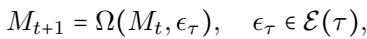
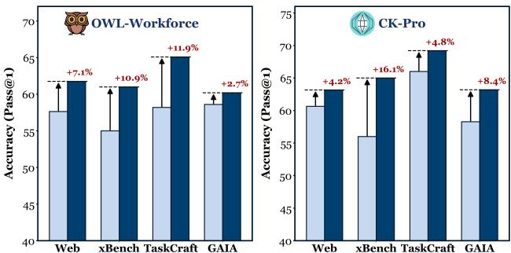
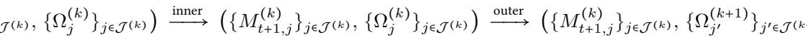
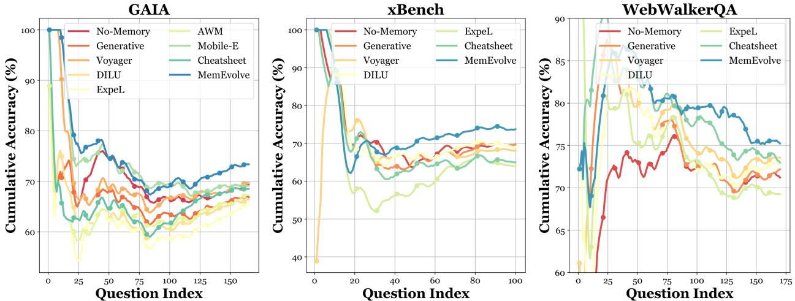
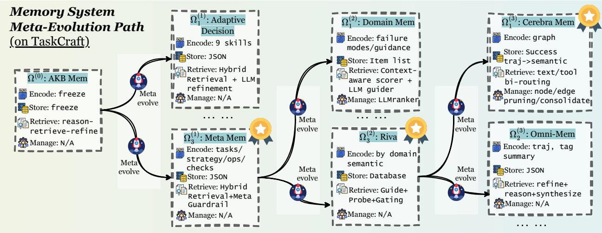
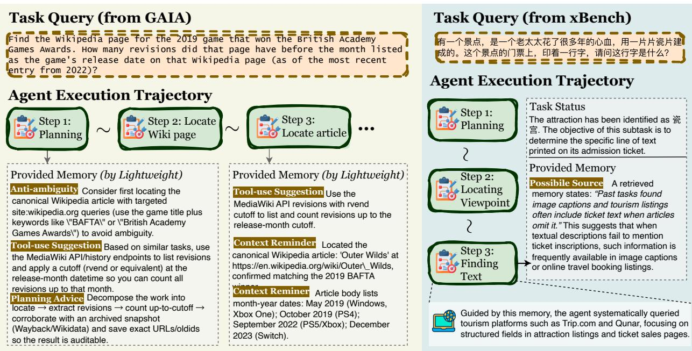

[← 返回 README](../README.md)

# 5 Experiments

## 📌 预览
四大 benchmark 实验 + 跨域/跨模型/跨框架泛化 + 12 种记忆系统对比 + 进化动态可视化。核心发现：MemEvolve 稳定提升 3.5%–17%，且进化出的架构可迁移。

---

## 5.1 Experiment Setup

**Benchmarks.** We evaluate the proposed framework across four challenging agentic benchmarks, including GAIA (Mialon et al., 2023), WebWalkerQA (Wu et al., 2025a), xBench-DeepSearch (xBench-DS) (Chen et al., 2025), as well as TaskCraft (Shi et al., 2025a). Further statistics and details are provided in Section B.1.

> 💡 **四个 Benchmark**:
> - **GAIA**: 165 题，三级难度，综合性 agent 测试
> - **WebWalkerQA**: 680 题（取 170 子集），多轮 web 交互
> - **xBench-DS**: 100 题，规划 + 工具使用 + 推理
> - **TaskCraft**: 300 题（合成），用于元进化训练
> - 策略：在 TaskCraft 上进化，在其他 3 个上测试泛化

**Method Configurations.** We run the dual-evolution process for $K_{\text{max}} = 3$ iterations. In the outer loop, the survivor budget is set as $K = 1$; at each iteration, only the top-ranked architecture is retained and expanded to $S = 3$ descendants. In the inner loop, each candidate architecture $\Omega_j^{(k)}$ is evaluated on a batch $\mathcal{T}_j^{(k)}$ of 60 task trajectories, consisting of 40 newly sampled tasks and 20 tasks reused from the previous iteration to stabilize inter-iteration comparison.

> 💡 **进化超参数**:
> - 3 轮进化，每轮保留 Top-1 扩展 3 个后代
> - 每轮 60 个任务评估（40 新 + 20 复用）— 复用 20 个是为了跨轮稳定对比
> - 总搜索量 ≈ 9 个架构 × 60 个任务 = 540 次评估

**Agent Framework.** We integrate MemEvolve into two representative agentic frameworks: SmolAgent (Roucher et al., 2025), a lightweight two-agent architecture, and Flash-Searcher (Qin et al., 2025), a high-performance single-agent deep research system. To assess the generalization and plug-and-play capability of MemEvolve, we further evaluate it on two held-out multi-agent systems: Tencent's Cognitive Kernel-Pro (CK-Pro) (Fang et al., 2025c), a three-agent framework; and OWL (Hu et al., 2025b), a hierarchical system including planner, coordinator, web, document, and coding agents.

> 💡 **四个框架测试**:
> - SmolAgent（轻量双 Agent）和 Flash-Searcher（单 Agent 深度搜索）用于进化
> - CK-Pro 和 OWL 用于**跨框架泛化测试**（不重新进化，直接迁移）

**Model Configurations.** We instantiate MemEvolve using GPT-5-mini as the LLM backbone for the underlying agentic frameworks, and for supporting the meta-evolution operator $\mathcal{F}(\cdot)$. To further evaluate the cross-LLM generalization capability of MemEvolve, we additionally consider alternative backbones, including DeepSeek V3.2 and Kimi K2.

---

## 5.2 Main Results

*Table 2: Performance of various agent frameworks on WebWalkerQA, xBench-DS, TaskCraft, and GAIA benchmarks.*

> 💡 **Table 2 批读 — 主实验结果**:
>
> **MemEvolve + Flash-Searcher (pass@1)**:
> - WebWalkerQA: 71.18 → **74.71** (+3.53%)
> - xBench: 69.0 → **74.0** (+5.0%)
> - TaskCraft: 69.67 → **72.0** (+2.33%)
> - GAIA: 69.09 → **73.33** (+4.24%)
>
> **MemEvolve + SmolAgent (pass@1)**:
> - WebWalkerQA: 58.82 → **61.18** (+2.36%)
> - xBench: 51.0 → **57.0** (+6.0%)
> - TaskCraft: 64.0 → **67.67** (+3.67%)
> - GAIA: 55.75 → **64.24** (+8.49%)
>
> **跨 LLM 迁移（GPT-5-Mini 上进化 → 其他模型直接用）**:
> - Kimi K2 + Flash-Searcher: 52.35 → **69.41** (+17.06%!) on WebWalkerQA
> - DeepSeek V3.2: 69.41 → **72.35** on WebWalkerQA
>
> **关键观察**: SmolAgent 的提升幅度更大（基线更弱），说明好的记忆系统对弱框架帮助更大。

### Memory System Matters For Agent Systems

As shown in Table 2, equipping agentic systems with effective memory architectures is critical to performance. On xBench, SmolAgent + GPT-5-Mini achieves an initial pass@1 of 51%; after integrating MemEvolve, pass@1 increases by 6%, while pass@3 goes up to 68.0%. Similarly, Flash-Searcher + GPT-5-Mini improves from 69% to 74% on xBench when augmented with MemEvolve.

> 💡 **记忆系统很重要**: 在没有记忆的情况下，SmolAgent 只有 51%，加上 MemEvolve 到 57%（pass@1）甚至 68%（pass@3）。这说明好的记忆系统相当于"免费"提升了几个模型等级的能力。

### MemEvolve Exhibits Cross-Task, Cross-Model, and Cross-Framework Generalization

Recall that the memory systems used on WebWalkerQA and xBench are directly inherited from those evolved on TaskCraft, without any task-specific meta-evolution. Nevertheless, these transferred memories yield consistent gains on more challenging benchmarks (WebWalkerQA: 58.82→61.18%; xBench + Flash-Searcher: 69.0→74.0%), indicating that MemEvolve captures task-agnostic principles of memory design rather than overfitting to individual datasets.

> 💡 **三维泛化是最有说服力的结果**:
> 1. **跨任务**: TaskCraft 上进化 → WebWalkerQA/xBench 上直接有效
> 2. **跨模型**: GPT-5-Mini 上进化 → Kimi K2/DeepSeek V3.2 上直接有效
> 3. **跨框架**: Flash-Searcher 上进化 → CK-Pro/OWL 上直接有效
>
> 这说明 MemEvolve 发现的是**通用的记忆设计原则**，而非 task-specific heuristics。

---

*Figure 4: The cross-framework generalization analysis. Transfer memory evolved on TaskCraft + Flash-Searcher to OWL and CK-Pro.*

> 💡 **Figure 4 批读**:
> - 红色百分比是 MemEvolve 相对无记忆基线的提升
> - OWL: +3.55%~8.49% across benchmarks
> - CK-Pro: +1.67%~5.0%
> - 跨框架迁移有效，但增益略低于原框架，合理

---

## 5.3 Self-Evolving Memory Comparison

*Table 3: Performance, cost, delay, and steps across datasets under different memory settings for Flash-Searcher.*

> 💡 **Table 3 批读 — MemEvolve vs 12 种手工记忆系统**:
>
> **关键发现 1 — 现有记忆系统不稳定**:
> - ExpeL 在所有 3 个 benchmark 上都**低于** No-Memory！（66.06 vs 69.09 on GAIA）
> - DILU 在 GAIA 上降 2.42%，在 WebWalkerQA 上升 1.76%
> - Cheatsheet 在 WebWalkerQA 上有效，但 xBench 上降 4%
> - **没有一个手工系统能在所有 benchmark 上稳定提升**
>
> **关键发现 2 — MemEvolve 稳定提升**:
> - GAIA: +4.24%, xBench: +5.0%, WebWalkerQA: +3.53%
> - 成本几乎不增加（GAIA: $0.085 vs $0.086 No-Memory）
> - 延迟略增但在合理范围
>
> **关键发现 3 — ExpeL 失败的原因**:
> 原文指出 ExpeL 是为简单 embodied/QA 场景设计的，其 prompts 不适合 long-horizon deep research。这正好印证了"没有万能记忆"的论点。

### Existing Memory Systems Fail to Deliver Consistent Gains

Despite faithful re-implementations aligned with the original designs, many existing memory systems do not yield stable improvements. For example, DILU improves performance on xBench and WebWalkerQA, yet degrades GAIA by 2.42%. Dynamic Cheatsheet achieves a 1.76% gain on WebWalkerQA via skill condensation, but performs poorly on GAIA and xBench. More extreme cases are also observed: ExpeL underperforms on all three benchmarks. Upon closer inspection, this is unsurprising, as ExpeL was originally designed for relatively simple embodied or QA settings (e.g., ALFWorld, HotpotQA), and its prompts and mechanisms are ill-suited for long-horizon, long-context deep research. These results underscore the necessity of task-aware memory design.

### MemEvolve Delivers Robust and Consistent Improvements

In contrast to prior approaches, MemEvolve yields stable and robust performance gains. Although the underlying memory system is evolved on TaskCraft, it consistently achieves improvements of 3.54%–5.0% across all three evaluated benchmarks.

> 💡 **MemEvolve 的优势不是绝对性能最高，而是稳定一致的提升**。这比某个系统在一个 benchmark 上很高但在另一个上暴跌要有价值得多。

---

*Figure 5: Evolution of cumulative accuracy across question indices.*

> 💡 **Figure 5 批读**: 随着任务积累，MemEvolve（红色）逐渐拉开与其他系统的差距。早期波动大（样本少），后期稳定收敛到最优。这说明 MemEvolve 的记忆系统确实在"学习"中变好。

---

## 5.4 Meta-Evolving Dynamics

*Figure 6: Illustration of the progressive evolution from the fixed AgentKB architecture to increasingly agentic and efficient memory architectures (Riva, Cerebra).*

> 💡 **Figure 6 批读 — 进化过程可视化（最精彩的部分）**:
>
> **第 1 轮**: 从 AgentKB（冻结编码+存储）开始
> - $\Omega_1^{(1)}$: Adaptive Decision System — 激进方案，9 种技能粒度（被淘汰）
> - $\Omega_3^{(1)}$: Meta Memory System — 保守方案，4 级存储 + LLM 元守门人（胜出）
> - **观察**: 保守策略比激进策略更稳健
>
> **第 2 轮**: 从 Meta Memory System 继续进化
> - 记忆编码和检索越来越依赖 **agent 自主决策**而非预定义管道
> - 关键特征: **agentic** — 让 agent 自己决定存什么、检索什么
>
> **第 3 轮**: 演化出 Riva 和 Cerebra
> - **Riva**: AgentKB 风格但去掉大规模离线知识库，在线轻量化
> - **Cerebra**: 不仅提取文本 insights，还生成**可复用工具**+ 周期性维护
>
> **进化趋势**:
> 1. 从固定管道 → agentic 决策（agent 自己决定记忆策略）
> 2. 从单一模态 → 多模态记忆（文本 insights + 可复用工具）
> 3. 从无维护 → 主动维护（周期性清理和合并）

### Agents Spontaneously Evolve Efficient Memory Architectures

Starting from this baseline, MemEvolve explores a spectrum of evolutionary directions. Some candidates are relatively aggressive (e.g., $\Omega_1^{(1)}$, an Adaptive Decision System that decomposes a single agent trajectory into nine skill granularities), while others are more conservative (e.g., $\Omega_3^{(1)}$, a Meta Memory System that stores trajectories at four levels and introduces an LLM-based meta-guardrail during retrieval to filter irrelevant information). The latter emerges as the winner in the first evolutionary round. The defining characteristic of this stage is agentic: both memory encoding and decoding increasingly rely on agent-driven decisions rather than predefined pipelines.

> 💡 **重要发现 — "agentic" 是进化方向**:
> - Agent 自己决定如何编码和检索记忆，而非程序化规则
> - 这与我们在 G-Memory 中看到的 agent-driven graph construction 一致
> - 暗示未来记忆系统的趋势：**更少的硬编码，更多的 agent 自主权**

---

*Figure 7: Illustration of how evolved memories are instantiated during real-world tasks from GAIA and xBench.*

> 💡 **Figure 7 批读 — 实际执行示例**:
> - 记忆系统在不同阶段提供不同粒度的指导：
>   - **规划阶段**: 高层次任务分解策略
>   - **执行阶段**: 细粒度工具使用建议
>   - **上下文回忆**: 之前 turn 的关键信息
> - 还展现了**预测性行为**：预测目标信息可能在旅游网站的图片内容中，引导 agent 去 trip.com 查找
> - 这说明进化出的记忆不只是被动存取，而是**主动引导** agent 的行为

### Evolved Memory Systems Are Effective in Practice

The results illustrate that Lightweight delivers memory content at varying levels of granularity, adaptively tailored to different task stages. During early planning, the memory provides high-level guidance, such as task decomposition strategies. As execution proceeds, it offers more fine-grained recommendations for tool-use, along with a form of working memory that highlights salient information from previous turns.

---

## 🔖 Section 总结

### 关键数字速查
| 指标 | 数值 |
|------|------|
| Flash-Searcher 提升 (pass@1) | +3.5%~5.0% across benchmarks |
| SmolAgent 提升 (pass@1) | +2.4%~8.5% |
| 最大跨模型提升 | +17.06% (Kimi K2, WebWalkerQA) |
| 跨任务迁移增益 | 2.0%~9.09% |
| API 成本增加 | 几乎为零 |
| 进化轮数 | 3 轮 |

### 核心洞察
1. **没有一个手工记忆系统能稳定提升所有 benchmark** — 验证了 No Free Lunch
2. **MemEvolve 的核心价值是稳定性** — 不追求单点最优，而是全面一致的提升
3. **进化趋势: agentic + multi-modal + active maintenance** — 记忆系统的未来方向
4. **跨域泛化说明发现的是通用原则** — 不是 task-specific heuristics
