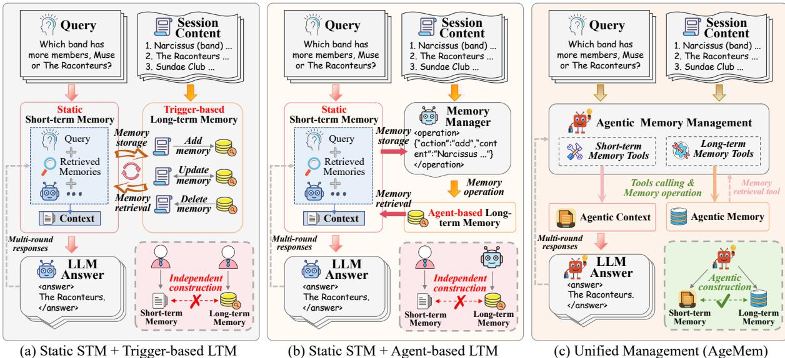
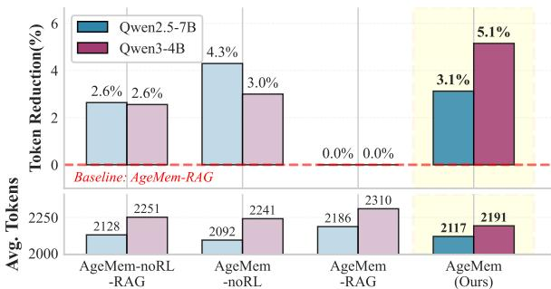
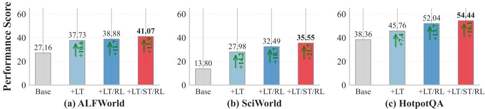
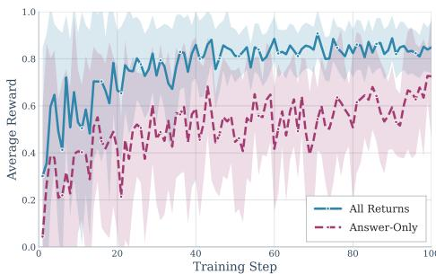
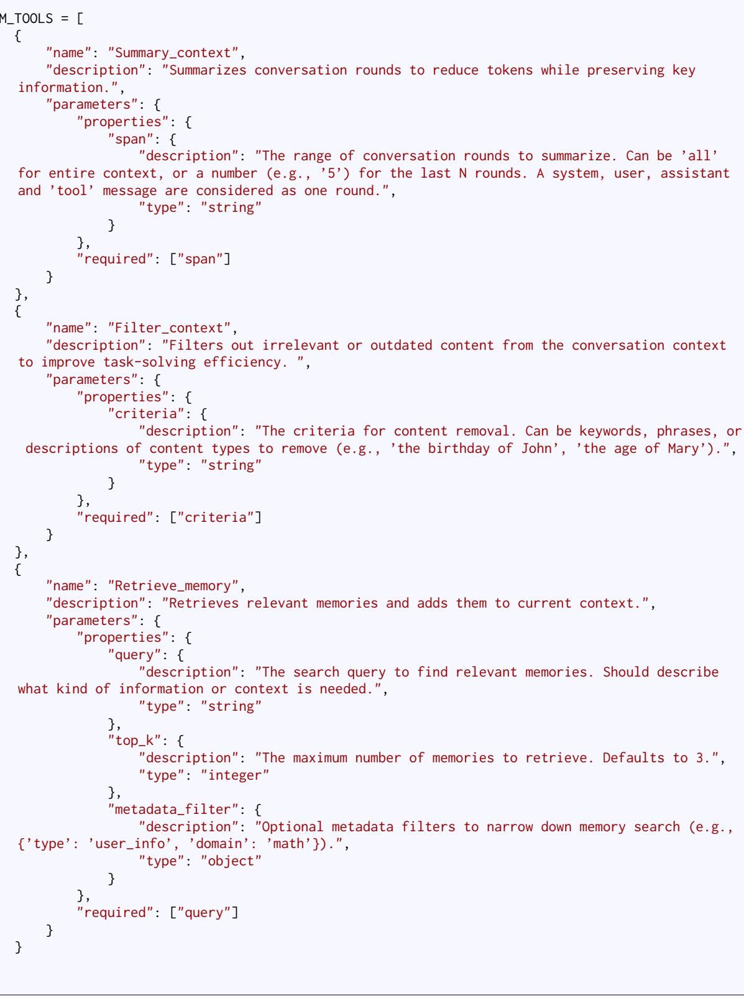
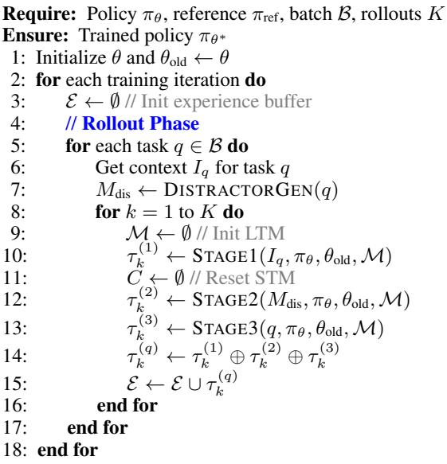
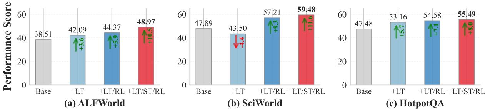
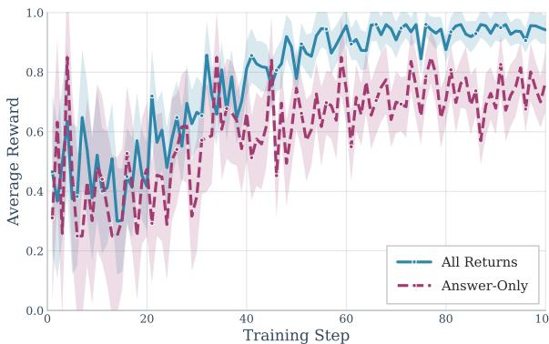

# Agentic Memory: Learning Unified Long-Term and Short-Term Memory Management for Large Language Model Agents

Yi $\mathbf { Y } \mathbf { u } ^ { 1 , 2 }$ , Liuyi $\mathbf { Y a o } ^ { 1 , \dag }$ , Yuexiang $\mathbf { X i e ^ { 1 } }$ , Qingquan $\mathbf { T a n } ^ { 2 }$ , Jiaqi Feng2, Yaliang $\mathbf { L i } ^ { 1 }$ , and Libing $\mathbf { W } \mathbf { u } ^ { 2 , \dagger }$ 1Alibaba Group, 2School of Cyber Science and Engineering, Wuhan University {yui1212,tanqingquan,jiaqiFeng,wu}@whu.edu.cn {yly287738,yuexiang.xyx,yaliang.li}@alibaba-inc.com †Corresponding authors

# Abstract

Large language model (LLM) agents face fundamental limitations in long-horizon reasoning due to finite context windows, making effective memory management critical. Existing methods typically handle long-term memory (LTM) and short-term memory (STM) as separate components, relying on heuristics or auxiliary controllers, which limits adaptability and end-to-end optimization. In this paper, we propose Agentic Memory (AgeMem), a unified framework that integrates LTM and STM management directly into the agent’s policy. AgeMem exposes memory operations as tool-based actions, enabling the LLM agent to autonomously decide what and when to store, retrieve, update, summarize, or discard information. To train such unified behaviors, we propose a three-stage progressive reinforcement learning strategy and design a step-wise GRPO to address sparse and discontinuous rewards induced by memory operations. Experiments on five long-horizon benchmarks demonstrate that AgeMem consistently outperforms strong memory-augmented baselines across multiple LLM backbones, achieving improved task performance, higher-quality long-term memory, and more efficient context usage.

# 1 Introduction

In long-horizon agentic tasks involving multi-step reasoning and complex workflows (Chang et al., 2024), the effectiveness of large language model (LLM) agents is fundamentally constrained by the information they can attend to at any given time, which we collectively refer to as the agent’s memory (Xiong et al., 2025; Goodyear et al., 2025). Memory typically falls into two categories: longterm memory (LTM), which persistently stores user- or task-specific knowledge (Zhong et al., 2024; Jiang et al., 2024), and short-term memory (STM), which comprises the information contained in the current input context (Wu et al., 2025b; Gao et al., 2025b). High-quality LTM supports efficient retrieval of accumulated knowledge, while effective STM management reduces redundancy and preserves salient context. Together, they mitigate the limitations of finite context windows, making their joint management crucial for improving agent performance in complex reasoning settings.

However, existing research has predominantly treated LTM and STM as independent components. STM is commonly enhanced through retrievalaugmented generation (RAG) (Pan et al., 2025b), such as in MainRAG (Chang et al., 2025) and ReSum (Wu et al., 2025a), which expand usable context via external retrieval or periodic summarization. Although effective in some tasks, these methods rely heavily on predefined schedules or heuristic rules, potentially resulting in overlooked infrequent but critical details as well as unnecessary noise (Ma et al., 2025; Dong et al., 2025). In contrast, LTM management has progressed along separate lines, typically categorized into triggerbased (Kang et al., 2025; Wang and Chen, 2025; Wang et al., 2025c; Chhikara et al., 2025) and agent-based (Yan et al., 2025; Hu et al., 2025; Xu et al., 2025) paradigms. The former executes fixed memory operations at predefined moments, whereas the latter incorporates a specialized memory manager to determine what and how to store. Despite offering more flexibility, most approaches still depend on handcrafted rules or auxiliary expert models, limiting adaptability and increasing system complexity (Xiong et al., 2025).

As a consequence, LTM and STM are typically treated as separate and loosely coupled modules. As illustrated in Figure 1, existing architectures generally follow two patterns: (a) static STM with trigger-based LTM, or (b) static STM with agentbased LTM. In both settings, the two memory systems are optimized independently and later combined in an ad hoc way, leading to fragmented memory construction and suboptimal performance in long-horizon reasoning tasks. Thus, unifying the management of LTM and STM remains a necessary yet largely unexplored challenge.

  
Figure 1: Comparison between independent and unified memory management frameworks. (Left) Traditional framework with static STM and trigger-based LTM. (Middle) Independent framework with an additional Memory Manager controlling LTM in an agent-based manner, while STM remains static. (Right) The proposed AgeMem framework, where LTM and STM are jointly and intelligently managed via explicit tool-based operations.

Nevertheless, achieving unified memory management poses three fundamental challenges. (C1) Functional heterogeneity coordination: LTM and STM serve distinct yet complementary purposes: LTM determines what to store, update, or discard, while STM governs what to retrieve, summarize, or remove from the active context (Zhang et al., 2025b). The challenge lies in designing a unified mechanism that orchestrates their interplay synergistically. (C2) Training paradigm mismatch: Existing reinforcement learning (RL) frameworks adopt markedly different training strategies for the two memory types (Ma et al., 2024). LTM-focused training often leverages session-level information available prior to interaction, whereas STM training typically injects distractors to simulate long-horizon contexts (Sun et al., 2024). Moreover, standard RL assumes continuous trajectories with stable rewards, which conflicts with the inherently fragmented and discontinuous experiences produced by memory operations (Wu et al., 2025a), making end-to-end optimization particularly challenging. (C3) Practical deployment constraints: Many agent systems rely on an auxiliary expert LLM for memory control, significantly increasing inference cost and training complexity. How to integrate unified memory management directly into an agent without dependence on external expert models remains an open problem.

To address these challenges, we propose Agentic Memory (AgeMem), a unified framework that jointly manages LTM and STM, illustrated in Figure 1 (right). Unlike prior designs that treat memory as an external component, AgeMem integrates both memory types directly into the agent’s decision-making process. Through a unified toolbased interface, the LLM autonomously invokes and executes memory operations for both LTM and STM. Furthermore, we design a three-stage progressive RL strategy: the model first acquires LTM storage capabilities, then learns STM context management, and finally coordinates both forms of memory under full task settings. To address the fragmented experience issue across training stages, we design a step-wise Group Relative Policy Optimization (GRPO) (Shao et al., 2024), which transforms cross-stage dependencies into learnable signals, thereby alleviating the challenges posed by sparse and discontinuous rewards in RL. We evaluate AgeMem on five long-context, reasoning-intensive benchmarks. Comprehensive results show that AgeMem consistently outperforms strong baselines, validating the effectiveness of unified memory management.

Our main contributions are as follows:

• We propose Agentic Memory (AgeMem), a unified agentic memory framework that enables LLM-based agents to autonomously decide when, what, and how to manage both long-term and short-term memory. • We develop a three-stage progressive RL strategy equipped with a step-wise GRPO mechanism, facilitating effective end-to-end learning of unified memory management behaviors.

• We conduct comprehensive evaluations across multiple models and long-horizon benchmarks, demonstrating the robustness and effectiveness of AgeMem in complex agentic tasks.

# 2 Background and Related Work

Long-term memory (LTM). Persistent LTM is crucial for LLM-based agents operating over extended horizons (Wang et al., 2025b; Li et al., 2025). Recent work has explored diverse architectural designs for modeling LTM. LangMem (LangChain Team, 2025) provides a modular framework that supports multiple memory types, while A-Mem (Xu et al., 2025) adopts a Zettelkasten-inspired design that links structured knowledge units to facilitate consolidation. Mem0 (Chhikara et al., 2025) proposes a scalable extract-update pipeline and extends it to a graph-based variant for structured reasoning, and Zep (Rasmussen et al., 2025) represents memory as a temporal knowledge graph to enable crosssession and time-aware reasoning. Although effective in organizing and retrieving information, these approaches largely rely on predefined memory structures or heuristic update rules. As memory grows, such designs commonly suffer from increased system complexity and lack adaptive, learning-based strategies for prioritization and forgetting. In contrast, our work aims to learn an adaptive memory policy that allows agents to dynamically decide what to store, update, or forget, depending on task demands and long-term utility.

Short-term memory (STM). STM in agentic LLMs primarily concerns context selection and retrieval (Wang et al., 2024; Jin et al., 2024). Retrieval-Augmented Generation (RAG) (Pan et al., 2025b; Salama et al., 2025; Kagaya et al., 2024) is the dominant paradigm, expanding usable context by injecting retrieved content into prompts. While effective, RAG does not fundamentally prevent context explosion in long-horizon settings and may introduce irrelevant or distracting information. To address this issue, ReSum (Wu et al., 2025a) periodically compresses interaction histories into compact reasoning states, allowing agents to operate beyond fixed context-window constraints. Yet its summarization schedule remains largely predefined, and aggressive compression risks discarding rare but crucial details. Our approach instead enables agents to learn when and how to retrieve, summarize, or filter context, achieving a more flexible balance between efficiency and information preservation.

Reinforcement learning for LLMs. Reinforcement learning has become an effective paradigm for improving the decision-making and reasoning capabilities of LLM-based agents (Yao et al., 2022; Jin et al., 2025; Qian et al., 2025; Chaudhari et al., 2025). Among recent advances, GRPO (Shao et al., 2024) enhances stability by optimizing policies based on the relative quality of sampled trajectories, removing the need for an explicit value function. GRPO and its variants (Gilabert et al., 2025; Wang et al., 2025a) have shown strong performance in complex reasoning tasks. However, existing RLbased systems generally treat memory as a static or external component, making them ill-suited for the discontinuous and fragmented trajectories associated with memory operations (Yan et al., 2025; Zhang et al., 2025a). In contrast, our work integrates RL directly into the memory management process, enabling unified training of both language generation and memory operations.

# 3 Method

We propose Agentic Memory (AgeMem), a unified memory framework that enables LLM agents to autonomously manage both LTM and STM in an end-to-end manner. As illustrated in Figure 1 (right), AgeMem integrates memory management capabilities directly into the agent via a set of specialized tools, enabling the model to learn optimal strategies for unified memory management through three-stage progressive strategy.

# 3.1 Problem Formulation

Unified RL formulation for AgeMem. At each time step $t$ , the agent observes a state $s _ { t } \in S$ composed of the conversation context (short-term memory) $C _ { t }$ , the long-term memory store $\mathcal { M } _ { t }$ , and the task specification $\tau$ $\mathbf { \Psi } : s _ { t } = ( C _ { t } , \mathcal { M } _ { t } , \mathcal { T } )$ . The specification $\tau$ includes the input query $q$ , contextual information $I _ { q }$ , and (for training only) the expected answer $A _ { q }$ . This formulation enables the agent to ground its decision-making in both transient context and persistent knowledge.

Given $s _ { t }$ , the agent selects an action $a _ { t } \in \mathcal A$ from a hybrid action space that includes language generation as well as memory operations. The decision is governed by a parameterized policy $\pi _ { \theta }$ , defined as $\pi _ { \boldsymbol { \theta } } ( a _ { t } | s _ { t } ) = P ( a _ { t } | s _ { t } ; \boldsymbol { \theta } )$ , where $\theta$ denotes the LLM parameters and $a _ { t } = \pi _ { \theta } ( \cdot | s _ { t } )$ . For a trajectory $\tau = ( s _ { 1 } , a _ { 1 } , \dots , s _ { T } , a _ { T } )$ , the cumulative reward is defined as:

$$
R ( \tau ) = \sum w \mathrm { : } R _ { i } \left( \tau \right) + P _ { \mathrm { p e n a l t y } } ( \tau ) ,
$$

where $R _ { i }$ captures task performance and memory quality, and $P _ { \mathrm { p e n a l t y } }$ discourages redundant storage, excessive tool usage, and uncontrolled context expansion. The optimization objective is:

$$
\theta ^ { * } = \arg \operatorname* { m a x } _ { \theta } \mathbb { E } _ { \tau \sim \pi _ { \theta } } [ R ( \tau ) ] .
$$

This formulation treats memory management as an integral component of the agent’s policy, replacing handcrafted heuristics with a learnable mechanism. Three-stage trajectory structure. To capture long-horizon interactions and progressively train memory capabilities, each trajectory is divided into three consecutive stages: $\dot { \tau } = \dot { ( \tau ^ { ( 1 ) } , \tau ^ { ( 2 ) } , \tau ^ { ( 3 ) } ) }$ , with a total length of $T = T _ { 1 } + T _ { 2 } + T _ { 3 }$ . In Stage 1, the agent engages in casual interactions and may store useful information into LTM. Stage 2 introduces distracting or irrelevant content, requiring the agent to manage its STM through selective retention and compression. Stage 3 presents a task that depends on coordinated use of both retained context and earlier accumulated LTM. A key aspect of this design is that the long-term memory $\mathcal { M } _ { t }$ persists across all stages, allowing early knowledge to influence later decisions. In contrast, the context $C _ { t }$ is reset between Stages 1 and 2 to prevent information leakage across phases. The reset before Stage 2 ensures the agent cannot solve the final task via residual context, thereby forcing proper retrieval from LTM and enabling effective training of memory operations.

At each step, we collect an experience tuple ${ e _ { t } } = ( s _ { t } , a _ { t } , r _ { t } , \log \pi _ { \theta _ { \mathrm { o l d } } } ( a _ { t } | s _ { t } ) )$ , where $r _ { t }$ is typically zero for intermediate steps and assigned after trajectory completion, and $\log \pi _ { \theta _ { \mathrm { o l d } } } ( a _ { t } | s _ { t } )$ denotes the log probability under the old policy $\pi _ { \theta _ { \mathrm { o l d } } }$ This representation enables step-wise credit assignment under GRPO (Shao et al., 2024) and allows the agent to attribute long-term rewards to specific memory decisions across stages. By structuring trajectories in this staged yet continuous manner, the agent learns temporally coherent and task-adaptive memory policies essential for robust long-horizon reasoning.

Table 1: Memory management tools in AgeMem for manipulating long-term memory (LTM) and short-term memory (STM).   

<table><tr><td>Tool</td><td>Target</td><td>Function</td></tr><tr><td>ADD</td><td>LTM</td><td>Add new knowledge to Mt</td></tr><tr><td>UPDATE</td><td>LTM</td><td>Modify entries in Mt</td></tr><tr><td>DELETE</td><td>LTM</td><td>Remove entries from Mt</td></tr><tr><td>RETRIEVE</td><td>STM</td><td>Retrieve entries from Mt to Ct</td></tr><tr><td>SUMMARY</td><td>STM</td><td>Summarize segments in Ct</td></tr><tr><td>FILTER</td><td>STM</td><td>Filter out irrelevant segments from Ct</td></tr></table>

# 3.2 Memory Management via Tool Interface

AgeMem exposes memory-related operations to the LLM agent through an explicit tool interface (Table 1). The agent can modify its persistent LTM using ADD, UPDATE, and DELETE, while exercising fine-grained control over STM through RETRIEVE, SUMMARY, and FILTER. Incorporating these tools into the action space transforms memory control from an external heuristic pipeline into an intrinsic component of decision-making. This design allows the agent to adaptively manage memory according to task structure, history, and context. Implementation details are provided in the Appendix A.1.

# 3.3 Three-Stage Progressive RL Strategy

To learn unified and stable memory behaviors, we propose a progressive three-stage training strategy. For each task instance $q \in \mathcal T$ , the agent generates a complete trajectory:

$$
\tau _ { k } ^ { ( q ) } = \big ( \tau _ { k } ^ { ( 1 ) } , \tau _ { k } ^ { ( 2 ) } , \tau _ { k } ^ { ( 3 ) } \big ) , \quad k = 1 , \dots , K ,
$$

where $K$ denotes the number of independent rollouts, and each sub-trajectory $\tau _ { k } ^ { \left( i \right) }$ corresponds to a specific training stage.

Stage 1 (LTM construction). The agent is exposed to contextual information $I _ { q }$ in a casual conversational setting. The goal is to identify salient information and store it into LTM $\mathcal { M } _ { t }$ . During the interaction, the short-term context $C _ { t }$ evolves naturally, and the agent may invoke LTM-related tools when appropriate. Formally, this stage yields a subtrajectory τ (1k $\bar { \tau _ { k } ^ { ( 1 ) } } = \{ e _ { t } \} _ { t = 1 } ^ { T _ { 1 } }$ , where each experience tuple $e _ { t }$ follows the definition in Section 3.1.

Stage 2 (STM control under distractors). The short-term context is reset, while the constructed LTM $\mathcal { M } _ { t }$ is retained. The agent is then presented with semantically related but irrelevant or misleading distractors. The objective is to learn proactive STM control through tool-based operations, such as filtering or summarizing context, in order to suppress noise and preserve useful information. This process forms the sub-trajectory $\tau _ { k } ^ { ( 2 ) } = \{ e _ { t } \} _ { t = T _ { 1 } + 1 } ^ { T _ { 1 } + \bar { T } _ { 2 } }$ , which emphasizes context filtering and compression capability.

Stage 3 (Integrated reasoning and memory coordination). Finally, the agent receives a formal query $q$ requiring both accurate reasoning and effective memory retrieval. The agent must retrieve relevant knowledge from $\mathcal { M } _ { t }$ , appropriately manage the context $C _ { t }$ , and generate a final answer. This stage produces $\tau _ { k } ^ { ( 3 ) } = \{ e _ { t } \} _ { t = T _ { 1 } + T _ { 2 } + 1 } ^ { T }$ , which evaluates the ability of agent to coordinate longterm memory, short-term context management, and task solution in an end-to-end manner.

All three segments form a complete trajectory:

$$
\tau _ { k } ^ { ( q ) } = ( e _ { 1 } , e _ { 2 } , \ldots , e _ { T } ) , \quad T = T _ { 1 } + T _ { 2 } + T _ { 3 } ,
$$

which is then used for policy optimization in the subsequent step-wise GRPO procedure. For a batch of $B$ tasks, we further aggregate all experiences from $K$ independent rollouts into a unified set $\mathcal { E } =$ $\cup _ { q = 1 } ^ { B } \bigcup _ { k = 1 } ^ { K } \bar { \{ e _ { t } \ | \ e _ { t } \ \in \ \tau _ { k } ^ { ( q ) } \} }$ , with a total size of $| \mathcal { E } | = B \times K \times \bar { T }$ , where $\bar { T }$ denotes the average trajectory length. More detailed rollout processes are provided in the Appendix A.3.

# 3.4 Step-wise GRPO for Unified Management

We adopt a step-wise variant of GRPO to connect long-range task rewards with memory decisions across all stages. For task $\{ \tau _ { 1 } ^ { ( q ) } , \dots , \tau _ { K } ^ { ( q ) } \}$ denote the group of parallel roll- $q$ , let $G _ { q } \ =$ outs. Each trajectory yields a terminal reward $r _ { T } ^ { ( k , q ) } = R ( \hat { \tau _ { k } ^ { ( q ) } } )$ We compute the groupnormalized advantage for the terminal step as:

$$
A _ { T } ^ { ( k , q ) } = \frac { r _ { T } ^ { ( k , q ) } - \mu _ { G _ { q } } } { \sigma _ { G _ { q } } + \epsilon } ,
$$

where $\mu _ { G _ { q } }$ and $\sigma _ { G _ { q } }$ are the mean and standard deviation of rewards within $G _ { q }$ , $\epsilon$ prevents division by zero. This advantage is then broadcast to all preceding steps of the same trajectory $A _ { t } ^ { ( k , q ) } = A _ { T } ^ { ( \hat { k } , q ) }$ which assigns a consistent learning signal to all memory and reasoning actions along the trajectory, including those in Stage 1 and Stage 2. In doing so, the final task outcome supervises every intermediate memory decision, enabling long-range credit assignment across heterogeneous stages. We $\mathcal { E } = \cup _ { q , k } ^ { \bar { B } , K } \{ ( e _ { t } , A _ { t } ) \overset { \cdot } { | { e _ { t } \in \tau _ { k } ^ { ( q ) } } , A _ { t } = A _ { t } ^ { ( k , q ) } \} }$ tages,.

Following GRPO, we maximize the expected objective over all experiences:

$$
\begin{array} { l } { { \displaystyle { \cal J } ( \theta ) = \mathbb { E } _ { ( e _ { t } , A _ { t } ) \sim \mathcal { E } } \left[ \rho _ { t } A _ { t } - \beta D _ { \mathrm { K L } } [ \pi _ { \theta } \| \pi _ { \mathrm { r e f } } ] \right] } } \\ { { \displaystyle ~ = \frac { 1 } { | \mathcal { E } | } \sum _ { q = 1 } ^ { B } \sum _ { k = 1 } ^ { K } \sum _ { t = 1 } ^ { T _ { k } ^ { ( q ) } } \left[ \rho _ { t } ^ { ( k , q ) } A _ { t } ^ { ( k , q ) } - \beta D _ { K L } ^ { ( k , q ) } \right] } , } \end{array}
$$

where the importance ratio $\begin{array} { r } { \rho _ { t } ^ { ( k , q ) } = \frac { \pi _ { \theta } ( a _ { t } | s _ { t } ) } { \pi _ { \theta _ { \mathrm { o l d } } } ( a _ { t } | s _ { t } ) } } \end{array}$ controls the update magnitude under the new policy, D(k,q) denotes the KL divergence penalty between the current policy $\pi _ { \theta }$ and a fixed reference $\pi _ { \mathrm { r e f } }$ and $\beta$ is a coefficient that balances exploration and training stability.

# 3.5 Reward Function Design

We design a composite reward that evaluates both downstream task performance and the quality of memory management. The total trajectory-level reward is defined as

$$
R ( \tau ) = \mathbf { w } ^ { \top } { \mathbf R } + P _ { \mathrm { p e n a l t y } } ,
$$

where $\mathbf { w } = [ w _ { \mathrm { t a s k } } , w _ { \mathrm { c o n t e x t } } , w _ { \mathrm { m e m o r y } } ] ^ { \top }$ are tunable coefficients, and $\mathbf { R } = [ R _ { \mathrm { t a s k } } , R _ { \mathrm { c o n t e x t } } , R _ { \mathrm { m e m o r y } } ] ^ { \top }$ correspond to rewards for task completion, context management, and long-term memory management. The penalty term $P _ { \mathrm { p e n a l t y } }$ captures violations such as context overflow or exceeding the interaction limit. Below, we summarize each component, and precise formulas are provided in the Appendix A.2. Task completion reward $R _ { \mathbf { t a s k } }$ . This term provides the primary learning signal by assessing whether the agent solves the task correctly. We obtain a scalar score using an LLM-based judge $S _ { \mathrm { j u d g e } } ( A _ { \mathrm { p r e d } } , A _ { q } ) \ \in \ [ 0 , 1 ]$ , optionally applying a penalty when no answer is produced. This reward encourages accurate, complete task solutions and remains the dominant component to ensure alignment with task objectives.

Context management reward $\scriptstyle R _ { \mathrm { c o n t e x t } }$ . This component evaluates STM behavior, focusing on how effectively the agent controls the active context $C _ { t }$ . It combines three factors: (i) compression efficiency, promoting economical token usage; (ii) preventive actions, rewarding early summarization or filtering to avoid overflow; and (iii) information preservation, penalizing the loss of critical queryrelated content. Each factor is normalized, allowing the reward to balance context efficiency against retention of essential information.

Memory management reward $R _ { \mathbf { m e m o r y } }$ . This term evaluates LTM operations. It aggregates signals for: (i) storage quality, measured as the fraction of stored entries labeled as high-quality and reusable; (ii) maintenance, rewarding meaningful update or delete operations to mitigate memory staleness; and (iii) semantic relevance, computed using an LLM-based score between retrieved memories and the query. Together, these signals incentivize selective, high-value memory construction and responsible upkeep over time.

Penalty terms Ppenalty. Penalties discourage undesirable behaviors such as exceeding the maximum number of dialogue turns or triggering context overflow. Penalty coefficients are chosen so that such violations lead to a substantial reduction in the final trajectory reward, encouraging the agent to maintain safe and efficient memory practices.

  
Figure 2: Memory Quality scores for different methods on HotpotQA. Higher scores indicate better relevance between stored memories and ground-truth facts.

# 4 Experiments

# 4.1 Experimental Setup

Datasets. To comprehensively evaluate AgeMem, we select five widely-used datasets in LLM-based agent research: ALFWorld (Shridhar et al., 2020), SciWorld (Wang et al., 2022), PDDL (Chang et al., 2024), BabyAI (Chevalier-Boisvert et al., 2018), and HotpotQA (Yang et al., 2018). These datasets cover embodied action, game-based reasoning, and knowledge-intensive question answering, providing diverse evaluation scenarios. Since the HotpotQA dataset contains both questions and supporting facts, automatically providing Stage 1 contextual information, AgeMem is fine-tuned with RL only on the HotpotQA training set and then evaluated directly on all datasets. Detailed dataset statistics are provided in Appendix C.1.

Evaluation metrics. For the primary task completion metrics, we adopt Success Rate (SR) for ALFWorld, SciWorld, and BabyAI, Progress Rate (PR) for PDDL, and LLM-as-a-Judge (J) for HotpotQA. Additionally, we employ an LLM-based evaluator to assess the quality of stored long-term memory during knowledge reasoning, measured by Memory Quality (MQ). The prompts of the LLMbased evaluation are provided in Appendix C.2.

Baselines & LLM backbones. We compare AgeMem against four representative agent LTM systems: LangMem (LangChain Team, 2025), AMem $\mathrm { \Delta X u }$ et al., 2025), Mem0 (Chhikara et al., 2025), and $\scriptstyle \mathbf { M e m } 0 ^ { g }$ (a graph-based variant officially provided as part of Mem0). To better demonstrate the effectiveness of RL training, we also include

AgeMem-noRL, which is not fine-tuned with RL. In ablation studies on STM, we compare STM tools with RAG approach. For the base agent models, we use Qwen2.5-7B-Instruct and Qwen3-4B-Instruct. More baseline configurations are in Appendix C.3. Implementation details. We build agents using the Agentscope framework (Gao et al., 2025a) and finetune AgeMem using the Trinity framework (Pan et al., 2025a). For all reward weights in the reward function, we use uniform coefficients of 1.0 without manual tuning. Further implementation details are provided in Appendix C.4.

# 4.2 Main Results

Comparison with counterparts. Table 2 shows that AgeMem achieves the highest average performance on both Qwen2.5-7B-Instruct $( 4 1 . 9 6 \% )$ and Qwen3-4B-Instruct $( 5 4 . 3 1 \% )$ , outperforming all baselines across five datasets with relative gains of 49.59% and 23.52% over no-memory, respectively. Compared to the best baselines (Mem0 and A-Mem), AgeMem improves by 4.82 and 8.57 percentage points on average. RL training contributes 8.53 percentage points and 8.72 percentage points improvements over AgeMem-noRL, validating the three-stage progressive RL strategy.

Quality of stored long-term memories. To evaluate the quality of stored memories, we leverage the ground-truth facts provided in the HotpotQA dataset and assess the relevance between stored memories and these facts using an LLM-based evaluator. Figure 2 presents the Memory Quality (MQ) scores for different baselines. AgeMem achieves the highest memory quality on both model backbones, with MQ scores of 0.533 and 0.605, respectively. This indicates that the unified memory management framework not only improves task performance but also promotes the storage of highquality, reusable knowledge. The comparison with baseline methods further validates that AgeMem’s tool-based memory operations lead to more selective and higher-quality memory construction.

Table 2: Performance comparison across five benchmarks. The best and second-best results are marked.   

<table><tr><td>LLM Backbone</td><td>Method</td><td>ALFWorld</td><td>SciWorld</td><td>PDDL</td><td>BabyAI</td><td>HotpotQA</td><td>Average</td></tr><tr><td rowspan="6">Qwen2.5-7B-Instruct</td><td>No-Memory</td><td>27.16</td><td>13.80</td><td>10.15</td><td>50.80</td><td>38.36</td><td>28.05</td></tr><tr><td>LangMem</td><td>38.27</td><td>28.29</td><td>15.85</td><td>51.34</td><td>37.43</td><td>34.23</td></tr><tr><td>A-Mem</td><td>34.68</td><td>28.06</td><td>18.39</td><td>58.82</td><td>43.95</td><td>36.78</td></tr><tr><td>Mem0</td><td>37.49</td><td>26.99</td><td>13.96</td><td>60.58</td><td>46.66</td><td>37.14</td></tr><tr><td>Mem0g</td><td>35.34</td><td>30.50</td><td>14.86</td><td>58.78</td><td>42.06</td><td>36.31</td></tr><tr><td>AgeMem-noRL AgeMem (Ours)</td><td>37.90</td><td>28.67</td><td>8.87</td><td>46.34</td><td>45.36</td><td>33.43</td></tr><tr><td rowspan="6">Qwen3-4B-Instruct</td><td></td><td>41.07</td><td>35.55</td><td>17.31</td><td>61.42</td><td>54.44</td><td>41.96</td></tr><tr><td>No-Memory</td><td>38.51</td><td>47.89</td><td>30.14</td><td>55.83</td><td>47.48</td><td>43.97</td></tr><tr><td>LangMem</td><td>40.89</td><td>50.42</td><td>28.42</td><td>53.80</td><td>42.70</td><td>43.25</td></tr><tr><td>A-Mem Mem0</td><td>34.31</td><td>50.14 51.38</td><td>34.41</td><td>61.35</td><td>48.48</td><td>45.74</td></tr><tr><td>Mem0g</td><td>41.17 36.69</td><td>47.76</td><td>31.72 29.61</td><td>60.05 57.59</td><td>39.16</td><td>44.70</td></tr><tr><td>AgeMem-noRL</td><td>38.02</td><td>50.42</td><td>27.52</td><td>57.48</td><td>38.12</td><td>41.95</td></tr><tr><td></td><td>AgeMem (Ours)</td><td>48.97</td><td>59.48</td><td>35.07</td><td>72.56</td><td>54.49 55.49</td><td>45.59 54.31</td></tr></table>

  
Figure 3: Average prompt token counts under different STM management configurations on HotpotQA. The suffix “-RAG” indicates the adoption of RAG in place of STM tool-based management.

Table 3: Tool usage statistics on HotpotQA. Numbers show average calls per episode.   

<table><tr><td rowspan="2">Tool Category</td><td colspan="2">Qwen2.5-7B</td><td colspan="2">Qwen3-4B</td></tr><tr><td>noRL</td><td>GRPO</td><td>noRL</td><td>GRPO</td></tr><tr><td colspan="5">LTM Tool Statistics</td></tr><tr><td>AdD Memory</td><td>0.92</td><td>1.64</td><td>2.49</td><td>2.64</td></tr><tr><td>UPDATE Memory</td><td>0.00</td><td>0.13</td><td>0.13</td><td>0.34</td></tr><tr><td>DELETE Memory</td><td>0.00</td><td>0.08</td><td>0.00</td><td>0.22</td></tr><tr><td colspan="5">STM Tool Statistics</td></tr><tr><td>RETRiEVE Memory</td><td>2.31</td><td>1.95</td><td>4.62</td><td>4.35</td></tr><tr><td>SUMmaRy Context</td><td>1.08</td><td>0.82</td><td>0.11</td><td>0.96</td></tr><tr><td>FILTER Context</td><td>0.02</td><td>0.31</td><td>0.15</td><td>0.16</td></tr><tr><td>Total Calls</td><td>4.33</td><td>4.92</td><td>7.50</td><td>8.67</td></tr></table>

Effectiveness of STM management. We evaluate the effectiveness of STM management by measuring the prompt token count under different configurations on HotpotQA. Figure 3 shows that AgeMem successfully reduces prompt token usage compared to variants without STM tools (-RAG). On Qwen2.5-7B-Instruct, AgeMem uses 2,117 tokens on average, compared to 2,186 tokens for AgeMem-RAG, representing a reduction of $3 . 1 \%$ On Qwen3-4B-Instruct, the reduction is even more pronounced: AgeMem uses 2,191 tokens versus 2,310 tokens for AgeMem-RAG, a reduction of $5 . 1 \%$ . These results demonstrate that the learned STM management tools effectively control context expansion, enabling more efficient token usage while maintaining task performance.

Tool usage analysis. Table 3 reports tool usage statistics before and after RL fine-tuning on HotpotQA. RL training substantially increases the use of long-term memory tools, especially ADD and UPDATE. On Qwen2.5-7B-Instruct, ADD operations rise from 0.92 to 1.64, and UPDATE operations appear after training (0.13 v.s. nearly zero). Similar trends are observed on Qwen3-4B-Instruct, with higher frequencies of both ADD and UPDATE. For short-term memory tools, RL leads to more balanced tool usage. The frequency of FILTER increases notably (e.g., from 0.02 to 0.31 on Qwen2.5), indicating proactive context control, while RETRIEVE remains relatively stable. Overall, these patterns suggest that RL training enables coordinated and adaptive memory management. Detailed case studies are provided in Appendix B.

# 4.3 Ablation Studies

LTM-STM components. To validate the contributions of individual components, we conduct ablation studies on LTM, STM, and RL training. Figure 4 presents results on three representative datasets using Qwen2.5-7B-Instruct as the backbone (results for Qwen3-4B-Instruct are provided in Appendix D.1). Adding LTM alone $\mathrm { ( + L T ) }$ yields substantial gains of $+ 1 0 . 6 \%$ , $+ 1 4 . 2 \%$ , and $+ 7 . 4 \%$ over the baseline. Incorporating RL training $\left( + \mathrm { L T } / \mathrm { R L } \right)$ further improves performance, particularly on HotpotQA $( + 6 . 3 \% )$ , demonstrating the effectiveness of our reward-based optimization. The full AgeMem system (+LT/ST/RL) achieves the best results across all benchmarks, with overall improvements of $+ 1 3 . 9 \%$ , $+ 2 1 . 7 \%$ , and $+ 1 6 . 1 \%$ . Notably, adding STM tools provides the most significant boost on SciWorld $( + 3 . 1 \% )$ and HotpotQA $( + 2 . 4 \% )$ , validating that learned context management outperforms static RAG approaches. These progressive improvements confirm that unified memory management with end-to-end RL is essential for optimal agent performance.

  
Figure 4: Ablation study on LTM, STM, and RL components (Qwen2.5-7B-Instruct). Base: No-memory baseline; $\mathbf { \mathbf { + L T } }$ : AgeMem-noRL-RAG (LTM tools only); +LT/RL: AgeMem-RAG (RL with LTM tools); +LT/ST/RL: AgeMem (full AgeMem system with RL). Green arrows indicate performance gains over the baseline.

Reward function. To demonstrate the effectiveness of our multi-component reward function design, we compare the full reward function (AllReturns) against a variant using only $R _ { \mathrm { t a s k } }$ (AnswerOnly). Figure 5 shows the reward convergence curves of Qwen2.5-7B-Instruct during GRPO training on HotpotQA. The full reward function leads to significantly faster convergence and higher final performance compared to the task-only variant. As detailed in Table 4, the All-Returns strategy achieves higher LLM-as-a-Judge scores (0.544 v.s. 0.509) while maintaining substantially better memory quality (0.533 v.s. 0.479). Notably, despite using more tokens (2117 v.s. 2078), the All-Returns strategy achieves better overall performance, indicating that the additional context and memory operations contribute meaningfully to reasoning quality. Similar patterns are observed on Qwen3- 4B-Instruct (see Appendix D.2).

  
Figure 5: Training convergence curves on Qwen2.5-7BInstruct comparing All-Returns (solid line) v.s. AnswerOnly (dashed line) reward strategies.

Table 4: Reward function ablation on HotpotQA using Qwen2.5-7B-Instruct. All-Returns v.s. Answer-Only reward strategies. “TN” is the token number, and “TC” denotes the number of tool calls.   

<table><tr><td>Strategy</td><td>J(↑)</td><td>TN(↓)</td><td>MQ(↑)</td><td>TC(-)</td></tr><tr><td>Answer-Only</td><td>0.509</td><td>2078</td><td>0.479</td><td>3.93</td></tr><tr><td>All-Returns</td><td>0.544</td><td>2117</td><td>0.533</td><td>4.92</td></tr></table>

# 5 Conclusion

In this work, we propose Agentic Memory (AgeMem), a unified memory management framework that enables LLM-based agents to jointly control long-term and short-term memory through learnable, tool-based actions. By integrating memory operations directly into the agent’s policy and training them with a progressive reinforcement learning strategy, AgeMem replaces heuristic memory pipelines with an end-to-end optimized solution. Extensive experiments across diverse long-horizon benchmarks show that AgeMem improves both task performance and memory quality while maintaining efficient context usage. These results highlight the importance of unified, agent-centric memory policies and suggest a promising direction for building scalable and adaptive LLM agents capable of long-term reasoning.

# Limitations

While AgeMem demonstrates strong performance across multiple settings, there remain opportunities for further extension. The current implementation adopts a fixed set of memory management tools, which provides a clear and effective abstraction but could be extended to support more fine-grained control in future work. In addition, although we evaluate our approach on several representative longhorizon benchmarks, broader coverage of tasks and environments may further strengthen the empirical understanding of the framework.

# References

Chia-Yuan Chang, Zhimeng Jiang, Vineeth Rakesh, Menghai Pan, Chin-Chia Michael Yeh, Guanchu Wang, Mingzhi Hu, Zhichao Xu, Yan Zheng, Mahashweta Das, and 1 others. 2025. Main-rag: Multiagent filtering retrieval-augmented generation. In Proceedings of the 63rd Annual Meeting of the Association for Computational Linguistics (Volume 1: Long Papers), pages 2607–2622.

Ma Chang, Junlei Zhang, Zhihao Zhu, Cheng Yang, Yujiu Yang, Yaohui Jin, Zhenzhong Lan, Lingpeng Kong, and Junxian He. 2024. Agentboard: An analytical evaluation board of multi-turn llm agents. Advances in neural information processing systems, 37:74325–74362.

Shreyas Chaudhari, Pranjal Aggarwal, Vishvak Murahari, Tanmay Rajpurohit, Ashwin Kalyan, Karthik Narasimhan, Ameet Deshpande, and Bruno Castro da Silva. 2025. Rlhf deciphered: A critical analysis of reinforcement learning from human feedback for llms. ACM Computing Surveys, 58(2):1–37.

Maxime Chevalier-Boisvert, Dzmitry Bahdanau, Salem Lahlou, Lucas Willems, Chitwan Saharia, Thien Huu Nguyen, and Yoshua Bengio. 2018. Babyai: A platform to study the sample efficiency of grounded language learning. arXiv preprint arXiv:1810.08272.

Prateek Chhikara, Dev Khant, Saket Aryan, Taranjeet Singh, and Deshraj Yadav. 2025. Mem0: Building production-ready ai agents with scalable long-term memory. arXiv preprint arXiv:2504.19413.

Yihong Dong, Xue Jiang, Jiaru Qian, Tian Wang, Kechi Zhang, Zhi Jin, and Ge Li. 2025. A survey on code generation with llm-based agents. arXiv preprint arXiv:2508.00083.

Dawei Gao, Zitao Li, Yuexiang Xie, Weirui Kuang, Liuyi Yao, Bingchen Qian, Zhijian Ma, Yue Cui, Haohao Luo, Shen Li, and 1 others. 2025a. Agentscope 1.0: A developer-centric framework for building agentic applications. arXiv preprint arXiv:2508.16279.

Pengyu Gao, Jinming Zhao, Xinyue Chen, and Long Yilin. 2025b. An efficient context-dependent memory framework for llm-centric agents. In Proceedings of the 2025 Conference of the Nations of the Americas Chapter of the Association for Computational Linguistics: Human Language Technologies (Volume 3: Industry Track), pages 1055–1069.

Javier Garcia Gilabert, Carlos Escolano, Xixian Liao, and Maite Melero. 2025. Terminology-constrained translation from monolingual data using grpo. In Proceedings of the Tenth Conference on Machine Translation, pages 1335–1343.

Lyle Goodyear, Rachel Guo, and Ramesh Johari. 2025. The effect of state representation on llm agent behavior in dynamic routing games. arXiv preprint arXiv:2506.15624.

Yuanzhe Hu, Yu Wang, and Julian McAuley. 2025. Evaluating memory in llm agents via incremental multiturn interactions. arXiv preprint arXiv:2507.05257.

Xun Jiang, Feng Li, Han Zhao, Jiahao Qiu, Jiaying Wang, Jun Shao, Shihao Xu, Shu Zhang, Weiling Chen, Xavier Tang, and 1 others. 2024. Long term memory: The foundation of ai self-evolution. arXiv preprint arXiv:2410.15665.

Bowen Jin, Hansi Zeng, Zhenrui Yue, Jinsung Yoon, Sercan Arik, Dong Wang, Hamed Zamani, and Jiawei Han. 2025. Search-r1: Training llms to reason and leverage search engines with reinforcement learning. arXiv preprint arXiv:2503.09516.

Hongye Jin, Xiaotian Han, Jingfeng Yang, Zhimeng Jiang, Zirui Liu, Chia-Yuan Chang, Huiyuan Chen, and Xia Hu. 2024. Llm maybe longlm: Self-extend llm context window without tuning. arXiv preprint arXiv:2401.01325.

Tomoyuki Kagaya, Thong Jing Yuan, Yuxuan Lou, Jayashree Karlekar, Sugiri Pranata, Akira Kinose, Koki Oguri, Felix Wick, and Yang You. 2024. Rap: Retrieval-augmented planning with contextual memory for multimodal llm agents. arXiv preprint arXiv:2402.03610.

Jiazheng Kang, Mingming Ji, Zhe Zhao, and Ting Bai. 2025. Memory os of ai agent. arXiv preprint arXiv:2506.06326.

LangChain Team. 2025. Langmem sdk for agent longterm memory.

Hao Li, Chenghao Yang, An Zhang, Yang Deng, Xiang Wang, and Tat-Seng Chua. 2025. Hello again! llm-powered personalized agent for long-term dialogue. In Proceedings of the 2025 Conference of the Nations of the Americas Chapter of the Association for Computational Linguistics: Human Language Technologies (Volume 1: Long Papers), pages 5259– 5276.

Hao Ma, Tianyi Hu, Zhiqiang Pu, Liu Boyin, Xiaolin Ai, Yanyan Liang, and Min Chen. 2024. Coevolving with the other you: Fine-tuning llm with sequential cooperative multi-agent reinforcement learning. Advances in Neural Information Processing Systems, 37:15497–15525.

Qianou Ma, Weirui Peng, Chenyang Yang, Hua Shen, Ken Koedinger, and Tongshuang Wu. 2025. What should we engineer in prompts? training humans in requirement-driven llm use. ACM Transactions on Computer-Human Interaction, 32(4):1–27.

Xuchen Pan, Yanxi Chen, Yushuo Chen, Yuchang Sun, Daoyuan Chen, Wenhao Zhang, Yuexiang Xie, Yilun Huang, Yilei Zhang, Dawei Gao, and 1 others. 2025a. Trinity-rft: A general-purpose and unified framework for reinforcement fine-tuning of large language models. arXiv preprint arXiv:2505.17826.

Zhuoshi Pan, Qianhui Wu, Huiqiang Jiang, Xufang Luo, Hao Cheng, Dongsheng Li, Yuqing Yang, ChinYew Lin, H Vicky Zhao, Lili Qiu, and 1 others. 2025b. On memory construction and retrieval for personalized conversational agents. arXiv preprint arXiv:2502.05589.

Cheng Qian, Emre Can Acikgoz, Qi He, Hongru Wang, Xiusi Chen, Dilek Hakkani-Tür, Gokhan Tur, and Heng Ji. 2025. Toolrl: Reward is all tool learning needs. arXiv preprint arXiv:2504.13958.

Preston Rasmussen, Pavlo Paliychuk, Travis Beauvais, Jack Ryan, and Daniel Chalef. 2025. Zep: a temporal knowledge graph architecture for agent memory. arXiv preprint arXiv:2501.13956.

Rana Salama, Jason Cai, Michelle Yuan, Anna Currey, Monica Sunkara, Yi Zhang, and Yassine Benajiba. 2025. Meminsight: Autonomous memory augmentation for llm agents. arXiv preprint arXiv:2503.21760.

Zhihong Shao, Peiyi Wang, Qihao Zhu, Runxin Xu, Junxiao Song, Xiao Bi, Haowei Zhang, Mingchuan Zhang, YK Li, Yang Wu, and 1 others. 2024. Deepseekmath: Pushing the limits of mathematical reasoning in open language models. arXiv preprint arXiv:2402.03300.

Mohit Shridhar, Xingdi Yuan, Marc-Alexandre Côté, Yonatan Bisk, Adam Trischler, and Matthew Hausknecht. 2020. Alfworld: Aligning text and embodied environments for interactive learning. arXiv preprint arXiv:2010.03768.

Chuanneng Sun, Songjun Huang, and Dario Pompili. 2024. Llm-based multi-agent reinforcement learning: Current and future directions. arXiv preprint arXiv:2405.11106.

Hongcheng Wang, Yinuo Huang, Sukai Wang, Guanghui Ren, and Hao Dong. 2025a. Grpo-ma: Multi-answer generation in grpo for stable and efficient chain-of-thought training. arXiv preprint arXiv:2509.24494.

Ruoyao Wang, Peter Jansen, Marc-Alexandre Côté, and Prithviraj Ammanabrolu. 2022. Scienceworld: Is your agent smarter than a 5th grader? arXiv preprint arXiv:2203.07540.

Yu Wang and Xi Chen. 2025. Mirix: Multi-agent memory system for llm-based agents. arXiv preprint arXiv:2507.07957.

Zixuan Wang, Bo Yu, Junzhe Zhao, Wenhao Sun, Sai Hou, Shuai Liang, Xing Hu, Yinhe Han, and Yiming Gan. 2025b. Karma: Augmenting embodied ai agents with long-and-short term memory systems. In 2025 IEEE International Conference on Robotics and Automation (ICRA), pages 1–8. IEEE.

Zora Zhiruo Wang, Apurva Gandhi, Graham Neubig, and Daniel Fried. 2025c. Inducing programmatic skills for agentic tasks. arXiv preprint arXiv:2504.06821.

Zora Zhiruo Wang, Jiayuan Mao, Daniel Fried, and Graham Neubig. 2024. Agent workflow memory. arXiv preprint arXiv:2409.07429.

Xixi Wu, Kuan Li, Yida Zhao, Liwen Zhang, Litu Ou, Huifeng Yin, Zhongwang Zhang, Xinmiao Yu, Dingchu Zhang, Yong Jiang, and 1 others. 2025a. Resum: Unlocking long-horizon search intelligence via context summarization. arXiv preprint arXiv:2509.13313.

Yaxiong Wu, Sheng Liang, Chen Zhang, Yichao Wang, Yongyue Zhang, Huifeng Guo, Ruiming Tang, and Yong Liu. 2025b. From human memory to ai memory: A survey on memory mechanisms in the era of llms. arXiv preprint arXiv:2504.15965.

Zidi Xiong, Yuping Lin, Wenya Xie, Pengfei He, Zirui Liu, Jiliang Tang, Himabindu Lakkaraju, and Zhen Xiang. 2025. How memory management impacts llm agents: An empirical study of experience-following behavior. arXiv preprint arXiv:2505.16067.

Wujiang Xu, Zujie Liang, Kai Mei, Hang Gao, Juntao Tan, and Yongfeng Zhang. 2025. A-mem: Agentic memory for llm agents. arXiv preprint arXiv:2502.12110.

Sikuan Yan, Xiufeng Yang, Zuchao Huang, Ercong Nie, Zifeng Ding, Zonggen Li, Xiaowen Ma, Kristian Kersting, Jeff Z Pan, Hinrich Schütze, and 1 others. 2025. Memory-r1: Enhancing large language model agents to manage and utilize memories via reinforcement learning. arXiv preprint arXiv:2508.19828.

Zhilin Yang, Peng Qi, Saizheng Zhang, Yoshua Bengio, William Cohen, Ruslan Salakhutdinov, and Christopher D Manning. 2018. Hotpotqa: A dataset for diverse, explainable multi-hop question answering. In Proceedings of the 2018 conference on empirical methods in natural language processing, pages 2369–2380.

Shunyu Yao, Jeffrey Zhao, Dian Yu, Nan Du, Izhak Shafran, Karthik R Narasimhan, and Yuan Cao. 2022. React: Synergizing reasoning and acting in language models. In The eleventh international conference on learning representations.

Yuxiang Zhang, Jiangming Shu, Ye Ma, Xueyuan Lin, Shangxi Wu, and Jitao Sang. 2025a. Memory as action: Autonomous context curation for long-horizon agentic tasks. arXiv preprint arXiv:2510.12635.

Zeyu Zhang, Quanyu Dai, Xiaohe Bo, Chen Ma, Rui Li, Xu Chen, Jieming Zhu, Zhenhua Dong, and Ji-Rong Wen. 2025b. A survey on the memory mechanism of large language model-based agents. ACM Transactions on Information Systems, 43(6):1–47.

Wanjun Zhong, Lianghong Guo, Qiqi Gao, He Ye, and Yanlin Wang. 2024. Memorybank: Enhancing large language models with long-term memory. In Proceedings of the AAAI Conference on Artificial Intelligence, volume 38, pages 19724–19731.

# A Detailed Design and Implementation of AgeMem

This appendix provides full technical details omitted from the main text due to space constraints. We first present precise definitions and pseudoformulations for each memory-management tool (Appendix A.1), then give implementable formulas for the reward components used in training (Appendix A.2). Finally, we provide the complete algorithmic specification (Appendix A.3).

# A.1 Memory Management Tools

AgeMem exposes a small set of structured tools that the agent may invoke as part of its action $a _ { t }$ Each tool is implemented as a deterministic or stochastic function that transforms the short-term context $C _ { t }$ , the long-term memory store $\mathcal { M } _ { t }$ , or both. Unlike traditional memory systems that rely on external heuristics or predefined schedules, AgeMem integrates these tools directly into the agent’s action space, enabling the model to learn when and how to use each tool through reinforcement learning. Below we give precise operational definitions, implementation details, and the system prompts that guide tool usage.

Notation. Long-term memory store at time $t$ is $\mathcal { M } _ { t } = \{ m _ { i } \} _ { i = 1 } ^ { \lvert \mathcal { M } _ { t } \rvert }$ , where each memory $m _ { i }$ contains a content string and optional metadata. Short-term context is $C _ { t } ~ = ~ [ u _ { 1 } , u _ { 2 } , \ldots , u _ { n _ { t } } ]$ (message list), and enc $( \cdot )$ denotes a text encoder that returns a dense embedding. We use cosine similarity for semantic matching throughout the framework.

RETRIEVE. The RETRIEVE operation enables the agent to access relevant information from longterm memory based on semantic similarity. This operation is crucial for bringing stored knowledge into the active context when needed for reasoning. The retrieval operation returns the top- $k$ most similar memories to the query $q$ :

$$
\mathrm { R E T R I E V E } ( q , k ) = \mathrm { T o p K } ( \mathcal { M } _ { t } , \ \sin ( q , m _ { i } ) , \ k ) ,
$$

where the similarity function is defined as:

$$
\mathrm { s i m } ( q , m _ { i } ) = \frac { \mathrm { e n c } ( q ) ^ { \top } \mathrm { e n c } ( m _ { i } ) } { \| \mathrm { e n c } ( q ) \| \| \mathrm { e n c } ( m _ { i } ) \| } .
$$

The retrieved memories are then inserted into the short-term context $C _ { t }$ , making them available for immediate reasoning. The parameter $k$ controls the number of memories retrieved, typically set to

3-5 in our experiments to balance relevance and context size.

ADD. The ADD operation allows the agent to store new information in long-term memory for future use. This operation is essential for accumulating knowledge across interactions and sessions. A new memory entry is created by:

$$
m _ { \mathrm { n e w } } = { \bigl ( } c , \operatorname { e n c } ( c ) , \operatorname { m e t a d a t a } { \bigr ) } ,
$$

where $c$ is the content to be stored, $\operatorname { e n c } ( c )$ is its embedding vector, and metadata includes timestamp, source information, and optional tags. The memory store is then updated:

$$
\mathcal { M } _ { t + 1 } = \mathcal { M } _ { t } \cup \{ m _ { \mathrm { n e w } } \} .
$$

The agent learns to identify salient information worth storing through the reward function, which encourages storing high-quality, reusable knowledge while penalizing redundant or irrelevant entries.

UPDATE and DELETE. Memory maintenance operations enable the agent to keep its long-term memory store current and relevant. The UPDATE operation modifies existing memories when new information supersedes or refines previous knowledge. For an existing memory $m _ { i }$ , the update operation is defined as:

$$
m _ { i } \gets ( c ^ { \prime } , \mathrm { e n c } ( c ^ { \prime } ) , \mathrm { m e t a d a t a ^ { \prime } } ) ,
$$

where $c ^ { \prime }$ is the updated content and metadata′ reflects the modification timestamp. The DELETE operation removes obsolete or incorrect memories:

$$
\mathcal { M } _ { t + 1 } = \mathcal { M } _ { t } \backslash \{ m _ { i } \} .
$$

These operations are particularly important in longhorizon tasks where information may become outdated or where the agent needs to correct earlier mistakes. The reward function encourages meaningful updates and deletions that improve memory quality over time.

SUMMARY. The SUMMARY operation compresses conversation history in the short-term context to prevent context overflow while preserving essential information. This operation is critical for managing long conversations that exceed context window limits. Given a subset of context indices $s$ , the summary operation is defined as:

$$
C _ { t } ^ { \prime } = C _ { t } \setminus \{ u _ { i } \ | \ i \in s \} \cup \{ \mathrm { S u m m a r i z e } ( \{ u _ { i } \} _ { i \in s } ) \} ,
$$

where Summarize $( \cdot )$ is implemented by LLM with a summarization system prompt. The agent can specify which messages to summarize using the ‘span’ parameter, which can be:

• “all”: Summarize all non-system messages.   
• “N”: Summarize the last $N$ messages.

The summarization process uses the following system prompt to ensure high-quality compression:

You are a conversation summarization assistant.   
Your goal is to compress the given conversation span into a concise summary that preserves all important information, intentions, decisions, and unresolved questions.   
The summary will later be used to replace the original conversation in the context, so make sure nothing essential is lost.

Instructions:

1. Read the provided conversation rounds carefully.   
2. Identify the main topics, actions, results, and open issues.   
3. Write a clear, factual summary in natural language.   
4. Do NOT include greetings, filler text, or redundant phrasing.

# Input:

- Conversation content: [CONVERSATION_TEXT]

# Output:

- A concise yet comprehensive summary of the above conversation span.

Let’s start the conversation summarization.

The agent learns to invoke summarization proactively before context overflow occurs, balancing information preservation with efficiency.

FILTER. The FILTER operation filters out irrelevant or redundant messages from the short-term context based on semantic similarity. This operation helps maintain a focused context by filtering out noise and distractions. Specifically, it removes messages whose similarity to a given criteria $c$ exceeds a threshold $\theta$ :

$$
C _ { t } ^ { \prime } = \left\{ u _ { i } \in C _ { t } \vert \sin ( c , u _ { i } ) < \theta \right\} .
$$

In all experiments, we set $\theta = 0 . 6$ by default. The criteria $c$ can be specified by the agent (e.g., a description of what to keep) or can be automatically derived from the current task context. This operation is particularly useful in Stage 2 of training, where distractors are introduced to test the agent’s ability to filter irrelevant information.

Tool invocation as structured actions. Each tool is exposed via a schema specifying its function name and required arguments. The agent’s policy outputs either language tokens (for text generation) or structured tool calls (for memory operations). The agent is guided by a system prompt that defines the tool-calling interface and response format. The system prompt used in AgeMem is as follows:

You are an intelligent assistant that solves complex problems by managing context and memory with tools when needed.   
## Available Tools:[TOOLS]   
## Problem-Solving Workflow   
You must follow a structured reasoning and action process for every task:   
1. \*\*Think & Plan\*\* Always start with a <think>...</think> block. Inside it, explain your reasoning, plan your next step, and decide whether you need to call a tool or provide a final answer.   
2. \*\*Tool Calls\*\* If you decide to use one or more tools, follow your <think> block with a <tool_call >...</tool_call> block. You may call $\star \star$ one or multiple tools $\star \star$ in a single step. List multiple tool calls as elements of a JSON array. - Each tool call must include "name" and " arguments". Example: <tool_call>[{{"name": "Retrieve_memory", " arguments": {{"query": "math problem solving strategies", "top_k": 3}}}}, {{"name": " Add_memory", "arguments": {{"content": " Strategy summary for reuse", "memory_type": "problem_solving"}}}}]</tool_call>   
3. \*\*Final Answer\*\* When you no longer need tools and are ready to present your final output, follow your last <think> block with an <answer>...</ answer> block containing the full response.   
4. \*\*Mutual Exclusivity Rule\*\* After \*\*each <think> block\*\*, you must choose exactly \*\*one\*\* of the following: - a "<tool_call>" block (if you need tools), \*\*or\*\* - an "<answer>" block (if you are ready to respond). You must \*\*never\*\* include both "<tool_call>" and "<answer>" immediately after the same "<think>" block.   
5. \*\*Iterative Solving\*\* You may repeat this sequence as needed: "<think>" -> "<tool_call>" -> "<think>" -> "< tool_call>" ... -> "<think>" $- >$ "<answer>" until the problem is completely solved.   
## Response Format (Strict)   
Your full output must follow these rules:   
- Every reasoning step must appear inside <think $>$ tags.   
- Every tool usage must appear inside one $<$ tool_call> tag (even if it includes multiple tool invocations).   
- The final solution must be wrapped in <answer> tags.   
- No text should appear outside these tags.   
## Guidelines   
- Always start with reasoning (<think>).   
- After each reasoning step, decide: call tool(s ) or answer.   
- You can call multiple tools within one < tool_call> JSON array.   
- Be concise, logical, and explicit in reasoning.   
- Manage memory actively: retrieve, add, update, summarize, filter, or delete as needed.   
- Use <answer> only once when the final solution is ready.

Let’s start!

This prompt structure ensures that the agent follows a consistent format for reasoning, tool invocation, and final answers, which is essential for reliable parsing and reward computation during RL training. The structured format also enables the agent to coordinate multiple memory operations within a single reasoning step, supporting efficient unified memory management.

Figure 6 and 7 present our tool schemas for shortterm memory and long-term memory management, showing the exact function signatures and argument types that the agent can invoke.

# A.2 Reward Function Design

This section provides implementable formulas for the reward components described in the main text. All component scores are normalized to $[ 0 , 1 ]$ (unless noted) to enable stable weighting.

Overview. The overall trajectory-level reward is defined as:

$$
R ( \tau ) = \mathbf { w } ^ { \top } { \mathbf R } + P _ { \mathrm { p e n a l t y } } ,
$$

where $\mathbf { w } = [ w _ { \mathrm { t a s k } } , w _ { \mathrm { c o n t e x t } } , w _ { \mathrm { m e m o r y } } ] ^ { \top }$ are tunable weights, $\mathbf { R } \ = \ [ R _ { \mathrm { t a s k } } , R _ { \mathrm { c o n t e x t } } , R _ { \mathrm { m e m o r y } } ] ^ { \top }$ denote task completion, context management, and memory management rewards respectively, and $P _ { \ u { \mathrm { I } } }$ penalty penalizes undesired behaviors.

Task completion reward $R _ { \mathbf { t a s k } }$ . Let the agent produce a final answer $A _ { \mathrm { p r e d } }$ . We obtain a judge score $S _ { \mathrm { j u d g e } } ( A _ { \mathrm { p r e d } } , A _ { q } ) \in [ 0 , 1 ]$ via an evaluator (LLM judge), where $A _ { q }$ denotes the expected ground truth. Then the task reward $R _ { \mathrm { t a s k } }$ is:

$$
R _ { \mathrm { t a s k } } = \left\{ \begin{array} { l l } { S _ { \mathrm { j u d g e } } ( A _ { \mathrm { p r e d } } , A _ { q } ) , } & { \mathrm { i f ~ h a s ~ a n s w e r , } } \\ { P _ { \mathrm { n o - a n s w e r } } , } & { \mathrm { o t h e r w i s e , } } \end{array} \right.
$$

  
Figure 6: Short-term memory (STM) management tools for conversational context management. These tools enable summarization, selective filtering, and retrieval operations to maintain efficient context windows.

Long-term Memory (LTM) Management Tools LTM_TOOLS = [ { "name": "Add_memory", "description": "Adds new information to external memory store for future reference.", "parameters": { "properties": { "content": { "description": "The content to store in memory.", "type": "string" }, "metadata": { "description": "Optional metadata tags to categorize and filter the memory." "type": "object" }, "memory_type": { "description": "The type of memory being stored.", "type": "string" } }, "required": ["content"] } },{ "name": "Update_memory", "description": "Updates existing memory. Requires memory_id from prior retrieval.", "parameters": { "properties": { "memory_id": { "description": "The unique identifier of the memory to update. Must be obtained from a previous memory retrieval operation.", "type": "string" }, "content": { "description": "The new content to replace the existing memory content.", "type": "string" }, "metadata": { "description": "Updated metadata for the memory.", "type": "object" } }, "required": ["memory_id", "content"] } }, { "name": "Delete_memory", "description": "Removes memory from store. Requires confirmation.", "parameters": { "properties": { "memory_id": { "description": "The unique identifier of the memory to delete. Must be obtained from a previous memory retrieval operation.", "type": "string" }, "confirmation": { "description": "Confirmation that this memory should be permanently deleted. "type": "boolean" } }, "required": ["memory_id", "confirmation"] } }

with $P _ { \mathrm { n o \_ a n s w e r } } = - 1 . 0$ by default.

Context management reward $\scriptstyle R _ { \mathrm { c o n t e x t } }$ . We decompose the overall context management reward into three normalized components that jointly evaluate how effectively the model maintains a compact yet information-preserving context state. Formally, we define:

$$
R _ { \mathrm { c o n t e x t } } = \sum _ { i = 1 } ^ { 3 } \alpha _ { i } R _ { i } ,
$$

unless otherwise specified. For Storage Quality, during the memory storage process in Stage 1, the agent may add $N _ { \mathrm { t o t a l } }$ memory entries, among which $N _ { \mathrm { h i g h \_ q u a l i t y } }$ are identified as high-quality based on an LLM’s analysis of the input query $q$ and its expected answer $A _ { q }$ . The storage quality reward is defined as the proportion of high-quality memories:

where $R _ { i } \in \{ R _ { \mathrm { c o m p r e s s i o n } } , R _ { \mathrm { p r e v e n t i v e } } , R _ { \mathrm { p r e s e r v a t i o n } } \}$ , $\textstyle \sum _ { i } \alpha _ { i } = 1$ , and we use uniform weights $\alpha _ { i } \ =$ $1 / 3$ unless otherwise specified. For compression efficiency, we evaluate the compactness of the final context $C _ { t }$ by computing

$$
R _ { \mathrm { c o m p r e s s i o n } } = \operatorname* { m a x } \biggl ( 0 , 1 - \frac { T _ { \mathrm { u s e d } } } { T _ { \mathrm { m a x } } } \biggr ) ,
$$

where $T _ { \mathrm { u s e d } }$ denotes the number of tokens present in the context when the final answer is generated, and $T _ { \mathrm { m a x } }$ is the allowed budget. For preventive management, we define Rpreventive to assess proactive behavior:

$$
R _ { \mathrm { p r e v e n t i v e } } = \mathbb { 1 } [ \mathrm { t o o l i n v o k e d b e f o r e o v e r f l o w } ] ,
$$

which equals 1 when the model invokes a contextreduction tool before reaching the token limit, and 0 otherwise. For information preservation, we identify a set of key tokens or phrases $K _ { q }$ extracted from the user query $q$ , such as named entities or temporal and spatial expressions. Let 1preserve indicate whether these items remain present (either directly or via a retained summary) at the time of answer generation. The preservation reward is therefore

$$
R _ { \mathrm { s t o r a g e } } = \frac { N _ { \mathrm { h i g h \_ q u a l i t y } } } { \operatorname* { m a x } ( 1 , N _ { \mathrm { t o t a l } } ) } .
$$

This metric incentivizes the agent to store valuable information while avoiding the accumulation of redundant or low-quality memories. For Maintenance, to encourage the agent to actively maintain the memory bank, we reward update or delete operations:

$$
R _ { \mathrm { m a i n t e n a n c e } } = \mathbb { 1 } [ \mathrm { u p d a t e o r d e l e t e p e r f o r m e d } ] .
$$

This mechanism promotes dynamic memory management and timely cleanup. For Semantic Relevance, to quantify the semantic match between retrieved memories and the query, we introduce an LLM-based relevance assessment. Let $S _ { \mathrm { L L M } } ( \mathcal { R } , q )$ be the semantic relevance score of the retrieved memory set $\mathcal { R }$ with respect to query $q$ , normalized to the interval $[ 0 , 1 ]$ . The semantic relevance reward is defined as:

$$
R _ { \mathrm { r e l e v a n c e } } = S _ { \mathrm { L L M } } ( \mathcal { R } , q ) .
$$

This component ensures that retrieved memories are semantically aligned with the current task, enhancing overall reasoning quality.

Penalty terms $\mathrm { \it P _ { p e n a l t y } }$ . We penalize major constraint violations to ensure the agent operates within specified limits:

$$
R _ { \mathrm { p r e s e r v a t i o n } } = \mathbb { 1 } _ { \mathrm { p r e s e r v e } } .
$$

$$
P _ { \mathrm { p e n a l t y } } = \sum _ { k = 1 } ^ { 2 } P _ { k } \cdot \mathbb { 1 } [ \mathrm { v i o l a t i o n } _ { k } ] ,
$$

Memory management reward $R _ { \mathrm { { m e m o r y } } }$ . The memory management reward consists of three key components that evaluate retrieval quality, storage quality, maintenance operations, and semantic relevance. We define it as:

$$
R _ { \mathrm { m e m o r y } } = \sum _ { j = 1 } ^ { 3 } \beta _ { j } R _ { j } ,
$$

where $R _ { j } \in \{ R _ { \mathrm { s t o r a g e } } , R _ { \mathrm { m a i n t e n a n c e } } , R _ { \mathrm { r e l e v a n c e } } \}$ , $\textstyle \sum _ { j } \beta _ { j } = 1$ , and we use uniform weights $\beta _ { j } = 1 / 3$ where $P _ { k } \in \{ P _ { \mathrm { r o u n d s } } , P _ { \mathrm { o v e r f l o w } } \}$ and violati $\mathrm { o n } _ { k } \ \in$ $\left\{ \mathbb { 1 } \left[ N _ { \mathrm { r o u n d s } } \ > \ N _ { \mathrm { m a x } } \right] \right.$ , $\mathbb { 1 } [ T _ { \mathrm { u s e d } } ~ > ~ T _ { \mathrm { m a x } } ] \}$ . Here, $N _ { \mathrm { r o u n d s } }$ denotes the number of interaction rounds, $N _ { \mathrm { m a x } }$ is the maximum allowed rounds, $T _ { \mathrm { u s e d } }$ represents the total token usage, and $T _ { \mathrm { m a x } }$ is the token budget limit. The penalty coefficients are set to $P _ { \mathrm { r o u n d s } } = - 1$ and $P _ { \mathrm { o v e r f l o w } } = - 0 . 5$ by default.

# A.3 AgeMem Algorithm

This section provides the complete algorithmic specification of AgeMem, our unified memory management framework for LLM-based agents. The training procedure integrates three progressive stages (long-term memory construction, shortterm context management under distractors, and integrated task execution) into a single end-to-end reinforcement learning loop. We present the main training algorithm using a two-column layout for compactness (Algorithm 1–2), followed by detailed rollout procedures for each stage (Algorithms 3–5).

Training overview (algorithm 1–2). The core training loop follows a generate-then-optimize paradigm. For each task $q$ in a training batch $\boldsymbol { B }$ , we generate $K$ independent rollout trajectories {τ (q)k }Kk=1 using the current policy $\pi _ { \theta }$ . Each trajectory $\tau _ { k } ^ { ( q ) } = ( \tau _ { k } ^ { ( 1 ) } , \tau _ { k } ^ { ( 2 ) } , \tau _ { k } ^ { ( 3 ) } )$ concatenates experiences from all three stages, forming a complete episode from initial memory construction to final task completion. The agent first builds longterm memory from contextual information $I _ { q }$ (Algorithms 3), then learns to filter out distracting information while maintaining useful context (Algorithms 4), and finally retrieves stored knowledge to finish the target task (Algorithms 5). All experiences are collected into a unified buffer $\mathcal { E }$ spanning multiple tasks and rollouts.

After the rollout phase, we apply group-based advantage normalization to enable fair comparison across tasks with different reward scales. For each task group $G _ { q }$ , terminal rewards $\{ r _ { T } ^ { ( k , q ) } \} _ { k = 1 } ^ { K }$ are normalized to zero mean and unit variance, yielding advantag es A(k,q) that reflect relative performance within the group. These terminal advantages are then broadcast uniformly to all timesteps within the same trajectory, establishing a consistent learning signal that connects early-stage memory decisions to final task outcomes. This step-wise GRPO mechanism enables long-range credit assignment across heterogeneous operations. The policy is then updated via gradient ascent on the expected advantage, regularized by a KL divergence term to maintain proximity to a reference policy $\pi _ { \mathrm { r e f } }$ for training stability.

Stage-specific rollout procedures (algorithm $^ { 3 - }$ 5). The three-stage rollout design reflects the natural progression of memory-augmented task solving. Algorithm 3 implements the first stage, where the agent engages in casual conversation while being gradually exposed to the contextual information $I _ { q }$ . During these $T _ { 1 }$ exploratory turns, the agent must identify salient information and determine when and which long-term memory tools to invoke—including ADD, UPDATE, DELETE—to construct an initial memory store $\mathcal { M }$ . To support informed memory decisions, the agent proactively performs memory retrieval at every step. This retrieval is not task-driven but serves as an introspective operation: it enables the agent to maintain awareness of the current LTM contents, facilitating decisions about updating or discarding stale entries and ensuring that newly stored information remains coherent with existing knowledge. Since the task query has not yet been revealed in Stage 1, the agent must rely on general cues about which information may become useful later. This encourages the formation of reusable, well-structured memory traces rather than query-specific shortcuts, laying the foundation for effective long-horizon memory management in later stages.

Algorithm 4 describes the second stage, which deliberately stresses the agent’s context management capabilities. The short-term context $C$ is reset to avoid information leakage and affect the learning of STM management, while the constructed long-term memory $\mathcal { M }$ persists from Stage 1. Over $T _ { 2 }$ turns, the agent receives semantically related but ultimately irrelevant distractor messages that could mislead downstream reasoning if left unmanaged. The agent must learn to proactively invoke FILTER to filter out low-relevance content based on semantic similarity thresholds, or SUMMARY to compress accumulated context when token budgets become constrained. This stage trains robust filtering strategies that generalize beyond simple heuristics, as the agent receives learning signals from the eventual task performance in Stage 3.

Algorithm 5 presents the final integrated execution stage. Upon receiving the target query $q$ the agent must coordinate retrieval from long-term memory $\mathcal { M }$ , context management operations on $C$ , and multi-step reasoning to produce a final answer $A _ { \mathrm { p r e d } }$ . The agent may invoke RETRIEVE to fetch relevant stored facts, SUMMARY to maintain a tractable context window, and ultimately generate a structured response. Once the answer is produced or the maximum steps are reached, a composite reward function (Section A.2) evaluates the three-stage trajectory across multiple dimensions. This terminal reward $R ( \tau )$ is assigned to the final timestep and serves as the supervision signal that propagates back through all three stages during advantage computation.

# Algorithm 1 AgeMem Training (Part 1)

  
Figure 8: Main training procedure of AgeMem. For clarity, we split the algorithm into two parts: the rollout phase (left) and the advantage computation with policy update (right).

21: // Advantage Computation   
22: for each group $G _ { q } = \{ \tau _ { k } ^ { ( q ) } \} _ { k = 1 } ^ { K } \ : \epsilon$ (q)}Kk=1 do   
23: Extract rewards: {r(k,T $\{ r _ { T } ^ { ( k , q ) } \} _ { k = 1 } ^ { K }$   
24: µGq ← 1K PKk=1 r(k,q)T   
25: $\begin{array} { r } { \sigma _ { G _ { q } }  \sqrt { \frac { 1 } { K - 1 } \sum _ { k = 1 } ^ { K } ( r _ { T } ^ { ( k , q ) } - \mu _ { G _ { q } } ) ^ { 2 } } } \end{array}$   
26: for each trajectory $\tau _ { k } ^ { \left( q \right) } = \left( e _ { 1 } , \ldots , e _ { T } \right)$ do   
27: A(k,q)T k r(k,q)T − µGq   
σGq +ϵ   
28: for t = 1 to T do   
29: A(k,q)t $A _ { t } ^ { ( k , q ) } \gets A _ { T } ^ { ( k , q ) }$ // Broadcast   
30: end for   
31: end for   
32: end for   
33: // Policy Update   
34: $J ( \theta ) \gets \mathbb { E } _ { ( e _ { t } , A _ { t } ) \sim \mathcal { E } } \big [ \rho _ { t } A _ { t } - \beta D _ { \mathrm { K L } } [ \pi _ { \theta } | | \pi _ { \mathrm { r e f } } ] \big ]$   
35: θ ← θ + η∇θJ(θ)   
36: θold ← θ   
37: return πθ

# B Case Study: AgeMem in Action

This section presents three representative case studies demonstrating how AgeMem enables effective unified memory management through reinforcement learning. Each case compares agent behavior before and after RL training to highlight the learned memory strategies. We use a personal learning assistant scenario where the agent helps users plan customized study programs based on their preferences and constraints.

# B.1 Case 1: Long-term Memory Construction and Maintenance

This case illustrates how AgeMem learns to selectively construct, update, and maintain long-term memory across extended conversations. The agent must identify salient user information from casual dialogue and manage memory entries as new information supersedes old preferences.

Before RL training. Prior to training, the baseline agent lacks strategic memory management. It either stores all information indiscriminately or fails to recognize when stored knowledge becomes obsolete.

User: Hello! I’m a visual learner who prefers 60- minute study sessions. I have Python basics but zero ML experience. I’m particularly interested in computer vision applications like face recognition.

# Assistant (Baseline):

<table><tr><td>&lt;think&gt;The user shared their learning preferences. I should respond directly without storing this.&lt;/think&gt; &lt;answer&gt;Great! I can help you learn machine learning with a focus on computer vision. Since you have Python experience, we can start with practical projects. Would you like to begin with a face recognition tutorial?&lt;/answer&gt;</td></tr></table>

[Later in conversation...]

User: Actually, I realize 60 minutes is too short. I work better with 120-minute deep focus blocks.

# Assistant (Baseline):

<table><tr><td>&lt;think&gt;The user mentioned their new preference, but I don&#x27;t have their old preference stored, so I&#x27;ll just acknowledge this.&lt;/think&gt; &lt;answer&gt;Understood! We&#x27;ll plan around 120-minute sessions. What topics would you like to cover first?&lt;/answer&gt;</td></tr></table>

Analysis: The baseline fails to store initial preferences and cannot recognize when information needs updating.

After RL training. After training with AgeMem, the agent demonstrates strategic memory management by selectively storing user preferences, recognizing when updates are needed, and maintaining clean, consistent memory.

# Algorithm 3 Stage 1: LTM Construction

Require: Contextual information $I _ { q }$ , policy $\pi _ { \theta }$ , old params $\theta _ { \mathrm { o l d } }$ , memory $\mathcal { M }$ , max turn number $N _ { m a x }$   
Ensure: Stage 1 trajectory $\tau ^ { ( 1 ) } = ( e _ { 1 } ^ { ( 1 ) } , \dots , e _ { T _ { 1 } } ^ { ( 1 ) } )$ 1: Initialize $\tau ^ { ( 1 ) }  \emptyset$ and $C  \emptyset$ 2: for $t = 1$ to $N _ { m a x }$ do 3: Sample message $m _ { t } \sim I _ { q }$ 4: $\begin{array} { r l } & { \mathcal { M } _ { \mathrm { { r e t } } }  \mathrm { R E T R I E V E } ( \mathcal { M } , m _ { t } , k ) \cup m _ { t } } \\ & { C  C \cup \mathcal { M } _ { \mathrm { { r e t } } } } \\ & { s _ { t }  ( C , \mathcal { M } , q ) } \\ & { a _ { t } \sim \pi _ { \theta } ( \cdot \mid s _ { t } ) } \end{array}$ 5: 6: 7: 8: Update $C$ with response from $a _ { t }$ 9: $\begin{array} { r l } & { e _ { t } ^ { ( 1 ) } \gets ( s _ { t } , a _ { t } , 0 , \log \pi _ { \theta _ { \mathrm { o l d } } } ( a _ { t } \mid s _ { t } ) ) } \\ & { \tau ^ { ( 1 ) } \gets \tau ^ { ( 1 ) } \cup \{ e _ { t } ^ { ( 1 ) } \} } \end{array}$   
10:   
11: Memory tool calls from $a _ { t } / /$ Memory Management   
12: if Output Answer from $a _ { t }$ then   
13: Conversation Break   
14: end if   
15: end for   
16: return τ (1)

Algorithm 4 Stage 2: STM Control under Distractors

Require: Distractors $M _ { \mathrm { d i s } }$ , policy $\pi \theta$ , old params $\theta _ { \mathrm { o l d } }$ , memory $\mathcal { M }$ , max turn number $N _ { m a x }$   
Ensure: Stage 2 trajectory $\tau ^ { ( 2 ) } = ( e _ { 1 } ^ { ( 2 ) } , \dots , e _ { T _ { 2 } } ^ { ( 2 ) } )$ 1: Initialize $\tau ^ { ( 2 ) }  \emptyset$ and $C \gets \emptyset / / \mathcal { M }$ persists from Stage 1 2: for $t = 1$ to $N _ { m a x }$ do 3: $\begin{array} { r l } & { C \gets C \cup \{ M _ { \mathrm { d i s } } [ t ] \} / / \mathrm { I n j e c t } \mathrm { d i s t r a c t o 1 } } \\ & { s _ { t } \gets ( C , \mathcal { M } , q ) } \\ & { a _ { t } \sim \pi _ { \theta } ( \cdot \mid s _ { t } ) } \end{array}$ r 4: 5: 6: Update $C$ with response from $a _ { t }$ 7: $\begin{array} { r l } & { e _ { t } ^ { ( 2 ) } \gets ( s _ { t } , a _ { t } , 0 , \log \pi _ { \theta _ { \mathrm { o l d } } } ( a _ { t } \mid s _ { t } ) ) } \\ & { \tau ^ { ( 2 ) } \gets \tau ^ { ( 2 ) } \cup \{ e _ { t } ^ { ( 2 ) } \} } \end{array}$ 8: 9: Memory tool calls from $a _ { t } / /$ Memory Management 10: if Output Answer from $a _ { t }$ then   
11: Conversation Break   
12: end if   
13: end for   
14: return τ (2)

# Assistant (AgeMem):

<think>The user provided important learning preferences and background. This information will be valuable for future planning. I should store the key facts: visual learner, 60-min sessions, Python basics, CV interest.</think>   
<tool_call>[{"name": "Add_memory", "arguments": {"content": "User is a visual learner who prefers 60-minute study sessions", "metadata": {"type": "user_preference", "category": "learning_style"}}}, {"name": "Add_memory", "arguments": {"content": "User has Python basics but zero ML experience, interested in computer vision and face recognition", "metadata": {"type": "user_background", "category": "technical_skills"}}}]</tool_call>   
<think>Memory stored successfully. Now I can provide a relevant response based on their preferences.</think>   
<answer>Great to meet you! Given your visual learning style and interest in computer vision, I can design a hands-on learning path focused on face recognition projects. Your Python background will be very helpful. We’ll structure sessions around 60-minute

# Algorithm 5 Stage 3: Integrated Reasoning and Memory Coordination

Require: User query $q$ , policy $\pi _ { \theta }$ , old params $\theta _ { \mathrm { o l d } }$ , memory $\mathcal { M }$ , max turn number $N _ { m a x }$   
Ensure: Stage 3 trajectory $\tau ^ { ( 3 ) } = ( e _ { 1 } ^ { ( 3 ) } , \dots , e _ { T _ { 3 } } ^ { ( 3 ) } )$ , answer $A _ { \mathrm { p r e d } }$ 1: Initialize $\dot { \tau } ^ { ( 3 ) }  \emptyset$ 2: $C \gets C \cup \{ q \} / / C$ persists from Stage 2 and present query 3: $A _ { \mathrm { p r e d } }  \mathrm { N U L L }$ // Init answer   
4: for $t = 1$ to $N _ { m a x }$ do 5: $\begin{array} { l } { s _ { t } \gets ( C , { \mathcal { M } } , q ) } \\ { a _ { t } \sim \pi _ { \theta } ( \cdot \mid s _ { t } ) } \end{array}$ 6: 7: Update $C$ with response from $a _ { t }$ 8: $\begin{array} { r l } & { e _ { t } ^ { ( \hat { ( 3 ) } } \gets ( s _ { t } , a _ { t } , 0 , \hat { \log } \pi _ { \theta _ { \mathrm { o l d } } } ( a _ { t } \mid s _ { t } ) ) } \\ & { \tau ^ { ( 3 ) } \gets \tau ^ { ( 3 ) } \cup \{ e _ { t } ^ { ( 3 ) } \} } \end{array}$ 9:   
10: Memory tool calls from $a _ { t } / /$ Memory Management   
11: if Output Answer from $a _ { t }$ then   
12: $A _ { \mathrm { p r e d } }  a n s w e r$   
13: Conversation Break   
14: end if   
15: end for   
16: return τ (3), $A _ { \mathrm { p r e d } }$

[Later in conversation...]

User: Actually, I realize 60 minutes is too short. I work better with 120-minute deep focus blocks.

# Assistant (AgeMem):

<think>The user wants to change their session duration preference from 60 to 120 minutes. I should update the existing memory entry rather than creating a duplicate.</think>   
<tool_call>[{"name": "Update_memory", "arguments": {"memory_id": "mem_a5b40d65", "content": "User is a visual learner who prefers 120-minute deep focus blocks (updated from 60 minutes)", "metadata": {"type": "user_preference", "category": "learning_style"}}}]</tool_call>   
<think>Preference updated. I should acknowledge this change and offer to restructure any existing plans.</think>   
<answer>Perfect! Would you like me to restructure the 3-day plan   
around these longer focus blocks?</answer>

[Much later, after several successful sessions...]

User: I’ve been using 120-minute sessions consistently for a while now, and they’re perfect for my learning style. I’m completely settled on this duration - no more experimenting with shorter sessions.

# Assistant (AgeMem):

<think>The user has confirmed that 120-minute sessions are their permanent, settled preference. I should check my memory to see the current state. I previously updated the entry from 60 to 120 minutes, but the update message still contains a historical reference to the old 60-minute preference ("updated from 60 minutes"). Since the user has definitively moved away from 60-minute sessions and confirmed 120 minutes as their permanent choice, I should clean up this historical reference by deleting the entry with outdated information and creating a fresh, clean entry that only reflects the current confirmed preference.</think>   
<tool_call>[{"name": "Retrieve_memory", "arguments": {"query": "user preference session duration learning style", "top_k": 5}}]</tool_call>   
<think>Found the entry mem_a5b40d65 which contains the updated preference with a reference to the old 60-minute value ("updated from 60 minutes"). Since the user has confirmed 120 minutes as their permanent choice and no longer needs any reference to the old preference, I should delete this entry and create a clean new one without historical references.</think>   
<tool_call>[{"name": "Delete_memory", "arguments": {"memory_id":   
"mem_a5b40d65", "confirmed": true}}, {"name": "Add_memory", "arguments": {"content": "User is a visual learner who prefers 120-minute deep focus blocks for study sessions",   
"metadata": {"type": "user_preference", "category": "learning_style"}}}]</tool_call>   
<think>Memory cleaned up. The old entry with historical reference has been removed, and a fresh entry now reflects only the current confirmed preference without any outdated information.</think>   
<answer>That’s wonderful to hear! Is there anything else about your learning preferences you’d like to adjust?</answer>

Analysis: The trained agent strategically uses ADD_MEMORY to store initial preferences, UPDATE_MEMORY to modify existing information, and DELETE_MEMORY followed by ADD_MEMORY to clean up memory when historical references become obsolete, maintaining clean and current memory state.

# B.2 Case 2: Short-term Context Management Under Distraction

This case demonstrates how AgeMem learns to proactively manage short-term context when faced with irrelevant information that could interfere with task focus. The agent must recognize distractors and apply appropriate filtering or summarization strategies.

Before RL training. The baseline agent passively accumulates all conversation content in context, leading to dilution of task-relevant information and eventual context overflow.

User: I need a focused 3-day ML crash course for face recognition. By the way, I’m also exploring quantum computing, blockchain, robotics, and learning to bake sourdough bread and do latte art.

# Assistant (Baseline):

<think>The user mentioned many interests. I should acknowledge them all before addressing the ML course request.</think>   
<answer>That’s wonderful that you’re exploring so many fascinating areas! Quantum computing and blockchain are

cutting-edge fields, robotics has incredible applications, and baking sourdough with latte art sounds like great creative hobbies. For your ML crash course focused on face recognition, let me outline a 3-day plan...</answer>

Analysis: The baseline retains all information in context, treating distractors equally with taskrelevant content. As conversation continues, the context becomes bloated with irrelevant details about quantum computing, bread-making, etc., consuming token budget without contributing to the ML planning task.

After RL training. After training with Stage 2 rollouts, AgeMem learns to recognize and filter out distractors while preserving task focus. When context grows large (simulated here after several exchanges), the agent proactively applies context management tools.

User: I need a focused 3-day ML crash course for face recognition. By the way, I’m also exploring quantum computing, blockchain, robotics, and learning to bake sourdough bread and do latte art.

# Assistant (AgeMem):

<think>The user mentioned many topics, but only the ML crash course and face recognition are relevant to the current task. Quantum computing, blockchain, robotics, bread, and coffee are distractors. I should filter these out to maintain focus.</think>   
<tool_call>[{"name": "Filter_context", "arguments": {"criteria": "quantum   
computing blockchain robotics sourdough latte"}}]</tool_call>   
<think>Irrelevant topics filtered out from context. Now I can focus on the ML course planning.</think>   
<answer>Understood! Let’s focus on your ML crash course. I’ll design a 3-day intensive program specifically for face recognition, building on your Python background and visual learning style...</answer>

[After several more exchanges, context has accumulated detailed daily schedules, tool lists, and resource links.]

User: Can you now give me the final complete plan with all details integrated?

Assistant (AgeMem):

<think>Context has grown large with detailed breakdowns for each day, repeated tool

lists, and resource URLs. Before generating the final comprehensive plan, I should summarize the accumulated details to make room and maintain clarity.</think>   
<tool_call>[{"name": "Summary_context", "arguments": {"span": "full"}}]</tool_call>   
<think>Context summarized. Key information preserved: 3-day structure, 120-min sessions, Day 1 (ML intro $^ +$ Python), Day 2 (linear regression), Day 3 (face recognition). Tools: Jupyter, Python3, NumPy, Pandas, scikit-learn, OpenCV. Now I can generate the comprehensive final plan without redundancy.</think>   
<answer>Here is your complete 3-day machine learning crash course:...</answer>

Analysis: The trained agent strategically uses FILTER_CONTEXT to remove distractors early, maintaining task focus, and later applies SUMMARY_CONTEXT when context grows large, preventing overflow while preserving essential information. The baseline would have retained all content verbatim, leading to context dilution or overflow.

# B.3 Case 3: Integrated Task Execution with Memory Coordination

This case demonstrates the complete AgeMem workflow where the agent must retrieve from longterm memory, manage short-term context, and solve a task requiring coordinated memory operations.

Before RL training. The baseline agent either fails to store information initially or cannot effectively retrieve it when needed, leading to incomplete or generic responses.

User: Based on everything I’ve told you about my learning style and preferences, create a personalized Day 1 study schedule with specific time blocks, topics, and resources.

# Assistant (Baseline):

<think>The user asks for a personalized schedule, but I don’t have their preferences readily available since I didn’t store them systematically. I’ll provide a generic schedule.</think>   
<answer>Here’s a Day 1 schedule for machine learning:   
9:00-10:30 - Introduction to ML concepts   
10:30-10:45 - Break   
10:45-12:15 - Python basics review   
12:15-1:00 - Lunch   
1:00-2:30 - NumPy and Pandas tutorial   
2:30-2:45 - Break

Analysis: The baseline produces a generic schedule that ignores the user’s stated preference for 120-minute deep focus blocks and visual learning style.

After RL training. After completing AgeMem training across all three stages, the agent demonstrates integrated memory coordination: retrieving relevant user preferences from LTM, managing context efficiently, and generating personalized responses.

User: Based on everything I’ve told you about my learning style and preferences, create a personalized Day 1 study schedule with specific time blocks, topics, and resources.

# Assistant (AgeMem):

<think>The user requests a personalized schedule. I need to retrieve their stored preferences to ensure the plan matches their learning style and constraints.</think>   
<tool_call>[{"name": "Retrieve_memory", "arguments": {"query": "user learning preferences study duration visual", "top_k": 3}}]</tool_call>   
<think>Retrieved: (1) Visual learner, 120-min deep focus blocks, (2) Python basics, zero ML experience, (3) Interested in computer vision and face recognition. Now I can create a truly personalized schedule that respects their 120-minute session preference and visual learning style.</think>   
<answer>Here’s your personalized Day 1 schedule, designed for your 120-minute deep focus blocks and visual learning preference:   
\*\*Morning Session (9:00 AM - 11:00 AM): ML Foundations\*\*   
- Visual introduction to ML concepts using diagrams and flowcharts   
- Interactive demonstrations of supervised vs unsupervised learning   
- Resources: 3Blue1Brown Neural Networks video series   
- No coding yet - pure concept visualization   
\*\*Break (11:00 AM - 11:30 AM)\*\*   
\*\*Afternoon Session $( 1 : 0 0 P M - 3 : 0 0 P M ) :$ : Python for ML\*\*   
- Visual Python review: data structures with matplotlib plots   
- NumPy array operations with visual matrix representations   
- Pandas DataFrames with real datasets and visualization   
- Hands-on: Jupyter notebook with embedded plots   
- Resources: Python Data Science Handbook (visual chapters)   
\*\*Evening (5:00 PM - 7:00 PM): Optional practice\*\*   
- Self-paced exercises with visual feedback   
- Prepare environment for Day 2   
This structure honors your 120-minute focus blocks and emphasizes visual learning throughout. Each session includes diagrams, plots, and visual demonstrations rather than pure text.</answer>

Analysis: The trained agent uses RETRIEVE_MEMORY to access stored user preferences from LTM, then synthesizes this information with the current task to generate a highly personalized response that respects the 120-minute session duration and emphasizes visual learning resources. The integration of retrieved memory with task execution produces superior, context-aware outputs compared to the baseline’s generic approach.

Summary. These three cases demonstrate how AgeMem’s three-stage progressive training enables agents to develop sophisticated memory management strategies. Case 1 shows selective storage and maintenance of long-term knowledge through ADD_MEMORY, UPDATE_MEMORY, and DELETE_MEMORY. Case 2 illustrates proactive short-term context control under distraction via FILTER_CONTEXT and SUMMARY_CONTEXT. Case 3 demonstrates the integration of these capabilities, where RETRIEVE_MEMORY enables the agent to access stored knowledge and coordinate memory systems to solve tasks effectively. In each case, the RL-trained agent significantly outperforms the baseline by learning when and how to apply memory tools, resulting in more focused, consistent, and personalized interactions.

# C Experimental Implementation

# C.1 Dataset Details

We provide detailed statistics and characteristics of the five datasets used in our experiments:

ALFWorld (Shridhar et al., 2020) is an embodied AI benchmark in which agents must complete household tasks by following natural language instructions in a simulated environment. The dataset consists of several thousand training environments and multiple validation and test splits, covering six task types: pick and place, examine in light, clean and place, heat and place, cool and place, and pick two and place. These tasks require long-horizon interaction with objects, making ALFWorld well suited for evaluating planning and memory management capabilities.

SciWorld (Wang et al., 2022) is an interactive science experiment simulation environment where agents must perform multi-step experiments to answer scientific questions. The benchmark includes a diverse set of tasks spanning multiple scientific domains, such as physics, chemistry, and biology, and emphasizes procedural reasoning and hypothesis-driven exploration. Its complexity makes it suitable for testing an agent’s ability to retain and retrieve relevant knowledge over extended interaction sequences.

PDDL (Chang et al., 2024) refers to a set of planning benchmarks formulated using the Planning Domain Definition Language. These benchmarks evaluate an agent’s ability to solve symbolic planning problems across multiple domains by generating valid sequences of actions that achieve specified goal states. The tasks primarily test structured reasoning and the ability to maintain and utilize intermediate planning states.

BabyAI (Chevalier-Boisvert et al., 2018) is a gridworld navigation benchmark with natural language instructions. The environment contains a large collection of instruction-following tasks (levels), where agents must navigate and interact with objects to satisfy compositional language commands. Due to its sequential decision-making structure, BabyAI is commonly used to evaluate short-term context tracking and instruction grounding.

HotpotQA (Yang et al., 2018) is a multi-hop question answering dataset that requires reasoning over multiple Wikipedia paragraphs. It contains approximately 90k training questions along with validation and test splits, and each question is annotated with supporting facts. This structure makes HotpotQA particularly suitable for evaluating long-term memory storage and retrieval. In our experiments, we use HotpotQA for reinforcement learning training, as its annotated supporting facts naturally provide structured contextual information for Stage 1 supervision.

# C.2 LLM-based Evaluation Details

For the Memory Quality (MQ) metric, we employ an LLM-based evaluator to assess the quality of supporting facts stored in memory by comparing predicted supporting facts with ground-truth expected facts. The evaluator uses the following prompt template:

You are an expert judge evaluating the quality of supporting facts for question answering.

Question: [QUESTION] Answer: [ANSWER]

Ground Truth Supporting Facts (the facts that should be identified):   
Expected Supporting Facts:   
- [FACT_1]   
- [FACT_2]   
Model Predicted Supporting Facts (the facts identified by the model and stored in the long-term memory):   
Predicted Supporting Facts:   
- [PREDICTED_FACT_1]   
- [PREDICTED_FACT_2]   
Please evaluate how well the predicted supporting facts match the ground truth expected facts:   
1. Are all expected facts covered by the predictions?   
2. Are the predicted facts actually relevant to answering the question?   
3. Are there any irrelevant facts in the predictions?

Score on a scale of 0.0 to 1.0:

- 1.0: Perfect match - all expected facts are correctly identified, no irrelevant facts   
- 0.8-0.9: Mostly correct with minor omissions or one irrelevant fact   
$- ~ 8 . 6 \substack { - 0 . 7 }$ : Partially correct - some relevant facts identified but missing important ones   
- 0.4-0.5: Some correct elements but significant errors or omissions   
- 0.2-0.3: Mostly incorrect with few correct elements   
- 0.0-0.1: Completely incorrect or irrelevant   
Respond with only a number between 0.0 and 1.0 ( e.g., $" 0 . 8 5 " .$ ).

The evaluator compares the stored memory entries (predicted supporting facts) with the groundtruth supporting facts provided in the HotpotQA dataset. The score reflects both the coverage of expected facts and the relevance of predicted facts to the question. We use Qwen-Max as the evaluator model, and each evaluation is performed independently to ensure consistency.

For the LLM-as-a-Judge metric on HotpotQA, we use a similar approach, where Qwen-Max evaluates the correctness of the agent’s answer by comparing it with the ground-truth answer. The evaluator uses the following prompt template:

You are an expert judge evaluating the correctness of answers to questions. Given the following information: - Question: [QUESTION] - Ground-truth Answer: [GROUND_TRUTH] - Agent’s Answer: [AGENT_ANSWER]

Please evaluate the generated answer on a scale of 0.0 to 1.0:   
- 1.0: Perfect match or equivalent correct answer   
- 0.8-0.9: Mostly correct with minor differences   
- 0.6-0.7: Partially correct or close approximation   
- 0.4-0.5: Some correct elements but significant errors   
- 0.2-0.3: Mostly incorrect with few correct elements   
- 0.0-0.1: Completely incorrect or irrelevant   
Respond with only a number between 0.0 and 1.0 ( e.g., $" 0 . 8 5 " )$ .

# C.3 Baseline Configurations

All baseline implementations follow their respective official open-source codebases to ensure fair comparison. We provide the source links and implementation details below.

LangMem (LangChain Team, 2025): We use the official implementation available at https: //langchain-ai.github.io/langmem/ with default hyperparameters. LangMem employs a modular memory framework that supports multiple memory types. We configure it to use the default memory storage and retrieval mechanisms as specified in the official documentation.

A-Mem (Xu et al., 2025): We implement AMem following the Zettelkasten-inspired design described in the original paper, using the official codebase at https://github.com/WujiangXu/ A-mem-sys/. The system links structured knowledge units to facilitate consolidation. We use the recommended hyperparameters for memory consolidation as provided in the repository.

Mem0 (Chhikara et al., 2025): We use the official Mem0 implementation available at https: //github.com/mem0ai/mem0 with the default extract-update pipeline. For the graph-based variant $( { \mathrm { M e m } } 0 ^ { g } )$ ), we enable the graph structure option and use the recommended graph construction parameters as specified in the official implementation.

AgeMem-noRL: This variant uses the same tool interface as AgeMem but without reinforcement learning. This baseline helps isolate the contribution of RL training to the overall performance.

RAG variants: For the RAG-based baselines (AgeMem-noRL-RAG and AgeMem-RAG), we replace the STM tools with a standard RAG pipeline that retrieves relevant memories at each step and appends them to the context. The retrieval is performed using cosine similarity between the current context and stored memories, following standard RAG practices. This comparison demonstrates the advantage of learned STM management over static retrieval-based approaches.

# C.4 Implementation Details

Training configuration. We use the Trinity RL framework (Pan et al., 2025a) for policy optimization, implementing the step-wise GRPO algorithm as described in the method section. We use $K = 8$ independent rollouts per task for group normalization. The KL divergence coefficient $\beta$ is set to 0.1. Reward weights. All reward weights are set to $1 / 3$ : $w _ { \mathrm { t a s k } } = w _ { \mathrm { c o n t e x t } } = w _ { \mathrm { m e m o r y } } = 1 / 3$ . This uniform weighting ensures that all components contribute equally to the learning signal, allowing the agent to naturally balance task performance and memory management.

Model settings. The maximum context length is set to 8,192 tokens, and the maximum response length is set to 2,048 tokens. When the context exceeds this limit, the agent receives a penalty, encouraging proactive use of STM management tools. All experiments are conducted on 8 NVIDIA RTX 4090 GPUs with 48GB memory each.

# D Additional Results

# D.1 Ablation Study

This section provides complementary ablation study results for Qwen3-4B-Instruct. Figure 9 shows the progressive contribution of LTM, STM, and RL components on Qwen3-4B-Instruct across three representative datasets. The results demonstrate consistent trends with Qwen2.5-7B-Instruct, validating the generalizability of our approach across different model sizes.

# D.2 Reward Function Ablation on Qwen3-4B

To validate the generalizability of our multicomponent reward design across different model architectures and scales, we conduct the same reward function ablation study as in the main text on Qwen3-4B-Instruct. This section provides a complete analysis parallel to the Qwen2.5-7B-Instruct results presented in the main paper.

  
Figure 9: Ablation study results for Qwen3-4B-Instruct. Base: No-Memory baseline; $\mathbf { + L T }$ : AgeMem-noRL-RAG (LTM tools only); ${ \bf + L T / R L }$ : AgeMem-RAG (RL with LTM tools); +LT/ST/RL: AgeMem (full AgeMem system with RL). Green arrows indicate performance gains over the baseline.

  
Figure 10: Training convergence curves on Qwen3-4BInstruct comparing All-Returns (solid line) v.s. AnswerOnly (dashed line) reward strategies.

# D.2.1 Convergence Analysis

Figure 10 demonstrates the reward convergence patterns on Qwen3-4B-Instruct. Similar to Qwen2.5- 7B-Instruct, the All-Returns strategy consistently outperforms Answer-Only throughout the training process. Several notable observations emerge:

More Stable Dynamics: The convergence curve shows noticeably smoother progression with lower variance, particularly in the later training stages (steps 70-100). This stability suggests that Qwen3’s architecture may have better inductive biases for the reward learning task.

Consistent Superiority: While the absolute improvement is smaller than Qwen2.5-7B-Instruct, the All-Returns strategy maintains its advantage throughout training, validating the robustness of our reward design.

# D.2.2 Quantitative Results

Table 5 reports the reward ablation results on HotpotQA with Qwen3-4B-Instruct. Compared to the Answer-Only strategy, the All-Returns reward consistently improves overall performance. In particular, it yields higher LLM-as-a-Judge scores (0.555 v.s. 0.546) and substantially better memory quality (MQ: 0.605 v.s. 0.415), indicating that explicitly rewarding memory-related behaviors leads to more reliable memory organization. The All-Returns strategy also encourages more active tool usage (8.67 v.s. 7.21), suggesting that the agent learns to leverage memory operations more effectively when intermediate returns are optimized. This improvement comes with only a marginal increase in token consumption (2191 v.s. 2164), implying that the gains are not driven by excessive context expansion but by more efficient memory utilization. Overall, these results show that incorporating memory-aware rewards significantly enhances both memory quality and task performance on Qwen3- 4B-Instruct. The observed trends are consistent with those obtained on Qwen2.5-7B-Instruct, confirming the robustness of the reward design across different model backbones.

Table 5: Reward function ablation results on HotpotQA using Qwen3-4B-Instruct. All-Returns v.s. AnswerOnly reward strategies. “TN” is the token number, and “TC” denotes the number of tool calls.   

<table><tr><td>Strategy</td><td>J(↑)</td><td>TN(↓)</td><td>MQ(↑)</td><td>TC(-)</td></tr><tr><td>Answer-Only</td><td>0.546</td><td>2164</td><td>0.415</td><td>7.21</td></tr><tr><td>All-Returns</td><td>0.555</td><td>2191</td><td>0.605</td><td>8.67</td></tr></table>