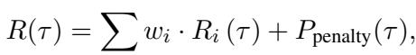
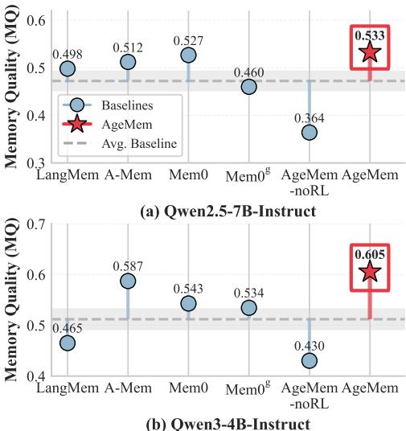

[← 返回 README](../README.md)

# 3 Method

## 📌 预览
AgeMem 的完整方法：问题形式化（统一 RL） → 6 个 Memory Tool → 三阶段渐进 RL → Step-wise GRPO → 多维奖励。这是全文最核心的 Section。

---

We propose Agentic Memory (AgeMem), a unified memory framework that enables LLM agents to autonomously manage both LTM and STM in an end-to-end manner. As illustrated in Figure 1 (right), AgeMem integrates memory management capabilities directly into the agent via a set of specialized tools, enabling the model to learn optimal strategies for unified memory management through three-stage progressive strategy.

> 💡 **Method 总览**：AgeMem = 统一 tool interface + 三阶段 RL + step-wise GRPO + 复合奖励

---

## 3.1 Problem Formulation

**Unified RL formulation for AgeMem.** At each time step $t$, the agent observes a state $s_t \in S$ composed of the conversation context (short-term memory) $C_t$, the long-term memory store $\mathcal{M}_t$, and the task specification $\tau$: $s_t = (C_t, \mathcal{M}_t, \mathcal{T})$. The specification $\tau$ includes the input query $q$, contextual information $I_q$, and (for training only) the expected answer $A_q$. This formulation enables the agent to ground its decision-making in both transient context and persistent knowledge.

Given $s_t$, the agent selects an action $a_t \in \mathcal{A}$ from a hybrid action space that includes language generation as well as memory operations. The decision is governed by a parameterized policy $\pi_\theta$, defined as $\pi_\theta(a_t | s_t) = P(a_t | s_t; \theta)$, where $\theta$ denotes the LLM parameters and $a_t = \pi_\theta(\cdot | s_t)$. For a trajectory $\tau = (s_1, a_1, \dots, s_T, a_T)$, the cumulative reward is defined as:

$$R(\tau) = \sum w_i R_i(\tau) + P_{penalty}(\tau),$$

where $R_i$ captures task performance and memory quality, and $P_{penalty}$ discourages redundant storage, excessive tool usage, and uncontrolled context expansion. The optimization objective is:

$$\theta^* = \arg\max_\theta \mathbb{E}_{\tau \sim \pi_\theta}[R(\tau)].$$

> 💡 **问题形式化批读**:
> - **State** = (当前 context $C_t$, LTM store $\mathcal{M}_t$, 任务规范 $\mathcal{T}$)
> - **Action** = 混合空间：语言生成 ∪ memory 操作 → 这是统一的关键
> - **Policy** = LLM 本身的参数 $\theta$ → 不需要额外的 memory controller
> - **Reward** = 多维加权 + penalty → 同时优化任务完成和 memory 质量
> - 对比 MemSkill：MemSkill 有独立的 Controller 策略，AgeMem 把 memory 决策直接融入 agent policy

---

**Three-stage trajectory structure.** To capture long-horizon interactions and progressively train memory capabilities, each trajectory is divided into three consecutive stages: $\tau = (\tau^{(1)}, \tau^{(2)}, \tau^{(3)})$, with a total length of $T = T_1 + T_2 + T_3$. In Stage 1, the agent engages in casual interactions and may store useful information into LTM. Stage 2 introduces distracting or irrelevant content, requiring the agent to manage its STM through selective retention and compression. Stage 3 presents a task that depends on coordinated use of both retained context and earlier accumulated LTM. A key aspect of this design is that the long-term memory $\mathcal{M}_t$ persists across all stages, allowing early knowledge to influence later decisions. In contrast, the context $C_t$ is reset between Stages 1 and 2 to prevent information leakage across phases. The reset before Stage 2 ensures the agent cannot solve the final task via residual context, thereby forcing proper retrieval from LTM and enabling effective training of memory operations.

> 💡 **三阶段轨迹设计**:
> - **Stage 1**：casual interaction → 学习从对话中抽取有用信息存入 LTM
> - **Stage 2**：注入 distractor → 学习过滤噪声、压缩 context（STM 管理）
> - **Stage 3**：正式 query → 联合 LTM 检索 + STM 管理 + 推理
> - **关键设计**：LTM $\mathcal{M}_t$ 跨 stage 持久化，但 context $C_t$ 在 Stage 1→2 重置
> - **为什么重置 context**？防止 agent "偷懒"用残留 context 直接回答，强制它学会 LTM 检索
> - 对比 Mem-T：Mem-T 也有 session 训练，但没有这种 context reset 设计

---

At each step, we collect an experience tuple $e_t = (s_t, a_t, r_t, \log \pi_{\theta_{old}}(a_t | s_t))$, where $r_t$ is typically zero for intermediate steps and assigned after trajectory completion, and $\log \pi_{\theta_{old}}(a_t | s_t)$ denotes the log probability under the old policy $\pi_{\theta_{old}}$. This representation enables step-wise credit assignment under GRPO (Shao et al., 2024) and allows the agent to attribute long-term rewards to specific memory decisions across stages. By structuring trajectories in this staged yet continuous manner, the agent learns temporally coherent and task-adaptive memory policies essential for robust long-horizon reasoning.

> 💡 **Experience tuple**：中间 step 奖励为 0，只在轨迹结束时赋值 → 典型的稀疏奖励问题，需要 step-wise GRPO 解决

---

## 3.2 Memory Management via Tool Interface

AgeMem exposes memory-related operations to the LLM agent through an explicit tool interface (Table 1). The agent can modify its persistent LTM using ADD, UPDATE, and DELETE, while exercising fine-grained control over STM through RETRIEVE, SUMMARY, and FILTER. Incorporating these tools into the action space transforms memory control from an external heuristic pipeline into an intrinsic component of decision-making. This design allows the agent to adaptively manage memory according to task structure, history, and context. Implementation details are provided in the Appendix A.1.

*Table 1: Memory management tools in AgeMem for manipulating long-term memory (LTM) and short-term memory (STM).*

> 💡 **6 个 Memory Tool 批读**:
>
> | Tool | Target | 功能 | 类比 |
> |------|--------|------|------|
> | ADD | LTM | 存新知识到 $\mathcal{M}_t$ | 类似 MemSkill 的 store |
> | UPDATE | LTM | 修改已有条目 | MemSkill 的 update |
> | DELETE | LTM | 删除过时条目 | MemSkill 的 delete |
> | RETRIEVE | STM | 从 $\mathcal{M}_t$ 检索到 $C_t$ | RAG 的 retrieve |
> | SUMMARY | STM | 压缩 $C_t$ 中的消息 | ReSum 的 summarize |
> | FILTER | STM | 过滤 $C_t$ 中不相关消息 | 新操作，基于语义相似度 |
>
> - **LTM 三件套**（ADD/UPDATE/DELETE）管理持久存储
> - **STM 三件套**（RETRIEVE/SUMMARY/FILTER）管理当前 context
> - 对比 MemSkill：MemSkill 把这些操作包装成 learnable skill（更抽象），AgeMem 直接暴露为 tool（更简洁）

---

## 3.3 Three-Stage Progressive RL Strategy

To learn unified and stable memory behaviors, we propose a progressive three-stage training strategy. For each task instance $q \in \mathcal{T}$, the agent generates a complete trajectory:

$$\tau_k^{(q)} = (\tau_k^{(1)}, \tau_k^{(2)}, \tau_k^{(3)}), \quad k = 1, \dots, K,$$

where $K$ denotes the number of independent rollouts, and each sub-trajectory $\tau_k^{(i)}$ corresponds to a specific training stage.

---

**Stage 1 (LTM construction).** The agent is exposed to contextual information $I_q$ in a casual conversational setting. The goal is to identify salient information and store it into LTM $\mathcal{M}_t$. During the interaction, the short-term context $C_t$ evolves naturally, and the agent may invoke LTM-related tools when appropriate. Formally, this stage yields a sub-trajectory $\tau_k^{(1)} = \{e_t\}_{t=1}^{T_1}$, where each experience tuple $e_t$ follows the definition in Section 3.1.

> 💡 **Stage 1**：在 casual 对话中学习识别有用信息并 ADD 到 LTM → 类似人类"边聊天边记笔记"

---

**Stage 2 (STM control under distractors).** The short-term context is reset, while the constructed LTM $\mathcal{M}_t$ is retained. The agent is then presented with semantically related but irrelevant or misleading distractors. The objective is to learn proactive STM control through tool-based operations, such as filtering or summarizing context, in order to suppress noise and preserve useful information. This process forms the sub-trajectory $\tau_k^{(2)} = \{e_t\}_{t=T_1+1}^{T_1+T_2}$, which emphasizes context filtering and compression capability.

> 💡 **Stage 2**：注入 distractor → agent 学习用 FILTER/SUMMARY 主动管理 context → 类似"在噪音中保持专注"
> - Context 重置但 LTM 保留 → 强制 agent 依赖 LTM 而非 context 残留
> - Distractor 是"语义相关但任务无关"的信息 → 比随机噪声更难过滤

---

**Stage 3 (Integrated reasoning and memory coordination).** Finally, the agent receives a formal query $q$ requiring both accurate reasoning and effective memory retrieval. The agent must retrieve relevant knowledge from $\mathcal{M}_t$, appropriately manage the context $C_t$, and generate a final answer. This stage produces $\tau_k^{(3)} = \{e_t\}_{t=T_1+T_2+1}^{T}$, which evaluates the ability of agent to coordinate long-term memory, short-term context management, and task solution in an end-to-end manner.

> 💡 **Stage 3**：正式答题 → 需要 RETRIEVE + context 管理 + 推理 → 三种能力的联合考核

---

All three segments form a complete trajectory:

$$\tau_k^{(q)} = (e_1, e_2, \ldots, e_T), \quad T = T_1 + T_2 + T_3,$$

which is then used for policy optimization in the subsequent step-wise GRPO procedure. For a batch of $B$ tasks, we further aggregate all experiences from $K$ independent rollouts into a unified set $\mathcal{E} = \cup_{q=1}^{B} \cup_{k=1}^{K} \{e_t | e_t \in \tau_k^{(q)}\}$, with a total size of $|\mathcal{E}| = B \times K \times \bar{T}$, where $\bar{T}$ denotes the average trajectory length.

> 💡 **训练规模**：$B$ 个 task × $K$ 个 rollout × $\bar{T}$ 步 → 实验中 $K=8$，计算量不小

---

## 3.4 Step-wise GRPO for Unified Management

We adopt a step-wise variant of GRPO to connect long-range task rewards with memory decisions across all stages. For task $q$, let $G_q = \{\tau_1^{(q)}, \dots, \tau_K^{(q)}\}$ denote the group of parallel rollouts. Each trajectory yields a terminal reward $r_T^{(k,q)} = R(\tau_k^{(q)})$. We compute the group-normalized advantage for the terminal step as:

$$A_T^{(k,q)} = \frac{r_T^{(k,q)} - \mu_{G_q}}{\sigma_{G_q} + \epsilon},$$

where $\mu_{G_q}$ and $\sigma_{G_q}$ are the mean and standard deviation of rewards within $G_q$, $\epsilon$ prevents division by zero. This advantage is then broadcast to all preceding steps of the same trajectory $A_t^{(k,q)} = A_T^{(k,q)}$, which assigns a consistent learning signal to all memory and reasoning actions along the trajectory, including those in Stage 1 and Stage 2. In doing so, the final task outcome supervises every intermediate memory decision, enabling long-range credit assignment across heterogeneous stages.

> 💡 **Step-wise GRPO 批读**:
> - **核心思想**：终端奖励 → 组内归一化 → 广播到所有 step
> - **组归一化**：同一个 task 的 $K$ 个 rollout 互相比较，消除 task 难度差异
> - **广播**：$A_t^{(k,q)} = A_T^{(k,q)}$ → 所有 step 都获得相同的 advantage
> - **意义**：Stage 1 的 ADD 操作、Stage 2 的 FILTER 操作，都能通过 Stage 3 的最终结果获得反馈
> - **简洁但有效**：不需要 step-level reward shaping，直接用终端结果广播
> - 对比 Mem-T：Mem-T 用密集化奖励（step-level）解决稀疏问题，AgeMem 用广播（更简洁但可能信号更弱）

---

Following GRPO, we maximize the expected objective over all experiences:

$$\mathcal{J}(\theta) = \mathbb{E}_{(e_t, A_t) \sim \mathcal{E}} \left[\rho_t A_t - \beta D_{KL}[\pi_\theta \| \pi_{ref}]\right]$$

$$= \frac{1}{|\mathcal{E}|} \sum_{q=1}^{B} \sum_{k=1}^{K} \sum_{t=1}^{T_k^{(q)}} \left[\rho_t^{(k,q)} A_t^{(k,q)} - \beta D_{KL}^{(k,q)}\right],$$

where the importance ratio $\rho_t^{(k,q)} = \frac{\pi_\theta(a_t|s_t)}{\pi_{\theta_{old}}(a_t|s_t)}$ controls the update magnitude under the new policy, $D_{KL}^{(k,q)}$ denotes the KL divergence penalty between the current policy $\pi_\theta$ and a fixed reference $\pi_{ref}$, and $\beta$ is a coefficient that balances exploration and training stability.

> 💡 **GRPO 目标函数**：标准 PPO 风格，importance ratio × advantage - KL penalty。$\beta = 0.1$。

---

## 3.5 Reward Function Design

We design a composite reward that evaluates both downstream task performance and the quality of memory management. The total trajectory-level reward is defined as

$$R(\tau) = \mathbf{w}^\top \mathbf{R} + P_{penalty},$$

where $\mathbf{w} = [w_{task}, w_{context}, w_{memory}]^\top$ are tunable coefficients, and $\mathbf{R} = [R_{task}, R_{context}, R_{memory}]^\top$ correspond to rewards for task completion, context management, and long-term memory management. The penalty term $P_{penalty}$ captures violations such as context overflow or exceeding the interaction limit.

> 💡 **奖励函数设计**：三维加权 + penalty，所有权重统一设为 1/3（不需要调参！）

---

**Task completion reward $R_{task}$.** This term provides the primary learning signal by assessing whether the agent solves the task correctly. We obtain a scalar score using an LLM-based judge $S_{judge}(A_{pred}, A_q) \in [0, 1]$, optionally applying a penalty when no answer is produced. This reward encourages accurate, complete task solutions and remains the dominant component to ensure alignment with task objectives.

**Context management reward $R_{context}$.** This component evaluates STM behavior, focusing on how effectively the agent controls the active context $C_t$. It combines three factors: (i) compression efficiency, promoting economical token usage; (ii) preventive actions, rewarding early summarization or filtering to avoid overflow; and (iii) information preservation, penalizing the loss of critical query-related content. Each factor is normalized, allowing the reward to balance context efficiency against retention of essential information.

**Memory management reward $R_{memory}$.** This term evaluates LTM operations. It aggregates signals for: (i) storage quality, measured as the fraction of stored entries labeled as high-quality and reusable; (ii) maintenance, rewarding meaningful update or delete operations to mitigate memory staleness; and (iii) semantic relevance, computed using an LLM-based score between retrieved memories and the query. Together, these signals incentivize selective, high-value memory construction and responsible upkeep over time.

**Penalty terms $P_{penalty}$.** Penalties discourage undesirable behaviors such as exceeding the maximum number of dialogue turns or triggering context overflow. Penalty coefficients are chosen so that such violations lead to a substantial reduction in the final trajectory reward, encouraging the agent to maintain safe and efficient memory practices.

> 💡 **奖励函数三维度批读**:
>
> | 维度 | 子项 | 含义 |
> |------|------|------|
> | $R_{task}$ | LLM judge score | 答对了吗？ |
> | $R_{context}$ | compression | token 用得省吗？ |
> | | preventive | 在溢出前就开始压缩了吗？ |
> | | preservation | 关键信息保留了吗？ |
> | $R_{memory}$ | storage quality | 存的 memory 质量高吗？ |
> | | maintenance | 有主动更新/删除过时条目吗？ |
> | | relevance | 检索的 memory 与 query 语义相关吗？ |
> | $P_{penalty}$ | rounds / overflow | 超轮次 -1.0，context 溢出 -0.5 |
>
> - 多维奖励鼓励 agent 在多个方面同时表现好
> - 消融实验证明 All-Returns（全部奖励）比 Answer-Only（只有 $R_{task}$）更优

*Figure 2: Memory Quality scores for different methods on HotpotQA. Higher scores indicate better relevance between stored memories and ground-truth facts.*

> 💡 **Figure 2 批读**:
> - AgeMem 在两个 backbone 上都达到最高 MQ（0.533 / 0.605）
> - 说明统一训练不仅提升了任务性能，也提升了 memory 质量
> - Mem0 和 A-Mem 的 MQ 明显低于 AgeMem，说明 heuristic 方法存储的 memory 质量不够

---

## 🔖 Section 总结

### 关键数字速查
| 参数 | 值 |
|------|-----|
| Memory tools | 6 (3 LTM + 3 STM) |
| Rollouts per task ($K$) | 8 |
| KL coefficient ($\beta$) | 0.1 |
| Reward weights | 均匀 1/3 |
| $P_{rounds}$ | -1.0 |
| $P_{overflow}$ | -0.5 |
| FILTER threshold ($\theta$) | 0.6 |

### 核心洞察
1. **统一 RL formulation** 把 memory 管理从外挂模块变成 agent policy 的一部分 → 端到端优化
2. **三阶段设计** 是课程学习思路：先学简单的（存），再学中等的（过滤），最后学难的（联合）
3. **Context reset** 是精妙设计：防止 agent 走捷径，强制学习 LTM 操作
4. **Step-wise GRPO** 用广播终端奖励解决稀疏信号，简洁有效
5. **多维奖励** 平衡了任务性能、context 效率、memory 质量三个方面
