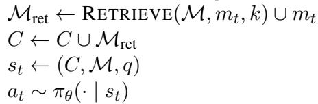
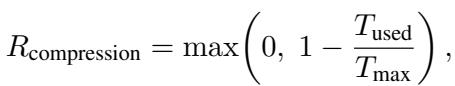
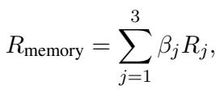

[← 返回 README](../README.md)

# 4 Experiments

## 📌 预览
5 个 benchmark × 2 个 backbone，AgeMem 全面领先。消融证明 LTM/STM/RL 各组件都有贡献，All-Returns 奖励优于 Answer-Only。

---

## 4.1 Experimental Setup

**Datasets.** To comprehensively evaluate AgeMem, we select five widely-used datasets in LLM-based agent research: ALFWorld (Shridhar et al., 2020), SciWorld (Wang et al., 2022), PDDL (Chang et al., 2024), BabyAI (Chevalier-Boisvert et al., 2018), and HotpotQA (Yang et al., 2018). These datasets cover embodied action, game-based reasoning, and knowledge-intensive question answering, providing diverse evaluation scenarios. Since the HotpotQA dataset contains both questions and supporting facts, automatically providing Stage 1 contextual information, AgeMem is fine-tuned with RL only on the HotpotQA training set and then evaluated directly on all datasets. Detailed dataset statistics are provided in Appendix C.1.

> 💡 **数据集选择批读**:
> - 5 个 benchmark 覆盖三大类型：embodied (ALFWorld)、game (SciWorld/PDDL/BabyAI)、QA (HotpotQA)
> - **关键发现：只在 HotpotQA 上训练，零样本迁移到其余 4 个 benchmark** → 说明学到的 memory 管理能力具有泛化性
> - 为什么选 HotpotQA 训练？因为它有 supporting facts 标注，天然提供 Stage 1 的 contextual information

---

**Evaluation metrics.** For the primary task completion metrics, we adopt Success Rate (SR) for ALFWorld, SciWorld, and BabyAI, Progress Rate (PR) for PDDL, and LLM-as-a-Judge (J) for HotpotQA. Additionally, we employ an LLM-based evaluator to assess the quality of stored long-term memory during knowledge reasoning, measured by Memory Quality (MQ). The prompts of the LLM-based evaluation are provided in Appendix C.2.

**Baselines & LLM backbones.** We compare AgeMem against four representative agent LTM systems: LangMem (LangChain Team, 2025), A-Mem (Xu et al., 2025), Mem0 (Chhikara et al., 2025), and Mem0^g (a graph-based variant officially provided as part of Mem0). To better demonstrate the effectiveness of RL training, we also include AgeMem-noRL, which is not fine-tuned with RL. In ablation studies on STM, we compare STM tools with RAG approach. For the base agent models, we use Qwen2.5-7B-Instruct and Qwen3-4B-Instruct. More baseline configurations are in Appendix C.3.

> 💡 **Baseline 设置**:
> - 4 个 LTM 系统：LangMem、A-Mem、Mem0、Mem0^g
> - 1 个消融版本：AgeMem-noRL（不做 RL 训练）
> - 2 个 backbone：Qwen2.5-7B / Qwen3-4B（参数量差异大，验证泛化性）
> - 注意：没有对比 MemSkill 和 Mem-T（可能是同期工作）

---

**Implementation details.** We build agents using the Agentscope framework (Gao et al., 2025a) and finetune AgeMem using the Trinity framework (Pan et al., 2025a). For all reward weights in the reward function, we use uniform coefficients of 1.0 without manual tuning. Further implementation details are provided in Appendix C.4.

---

## 4.2 Main Results

**Comparison with counterparts.** Table 2 shows that AgeMem achieves the highest average performance on both Qwen2.5-7B-Instruct (41.96%) and Qwen3-4B-Instruct (54.31%), outperforming all baselines across five datasets with relative gains of 49.59% and 23.52% over no-memory, respectively. Compared to the best baselines (Mem0 and A-Mem), AgeMem improves by 4.82 and 8.57 percentage points on average. RL training contributes 8.53 percentage points and 8.72 percentage points improvements over AgeMem-noRL, validating the three-stage progressive RL strategy.

*Table 2: Performance comparison across five benchmarks. The best and second-best results are marked.*

> 💡 **Table 2 批读**:
> - **Qwen2.5-7B**：AgeMem 41.96%，No-Memory 28.05% → **+49.59% 相对提升**
> - **Qwen3-4B**：AgeMem 54.31%，No-Memory 43.97% → **+23.52% 相对提升**
> - **vs 最佳 baseline**：+4.82pp (7B) / +8.57pp (4B)
> - **RL 的贡献**：AgeMem vs AgeMem-noRL = +8.53pp / +8.72pp → RL 训练很关键
> - **各 benchmark 分析**：
>   - ALFWorld：AgeMem 41.07→48.97（embodied 任务也受益于 memory）
>   - SciWorld：35.55→59.48（科学实验需要长期知识积累）
>   - BabyAI：61.42→72.56（指令跟随需要 context 管理）
>   - HotpotQA：54.44→55.49（训练集，提升相对较小）
> - **有趣发现**：Qwen3-4B 总体性能 > Qwen2.5-7B → 更新的模型架构更重要

---

**Quality of stored long-term memories.** To evaluate the quality of stored memories, we leverage the ground-truth facts provided in the HotpotQA dataset and assess the relevance between stored memories and these facts using an LLM-based evaluator. Figure 2 presents the Memory Quality (MQ) scores for different baselines. AgeMem achieves the highest memory quality on both model backbones, with MQ scores of 0.533 and 0.605, respectively. This indicates that the unified memory management framework not only improves task performance but also promotes the storage of high-quality, reusable knowledge. The comparison with baseline methods further validates that AgeMem's tool-based memory operations lead to more selective and higher-quality memory construction.

> 💡 **Memory Quality 分析**：AgeMem 的 MQ 显著高于 baseline → 说明 RL 训练让 agent 学会了"存什么"而不是"全存"

---

**Effectiveness of STM management.** We evaluate the effectiveness of STM management by measuring the prompt token count under different configurations on HotpotQA. Figure 3 shows that AgeMem successfully reduces prompt token usage compared to variants without STM tools (-RAG). On Qwen2.5-7B-Instruct, AgeMem uses 2,117 tokens on average, compared to 2,186 tokens for AgeMem-RAG, representing a reduction of 3.1%. On Qwen3-4B-Instruct, the reduction is even more pronounced: AgeMem uses 2,191 tokens versus 2,310 tokens for AgeMem-RAG, a reduction of 5.1%. These results demonstrate that the learned STM management tools effectively control context expansion, enabling more efficient token usage while maintaining task performance.

*Figure 3: Average prompt token counts under different STM management configurations on HotpotQA. The suffix "-RAG" indicates the adoption of RAG in place of STM tool-based management.*

> 💡 **Figure 3 批读**:
> - STM tools vs RAG：token 节省 3.1% (7B) / 5.1% (4B)
> - 节省幅度看起来不大，但在 long-horizon 任务中 token 节省累积效果显著
> - 关键是 STM tools 在节省 token 的同时还提升了性能 → 不是简单的"少用 token"

---

**Tool usage analysis.** Table 3 reports tool usage statistics before and after RL fine-tuning on HotpotQA. RL training substantially increases the use of long-term memory tools, especially ADD and UPDATE. On Qwen2.5-7B-Instruct, ADD operations rise from 0.92 to 1.64, and UPDATE operations appear after training (0.13 v.s. nearly zero). Similar trends are observed on Qwen3-4B-Instruct, with higher frequencies of both ADD and UPDATE. For short-term memory tools, RL leads to more balanced tool usage. The frequency of FILTER increases notably (e.g., from 0.02 to 0.31 on Qwen2.5), indicating proactive context control, while RETRIEVE remains relatively stable. Overall, these patterns suggest that RL training enables coordinated and adaptive memory management.

*Table 3: Tool usage statistics on HotpotQA. Numbers show average calls per episode.*

> 💡 **Table 3 批读**:
> - **RL 训练后的变化**：
>   - ADD：0.92 → 1.64 (7B)，2.49 → 2.64 (4B) → 学会了更积极地存储
>   - UPDATE：0.00 → 0.13 → 从"不会用"到"开始用"
>   - DELETE：0.00 → 0.08 → 开始学会清理过时 memory
>   - FILTER：0.02 → 0.31 → **最显著的变化**，学会了主动过滤噪声
>   - SUMMARY：变化不大，说明 agent 更偏好 FILTER 而非 SUMMARY
> - **总 tool calls**：4.33 → 4.92 (7B)，7.50 → 8.67 (4B) → 更积极地使用工具

---

## 4.3 Ablation Studies

**LTM-STM components.** To validate the contributions of individual components, we conduct ablation studies on LTM, STM, and RL training. Figure 4 presents results on three representative datasets using Qwen2.5-7B-Instruct as the backbone (results for Qwen3-4B-Instruct are provided in Appendix D.1). Adding LTM alone (+LT) yields substantial gains of +10.6%, +14.2%, and +7.4% over the baseline. Incorporating RL training (+LT/RL) further improves performance, particularly on HotpotQA (+6.3%), demonstrating the effectiveness of our reward-based optimization. The full AgeMem system (+LT/ST/RL) achieves the best results across all benchmarks, with overall improvements of +13.9%, +21.7%, and +16.1%. Notably, adding STM tools provides the most significant boost on SciWorld (+3.1%) and HotpotQA (+2.4%), validating that learned context management outperforms static RAG approaches. These progressive improvements confirm that unified memory management with end-to-end RL is essential for optimal agent performance.

*Figure 4: Ablation study on LTM, STM, and RL components (Qwen2.5-7B-Instruct). Base: No-memory baseline; +LT: AgeMem-noRL-RAG (LTM tools only); +LT/RL: AgeMem-RAG (RL with LTM tools); +LT/ST/RL: AgeMem (full AgeMem system with RL). Green arrows indicate performance gains over the baseline.*

> 💡 **Figure 4 消融批读**:
> - **渐进贡献**：Base → +LT（大幅提升）→ +LT/RL（RL 加持）→ +LT/ST/RL（最佳）
> - **LTM 贡献最大**：+10.6~14.2% → 说明 persistent memory 对 long-horizon 任务至关重要
> - **RL 贡献次之**：在 LTM 基础上再加 6.3% → RL 训练的 memory 策略优于 heuristic
> - **STM 贡献最小但稳定**：+2.4~3.1% → context 管理是锦上添花但不可忽视

---

**Reward function.** To demonstrate the effectiveness of our multi-component reward function design, we compare the full reward function (All-Returns) against a variant using only $R_{task}$ (Answer-Only). Figure 5 shows the reward convergence curves of Qwen2.5-7B-Instruct during GRPO training on HotpotQA. The full reward function leads to significantly faster convergence and higher final performance compared to the task-only variant. As detailed in Table 4, the All-Returns strategy achieves higher LLM-as-a-Judge scores (0.544 v.s. 0.509) while maintaining substantially better memory quality (0.533 v.s. 0.479). Notably, despite using more tokens (2117 v.s. 2078), the All-Returns strategy achieves better overall performance, indicating that the additional context and memory operations contribute meaningfully to reasoning quality.

*Figure 5: Training convergence curves on Qwen2.5-7B-Instruct comparing All-Returns (solid line) v.s. Answer-Only (dashed line) reward strategies.*

*Table 4: Reward function ablation on HotpotQA using Qwen2.5-7B-Instruct. All-Returns v.s. Answer-Only reward strategies. "TN" is the token number, and "TC" denotes the number of tool calls.*

> 💡 **奖励函数消融批读**:
> - All-Returns vs Answer-Only：J 0.544 vs 0.509，MQ 0.533 vs 0.479
> - **Memory quality 差距更大（0.054）** → 多维奖励最大的好处是提升 memory 质量
> - All-Returns 用更多 token（2117 vs 2078）和更多 tool calls（4.92 vs 3.93） → 但值得
> - 收敛更快 → 多维信号提供了更丰富的梯度信息

---

## 🔖 Section 总结

### 关键数字速查
| 指标 | Qwen2.5-7B | Qwen3-4B |
|------|------------|----------|
| Average performance | 41.96% | 54.31% |
| vs No-Memory | +49.59% | +23.52% |
| vs Best baseline | +4.82pp | +8.57pp |
| RL contribution | +8.53pp | +8.72pp |
| Memory Quality (MQ) | 0.533 | 0.605 |
| Token savings (vs RAG) | 3.1% | 5.1% |

### 核心洞察
1. **RL 训练是关键**：AgeMem-noRL 甚至不如一些 baseline，但 RL 后全面领先
2. **零样本迁移**：只在 HotpotQA 训练，4 个 OOD benchmark 全部提升 → memory 管理能力是通用的
3. **LTM > RL > STM**：消融显示 LTM 贡献最大，RL 次之，STM 最小
4. **All-Returns 奖励更优**：多维奖励比纯 task reward 更能指导 memory 管理行为
5. **RL 改变了 tool 使用模式**：从"不会用"到"积极用"，尤其是 FILTER 和 UPDATE
