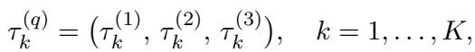
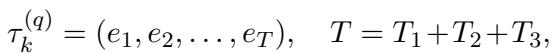

[← 返回 README](../README.md)

# Appendix

## 📌 预览
Appendix 内容丰富：A = Tool 实现细节 + 奖励公式 + 算法伪代码；B = Case Study（3 个对比案例）；C = 数据集/评估/实现细节；D = 补充实验。

---

## A. Detailed Design and Implementation of AgeMem

### A.1 Memory Management Tools

AgeMem exposes a small set of structured tools that the agent may invoke as part of its action $a_t$. Each tool is implemented as a deterministic or stochastic function that transforms the short-term context $C_t$, the long-term memory store $\mathcal{M}_t$, or both.

**RETRIEVE.** The RETRIEVE operation returns the top-$k$ most similar memories to the query $q$:

$$RETRIEVE(q, k) = TopK(\mathcal{M}_t, sim(q, m_i), k)$$

where similarity uses cosine distance between embeddings. Retrieved memories are inserted into $C_t$. Typically $k = 3\text{-}5$.

**ADD.** Creates a new memory entry with content, embedding, and metadata, then updates the store: $\mathcal{M}_{t+1} = \mathcal{M}_t \cup \{m_{new}\}$.

**UPDATE and DELETE.** UPDATE replaces content and metadata of existing entry $m_i$. DELETE removes it: $\mathcal{M}_{t+1} = \mathcal{M}_t \setminus \{m_i\}$.

**SUMMARY.** Compresses a subset of context messages using LLM summarization:

$$C_t' = C_t \setminus \{u_i | i \in s\} \cup \{Summarize(\{u_i\}_{i \in s})\}$$

Supports "all" (summarize all) or "N" (last N messages).

**FILTER.** Removes messages whose similarity to given criteria exceeds threshold $\theta = 0.6$:

$$C_t' = \{u_i \in C_t | sim(c, u_i) < \theta\}$$

> 💡 **Tool 实现要点**:
> - RETRIEVE 用 cosine similarity + TopK，标准做法
> - FILTER 的阈值 $\theta = 0.6$ 是固定的 → 可能需要自适应调整
> - SUMMARY 用 LLM 做摘要 → 有额外推理开销
> - 所有 tool 通过 structured JSON schema 暴露给 agent

---

**Tool invocation as structured actions.** Each tool is exposed via a schema specifying its function name and required arguments. The agent follows a structured format: `<think>` → `<tool_call>` or `<answer>`, ensuring reasoning before action.

*Figure 6: Short-term memory (STM) management tools for conversational context management.*

*Figure 7: Long-term memory (LTM) management tools.*

> 💡 **Figure 6-7 批读**：展示了 STM 和 LTM tool 的完整 JSON schema，包括函数名、参数、类型、描述。这种结构化定义是让 LLM 正确调用 tool 的基础。

---

### A.2 Reward Function Design

详细的奖励公式（见正文 Section 3.5 批读中已覆盖主要内容）:

- **$R_{task}$**: LLM judge score ∈ [0,1]，无答案时 penalty = -1.0
- **$R_{context}$**: compression（$1 - T_{used}/T_{max}$）+ preventive（溢出前使用 tool = 1）+ preservation（关键信息保留 = 1）
- **$R_{memory}$**: storage quality（$N_{high\_quality} / N_{total}$）+ maintenance（有 update/delete = 1）+ relevance（LLM 语义评分）
- **$P_{penalty}$**: rounds 超限 -1.0，overflow -0.5

> 💡 **奖励设计评价**：
> - 子项设计直观，大多是 0/1 indicator 或简单比例 → 实现简单
> - 所有权重均匀 1/3 → 不需要超参搜索，降低了使用门槛
> - LLM judge 用 Qwen-Max → 评估成本不低

---

### A.3 AgeMem Algorithm

*Figure 8: Main training procedure of AgeMem. Left: rollout phase. Right: advantage computation with policy update.*

> 💡 **Algorithm 1-2 批读**:
> - **Rollout phase**：对每个 task 生成 $K$ 个完整三阶段轨迹
> - **Advantage computation**：组内归一化 → 广播到所有 step
> - **Policy update**：标准 GRPO 梯度上升 + KL penalty
> - 整体流程清晰，是标准的 generate-then-optimize 范式

**Stage 1 (Algorithm 3)**：每步先 RETRIEVE 检查现有 LTM → 感知 LTM 状态 → 决定是否 ADD/UPDATE/DELETE。注意：Stage 1 中每步都做 retrieval 不是为了回答问题，而是为了"自省"现有 memory。

**Stage 2 (Algorithm 4)**：Context 重置，注入 distractor → agent 用 FILTER/SUMMARY 管理 → LTM $\mathcal{M}$ 从 Stage 1 保留。

**Stage 3 (Algorithm 5)**：接收 query → RETRIEVE + context 管理 + 生成答案 → 计算复合奖励。

> 💡 **Stage 1 的 retrieval-as-introspection 设计很有意思**：不是为了回答问题而检索，而是为了让 agent 知道"我已经记了什么" → 避免重复存储、促进 UPDATE/DELETE

---

## B. Case Study: AgeMem in Action

三个 case study 展示 RL 训练前后的 memory 管理行为对比：

**Case 1 (LTM 构建与维护)**：
- Before RL：不存 preference，收到更新也不 update
- After RL：主动 ADD preference → UPDATE 新偏好 → DELETE+ADD 清理过时引用
- **关键学到的能力**：selective ADD → UPDATE when changed → DELETE obsolete

**Case 2 (STM 噪声过滤)**：
- Before RL：所有信息（包括 quantum computing、bread baking）都留在 context
- After RL：立刻 FILTER 掉不相关话题 → context 膨胀后 SUMMARY 压缩
- **关键学到的能力**：proactive FILTER → preventive SUMMARY

**Case 3 (联合记忆协调)**：
- Before RL：没有存过 preference → 给出 generic schedule（忽略 120 分钟偏好）
- After RL：RETRIEVE preference → 生成 personalized schedule（120 分钟 deep focus block + visual learning）
- **关键学到的能力**：RETRIEVE → personalize based on stored knowledge

> 💡 **Case Study 总评**：
> - 三个 case 分别对应三个 stage 的能力 → 设计很巧妙
> - Before/After 对比清晰展示了 RL 训练的价值
> - 但这是 cherry-picked example → 实际效果以定量实验为准

---

## C. Experimental Implementation

### C.1 Dataset Details
- **ALFWorld**: 家居 embodied 任务，6 种类型（pick&place, clean, heat, cool 等）
- **SciWorld**: 科学实验模拟，多步骤推理
- **PDDL**: 符号规划 benchmark
- **BabyAI**: 网格世界导航 + 语言指令
- **HotpotQA**: 多跳 QA，~90k 训练问题，有 supporting facts 标注

### C.2 LLM-based Evaluation Details
- **Memory Quality (MQ)**: LLM judge 评估 predicted facts vs ground-truth facts 的匹配度，0-1 分
- **LLM-as-a-Judge**: 评估答案正确性，0-1 分
- 评估模型：Qwen-Max

### C.3 Baseline Configurations
- LangMem: 官方实现，默认参数
- A-Mem: Zettelkasten 设计，官方代码
- Mem0 / Mem0^g: 官方实现 + graph 变体
- RAG variants: 标准 cosine similarity 检索

### C.4 Implementation Details
- Framework: Agentscope (agent) + Trinity (RL)
- $K = 8$ rollouts, $\beta = 0.1$
- Max context: 8,192 tokens, max response: 2,048 tokens
- Hardware: 8× NVIDIA RTX 4090 (48GB each)

> 💡 **实现细节要点**：
> - 8K context window 比较小 → 更需要 STM 管理
> - 4090 ×8 → 总 384GB 显存，训练成本适中
> - 所有权重均匀 1/3，不需要超参搜索 → 复现友好

---

## D. Additional Results

### D.1 Ablation Study (Qwen3-4B)

*Figure 9: Ablation study results for Qwen3-4B-Instruct.*

> 💡 **Figure 9**：Qwen3-4B 上的消融趋势与 Qwen2.5-7B 一致 → 方法泛化性好

### D.2 Reward Function Ablation (Qwen3-4B)

*Figure 10: Training convergence curves on Qwen3-4B-Instruct comparing All-Returns v.s. Answer-Only.*

*Table 5: Reward function ablation results on HotpotQA using Qwen3-4B-Instruct.*

> 💡 **Table 5 批读**：
> - All-Returns: J 0.555, MQ 0.605 vs Answer-Only: J 0.546, MQ 0.415
> - **MQ 差距巨大（0.605 vs 0.415）** → 多维奖励对 memory 质量的提升在 Qwen3-4B 上更显著
> - 收敛更平滑 → Qwen3 架构可能有更好的归纳偏置

---

## 🔖 Appendix 总结

### 核心洞察
1. **Tool schema 设计**：清晰的 JSON schema 是 LLM 正确调用 tool 的基础
2. **Stage 1 的 retrieval-as-introspection**：每步检索不是为了回答问题，而是为了自省 → 精妙设计
3. **Case study** 直观展示了 RL 前后的行为差异 → 从"不会用工具"到"策略性使用工具"
4. **实现友好**：均匀权重、公开框架（Agentscope + Trinity）、适中硬件需求
