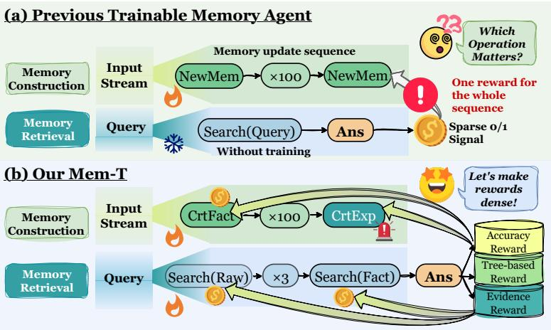

[← 返回 README](../README.md)

# 1. Introduction

As Large Language Models (LLMs) rapidly evolve into powerful AI agents, they have achieved significant success across various fields [Hong et al., 2024, Qian et al., 2025, Wu et al., 2023, Xu and Peng, 2025, Yang et al., 2025]. However, constrained by the finite context windows of foundation models, AI agents face inherent challenges with long-term inconsistency [Li et al., 2024, Liu et al., 2025] and context forgetting during extended multi-turn interactions [Ai et al., 2025, Liu et al., 2025]. As a promising frontier, memory systems dynamically construct and leverage

*Figure 1 | The paradigm comparison between the previous trainable memory agent and Mem-T.*

> 💡 **批注**: Figure 1 是核心对比图。左边 previous paradigm 只有 sparse terminal reward（整条 trajectory 结束才给一个 0/1），右边 Mem-T 通过 MoT 在每个节点都生成 dense reward。这就是论文的核心 insight 可视化。

memories from historical interactions [Fang et al., 2025, Li et al., 2025], thereby sustaining temporal coherence and long-term intelligence beyond finite context windows [Ye et al., 2025b, Zhao et al., 2024], and have consequently emerged as a core component of modern agentic systems [Chhikara et al., 2025, Zhang et al., 2025].

Tracing the evolution of memory systems, early frameworks such as MemGPT [Packer et al., 2023], Mem0 [Chhikara et al., 2025], and A-Mem [Xu et al., 2025] predominantly rely on hand-crafted prompts and heuristic rules to guide frozen LLMs in populating predefined memory structures. As a result, their performance is inherently bounded by the base model's instruction-following capacity and rigid human priors, often leading to suboptimal outcomes [Wu et al., 2025a, Xiong et al., 2025]. By contrast, recent approaches such as Memory-R1 [Yan et al., 2025b], Mem-α [Wang et al., 2025], and MemTool [Lumer et al., 2025] employ reinforcement learning (e.g., GRPO [Shao et al., 2024]) to train LLMs into adaptive policies for dynamic memory curation and retrieval, commonly referred to as memory agents. This shift constitutes a fundamental paradigm change, recasting memory management from static instruction adherence into a problem of adaptive policy optimization [Hu et al., 2026b].

> 💡 **批注**: 论文把 memory 系统的演化分成两阶段：(1) heuristic-based (MemGPT, Mem0, A-Mem) → (2) RL-trained (Memory-R1, Mem-α)。Mem-T 属于第二阶段但解决了其中的 credit assignment 问题。引用 Hu et al., 2026b 是 "Memory in the Age of AI Agents" 综述，作者自己参与的。

However, current paradigms for training memory agents remain fundamentally constrained by temporal credit assignment [Pignatelli et al., 2024], i.e., the challenge of attributing sparse and delayed rewards to causative actions along long-horizon memory operation sequences. This limitation is particularly acute in memory-centric tasks, where agents may execute hundreds of memory operations across $\sim 500$ turns within million-token contexts before receiving a binary 0/1 reward derived from sporadic QA accuracy signals [Tan et al., 2025, Wu et al., 2025a]. Existing approaches fail to bridge this gap, as they indiscriminately propagate the sparse terminal reward across all memory operations without dense supervision or process-level attribution [Wang et al., 2025, Yan et al., 2025b]. Consequently, this extreme sparsity impedes effective optimization of the full memory operation trajectory. To put it more formally:

> 💡 **批注**: ~500 轮、百万 token 上下文、只拿到一个 0/1 奖励——这个 challenge 描述得很具体。做过 RL 的人都知道，reward sparsity + long horizon = 训练几乎不收敛。这是 Mem-T 要解决的核心瓶颈。

**How can we implement a fully trainable memory agent framework that jointly optimizes memory construction and retrieval, supervised with dense rewards and accurate process-level attribution?**

To address this challenge, we introduce Mem-T, a streamlined hierarchical memory agent optimized under a process-supervised, attribution-centric training paradigm termed Memory Operation Tree-guided GRPO (MoT-GRPO). Functionally, Mem-T integrates three core capabilities: (i) formation and (ii) evolution operations that maintain and refine the hierarchical memory database over dynamic information streams, and (iii) a retrieval operation that conducts multi-turn, autonomous search to provide accurate memory clues. To jointly optimize these components, MoT-GRPO employs a dual-track training mechanism integrating memory retrieval and construction. To refine memory retrieval, it constructs multiple Memory operation Trees (MoT) to explore diverse trajectories, leveraging the branching topology to back-propagate sparse outcome rewards to intermediate nodes, thereby generating dense process-level signals and identifying critical search paths. To refine memory construction, the utility of the MoT is explicitly attributed back to source memory items via hindsight credit assignment, supervising the corresponding formation and evolution operations. This paradigm effectively mitigates reward sparsity and attribution ambiguity, rendering memory interactions both interpretable and learnable. Our contributions can be summarized as:

> 💡 **批注**: 方法论框架很清晰：MoT-GRPO 做 retrieval training（树结构 rollout → dense reward backprop），hindsight credit assignment 做 construction training（从 retrieval 效果反推 memory 构建质量）。两条路联合优化，形成闭环。

• **Unified Memory Framework.** We propose Mem-T, a streamlined memory management agent with a hierarchical architecture that integrates factual, experiential, and working memory, and agentically orchestrates the full lifecycle of memory operations.

• **Tree-Guided Optimization.** We present MoT-GRPO, a memory operation tree-based paradigm that tackles temporal credit assignment via node-wise reward backpropagation and hindsight credit assignment. By transforming sparse terminal rewards into dense supervision for intermediate operations, it enables the joint optimization of memory formation, evolution, and retrieval.

• **Experimental Evaluation.** Comprehensive evaluations on four memory benchmarks demonstrate that Mem-T achieves state-of-the-art performance while maintaining a superior Pareto frontier, delivering up to $14.92\%$ F1 gains and reducing inference tokens per query by $\sim 24.45\%$ compared with GAM and A-Mem baselines.

> 💡 **批注**: 三大贡献对应得很工整：架构 (Mem-T)、训练范式 (MoT-GRPO)、实验验证。值得注意的是 Mem-T 只用 Qwen3-4B 就超过了 gpt-4o-mini 驱动的 GAM，这个结果说明训练范式比 base model 能力更重要。
