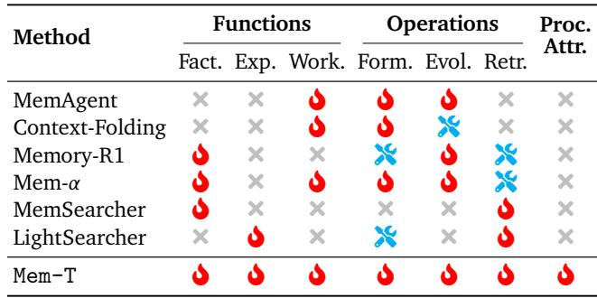

[← 返回 README](../README.md)

# 2. Related Work

**Memory Agent Architectures.** In recent years, memory agents have advanced rapidly, evolving from heuristic-based systems such as MemoryBank [Zhong et al., 2024] and MemGPT [Packer et al., 2023] to more agentic architectures, including Mem0 [Chhikara et al., 2025], MemOS [Li et al., 2025], and A-Mem [Xu et al., 2025]. Functionally, prior work spans three categories: (I) Factual Memory, preserving declarative knowledge for long-term consistency [Zhong et al., 2024]; (II) Experiential Memory, distilling experience from trajectories to support continual self-improvement [Zhao et al., 2024]; and (III) Working Memory, managing dynamic context for ongoing tasks [Wu et al., 2025b]. Operationally, the memory lifecycle comprises (I) Formation, transforming raw context into high-value memory; (II) Evolution, integrating new insights with existing memory

> 💡 **批注**: 三种 Memory 类型（Factual/Experiential/Working）× 三种操作（Formation/Evolution/Retrieval）构成了一个 3×3 的分类框架。Table 1 表明 Mem-T 是唯一覆盖所有 9 个格子且全部 trainable 的系统。

*Table 1 | Comparison of different memory agent systems. ✗: Not included; ✓: Included but heuristic-based; ✓(trainable): Included and trainable. Abbreviations: Fact. = Factual Memory, Exp. = Experiential Memory, Work. = Working Memory, Form. = Memory Formation, Evol. = Memory Evolution, Retr. = Memory Retrieval, Proc. Attr. = Process Attribution.*

> 💡 **批注**: Table 1 是论文的定位图。关键差异化：(1) Mem-T 同时覆盖三种记忆类型和三种操作，竞争对手最多覆盖 4-5 个；(2) 独有 Process Attribution，这是 MoT-GRPO 带来的能力。Memory-R1 和 Mem-α 虽然也是 trained，但缺少 construction training 和过程归因。

store; and (III) Retrieval, performing accurate retrieval from the memory base. As shown in Table 1, our Mem-T, despite its streamlined design, spans all three functional classes and operational stages.

**Reinforcement Learning for Memory Agents.** As memory systems scale in complexity, the efficacy of foundation models in managing memory increasingly becomes the primary performance bottleneck. Consequently, reinforcement learning (RL) has emerged as a central paradigm for endowing LLMs with adaptive memory management capabilities [Hu et al., 2026b]. Current research spans a broad spectrum, from short-term working memory to long-term factual and experiential memory. **Working Memory.** RL has been used to enable agents to autonomously manage execution context within a single task [Chen et al., 2025a, Yu et al., 2025], particularly in settings such as deep research and web browsing [Sun et al., 2025, Ye et al., 2025a, Zhou et al., 2025]. **Long-term Factual Memory.** Prior work targets different stages of memory management: Memory-R1 [Yan et al., 2025b] emphasizes memory evolution, Mem-α [Wang et al., 2025] addresses both formation and evolution, and MemSearcher [Yuan et al., 2025] focuses on training agents to exploit retrieval tools. **Long-term Experiential Memory.** Methods such as LightSearcher [Lan et al., 2025] and MemRL [Zhang et al., 2026] improve the acquisition, refinement, and reuse of skills over time. Despite these advances, RL-based approaches remain limited by sparse rewards and temporal credit assignment in long-horizon settings, hindering effective optimization across the full memory construction and utilization pipeline, as shown in Table 1.

> 💡 **批注**: Related Work 的分类很系统：Working Memory RL（MemAgent, Context-Folding）→ Factual Memory RL（Memory-R1, Mem-α, MemSearcher）→ Experiential Memory RL（LightSearcher, MemRL）。每一类都有代表工作，但没有谁同时解决 construction + retrieval 的联合优化。这给 Mem-T 留了一个很好的 gap。
