[← 返回 README](../README.md)

# 3. Method

## 3.1. Mem-T Workflow

**Hierarchical Memory Definition.** We consider the agent interacting with a continuous information stream $X = \{ x_1, x_2, \ldots, x_T \}$. At each time step $t$, corresponding to the processing of the current chunk $x_t$, the system maintains a hierarchical memory state $\mathcal{M}_t$:

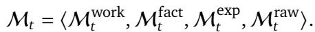

> 💡 **批注**: 四层记忆：Working（会话摘要）、Factual（事实知识）、Experiential（经验策略）、Raw（原始数据）。比 Mem0 只有 factual、A-Mem 只有 factual+raw 要全面。Working memory 做 session 内连贯性，其他三种做长期持久化。

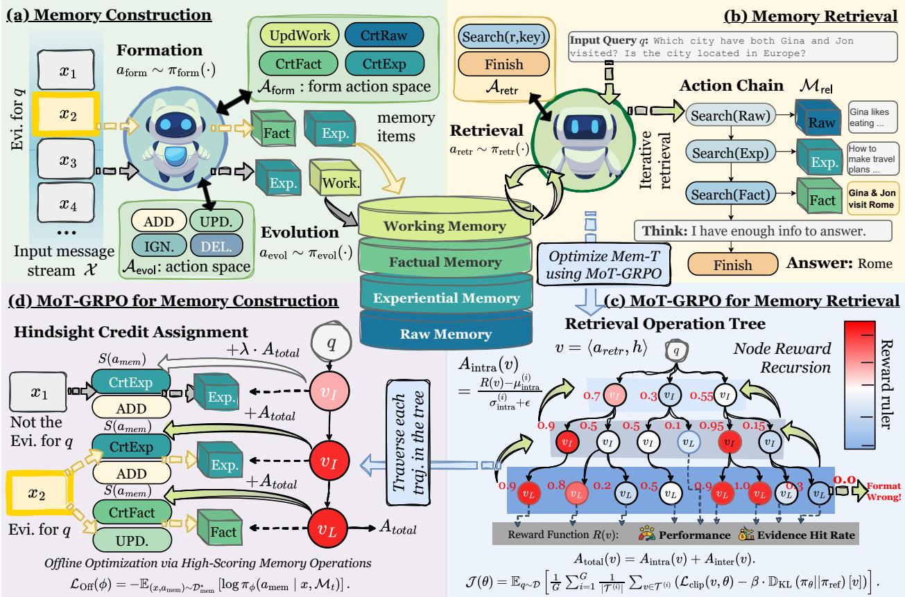
*Figure 2 | The overall framework of our proposed Mem-T.*

> 💡 **批注**: Figure 2 是整体架构图。左侧是 Phase I: Memory Construction（Formation → Evolution），右侧是 Phase II: Memory Retrieval（多轮搜索）。两个 phase 共享同一个 LLM policy，通过 MoT-GRPO 联合训练。注意 Evolution 的四个动作 {ADD, UPDATE, DELETE, IGNORE} 和 Retrieval 的 Search + Finish 构成了完整的 action space。

Within this hierarchy, Working Memory $(M_t^{\mathrm{work}})$ iteratively updates a concise summary at each step, maintaining within-episode coherence. The long-term memory consists of three modules: Factual Memory $(M_t^{\mathrm{fact}})$ stores declarative knowledge, Experiential Memory $(M_t^{\mathrm{exp}})$ captures procedural knowledge, and Raw Memory $(M_t^{\mathrm{raw}})$ archives raw data across sessions. Formally, we have:

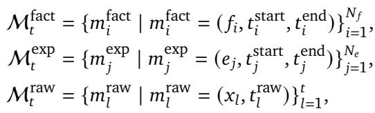

where each $m^{(\cdot)}$ represents an atomic memory unit. Specifically, $f_i$ and $e_j$ represent concrete facts and strategies, respectively, bound by validity time windows $[t^{\mathrm{start}}, t^{\mathrm{end}}]$.

> 💡 **批注**: 每条 memory 都带时间窗口 $[t^{\mathrm{start}}, t^{\mathrm{end}}]$，这对 temporal reasoning 至关重要。很多 memory 系统只存内容不存时间，导致无法回答 "什么时候" 类的问题。Raw Memory 则直接存原始 turn，相当于完整的 audit trail。

**Memory Operation Pipeline.** Building upon this hierarchical memory, we formulate the agent's interaction as a dual-track decision process, comprising continuous memory construction and on-demand memory utilization.

**Phase I: Continuous Memory Construction.** As the agent processes the input stream $x_t$, it proactively constructs new memory candidates via the memory formation policy $\pi_{\mathrm{form}}$. This policy scans the raw input to identify salient information and operates on the formation action space $\mathcal{A}_{\mathrm{form}} = \{\mathrm{CrtFact, CrtExp, CrtRaw, UpdWork}\}$. Here, CrtFact, CrtExp, and CrtRaw extract atomic declarative facts, procedural strategies, and raw data, respectively, while UpdWork updates the session-level working summary. Formally, the formation process is defined as:

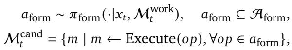

where $M_t^{\mathrm{cand}}$ denotes the set of candidate memories extracted from $x_t$. For each candidate $m \in \mathcal{M}_t^{\mathrm{cand}}$, the memory evolution policy $\pi_{\mathrm{evol}}$ integrates it into $\mathcal{M}_t$. Specifically, the policy considers memories in $\mathcal{M}_t$ that are relevant to $m$, and samples an evolution action $a_{\mathrm{evol}} \sim \pi_{\mathrm{evol}}(\cdot | m, M_t)$ from the action space $\mathcal{A}_{\mathrm{evol}} = \{\mathtt{ADD}, \text{UPDATE, DELETE, IGNORE}\}$. Collectively, these actions define the set of memories to be added ($\Delta^+$) and removed ($\Delta^-$) from the memory store:

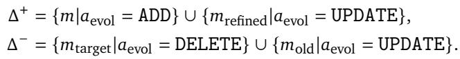

Consequently, the memory store is updated accordingly:

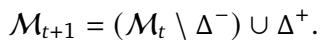

> 💡 **批注**: Formation 和 Evolution 是两个独立的 policy。Formation 决定 "从输入中提取什么"，Evolution 决定 "怎么整合到已有记忆库"。Evolution 的四个动作特别关键：ADD（新信息）、UPDATE（合并更新已有条目）、DELETE（删除过时/错误信息）、IGNORE（冗余跳过）。这比 Mem0 的简单 add/update 更完整。

**Phase II: On-Demand Memory Retrieval.** Based on the constructed memory store $\mathcal{M}_t$, when a query $q$ arises, the agent employs a multi-turn retrieval to respond. During this process, the memory retrieval policy $\pi_{\mathrm{retr}}$ selects actions from the retrieval action space $\mathcal{A}_{\mathrm{retr}}$, which includes queries for each memory module and a terminal signal:

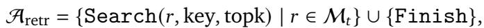

where $r$ is the memory type to be retrieved, key is the retrieval query. Unlike single-step retrieval, $\pi_{\mathrm{retr}}$ operates as a sequential decision policy. At each step $k$, conditioned on the query $q$ and the history context $h_{k-1}$, which consists of the retrieved relevant memory set $\mathcal{M}_{k-1}^{\mathrm{rel}}$ and reasoning state $\mathfrak{z}_{k-1}$, the policy samples an action $a_k$:

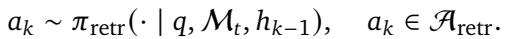

This iterative process accumulates the relevant memory set $\mathcal{M}^{\mathrm{rel}}$ by aggregating the observations from each search step. Finally, the loop terminates when the policy selects the Finish action, signaling that the gathered information is sufficient to support the final answer $y \sim P_\theta(\cdot | q, M^{\mathrm{rel}})$.

> 💡 **批注**: 多轮检索（multi-turn retrieval）是 Mem-T 的亮点之一。Agent 可以先搜 summary 了解背景，再搜 facts 获取细节，再搜 raw turns 验证——就像人类查资料的过程。最多 6 步检索（推理时设定），每步选择搜哪种记忆 + 用什么 query。这比 RAG 的 one-shot retrieval 灵活很多。

---

## 3.2. MoT-GRPO for Memory Retrieval

In long-horizon scenarios, memory operation chains become extremely long, making credit assignment and reward sparsity major challenges. To address these issues, we propose Memory Operation Tree GRPO (MoT-GRPO), inspired by prior RL methods [Ji et al., 2025, Shao et al., 2024].

> 💡 **批注**: MoT-GRPO 是本文最核心的技术贡献。它解决的问题：标准 GRPO 对每条完整 trajectory 给一个 reward，但 memory agent 的 trajectory 太长（数百步），reward 信号太稀疏。MoT 通过树结构 rollout 在中间节点也获得 reward 信号。

**Memory Operation Tree Construction.** In the retrieval phase, to achieve efficient rollout generation while obtaining dense intermediate signals, we employ an Iterative Branching Rollout to construct the Memory Operation Tree (MoT). Formally, we define a node in MoT as a tuple $\nu = \langle a_{retr}, h \rangle$, representing a specific operation $a_{retr} \in \mathcal{A}_{\mathrm{retr}}$ and the reasoning context $h$.

For each query, we initialize an ensemble of $G$ independent MoTs $\{\mathcal{T}_0^{(i)}\}_{i=1}^G$. Each tree $\mathcal{T}_0^{(i)}$ initially contains a single seed trajectory, obtained by a full rollout from the root state $(q, \mathcal{M}_t, h_0 = \emptyset)$:

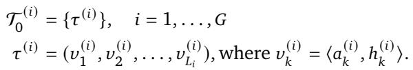

we iteratively densify each $\mathscr{T}^{(i)}$ over $M$ expansion rounds. For each expansion round $j \in \{1, \dots, M\}$, we stochastically sample $N_\nu$ pivot nodes $\{\nu_n^*\}_{n=1}^{N_\nu}$ from each tree $\mathcal{T}_{j-1}^{(i)}$. For each pivot node $\nu^*$ with context $h_{\nu^*}$, we generate a branch trajectory $\tau_{\mathrm{branch}}$:

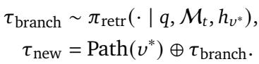

The newly generated trajectories are then grafted onto the tree, updating its state to $\mathcal{T}_j^{(i)}$. After $M$ rounds, this process yields a final ensemble of $G$ MoTs $\{\mathcal{T}_M^{(i)}\}_{i=1}^G$.

> 💡 **批注**: 树构建过程：(1) 先做 G=3 条种子 trajectory；(2) 每轮从已有树中随机选 N_ν=3 个节点做分支扩展。这样一棵树上的不同分支共享前缀（相同的 retrieval 历史），只在分叉点后尝试不同的检索策略。最终通过比较分支的结果来判断每个节点的价值。很像 MCTS 但更轻量——没有 UCB 选择，直接随机采样 pivot。

**Node-wise Reward Backpropagation.** Instead of relying solely on sparse terminal rewards, we assign a dense reward $R(\nu)$ to every node $\nu$, synthesizing immediate retrieval quality with expected future success. Formally, for a node $\nu$ with retrieved memories $\mathcal{M}_\nu^{\mathrm{rel}}$, we define the reward as:

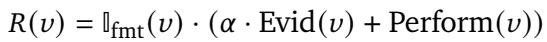

Here, $\mathbb{I}_{\mathrm{fmt}}(\nu)$ serves as a binary validity mask ensuring syntactic correctness of tool invocations; $\operatorname{Evid}(\nu)$ measures the immediate evidence density, calculated as the proportion of ground-truth evidence retrieved in $\mathcal{M}_\nu^{\mathrm{rel}}$; and $\mathrm{Perform}(\nu)$ denotes the expected terminal performance of node $\nu$. For a leaf node, it is defined as the answer quality measured by the F1 score or accuracy. For an internal node, it is computed as the average $\mathrm{Perform}(\cdot)$ over all its child nodes $\mathrm{Ch}(\nu)$:

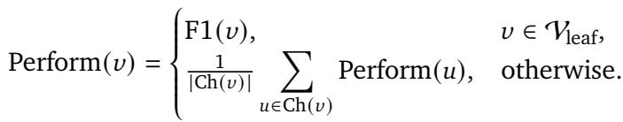

This formulation ensures that high-reward nodes should adhere to valid formats, retrieve relevant evidence, and lead to high-quality outcomes.

> 💡 **批注**: Reward 设计三层递进：(1) $\mathbb{I}_{\mathrm{fmt}}$ 格式正确性（基本门槛）；(2) Evid 即时证据密度（中间节点能直接算）；(3) Perform 终端性能（leaf 直接用 F1，internal 用 children 平均）。Perform 的递归定义本质上是 Monte Carlo value estimation——每个节点的价值等于其子树平均回报。这比单纯 terminal reward 密集得多。

**Dual-Scale Advantage Estimation.** To enable tree-based credit assignment, we perform grouped advantage estimation at both the intra-tree and inter-tree levels. The Intra-Tree Advantage $A_{\mathrm{intra}}(\nu)$ evaluates the relative quality of nodes within the same tree. For a node $\nu$ in tree $\mathscr{T}^{(i)}$, we standardize $R(\nu)$ using the mean $\mu_{\mathrm{intra}}^{(i)}$ and standard deviation $\sigma_{\mathrm{intra}}^{(i)}$ derived from that specific tree:

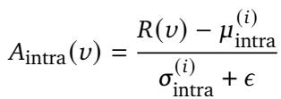

Simultaneously, to capture each node's global advantage, we compute the Inter-Tree Advantage $A_{\mathrm{inter}}(\nu)$ against the global mean $\mu_{\mathrm{global}}$ and standard deviation $\sigma_{\mathrm{global}}$ across the entire ensemble $\{\mathcal{T}^{(i)}\}_{i=1}^G$:

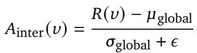

The final advantage $A_{\mathrm{total}}(\nu)$ balances these perspectives:

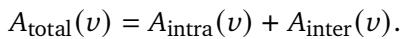

Through this dual-scale design, the intra-tree advantage supports reliable local comparisons sharing similar contexts and effective credit assignment to identify nodes that critically influence the final outcome. Meanwhile, inter-tree advantages encourage cross-tree competition, guiding the optimization toward globally high-quality solutions.

> 💡 **批注**: 双尺度 advantage 设计很巧妙：Intra-tree 比较的是 "在相同前缀下，哪个分支更好"（局部 credit assignment），Inter-tree 比较的是 "跨不同树，哪些节点的整体质量更高"（全局竞争）。消融实验（Table 4）显示去掉 $A_{\mathrm{inter}}$ 比去掉 $A_{\mathrm{intra}}$ 掉点更多（4.56 vs 1.70），说明跨树竞争对训练稳定性更关键。

**Optimization Objective.** Following the GRPO paradigm, we directly utilize the dual-scale advantage $A_{\mathrm{total}}(\nu)$ to optimize the retrieval policy $\pi_\theta$ by maximizing:

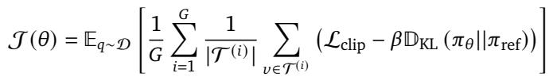

where $\pi_{\mathrm{ref}}$ constrains the update via the KL penalty coefficient $\beta$. The core term $\mathcal{L}_{\mathrm{clip}}$ applies standard PPO clipping to the probability ratio $\rho_{\nu,t}(\theta) = \pi_\theta(a_{\nu,t}|\cdot) / \pi_{\theta_{\mathrm{old}}}(a_{\nu,t}|\cdot)$:

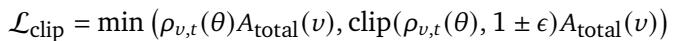

> 💡 **批注**: 最终优化目标就是标准 GRPO/PPO，只不过 advantage 不是对整条 trajectory 算的，而是对树上每个节点独立算的。这让梯度信号从 "每条 trajectory 一个" 变成 "每个节点一个"，密度提升了几个量级。

---

## 3.3. MoT-GRPO for Memory Construction

Unlike retrieval, memory construction spans hundreds of steps with rewards delayed until downstream queries, and its quality is irrelevant to most queries, resulting in severe credit assignment ambiguity. To address this, we propose Hindsight Credit Assignment, which back-propagates advantage signals from downstream retrieval trajectories to upstream construction actions.

> 💡 **批注**: Construction training 比 retrieval training 更难：retrieval 至少有 "答对没有" 这个信号，construction 的好坏要等到未来某个 query 用到这条 memory 时才知道。这就是 "hindsight" 的含义——事后归因。

**Hindsight Credit Assignment.** Let $a_{\mathrm{mem}}$ be a memory operation processing source turns $X_{\mathrm{src}}$ to produce a memory entry $m$. For a query $q$ with ground-truth evidence $X_{\mathrm{evi}}^q$, we define the hindsight score $S(a_{\mathrm{mem}})$ by aggregating advantages $A_{\mathrm{total}}(\nu_L)$ from terminal leaf nodes $\nu_L \in \mathcal{V}_{\mathrm{leaves}}$:

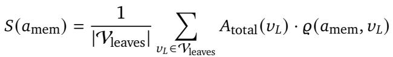

The credit coefficient $\varrho$ integrates two distinct signals:

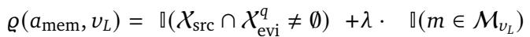

The **Evidence Alignment Gate** attributes credit by linking the construction quality of ideal evidence turn $X_{\mathrm{evi}}^q$ to answer accuracy. It posits that successful reasoning is fundamentally rooted in the effective transformation of ground-truth evidence into memory. Thus, the advantage of a final answer serves as a proxy to evaluate the construction of these pivotal source turns. Conversely, the **Retrieval Trace Gate** (weighted by $\lambda = 0.1$) captures the empirical utility of $m$ retrieved within the actual retrieval tree. It recognizes that any memory entry $m$ involved in the terminal path $\mathcal{M}_{\nu_L}$ objectively modulates the model's decision-making, rewarding the construction process for its functional contribution to the successful trajectory. Notably, in the absence of ground-truth evidence, the mechanism naturally relies on the Retrieval Trace Gate, maintaining robust generalization across diverse datasets.

> 💡 **批注**: Hindsight Credit 的两个门控设计很有意思：(1) Evidence Alignment Gate：如果一个 memory 操作处理的原始 turn 恰好包含某个 query 的 ground-truth evidence，那这个 memory 操作的质量直接影响了答案质量 → 用答案的 advantage 来评价它。(2) Retrieval Trace Gate（权重 λ=0.1 较低）：如果一条 memory 被检索出来并用于生成答案，不管它是不是 ground-truth evidence，都给一点 credit。第一个门需要 evidence annotation，第二个不需要，所以在没有 annotation 的数据集上也能用。

**Policy Refinement.** To optimize memory construction policies, we employ rank-based sampling to curate a high-quality training dataset $\mathcal{D}_{\mathrm{mem}}^*$. We first discard trajectories with invalid tool invocations. Subsequently, we rank all candidate actions by their hindsight score $S(a_{\mathrm{mem}})$ and retain only the top $50\%$ percentile within each operation category. Finally, treating $\mathcal{D}_{\mathrm{mem}}^*$ as a collection of expert demonstrations, we train the policies $\pi_\theta$ (encompassing $\pi_{\mathrm{form}}$ and $\pi_{\mathrm{evol}}$) to maximize the log-likelihood of these selected actions:

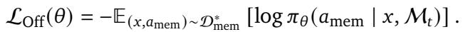

This offline optimization effectively distills the "hindsight wisdom" derived from the downstream MoT-GRPO search trees into the forward-looking memory construction policy.

> 💡 **批注**: Construction training 用的是 offline SFT（取 top 50% 做专家示范），不是 on-policy RL。这是一个务实的选择：construction 的 action space 太大、trajectory 太长，直接 on-policy RL 几乎不可能收敛。用 hindsight score 做 data curation + SFT 是一个很好的 proxy。但这也意味着 construction 的优化不是真正端到端的——是 retrieval 先学好，然后用 retrieval 的信号去 bootstrap construction。
