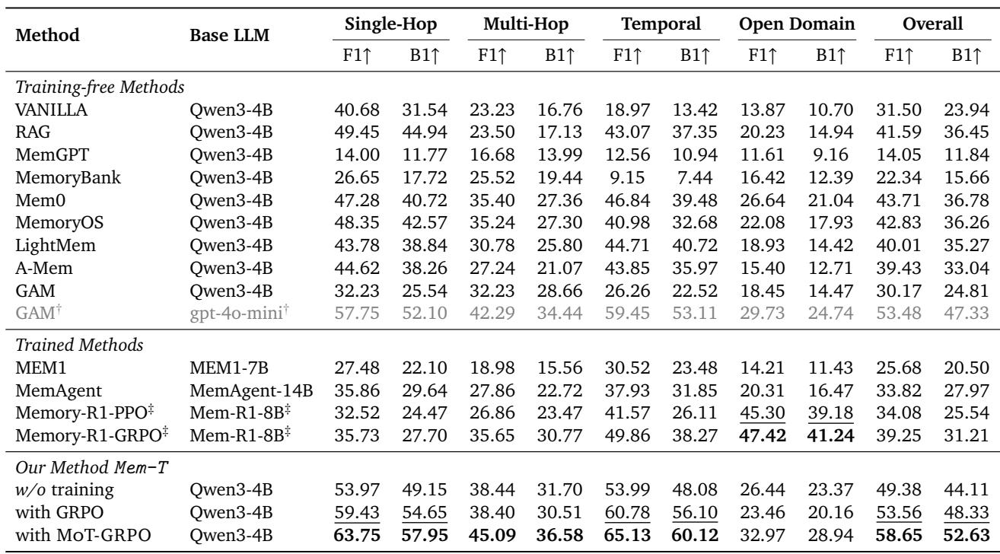
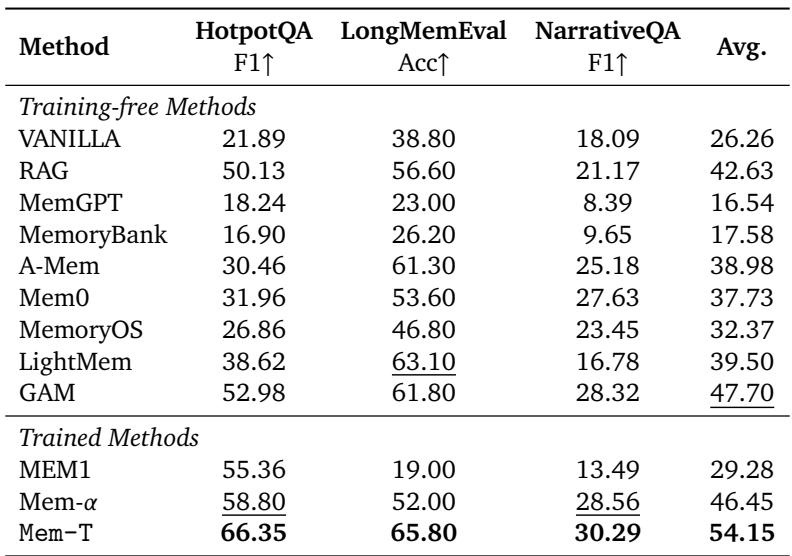
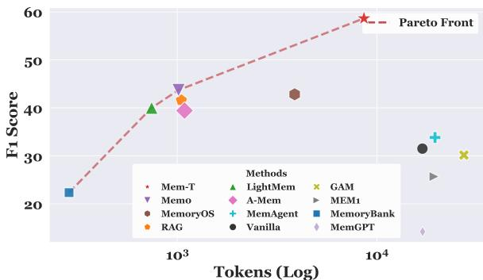
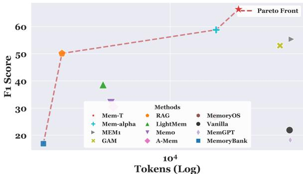
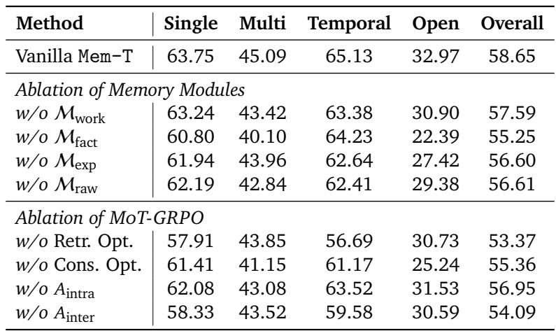
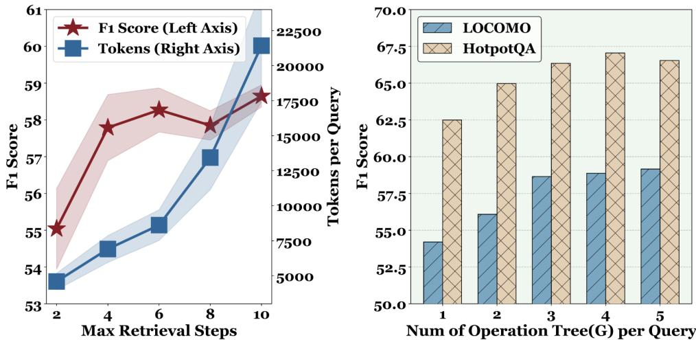

[← 返回 README](../README.md)

# 4. Experiments

## 4.1. Experimental Setup

**Evaluation and Benchmarks.** We evaluate the proposed framework across four challenging long-context benchmarks, including LoCoMo [Maharana et al., 2024], LongMemEval [Wu et al., 2025a], HotpotQA [Yang et al., 2018], and NarrativeQA [Kočiský et al., 2017]. LoCoMo and LongMemEval focus on long-term conversational question answering. Following Memory-R1 [Yan et al., 2025b], we use the same training data configuration by splitting the LoCoMo dataset into a 1:1:8 train/validation/test split to ensure a fair comparison. The remaining three benchmarks are treated as out-of-domain datasets to evaluate the generalization ability of our method. Specifically, for HotpotQA, following [Yan et al., 2025a, Yu et al., 2025], we construct long-context inputs by concatenating the gold supporting documents with 400 irrelevant Wikipedia documents. More details about the dataset are in Section A.1.

> 💡 **批注**: 实验设计的亮点：只在 LoCoMo 上训练（1:1:8 split，训练集很小），然后在 LongMemEval、HotpotQA、NarrativeQA 三个 OOD benchmark 上测试泛化性。这证明了 MoT-GRPO 学到的不是 task-specific 的记忆策略，而是通用的记忆管理能力。

**Baselines.** We compare Mem-T against thirteen baselines, categorized into two groups: (I) Training-free Methods: This group includes memory-free approaches, such as vanilla long-LLM and retrieval-augmented generation (RAG) [Lewis et al., 2020], as well as memory-based methods, including MemGPT [Packer et al., 2023], MemoryBank [Zhong et al., 2024], Mem0 [Chhikara et al., 2025], LightMem [Fang et al., 2025], A-Mem [Xu et al., 2025], and GAM [Yan et al., 2025a]. (II) Training-based Methods: This group includes MemAgent [Yu et al., 2025] and Mem1 [Zhou et al., 2025], which primarily focus on working memory, and Memory-R1 [Yan et al., 2025b] and Mem-α [Wang et al., 2025], which are designed to mainly enhance factual memory. For all the baselines, official implementations and released parameters are used when available.

**Implementation Details.** We select LLM backbones of varying sizes, including Qwen3-4B and Qwen3-8B [Yang et al., 2025]. All methods use BGE-M3 as the embedding model [Chen et al., 2025b].

During training with MoT-GRPO, we generate three trees for each query ($G = 3$), with a maximum tree depth of 4. In each expansion round, we select three nodes ($N_\nu = 3$) for branch expansion. The training for memory retrieval is conducted for 200 steps. And the training for memory construction is based on a dataset containing $10k$ memory operations. At inference time, Mem-T is allowed up to 6 reasoning steps. All retrieval operations default to returning the top-5 most similar items. More training setup and parameter configurations are listed in Section A.2.

> 💡 **批注**: 关键超参：G=3 棵树、树深 4、每轮扩展 3 个节点、训练 200 步、推理最多 6 步检索。训练只需 200 步 + 10k construction 数据，非常高效。使用 Qwen3-4B（很小的模型）就能超过 gpt-4o-mini 驱动的 GAM。

---

## 4.2. Main Results

**High Performance.** As shown in Table 2 and Table 5, Mem-T achieves substantially better performance on the LoCoMo benchmark than both training-free and training-based baselines. When using Qwen3-4B and Qwen3-8B, Mem-T improves F1 by 14.92 ($34.13\% \uparrow$) and 14.55 ($33.08\% \uparrow$), respectively. Even without training, the hierarchical and highly agentic memory system of Mem-T achieves superior performance, improving F1 by 5.67 ($12.97\% \uparrow$) compared to other methods. Moreover, MoT-GRPO further strengthens the LLM's memory management capability compared to the training-free and the GRPO baseline, yielding additional F1 gains of 9.27 ($18.77\% \uparrow$) and 5.09 ($9.50\% \uparrow$). These results demonstrate that the joint retrieval and construction training with dense rewards in MoT-GRPO is better suited for long-horizon memory agents. Notably, GAM, the SOTA memory system, exhibits an F1 gap of 23.31 when switching its backbone from gpt-4o-mini to Qwen3-4B, highlighting the importance of systematically improving model-level memory management capabilities.

> 💡 **批注**: 三个层次的提升清晰可见：(1) Mem-T 架构本身（w/o training）就比最好的 baseline 高 5.67 F1；(2) 加 GRPO 再涨 4.18；(3) 换 MoT-GRPO 再涨 5.09。说明架构设计和训练范式各有贡献。GAM 换 backbone 掉 23.31 分的对比特别有说服力——heuristic 方法严重依赖强底座。

*Table 2 | Performance comparison on the LoCoMo benchmark, with F1 and BLEU-1 as the evaluation metrics.*

**Cross-domain generalization.** To evaluate whether the memory management capabilities learned by MoT-GRPO can transfer across tasks, we assess the performance of Mem-T on three out-of-domain tasks. As shown in Table 3, baselines such as LightMem achieve suboptimal performance on LongMemEval but fail to generalize to other benchmarks, trailing Mem-T by 27.73 and 13.51 on HotpotQA and NarrativeQA, respectively. Training-based MEM-1 performs well on the in-domain QA benchmark HotpotQA, outperforming training-free methods by 2.38, but suffers substantial degradation on benchmarks that emphasize long-horizon dialogue understanding, underperforming Mem-T by 46.8 and 16.8. In contrast, Mem-T learns effec-

*Table 3 | Evaluation results on OOD benchmarks (HotpotQA, LongMemEval, NarrativeQA). All methods, except MEM1, which uses the 7B model trained in the original paper, are implemented with models based on Qwen3-4B.*

tive memory management strategies through training on LoCoMo and achieves SOTA performance across all three out-of-domain benchmarks, with an average improvement of 6.45 ($13.52\% \uparrow$) over other methods. Notably, Mem-T generalizes well from long-horizon dialogue to the QA setting of HotpotQA, outperforming other approaches by 7.55.

> 💡 **批注**: OOD 泛化结果是论文最有说服力的部分之一。在 LoCoMo（对话）上训练的模型，在 HotpotQA（多跳推理）和 NarrativeQA（叙事理解）上都 SOTA。这说明 MoT-GRPO 学到的是通用的 "如何搜索和管理记忆" 的策略，而不是 LoCoMo-specific 的技巧。

**Token-economical.** As illustrated in Figure 3 and Figure 4, Mem-T demonstrates superior cost-effectiveness, lying on the Pareto front for both the LoCoMo and HotpotQA datasets. Compared to GAM, Mem-T not only achieves a $5.17 \sim 28.48$ improvement in F1 Score but also reduces the inference overhead by $19.94\% \sim 24.45\%$ per query.

*Figure 3 | The comparison of the performance and inference cost on the LoCoMo dataset. Different shapes of the scatter points represent various types of baselines.*

*Figure 4 | The comparison of the performance and inference cost on the HotpotQA dataset. Different shapes of the scatter points represent various types of baselines.*

> 💡 **批注**: Pareto front 图表明 Mem-T 不只是更准，还更省 token。原因可能是：(1) 训练过的 agent 知道什么时候该 Finish，不会做无用的检索；(2) 层次化记忆结构让每次检索的信息密度更高。~24.45% 的 token 节省对部署成本有实际意义。

---

## 4.3. Framework Analysis

**Ablation Study.** We conduct an ablation study on the hierarchical memory architecture and the MoT-GRPO training paradigm, with results presented in Table 4: (1) **w/o Memory Modules**, which individually removes the working ($M_{\mathrm{work}}$), factual ($\mathcal{M}_{\mathrm{fact}}$), experiential ($M_{\mathrm{exp}}$), and raw ($\mathcal{M}_{\mathrm{raw}}$) memory stores. On LoCoMo, which emphasizes information extraction in long-horizon dialogues, factual memory proves to be the most critical component, leading to a substantial performance decline of 3.40. (2) **w/o Optimization Strategies**, where we replace the MoT-GRPO-optimized policies with the base model during

*Table 4 | Ablation study on the LoCoMo dataset. The evaluation metric is set as F1 for all entries.*

the memory retrieval (w/o Retr. Opt.) and construction (w/o Cons. Opt.) phases. Eliminating the retrieval optimization leads to the most significant performance decline of 5.28, while removing the construction optimization causes a 3.29 drop. These marked degradations verify that both stages of MoT-GRPO are crucial. (3) **w/o Advantage Terms**, which ablates the intra-tree ($A_{\mathrm{intra}}$) or inter-tree ($A_{\mathrm{inter}}$) advantage. Removing $A_{\mathrm{inter}}$ causes a larger performance drop (4.56 ↓) than removing $A_{\mathrm{intra}}$ (1.70 ↓), indicating that cross-tree advantage estimation is critical for stable RL training, while combining both signals yields the best performance.

> 💡 **批注**: 消融实验的关键发现：
> - **记忆模块**：Factual > Raw ≈ Exp > Working（重要性排序），但每种都有独特贡献
> - **训练阶段**：Retrieval Opt. (5.28↓) > Construction Opt. (3.29↓)，检索优化更关键
> - **Advantage**：Inter-tree (4.56↓) > Intra-tree (1.70↓)，全局竞争比局部比较更重要
> 
> 这些消融结果说明整个系统的每个组件都在 contribute，不是某个 trick 独占功劳。

**Sensitivity Analysis.** We analyze the sensitivity of Mem-T to three core parameters. The results are presented in Figure 5 and Figure 7. For the maximum retrieval steps, we observe a substantial performance improvement as the steps increase from 2 to 6, where the F1 score increases from $53.45 \to 58.65$. However, further extending the steps from 6 to 10 yields only marginal gains ($<0.5\%$) while linearly inflating the token consumption per query from $\sim 9k$ to $\sim 21k$. For the number of operation trees $G$, increasing $G$ from 1 to 3 yields substantial gains, boosting the F1 score on LoCoMo from 54.20 to 58.65 and on HotpotQA from 62.49 to 66.54. However, further increasing $G$ to 5 results in diminishing returns, offering a marginal average improvement of only 0.35 while disproportionately inflating the computational cost by approximately $67\%$. Thus, we set the maximum retrieval steps to 6 and $G = 3$ to balance efficiency and overhead. More analysis is in Section B.2.

*Figure 5 | (Left) Parameter sensitivity analysis on the max inference retrieval steps on the LoCoMo; (Right) Parameter sensitivity analysis on the number of operation trees per query (G) when training with MoT-GRPO on the LoCoMo and HotpotQA dataset.*

> 💡 **批注**: 6 步检索和 G=3 都是 sweet spot——超过之后收益递减。6 步约 9k token，10 步约 21k token，说明多出来的检索步骤大多是冗余的。训练时 G=3 棵树就足以提供有效的 advantage estimation，说明不需要像 MCTS 那样大量模拟。

---

## 4.4. Case Study

We present a case study comparing the memory processing trajectories of Mem-T against the Qwen3-4B baseline in Figure 6 to demonstrate the enhanced capabilities acquired through our training paradigm.

As illustrated, the baseline exhibits severe limitations across the entire memory lifecycle. In the formation phase, it lacks an accurate information extraction capability, failing to resolve relative timestamps (e.g., "yesterday") into specific dates. During evolution, it fails to distinguish between Update and Add operations, erroneously overwriting existing entity records with unrelated new memory. Finally, its retrieval mechanism is limited to ambiguous raw queries, lacking the logical depth to handle multi-step reasoning.

In contrast, Mem-T demonstrates superior capabilities in three aspects: ❶ **Accurate Information Extraction**: It accurately processes raw information (e.g., converting "yesterday" to a correct specific date), ensuring initial memory entries are temporally grounded and factually complete; ❷ **Rational Memory Evolution**: It exhibits a deep understanding of the usage criteria for memory evolution tools. By explicitly distinguishing between state updates and new knowledge acquisition, it preserves memory atomicity and prevents key information forgetting. ❸ **Multi-step Retrieval**: Instead of vague searches, it autonomously decomposes complex queries into sub-questions and retrieves from a suitable store. This step-by-step memory lookups synthesize the answer from distinct memory entries.

*Figure 6 | Case Study comparing Mem-T against baseline.*

> 💡 **批注**: Case Study 展示了三个具体能力提升：(1) 时间解析（"yesterday" → 具体日期）是 formation 训练的直接效果；(2) ADD vs UPDATE 的正确区分防止了 catastrophic overwriting，这是 evolution 训练的效果；(3) 多步检索分解复杂问题是 retrieval 训练的效果。三个能力分别对应 MoT-GRPO 的三个训练目标，论证很完整。
