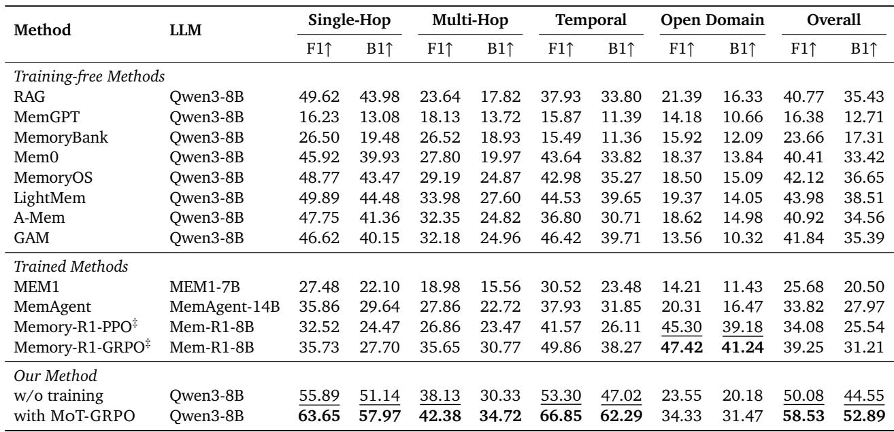
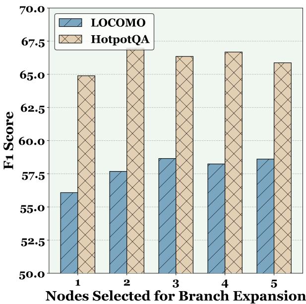
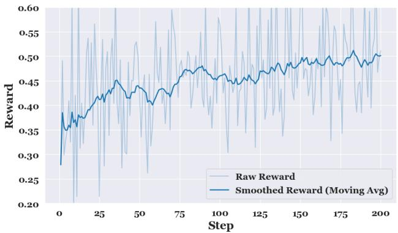
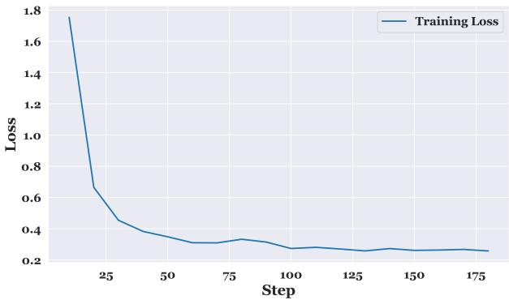

[← 返回 README](../README.md)

# Appendix

## A. Supplementary Experimental Setup

### A.1. Dataset Description

**LoCoMo** ([Maharana et al., 2024]) is a benchmark of very long-term conversational dialogues designed to evaluate long-range memory and reasoning capabilities in agent systems. The dataset consists of 10 extended conversations, each spanning dozens of sessions and hundreds of dialogue turns, with an average of around 600 turns and roughly 16K tokens per conversation. Questions in the LoCoMo QA evaluation are annotated with answer locations and categorized into types such as single-hop, multi-hop, open-domain, temporal reasoning, and adversarial, targeting different memory and inference challenges. In our experiments on LoCoMo QA, we follow standard practice in related work and do not use adversarial question data, which aligns with previous evaluations [Chhikara et al., 2025, Xu et al., 2025].

**HotpotQA** ([Yang et al., 2018]) is a widely-used multi-hop reasoning benchmark that requires models to aggregate information across multiple supporting documents to reach an answer. To evaluate performance in long-context scenarios, we follow the synthesis methodology proposed in recent work [Yan et al., 2025a, Yu et al., 2025], where the golden paragraphs containing the necessary evidence are embedded within a haystack of distractor content. In our experiments, we specifically utilize the 56K-token (eval_400) version of this synthetic HotpotQA dataset. This setup effectively transforms the reasoning task into a long-range retrieval and inference challenge, testing the agent's ability to filter out extensive irrelevant information while maintaining the precision required for multi-step logical reasoning.

**LongMemEval** ([Wu et al., 2025a]) is specifically designed to evaluate the long-term interactive memory capabilities of LLM-driven chat assistants, addressing the underexplored challenge of sustained memory performance in prolonged user-AI interactions. It comprehensively assesses five core memory abilities, information extraction, multi-session reasoning, temporal reasoning, knowledge updates, and abstention, through 500 manually curated questions embedded in freely scalable user-assistant chat histories, with two standard configurations: LONGMEMEVALS (~115k tokens per question) and LONGMEMEVALM (~1.5 million tokens across 500 sessions). Following previous works [Fang et al., 2025, Rasmussen et al., 2025, Wang et al., 2025], we use the LONGMEMEVALS dataset.

**NarrativeQA** ([Kočiský et al., 2017]) is a large-scale reading comprehension benchmark that assesses models' ability to understand and reason over long narrative text, such as books and movie scripts. The full NarrativeQA dataset contains on the order of tens of thousands of human-written question–answer pairs associated with over a thousand story documents, where questions require synthesis across global document structure rather than shallow pattern matching. Questions are constructed based on human-generated abstractive summaries, encouraging deep narrative understanding and integrative reasoning beyond local context overlaps. Following [Hu et al., 2026a], we randomly sampled 10 long documents from the NarrativeQA corpus and used their associated 298 QA pairs to measure performance on long-range narrative question answering.

> 💡 **批注**: 四个 benchmark 覆盖了不同的记忆挑战：LoCoMo（长对话记忆）、HotpotQA（多跳推理+长上下文噪声）、LongMemEval（五种记忆能力综合评估）、NarrativeQA（叙事理解）。只在 LoCoMo 上训练，其他三个纯 zero-shot 泛化。

### A.2. Implementation Details

**MoT-GRPO for Memory Retrieval Training Implementation Details.** We utilize the Ray distributed framework combined with vLLM as the inference backend, employing XFormers to optimize attention mechanisms. The model is trained with a global batch size of 32. We adopt a peak learning rate of $5 \times 10^{-6}$ with a warmup ratio of 0.285. To ensure training stability and prevent reward hacking, we set the KL divergence coefficient to 0.001.

**Context and Efficiency.** To support extensive memory retrieval operations, we configure the system with an extended context window, allowing for a maximum prompt length of 40,960 tokens and a maximum observation history of 20,480 tokens. For computational efficiency, we employ Fully Sharded Data Parallel (FSDP) with parameter, gradient, and optimizer offloading, performing all computations in bfloat16 precision.

**MoT-GRPO for Memory Construction Training Configuration.** The training is conducted on a single node equipped with 8 GPUs, utilizing the LLaMA-Factory framework. To maximize computational efficiency and handle the memory footprint of full-parameter updates, we employ DeepSpeed ZeRO-3 combined with Flash Attention 2. The maximum sequence length is truncated to 6,144 tokens.

**Hyperparameters.** The global batch size is set to 32 (calculated with a per-device batch size of 2 and 2 gradient accumulation steps). We optimize the model for 200 steps using a cosine learning rate scheduler, with a peak learning rate of $5 \times 10^{-6}$ and a warmup ratio of 0.1. The training uses bfloat16 precision, and $10\%$ of the dataset is reserved for validation to monitor convergence.

> 💡 **批注**: 训练基础设施：Ray + vLLM 做 rollout，LLaMA-Factory + DeepSpeed ZeRO-3 做训练。8 GPU 单节点就够，200 步就收敛。学习率 5e-6 和 KL coefficient 0.001 都很保守，说明训练稳定性不错。

---

## B. Supplementary Experiment

### B.1. Generalization Experiments Across Other LLMs

Table 5 demonstrates the generalization capabilities of Mem-T when applied to the Qwen3-8B model. The results indicate that our approach significantly outperforms all existing baselines across most metrics in the LoCoMo benchmark. Notably, even our training-free variant achieves an Overall F1 score of 50.08, surpassing previously established trained models such as Memory-R1 and MemAgent.

*Table 5 | Performance comparison on the LoCoMo benchmark (Qwen3-8B).*

When combined with our specific training, the performance further improves to 58.53 F1, particularly excelling in Single-Hop and Temporal reasoning tasks, thereby confirming the robust transferability and effectiveness of our framework across different LLM backbones.

> 💡 **批注**: Qwen3-8B 的结果和 4B 几乎一样（58.53 vs 58.65），说明 MoT-GRPO 的训练效果在模型规模上是 robust 的。但更大模型并没有带来更多提升，可能说明瓶颈已经不在模型能力而在记忆系统设计上。

### B.2. Sensitivity Analysis

*Figure 7 | Parameter sensitivity analysis on the number of nodes selected for branch expansion when training with MoT-GRPO on the LoCoMo and HotpotQA dataset.*

Regarding the number of nodes selected for branch expansion, as shown in Figure 7, we observe that increasing the number of nodes selected for branch expansion from 1 to 3 leads to significant performance improvements, with the F1 score rising from 56.08 to 58.65 on LoCoMo and from 64.89 to 66.35 on HotpotQA. However, further increasing the expansion breadth beyond 3 nodes yields diminishing returns; for instance, at a node count of 5, the F1 scores for both datasets plateau or even slightly decrease. Given that a larger number of expansion nodes significantly increases the search space and computational latency, we select 3 as the optimal number of nodes for branch expansion to achieve the best trade-off between reasoning accuracy and inference efficiency.

> 💡 **批注**: N_ν = 3 是最优分支数。超过 3 甚至轻微下降，可能是因为过多分支稀释了 advantage estimation 的信噪比。

### B.3. Training Curves

*Figure 8 | Reward curves of memory retrieval training under MoT-GRPO.*

Regarding the memory retrieval training stage, Figure 8 illustrates the evolution of rewards under the MoT-GRPO framework. The smoothed reward curve exhibits a consistent upward trend, climbing from an initial value of approximately 0.30 to over 0.50 by the 200th step. Although the raw rewards show significant variance, typical of reinforcement learning in complex reasoning tasks, the steady improvement in the moving average confirms that the agent effectively learns to optimize its retrieval strategies to maximize task-specific gains.

*Figure 9 | Loss curves of memory construction training under MoT-GRPO.*

For the memory construction training stage, Figure 9 presents the training loss over 180 steps. The curve shows a sharp initial descent, with the loss dropping rapidly from 1.8 to below 0.4 within the first 50 steps, indicating efficient convergence. In the subsequent phase, the loss stabilizes and fluctuates marginally around 0.25, suggesting that the model has successfully captured the underlying patterns for memory synthesis and state updates. The overall stability of the loss curve demonstrates the robustness of the memory construction process under our policy optimization framework.

> 💡 **批注**: 训练曲线很健康：retrieval reward 从 0.30 稳步上升到 0.50+，construction loss 快速收敛到 0.25。200 步就收敛说明 MoT 提供的 dense supervision 确实有效——相比之下，标准 GRPO 在同样的 long-horizon 设定下可能需要更多步甚至不收敛。

---

## C. Prompts of Mem-T

> 💡 **批注**: Appendix C 提供了完整的 tool 定义代码（Python class），包括 Formation（CreateFact, CreateExperience, UpdatePersona, UpdateSummary）、Evolution（Add, Update, Delete, Ignore）、Retrieval（SearchSummary, SearchFacts, SearchExperiences, SearchPersonas, SearchTurns, Finish）。这些 tool 定义既是 prompt 也是 action space 的具体实现，对复现非常关键。完整代码见 [GitHub](https://github.com/yanweiyue/Mem-T)。
