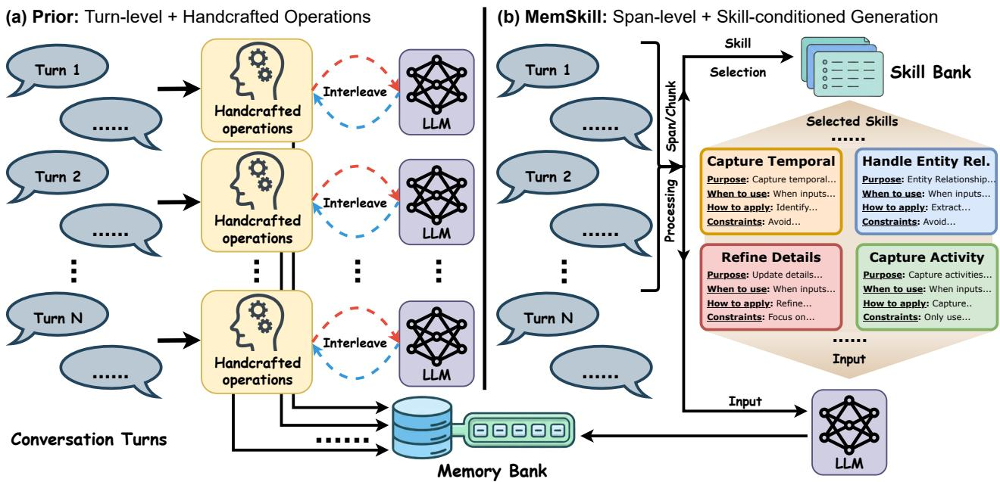
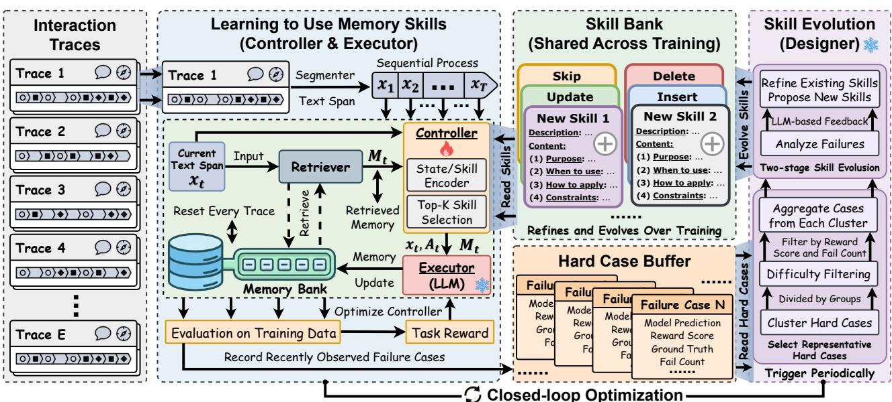
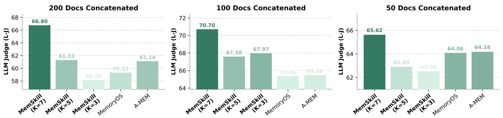

# MemSkill: Learning and Evolving Memory Skills for Self-Evolving Agents

Haozhen Zhang 1 Quanyu Long 1 Jianzhu Bao 1 Tao Feng 2 Weizhi Zhang 3 Haodong Yue 4 Wenya Wang 1

# Abstract

Most Large Language Model (LLM) agent memory systems rely on a small set of static, handdesigned operations for extracting memory. These fixed procedures hard-code human priors about what to store and how to revise memory, making them rigid under diverse interaction patterns and inefficient on long histories. To this end, we present MemSkill, which reframes these operations as learnable and evolvable memory skills, structured and reusable routines for extracting, consolidating, and pruning information from interaction traces. Inspired by the design philosophy of agent skills, MemSkill employs a controller that learns to select a small set of relevant skills, paired with an LLM-based executor that produces skillguided memories. Beyond learning skill selection, MemSkill introduces a designer that periodically reviews hard cases where selected skills yield incorrect or incomplete memories, and evolves the skill set by proposing refinements and new skills. Together, MemSkill forms a closed-loop procedure that improves both the skill-selection policy and the skill set itself. Experiments on LoCoMo, LongMemEval, HotpotQA, and ALFWorld demonstrate that MemSkill improves task performance over strong baselines and generalizes well across settings. Further analyses shed light on how skills evolve, offering insights toward more adaptive, self-evolving memory management for LLM agents. Code is available at https://github.com/ViktorAxelsen/MemSkill

# 1. Introduction

As Large Language Model (LLM) agents engage in longer, open-ended interactions, they must handle growing histories that are essential yet challenging to leverage, motivating memory for retaining experience and maintaining coherence (Hu et al., 2025). This need has driven rapid progress in agent memory, including approaches that summarize and retrieve past interactions or manage external memory stores (Kang et al., 2025; Chhikara et al., 2025; Packer et al., 2023; Xu et al., 2025). However, most methods still rely on static, hand-designed memory mechanisms, including fixed operation primitives (e.g., add/update/delete/skip) (Wang et al., 2025a; Yan et al., 2025) and heuristic modules that govern what to store, how to revise it (Kang et al., 2025; Fang et al., 2025), and when to prune it. Such designs bake in strong human assumptions and often suffer under diverse interaction patterns, scaling poorly as histories grow.

We argue that this formulation fundamentally limits the adaptability of agent memory. Rather than treating memory as the output of fixed operations or hand-designed modules, we propose to elevate memory extraction itself into a learnable abstraction. Concretely, we view memory construction as the outcome of applying a small set of generic, reusable memory skills: structured behaviors that specify when and how interaction traces should be transformed into memory and revised over time. This perspective reveals a key bottleneck of prior pipelines: they hard-code memory behaviors into fixed procedural workflows that interleave heuristics with LLM-mediated extraction and revision, making them brittle under distribution shift (Fang et al., 2025).

Under this view, an ideal agent memory system should satisfy three properties. (i) Minimal reliance on human priors. Instead of manually encoding what is worth remembering for a domain (Zhong et al., 2024), memory behaviors should be shaped by interaction data and updated as task demands evolve. (ii) Support for larger extraction granularity. Many approaches are tuned to a fixed unit, such as per-turn processing (Fang et al., 2025), and can weaken when applied to longer spans. A practical system should be able to operate at larger extraction granularity when needed. (iii) Skill-conditioned, compositional memory construction. Existing systems often decompose memory construction into specialized modules (Kang et al., 2025). In contrast, we prefer to select and compose a small set of relevant skills for the current context and apply them in one generation step, enabling flexible reuse and evolution of memory behaviors.

Based on the above observations, we introduce MemSkill, which reframes memory operations as a learnable and evolvable set of memory skills. MemSkill maintains a shared skill bank, where each skill captures a reusable way to extract, consolidate, or revise memories from interaction text (Figure 1 shows the structured template of a memory skill). Given the current context, a controller learns to select a small set of relevant skills, and an LLM-based executor conditions on these skills to generate skill-guided memories in one pass. This skill-conditioned formulation is not tied to a fixed extraction unit and can be applied to different span lengths when processing long interaction histories.

  
Figure 1. Comparison between (a) prior turn-level, handcrafted operations and (b) MemSkill’s span-level, skill-conditioned generation. Prior methods interleave handcrafted operations with LLM calls to incrementally extract and revise memory turn by turn, while MemSkill selects a small set of skills from a shared skill bank and applies them in one pass to produce skill-guided memories.

Crucially, MemSkill goes beyond learning how to use a fixed set of skills. We introduce a closed-loop evolution process that alternates between learning to use the current skill bank and evolving the skill bank itself. Specifically, we train the controller with reinforcement learning (RL) using downstream task signals as feedback for skill selection. Periodically, a designer aggregates the hardest cases produced during training, selects representative failures, and uses an LLM to refine existing skills and propose new ones. After each evolution step, the controller continues training on the evolved skill bank, with additional exploration to facilitate adopting newly introduced skills. Overall, this process gradually strengthens both the skill selection policy and the evolving skill bank, moving toward a more adaptive memory management system driven by interaction data.

Experiments on LoCoMo, LongMemEval, HotpotQA, and ALFWorld show that MemSkill consistently improves task performance and generalizes well. Further analyses validate key components and showcase representative evolved skills, offering insights toward more adaptive, self-evolving memory management for LLM agents.

Our contributions can be summarized as follows.

• We propose MemSkill, an agent memory method that represents memory operations as an evolving skill bank, and constructs skill-guided memories by conditioning an LLM on a selected set of skills.

• We introduce a closed-loop optimization recipe that combines reinforcement learning for skill selection with LLM-guided skill evolution from hard cases, enabling continual refinement of the skill bank and taking a step toward self-evolving agent memory systems.

• We evaluate MemSkill on LoCoMo, LongMemEval, HotpotQA, and ALFWorld, showing consistent gains over baselines and strong generalization, offering insights toward self-evolving memory for LLM agents.

# 2. Related Work

# 2.1. LLM Agent Memory Systems

Prior work on agent memory focuses on constructing external memories from interaction histories and leveraging them to support downstream reasoning and decision making. Typical pipelines periodically extract salient information into a memory store, retrieve relevant entries for a new query, and update the store via consolidation or pruning (Kang et al.,

2025; Zhong et al., 2024; Xu et al., 2025; Packer et al., 2023; Chhikara et al., 2025; Fang et al., 2025). More recently, learning-based approaches such as Memory-R1 (Yan et al., 2025) and Mem- $\alpha$ (Wang et al., 2025a) optimize memory management with reinforcement learning using downstream task signals. Despite this progress, memory management is still largely governed by static, hand-crafted routines for extraction, consolidation, and pruning.

Several concurrent works also explore self-evolving memory in agent settings, but differ fundamentally from our focus. Evo-Memory provides a streaming benchmark and evaluation framework for test-time memory evolution (Wei et al., 2025), while MemEvolve meta-optimizes memory architectures within a predefined modular design space (Zhang et al., 2025). By contrast, we target the evolution of memory skills themselves, enabling the system to refine and grow its reusable memory operations over time.

# 2.2. Self-Evolving LLM Agents

Recent work on self-evolving LLM agents studies how agents can improve from interaction experience with minimal manual supervision. ExpeL (Zhao et al., 2024) distills trajectories into editable natural-language insights and retrieves relevant experiences to guide future decisions, while EvolveR (Wu et al., 2025) formalizes an experience lifecycle that consolidates interactions into reusable principles and closes the loop with reinforcement learning updates. A complementary line reduces reliance on curated data via self-play style curricula: Absolute Zero Reasoner (Zhao et al., 2025) trains a proposer and solver with verifiable rewards from a code executor, and Multi-Agent Evolve (Chen et al., 2025) extends this to a proposer solver judge triad with LLM-based evaluation; R-Zero (Huang et al., 2025) follows a similar challenger solver co-evolution pattern. Beyond curricula, systems such as AgentEvolver (Zhai et al., 2025) and RAGEN (Wang et al., 2025b) study efficient agent learning dynamics and stabilization in multi-turn RL settings, while ADAS (Hu et al., 2024) and AlphaEvolve (Novikov et al., 2025) explore automated discovery and evolutionary improvement of agent designs. Finally, SkillWeaver (Zheng et al., 2025) shows that agents can discover and refine reusable skills for web interaction. In contrast, our focus is on self-evolving memory skills that govern how agents construct and revise memories over time.

# 3. Method

In this section, we first provide an overview of MemSkill (Section 3.1), then detail the skill bank (Section 3.2) and the three core components (controller (Section 3.3.1), executor (Section 3.3.2), and designer (Section 3.4)), and finally summarize the closed-loop optimization procedure that alternates between learning to use the current skills and evolving the skill bank from hard cases (Section 3.5).

# 3.1. Overview

As shown in Figure 2, we propose MemSkill, which optimizes agent memory through two intertwined processes. The first process learns to use a given skill bank: a controller selects a small set of skills conditioned on the context, and an executor applies them to produce memory updates. The second process improves the skill bank itself: a designer periodically revises existing skills and introduces new ones based on challenging cases during training.

To disentangle trace-specific memories from reusable memory management knowledge, MemSkill maintains two distinct stores. The memory bank is trace-specific and stores the memories constructed for each training trace (e.g., a long dialogue). In contrast, the skill bank is shared across all traces and contains reusable memory skills. During training, the controller and executor interact with each trace to build its memory bank, while the designer updates the shared skill bank between phases. This alternating procedure gradually improves both the skill selection policy and the skill bank for memory construction.

# 3.2. Skill Bank

As shown in Figure 2, a memory skill specifies a reusable memory operation as structured guidance, including when it is applicable and how it should be applied to the current context. Concretely, each skill $s \in S$ contains (i) a short description used for skill representation and selection, and (ii) a detailed content specification that instructs the executor on how to perform memory extraction or revision.

We start from a minimal set of general-purpose primitives to ensure a stable and functional initialization. Specifically, we initialize the skill bank with four basic skills corresponding to canonical memory operations: INSERT, UPDATE, DELETE, and SKIP. Starting from this minimal set, the designer progressively refines existing skills and expands the bank by proposing new skills that address uncovered failure modes. (Appendix B details skill description)

# 3.3. Learning to Use Memory Skills

In this part, we describe how MemSkill learns to use memory skills, covering (i) the skill-selection policy and (ii) skill-conditioned memory construction.

# 3.3.1. CONTROLLER: SKILL SELECTION POLICY

To enable effective skill selection as the skill bank evolves, we introduce a controller that selects a small set of relevant memory skills for the current context. At each memory construction step, we update memory at the span level: we split each interaction trace (e.g., a dialogue) into contiguous text spans and process them sequentially; for each span, the controller conditions its selection on (i) the current text span and (ii) the retrieved existing memories, rather than operating turn by turn.

  
Figure 2. MemSkill architecture overview. Given an interaction trace, MemSkill processes it span by span: the controller selects a Top- $K$ subset of skills from a shared skill bank conditioned on the current text span and retrieved memories, and an LLM executor applies the selected skills in one pass to update the trace-specific memory bank. The constructed memory is then evaluated on memory-dependent training queries to provide task reward for optimizing the controller, while query-centric failures are logged into a sliding hard-case buffer. Periodically, the designer mines representative hard cases to refine existing skills and propose new ones, yielding alternating phases of skill usage and skill evolution. More skill case study can be found in Section 4.5 and Appendix B.

To remain compatible with a variable-size skill bank as it continuously evolves, the controller scores each skill by measuring the semantic distance between the current state representation and the skill representation, which naturally supports a changing set of skills while staying sensitive to what is already stored in memory.

State representation. Formally, let $x _ { t }$ denote the current text span at step $t$ , and let $M _ { t } = \{ m _ { t , 1 } , \dots , m _ { t , R } \}$ be the retrieved memories from the current trace’s memory bank. The controller encodes $( x _ { t } , M _ { t } )$ into a state embedding:

$$
h _ { t } = f _ { \mathrm { c t x } } ( x _ { t } , M _ { t } ) .
$$

Skill representation. For each skill $s _ { i } \in S _ { t }$ in the current skill bank, we compute a skill embedding from its description, as it provides a focused semantic signal that is more stable than embedding the full skill content.

Compatibility with an evolving skill bank. Instead of producing a fixed-dimensional action head tied to a fixed number of skills, the controller scores each skill by comparing state and skill embeddings:

$$
z _ { t , i } = h _ { t } ^ { \top } u _ { i } , \qquad p _ { \theta } ( i \mid h _ { t } ) = \mathrm { s o f t m a x } ( z _ { t } ) _ { i } ,
$$

Note that we use the same embedding model for $f _ { \mathrm { c t x } }$ and $f _ { \mathrm { s k i l l } }$ , mapping contexts and skill descriptions into a shared representation space for scoring.

$$
u _ { i } = f _ { \mathrm { s k i l l } } ( \operatorname* { d e s c } ( s _ { i } ) ) .
$$

where $z _ { t } ~ \in ~ \mathbb { R } ^ { | S _ { t } | }$ adapts automatically as the skill bank evolves.

Top- $K$ skill selection. Given the categorical distribution $p _ { \theta } ( i { \bf \theta } \mid h _ { t } )$ over the current skill bank $S _ { t }$ , the controller selects an ordered Top- $K$ set of skills $A _ { t } = ( a _ { t , 1 } , \dotsc , a _ { t , K } )$ without replacement (e.g., via Gumbel-Top- $K$ (Kool et al., 2019)), and only passes the selected skills to the executor, keeping the skill context concise and relevant.

# 3.3.2. EXECUTOR: SKILL-CONDITIONED MEMORY EXTRACTION

Given the selected skills $A _ { t }$ , the executor (fixed) constructs memory updates by conditioning an LLM on (i) the current text span $x _ { t }$ , (ii) the retrieved memory items $M _ { t }$ , and (iii) the selected skills $A _ { t }$ . This mirrors skill-conditioned inference in agent systems, where a small set of relevant skills is provided to guide behavior for the current context. The executor then produces memory updates in a structured format, which are parsed and applied to update the trace’s memory bank. By composing several skills for the same text span and extracting memory in one LLM call, MemSkill reduces repeated per-turn processing and makes memory construction easier to scale to long interaction histories. Appendix C details the complete executor prompt.

# 3.3.3. CONTROLLER OPTIMIZATION

We train the controller with reinforcement learning, using downstream task performance as feedback for its skill selections. For each training trace, the controller makes a sequence of Top- $K$ selections while the executor incrementally builds the trace-specific memory bank. After construction, we evaluate the resulting memory bank on the trace’s memory-dependent training queries and use the resulting task performance as the reward (e.g., F1 or success rate).

A key technical detail is that the controller’s action is an ordered Top- $K$ set selected without replacement, rather than a single discrete action. We therefore compute the joint logprobability $\log \pi _ { \theta } ( A _ { t } \mid s _ { t } )$ under the without-replacement selection process and use it in standard policy-gradient style objectives via importance weighting and clipping. Concretely, the joint probability can be written as

$$
\pi _ { \theta } ( A _ { t } \mid s _ { t } ) = \prod _ { j = 1 } ^ { K } { \frac { p _ { \theta } ( a _ { t , j } \mid s _ { t } ) } { 1 - \sum _ { \ell < j } p _ { \theta } ( a _ { t , \ell } \mid s _ { t } ) } } ,
$$

which reduces to the usual single-action case when $K = 1$ Appendix A.4 provides implementation details.

# 3.4. Skill Evolution through Designer Feedback

Beyond learning to select from a fixed set of skills, MemSkill evolves the skill bank using an LLM-based designer (fixed) that operates periodically during training.

Hard-case buffer. During controller training, we maintain a sliding-window buffer of challenging cases observed recently. Each case is query-centric, recording the query along with its ground-truth and metadata (e.g., retrieved memories and model prediction), as well as summary statistics such as task performance and the number of failures observed so far. The buffer uses two expiration rules: cases are removed if they become too old (exceeding a maximum training step gap) or if the buffer reaches its capacity limit, which tracks recent failure patterns without growing unbounded.

Selecting representative hard cases. To focus designer updates on impactful failures, we cluster cases (e.g., KMeans) into groups that naturally reflect different query or error types. Within each cluster, we prioritize representative cases using a difficulty score that increases when task performance is low and when the same case fails repeatedly. This produces a compact set of high-value cases for skill evolution while preserving diversity across error types.

Two-stage skill evolution. The designer updates the skill bank in two stages. First, it employs an LLM to analyze the selected hard cases and identify what memory behaviors are missing or mis-specified. Second, it uses the resulting analysis to propose concrete edits to existing skills and to introduce new skills. We keep the designer description concise here and provide prompt details in Appendix C.

Notably, we maintain snapshots of the best-performing skill bank and roll back if an update degrades performance, with early stopping when repeated designer updates fail to improve the training signal. After each evolution step, we also briefly increase exploration by biasing selection toward newly introduced skills, encouraging the controller to try them and facilitating efficient learning of their utility. More details about the designer can be found in Appendix A.2.

# 3.5. Closed-Loop Optimization

MemSkill alternates between (i) learning to select and apply skills to build memory banks and (ii) evolving the skill bank based on hard cases mined from recent training steps. Each cycle begins with controller training on the current skill bank, during which the executor constructs memories and the system accumulates challenging cases. The designer then updates the skill bank using representative hard cases, optionally rolling back to a prior snapshot if the update regresses. The next cycle resumes controller training on the updated skill bank, with additional exploration to encourage early use of new skills. Through repeated cycles, MemSkill progressively improves both skill usage and the skill bank available for memory construction.

# 4. Experiments

# 4.1. Experiment Setup

Datasets and Baselines. We evaluate MemSkill on four benchmarks: LoCoMo (Maharana et al., 2024), LongMemEval (Wu et al., 2024), HotpotQA (Yang et al., 2018), and ALFWorld (Shridhar et al., 2020), where HotpotQA is used in Section 4.4 to study skill transfer under distribution shift. The remaining three benchmarks cover two representative settings. (i) Conversational Benchmarks include LoCoMo and LongMemEval, which evaluate memory construction from long, dialogue-style interaction histories. For these datasets, we report F1-score (F1) and an LLM-based judge score (L-J). (ii) Embodied Interactive Tasks are evaluated on ALFWorld with two standard subsets, ALF-Seen and ALF-Unseen, and we report success rate (SR) and the number of environment interaction steps (#Steps). Specific dataset splits are provided in Appendix A.1.

We compare MemSkill against several strong baselines: (1) No-Memory, which answers directly without an external memory (or additional constructed context); (2) Chainof-Notes $\mathbf { \Pi } ( \mathbf { C o N } )$ (Yu et al., 2024); (3) ReadAgent (Lee et al., 2024); (4) MemoryBank (Zhong et al., 2024); (5)

Table 1. Main comparison results on LoCoMo, LongMemEval, and ALFWorld.   

<table><tr><td rowspan="2">Model Methods</td><td rowspan="2"></td><td colspan="5">Conversational Benchmarks</td><td colspan="5">Embodied Interactive Tasks</td></tr><tr><td colspan="2">LoCoMo</td><td colspan="2">LongMemEval</td><td rowspan="2">Avg.</td><td colspan="2">ALF-Seen</td><td colspan="2">ALF-Unseen</td><td>Avg.</td></tr><tr><td></td><td>F1</td><td>L-J</td><td>F1</td><td>L-J</td><td>L-J</td><td>SR</td><td>#Steps↓</td><td>SR</td><td>#Steps↓</td><td>SR</td></tr><tr><td rowspan="10">IIAAAA Tostt</td><td>No-Memory</td><td>-</td><td>-</td><td>-</td><td>-</td><td>-</td><td>17.14</td><td>43.74</td><td>20.15</td><td>42.99</td><td>18.65</td></tr><tr><td>CoN</td><td>17.97</td><td>24.80</td><td>30.28</td><td>56.93</td><td>40.87</td><td>40.71</td><td>33.44</td><td>30.60</td><td>37.66</td><td>35.66</td></tr><tr><td>ReadAgent</td><td>26.34</td><td>35.17</td><td>23.52</td><td>41.58</td><td>38.38</td><td>32.86</td><td>37.09</td><td>38.06</td><td>34.78</td><td>35.46</td></tr><tr><td>MemoryBank</td><td>33.54</td><td>40.92</td><td>30.26</td><td>35.15</td><td>38.04</td><td>25.00</td><td>39.96</td><td>32.84</td><td>36.54</td><td>28.92</td></tr><tr><td>A-MEM</td><td>35.60</td><td>46.34</td><td>25.86</td><td>38.12</td><td>42.23</td><td>24.29</td><td>40.51</td><td>28.36</td><td>38.83</td><td>26.33</td></tr><tr><td>Mem0</td><td>10.18</td><td>33.01</td><td>29.94</td><td>45.54</td><td>39.28</td><td>32.86</td><td>36.47</td><td>32.09</td><td>37.32</td><td>32.48</td></tr><tr><td>LangMem</td><td>25.97</td><td>29.14</td><td>15.79</td><td>21.00</td><td>25.07</td><td>37.86</td><td>34.39</td><td>35.07</td><td>35.70</td><td>36.47</td></tr><tr><td>MemoryOS</td><td>38.68</td><td>44.59</td><td>14.19</td><td>36.50</td><td>40.55</td><td>15.71</td><td>43.74</td><td>14.18</td><td>44.54</td><td>14.95</td></tr><tr><td>MemSkill</td><td>38.78</td><td>50.96</td><td>31.65</td><td>59.41</td><td>55.19</td><td>47.86</td><td>30.88</td><td>47.01</td><td>30.43</td><td>47.44</td></tr><tr><td>No-Memory</td><td>-</td><td>-</td><td>-</td><td>-</td><td>-</td><td>18.57</td><td>42.48</td><td>26.12</td><td>39.35</td><td>22.35</td></tr><tr><td rowspan="8">Bs-R-t 20</td><td>CoN</td><td>27.97</td><td>35.35</td><td>28.34</td><td>46.04</td><td>40.70</td><td>57.86</td><td>25.81</td><td>53.73</td><td>28.40</td><td>55.80</td></tr><tr><td>ReadAgent</td><td>25.41</td><td>33.57</td><td>23.52</td><td>41.58</td><td>37.58</td><td>53.57</td><td>27.88</td><td>54.48</td><td>27.41</td><td>54.03</td></tr><tr><td>MemoryBank</td><td>25.39</td><td>39.76</td><td>7.36</td><td>24.75</td><td>32.26</td><td>37.86</td><td>35.15</td><td>38.06</td><td>34.99</td><td>37.96</td></tr><tr><td>A-MEM</td><td>34.83</td><td>48.41</td><td>12.46</td><td>34.65</td><td>41.53</td><td>25.00</td><td>40.28</td><td>29.10</td><td>39.04</td><td>27.10</td></tr><tr><td>Mem0</td><td>11.11</td><td>30.10</td><td>26.88</td><td>43.07</td><td>36.59</td><td>38.57</td><td>33.64</td><td>41.04</td><td>33.16</td><td>39.81</td></tr><tr><td>LangMem</td><td>24.04</td><td>27.07</td><td>16.37</td><td>20.00</td><td>23.54</td><td>37.14</td><td>34.42</td><td>31.34</td><td>37.17</td><td>34.24</td></tr><tr><td>MemoryOs</td><td>38.55</td><td>44.59</td><td>13.26</td><td>36.00</td><td>40.30</td><td>19.29</td><td>42.43</td><td>18.66</td><td>42.95</td><td>18.98</td></tr><tr><td>MemSkill</td><td>39.28</td><td>52.07</td><td>23.75</td><td>59.90</td><td>55.99</td><td>60.00</td><td>24.54</td><td>64.18</td><td>23.57</td><td>62.09</td></tr></table>

Bold indicates the best score within each base model block. ▲ indicates no training using this base model or dataset (transfer evaluation only).

A-MEM (Xu et al., 2025); (6) Mem0 (Chhikara et al., 2025); (7) LangMem (LangChain, 2025); and (8) MemoryOS (Kang et al., 2025). Overall, this setup spans diverse benchmarks and baselines, enabling a broad and consistent comparison across diverse settings.

Implementation Details. We initialize the controller as a lightweight multilayer perceptron (MLP), and use LLaMA3.3-70B-Instruct (Grattafiori et al., 2024) and Qwen3-Next80B-A3B-Instruct (Yang et al., 2025) as the base LLMs, accessed through an API service. Unless otherwise specified, we train MemSkill on LLaMA and use Qwen only for transfer experiments. LongMemEval is also evaluated in a transfer setting, where we directly apply the skills learned on LoCoMo without further training.

For both MemSkill and all baselines, we retrieve up to 20 memory items for a consistent comparison. During training, we initialize the controller optimization with PPO (Schulman et al., 2017). MemSkill performs memory construction at the span level. On conversational benchmarks, we treat each dialogue session as the basic processing unit during training, and the controller selects a small set of skills per unit with $K { = } 3$ . We use Qwen3-Embedding-0.6B (Yang et al., 2025) as the shared encoder for state and skill representations, and adopt Contriever (Izacard et al., 2021) as the default memory retriever. For the designer, we trigger skill evolution every 100 training steps and allow at most 3 skill edits per evolution round. For ALFWorld, we cap the maximum environment interaction length to 50 steps.

At evaluation time, we keep the same span-level formulation and set the span/chunk size to 512 by default, while keeping the overall procedure unchanged. Unless otherwise specified, we use $K { = } 7$ skills for LoCoMo and LongMemEval at evaluation time, and $K { = } 5$ for ALFWorld. Additional implementation details and prompt templates are provided in Appendix A and Appendix C.

# 4.2. Comparison Experiments

Effectiveness across conversational and embodied settings. Table 1 summarizes the main comparison results on LoCoMo, LongMemEval, and ALFWorld. Across these datasets, MemSkill achieves the strongest overall performance among all compared methods. On conversational benchmarks, MemSkill attains the best LLM-judge scores on both LoCoMo and LongMemEval within each basemodel block, indicating higher-quality constructed memories. In comparison, prior methods such as MemoryBank, A-MEM, and MemoryOS use fixed, manually specified memory procedures for extraction and revision, whereas

  
Figure 3. Skill generalization under distribution shift on HotpotQA. We transfer the LoCoMo-trained skill bank to HotpotQA and evaluate three context-length settings (50/100/200 concatenated documents) following (Yu et al., 2025). Bars show LLM-judge (L-J) under LLaMA with different Top- $K$ skill counts, compared to MemoryOS and A-MEM.

MemSkill learns and evolves its skills from interaction, enabling better adaptation across contexts. On ALFWorld, MemSkill achieves the highest success rates on both seen and unseen splits, indicating that skill-guided memory construction can benefit interactive decision making, whereas other baselines are less reliable at leveraging memory to support long-horizon action execution. Overall, the results show that MemSkill is effective across diverse settings.

Generalization across base models. A key advantage of MemSkill is strong generalization across base models. We train MemSkill only with LLaMA and directly transfer the learned skills to Qwen without retraining. Despite this strict transfer setting, MemSkill remains highly competitive and continues to outperform strong baselines on both conversational and embodied evaluations, demonstrating that the evolved skills capture reusable memory behaviors that can be instantiated by different underlying LLMs.

Cross-dataset transfer. MemSkill also generalizes across datasets within the same broad setting. In particular, LongMemEval is evaluated purely by transferring the skill bank learned on LoCoMo, yet MemSkill achieves the best results among all methods, suggesting that the learned skills are not overfit to a single benchmark. We further study transfer under more pronounced distribution shifts in Section 4.4.

# 4.3. Ablation Study

We perform ablations to disentangle the contributions of (i) learning to select skills and (ii) evolving the skill bank. Table 2 reports LLM Judge (L-J) results on LoCoMo under both base models (LLaMA and Qwen). As shown, w/o controller (random skills) replaces the learned controller with random skill selection while keeping the rest of the pipeline unchanged. w/o designer (static skills) disables the designer and fixes the skill bank to the four initial primitives. Refine-only (no new skills) allows the designer to refine existing skills but prohibits adding new ones.

Across both base models, removing either component consistently degrades performance, confirming that MemSkill benefits from both targeted skill selection and skill evolution. In particular, random skill selection leads to a clear drop from the default setting, highlighting the importance of learning to choose relevant skills rather than providing arbitrary ones. Disabling the designer yields an even larger degradation, especially under Qwen, suggesting that evolving the skill bank is important for learning reusable memory behaviors that generalize beyond a fixed, manually specified operation set. Finally, refinement-only consistently outperforms static skills on both LLaMA and Qwen, with a particularly large gain under Qwen, yet remains below the default setting, indicating that introducing new skills yields additional benefits beyond refining the initial primitives.

Table 2. Ablation study on LoCoMo using L-J metric.   

<table><tr><td>Variant</td><td>LLaMA</td><td>Qwen</td></tr><tr><td>MemSkill (default)</td><td>50.96</td><td>52.07</td></tr><tr><td>w/o controller (random skills)</td><td>45.86</td><td>41.24</td></tr><tr><td>w/o designer (static skills)</td><td>44.11</td><td>34.71</td></tr><tr><td>Refine-only (no new skills)</td><td>44.90</td><td>46.97</td></tr></table>

# 4.4. Skill Generalization Under Distribution Shift

Beyond transfer within dialogue-style memory benchmarks, we evaluate whether learned skills generalize under a distribution shift in interaction format and evidence structure. Concretely, we directly apply the skill bank trained on LoCoMo to HotpotQA, where inputs are long-form, documentstyle narratives rather than multi-turn dialogues. Following the evaluation protocol in (Yu et al., 2025), we test three context-length settings with increasing difficulty, corresponding to different numbers of concatenated documents (i.e., 50/100/200). All results in this section use LLaMA as the base model and report the LLM-judge score (L-J). For baselines, we include MemoryOS and A-MEM, which are the most competitive methods on conversational benchmarks in Table 1, and omit weaker alternatives for clarity.

# LoCoMo (Conversational Skills)

# Capture Temporal Context

Purpose: Capture the temporal context of events, activities, or facts mentioned in the text chunk, including any relevant dates, times, durations, or sequential information. When to use: The text chunk mentions a specific event, activity, or fact with associated temporal information. How to apply: Identify the key temporal elements (e.g., start time, end time, duration, sequence). Capture the temporal context in a concise and specific format, considering any sequential relationships. Constraints: Focus on explicit temporal information mentioned in the text chunk. Avoid inferring temporal details not directly stated.

# Capture Activity Details

Purpose: Capture detailed information about activities mentioned in the text chunk, including the type of activity, location, participants, temporal details, and any relevant contextual information.

When to use: The text chunk mentions a specific activity or event with contextual details.

# Capture Action Constraints

How to apply: Identify the key elements of the activity (e.g., type, location, participants, temporal details). Capture any relevant contextual information that provides additional insight into the activity. Keep the activity details specific, actionable, and concise.

# ALFWorld (Embodied Task Skills)

Constraints: Focus on explicit activity details and contextual info.   
Avoid inferring activity details or context not directly stated.

Purpose: Capture detailed constraints on actions, including object states and movements, necessary for task completion. When to use: The input mentions constraints on actions, including object states and movements, which are crucial for future task steps. How to apply: Identify the action, its constraints, and relevant object states and movements from the input. Create a new memory item with the action-constraint pair, including object states and movements. Constraints: Only capture constraints on actions relevant to the task. Update existing constraint memories if new information is provided.

# Track Object Location

Purpose: Explicitly track the location and state of an object necessary for task completion.

When to use: The text chunk mentions an object's location or state.   
The object's location or state is crucial for future task steps.

How to apply: Identify the object, its location, and relevant state from the text chunk. Create a new memory item with the object-location-state triplet.

Constraints: Only track locations and states of objects relevant to the task. Update existing location memories if new information is provided.

Figure 4. Case study. We show representative evolved skills learned on LoCoMo and ALFWorld. (“Description” is omitted for brevity.)

Figure 3 shows that MemSkill transfers strongly to HotpotQA across all three context sizes. In particular, MemSkill consistently outperforms strong baselines such as MemoryOS and A-MEM, with the gains becoming more pronounced in the more challenging long-context setting. These results suggest that the learned memory skills are not tied to dialogue-specific surface forms, but capture reusable extraction and revision behaviors that remain effective when the input structure and retrieval demands change.

The same plots also reveal mild sensitivity to the number of selected skills $K$ . Increasing $K$ generally improves performance, with $K { = } 7$ achieving the best results across all three settings, while smaller $K$ can under-utilize the skill bank under longer contexts. Overall, the trend indicates that MemSkill benefits from composing multiple skills when the context becomes longer and noisier, while still maintaining strong transfer without any HotpotQA-specific training.

# 4.5. Case Study

To make MemSkill more interpretable, we inspect the final evolved skill bank and report representative skills learned from LoCoMo and ALFWorld. As shown in Figure 4, the learned skills exhibit clear domain specialization across LoCoMo and ALFWorld. For LoCoMo, the skills in Figure 4 emphasize temporal context and activity details, suggesting that effective dialogue memory often benefits from organizing events with lightweight structure, such as who did what, where, and when, across long interactions. More broadly, the evolved skill bank reflects recurring information needs surfaced by the data, rather than a single fixed notion of what should be remembered. In contrast, the ALFWorld skills focus on action constraints and object locations, highlighting that embodied success depends on maintaining an actionable world state summary, including task-relevant preconditions rather than broad narrative summaries, to support multi-step execution.

Taken together, these skills illustrate how MemSkill can automatically distill reusable memory behaviors from interaction data and continually refine them through training, moving toward a more adaptive memory system with reduced reliance on hand-crafted memory designs. Additional evolved skills are provided in Appendix B.

# 5. Conclusion

We present MemSkill, an agent memory method that reframes memory operations as an evolving skill bank. MemSkill learns to select a small set of relevant skills for each context span and conditions an LLM executor on these skills to construct memories in a skill-guided manner. Beyond learning how to use a fixed operation set, MemSkill introduces a designer that improves the skill bank itself by refining existing skills and proposing new ones from challenging cases, forming a closed-loop training procedure. Experiments on LoCoMo, LongMemEval, HotpotQA, and ALFWorld demonstrate consistent improvements over strong baselines, and qualitative analyses illustrate how evolving skills can yield more adaptive memory management behaviors. We hope MemSkill encourages future work on self-improving agent memory systems that learn not only to use memory, but also to continually improve how memory is constructed and maintained.

# Acknowledgements

This research/project is supported by the NTU Start-Up Grant (#023284-00001), Singapore, and the MOE AcRF Tier 1 Seed Grant (RS37/24, #025041-00001), Singapore.

# Impact Statement

MemSkill advances the design of agent memory by shifting emphasis from static, hand-crafted procedures to learnable and evolvable memory skills. This perspective can make long-running LLM agents more practical in settings where interaction histories grow and the information that matters changes over time. By improving how memories are extracted, consolidated, and revised, MemSkill can support more consistent assistance in applications such as multisession personal assistants, educational tutors, long-form customer support, and interactive research tools, where agents must preserve relevant context while avoiding redundant or stale information.

Beyond immediate applications, MemSkill also offers a reusable methodology for studying how memory behaviors should be specified and improved. The explicit skill bank provides a concrete interface for inspection and analysis, which may encourage more interpretable and controllable memory systems. More broadly, the idea of iteratively improving memory management behaviors from hard cases can inspire similar self-improvement mechanisms in other agent subsystems, such as tool use or planning, where fixed heuristics remain common.

As with any memory-enabled agent, responsible use benefits from basic safeguards. For example, deployments should avoid storing unnecessary sensitive information and should provide user-facing controls for memory inspection and removal. These considerations are standard for memoryaugmented systems and are not unique to MemSkill, but they become increasingly important as agent memory becomes more effective and widely adopted.

# References

Chen, Y., Wang, Y., Zhu, S., Yu, H., Feng, T., Zhang, M., Patwary, M., and You, J. Multi-agent evolve: Llm self-improve through co-evolution. arXiv preprint arXiv:2510.23595, 2025.

Chhikara, P., Khant, D., Aryan, S., Singh, T., and Yadav, D. Mem0: Building production-ready ai agents with scalable long-term memory. arXiv preprint arXiv:2504.19413, 2025.

Fang, J., Deng, X., Xu, H., Jiang, Z., Tang, Y., Xu, Z., Deng, S., Yao, Y., Wang, M., Qiao, S., et al. Lightmem:

Lightweight and efficient memory-augmented generation.   
arXiv preprint arXiv:2510.18866, 2025.

Grattafiori, A., Dubey, A., Jauhri, A., Pandey, A., Kadian, A., Al-Dahle, A., Letman, A., Mathur, A., Schelten, A., Vaughan, A., et al. The llama 3 herd of models. arXiv preprint arXiv:2407.21783, 2024.

Hu, S., Lu, C., and Clune, J. Automated design of agentic systems. arXiv preprint arXiv:2408.08435, 2024.

Hu, Y., Liu, S., Yue, Y., Zhang, G., Liu, B., Zhu, F., Lin, J., Guo, H., Dou, S., Xi, Z., et al. Memory in the age of ai agents. arXiv preprint arXiv:2512.13564, 2025.

Huang, C., Yu, W., Wang, X., Zhang, H., Li, Z., Li, R., Huang, J., Mi, H., and Yu, D. R-zero: Selfevolving reasoning llm from zero data. arXiv preprint arXiv:2508.05004, 2025.

Izacard, G., Caron, M., Hosseini, L., Riedel, S., Bojanowski, P., Joulin, A., and Grave, E. Unsupervised dense information retrieval with contrastive learning. arXiv preprint arXiv:2112.09118, 2021.

Kang, J., Ji, M., Zhao, Z., and Bai, T. Memory os of ai agent. arXiv preprint arXiv:2506.06326, 2025.

Kool, W., Van Hoof, H., and Welling, M. Stochastic beams and where to find them: The gumbel-top-k trick for sampling sequences without replacement. In International conference on machine learning, pp. 3499–3508. PMLR, 2019.

LangChain. Langmem. https://github.com/ langchain-ai/langmem, 2025. GitHub repository.

Lee, K.-H., Chen, X., Furuta, H., Canny, J., and Fischer, I. A human-inspired reading agent with gist memory of very long contexts. arXiv preprint arXiv:2402.09727, 2024.

Maharana, A., Lee, D.-H., Tulyakov, S., Bansal, M., Barbieri, F., and Fang, Y. Evaluating very long-term conversational memory of llm agents. arXiv preprint arXiv:2402.17753, 2024.

Novikov, A., Vu, N., Eisenberger, M., Dupont, E., Huang, ˜ P.-S., Wagner, A. Z., Shirobokov, S., Kozlovskii, B., Ruiz, F. J., Mehrabian, A., et al. Alphaevolve: A coding agent for scientific and algorithmic discovery. arXiv preprint arXiv:2506.13131, 2025.

Packer, C., Fang, V., Patil, S., Lin, K., Wooders, S., and Gonzalez, J. Memgpt: Towards llms as operating systems. 2023.

Schulman, J., Wolski, F., Dhariwal, P., Radford, A., and Klimov, O. Proximal policy optimization algorithms. arXiv preprint arXiv:1707.06347, 2017.

Shridhar, M., Yuan, X., Cotˆ e, M.-A., Bisk, Y., Trischler, ´ A., and Hausknecht, M. Alfworld: Aligning text and embodied environments for interactive learning. arXiv preprint arXiv:2010.03768, 2020.

Wang, Y., Takanobu, R., Liang, Z., Mao, Y., Hu, Y., McAuley, J., and Wu, X. Mem-{\alpha}: Learning memory construction via reinforcement learning. arXiv preprint arXiv:2509.25911, 2025a.

Wang, Z., Wang, K., Wang, Q., Zhang, P., Li, L., Yang, Z., Jin, X., Yu, K., Nguyen, M. N., Liu, L., et al. Ragen: Understanding self-evolution in llm agents via multi-turn reinforcement learning. arXiv preprint arXiv:2504.20073, 2025b.

Wei, T., Sachdeva, N., Coleman, B., He, Z., Bei, Y., Ning, X., Ai, M., Li, Y., He, J., Chi, E. H., et al. Evo-memory: Benchmarking llm agent test-time learning with selfevolving memory. arXiv preprint arXiv:2511.20857, 2025.

Wu, D., Wang, H., Yu, W., Zhang, Y., Chang, K.-W., and Yu, D. Longmemeval: Benchmarking chat assistants on long-term interactive memory. arXiv preprint arXiv:2410.10813, 2024.

Wu, R., Wang, X., Mei, J., Cai, P., Fu, D., Yang, C., Wen, L., Yang, X., Shen, Y., Wang, Y., et al. Evolver: Self-evolving llm agents through an experience-driven lifecycle. arXiv preprint arXiv:2510.16079, 2025.

Xu, W., Liang, Z., Mei, K., Gao, H., Tan, J., and Zhang, Y. A-mem: Agentic memory for llm agents. arXiv preprint arXiv:2502.12110, 2025.

Yan, S., Yang, X., Huang, Z., Nie, E., Ding, Z., Li, Z., Ma, X., Kersting, K., Pan, J. Z., Schutze, H., et al. Memory- ¨ r1: Enhancing large language model agents to manage and utilize memories via reinforcement learning. arXiv preprint arXiv:2508.19828, 2025.

Yang, A., Li, A., Yang, B., Zhang, B., Hui, B., Zheng, B., Yu, B., Gao, C., Huang, C., Lv, C., et al. Qwen3 technical report. arXiv preprint arXiv:2505.09388, 2025.

Yang, Z., Qi, P., Zhang, S., Bengio, Y., Cohen, W., Salakhutdinov, R., and Manning, C. D. Hotpotqa: A dataset for diverse, explainable multi-hop question answering. In Proceedings of the 2018 conference on empirical methods in natural language processing, pp. 2369–2380, 2018.

Yu, H., Chen, T., Feng, J., Chen, J., Dai, W., Yu, Q., Zhang, Y.-Q., Ma, W.-Y., Liu, J., Wang, M., et al. Memagent: Reshaping long-context llm with multi-conv rl-based memory agent. arXiv preprint arXiv:2507.02259, 2025.

Yu, W., Zhang, H., Pan, X., Cao, P., Ma, K., Li, J., Wang, H., and Yu, D. Chain-of-note: Enhancing robustness in retrieval-augmented language models. In Proceedings of the 2024 conference on empirical methods in natural language processing, pp. 14672–14685, 2024.

Zhai, Y., Tao, S., Chen, C., Zou, A., Chen, Z., Fu, Q., Mai, S., Yu, L., Deng, J., Cao, Z., et al. Agentevolver: Towards efficient self-evolving agent system. arXiv preprint arXiv:2511.10395, 2025.

Zhang, G., Ren, H., Zhan, C., Zhou, Z., Wang, J., Zhu, H., Zhou, W., and Yan, S. Memevolve: Meta-evolution of agent memory systems. arXiv preprint arXiv:2512.18746, 2025.

Zhao, A., Huang, D., Xu, Q., Lin, M., Liu, Y.-J., and Huang, G. Expel: Llm agents are experiential learners. In Proceedings of the AAAI Conference on Artificial Intelligence, volume 38, pp. 19632–19642, 2024.

Zhao, A., Wu, Y., Yue, Y., Wu, T., Xu, Q., Lin, M., Wang, S., Wu, Q., Zheng, Z., and Huang, G. Absolute zero: Reinforced self-play reasoning with zero data. arXiv preprint arXiv:2505.03335, 2025.

Zheng, B., Fatemi, M. Y., Jin, X., Wang, Z. Z., Gandhi, A., Song, Y., Gu, Y., Srinivasa, J., Liu, G., Neubig, G., et al. Skillweaver: Web agents can self-improve by discovering and honing skills. arXiv preprint arXiv:2504.07079, 2025.

Zhong, W., Guo, L., Gao, Q., Ye, H., and Wang, Y. Memorybank: Enhancing large language models with long-term memory. In Proceedings of the AAAI Conference on Artificial Intelligence, volume 38, pp. 19724–19731, 2024.

# A. More Implementation Details

# A.1. Evaluation Details

LLM judge and infrastructure. We use openai/gpt-oss-120b as the LLM judge. All API-based models are accessed via NV NIM API and Together API. Training is conducted on NVIDIA A6000 GPUs.

LoCoMo (Maharana et al., 2024). LoCoMo contains 10 long interaction samples, each paired with roughly 200 training queries on average. We split the dataset by sample into train/val/test with a 6/2/2 ratio. We additionally remove adversarial queries, since their evidence is not present in the provided context and can introduce noisy supervision during training.

LongMemEval (Wu et al., 2024). We use the LongMemEval-S split, where each example contains an ultra-long conversation of roughly 100K tokens. We then perform transfer evaluation on a stratified sample of about one-fifth of the dataset (approximately 100 samples), ensuring coverage of different question types for a comprehensive assessment.

ALFWorld (Shridhar et al., 2020). We first collect expert trajectories from the training split and treat them as the corpus for memory or experience construction. We then evaluate on the official ALF-Seen and ALF-Unseen splits.

HotpotQA (Yang et al., 2018). We use HotpotQA to study transfer under distribution shift following the evaluation protocol of (Yu et al., 2025). Concretely, we evaluate on three context-length settings with increasing difficulty, corresponding to 50/100/200 concatenated documents (denoted as eval 50, eval 100, and eval 200). Unless otherwise specified, all results in this part use LLaMA as the base model and report the LLM-judge score (L-J).

Span-level evaluation. During evaluation, we perform memory construction at the span level with a default span size of 512 tokens, rather than updating memory turn by turn. This substantially reduces the number of LLM calls and improves evaluation efficiency.

# A.2. More Details of the Designer

Hard-case buffer and representative case mining. The designer maintains a sliding hard-case buffer that tracks recently challenging evaluation cases without growing unbounded. Each case stores the query, the retrieved memories used to answer it, the model prediction, the reference answer, the resulting task reward (e.g., F1), and a failure counter that records how many times the case has been answered incorrectly. To prioritize cases that are both low-reward and repeatedly failed, we assign each case a difficulty score

$$
d ( q ) = ( 1 - r ( q ) ) \cdot c ( q ) ,
$$

where $r ( q ) \in [ 0 , 1 ]$ is the task reward for query $q$ and $c ( q )$ is its cumulative failure count within the buffer window. Higher $d ( q )$ indicates more critical cases that should be examined first.

To encourage coverage over diverse failure types, we further cluster hard cases by semantic similarity of their queries and mine representative cases from each cluster. For example, in LoCoMo, some queries focus on temporal cues (e.g., when an event happened) while others emphasize locations (e.g., where something occurred). Clustering helps separate these semantic types so the designer feedback is not dominated by a single frequent error mode, improving diversity and completeness of the mined supervision.

Exploration incentive for newly introduced skills. After each evolution round, the designer may introduce new skills that the controller has not yet learned to utilize. To facilitate adoption, we apply a short post-update exploration phase by biasing the controller toward new skills directly at the logit level. Let $S _ { \mathrm { n e w } } \subseteq S$ denote the set of newly added skills, and let $p _ { \theta } ( i \mid s _ { t } ) = \mathrm { s o f t m a x } ( z _ { t } ) _ { i }$ be the controller distribution at step $t$ . We enforce that the total probability mass assigned to new skills is at least a target threshold $\tau _ { t }$ :

$$
\sum _ { i \in S _ { \mathrm { n e w } } } p _ { \theta } ( i \mid s _ { t } ) \ge \tau _ { t } , \qquad \tau _ { t } \in [ 0 , 1 ] .
$$

When the constraint in Eq. (6) is violated, we add a uniform logit gain $\delta _ { t }$ to all new skills,

$$
z _ { t , i } ^ { \prime } = \left\{ \begin{array} { l l } { z _ { t , i } + \delta _ { t } , } & { i \in S _ { \mathrm { n e w } } , } \\ { z _ { t , i } , } & { \mathrm { o t h e r w i s e } , } \end{array} \right. \qquad p _ { \theta } ^ { \prime } ( \cdot \mid s _ { t } ) = \mathrm { s o f t m a x } ( z _ { t } ^ { \prime } ) ,
$$

where $\delta _ { t }$ is chosen as the minimal value that makes $\begin{array} { r } { \sum _ { i \in S _ { \mathrm { n e w } } } p _ { \theta } ^ { \prime } ( i \mid s _ { t } ) \ge \tau _ { t } } \end{array}$ . By operating on logits, this mechanism preserves the controller architecture and yields a smooth, probability-level encouragement toward new skills.

We apply this incentive for the first $T _ { \mathrm { e x p l o r e } } { = } 5 0$ training steps after each evolution round. To avoid persistent bias, the target threshold decays linearly within this window:

$$
\tau _ { t } ~ = ~ \tau _ { 0 } \cdot { \Bigl ( 1 - { \frac { t } { T _ { \mathrm { e x p l o r e } } } } \Bigr ) } , \qquad t = 0 , 1 , \ldots , T _ { \mathrm { e x p l o r e } } ,
$$

with default $\tau _ { 0 } { = } 0 . 3$ . This schedule provides strong initial exploration and then gradually fades, yielding a smooth transition back to the controller’s learned selection behavior.

Early stopping and rollback based on stabilized rewards. MemSkill performs skill evolution periodically, where each evolution cycle consists of a fixed number of controller-training steps (e.g., 100 steps) on the current skill bank. Because the reward signal can be volatile immediately after a skill-bank update, we assess whether a cycle improves performance using a stabilized reward estimate: we compute the average task reward over the last quarter of training steps within the cycle, and treat this value as the cycle’s score.

Let $L$ denote the number of controller-training steps per cycle and $\{ r _ { t } \} _ { t = 1 } ^ { L }$ the step-level rewards within the cycle. We define the cycle score as

$$
\bar { r } _ { \mathrm { t a i l } } ~ = ~ { \frac { 1 } { L / 4 } } \sum _ { t = 3 L / 4 + 1 } ^ { L } r _ { t } .
$$

We compare $\bar { r } _ { \mathrm { t a i l } }$ against the best score observed so far. If the current cycle does not improve this criterion, then before performing the next skill evolution step, we roll back the skill bank to the previously best-performing snapshot and restart evolution from that snapshot. This rollback prevents compounding degradations from suboptimal designer updates.

Finally, if the stabilized reward fails to improve for several consecutive evolution cycles (we use a fixed patience), we early stop training and return the best skill bank snapshot encountered during training.

# A.3. Details on ALFWorld Training

ALFWorld differs from the other benchmarks in that it is an interactive environment rather than a static text corpus. To instantiate MemSkill in this setting, we first convert ALFWorld into an offline training protocol by collecting expert trajectories on the training split. Each trajectory records the agent’s interaction sequence (observations, actions, and outcomes) and serves as an interaction trace for memory construction.

Task-type grouping. ALFWorld tasks naturally fall into a small number of recurring goal templates. Following common practice, we group trajectories by task type (i.e., goal template), such as PICK & PLACE (put an object into/on a target receptacle), CLEAN & PLACE (clean an object and then place it), HEAT & PLACE (heat an object and then place it), and COOL & PLACE (cool an object and then place it).1

Experience corpus vs. evaluation cases. To fit ALFWorld into our training framework, we construct per-type train-time data splits from the offline expert trajectories. For each task type, we randomly sample a subset of trajectories as the experience corpus used for memory construction, and sample another non-overlapping subset of trajectories from the same type as evaluation cases. During training, MemSkill builds a trajectory-specific memory bank from the experience corpus (span by span, via controller and executor), and then evaluates the constructed memory on the evaluation cases to obtain task reward and to log failure cases.

Motivation. Using non-overlapping trajectories from the same task type for experience construction and evaluation provides a controlled generalization signal: trajectories within a type share goal structure and recurrent interaction patterns, making memories and skills more transferable across different instances of the same template. This setup encourages MemSkill to learn reusable memory skills that capture type-level regularities (e.g., relevant object states and action prerequisites) rather than overfitting to a single trajectory, while still ensuring that evaluation traces are held out from the traces used to build memory.

# A.4. Details on Training Objectives

This part details the reinforcement learning objective used to optimize the controller in MemSkill when each decision selects an ordered Top- $K$ set of skills without replacement.

Episode, states, and Top- $K$ actions. Training iterates over interaction traces (episodes). For a trace, MemSkill processes spans sequentially. At step $t$ , the controller observes a state $s _ { t } \triangleq ( x _ { t } , M _ { t } )$ consisting of the current text span $x _ { t }$ and retrieved memories $M _ { t }$ from the trace-specific memory bank. Let $S _ { t } = \{ 1 , \ldots , N _ { t } \}$ denote the current skill bank, whose size $N _ { t }$ may change as the designer evolves skills. The controller outputs logits $\boldsymbol { z } _ { \theta } ( \boldsymbol { \bar { s } } _ { t } ) \in \mathbb { R } ^ { N _ { t } }$ and induces a categorical distribution

$$
p _ { \theta } ( i \mid s _ { t } ) = \mathrm { s o f t m a x } ( z _ { \theta } ( s _ { t } ) ) _ { i } .
$$

Instead of sampling a single skill, the controller selects an ordered Top- $K$ set $A _ { t } = ( a _ { t , 1 } , \dotsc , a _ { t , K } )$ without replacement, implemented via Gumbel-Top- $K$ sampling (Kool et al., 2019) (i.e., adding i.i.d. Gumbel noise to logits and taking the top- $K$ indices).

Joint probability of Top- $K$ without-replacement selection. For PPO-style policy optimization, we need the joint probability of sampling the ordered set $A _ { t }$ under the without-replacement process. This probability can be written as

$$
\pi _ { \theta } ( A _ { t } \mid s _ { t } ) = \prod _ { j = 1 } ^ { K } { \frac { p _ { \theta } ( a _ { t , j } \mid s _ { t } ) } { 1 - \sum _ { \ell < j } p _ { \theta } ( a _ { t , \ell } \mid s _ { t } ) } } ,
$$

with the corresponding joint log-probability

$$
\log \pi _ { \theta } ( A _ { t } \mid s _ { t } ) = \sum _ { j = 1 } ^ { K } { \Bigl ( } \log p _ { \theta } ( a _ { t , j } \mid s _ { t } ) - \log \left( 1 - \sum _ { \ell < j } p _ { \theta } ( a _ { t , \ell } \mid s _ { t } ) \right) { \Bigr ) } .
$$

When $K = 1$ , Eq. 11 reduces to the standard single-action case.

Rewards from memory-dependent evaluation. For each trace, after processing all spans and constructing the tracespecific memory bank, we evaluate the memory bank on the trace’s memory-dependent training queries and obtain a scalar task score (e.g., F1 or success rate). We treat this score as the episode-level reward:

$$
R \triangleq { \mathrm { E v a l } } ( { \mathrm { m e m o r y ~ b a n k } } ; { \mathrm { t r a i n i n g ~ q u e r i e s } } ) \in \mathbb { R } .
$$

This reward is then assigned to the sequence of controller decisions within the trace. Concretely, we use standard return computation with discount factor $\gamma$ :

$$
G _ { t } = \sum _ { \tau = t } ^ { T } \gamma ^ { \tau - t } r _ { \tau } ,
$$

where $r _ { \tau }$ is the per-step reward. In our default setting, reward is provided only after memory construction completes, i.e., $r _ { T } = R$ and $r _ { \tau } = 0$ for $\tau < T$ , so $G _ { t } = \gamma ^ { T - t } R$ . We learn a value function $V _ { \phi } ( s _ { t } )$ and compute advantages $\hat { A } _ { t }$ using generalized advantage estimation (GAE).

PPO objective with Top- $K$ actions. We optimize the controller using proximal policy optimization (PPO) (Schulman et al., 2017), replacing the standard single-action log-probability with the Top- $K$ joint log-probability in Eq. 12. Let $\theta _ { \mathrm { o l d } }$ denote the parameters of the behavior policy used to collect rollouts. Define the importance ratio

$$
r _ { t } ( \theta ) = { \frac { \pi _ { \theta } ( A _ { t } \mid s _ { t } ) } { \pi _ { \theta _ { \mathrm { o l d } } } ( A _ { t } \mid s _ { t } ) } } = \exp { \Bigl ( } \log \pi _ { \theta } ( A _ { t } \mid s _ { t } ) - \log \pi _ { \theta _ { \mathrm { o l d } } } ( A _ { t } \mid s _ { t } ) { \Bigr ) } .
$$

The clipped surrogate policy objective is

$$
\mathcal { L } _ { \mathrm { p o l i c y } } ( \theta ) = \mathbb { E } _ { t } \Big [ \operatorname* { m i n } \big ( r _ { t } ( \theta ) \hat { A } _ { t } , \ \mathrm { c l i p } ( r _ { t } ( \theta ) , 1 - \epsilon , 1 + \epsilon ) \hat { A } _ { t } \big ) \Big ] .
$$

We additionally optimize a value function and include an entropy bonus for exploration:

$$
\begin{array} { r l } & { \mathcal { L } _ { \mathrm { v a l u e } } ( \phi ) = \mathbb { E } _ { t } \Big [ \big ( V _ { \phi } ( s _ { t } ) - G _ { t } \big ) ^ { 2 } \Big ] , } \\ & { \qquad \mathcal { H } ( \theta ) = \mathbb { E } _ { t } \big [ H ( p _ { \theta } ( \cdot \mid s _ { t } ) ) \big ] , } \end{array}
$$

where $H ( \cdot )$ is the entropy of the categorical distribution over all skills. The overall objective (to maximize) is

$$
\operatorname* { m a x } _ { \theta , \phi } \mathcal { L } _ { \mathrm { p o l i c y } } ( \theta ) - c _ { v } \mathcal { L } _ { \mathrm { v a l u e } } ( \phi ) + c _ { H } \mathcal { H } ( \theta ) .
$$

In implementation, we minimize the negative of Eq. 19.

Gumbel-Top- $K$ exploration. To sample Top- $K$ skills without replacement during rollout collection, we use Gumbel-Top$K$ sampling: at each step we draw i.i.d. Gumbel noise $\{ g _ { i } \} _ { i = 1 } ^ { N _ { t } }$ , form perturbed logits $\tilde { z } _ { i } = z _ { i } + g _ { i }$ , and take the indices of the $K$ largest $\tilde { z } _ { i }$ to obtain $A _ { t }$ . This provides stochastic exploration over skill subsets while remaining compatible with PPO through the joint probability in Eq. 11. For training stability, entropy regularization is computed from the base categorical distribution $p _ { \theta } ( \cdot \mid s _ { t } )$ over all skills (Eq. 18), which encourages exploration of the evolving skill bank even though the executed action is a Top- $K$ set.

# B. Case Study

# B.1. Initial Primitive Skills

# Initial Primitive Skill - INSERT

Skill: Insert New Memory

Description: Memory management skill for capturing new, durable facts from the current text chunk that are not already in memory.

Purpose: Capture new, durable facts from the current text chunk that are missing in memory.

When to use:

- The text chunk introduces new facts, events, plans, or context worth storing.   
- The information is stable and likely useful later.

How to apply:

- Compare against retrieved memories to avoid duplicates.   
- Split distinct facts into separate items.   
- Keep each item concise and specific.

Constraints:

- Skip trivial, fleeting, or speculative content.   
- Do not update or delete existing memories.

Action type: INSERT only.

# Initial Primitive Skill - UPDATE

Skill: Update Existing Memory

Description: Memory management skill for revising an existing memory item when the text chunk provides corrections or new details.

Purpose: Revise a retrieved memory with new or corrected information from the text chunk.

When to use: - The text chunk clarifies, corrects, or extends a retrieved memory.

How to apply:

- Select the best matching memory item.   
- Merge new details into a single updated item.   
- Preserve accurate details that still hold.

Constraints: - Do not create new memories. - Do not delete items.

Action type: UPDATE only.

Skill: Delete Invalid Memory

Description: Memory management skill for removing memory items that are incorrect, outdated, or superseded.

Purpose: Remove a retrieved memory that is wrong, outdated, or superseded by the text chunk.

When to use: - The text chunk clearly contradicts a memory. - A plan or fact is explicitly canceled or replaced.

How to apply: - Only delete when evidence is explicit.

Constraints: - If uncertain, prefer no action over deletion.

Action type: DELETE only.

# Initial Primitive Skill - SKIP

Skill: No Operation

Description: Memory management skill for confirming that no memory changes are required.

Purpose: Confirm no memory changes are needed for the text chunk.

When to use: - The text chunk contains no new, corrective, or actionable information.

Constraints:

- Emit NOOP only if none of the selected skills produce actions.

Action type: NOOP only.

# B.2. Evolved Skills on LoCoMo

# Evolved Skill on LoCoMo - CAPTURE ACTIVITY DETAILS

Skill: Capture Activity Details

Purpose: Capture detailed information about activities mentioned in the text chunk, including the type of activity, location, participants, temporal details, and any relevant contextual information.

When to use:

- The text chunk mentions a specific activity or event with contextual details.

How to apply:

- Identify the key elements of the activity (e.g., type, location, participants, temporal details).   
- Capture any relevant contextual information that provides additional insight into the activity.   
- Keep the activity details specific, actionable, and concise.

Constraints:

- Focus on explicit activity details and contextual information mentioned in the text chunk.   
- Avoid inferring activity details or context not directly stated.

Action type: INSERT only.

# Evolved Skill on LoCoMo - CAPTURE ENTITY NUANCES

Skill: Capture Entity Nuances

Purpose: Capture nuanced details about entities mentioned in the text chunk, such as nicknames, aliases, or comparative statements.

- The text chunk mentions an entity with nuanced details (e.g., nickname, alias, comparison).

How to apply:

- Identify the entity and its associated nuances.   
- Capture these nuances in a way that distinguishes them from the entity’s primary information.

Constraints:

- Focus on explicit nuances mentioned in the text chunk.   
- Avoid inferring nuances not directly stated.

Action type: INSERT only.

# Evolved Skill on LoCoMo - CAPTURE TEMPORAL CONTEXT

Skill: Capture Temporal Context

Purpose: Capture the temporal context of events, activities, or facts mentioned in the text chunk, including any relevant dates, times, durations, or sequential information.

- The text chunk mentions a specific event, activity, or fact with associated temporal information.

How to apply:

- Identify the key temporal elements (e.g., start time, end time, duration, sequence).   
- Capture the temporal context in a concise and specific format, considering any sequential relationships.

Constraints:

- Focus on explicit temporal information mentioned in the text chunk.   
- Avoid inferring temporal details not directly stated.

Action type: INSERT only.

Evolved Skill on LoCoMo - DELETE

Skill: Delete Invalid Memory

Purpose: Remove a retrieved memory that is wrong, outdated, or superseded by the text chunk.

When to use: - The text chunk clearly contradicts a memory. - A plan or fact is explicitly canceled or replaced.

How to apply: - Only delete when evidence is explicit.

Constraints: - If uncertain, prefer no action over deletion.

Action type: DELETE only.

Skill: Handle Entity Relationships

Purpose: Capture and manage complex relationships between entities mentioned in the text chunk, including nuanced details.

When to use: - The text chunk mentions interactions, associations, or relationships between entities with specific details.

How to apply:

- Identify the entities involved and their roles in the relationship.   
- Capture the nature of the relationship and any nuanced details (e.g., nicknames, comparative statements).   
- Update existing memories to reflect the new relationship information.

Constraints:

- Focus on explicit relationships mentioned in the text chunk.   
- Avoid inferring relationships not directly stated.

Action type: INSERT only.

Evolved Skill on LoCoMo - INSERT

Skill: Insert New Memory

Purpose: Capture new, durable facts from the current text chunk that are missing in memory, including specific temporal details such as dates or time frames and detailed activity information.

When to use:

- The text chunk introduces new facts, events, plans, or context worth storing.   
- The information is stable and likely useful later.

How to apply:

- Compare against retrieved memories to avoid duplicates.   
- Split distinct facts into separate items.   
- Keep each item concise and specific, including relevant temporal information and activity details.

Constraints:

- Skip trivial, fleeting, or speculative content.   
- Do not update or delete existing memories.

Action type: INSERT only.

# Evolved Skill on LoCoMo - NOOP

Skill: No Operation

Purpose: Confirm no memory changes are needed for the text chunk.

When to use: - The text chunk contains no new, corrective, or actionable information.

Constraints:

- Emit NOOP only if none of the selected skills produce actions.

Action type: NOOP only.

# Evolved Skill on LoCoMo - REFINE TEMPORAL DETAILS WITH CONTEXT

Skill: Refine Temporal Details with Context

Purpose: Update the temporal context of existing memories with new information from the text chunk, considering the context in which the information is provided.

When to use:

- The text chunk provides new or corrected temporal information relevant to an existing memory, and the context suggests a need for refinement.

How to apply:

- Identify the relevant existing memory and its current temporal context.   
- Update the temporal details to reflect the new information, ensuring consistency with the provided context.

Constraints:

- Focus on explicit temporal information mentioned in the text chunk and supported by the context.   
- Avoid inferring temporal details not directly stated or implied by the context.

Action type: UPDATE only.

Skill: Update Existing Memory

Purpose: Revise a retrieved memory with new or corrected information from the text chunk, including entity-specific details.

When to use:

- The text chunk clarifies, corrects, or extends a retrieved memory.   
- The text chunk provides new information about a specific entity or its activities.

How to apply:

- Select the best matching memory item.   
- Merge new details into a single updated item.   
- Preserve accurate details that still hold, and ensure entity-specific information is accurately captured and updated.

Constraints: - Do not create new memories. - Do not delete items.

Action type: UPDATE only.

# B.3. Evolved Skills on ALFWorld

# Evolved Skill on ALFWorld - CAPTURE ACTION CONSTRAINTS

Skill: Capture Action Constraints

Purpose: Capture detailed constraints on actions, including object states and movements, necessary for task completion.

When to use:

- The text chunk mentions constraints on actions, including object states and movements.   
- The constraints are crucial for future task steps.

How to apply:

- Identify the action, its constraints, and relevant object states and movements from the text chunk.   
- Create a new memory item with the action-constraint pair, including object states and movements.

Constraints:

- Only capture constraints on actions relevant to the task.   
- Update existing constraint memories if new information is provided.

Action type: INSERT only.

Skill: Delete Invalid Memory

Purpose: Remove a retrieved memory that is wrong, outdated, or superseded by the text chunk.

When to use: - The text chunk clearly contradicts a memory. - A plan or fact is explicitly canceled or replaced.

How to apply: - Only delete when evidence is explicit.

Constraints: - If uncertain, prefer no action over deletion.

Action type: DELETE only.

# Evolved Skill on ALFWorld - INSERT

Skill: Insert New Memory

Purpose: Capture new, durable facts, including procedural knowledge and action sequences, from the current text chunk that are missing in memory.

When to use:

- The text chunk introduces new facts, events, plans, or context worth storing.   
- The information is stable and likely useful later.

How to apply:

- Compare against retrieved memories to avoid duplicates.   
- Split distinct facts into separate items, including action sequences.   
- Keep each item concise and specific.

Constraints:

- Skip trivial, fleeting, or speculative content.   
- Do not update or delete existing memories.

Action type: INSERT only.

Skill: No Operation

Purpose: Confirm no memory changes are needed for the text chunk.

When to use: - The text chunk contains no new, corrective, or actionable information.

Constraints:

- Emit NOOP only if none of the selected skills produce actions.

Action type: NOOP only.

# Evolved Skill on ALFWorld - TRACK OBJECT LOCATION

Skill: Track Object Location

Purpose: Explicitly track the location and state of an object necessary for task completion.

When to use:

- The text chunk mentions an object’s location or state.   
- The object’s location or state is crucial for future task steps.

How to apply:

- Identify the object, its location, and relevant state from the text chunk.   
- Create a new memory item with the object-location-state triplet.

Constraints:

- Only track locations and states of objects relevant to the task.   
- Update existing location memories if new information is provided.

Action type: INSERT only.

# Evolved Skill on ALFWorld - TRACK OBJECT MOVEMENTS

Skill: Track Object Movements

Purpose: Track movements of objects necessary for task completion.

When to use: - The text chunk mentions an object’s movement. - The object’s movement is crucial for future task steps.

How to apply:

- Identify the object and its movement from the text chunk.   
- Create a new memory item with the object-movement pair.

Constraints:

- Only track movements of objects relevant to the task.   
- Update existing movement memories if new information is provided.

Action type: INSERT only.

# Evolved Skill on ALFWorld - UPDATE

Skill: Update Existing Memory

Purpose: Revise a retrieved memory with new or corrected information from the text chunk.

When to use: - The text chunk clarifies, corrects, or extends a retrieved memory.

How to apply: - Select the best matching memory item. - Merge new details into a single updated item. - Preserve accurate details that still hold.

Constraints: - Do not create new memories. - Do not delete items.

Action type: UPDATE only.

# C. Prompts

# LoCoMo Answer Prompt

Based on the above context, write an answer in the form of a short phrase for the following question. Answer with exact words from the context whenever possible.

Question: $\{ \}$ Short answer:

# LongMemEval Answer Prompt

I will give you several history chats between you and a user. Please answer the question based on the relevant chat history.

# HotpotQA Answer Prompt

Based on the following context, answer the question. The question may require reasoning across multiple pieces of information.   
{context}   
Question: {question}

Instructions:

- Read the context carefully and identify relevant information - If the answer can be found in the context, provide a short, precise answer - Output your answer within <answer></answer>tags

<answer>your answer here $<$ </answer>

# ALFWorld Env Interaction Prompt

You are controlling a text-based ALFWorld environment. Your job: choose the NEXT action as ONE text command. Output ONLY the command string, with no extra text. You MUST choose an action from the admissible actions list and copy it EXACTLY.

Goal: {goal} Retrieved procedural tips (optional, short & actionable): {retrieved memory} Interaction history so far (most recent info matters most): {history} Admissible actions (choose exactly ONE and copy it verbatim): {actions}

Now output exactly one line: the chosen action (must match one item above).

# Executor Prompt

You are a memory management executor. Apply the selected skills to the input text chunk and retrieved memories, then output memory actions.

Input Text Chunk: {session text} Retrieved Memories (0-based index): {mem text} Selected Skills: {skills text}

Guidelines:

- Apply any skill as needed; a skill may be used multiple times.   
- Read the input text chunk carefully line by line and apply any skill as needed.   
- Only use action types supported by the selected skills.   
- MEMORY INDEX is 0-based and must reference the retrieved memories list.   
- Output only action blocks in the format below.   
- Do not include explanations or REASONING lines.

Output format (repeat as needed). Use ONE block per action and separate blocks with a blank line:

INSERT block:   
ACTION: INSERT   
MEMORY ITEM: [concise but complete summary with essential details]   
UPDATE block:   
ACTION: UPDATE   
MEMORY INDEX: [0-based index]   
UPDATED MEMORY: [concise but complete merged summary with essential updates]   
DELETE block:   
ACTION: DELETE   
MEMORY INDEX: [0-based index]

You are an expert analyst for a memory-augmented QA system. Analyze the failure cases below to identify why the system failed and how the memory management skills should change.

## How This System Works   
1. \*\*Memory Storage\*\*: The system applies memory management skills to decide what information to store from the text chunk.   
2. \*\*Memory Retrieval\*\*: At question time, it retrieves the most relevant memories by semantic similarity. 3. \*\*Answer Generation\*\*: An LLM answers using the retrieved memories.

Failures can occur at any stage:

- \*\*Storage failure\*\*: Important information was never stored (skill missing or misapplied) - \*\*Retrieval failure\*\*: Relevant memory exists but was not retrieved (embedding mismatch) - \*\*Memory quality failure\*\*: Memory exists but is too vague or incomplete to answer

## Current Memory Management Skills {operation bank description}

## Operation Evolution Feedback {evolution feedback}

## Failure Cases ({num failure cases} cases) {failure cases details}

## Analysis Instructions

This is round 1 of a reflection loop. Produce a strong initial analysis that can be critiqued and improved.

r each case, check whether the retrieved memories contain the answer or the needed evide

2. If missing, decide whether it was never stored (storage failure) or stored but too weak (memory quality failure). 3. If the answer is present but not retrieved, label it retrieval failure and avoid changing skills unless the pattern repeats.

4. Group cases into patterns tied to information types, entities, temporal details, or constraints.

5. For each pattern, propose a concrete skill change: add a new skill or refine an existing one to capture missing details.

6. Provide up to $\mathrm { \{ m a x \mathrm { \_ c h a n g e s \} } }$ recommendations total (use fewer if only one change is justified).

## Output Format

Provide your analysis as JSON:

$\{$ “failure patterns”: $[ \begin{array} { l } { \left\{ \begin{array} { r l } \end{array} \right. } \end{array}$ “pattern name”: “[descriptive name for this failure pattern]”, “affected cases”: [list of case numbers, e.g., 1, 3, 5], “root cause”: “[storage failure—retrieval failure—memory quality failure]”, “explanation”: “[why this pattern of failures is occurring]”, “potential fix”: “[what kind of operation change could address this]” $\}$ , “recommendations”: $[ \ \left\{ \begin{array} { r l } \end{array} \right.$ “action”: “[add new operation—refine existing operation—no change]”, “target operation”: “[operation name to refine, or null if adding new]”, “rationale”: “[clear explanation of why this is the best improvement]”, “priority”: “[high—medium—low]” $\}$ , “summary”: “[1-2 sentence summary of main findings]” }

Focus on actionable insights. What specific change to the skill bank would prevent these failures? Output ONLY the JSON, no other text.

# Designer Refinement Prompt (1/2)

Based on the failure analysis, propose a specific improvement to the memory operation bank.

## Failure Analysis (from Stage 1) {analysis feedback}

## Current Operation Bank {operation bank full}

{evolution feedback}

## Your Task Propose up to {max changes} improvements based on the analysis:

\*\*Option A - Add New Operation\*\*: Create a new operation if the analysis shows a capability gap (e.g., certain information types are not being captured).   
\*\*Option B - Refine Existing Operation\*\*: Improve an existing operation’s instruction template if the analysis shows it’s not working well (e.g., memories are too vague, missing key details).   
\*\*Option C - No Change\*\*: If the failures are due to retrieval issues (not operation issues), or if the current operations are already well-designed.

# ## CRITICAL Requirements

1. instruction template MUST be a skill-style guide and MUST NOT include context placeholders (the executor injects the text chunk and retrieved memories)   
2. instruction template MUST clearly state purpose, when to use, and constraints   
3. instruction template MUST specify the allowed action type (INSERT or UPDATE only)   
4. For new operations, ‘update type‘ must be either “insert” or “update” (delete and noop operations are not evolved at this time)   
5. Only propose operations with update type “insert” or “update”   
6. Avoid labels like “ENHANCED”, “ADVANCED”, or other marketing adjectives in descriptions or templates; keep phrasing neutral and task-specific   
7. Do NOT embed output blocks; the executor handles output formatting and can apply the skill multiple times 8. The number of changes in the list MUST be less than max changes   
9. Do NOT modify the same operation more than once in a single response, and do NOT refine an operation you add in the same response

## Example of a Well-Designed Insert Operation

{ “name”: “extract personal preferences”, “description”: “Memory management skill for capturing personal preferences and habits mentioned in the text chunk.”, “update type”: “insert”, “instruction template”: “Skill: Insert Preferences. Purpose: Capture personal preferences, habits, or opinions stated in the text chunk. When to use: The text chunk mentions likes, dislikes, routines, or goals tied to a person. How to apply: Attribute the preference to the correct person. Keep the preference specific and actionable. Constraints: Avoid one-off or ambiguous statements. Action type: INSERT only.” }

## Output Format   
Respond with ONE of these JSON structures:   
### One or more changes (up to max changes): $\{$ “action”: “apply changes”, “summary”: “[overall rationale for the set of changes]”, “changes”: [ { “action”: “add new”, “new operation”: $\{$ “name”: “[snake case name]”, “description”: “[what it does and when to use it]”, “instruction template”: “[skill-style instruction template]”, “update type”: “[insert—update]”, “reasoning”: “[how this addresses the identified failures]” $\}$ , $\{$ “action”: “refine existing”, “refined operation”: $\{$ “name”: “[existing operation name]”, “changes”: $\{$ “description”: “[improved description]”, “instruction template”: “[improved template]” $\}$ , “reasoning”: “[how these changes address the identified failures]” $\} \} \}$

Designer Refinement Prompt (2/2)

### No changes needed: { “action”: “no change”, “reasoning”: “[why the current operations are sufficient]” } ## Instruction Template Structure When writing instruction templates, follow this structure:

Skill: [Short skill name]   
Purpose: [What this skill does]   
When to use:   
- [Trigger 1]   
- [Trigger 2]   
How to apply:   
- [Step 1]   
- [Step 2]   
Constraints:   
- [What to avoid]   
Action type: [INSERT only — UPDATE only]

Output ONLY the JSON, no other text.

You are an expert judge evaluating the quality of an answer for a QA task. Your goal is to determine whether the model’s answer correctly and sufficiently answers the given question.

Read the following information carefully:

[Question] {question}

[Ground Truth Answers] {ground truth}

[Model Answer] {model answer}

Your evaluation criteria:

1. Correctness: - Is the model answer factually consistent with ANY of the correct answers? - Does it avoid contradictions or introducing false information?

2. Relevance:

- Does the answer address the question directly without unnecessary content?

3. Completeness:   
- Does the answer include all essential information needed to fully answer the question? - Partial answers are allowed but should receive lower scores.

Scoring Rules:

- Score $= 1 . 0$ if the answer is fully correct.   
- Score $= 0 . 5$ if the answer is partially correct but incomplete or slightly inaccurate.   
- Score $= 0 . 0$ if the answer is incorrect, irrelevant, or contradicts the ground truth.   
Output Format (STRICT):   
Return your output as a JSON dictionary with two fields:   
{ “explanation”: “<brief explanation of your reasoning>”, ”score”: $< 0 . 0 - 0 . 5 - 1 . 0 > \}$

Be concise and objective. Do not include anything outside the JSON.