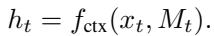
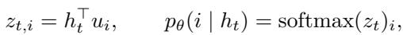
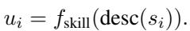
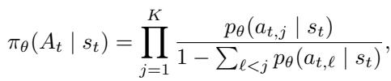

[← 返回 README](../README.md)

# 3. Method

## 📌 预览
完整方法：Overview → Skill Bank → Controller (选 skill) → Executor (执行) → Controller 优化 (PPO) → Designer (进化 skill bank) → 闭环流程。

---

In this section, we first provide an overview of MemSkill (Section 3.1), then detail the skill bank (Section 3.2) and the three core components (controller (Section 3.3.1), executor (Section 3.3.2), and designer (Section 3.4)), and finally summarize the closed-loop optimization procedure that alternates between learning to use the current skills and evolving the skill bank from hard cases (Section 3.5).

> 💡 **Method 结构导览**:
> ```
> 3.1 Overview — 两个交织过程（use skills + evolve skills）
> 3.2 Skill Bank — skill 的结构化定义，初始 4 个原语
> 3.3 Learning to Use Skills
>     3.3.1 Controller — 选 skill（embedding 相似度 + Top-K Gumbel）
>     3.3.2 Executor — 执行 skill（LLM 一次 call）
>     3.3.3 Controller Optimization — PPO + Top-K joint log-prob
> 3.4 Designer — 进化 skill bank（hard cases → analyze → refine/add）
> 3.5 Closed-Loop — 交替训练
> ```

---

## 3.1. Overview

As shown in Figure 2, we propose MemSkill, which optimizes agent memory through two intertwined processes. The first process learns to use a given skill bank: a controller selects a small set of skills conditioned on the context, and an executor applies them to produce memory updates. The second process improves the skill bank itself: a designer periodically revises existing skills and introduces new ones based on challenging cases during training.

> 💡 **两个交织过程**:
> 1. **Use**: Controller 选 skill → Executor 执行 → 构建 memory bank
> 2. **Evolve**: Designer 从 hard cases 中提炼 → 改进/新增 skill
> 
> 这两个过程交替进行，类似 policy iteration 的思想：先固定 skill bank 优化 policy，再固定 policy 改进 skill bank。

---

To disentangle trace-specific memories from reusable memory management knowledge, MemSkill maintains two distinct stores. The memory bank is trace-specific and stores the memories constructed for each training trace (e.g., a long dialogue). In contrast, the skill bank is shared across all traces and contains reusable memory skills. During training, the controller and executor interact with each trace to build its memory bank, while the designer updates the shared skill bank between phases. This alternating procedure gradually improves both the skill selection policy and the skill bank for memory construction.

> 💡 **两个 bank 的区分很重要**:
> - **Memory Bank**（per-trace）：每条对话/轨迹自己的记忆内容，是 "记住了什么"
> - **Skill Bank**（shared）：跨所有 trace 共享的操作知识，是 "怎么记"
> 
> 这个 disentangle 是 MemSkill 设计的精髓：具体 memory 是任务相关的，但 memory 操作策略应该是通用可复用的。

---


*Figure 2. MemSkill architecture overview. Given an interaction trace, MemSkill processes it span by span: the controller selects a Top-K subset of skills from a shared skill bank conditioned on the current text span and retrieved memories, and an LLM executor applies the selected skills in one pass to update the trace-specific memory bank. The constructed memory is then evaluated on memory-dependent training queries to provide task reward for optimizing the controller, while query-centric failures are logged into a sliding hard-case buffer. Periodically, the designer mines representative hard cases to refine existing skills and propose new ones, yielding alternating phases of skill usage and skill evolution. More skill case study can be found in Section 4.5 and Appendix B.*

> 💡 **Figure 2 批读**（核心架构图）:
> 
> 从左到右的数据流：
> 1. **输入**: Interaction Trace 被切成 spans
> 2. **Controller**: 把当前 span + retrieved memories 编码成 state embedding，跟每个 skill 的 embedding 算相似度，Top-K Gumbel 采样选 skill
> 3. **Executor**: 拿选中的 skills + span + memories，一次 LLM call 生成 memory updates（INSERT/UPDATE/DELETE）
> 4. **评估**: 用 training queries 评测 memory bank 质量 → 得到 task reward
> 5. **反馈**: reward → PPO 更新 Controller；失败案例 → hard-case buffer → Designer
> 6. **Designer**: 定期从 buffer 挖代表性 hard cases → 分析 → 改进/新增 skill
> 
> 闭环的关键：Controller 训练 100 步 → 触发一次 Designer 进化 → 继续训练。

---

## 3.2. Skill Bank

As shown in Figure 2, a memory skill specifies a reusable memory operation as structured guidance, including when it is applicable and how it should be applied to the current context. Concretely, each skill $s \in S$ contains (i) a short description used for skill representation and selection, and (ii) a detailed content specification that instructs the executor on how to perform memory extraction or revision.

> 💡 **Skill 的两部分**:
> - **Description**（短描述）：用于 Controller 的 embedding 和选择
> - **Content Specification**（详细规格）：指导 Executor 具体怎么操作
> 
> 这个双层设计很巧：description 是 "名片"（用于匹配），content 是 "操作手册"（用于执行）。

---

We start from a minimal set of general-purpose primitives to ensure a stable and functional initialization. Specifically, we initialize the skill bank with four basic skills corresponding to canonical memory operations: INSERT, UPDATE, DELETE, and SKIP. Starting from this minimal set, the designer progressively refines existing skills and expands the bank by proposing new skills that address uncovered failure modes. (Appendix B details skill description)

> 💡 **初始化策略**: 从最简单的 4 个原语开始（INSERT, UPDATE, DELETE, SKIP），然后让 Designer 逐步进化。
> 
> 这比随机初始化稳健得多——至少保证了基本功能。进化的过程是 **refinement + expansion**：改进已有 skill + 新增 skill。
> 
> 最终在 LoCoMo 上进化出的 skill 包括：Capture Temporal Context、Capture Activity Details、Capture Entity Nuances、Handle Entity Relationships 等（见 Section 4.5），明显比初始 4 个丰富得多。

---

## 3.3. Learning to Use Memory Skills

In this part, we describe how MemSkill learns to use memory skills, covering (i) the skill-selection policy and (ii) skill-conditioned memory construction.

### 3.3.1. CONTROLLER: SKILL SELECTION POLICY

To enable effective skill selection as the skill bank evolves, we introduce a controller that selects a small set of relevant memory skills for the current context. At each memory construction step, we update memory at the span level: we split each interaction trace (e.g., a dialogue) into contiguous text spans and process them sequentially; for each span, the controller conditions its selection on (i) the current text span and (ii) the retrieved existing memories, rather than operating turn by turn.

> 💡 **Span-level 处理**:
> - 不是 per-turn，而是把对话切成连续 text spans（训练时以 session 为单位，评估时 512 tokens）
> - 每个 span 的输入：当前文本 + 检索到的已有 memory
> - 好处：减少 LLM 调用次数，更适合长历史

---

To remain compatible with a variable-size skill bank as it continuously evolves, the controller scores each skill by measuring the semantic distance between the current state representation and the skill representation, which naturally supports a changing set of skills while staying sensitive to what is already stored in memory.

> 💡 **关键设计决策**: 用 embedding 相似度打分而非固定 action head。
> 这样 skill bank 大小变化时不需要改网络结构——新增 skill 只要算一个新 embedding 就能参与选择。这是支持 evolving skill bank 的基础。

---

**State representation.** Formally, let $x_t$ denote the current text span at step $t$, and let $M_t = \{ m_{t,1}, \dots, m_{t,R} \}$ be the retrieved memories from the current trace's memory bank. The controller encodes $(x_t, M_t)$ into a state embedding:



**Skill representation.** For each skill $s_i \in S_t$ in the current skill bank, we compute a skill embedding from its description, as it provides a focused semantic signal that is more stable than embedding the full skill content.

> 💡 **只用 description 做 embedding**: 不用完整 content specification，因为 description 更短更稳定，语义信号更集中。content specification 太长可能引入噪声。

---

**Compatibility with an evolving skill bank.** Instead of producing a fixed-dimensional action head tied to a fixed number of skills, the controller scores each skill by comparing state and skill embeddings:



Note that we use the same embedding model for $f_{\text{ctx}}$ and $f_{\text{skill}}$, mapping contexts and skill descriptions into a shared representation space for scoring.



where $z_t \in \mathbb{R}^{|S_t|}$ adapts automatically as the skill bank evolves.

> 💡 **Controller 的数学形式**:
> - State embedding $h_t$：把 (text span, retrieved memories) 编码
> - Skill embedding $u_i$：把 skill description 编码
> - 相似度打分：$z_{t,i} = h_t^\top u_i$，然后 softmax 得到概率分布
> - 共享 encoder：state 和 skill 用同一个 embedding model（Qwen3-Embedding-0.6B）
> 
> 这本质上是一个 **dual encoder** 架构，跟 CLIP 的思路类似——把 context 和 skill 映射到同一空间。

---

**Top-$K$ skill selection.** Given the categorical distribution $p_\theta(i \mid h_t)$ over the current skill bank $S_t$, the controller selects an ordered Top-$K$ set of skills $A_t = (a_{t,1}, \dotsc, a_{t,K})$ without replacement (e.g., via Gumbel-Top-$K$ (Kool et al., 2019)), and only passes the selected skills to the executor, keeping the skill context concise and relevant.

> 💡 **Top-K Gumbel 采样**:
> - 不是选 1 个 skill，而是选 K 个（训练时 K=3，评估时对话 K=7，ALFWorld K=5）
> - 使用 Gumbel-Top-K trick（Kool et al., 2019）：在 logits 上加 i.i.d. Gumbel noise，取 top-K
> - **Without replacement**：不重复选
> - 好处：组合多个 skill 处理同一个 span，比单 skill 更灵活
> 
> 为什么评估时 K 比训练时大？因为评估时 span 更长（512 tokens vs. session-level），需要更多 skill 覆盖不同信息类型。

---

### 3.3.2. EXECUTOR: SKILL-CONDITIONED MEMORY EXTRACTION

Given the selected skills $A_t$, the executor (fixed) constructs memory updates by conditioning an LLM on (i) the current text span $x_t$, (ii) the retrieved memory items $M_t$, and (iii) the selected skills $A_t$. This mirrors skill-conditioned inference in agent systems, where a small set of relevant skills is provided to guide behavior for the current context. The executor then produces memory updates in a structured format, which are parsed and applied to update the trace's memory bank. By composing several skills for the same text span and extracting memory in one LLM call, MemSkill reduces repeated per-turn processing and makes memory construction easier to scale to long interaction histories. Appendix C details the complete executor prompt.

> 💡 **Executor 设计要点**:
> 1. **固定不训练**：Executor 就是一个 LLM（LLaMA-3.3-70B），不参与 RL 训练
> 2. **一次 call**：把选中的 skills 全部塞进 prompt，一次性生成所有 memory actions
> 3. **结构化输出**：生成 INSERT/UPDATE/DELETE 动作块，可解析执行
> 
> 从 Appendix C 的 prompt 可以看到，Executor prompt 包括：text span + retrieved memories + selected skills + output format 说明。非常标准的 tool-use 模式。
> 
> **关键权衡**：Executor 不训练意味着它的能力完全依赖 base LLM + prompt quality。但好处是避免了同时训练 Controller 和 Executor 的复杂性。

---

### 3.3.3. CONTROLLER OPTIMIZATION

We train the controller with reinforcement learning, using downstream task performance as feedback for its skill selections. For each training trace, the controller makes a sequence of Top-$K$ selections while the executor incrementally builds the trace-specific memory bank. After construction, we evaluate the resulting memory bank on the trace's memory-dependent training queries and use the resulting task performance as the reward (e.g., F1 or success rate).

> 💡 **奖励信号**: 用下游任务表现（F1 或 success rate）作为 reward。这是 episode-level reward——整个 trace 处理完后才得到奖励，中间步骤没有即时反馈。这跟 Mem-α 的思路一致。

---

A key technical detail is that the controller's action is an ordered Top-$K$ set selected without replacement, rather than a single discrete action. We therefore compute the joint logprobability $\log \pi_\theta(A_t \mid s_t)$ under the without-replacement selection process and use it in standard policy-gradient style objectives via importance weighting and clipping. Concretely, the joint probability can be written as



which reduces to the usual single-action case when $K = 1$. Appendix A.4 provides implementation details.

> 💡 **Top-K 联合概率**:
> 这是方法的一个技术亮点。因为选的是 ordered Top-K without replacement，所以联合概率是一个 **条件乘积**：
> 
> $\pi_\theta(A_t|s_t) = \prod_{j=1}^{K} \frac{p_\theta(a_{t,j}|s_t)}{1 - \sum_{\ell < j} p_\theta(a_{t,\ell}|s_t)}$
> 
> 每选一个 skill，分母要去掉已选 skill 的概率质量（because without replacement）。
> 
> 把这个 joint log-prob 代入 PPO 的 importance ratio 就能正常训练了。K=1 时退化为标准 single-action PPO。
> 
> **实现细节**（Appendix A.4）：
> - 用 GAE 计算 advantage
> - Reward 只在 episode 结束时给（$r_T = R$，其他步为 0）
> - 有 entropy bonus 鼓励探索

---

## 3.4. Skill Evolution through Designer Feedback

Beyond learning to select from a fixed set of skills, MemSkill evolves the skill bank using an LLM-based designer (fixed) that operates periodically during training.

> 💡 **Designer 也是固定 LLM**，跟 Executor 一样不训练。所以 MemSkill 唯一训练的组件就是 Controller（一个轻量 MLP）。

---

**Hard-case buffer.** During controller training, we maintain a sliding-window buffer of challenging cases observed recently. Each case is query-centric, recording the query along with its ground-truth and metadata (e.g., retrieved memories and model prediction), as well as summary statistics such as task performance and the number of failures observed so far. The buffer uses two expiration rules: cases are removed if they become too old (exceeding a maximum training step gap) or if the buffer reaches its capacity limit, which tracks recent failure patterns without growing unbounded.

> 💡 **Hard-case buffer 设计**:
> - **Query-centric**：以查询为中心记录失败案例（不是以 span 为中心）
> - **Sliding window**：两种过期规则 —— 太旧的删、满了也删
> - 记录内容：query + ground truth + retrieved memories + prediction + 任务分数 + 失败次数
> 
> 这个 buffer 就像一个 "错题本"，记录系统最近犯的错。

---

**Selecting representative hard cases.** To focus designer updates on impactful failures, we cluster cases (e.g., KMeans) into groups that naturally reflect different query or error types. Within each cluster, we prioritize representative cases using a difficulty score that increases when task performance is low and when the same case fails repeatedly. This produces a compact set of high-value cases for skill evolution while preserving diversity across error types.

> 💡 **代表性案例挖掘**:
> 1. **聚类**（KMeans）：按 query 语义相似度分组，保证 error types 的多样性
> 2. **难度评分**：$d(q) = (1 - r(q)) \cdot c(q)$，其中 $r(q)$ 是 reward，$c(q)$ 是失败次数
> 3. 每个 cluster 选最难的案例给 Designer
> 
> 例如在 LoCoMo 上，有些失败是关于时间信息的（"什么时候发生的"），有些是关于地点的（"在哪里"），聚类能把它们分开，避免 Designer 只关注一种类型。

---

**Two-stage skill evolution.** The designer updates the skill bank in two stages. First, it employs an LLM to analyze the selected hard cases and identify what memory behaviors are missing or mis-specified. Second, it uses the resulting analysis to propose concrete edits to existing skills and to introduce new skills. We keep the designer description concise here and provide prompt details in Appendix C.

> 💡 **两阶段进化**:
> 1. **分析阶段**：LLM 分析 hard cases → 识别 failure patterns（storage failure / retrieval failure / memory quality failure）
> 2. **提案阶段**：根据分析结果 → 修改已有 skill / 新增 skill
> 
> 从 Appendix C 的 prompt 可以看到，分析输出是结构化 JSON（failure_patterns + recommendations），提案也是 JSON（add_new / refine_existing）。每轮最多 3 个修改。

---

Notably, we maintain snapshots of the best-performing skill bank and roll back if an update degrades performance, with early stopping when repeated designer updates fail to improve the training signal. After each evolution step, we also briefly increase exploration by biasing selection toward newly introduced skills, encouraging the controller to try them and facilitating efficient learning of their utility. More details about the designer can be found in Appendix A.2.

> 💡 **三个保护机制**:
> 1. **Snapshot + rollback**: 保存最好的 skill bank 快照，如果进化后变差就回滚
> 2. **Early stopping**: 连续几轮没有改进就停止
> 3. **Exploration incentive**: 进化后对新 skill 加 logit bias，鼓励 Controller 尝试新 skill
> 
> Exploration incentive 的具体做法（Appendix A.2）：给新 skill 的 logit 加一个 $\delta_t$，使新 skill 的总概率 ≥ $\tau_t$（初始 0.3，线性衰减到 0，50 步内完成）。这避免了新 skill 因为 Controller 没学过而永远选不到的 "冷启动" 问题。

---

## 3.5. Closed-Loop Optimization

MemSkill alternates between (i) learning to select and apply skills to build memory banks and (ii) evolving the skill bank based on hard cases mined from recent training steps. Each cycle begins with controller training on the current skill bank, during which the executor constructs memories and the system accumulates challenging cases. The designer then updates the skill bank using representative hard cases, optionally rolling back to a prior snapshot if the update regresses. The next cycle resumes controller training on the updated skill bank, with additional exploration to encourage early use of new skills. Through repeated cycles, MemSkill progressively improves both skill usage and the skill bank available for memory construction.

> 💡 **完整闭环流程**:
> ```
> 初始化: Skill Bank = {INSERT, UPDATE, DELETE, SKIP}
> 
> 循环 {
>   Phase 1: Controller 训练 100 步
>     - 每步: Controller 选 skill → Executor 执行 → 更新 memory bank
>     - 评估: memory bank 上做 QA → 得到 reward
>     - PPO 更新 Controller
>     - 失败案例 → hard-case buffer
>   
>   Phase 2: Designer 进化
>     - 聚类 hard cases → 选代表性案例
>     - LLM 分析 failure patterns
>     - 提出 skill 修改/新增（最多 3 个）
>     - 如果新 skill bank 更差 → rollback
>   
>   Phase 3: 继续训练
>     - 新 skill 加 exploration incentive（50 步衰减）
>     - 继续 Phase 1
> }
> 
> 终止: early stopping 或训练完成
> 输出: best skill bank + trained Controller
> ```
> 
> 这个流程跟 NAS + fine-tune 的范式很像，只不过搜的是 skill 而非架构。

---

## 🔖 Section 总结

### 核心架构
| 组件 | 类型 | 功能 | 是否训练 |
|------|------|------|----------|
| Controller | MLP | 选 Top-K skill | ✅ PPO |
| Executor | LLM (70B) | 执行 skill 生成 memory | ❌ 固定 |
| Designer | LLM | 进化 skill bank | ❌ 固定 |
| Skill Bank | 结构化文本 | 存储可复用操作 | 进化（非梯度） |

### 关键数字
| 参数 | 值 |
|------|-----|
| 初始 skill 数 | 4 (INSERT/UPDATE/DELETE/SKIP) |
| 训练 K | 3 |
| 评估 K (对话) | 7 |
| 评估 K (ALFWorld) | 5 |
| Designer 触发间隔 | 100 步 |
| 每轮最多修改 | 3 个 skill |
| Exploration incentive | 50 步, τ₀=0.3 |
| Embedding model | Qwen3-Embedding-0.6B |
| Retriever | Contriever |

### 核心洞察
1. **唯一训练的是 Controller（轻量 MLP）**，其他全用固定 LLM
2. **Dual encoder 打分**支持 variable-size skill bank
3. **Top-K Gumbel + without-replacement joint prob** 是技术亮点
4. **三重保护**（snapshot/rollback/early stopping）防止进化倒退
5. **Span-level 处理**大幅减少 LLM 调用量
