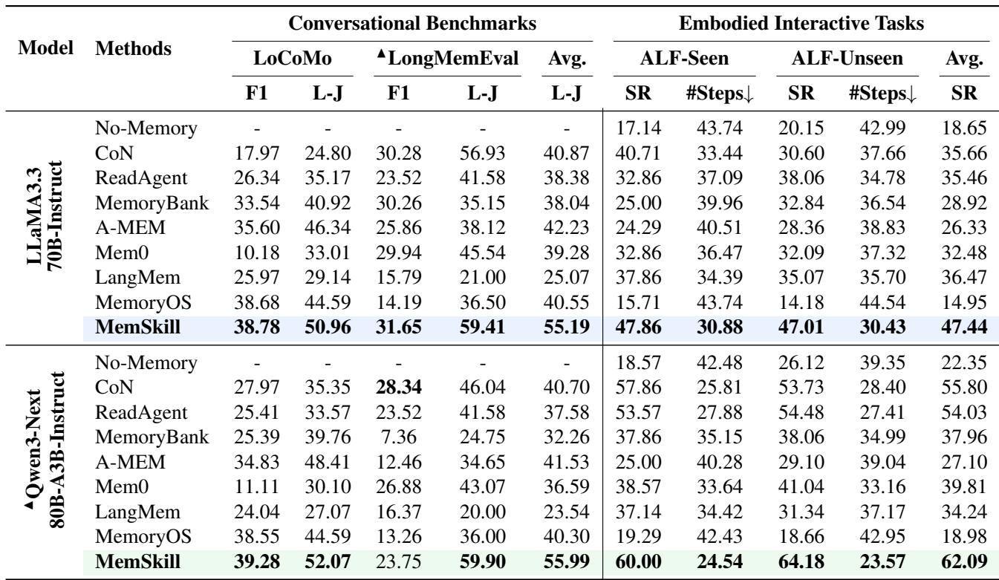
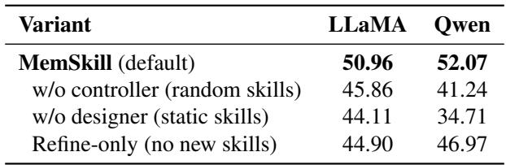

[← 返回 README](../README.md)

# 4. Experiments

## 📌 预览
四个 benchmark（LoCoMo, LongMemEval, HotpotQA, ALFWorld）验证 MemSkill 的有效性、泛化性和可解释性。

---

## 4.1. Experiment Setup

**Datasets and Baselines.** We evaluate MemSkill on four benchmarks: LoCoMo (Maharana et al., 2024), LongMemEval (Wu et al., 2024), HotpotQA (Yang et al., 2018), and ALFWorld (Shridhar et al., 2020), where HotpotQA is used in Section 4.4 to study skill transfer under distribution shift. The remaining three benchmarks cover two representative settings. (i) Conversational Benchmarks include LoCoMo and LongMemEval, which evaluate memory construction from long, dialogue-style interaction histories. For these datasets, we report F1-score (F1) and an LLM-based judge score (L-J). (ii) Embodied Interactive Tasks are evaluated on ALFWorld with two standard subsets, ALF-Seen and ALF-Unseen, and we report success rate (SR) and the number of environment interaction steps (#Steps). Specific dataset splits are provided in Appendix A.1.

> 💡 **数据集选择策略**:
> | 数据集 | 类型 | 用途 | 指标 |
> |--------|------|------|------|
> | LoCoMo | 长对话 | 主训练 + 评估 | F1, L-J |
> | LongMemEval | 超长对话(~100K tokens) | **迁移评估**（用 LoCoMo 训的 skill） | F1, L-J |
> | HotpotQA | 多跳问答(文档拼接) | 分布偏移迁移 | L-J |
> | ALFWorld | 具身交互 | 独立训练 + 评估 | SR, #Steps |
> 
> 注意 LongMemEval 是**纯迁移**——直接用 LoCoMo 训练的 skill bank，不做额外训练。

---

We compare MemSkill against several strong baselines: (1) No-Memory, which answers directly without an external memory (or additional constructed context); (2) Chain-of-Notes (CoN) (Yu et al., 2024); (3) ReadAgent (Lee et al., 2024); (4) MemoryBank (Zhong et al., 2024); (5) A-MEM (Xu et al., 2025); (6) Mem0 (Chhikara et al., 2025); (7) LangMem (LangChain, 2025); and (8) MemoryOS (Kang et al., 2025). Overall, this setup spans diverse benchmarks and baselines, enabling a broad and consistent comparison across diverse settings.

> 💡 **Baseline 分类**:
> - **无 memory**: No-Memory
> - **检索增强**: CoN, ReadAgent
> - **Memory 系统**: MemoryBank, A-MEM, Mem0, LangMem, MemoryOS
> 
> 注意没有对比 Memory-R1 和 Mem-α，虽然在 Related Work 里提了。可能是因为这两个是 concurrent work 且代码/结果不完全公开。

---

**Implementation Details.** We initialize the controller as a lightweight multilayer perceptron (MLP), and use LLaMA3.3-70B-Instruct (Grattafiori et al., 2024) and Qwen3-Next80B-A3B-Instruct (Yang et al., 2025) as the base LLMs, accessed through an API service. Unless otherwise specified, we train MemSkill on LLaMA and use Qwen only for transfer experiments. LongMemEval is also evaluated in a transfer setting, where we directly apply the skills learned on LoCoMo without further training.

> 💡 **两个 base LLM**:
> - **LLaMA3.3-70B**: 主训练模型
> - **Qwen3-Next80B-A3B**: 仅用于迁移实验（MoE 模型，80B 总参、3B 激活）
> 
> Controller 是轻量 MLP，训练成本很低。主要成本在 Executor 的 LLM 调用上。

---

For both MemSkill and all baselines, we retrieve up to 20 memory items for a consistent comparison. During training, we initialize the controller optimization with PPO (Schulman et al., 2017). MemSkill performs memory construction at the span level. On conversational benchmarks, we treat each dialogue session as the basic processing unit during training, and the controller selects a small set of skills per unit with $K{=}3$. We use Qwen3-Embedding-0.6B (Yang et al., 2025) as the shared encoder for state and skill representations, and adopt Contriever (Izacard et al., 2021) as the default memory retriever. For the designer, we trigger skill evolution every 100 training steps and allow at most 3 skill edits per evolution round. For ALFWorld, we cap the maximum environment interaction length to 50 steps.

At evaluation time, we keep the same span-level formulation and set the span/chunk size to 512 by default, while keeping the overall procedure unchanged. Unless otherwise specified, we use $K{=}7$ skills for LoCoMo and LongMemEval at evaluation time, and $K{=}5$ for ALFWorld. Additional implementation details and prompt templates are provided in Appendix A and Appendix C.

> 💡 **关键实现细节汇总**:
> | 参数 | 值 |
> |------|-----|
> | Memory retrieval 数量 | 20 items |
> | 训练 K | 3 |
> | 评估 K (对话) | 7 |
> | 评估 K (ALFWorld) | 5 |
> | Span size (评估) | 512 tokens |
> | Embedding model | Qwen3-Embedding-0.6B |
> | Retriever | Contriever |
> | Designer 间隔 | 100 步 |
> | 每轮最多修改 | 3 个 skill |
> | ALFWorld 最大交互 | 50 步 |
> | LLM Judge | openai/gpt-oss-120b |

---

## 4.2. Comparison Experiments

**Effectiveness across conversational and embodied settings.** Table 1 summarizes the main comparison results on LoCoMo, LongMemEval, and ALFWorld. Across these datasets, MemSkill achieves the strongest overall performance among all compared methods. On conversational benchmarks, MemSkill attains the best LLM-judge scores on both LoCoMo and LongMemEval within each basemodel block, indicating higher-quality constructed memories. In comparison, prior methods such as MemoryBank, A-MEM, and MemoryOS use fixed, manually specified memory procedures for extraction and revision, whereas MemSkill learns and evolves its skills from interaction, enabling better adaptation across contexts. On ALFWorld, MemSkill achieves the highest success rates on both seen and unseen splits, indicating that skill-guided memory construction can benefit interactive decision making, whereas other baselines are less reliable at leveraging memory to support long-horizon action execution. Overall, the results show that MemSkill is effective across diverse settings.

> 💡 **Table 1 核心发现**: MemSkill 在所有 benchmark 上都是最好的，尤其是：
> - **LoCoMo L-J**: 50.96 (LLaMA) / 52.07 (Qwen)，比第二名 A-MEM 的 46.34/48.41 高出 ~4 分
> - **LongMemEval L-J**: 59.41 / 59.90，大幅领先（CoN 56.93 是第二，但那是 LLaMA block 的）
> - **ALFWorld SR**: 47.44 (LLaMA) / 62.09 (Qwen)，远超其他方法
> 
> 注意 MemoryOS 在 ALFWorld 上特别差（14.95/18.98），说明固定 pipeline 在具身任务上不适用。

---

*Table 1. Main comparison results on LoCoMo, LongMemEval, and ALFWorld. Bold indicates the best score within each base model block. ▲ indicates no training using this base model or dataset (transfer evaluation only).*

> 💡 **Table 1 批读**:
> 
> 几个关键观察：
> 1. **MemSkill 全面领先**：在 LLaMA 和 Qwen 两个 block 都是最好的
> 2. **跨模型泛化**：MemSkill 只在 LLaMA 上训练，直接迁移到 Qwen（标 ▲），表现反而更好（52.07 vs 50.96 on LoCoMo）。说明 skill 捕获的是通用 memory 行为，不依赖特定 LLM
> 3. **ALFWorld 优势巨大**：Qwen block 上 MemSkill SR=62.09，第二名 CoN 只有 55.80
> 4. **MemoryOS 的反面教材**：在 LoCoMo 上还行（44.59），但 LongMemEval 和 ALFWorld 上崩了，说明其固定 pipeline 泛化性差
> 5. **LongMemEval 是纯迁移**：MemSkill 没有在 LongMemEval 上训练，直接用 LoCoMo 的 skill，L-J 达到 59.41/59.90

---

**Generalization across base models.** A key advantage of MemSkill is strong generalization across base models. We train MemSkill only with LLaMA and directly transfer the learned skills to Qwen without retraining. Despite this strict transfer setting, MemSkill remains highly competitive and continues to outperform strong baselines on both conversational and embodied evaluations, demonstrating that the evolved skills capture reusable memory behaviors that can be instantiated by different underlying LLMs.

> 💡 **跨模型泛化是个很强的 claim**: skill bank 是纯文本（结构化 prompt），不依赖特定模型的权重或 token 空间。所以理论上任何足够强的 LLM 都能当 Executor 执行这些 skill。Controller 的 embedding 用的 Qwen3-Embedding-0.6B 也是独立于 base LLM 的。

---

**Cross-dataset transfer.** MemSkill also generalizes across datasets within the same broad setting. In particular, LongMemEval is evaluated purely by transferring the skill bank learned on LoCoMo, yet MemSkill achieves the best results among all methods, suggesting that the learned skills are not overfit to a single benchmark. We further study transfer under more pronounced distribution shifts in Section 4.4.

---

## 4.3. Ablation Study

We perform ablations to disentangle the contributions of (i) learning to select skills and (ii) evolving the skill bank. Table 2 reports LLM Judge (L-J) results on LoCoMo under both base models (LLaMA and Qwen). As shown, w/o controller (random skills) replaces the learned controller with random skill selection while keeping the rest of the pipeline unchanged. w/o designer (static skills) disables the designer and fixes the skill bank to the four initial primitives. Refine-only (no new skills) allows the designer to refine existing skills but prohibits adding new ones.

Across both base models, removing either component consistently degrades performance, confirming that MemSkill benefits from both targeted skill selection and skill evolution. In particular, random skill selection leads to a clear drop from the default setting, highlighting the importance of learning to choose relevant skills rather than providing arbitrary ones. Disabling the designer yields an even larger degradation, especially under Qwen, suggesting that evolving the skill bank is important for learning reusable memory behaviors that generalize beyond a fixed, manually specified operation set. Finally, refinement-only consistently outperforms static skills on both LLaMA and Qwen, with a particularly large gain under Qwen, yet remains below the default setting, indicating that introducing new skills yields additional benefits beyond refining the initial primitives.

*Table 2. Ablation study on LoCoMo using L-J metric.*

> 💡 **Table 2 批读 — Ablation 结果非常清晰**:
> 
> | 变体 | LLaMA | Qwen | 说明 |
> |------|-------|------|------|
> | MemSkill (full) | 50.96 | 52.07 | 基线 |
> | w/o controller (random) | 45.86 | 41.24 | -5.1 / -10.8 |
> | w/o designer (static) | 44.11 | 34.71 | -6.9 / -17.4 |
> | Refine-only | 44.90 | 46.97 | -6.1 / -5.1 |
> 
> **核心发现**:
> 1. **Designer 比 Controller 更重要**：去掉 Designer 的 drop 更大（尤其 Qwen: -17.4 vs -10.8）
> 2. **新增 skill > 仅 refine**：Refine-only vs static 有提升，但 full 版本更好
> 3. **Qwen 对 skill 质量更敏感**：在 Qwen 上，static skills 只有 34.71（vs LLaMA 44.11），说明 Qwen 更依赖好的 skill 引导
> 
> 这说明进化 skill bank（尤其是新增 skill）是性能提升的主要来源，Controller 的 skill 选择是第二贡献。

---

## 4.4. Skill Generalization Under Distribution Shift

Beyond transfer within dialogue-style memory benchmarks, we evaluate whether learned skills generalize under a distribution shift in interaction format and evidence structure. Concretely, we directly apply the skill bank trained on LoCoMo to HotpotQA, where inputs are long-form, documentstyle narratives rather than multi-turn dialogues. Following the evaluation protocol in (Yu et al., 2025), we test three context-length settings with increasing difficulty, corresponding to different numbers of concatenated documents (i.e., 50/100/200). All results in this section use LLaMA as the base model and report the LLM-judge score (L-J). For baselines, we include MemoryOS and A-MEM, which are the most competitive methods on conversational benchmarks in Table 1, and omit weaker alternatives for clarity.

> 💡 **分布偏移实验设置**: 从对话（LoCoMo）迁移到文档问答（HotpotQA），格式完全不同。这是对 skill 通用性的最强测试。

---

*Figure 3. Skill generalization under distribution shift on HotpotQA. We transfer the LoCoMo-trained skill bank to HotpotQA and evaluate three context-length settings (50/100/200 concatenated documents) following (Yu et al., 2025). Bars show LLM-judge (L-J) under LLaMA with different Top-K skill counts, compared to MemoryOS and A-MEM.*

> 💡 **Figure 3 批读**:
> 
> 三个子图分别对应 50/100/200 documents 的拼接。关键发现：
> 1. **MemSkill 在所有 context 长度下都超过 baseline**，且长 context 优势更大
> 2. **K=7 最好**：选更多 skill 在长 context 下更有用（more info types to handle）
> 3. **200 docs 设置下差距最大**：MemSkill (K=7) vs MemoryOS 差距约 5+ 分
> 
> 这说明 LoCoMo 上学到的 skill（如 Capture Temporal Context、Capture Activity Details）在文档问答中也有用——因为它们捕获的是通用的信息提取模式，不是对话特有的。

---

Figure 3 shows that MemSkill transfers strongly to HotpotQA across all three context sizes. In particular, MemSkill consistently outperforms strong baselines such as MemoryOS and A-MEM, with the gains becoming more pronounced in the more challenging long-context setting. These results suggest that the learned memory skills are not tied to dialogue-specific surface forms, but capture reusable extraction and revision behaviors that remain effective when the input structure and retrieval demands change.

The same plots also reveal mild sensitivity to the number of selected skills $K$. Increasing $K$ generally improves performance, with $K{=}7$ achieving the best results across all three settings, while smaller $K$ can under-utilize the skill bank under longer contexts. Overall, the trend indicates that MemSkill benefits from composing multiple skills when the context becomes longer and noisier, while still maintaining strong transfer without any HotpotQA-specific training.

---

## 4.5. Case Study

To make MemSkill more interpretable, we inspect the final evolved skill bank and report representative skills learned from LoCoMo and ALFWorld. As shown in Figure 4, the learned skills exhibit clear domain specialization across LoCoMo and ALFWorld. For LoCoMo, the skills in Figure 4 emphasize temporal context and activity details, suggesting that effective dialogue memory often benefits from organizing events with lightweight structure, such as who did what, where, and when, across long interactions. More broadly, the evolved skill bank reflects recurring information needs surfaced by the data, rather than a single fixed notion of what should be remembered. In contrast, the ALFWorld skills focus on action constraints and object locations, highlighting that embodied success depends on maintaining an actionable world state summary, including task-relevant preconditions rather than broad narrative summaries, to support multi-step execution.

> 💡 **Case Study 是论文最有洞察力的部分之一**:
> 
> **LoCoMo 进化出的 skill**（对话记忆）：
> - Capture Temporal Context — 捕获时间线索（日期/时长/顺序）
> - Capture Activity Details — 活动详情（类型/地点/参与者/时间）
> - Capture Entity Nuances — 实体细节（昵称/别名/对比）
> - Handle Entity Relationships — 实体间关系
> - Refine Temporal Details with Context — 更新时间信息
> 
> **ALFWorld 进化出的 skill**（具身任务）：
> - Capture Action Constraints — 动作约束（物体状态/移动）
> - Track Object Location — 物体位置追踪
> - Track Object Movements — 物体移动追踪
> 
> 这说明 MemSkill 能**自动从数据中发现领域特有的记忆需求**。
> 对话场景需要记 "什么时候、谁做了什么"，具身场景需要记 "什么东西在哪里、能不能用"。
> 
> 这些 skill 也解释了为什么 MemSkill 能跨数据集迁移——"Capture Temporal Context" 在任何需要时间推理的任务上都有用。

---

Taken together, these skills illustrate how MemSkill can automatically distill reusable memory behaviors from interaction data and continually refine them through training, moving toward a more adaptive memory system with reduced reliance on hand-crafted memory designs. Additional evolved skills are provided in Appendix B.

---

## 🔖 Section 总结

### 关键数字速查
| 指标 | MemSkill (LLaMA) | MemSkill (Qwen) | 最强 Baseline |
|------|-------------------|------------------|---------------|
| LoCoMo L-J | 50.96 | 52.07 | A-MEM 48.41 |
| LongMemEval L-J | 59.41 | 59.90 | CoN 56.93 |
| ALF-Seen SR | 47.86 | 60.00 | CoN 57.86 |
| ALF-Unseen SR | 47.01 | 64.18 | CoN 53.73 |

### 核心洞察
1. **全面领先**：MemSkill 在 4 个 benchmark、2 个 base model 上都是 SOTA
2. **跨模型泛化**：LLaMA 训练的 skill 直接迁移到 Qwen，表现持平甚至更好
3. **跨数据集泛化**：LoCoMo skill → LongMemEval/HotpotQA 都有效
4. **Designer 是关键**：ablation 显示 skill 进化（尤其新增 skill）是最大贡献源
5. **领域自适应**：进化出的 skill 自动适配对话 vs 具身场景的不同需求
