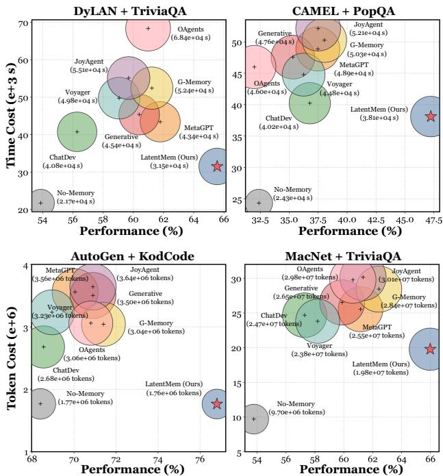
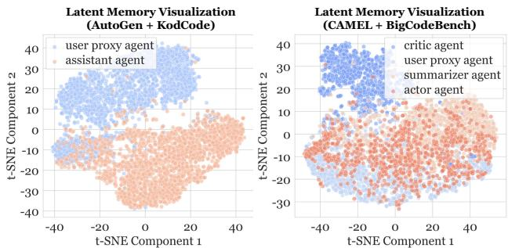
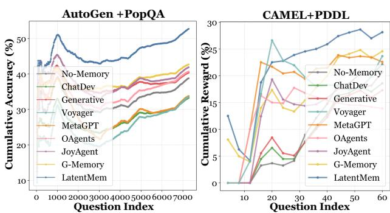
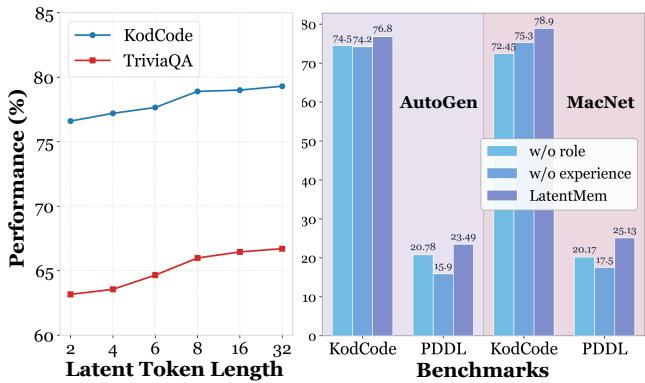
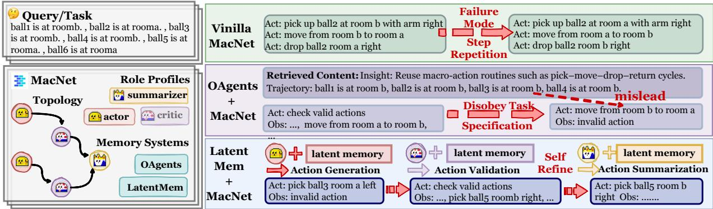
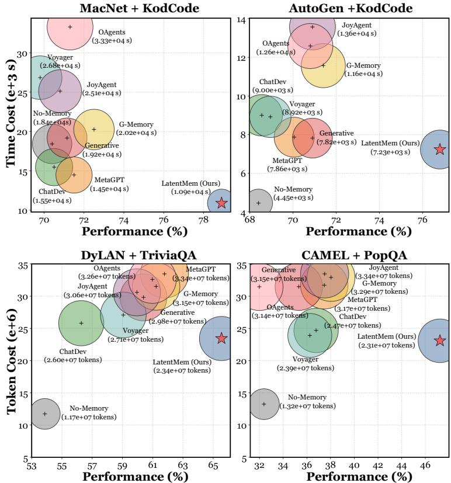
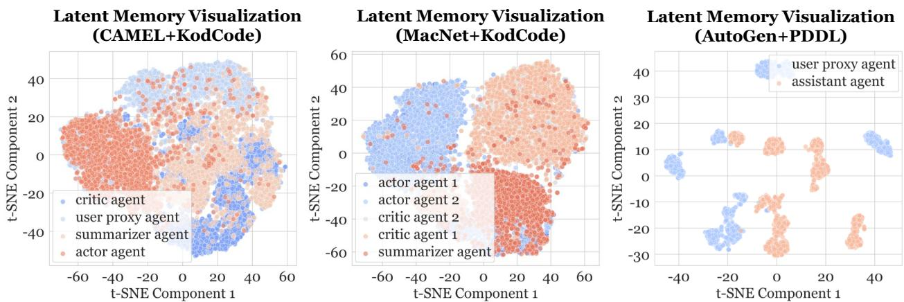
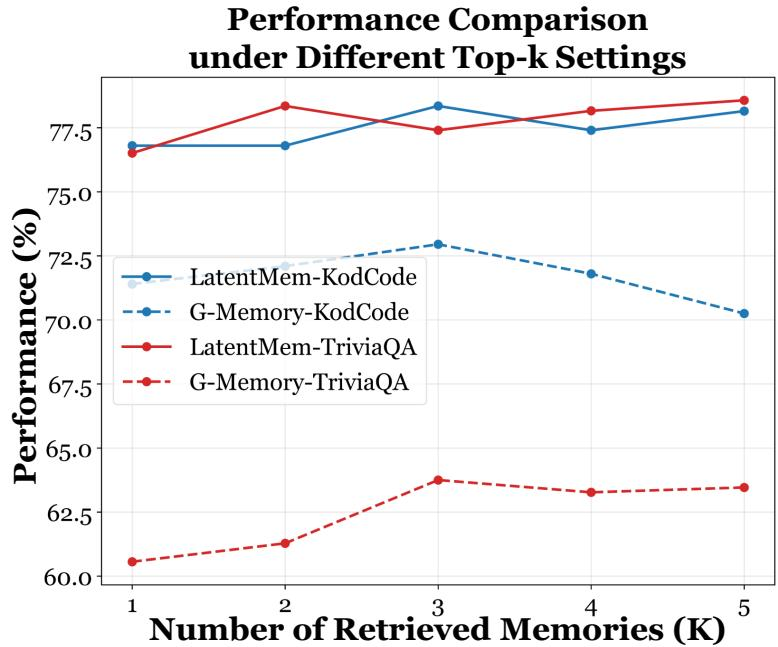

# LatentMem: Customizing Latent Memory for Multi-Agent Systems

Muxin $\mathbf { F u } ^ { 1 , 2 , * }$ , Guibin Zhang3,∗, Xiangyuan Xue4, Yafu $\mathbf { L i } ^ { 4 }$ , Zefeng $\mathbf { H e } ^ { 5 }$ , Siyuan Huang6, Xiaoye $\mathbf { Q } \mathbf { u } ^ { 2 \ddag }$ , Yu Cheng4‡, Yang Yang6‡

1Tongji University 2Shanghai AI Laboratory 3National University of Singapore   
4The Chinese University of Hong Kong 5Nanjing University 6Shanghai Jiao Tong University

$\approx$ boonkana10@gmail.com, guibinz@outlook.com $^ *$ Equal Contribution ‡ Corresponding Author.

§ https://github.com/KANABOON1/LatentMem

Abstract Large language model (LLM)-powered multi-agent systems (MAS) demonstrate remarkable collective intelligence, wherein multi-agent memory serves as a pivotal mechanism for continual adaptation. However, existing multi-agent memory designs remain constrained by two fundamental bottlenecks: (i) memory homogenization arising from the absence of role-aware customization, and (ii) information overload induced by excessively fine-grained memory entries. To address these limitations, we propose LatentMem, a learnable multi-agent memory framework designed to customize agent-specific memories in a token-efficient manner. Specifically, LatentMem comprises an experience bank that stores raw interaction trajectories in a lightweight form, and a memory composer that synthesizes compact latent memories conditioned on retrieved experience and agent-specific contexts. Further, we introduce Latent Memory Policy Optimization (LMPO), which propagates task-level optimization signals through latent memories to the composer, encouraging it to produce compact and high-utility representations. Extensive experiments across diverse benchmarks and mainstream MAS frameworks show that LatentMem achieves a performance gain of up to $1 9 . 3 6 \%$ over vanilla settings and consistently outperforms existing memory architectures, without requiring any modifications to the underlying frameworks.

# 1. Introduction

Large Language Model (LLM)-powered multiagent systems (MAS), have emerged as a powerful framework for solving complex tasks by allowing agents to collaborate [Ye et al., 2025, Yue et al., 2025, Zhang et al., 2024a] or compete [Yang et al., 2025b, Zhang et al., 2024c] beyond the capabilities of individual LLM agents. Pivotal to this success is the concept of multiagent memory [Hu et al., 2025, Wu et al., 2025b], which enables agents to accumulate, retain, and reuse experiences through interactions with both other agents and the environment, thereby supporting more coherent coordination and continual adaptation.

  
Figure 1 | The paradigm comparison between existing multi-agent memory and LatentMem. Instead of relying on handcrafted memory units, LatentMem extracts agent-specific memories from the latent space by combining raw trajectories with agent profiles.

Building on this memory foundation, recent studies have increasingly explored multi-granularity memory repositories that capture experiences at different levels of abstraction, including (i) MAS trajectories [Qian et al., 2024b, Wang and Chen, 2025], (ii) distilled semantic insights [Liu et al., 2025, Zhu et al., 2025], and (iii) orchestrable skill schemas [Han et al., 2025, Zhang et al., 2025d]. These designs endow memory systems with the ability to capture diverse memory patterns, such as trajectory summarization and high-level insight extraction, enabling MAS to adaptively integrate past experiences and jointly refine decision-making strategies [Tomilin et al., 2025, Zheng et al., 2026].

However, despite the growing sophistication of existing memory systems, they remain constrained by two key limitations: (i) Memory homogenization: Most methods adopt a one-size-fits-all strategy, ignoring the functional heterogeneity of agents, which undermines role adherence and amplifies correlated errors [Cemri et al., 2025], weakening system robustness and hindering long-term adaptation. (ii) Information overload: MAS inherently involves long interaction contexts [Zhang et al., 2024a], and multi-granularity memory designs further amplify this burden by introducing large volumes of stored entries [Wang and Chen, 2025, Zhang et al., 2025a], ultimately overwhelming agents and obscuring critical decision signals. Given the aforementioned challenges, a natural question arises:

Given long and complex contexts in MAS, can we design a learnable memory that is both role-aware and token-efficient, without extensive manual engineering?

To address these challenges, we propose LatentMem, a latent multi-agent memory framework that materializes agent-aware memory customization via token-efficient latent memory generation. Specifically, LatentMem consists of two components: a lightweight experience bank for storing and retrieving raw MAS trajectories, and a memory composer that leverages agent profiles to distill raw trajectories into role-aware, compact latent memories and integrate them into the agents’ reasoning process. To encourage the memory composer to distill transferable, high-utility latent representations from raw trajectories, we propose Latent Memory Policy Optimization (LMPO), which computes advantages from relative rewards within multi-agent rollouts, optimizes token-level objectives, and exploits latent memory differentiability to enable gradient backpropagation through the memory composer.

As a novel attempt in latent MAS memory, LatentMem offers three principal advantages: (I) It conditions the memory composer on agent role profiles to customize role-aware latent memories, thereby mitigating memory homogenization; (II) It encodes multi-agent memory as fixed-length latent representations rather than unbounded discrete textual traces, thereby mitigating information overload; (III) It exploits LMPO and latent memory differentiability to enable autonomous memory internalization and reconstruction, thereby avoiding language constraints and obviating the need for meticulously engineered memory architectures.

Extensive experiments across six benchmarks and four mainstream MAS frameworks demonstrate that LatentMem achieves: (I) high performance, improving state-of-the-art MAS by up to $1 6 . 2 0 \%$ and $1 8 . 4 5 \%$ in knowledge QA and code generation tasks, respectively; (II) high efficiency, using $5 0 \%$ fewer tokens and reducing inference time to $\sim 2 / 3$ compared to mainstream memory designs; and (III) strong generalization, with out-of-domain datasets such as PDDL showing a $7 . 1 0 \%$ improvement, and unseen MAS such as CAMEL exhibiting a $7 . 9 0 \%$ gain compared to the vanilla setting. These results establish LatentMem as a novel and effective framework for MAS memory.

# 2. Related Works

LLM-Based Multi-Agent Systems. MAS is a framework in which multiple agents collaborate by assuming distinct roles to achieve shared objectives [Guo et al., 2024, Li et al., 2024, Tran et al., 2025]. Our work focuses on leveraging MAS for task-specific problem solving. Early task-solving MAS frameworks [Du et al., 2023, Hong et al., 2023, Li et al., 2023, Liang et al., 2023, Wang et al., 2024, Wu et al., 2024, Zhang et al., 2024d] typically rely on predefined, static workflows, while more recent studies [Yang et al., 2026, 2025a, Yue et al., 2025, Zhang et al., 2024b, 2025c, Zhou et al., 2025a,b, Zhuge et al., 2024] have enabled MAS to dynamically reconfigure their organizational structures, improving adaptability to diverse and complex tasks while reducing computational costs. However, these methods typically require extensive searches over the design space, resulting in considerable computational and token overhead. Consequently, developing a lightweight mechanism for flexible MAS adaptation remains an open and challenging research problem.

  
Figure 2 | Overview of LatentMem. The framework proceeds as follows: (1) retrieve relevant trajectories from the experience bank; (2) compress them with agent role profiles into latent memories via the LMPO-trained memory composer; (3) inject these memories into agent reasoning processes without altering the agent architectures; and (4) store new trajectories for continual improvement.

Memory in Multi-Agent Systems. Memory enables agents to accumulate experience through interactions, thereby supporting coherent coordination and continual adaptation [Hu et al., 2025, Xu et al., 2025a]. It plays a crucial role in task-solving and social simulation; our focus lies primarily on the former. Early memory designs in MAS typically rely on simple, within-trial mechanisms coupled to the system itself, such as a shared pool storing raw trajectories [Chen et al., 2023, Hong et al., 2023, Qian et al., 2023, 2024a, Rezazadeh et al., 2025, Yin et al., 2023]. Modern memories, by contrast, have shifted towards more intricate and flexible structures. Representative examples include OAgents, which employs multi-granularity memory [Zhu et al., 2025]; EvolveR [Wu et al., 2025a] and Agent KB [Tang et al., 2025], which compress raw trajectories into high-level semantic units; and MIRIX [Wang and Chen, 2025], which transforms user goals into orchestrable procedural memories. However, these approaches overlook heterogeneous, role-aware memory design. LatentMem addresses this limitation by equipping each agent with a compact, role-aware latent memory, thereby reinforcing role compliance, enhancing coordination, and improving continual adaptation.

# 3. Preliminary

Notations. Consider a multi-agent system $\chi$ containing $N$ agents $\mathcal { A } = \left\{ a _ { 1 } , a _ { 2 } , \ldots , a _ { N } \right\}$ , and equipped with a global memory module $M$ that stores and retrieves shared information among agents. Formally,

the system can be represented as the tuple:

$$
\pmb { \chi } = ( \mathcal { A } , \mathcal { G } , \mathcal { M } )
$$

Each agent $a _ { k } = ( \gamma _ { k } , \pi _ { \theta _ { k } } )$ is defined by a role profile $\gamma _ { k }$ and a policy $\pi _ { \theta _ { k } }$ parameterized by $\theta _ { k }$ . During execution, an agent receives an input prompt $p$ and a retrieved memory $m$ from $M$ , and produces a response $o$ , denoted as $o = a _ { k } ( p , m )$ . The execution graph $\mathcal { G }$ governs the topological order in which agents operate. Depending on the system architecture, $\mathcal { G }$ can be instantiated as either a static predefined topology [Qian et al., 2024b] or a centralized dynamic regulation mechanism [Wang et al., 2025].

Problem Formulation. Our objective is to find the memory module $\mathcal { M }$ that maximizes the expected performance of MAS $\chi$ , which is formally defined as:

$$
\operatorname* { m a x } _ { \mathcal { M } } \mathbb { E } _ { q \sim \mathcal { D } , \tau \sim X ( q ) } \left[ R ( \tau ) \right]
$$

where $\mathcal { D }$ denotes the dataset and $q$ is a query sampled from it. The system $\chi$ processes the query $q$ to produce a reasoning trajectory $\tau$ , and the reward function $R$ extracts the final answer from $\tau$ and evaluates its correctness.

This formulation is agnostic to specific memory architectures, ranging from hand-crafted symbolic systems to learnable, parameterized counterparts. Conventional memory systems often rely on predefined patterns to accumulate experiences, while our approach adopts a learnable memory module that generates compact, role-aware latent representations for dynamic integration into each agent’s reasoning.

# 4. Methodology

In this section, we first present the overall pipeline of our proposed LatentMem framework (⊲ Section 4.1). Then we detail each module within the framework, including the experience bank (⊲ Section 4.2) and the memory composer (⊲ Section 4.3). Finally, we introduce Latent Memory Policy Optimization (LMPO), which enables end-to-end optimization of the memory composer through task-level feedback and reinforcement learning algorithm (⊲ Section 4.4).

# 4.1. Overall Pipeline

The overall pipeline of our proposed LatentMem framework is illustrated in Figure 2. It consists of two core components: a lightweight experience bank $\mathcal { B }$ for storing and retrieving historical trajectories, and a learnable memory composer $c$ that transforms the retrieved relevant trajectories into compact, role-aware latent memories.

Upon receiving a new query, LatentMem first retrieves a subset of relevant trajectories from the experience bank. These trajectories capture the interactions and behaviors of agents in previous MAS executions, forming a historical context that can guide reasoning. The retrieved trajectories, together with each agent’s role profile, are then processed by the memory composer, which distills them into compact latent memories tailored to the corresponding agents. During each agent’s reasoning process, these latent memories are appended to the token embeddings as additional latent tokens, forming a memory-augmented representation that incentivizes the agent to leverage prior experience and generate improved outputs. After the MAS completes a task, the newly generated trajectory is appended to the experience bank, enabling incremental accumulation of experiences.

This procedure forms a self-improving loop, allowing LatentMem to continuously refine agent reasoning, support long-horizon coordination, and enhance continual adaptation. Moreover, the injection of latent memories maintains end-to-end differentiability of the entire forward process, facilitating efficient RL-based post-training [Qu et al., 2025] without incurring the heavy computation of retraining foundation models.

# 4.2. Experience Bank

To accurately record historical MAS trajectories for future reuse, we construct an extremely lightweight experience bank $\mathcal { B }$ . In line with the principle that scalable systems should rely on general learning mechanisms rather than hand-crafted knowledge [Sutton, 2019], this bank stores and retrieves only raw trajectories, without introducing any human priors such as trajectory condensation [Wang and Chen, 2025] or insight extraction [Zhao et al., 2024],

Initialization. We populate the experience bank $\mathcal { B }$ with a wide-ranging collection of trajectories covering multiple domains and MAS frameworks to enable the memory composer $c$ to learn generalizable memory patterns across diverse domains and agent coordination patterns. The resulting initialized bank is denoted as $\{ \tau _ { i } \} _ { i = 1 } ^ { C }$ , where $C$ specifies its initial capacity. Each trajectory $\boldsymbol { \tau } = \{ ( \alpha _ { j } , p _ { j } , o _ { j } ) \} _ { j = 1 } ^ { H }$ records, at each step, the index of the active agent $\alpha _ { j }$ along with its input prompt $p _ { j }$ and corresponding output $o _ { j }$ , where $H$ denotes the trajectory horizon.

Retrieval. Upon receiving a new user query $q$ , LatentMem performs similarity-based retrieval over $\mathcal { B }$ to obtain a subset of $K$ relevant trajectories $\mathcal { T } _ { q }$ :

$$
\mathcal { T } _ { q } = \mathrm { t o p                                   } { \boldsymbol { K } } _ { \tau _ { i } \in \mathcal { B } } \left( \sin ( \mathbf { v } ( q ) , \mathbf { v } ( \tau _ { i } ) ) \right) = \{ \tau _ { i } \} _ { i = 1 } ^ { K } ,
$$

where $\mathbf { v } ( \cdot )$ maps queries or trajectories into a latent embedding space, e.g., using MiniLM [Wang et al., 2020a], and $s \mathrm { i m } ( \cdot , \cdot )$ denotes the cosine similarity. The retrieved trajectories will be subsequently processed by the memory composer, which distills them into latent memories to guide subsequent MAS reasoning tasks.

Update. Once a task is completed, the new trajectory $\tau _ { \mathrm { { n e w } } }$ is appended to the experience bank $\mathcal { B }$ for future reuse:

$$
{ \mathcal { B } } \gets { \mathcal { B } } \cup \{ \tau _ { \mathrm { n e w } } \} .
$$

This streamlined update mechanism allows LatentMem to incrementally accumulate experiences online during inference, facilitating continual adaptation and cross-task coordination without the need for retraining.

However, directly feeding the retrieved raw trajectories to agents is suboptimal, as it can overwhelm LLMs with excessive context [Cemri et al., 2025] and fails to capture role-specific representations in heterogeneous MAS [Subramaniam et al., 2025]. To address these limitations, we introduce the memory composer $c$ , which effectively transforms low-level raw trajectories into compact, high-level, role-aware latent memories.

# 4.3. Memory Composer

After identifying the relevant raw trajectories $\mathcal { T } _ { q }$ , we introduce the memory composer $c$ , which provides each agent with generalizable memories. Formally, $c$ is instantiated as a deep neural network $\sigma _ { \phi }$ parameterized by $\phi$ . At each reasoning step $j , \sigma _ { \phi }$ takes as input the retrieved trajectories $\mathcal { T } _ { q }$ and the role profile $\gamma _ { \alpha _ { j } }$ of the active agent $a _ { \alpha _ { j } }$ , producing a fixed-length, agent-aware latent memory matrix:

$$
m _ { j } = \sigma _ { \phi } ( \gamma _ { \alpha _ { j } } , \mathcal { T } _ { q } ) \in \mathbb { R } ^ { L ^ { \prime } \times D } ,
$$

where $L ^ { \prime }$ is a fixed length of the latent memory and $D$ denotes the hidden dimension of the foundation model.

To conduct reasoning, the active agent $a _ { \alpha _ { j } }$ first encodes its input prompt $p _ { j }$ into a sequence of hidden state vectors $h _ { j } = ( h _ { j } ^ { ( 1 ) } , \ldots , h _ { j } ^ { ( L ) } ) \in \mathbb { R } ^ { L \times D }$ . The agent’s latent memory $m _ { j }$ is then concatenated to $h _ { j }$ to form an extended input shaped $\mathbb { R } ^ { ( L + L ^ { \prime } ) \times D }$ , resulting in a memory-augmented policy:

$$
\tilde { \pi } _ { \theta _ { \alpha _ { j } } } ( p _ { j } , m _ { j } ) = \pi _ { \theta _ { \alpha _ { j } } } ( \mathrm { c o n c a t } ( h _ { j } , m _ { j } ) ) ,
$$

where $\tilde { \pi } _ { \boldsymbol { \theta } _ { \alpha _ { j } } }$ is a wrapped version of $\pi _ { \theta _ { \alpha _ { j } } }$ that seamlessly incorporates memory injection at the model level, remaining transparent to the agent layer and requiring no modifications to the system architecture.

# 4.4. Latent Memory Policy Optimization (LMPO)

To enable end-to-end optimization of LatentMem while preserving strong generalization across diverse domains and MAS frameworks, we propose Latent Memory Policy Optimization (LMPO), a variant of GRPO [Shao et al., 2024], which encourages the memory composer to generate transferable, high-utility latent representations.

Parametric Dependency. We first describe the gradient flow during LMPO, in which the learning signal propagates ththe agent backbone e latent memories to optimize tfrozen. Formally, given a query e memory composer and the retrieved tr?? $c$ , while ctories epingfrom $\{ \theta _ { k } \} _ { k = 1 } ^ { N }$ $q$ $\mathcal { T } _ { q }$ the experience bank $\mathcal { B }$ , the generation of a new trajectory $\boldsymbol { \tau } = \{ ( \alpha _ { j } , p _ { j } , o _ { j } ) \} _ { j = 1 } ^ { H }$ is factorized sequentially as:

$$
\mathbb { P } ( \tau \mid q , \mathcal { T } _ { q } ; \boldsymbol { \phi } , \{ \theta _ { k } \} _ { k = 1 } ^ { N } ) = \prod _ { j = 1 } ^ { H } \mathbb { P } ( o _ { j } \mid p _ { j } , m _ { j } ; \theta _ { \alpha _ { j } } ) .
$$

Crucially, the latent memory $m _ { j } = \sigma _ { \phi } ( \mathcal { T } _ { q } , \gamma _ { \alpha _ { j } } )$ , as defined in Equation (5), serves as a differentiable interface through which $\phi$ influences the autoregressively generated output $o _ { j }$ of the active agent $a _ { \alpha _ { j } }$ at reasoning step $j$ :

$$
\mathbb { P } ( o _ { j } \mid p _ { j } , m _ { j } ; \theta _ { \alpha _ { j } } ) = \prod _ { t = 1 } ^ { T } \tilde { \pi } _ { \theta _ { \alpha _ { j } } } ( o _ { j } ^ { ( t ) } \mid p _ { j } , o _ { j } ^ { ( < t ) } , m _ { j } ) .
$$

Since the composite policy $\tilde { \pi } _ { \theta _ { \alpha _ { j } } }$ is conditioned on $m _ { j { \mathrm { : } } }$ , the gradient of any task-level objective can be backpropagated through the agent’s forward pass to refine $\phi$ . This dependency ensures that the memory composer can be optimized end-to-end to produce high-quality latent memories, forming the basis of our policy optimization strategy.

Policy Optimization. Building on the differentiable path above, LMPO leverages task-level feedback through latent memories as a bridge to directly optimize memory composer attached to the MAS, encouraging it to distill high-utility, agent-specific memories from retrieved raw trajectories and thereby enhance reasoning quality and overall performance.

Formally, given a query $q$ and its retrieved relevant trajectories $\mathcal { T } _ { q }$ , we sample a group of $G$ trajectories:

$$
\{ \hat { \tau } _ { i } \} _ { i = 1 } ^ { G } \sim \mathbb { P } ( \cdot \mid q , \mathcal { T } _ { q } ; \phi , \{ \theta _ { k } \} _ { k = 1 } ^ { N } ) .
$$

Each trajectory is evaluated using reward $R \big ( \hat { \tau } _ { i } \big )$ , and its relative quality is captured by the group-based advantage:

$$
\hat { A } _ { i } = \frac { R ( \hat { \tau } _ { i } ) - \operatorname* { m e a n } ( \{ R ( \hat { \tau } _ { i } ) \} _ { i = 1 } ^ { G } ) } { \operatorname* { s t d } ( \{ R ( \hat { \tau } _ { i } ) \} _ { i = 1 } ^ { G } ) + \epsilon } .
$$

While standard reinforcement learning [Zhang et al., 2025f] often employs trajectory-level objectives, such approaches treat all sequences equally, causing tokens in longer MAS interactions to contribute

disproportionately less to the gradient [Yu et al., 2025]. This makes it difficult for the memory composer to capture critical coordination patterns within long-horizon tasks. Instead, we adopt a token-level surrogate objective:

$$
\begin{array} { r l }  \mathcal { T } _ { \mathrm { L M P O } } ( \phi ) = \mathbb { E } _ { q \sim \mathcal { D } , \{ \hat { \tau } _ { i } \} _ { i = 1 } ^ { G } \sim \mathbb { P } ( \cdot | q , \mathcal { T } _ { q } ) } & { } \\ { \quad } & { \quad \quad \quad \quad \Bigg [ \frac { 1 } { | \{ \hat { \tau } _ { i } \} _ { i = 1 } ^ { G } | } \sum _ { i , j , t } \mathcal { L } _ { i , j , t } ( \phi ) \Bigg ] , } \end{array}
$$

where $| \{ \hat { \tau } _ { i } \} _ { i = 1 } ^ { G } |$ is the total number of generated tokens within the trajectory group and $\mathcal { L } _ { i , j , t } ( \phi )$ is defined as:

$$
\begin{array} { r l } & { \mathcal { L } _ { i , j , t } ( \phi ) = \operatorname* { m i n } \Big ( r _ { i , j , t } ( \phi ) \hat { A } _ { i } , } \\ & { \qquad \mathrm { c l i p } \big ( r _ { i , j , t } ( \phi ) , 1 - \varepsilon , 1 + \varepsilon \big ) \hat { A } _ { i } \Big ) , } \end{array}
$$

and the token-level importance sampling ratio

$$
r _ { i , j , t } ( \phi ) = \frac { \tilde { \pi } _ { \boldsymbol { \theta } } ( o _ { i , j } ^ { ( t ) } \mid p _ { i , j } , o _ { i , j } ^ { ( < t ) } , \sigma _ { \phi } ( \gamma _ { \alpha _ { i , j } } , \mathcal { T } _ { q } ) ) } { \tilde { \pi } _ { \boldsymbol { \theta } } ( o _ { i , j } ^ { ( t ) } \mid p _ { i , j } , o _ { i , j } ^ { ( < t ) } , \sigma _ { \phi _ { \mathrm { o l d } } } ( \gamma _ { \alpha _ { i , j } } , \mathcal { T } _ { q } ) ) }
$$

measures how the policy of agent $a _ { \alpha _ { i , j } }$ at reasoning step $j$ and token $t$ is modulated by the updated memory.

# 5. Experiments

# 5.1. Experimental Setup

Datasets and Benchmarks. Our evaluation covers six benchmarks across four domains: (1) Knowledge-intensive QA: TriviaQA [Joshi et al., 2017] and PopQA [Mallen et al., 2023]; (2) Coding: KodCode [Xu et al., 2025c] and BigCodeBench [Jain et al., 2024]; (3) Reasoning QA: StrategyQA [Geva et al., 2021]; and (4) Symbolic Planning: PDDL [Silver et al., 2024]. Detailed information for these benchmarks are provided in Appendix B.1.

Baselines. Besides memory-free methods, we select three representative single-agent memory baselines, including Voyager [Wang et al., 2023], Generative [Park et al., 2023], and JoyAgent [Liu et al., 2025], as well as four multi-agent memory baselines adopted from mainstream MAS frameworks: MetaGPT [Hong et al., 2023], ChatDev [Qian et al., 2024a], OAgents [Zhu et al., 2025], JoyAgent Liu et al. [2025], and MAS-specific G-Memory [Zhang et al., 2025a]. Additional details are provided in Appendix B.2.

MAS and LLM Backbones. Four representative multi-agent frameworks are adopted to integrate with LatentMem and the baselines, including AutoGen [Wu et al., 2024], MacNet [Qian et al., 2024b], CAMEL [Li et al., 2023] and DyLAN [Liu et al., 2024]. More details on the MAS setups are placed in Appendix B.3. To instantiate these MAS frameworks, we adopt two common LLMs with different sizes, i.e., Qwen/Qwen3-4B-Instruct-2507 and meta-llama/Llama-3.1-8B-Instruct.

Training Configurations. We implement the embedding function $\mathbf { v } ( \cdot )$ mentioned in Equation (3) with the all-MiniLM-L6-v2 model Wang et al. [2020b]. The memory composer $c$ is realized as a lightweight transformer, with its parameters initialized from the backbone LLM and trained using LoRA Hu et al. [2022]. We set $K = 1$ in Equation (3) and fix the latent memory sequence length to $L ^ { \prime } = 8$ . The ablation study on hyper-parameter settings is reported in Section 5.6. Detailed training setups and parameter configurations are listed in Appendix B.4.

Table 1 | Performance comparison across diverse memory frameworks on six benchmarks, using Qwen3-4B-Instruct-2507 as the backbone. The best and second best results are highlighted. TriviaQA, KodCode, StrategyQA, and PopQA are in-domain benchmarks, while BigCodeBench and PDDL are out-of-domain. AutoGen and MacNet are in-distribution MAS frameworks, whereas CAMEL and DyLAN are unseen frameworks introducing new agent roles and collaboration patterns. Additional details are provided in Appendix B.4.

<table><tr><td rowspan="2"></td><td rowspan="2">Method</td><td colspan="4">Held-in</td><td colspan="2">Held-out</td><td rowspan="2">Average</td></tr><tr><td>TriviaQA</td><td>KodCode</td><td>StrategyQA</td><td>PopQA</td><td>BigCodeBench</td><td>PDDL</td></tr><tr><td rowspan="10">20 He-it</td><td>No-memory</td><td>60.31</td><td>68.40</td><td>58.25</td><td>38.78</td><td>79.53</td><td>16.39</td><td>53.61</td></tr><tr><td>ChatDev</td><td>57.34|2.97</td><td>68.55↑0.15</td><td>59.18↑0.93</td><td>33.2415.54</td><td>79.1510.38</td><td>15.221.17</td><td>52.111.50</td></tr><tr><td>MetaGPT</td><td>60.35↑0.04</td><td>70.05↑1.65</td><td>60.92↑2.67</td><td>33.804.98</td><td>80.40↑0.87</td><td>11.9514.44</td><td>52.9110.70</td></tr><tr><td>Generative</td><td>59.650.66</td><td>70.902.50</td><td>62.66↑4.41</td><td>40.371.59</td><td>81.14↑1.61</td><td>13.942.45</td><td>54.7881.17</td></tr><tr><td>Voyager</td><td>57.5012.81</td><td>68.95↑0.55</td><td>60.48↑2.23</td><td>33.565.22</td><td>79.4010.13</td><td>13.6212.77</td><td>52.2511.36</td></tr><tr><td>G-Memory</td><td>60.56↑0.25</td><td>71.403.00</td><td>63.89↑5.64</td><td>42.67↑3.89</td><td>80.96↑1.43</td><td>17.06↑0.67</td><td>56.09↑2.48</td></tr><tr><td>JoyAgent</td><td>59.4410.87</td><td>70.90↑2.50</td><td>62.33↑4.08</td><td>41.89↑3.11</td><td>80.52↑0.99</td><td>14.2612.13</td><td>54.89↑1.28</td></tr><tr><td>OAgents</td><td>59.8510.46</td><td>70.80↑2.40</td><td>62.45↑4.20</td><td>40.70↑1.92</td><td>81.32↑1.79</td><td>16.70↑o.31</td><td>55.30↑1.69</td></tr><tr><td>LatentMem</td><td>76.51↑16.20</td><td>76.80↑8.40</td><td>65.48↑7.23</td><td>52.70↑13.92</td><td>81.49↑1.96</td><td>23.49↑7.10</td><td>62.75↑9.14</td></tr><tr><td>No-memory</td><td>53.77</td><td>70.40</td><td>56.44</td><td>24.89</td><td>78.15</td><td>20.73</td><td>50.73</td></tr><tr><td rowspan="10">20</td><td>ChatDev</td><td>57.293.52</td><td>70.50↑0.10</td><td>60.22↑3.78</td><td>35.33↑10.44</td><td>79.17↑1.02</td><td>15.8514.88</td><td>53.062.33</td></tr><tr><td>MetaGPT</td><td>61.16↑7.39</td><td>71.50↑1.10</td><td>61.14↑4.70</td><td>33.98↑9.09</td><td>78.33↑0.18</td><td></td><td>53.99↑3.26</td></tr><tr><td>Generative</td><td>59.89↑6.12</td><td>71.15t0.75</td><td>61.79↑5.35</td><td>43.39↑18.50</td><td>79.47↑1.32</td><td>17.812.92 16.8113.92</td><td>55.42↑4.69</td></tr><tr><td>Voyager</td><td>58.19↑4.42</td><td>69.8010.60</td><td>61.35↑4.91</td><td>35.3810.49</td><td>80.53↑2.38</td><td>14.7515.98</td><td>53.33↑2.60</td></tr><tr><td>G-Memory</td><td>62.43↑8.66</td><td>72.502.10</td><td>62.20↑5.76</td><td>43.88↑18.99</td><td>80.44↑2.29</td><td>21.82↑1.09</td><td>57.21↑6.48</td></tr><tr><td>JoyAgent</td><td>61.33↑7.56</td><td>70.80↑0.40</td><td>62.34↑5.90</td><td>43.22↑18.33</td><td>79.80↑1.65</td><td>21.20↑0.47</td><td>56.45↑5.72</td></tr><tr><td>OAgents</td><td>60.63↑6.86</td><td>71.30↑0.90</td><td>61.79↑5.35</td><td>41.90↑17.01</td><td>78.86↑0.71</td><td>22.83↑2.10</td><td>56.22↑5.49</td></tr><tr><td>LatentMem</td><td>65.98↑12.21</td><td>78.90↑8.50</td><td>64.46↑8.02</td><td>44.14↑19.25</td><td>81.49↑3.34</td><td>25.13↑4.40</td><td>60.02↑9.29</td></tr><tr><td>No-memory</td><td></td><td>70.70</td><td>58.04</td><td></td><td></td><td></td><td></td></tr><tr><td>MetaGPT</td><td>56.96</td><td>68.202.50</td><td>59.041.00</td><td>32.38</td><td>79.14</td><td>22.10</td><td>53.22</td></tr><tr><td rowspan="10">0 20</td><td>ChatDev</td><td>57.55↑0.59</td><td></td><td></td><td>36.78↑4.40</td><td>78.121.02</td><td>18.58j3.52</td><td>53.0410.18</td></tr><tr><td></td><td>59.06↑2.10</td><td>69.9010.80</td><td>59.38↑1.34</td><td>37.47↑5.09</td><td>80.531.39</td><td>22.55↑0.45</td><td>54.82↑1.60</td></tr><tr><td>Generative</td><td>57.63↑0.67</td><td>70.6510.05</td><td>61.20↑3.16</td><td>35.32↑2.94</td><td>80.35↑1.21</td><td>17.2914.81</td><td>53.74†0.52</td></tr><tr><td>Voyager</td><td>56.5710.39</td><td>69.8510.85</td><td>58.27↑o.23</td><td>36.25↑3.87</td><td>79.91↑0.77</td><td>23.65↑1.55</td><td>54.08↑0.86</td></tr><tr><td>G-Memory</td><td>59.202.24</td><td>70.4010.30</td><td>60.12↑2.08</td><td>38.04↑5.66</td><td>79.28↑0.14</td><td>24.562.46</td><td>55.27↑2.05</td></tr><tr><td>JoyAgent</td><td>58.10↑1.14</td><td>70.2010.50</td><td>61.34↑3.30</td><td>37.50↑5.12</td><td>79.45↑0.31</td><td>20.6511.45</td><td>54.54↑1.32</td></tr><tr><td>OAgents</td><td>58.33↑1.37</td><td>71.40↑0.70</td><td>60.09↑2.05</td><td>31.9910.39</td><td>79.28↑0.14</td><td>13.8918.21</td><td>52.5010.72</td></tr><tr><td>LatentMem</td><td>68.74↑11.78</td><td>77.75↑7.05</td><td>64.20↑6.16</td><td>47.23↑14.85</td><td>80.70↑1.56</td><td>28.12↑6.02</td><td>61.12↑7.90</td></tr><tr><td>No-memory</td><td>53.87</td><td>69.25</td><td>57.44</td><td>24.89</td><td>79.81</td><td>23.81</td><td></td></tr><tr><td>ChatDev</td><td></td><td>68.5510.70</td><td>60.23↑2.79</td><td>39.27↑14.38</td><td></td><td></td><td>51.51</td></tr><tr><td rowspan="8">NATAN</td><td></td><td>56.28 ↑2.41</td><td></td><td></td><td></td><td>79.82↑0.01</td><td>16.5517.26</td><td>53.45↑1.94</td></tr><tr><td>MetaGPT</td><td>61.78↑7.91</td><td>71.50↑2.25</td><td>62.23↑4.79</td><td>37.00↑12.11</td><td>78.2511.56</td><td>19.1914.62</td><td>54.99↑3.48</td></tr><tr><td>Generative</td><td>60.39↑6.52</td><td>71.70↑2.45</td><td>60.92↑3.48</td><td>43.57↑18.68</td><td>78.8610.95</td><td>18.5815.23</td><td>55.67↑4.16</td></tr><tr><td>Voyager</td><td>59.06↑5.19</td><td>70.05↑0.80</td><td>61.79↑4.35</td><td>40.40↑15.51</td><td>80.00↑0.19</td><td>26.37↑2.56</td><td>56.28↑4.77</td></tr><tr><td>G-Memory</td><td>61.23↑7.36</td><td>71.35↑2.10</td><td>63.766.32</td><td>42.28↑17.39</td><td>80.35↑0.54</td><td>17.94j5.87</td><td>56.15↑4.64</td></tr><tr><td>JoyAgent</td><td>59.96↑6.09</td><td>71.35↑2.10</td><td>62.12↑4.68</td><td>41.67↑16.78</td><td>79.89↑0.08</td><td>25.81↑2.00</td><td>56.80↑5.29</td></tr><tr><td>OAgents</td><td>60.98↑7.11</td><td>71.15↑1.90</td><td>61.35↑3.91</td><td>42.36↑17.47</td><td>78.7711.04</td><td>19.7514.06</td><td>55.73↑4.21</td></tr><tr><td>LatentMem</td><td>65.55↑11.68</td><td>78.80↑9.55</td><td>65.22↑7.78</td><td>44.25↑19.36</td><td>81.40↑1.59</td><td>29.085.27</td><td>60.72↑9.21</td></tr></table>

# 5.2. Main Results

LatentMem Delivers High-Performance Memory Across Domains and MAS Frameworks. As shown in Table 1, when integrated with in-domain MAS frameworks such as AutoGen and MacNet that are powered by Qwen3-4B-Instruct-2507, LatentMem outperforms the state-of-the-art singleand multi-agent memory baselines by an average of $7 . 8 6 \%$ and $6 . 6 6 \%$ , respectively. Notably, it yields a $1 6 . 2 0 \%$ improvement for AutoGen on the TriviaQA benchmark. Furthermore, LatentMem exhibits strong scalability with the model size increases. As shown in Appendix 4, it elevates MacNet’s performance on KodCode from $4 8 . 5 0 \%$ to $6 5 . 5 0 \%$ using Llama-3.1-8B-Instruct.

LatentMem Exhibits Strong Generalization Capability. On out-of-domain benchmarks, most MAS memory methods fail to generalize. As shown in Table 1, LatentMem improves AutoGen on PDDL by $7 . 1 0 \%$ , while MetaGPT and Voyager drop by up to $4 . 4 4 \%$ and $2 . 7 7 \%$ , respectively. Similarly, on previously unseen MAS frameworks, LatentMem boosts CAMEL on KodCode by $7 . 0 5 \%$ , whereas nearly all baselines decline. We attribute these gaps to the rigid and homogeneous memory designs of existing methods, which limit adaptability and representational capacity. These results demonstrate LatentMem ’s robustness across domains, agent roles, and collaboration patterns, highlighting the importance of role-aware memory for generalizable MAS.

# 5.3. Cost Analysis

As shown in Figure 3, LatentMem achieves the largest performance gains among memorybased baselines while incurring minimal time and token costs. It delivers the greatest improvement on TriviaQA for DyLAN ( $\cdot + 1 1 . 6 8 \%$ over No-memory) with substantially lower time overhead (e.g., cutting inference time by a factor of $2 . 1 6 \times$ relative to OAgents), and achieves the highest gain on KodCode for AutoGen $( + 8 . 4 0 \% )$ while using even fewer tokens than No-Memory (0.01M tokens less). In contrast, JoyAgent consumes 1.87M additional tokens for only a $2 . 5 0 \%$ gain, highlighting the superior efficiency of LatentMem.

# 5.4. Comparison with Multi-Agent FineTuning

  
Figure 3 | Time and token consumption of LatentMem. Each panel shows the trade-off between performance and resource cost under different memory architectures: the top row plots performance versus time, the bottom row plots performance versus token cost. Circle area reflects relative resource consumption.

To assess the effectiveness of LatentMem under comparable training conditions, we compare it with a representative multi-agent fine-tuning baseline, MARTI [Zhang et al., 2025e]. MARTI is trained with GRPO under exactly the same computational budget as LatentMem, where all agents share a single LLM backbone and are trained on the same datasets (TriviaQA, KodCode, StrategyQA, and PopQA), ensuring a fully fair and controlled comparison.

As shown in Table 2, LatentMem consistently outperforms direct agent backbone fine-tuning across all settings. Notably, on the TriviaQA dataset with the AutoGen framework, LatentMem achieves a substantial improvement of $1 1 . 7 3 \%$ . Moreover, on more complex MAS settings such as MacNet, MARTI experiences a $1 . 1 0 \%$ performance drop on KodCode compared to AutoGen, whereas LatentMem instead surpasses its AutoGen counterpart by $2 . 1 0 \%$ .

Table 2 | Performance comparison between the multi-agent fine-tuning method MARTI and LatentMem on KodCode and TriviaQA across two MAS frameworks, AutoGen and MacNet.   

<table><tr><td>MAS</td><td>Method</td><td>KodCode</td><td>TriviaQA</td></tr><tr><td rowspan="2">AutoGen</td><td>MARTI</td><td>74.20</td><td>64.78</td></tr><tr><td>LatentMem</td><td>76.80↑2.60</td><td>76.51↑11.73</td></tr><tr><td rowspan="2">MacNet</td><td>MARTI</td><td>73.10</td><td>62.31</td></tr><tr><td>LatentMem</td><td>78.90↑5.80</td><td>65.98↑3.67</td></tr></table>

These results indicate that LatentMem better exploits the structural advantages of complex MAS, leading to stronger performance gains than direct backbone fine-tuning.

# 5.5. Framework Analysis

LatentMem Consistently Delivers Role-Aware Memory. As shown in Figure 4, LatentMem consistently generates role-specific latent memories across both in-domain and out-of-domain datasets, as well as seen and unseen MAS. In the left panel (in-domain KodCode, seen MAS AutoGen), user-proxy and assistant memories form two clearly separated clusters. In the right panel (out-of-domain BigCodeBench, unseen MAS CAMEL), the role-specific memories remain well separated, demonstrating LatentMem ’s ability to avoid homogeneous memory even in entirely novel task domains, agent roles, and collaboration patterns.

  
Figure 4 | t-SNE visualization of latent memories generated by LatentMem across different datasets and MAS frameworks.

LatentMem Scales Efficiently as Task Horizon Expands. We visualize the cumulative gains of different memory systems as tasks progress, specifically by tracking their impact on cumulative accuracy. As shown in Figure 5, LatentMem steadily improves as more experiences are collected, surpassing all baselines that rely on complex, multi-granularity memory. Although early performance exhibits higher variance due to limited samples, LatentMem quickly stabilizes and continues to improve, demonstrating its ability to efficiently distill high-utility, transferable knowledge from past interaction trajectories, which can then be leveraged to guide the reasoning process of MAS.

  
Figure 5 | Evolution of cumulative accuracy (reward) across question indices. The cumulative accuracy at index ?? is defined as the average accuracy (reward) over the first ?? questions.

# 5.6. Sensitivity & Ablation Study.

Sensitivity Analysis. We analyze the sensitivity of LatentMem to two key hyperparameters: the latent memory length $L ^ { \prime }$ and the number of relevant trajectories $K$ . As shown in Figure 6 (Left), performance generally improves with larger $L ^ { \prime }$ , but with diminishing returns; balancing accuracy and computational cost, we set $L ^ { \prime } = 8$ . The effect of $K$ is detailed in Appendix C.3: while baselines such as G-Memory (see Appendix B.2 for more details) degrades when $K > 3$ due to information overload, LatentMem consistently improves on both TriviaQA and KodCode, demonstrating its ability to distill useful information from redundant trajectories via latent memory.

Component Ablation. We present ablation

  
Figure 6 | (Left) Sensitivity of model performance to the latent memory length $L ^ { \prime }$ . (Right) Ablation results highlighting the impact of the memory composer and the experience bank.

  
Figure 7 | Case study of LatentMem. By leveraging role-aware and compact latent memory, LatentMem prevents common MAS issues such as step repetition and blindly following retrieved trajectories, while enabling role-aware coordination and self-correction.

studies of LatentMem in Figure 6 (Right), where we introduce two variants: without role and without experience, corresponding to the removal of agent profile guidance (?? in eq. (5)) and the disabling of real-time updates in the experience bank (as in eq. (4)), respectively. When the memory composer no longer receives agent profiles, resulting in identical latent memories across agents, performance drops slightly for simple MAS such as AutoGen $\it { 2 . 3 0 \% }$ on KodCode) and more substantially for complex MAS like MacNet $( 6 . 4 5 \% )$ , highlighting the importance of agent-aware memory. Disabling real-time updates in the experience bank leads to minor performance degradation on KodCode $3 . 6 0 \%$ on MacNet) but a larger drop on PDDL $( 7 . 6 3 \% )$ , demonstrating its crucial role in adapting to complex task distributions. These results underscore the contributions of both components to the overall effectiveness of LatentMem.

# 5.7. Case Study

Figure 7 shows that LatentMem, by providing role-aware memory, can prevent or promptly correct common error patterns in MAS. Vanilla MacNet often suffers from step repetition, while MacNet with OAgents blindly follow the retrieved trajectories, violating task specifications. In contrast, LatentMem ’s high-level, role-aware latent memory enables agents to reinforce role compliance and coordinate effectively, allowing the MAS to self-correct short-term errors and complete tasks successfully. Detailed trajectories and error analyses are in Appendix C.4.

# 6. Conclusion

In this work, we present LatentMem, a latent memory framework for multi-agent systems that enables role-aware and token-efficient memory customization. By leveraging a lightweight experience bank and a learnable memory composer, each agent receives its latent memories distilled from raw trajectories, naturally reinforcing role compliance and enhancing coordination. We further introduce Latent Memory Policy Optimization, which encourages the composer to produce transferable, high-utility latent representations, enhancing generalization across diverse task domains and MAS frameworks. Extensive experiments on six benchmarks and four MAS frameworks demonstrate that LatentMem achieves substantial performance gains, robust generalization, and high efficiency, while effectively mitigating memory homogenization and information overload.

# Impact Statement

Ethical Considerations. This study focuses on developing and evaluating multi-agent memory mechanisms using publicly accessible benchmarks and datasets. It does not involve the collection, processing, or deployment of private, personal, or sensitive user information, and all experiments are carried out in controlled, offline research environments. Consequently, we do not foresee any major ethical risks associated with this work.

Societal Implications. The methods proposed in this paper seek to enhance the robustness and reliability of LLM-based multi-agent systems, with potential benefits for applications including assistive robotics, information organization, and long-term decision-making. However, more powerful memory capabilities may also increase the potential for misuse if such systems are deployed without proper safeguards. As such, we position this work primarily as a research contribution and stress that real-world deployment should be accompanied by appropriate oversight, safety assessments, and compliance with legal and ethical standards.

# References

Mert Cemri, Melissa Z Pan, Shuyi Yang, Lakshya A Agrawal, Bhavya Chopra, Rishabh Tiwari, Kurt Keutzer, Aditya Parameswaran, Dan Klein, Kannan Ramchandran, et al. Why do multi-agent llm systems fail? arXiv preprint arXiv:2503.13657, 2025.

Ma Chang, Junlei Zhang, Zhihao Zhu, Cheng Yang, Yujiu Yang, Yaohui Jin, Zhenzhong Lan, Lingpeng Kong, and Junxian He. Agentboard: An analytical evaluation board of multi-turn llm agents. Advances in neural information processing systems, 37:74325–74362, 2024.

Weize Chen, Yusheng Su, Jingwei Zuo, Cheng Yang, Chenfei Yuan, Chi-Min Chan, Heyang Yu, Yaxi Lu, Yi-Hsin Hung, Chen Qian, et al. Agentverse: Facilitating multi-agent collaboration and exploring emergent behaviors. In The Twelfth International Conference on Learning Representations, 2023.

Yilun Du, Shuang Li, Antonio Torralba, Joshua B Tenenbaum, and Igor Mordatch. Improving factuality and reasoning in language models through multiagent debate, 2023. arXiv preprint arXiv:2305.14325, 2023.

Mor Geva, Daniel Khashabi, Elad Segal, Tushar Khot, Dan Roth, and Jonathan Berant. Did aristotle use a laptop? a question answering benchmark with implicit reasoning strategies. Transactions of the Association for Computational Linguistics, 9:346–361, 2021.

Taicheng Guo, Xiuying Chen, Yaqi Wang, Ruidi Chang, Shichao Pei, Nitesh V Chawla, Olaf Wiest, and Xiangliang Zhang. Large language model based multi-agents: A survey of progress and challenges. arXiv preprint arXiv:2402.01680, 2024.

Dongge Han, Camille Couturier, Daniel Madrigal Diaz, Xuchao Zhang, Victor Rühle, and Saravan Rajmohan. Legomem: Modular procedural memory for multi-agent llm systems for workflow automation. arXiv preprint arXiv:2510.04851, 2025.

Sirui Hong, Mingchen Zhuge, Jonathan Chen, Xiawu Zheng, Yuheng Cheng, Jinlin Wang, Ceyao Zhang, Zili Wang, Steven Ka Shing Yau, Zijuan Lin, et al. Metagpt: Meta programming for a multiagent collaborative framework. In The twelfth international conference on learning representations, 2023.

Edward J Hu, Yelong Shen, Phillip Wallis, Zeyuan Allen-Zhu, Yuanzhi Li, Shean Wang, Lu Wang, Weizhu Chen, et al. Lora: Low-rank adaptation of large language models. ICLR, 1:3, 2022.

Yuyang Hu, Shichun Liu, Yanwei Yue, Guibin Zhang, Boyang Liu, Fangyi Zhu, Jiahang Lin, Honglin Guo, Shihan Dou, Zhiheng Xi, et al. Memory in the age of ai agents. arXiv preprint arXiv:2512.13564, 2025.

Naman Jain, King Han, Alex Gu, Wen-Ding Li, Fanjia Yan, Tianjun Zhang, Sida Wang, Armando Solar-Lezama, Koushik Sen, and Ion Stoica. Livecodebench: Holistic and contamination free evaluation of large language models for code. arXiv preprint arXiv:2403.07974, 2024.

Mandar Joshi, Eunsol Choi, Daniel Weld, and Luke Zettlemoyer. TriviaQA: A large scale distantly supervised challenge dataset for reading comprehension. In Regina Barzilay and Min-Yen Kan, editors, Proceedings of the 55th Annual Meeting of the Association for Computational Linguistics (Volume 1: Long Papers), pages 1601–1611, Vancouver, Canada, July 2017. Association for Computational Linguistics. doi: 10.18653/v1/P17-1147. URL https://aclanthology.org/P17-1147/.

Guohao Li, Hasan Hammoud, Hani Itani, Dmitrii Khizbullin, and Bernard Ghanem. Camel: Communicative agents for" mind" exploration of large language model society. Advances in Neural Information Processing Systems, 36:51991–52008, 2023.

Hengli Li, Chenxi Li, Tong Wu, Xuekai Zhu, Yuxuan Wang, Zhaoxin Yu, Eric Hanchen Jiang, Song-Chun Zhu, Zixia Jia, Ying Nian Wu, and Zilong Zheng. Seek in the dark: Reasoning via test-time instancelevel policy gradient in latent space, 2026. URL https://arxiv.org/abs/2505.13308.

Xinyi Li, Sai Wang, Siqi Zeng, Yu Wu, and Yi Yang. A survey on llm-based multi-agent systems: workflow, infrastructure, and challenges. Vicinagearth, 2024.

Tian Liang, Zhiwei He, Wenxiang Jiao, Xing Wang, Yan Wang, Rui Wang, Yujiu Yang, Shuming Shi, and Zhaopeng Tu. Encouraging divergent thinking in large language models through multi-agent debate. arXiv preprint arXiv:2305.19118, 2023.

Jiarun Liu, Shiyue Xu, Shangkun Liu, Yang Li, Wen Liu, Min Liu, Xiaoqing Zhou, Hanmin Wang, Shilin Jia, Shaohua Tian, et al. Joyagent-jdgenie: Technical report on the gaia. arXiv preprint arXiv:2510.00510, 2025.

Zijun Liu, Yanzhe Zhang, Peng Li, Yang Liu, and Diyi Yang. A dynamic llm-powered agent network for task-oriented agent collaboration. In First Conference on Language Modeling, 2024.

Laurens van der Maaten and Geoffrey Hinton. Visualizing data using t-sne. Journal of machine learning research, 9(Nov):2579–2605, 2008.

Alex Mallen, Akari Asai, Victor Zhong, Rajarshi Das, Daniel Khashabi, and Hannaneh Hajishirzi. When not to trust language models: Investigating effectiveness of parametric and non-parametric memories. In Proceedings of the 61st Annual Meeting of the Association for Computational Linguistics (Volume 1: Long Papers), pages 9802–9822, 2023.

Joon Sung Park, Joseph O’Brien, Carrie Jun Cai, Meredith Ringel Morris, Percy Liang, and Michael S Bernstein. Generative agents: Interactive simulacra of human behavior. In Proceedings of the 36th annual acm symposium on user interface software and technology, pages 1–22, 2023.

Chen Qian, Xin Cong, Cheng Yang, Weize Chen, Yusheng Su, Juyuan Xu, Zhiyuan Liu, and Maosong Sun. Communicative agents for software development. arXiv preprint arXiv:2307.07924, 6(3):1, 2023.

Chen Qian, Wei Liu, Hongzhang Liu, Nuo Chen, Yufan Dang, Jiahao Li, Cheng Yang, Weize Chen, Yusheng Su, Xin Cong, et al. Chatdev: Communicative agents for software development. In

Proceedings of the 62nd Annual Meeting of the Association for Computational Linguistics (Volume 1: Long Papers), pages 15174–15186, 2024a.

Chen Qian, Zihao Xie, Yifei Wang, Wei Liu, Kunlun Zhu, Hanchen Xia, Yufan Dang, Zhuoyun Du, Weize Chen, Cheng Yang, et al. Scaling large language model-based multi-agent collaboration. arXiv preprint arXiv:2406.07155, 2024b.

Xiaoye Qu, Yafu Li, Zhaochen Su, Weigao Sun, Jianhao Yan, Dongrui Liu, Ganqu Cui, Daizong Liu, Shuxian Liang, Junxian He, et al. A survey of efficient reasoning for large reasoning models: Language, multimodality, and beyond. arXiv preprint arXiv:2503.21614, 2025.

Alireza Rezazadeh, Zichao Li, Ange Lou, Yuying Zhao, Wei Wei, and Yujia Bao. Collaborative memory: Multi-user memory sharing in llm agents with dynamic access control. arXiv preprint arXiv:2505.18279, 2025.

Zhihong Shao, Peiyi Wang, Qihao Zhu, Runxin Xu, Junxiao Song, Xiao Bi, Haowei Zhang, Mingchuan Zhang, YK Li, Yang Wu, et al. Deepseekmath: Pushing the limits of mathematical reasoning in open language models. arXiv preprint arXiv:2402.03300, 2024.

Tom Silver, Soham Dan, Kavitha Srinivas, Joshua B Tenenbaum, Leslie Kaelbling, and Michael Katz. Generalized planning in pddl domains with pretrained large language models. In Proceedings of the AAAI conference on artificial intelligence, volume 38, pages 20256–20264, 2024.

Vighnesh Subramaniam, Yilun Du, Joshua B Tenenbaum, Antonio Torralba, Shuang Li, and Igor Mordatch. Multiagent finetuning: Self improvement with diverse reasoning chains. arXiv preprint arXiv:2501.05707, 2025.

Richard Sutton. The bitter lesson. Incomplete Ideas (blog), 13(1):38, 2019.

Xiangru Tang, Tianrui Qin, Tianhao Peng, Ziyang Zhou, Daniel Shao, Tingting Du, Xinming Wei, Peng Xia, Fang Wu, He Zhu, et al. Agent kb: Leveraging cross-domain experience for agentic problem solving. arXiv preprint arXiv:2507.06229, 2025.

Tristan Tomilin, Luka van den Boogaard, Samuel Garcin, Bram Grooten, Meng Fang, Yali Du, and Mykola Pechenizkiy. Meal: A benchmark for continual multi-agent reinforcement learning. arXiv preprint arXiv:2506.14990, 2025.

Khanh-Tung Tran, Dung Dao, Minh-Duong Nguyen, Quoc-Viet Pham, Barry O’Sullivan, and Hoang D Nguyen. Multi-agent collaboration mechanisms: A survey of llms. arXiv preprint arXiv:2501.06322, 2025.

Guanzhi Wang, Yuqi Xie, Yunfan Jiang, Ajay Mandlekar, Chaowei Xiao, Yuke Zhu, Linxi Fan, and Anima Anandkumar. Voyager: An open-ended embodied agent with large language models. arXiv preprint arXiv:2305.16291, 2023.

Junlin Wang, Jue Wang, Ben Athiwaratkun, et al. Mixture-of-agents enhances large language model capabilities. arXiv preprint arXiv:2406.04692, 2024.

Kuansan Wang, Zhihong Shen, Chiyuan Huang, Chieh-Han Wu, Yuxiao Dong, and Anshul Kanakia. Microsoft academic graph: When experts are not enough. Quantitative Science Studies, 1(1): 396–413, 2020a.

Wenhui Wang, Furu Wei, Li Dong, Hangbo Bao, Nan Yang, and Ming Zhou. Minilm: Deep selfattention distillation for task-agnostic compression of pre-trained transformers. Advances in Neural Information Processing Systems, 33:5776–5788, 2020b.

Yu Wang and Xi Chen. Mirix: Multi-agent memory system for llm-based agents. arXiv preprint arXiv:2507.07957, 2025.

Zhao Wang, Sota Moriyama, Wei-Yao Wang, Briti Gangopadhyay, and Shingo Takamatsu. Talk structurally, act hierarchically: A collaborative framework for llm multi-agent systems. arXiv preprint arXiv:2502.11098, 2025.

Qingyun Wu, Gagan Bansal, Jieyu Zhang, Yiran Wu, Beibin Li, Erkang Zhu, Li Jiang, Xiaoyun Zhang, Shaokun Zhang, Jiale Liu, et al. Autogen: Enabling next-gen llm applications via multi-agent conversations. In First Conference on Language Modeling, 2024.

Rong Wu, Xiaoman Wang, Jianbiao Mei, Pinlong Cai, Daocheng Fu, Cheng Yang, Licheng Wen, Xuemeng Yang, Yufan Shen, Yuxin Wang, et al. Evolver: Self-evolving llm agents through an experience-driven lifecycle. arXiv preprint arXiv:2510.16079, 2025a.

Yaxiong Wu, Sheng Liang, Chen Zhang, Yichao Wang, Yongyue Zhang, Huifeng Guo, Ruiming Tang, and Yong Liu. From human memory to ai memory: A survey on memory mechanisms in the era of llms. arXiv preprint arXiv:2504.15965, 2025b.

Wujiang Xu, Zujie Liang, Kai Mei, Hang Gao, Juntao Tan, and Yongfeng Zhang. A-mem: Agentic memory for llm agents. arXiv preprint arXiv:2502.12110, 2025a.

Yige Xu, Xu Guo, Zhiwei Zeng, and Chunyan Miao. Softcot: Soft chain-of-thought for efficient reasoning with llms, 2025b. URL https://arxiv.org/abs/2502.12134.

Zhangchen Xu, Yang Liu, Yueqin Yin, Mingyuan Zhou, and Radha Poovendran. Kodcode: A diverse, challenging, and verifiable synthetic dataset for coding. arXiv preprint arXiv:2503.02951, 2025c.

Xiaofang Yang, Lijun Li, Heng Zhou, Tong Zhu, Xiaoye Qu, Yuchen Fan, Qianshan Wei, Rui Ye, Li Kang, Yiran Qin, et al. Toward efficient agents: Memory, tool learning, and planning. arXiv preprint arXiv:2601.14192, 2026.

Yingxuan Yang, Huacan Chai, Shuai Shao, Yuanyi Song, Siyuan Qi, Renting Rui, and Weinan Zhang. Agentnet: Decentralized evolutionary coordination for llm-based multi-agent systems. arXiv preprint arXiv:2504.00587, 2025a.

Yongjin Yang, Euiin Yi, Jongwoo Ko, Kimin Lee, Zhijing Jin, and Se-Young Yun. Revisiting multiagent debate as test-time scaling: A systematic study of conditional effectiveness. arXiv preprint arXiv:2505.22960, 2025b.

Rui Ye, Xiangrui Liu, Qimin Wu, Xianghe Pang, Zhenfei Yin, Lei Bai, and Siheng Chen. X-mas: Towards building multi-agent systems with heterogeneous llms. arXiv preprint arXiv:2505.16997, 2025.

Zhangyue Yin, Qiushi Sun, Cheng Chang, Qipeng Guo, Junqi Dai, Xuan-Jing Huang, and Xipeng Qiu. Exchange-of-thought: Enhancing large language model capabilities through cross-model communication. In Proceedings of the 2023 Conference on Empirical Methods in Natural Language Processing, pages 15135–15153, 2023.

Qiying Yu, Zheng Zhang, Ruofei Zhu, Yufeng Yuan, Xiaochen Zuo, Yu Yue, Weinan Dai, Tiantian Fan, Gaohong Liu, Lingjun Liu, et al. Dapo: An open-source llm reinforcement learning system at scale. arXiv preprint arXiv:2503.14476, 2025.

Yanwei Yue, Guibin Zhang, Boyang Liu, Guancheng Wan, Kun Wang, Dawei Cheng, and Yiyan Qi. Masrouter: Learning to route llms for multi-agent systems. arXiv preprint arXiv:2502.11133, 2025.

Guibin Zhang, Yanwei Yue, Zhixun Li, Sukwon Yun, Guancheng Wan, Kun Wang, Dawei Cheng, Jeffrey Xu Yu, and Tianlong Chen. Cut the crap: An economical communication pipeline for llm-based multi-agent systems. arXiv preprint arXiv:2410.02506, 2024a.

Guibin Zhang, Yanwei Yue, Xiangguo Sun, Guancheng Wan, Miao Yu, Junfeng Fang, Kun Wang, Tianlong Chen, and Dawei Cheng. G-designer: Architecting multi-agent communication topologies via graph neural networks. arXiv preprint arXiv:2410.11782, 2024b.

Guibin Zhang, Muxin Fu, Guancheng Wan, Miao Yu, Kun Wang, and Shuicheng Yan. G-memory: Tracing hierarchical memory for multi-agent systems. arXiv preprint arXiv:2506.07398, 2025a.

Guibin Zhang, Muxin Fu, and Shuicheng Yan. Memgen: Weaving generative latent memory for self-evolving agents, 2025b. URL https://arxiv.org/abs/2509.24704.

Guibin Zhang, Luyang Niu, Junfeng Fang, Kun Wang, Lei Bai, and Xiang Wang. Multi-agent architecture search via agentic supernet. arXiv preprint arXiv:2502.04180, 2025c.

Guibin Zhang, Haotian Ren, Chong Zhan, Zhenhong Zhou, Junhao Wang, He Zhu, Wangchunshu Zhou, and Shuicheng Yan. Memevolve: Meta-evolution of agent memory systems. arXiv preprint arXiv:2512.18746, 2025d.

Kaiyan Zhang, Runze Liu, Xuekai Zhu, Kai Tian, Sihang Zeng, Guoli Jia, Yuchen Fan, Xingtai Lv, Yuxin Zuo, Che Jiang, Ziyang Liu, Jianyu Wang, Yuru Wang, Ruotong Zhao, Ermo Hua, Yibo Wang, Shijie Wang, Junqi Gao, Xinwei Long, Youbang Sun, Zhiyuan Ma, Ganqu Cui, Lei Bai, Ning Ding, Biqing Qi, and Bowen Zhou. Marti: A framework for multi-agent llm systems reinforced training and inference, 2025e. URL https://github.com/TsinghuaC3I/MARTI.

Kaiyan Zhang, Yuxin Zuo, Bingxiang He, Youbang Sun, Runze Liu, Che Jiang, Yuchen Fan, Kai Tian, Guoli Jia, Pengfei Li, et al. A survey of reinforcement learning for large reasoning models. arXiv preprint arXiv:2509.08827, 2025f.

Yiqun Zhang, Xiaocui Yang, Shi Feng, Daling Wang, Yifei Zhang, and Kaisong Song. Can llms beat humans in debating? a dynamic multi-agent framework for competitive debate. arXiv preprint arXiv:2408.04472, 2024c.

Yusen Zhang, Ruoxi Sun, Yanfei Chen, Tomas Pfister, Rui Zhang, and Sercan Arik. Chain of agents: Large language models collaborating on long-context tasks. Advances in Neural Information Processing Systems, 37:132208–132237, 2024d.

Andrew Zhao, Daniel Huang, Quentin Xu, Matthieu Lin, Yong-Jin Liu, and Gao Huang. Expel: Llm agents are experiential learners. In Proceedings of the AAAI Conference on Artificial Intelligence, volume 38, pages 19632–19642, 2024.

Junhao Zheng, Chengming Shi, Xidi Cai, Qiuke Li, Duzhen Zhang, Chenxing Li, Dong Yu, and Qianli Ma. Lifelong learning of large language model based agents: A roadmap. IEEE Transactions on Pattern Analysis and Machine Intelligence, 2026.

Han Zhou, Xingchen Wan, Ruoxi Sun, Hamid Palangi, Shariq Iqbal, Ivan Vulić, Anna Korhonen, and Sercan Ö Arık. Multi-agent design: Optimizing agents with better prompts and topologies. arXiv preprint arXiv:2502.02533, 2025a.

Heng Zhou, Hejia Geng, Xiangyuan Xue, Li Kang, Yiran Qin, Zhiyong Wang, Zhenfei Yin, and Lei Bai. Reso: A reward-driven self-organizing llm-based multi-agent system for reasoning tasks. arXiv preprint arXiv:2503.02390, 2025b.

He Zhu, Tianrui Qin, King Zhu, Heyuan Huang, Yeyi Guan, Jinxiang Xia, Yi Yao, Hanhao Li, Ningning Wang, Pai Liu, et al. Oagents: An empirical study of building effective agents. arXiv preprint arXiv:2506.15741, 2025.

Mingchen Zhuge, Wenyi Wang, Louis Kirsch, Francesco Faccio, Dmitrii Khizbullin, and Jürgen Schmidhuber. Gptswarm: Language agents as optimizable graphs. In Forty-first International Conference on Machine Learning, 2024.

Jiaru Zou, Xiyuan Yang, Ruizhong Qiu, Gaotang Li, Katherine Tieu, Pan Lu, Ke Shen, Hanghang Tong, Yejin Choi, Jingrui He, James Zou, Mengdi Wang, and Ling Yang. Latent collaboration in multi-agent systems, 2025. URL https://arxiv.org/abs/2511.20639.

# A. More Related Work

This work is closely related to prior studies on latent reasoning, including but not limited to MemGen [Zhang et al., 2025b], SoftCoT [Xu et al., 2025b], and LatentSeek [Li et al., 2026]. While these works demonstrate that latent-encoded memory can be an efficient carrier of reasoning and experience, their applicability to multi-agent memory systems remains largely unexplored. Our study addresses this gap by extending latent reasoning into the multi-agent setting and opening a new direction for structured, collaborative memory evolution. LatentMAS [Zou et al., 2025] is also a relevant work, though it concentrates on latent communication.

# B. Experimental Details

# B.1. Dataset Descriptions

In this section, we describe the datasets used in our experiments:

• TriviaQA [Joshi et al., 2017] is a large-scale question answering dataset comprising challenging, naturally occurring trivia questions paired with evidence documents, designed to evaluate reading comprehension and information retrieval over long contexts.   
• KodCode Xu et al. [2025c] is a fully synthetic coding dataset with diverse tasks, verifiable solutions, and tests, supporting both supervised fine-tuning and reinforcement learning.   
• StrategyQA [Geva et al., 2021] is a QA benchmark of yes/no questions requiring multi-step reasoning, with annotated reasoning steps and supporting evidence to evaluate implicit reasoning.   
• PopQA [Mallen et al., 2023] is a large-scale open-domain question answering dataset of entitycentric QA pairs generated from Wikidata knowledge tuples with annotated subject, relation, object, and Wikipedia page view metadata, designed to support factual QA evaluation.   
• BigCodeBench [Jain et al., 2024] is a programming benchmark dataset of diverse Python coding tasks with structured prompts, canonical solutions, and unit tests, designed to evaluate and compare code generation capabilities of large language models.   
• PDDL Silver et al. [2024] is a game dataset from AgentBoard [Chang et al., 2024], comprising a variety of strategic games where agents use PDDL expressions to complete complex tasks.

# B.2. Baseline Setup

In this section, we provide detailed descriptions of each baseline used in our comparison:

• Voyager: The Voyager memory originates from the Voyager agent [Wang et al., 2023], where an embodied agent continuously explores the Minecraft environment and generates new artifacts, with memory acting as the central driver of its development. Since Voyager’s memory is originally designed for a single-agent setup, we extend it to the multi-agent setting by retrieving agentspecific histories based on each agent’s visible dialogue context. Other single-agent memory architectures are adapted similarly.   
• Generative: This memory baseline follows Generative agent [Park et al., 2023] and incorporates both raw observational memory and high-level reflective memory. The reflective component encodes abstract insights produced by the agent via reflection, offering a more organized and conceptual representation of its experiences.   
• JoyAgent: Adapted from JoyAgent [Liu et al., 2025], this hierarchical memory comprises working, semantic, and procedural layers. Working memory maintains the execution context, semantic memory distills task trajectories and lessons for retrieval, and procedural memory encodes dynamic system prompts for strategic control. This structure ensures long-horizon continuity

and adaptive behavior in single-agent task execution.

• MetaGPT: This memory design is derived from MetaGPT [Hong et al., 2023], incorporating a shared message pool that enables agents to publish and subscribe to structured information throughout the software development lifecycle. This system facilitates inside-trial coordination by allowing agents to retrieve historical context for self-correction, while also supporting cross-trial improvement through a long-term memory layer that stores feedback to refine agent constraints over time.

• ChatDev: This memory design is adapted from ChatDev [Qian et al., 2024a], focusing solely on inside-trial memory—information stored internally during the resolution of a single task by multiple agents.

• OAgents: Based on OAgents framework [Zhu et al., 2025], this design uses a hierarchical memory system: short-term for real-time tasks and long-term for fused historical insights. It employs memory summarization and vectorized retrieval to manage information density and extract relevant context. This multi-layered approach ensures long-horizon reasoning while minimizing redundancy during complex tasks.

• G-Memory: G-Memory [Zhang et al., 2025a] operates through a structured lifecycle of retrieval, traversal, and updating to manage the extensive interaction histories of multi-agent systems. When a new query arrives, the system first performs a coarse-grained similarity search on the Query Graph to identify relevant historical tasks, followed by a bi-directional traversal: an upward traversal to the Insight Graph to extract high-level strategic guidance and a downward traversal to the Interaction Graph to retrieve condensed, fine-grained collaboration trajectories. These filtered memories are then customized for each agent based on their specific roles to provide actionable context without overwhelming the context window. Once the task is executed, GMemory performs an agentic update where new collaborative logs are stored, successful or failed experiences are distilled into new nodes in the Insight Graph, and semantic edges are reinforced across the three-tier hierarchy to facilitate continuous self-evolution.

# B.3. Multi-agent System Setup

In this section, we detail the setups of our four adopted MAS frameworks, AutoGen, MacNet, CAMEL and DyLAN.

# B.3.1. AutoGen

AutoGen [Wu et al., 2024] is a widely adopted framework for orchestrating multi-agent collaboration. In this work, we adopt its A2 setting, which consists of a Retrieval-augmented User Proxy agent and a Retrieval-augmented Assistant agent, both extended from AutoGen’s built-in agents. The User Proxy agent incorporates a vector database retriever to provide relevant external context, while the Assistant agent utilizes the retrieved information to generate accurate responses. This design enables interactive retrieval and supports effective knowledge grounding for both question answering and code generation tasks.

# B.3.2. MacNet

MacNet [Qian et al., 2024b] is a representative work that explores decentralized and scalable multiagent systems. Its key feature lies in the absence of a central agent; instead, it introduces edge agents, which are invoked between agent interactions to provide actionable instructions to the next agent based on the previous agent’s outputs. In our implementation, we adopt the random graph topology from MacNet, shown to be robust across diverse scenarios, and employ a total of five agents, including the edge agents.

# B.3.3. CAMEL

CAMEL [Li et al., 2023] is a role-playing–based communication agent framework designed to guide agents to autonomously collaborate on complex tasks with minimal human intervention via inception prompting. The framework introduces a task specifier agent that concretizes vague ideas and achieves task objectives through multi-turn, instruction-following dialogues. In our implementation, we employ four agents: three participating in the debate and one dedicated to summarization.

# B.3.4. DyLAN

DyLAN [Liu et al., 2024] is a debate-style framework similar to LLM-Debate, but incorporates a more efficient agent-wise early stopping mechanism during multi-turn interactions. DyLAN utilizes an agent selection algorithm based on an unsupervised metric, namely the Agent Importance Score, which identifies the most contributive agents through a preliminary trial tailored to the specific task. In our implementation of DyLAN, four agents engage in the debate, while an additional ranker agent evaluates their relative importance.

# B.4. Training Details

# B.4.1. Evaluation of Generalization

To evaluate the generalization capabilities of different methods, we consider two dimensions: (1) whether the method can generalize to domains unseen during training, and (2) whether it can generalize to multi-agent systems unseen during training. For the in-domain and out-of-domain evaluation, we use TriviaQA, KodCode, StrategyQA, and PopQA as in-domain datasets, and BigCodeBench and PDDL as out-of-domain datasets. For MAS generalization, AutoGen and MacNet are considered as MAS encountered during training, while CAMEL and DyLAN are treated as MAS not seen during training.

# B.4.2. Training Trajectories Collection and Usage

For all baselines and LatentMem, we first collect data on all in-domain datasets using the training splits and in-distribution MAS. Specifically, we gather training data by running AutoGen and MacNet on TriviaQA, KodCode, StrategyQA, and PopQA. In total, we obtain 40,580 trajectories. For nonparametric baselines, such as MetaGPT [Hong et al., 2023] and G-Memory [Zhang et al., 2025a], the training data is processed and stored directly in their memory modules. For parametric baselines, such as MARTI [Zhang et al., 2025e], the training data is used to optimize model parameters. For LatentMem, we first follow the same procedure as non-parametric baselines: the MAS performs standard reasoning on the training data, and the resulting trajectories are stored in the experience bank (without using the memory composer at this stage). We then train the memory composer via LMPO on the same training data, enabling it to effectively transform retrieved trajectories from the experience bank into latent memories that can assist MAS reasoning.

# B.4.3. Parameter Configurations

Here, we provide full details of the parameter settings used to implement LatentMem.

In practice, the memory composer is instantiated as a pretrained LLM (e.g., Qwen3-4B-Instruct-2507 or Llama-3.1-8B-Instruct). Prior to training, we collect diverse datasets and raw MAS trajectories on AutoGen and MacNet using the official training splits of in-domain datasets (TriviaQA, KodCode, StrategyQA, PopQA). Training then proceeds following the same protocol applied to all

baseline methods. Detailed hyperparameter configurations are reported in Table 3.

Table 3 | The detailed parameter settings when implementing LatentMem.   

<table><tr><td>Parameter</td><td>Setting</td></tr><tr><td>Token limit for prompts</td><td>10240</td></tr><tr><td>Token limit for responses</td><td>4096</td></tr><tr><td>Training temperature</td><td>1.0</td></tr><tr><td>Evaluation temperature</td><td>0.0</td></tr><tr><td>Discount factor</td><td>1.0</td></tr><tr><td>Clipping epsilon</td><td>0.2</td></tr><tr><td>Weight of KL penalty</td><td>0.0</td></tr><tr><td>Number of training epochs</td><td>1</td></tr><tr><td>Number of prompt reuse</td><td>1</td></tr><tr><td>Macro training batch size</td><td>32</td></tr><tr><td>Micro training batch size</td><td>8</td></tr><tr><td>Macro rollout batch size</td><td>32</td></tr><tr><td>Micro rollout batch size</td><td>8</td></tr><tr><td>Optimizer name</td><td>AdamW</td></tr><tr><td>Learning rate</td><td>1e-5</td></tr><tr><td>Warmup ratio</td><td>0.1</td></tr><tr><td>Lora r</td><td>16</td></tr><tr><td>Lora alpha</td><td>32</td></tr><tr><td>Lora target modules</td><td>[q_proj, v_proj]</td></tr><tr><td>Lora dropout</td><td>0.1</td></tr><tr><td>Lora bias</td><td>None</td></tr><tr><td>Lora task type</td><td>CAUSAL LM</td></tr><tr><td>Gradient norm</td><td>1.0</td></tr><tr><td>Gradient clipping</td><td>True</td></tr><tr><td>Gradient checkpoint</td><td>True</td></tr><tr><td>Flash Attention</td><td>True</td></tr><tr><td>Mixed precision</td><td>True</td></tr><tr><td>Enable vLLM</td><td>True</td></tr><tr><td></td><td></td></tr><tr><td>Enable DeepSpeed</td><td>True</td></tr></table>

# C. Extra Results

# C.1. Cost Analysis

Figure 8 provides additional comparisons of token and time costs across various benchmarks and MAS frameworks with different memory architectures. Overall, LatentMem leverages its latent memory design to achieve the fastest inference and lowest token usage among all memory baselines, while consistently delivering the most substantial improvements.

# C.2. Role-aware Memory Analysis

This section outlines the approach used to examine the geometric organization of latent memories (illustrated in Figures 4 and 9) and to discover semantically meaningful clusters. The workflow consists of two main steps: first, deriving a fixed-size vector representation for each memory sequence,

  
Figure 8 | Time and token consumption of LatentMem. Each panel shows the trade-off between performance and resource cost under different memory frameworks: the top row plots performance versus time, the bottom row plots performance versus token cost. Circle area reflects relative resource consumption. $\mathit { \ddot { A } } + \mathit { B } ^ { \prime \prime }$ indicates MAS framework A evaluated on dataset B.

and second, applying dimensionality reduction and clustering techniques.

Consider $\{ m _ { 1 } , m _ { 2 } , . . . , m _ { B } \}$ as a collection of $B$ latent memory sequences obtained from LatentMem’s inference, where each sequence $m _ { i } \ = \ ( m _ { i , 1 } , \ldots , m _ { i , L ^ { \prime } } ) \ \in \ \mathbb { R } ^ { L ^ { \prime } \times D }$ contains $L ^ { \prime }$ token embeddings of dimensionality $D$ .

To generate a single, compact representation for each sequence, we compute its mean embedding $\bar { m } _ { i } \in \mathbb { R } ^ { D }$ as follows:

$$
\bar { m } _ { i } = \frac { 1 } { L ^ { \prime } } \sum _ { l = 1 } ^ { L ^ { \prime } } m _ { i , l } .
$$

The resulting set of high-dimensional vectors, $\{ \bar { m } _ { 1 } , \bar { m } _ { 2 } , \dots , \bar { m } _ { B } \}$ , is then used as input for downstream analysis.

For visualization purposes, we apply t-SNE [Maaten and Hinton, 2008] to map the vectors $\{ \bar { m } _ { 1 } , \bar { m } _ { 2 } , \dots , \bar { m } _ { B } \}$ into a two-dimensional space. Formally, this transformation is defined as

$$
y _ { i } \in \mathbb { R } ^ { 2 } = f _ { \mathrm { t - S N E } } ( \bar { m } _ { i } ) .
$$

These 2D embeddings are subsequently employed to produce the scatter plots.

  
Figure 9 | t-SNE visualization of latent memories generated by LatentMem across different datasets and MAS frameworks.

  
Figure 10 | Comparison between LatentMem and G-Memory under varying top- $K$ settings on KodCode and TriviaQA with AutoGen. While LatentMem consistently benefits from more trajectories as $K$ increases, G-Memory’s performance declines when $K > 3$ .

# C.3. Sensitivity Analysis

As a supplement to Section 5.6, we conduct a sensitivity analysis of LatentMem with respect to the top- $K$ raw trajectories retrieved from the experience bank, as shown in Figure 10. It can be observed that G-Memory initially benefits from increasing $K$ , but its performance starts to decline when $K > 3$ ; for example, on KodCode, accuracy drops from $7 2 . 9 5 \%$ at $K = 3$ to $7 0 . 2 5 \%$ at $K = 5$ . In contrast, LatentMem continues to improve as $K$ increases, highlighting its ability to leverage fixed-length, role-aware latent memory to distill useful information even from redundant trajectories.

Table 4 | Performance comparison with diverse memory frameworks on six benchmarks. The underlying LLM backbone is Llama-3.1-8B-Instruct. We highlight the best and second best results. TriviaQA, KodCode, StrategyQA, and PopQA are in-domain benchmarks, while BigCodeBench and PDDL are out-of-domain; AutoGen and MacNet are in-distribution MAS frameworks, whereas CAMEL and DyLAN are unseen frameworks. Additional details are provided in Appendix B.4.   

<table><tr><td rowspan="2"></td><td rowspan="2">Method</td><td colspan="4">Held-in</td><td colspan="2">Held-out</td><td rowspan="2">Average</td></tr><tr><td>TriviaQA</td><td>KodCode</td><td>StrategyQA</td><td>PopQA</td><td>BigCodeBench</td><td>PDDL</td></tr><tr><td rowspan="10">20 2 Wreett</td><td>No-memory</td><td>72.03↑0.00</td><td>47.45↑0.00</td><td>61.50↑0.00</td><td>41.20↑0.00</td><td>80.960.00</td><td>14.03↑0.00</td><td>52.860.00</td></tr><tr><td>MetaGPT</td><td>74.10↑2.07</td><td>50.00↑2.55</td><td>58.7312.77</td><td>47.416.1</td><td>82.11↑1.15</td><td>25.61↑11.58</td><td>56.33↑3.47</td></tr><tr><td>Generative</td><td>73.77↑1.74</td><td>49.40↑1.95</td><td>63.97↑2.47</td><td>46.00↑4.80</td><td>82.11↑1.15</td><td>20.63↑6.60</td><td>55.983.12</td></tr><tr><td>Voyager</td><td>74.53↑2.50</td><td>46.451.00</td><td>61.2810.22</td><td>46.75↑5.55</td><td>81.49↑0.53</td><td>21.65↑7.62</td><td>55.36↑2.50</td></tr><tr><td>G-Mmory</td><td>74.60↑2.57</td><td>50.20↑2.75</td><td>64.20↑2.70</td><td>47.24↑6.04</td><td>82.67↑1.71</td><td>24.31↑10.28</td><td>57.204.34</td></tr><tr><td>OAgent</td><td>73.12↑1.09</td><td>49.55↑2.10</td><td>65.94↑4.44</td><td>47.25↑6.05</td><td>82.11↑1.15</td><td>16.99↑2.96</td><td>55.83↑2.97</td></tr><tr><td>LatentMem</td><td>74.92↑2.89</td><td>65.90↑18.45</td><td>67.899</td><td>49.40↑8.20</td><td>83.84↑2.88</td><td>28.9614.93</td><td>61.82↑8.96</td></tr><tr><td>No-memory</td><td>71.62↑0.00</td><td>48.50↑0.00</td><td>62.94↑0.00</td><td>40.59↑0.00</td><td>79.28↑0.00</td><td>17.33↑0.00</td><td>53.38↑0.00</td></tr><tr><td>MetaGPT</td><td>72.57↑0.95</td><td>50.30↑1.80</td><td>62.6610.28</td><td>48.42↑7.83</td><td>81.28↑2.00</td><td>21.47↑4.14</td><td>56.12↑2.74</td></tr><tr><td>Generative</td><td>72.83↑1.21</td><td>49.85↑1.35</td><td>60.8012.14</td><td>47.32↑6.73</td><td>81.11↑1.83</td><td>24.80↑7.47</td><td>56.12↑2.74</td></tr><tr><td>Voyager</td><td>72.17↑o.55</td><td>44.803.70</td><td>61.3511.59</td><td>47.11↑6.52</td><td>81.67↑2.39</td><td>18.97↑1.64</td><td>54.35↑0.97</td></tr><tr><td>G-Memory</td><td>71.79↑0.17</td><td>49.20↑0.70</td><td>62.23j0.71</td><td>48.96↑8.37</td><td>81.462.18</td><td>19.10↑1.77</td><td>55.462.08</td></tr><tr><td>OAgent</td><td>72.20↑0.58</td><td>48.50↑0.00</td><td>63.76†0.82</td><td>48.30↑7.71</td><td>82.28↑3.00</td><td>16.710.62</td><td>55.29↑1.91</td></tr><tr><td>LatentMem</td><td>74.45↑2.83</td><td>65.50↑17.00</td><td>66.42↑3.48</td><td>50.169.57</td><td>83.84↑4.56</td><td>25.61↑8.28</td><td>61.00↑7.62</td></tr><tr><td>20</td><td>72.86↑0.00</td><td>48.95↑0.00</td><td>60.25†0.00</td><td>40.44↑0.00</td><td>80.28↑0.00</td><td>17.45↑0.00</td><td>53.37↑0.00</td></tr><tr><td rowspan="10">20</td><td>No-memory MetaGPT</td><td>72.990.13</td><td>51.70↑2.75</td><td>62.662.41</td><td>47.68↑7.24</td><td>81.9311.65</td><td>23.24↑5.79</td><td>56. 7013.33</td></tr><tr><td>Generative</td><td>72.360.50</td><td>49.80↑0.85</td><td></td><td></td><td></td><td></td><td></td></tr><tr><td>Voyager</td><td>72.5710.29</td><td></td><td>60.26†0.01</td><td>49.09↑8.65</td><td>80.28↑0.00</td><td>23.97↑6.52</td><td>55.96↑2.59</td></tr><tr><td>G-Memory</td><td></td><td>48.95↑0.00</td><td>61.57↑1.32</td><td>48.68↑8.24</td><td>81.75↑1.47</td><td>15.791.66</td><td>54.88↑1.51</td></tr><tr><td>OAgent</td><td>73.69↑0.83 73.52↑0.66</td><td>49.50↑0.55</td><td>61.14†0.89</td><td>48.80↑8.36</td><td>81.93↑1.65</td><td>20.69↑3.24</td><td>55.96↑2.59</td></tr><tr><td>LatentMem</td><td></td><td>49.90↑0.95</td><td>61.48↑1.23</td><td>47.907.46</td><td>81.49↑1.21</td><td>17.1210.33</td><td>55.23↑1.86</td></tr><tr><td></td><td>74.00↑1.14</td><td>63.85↑14.90</td><td>65.28↑5.03</td><td>49.90↑9.46</td><td>82.75↑2.47</td><td>24.46↑7.01</td><td>60.04↑6.67</td></tr><tr><td>No-memory</td><td>72.62↑0.00</td><td>47.55↑0.00</td><td>60.67↑0.00</td><td>40.500.00</td><td>80.26↑0.00</td><td>15.20↑0.00</td><td>52.800.00</td></tr><tr><td>MetaGPT</td><td>73.87↑1.25</td><td>49.85↑2.30</td><td>62.88↑2.21</td><td>47.92↑7.42</td><td>81.28↑1.02</td><td>18.45↑3.25</td><td>55.71↑2.91</td></tr><tr><td>Generative Voyager</td><td>73.22↑0.60</td><td>47.1010.45</td><td>64.85 ↑4.18</td><td>48.55↑8.05</td><td>82.19↑1.93</td><td>17.69↑2.49</td><td>55.60↑2.80</td></tr><tr><td>2</td><td></td><td>73.69↑1.07</td><td>44.802.75</td><td>61.35↑0.68</td><td>48.88↑8.38</td><td>81.58↑1.32</td><td>14.33j0.87</td><td>54.10↑1.30</td></tr><tr><td>G-Mmory</td><td></td><td>74.00↑1.38</td><td>48.80↑1.25</td><td>61.35↑0.68</td><td>47.32↑6.82</td><td>82.28↑2.02</td><td>19.644.444</td><td>55.56↑2.76</td></tr><tr><td>OAgent</td><td></td><td>73.49†0.87</td><td>48.25↑0.70</td><td>63.25↑2.58</td><td>47.90↑7.40</td><td>81.30↑1.04</td><td>16.75↑1.55</td><td>55.16↑2.36</td></tr><tr><td>LatentMem</td><td>74.10↑1.48</td><td>64.25↑16.70</td><td></td><td>66.836.16</td><td>49.34↑8.84</td><td>83.25↑2.99</td><td>22.62↑7.42</td><td>60.067.2</td></tr></table>

# C.4. Case Study

Figure 7 illustrates how LatentMem, by providing role-aware memory, can prevent or promptly correct common error patterns in MAS. For example, when solving the PDDL task: “Satisfy the following conditions: ball1 is at room b, ball2 is at room a, ball3 is at room b, ball4 is at room b, ball5 is at room a, ball6 is at room $\boldsymbol { a } ^ { \prime \prime }$ , the vanilla MacNet repeatedly moves ball2 between room a and room b while ignoring the task’s termination conditions, resulting in a loop, which is called Step Repetition error. MacNet with OAgents, although able to retrieve similar historical trajectories, is influenced by excessively long histories and fails to account for differences between the current task and the retrieved trajectories. This leads to blindly following the retrieved steps without satisfying the actual task requirements, which is called Disobey Task Specification error. Moreover, both methods suffer from significant Reasoning-Action Mismatch, where the agent’s planned reasoning steps are correct, but its executed actions deviate from the intended plan.

In contrast, LatentMem provides high-level, role-aware latent memory to each agent at every reasoning step. By leveraging personalized high-level historical experience, each agent naturally reinforces its role compliance, thereby enabling the actor-critic style coordination mechanism in MacNet to function effectively. Even when a short-term error occurs in the trajectory (e.g., generating an incorrect action "pick ball5 rooma right"), the MAS can immediately self-correct in the next reasoning step using a “check valid answer” procedure, ultimately completing the task successfully.

# D. Prompt Templates

In this section, we provide the prompt templates used in our framework. Note that these templates may vary slightly across different task domains. As an example, we present the prompt template of CAMEL and AutoGen for code tasks.

# CAMEL’s Prompt Template for Strategy Agent

You are a strategy-generation agent. Your task is to read a given coding problem and provide a \*\*detailed implementation strategy\*\*, but \*\*do not write any code\*\*.   
# Objectives   
- Understand the problem requirements.   
- Describe the algorithm, data structures, and step-by-step approach.   
- Ensure the strategy is clear enough for a developer tao implement directly.   
# Output Guidelines   
- Focus on logic and process; avoid including actual code or irrelevant explanations. - You should keep your response concise, no more than 3 sentences.

# CAMEL’s Prompt Template for Code Agent

You are a Code Implementation agent. You will be provided with a problem and an analysis of that problem from a user agent. Your task is to produce complete and correct code implementations based on coding problems.   
# Objectives   
- Write clear, well-structured, and correct Python code.   
- Do not include any explanations or comments outside the code.   
# Output Guidelines   
- Wrap the entire Python code inside a code block using triple backticks:   
‘‘‘python   
# your code here

# CAMEL’s Prompt Template for Test Agent

You are a code evaluator. Your task is to review the current coding problem and the code written by the actor agent for that problem.   
- If the code is correct, reply only with: "Agree".   
- If the code has issues, give brief and concise feedback only(Keep your response short and within 3 sentences).

# CAMEL’s Prompt Template for Summarizer Agent

You are a summarization and final-code-generation agent. Your task is to read the previous actor code implementations and the corresponding critic improvement suggestions, and then produce the final, corrected, and consolidated code solution for the current task.   
# Objectives   
- Carefully examine the actor’s code solutions.   
- Incorporate the critic’s improvement suggestions when necessary.   
- Produce a clean, complete, and correct final code implementation.   
- Do not include explanations, comments, or any text outside the code block.   
# Output Format   
- Wrap the entire final Python code inside triple backticks:   
‘‘‘python   
# final code here   
‘‘‘

# AutoGen’s Prompt Template for Assistant Agent

You are a strategy-generation agent. Your task is to read a given coding problem and provide a \*\*detailed implementation strategy\*\*, but \*\*do not write any code\*\*.   
# Objectives   
- Understand the problem requirements.   
- Describe the algorithm, data structures, and step-by-step approach.   
- Ensure the strategy is clear enough for a developer tao implement directly.   
# Output Guidelines   
- Focus on logic and process; avoid including actual code or irrelevant explanations.   
- You should keep your response concise, no more than 3 sentences.

# AutoGen’s Prompt Template for User Proxy Agent

You are a Code Implementation agent. Your task is to read the implementation strategy provided by the Assistant agent and produce \*\*complete, executable Python code\*\* that follows the strategy exactly.   
# Objectives   
- Implement the solution according to the detailed strategy from the Assistant.   
- Write clear, well-structured, and correct Python code.   
- Make sure the code covers all steps and handles edge cases mentioned in the strategy. - Do not include any explanations or comments outside the code.   
# Output Guidelines   
- Wrap the entire Python code inside a code block using triple backticks:   
‘‘‘python   
# your code here

# E. Example

In this section, we present example trajectories generated by LatentMem-enhanced AutoGen on Knowledge QA (TriviaQA) and Game (PDDL) tasks to demonstrate the effectiveness of LatentMem.

# Example trajectory on PDDL

<|im_start|>user   
## Successful Examples (Reference Cases)   
Below are some examples of similar tasks that were successfully completed.   
Please use these as references to guide your thinking and approach to the current task: <|im_start|>user   
<observation>Ball1 is a ball. Ball1 is at rooma. Ball2 is a ball. Ball2 is at rooma. Ball3 is a ball. Ball3 is at rooma. Left is a gripper. Left is free. Right is a gripper. Right is free. Robby is at rooma. Room rooma Room roomb</observation><|im_end|>   
<|im_start|>assistant   
<action>Pick up ball1 at rooma with arm right.</action><|im_end|>   
<|im_start|>user   
<observation>Ball1 is a ball. Ball1 is carrying right. Ball2 is a ball. Ball2 is at rooma. Ball3 is a ball. Ball3 is at rooma. Left is a gripper. Left is free. Right is a gripper. Robby is at rooma. Room rooma Room roomb</observation><|im_end|>   
<|im_start|>assistant   
<action>Pick up ball2 at rooma with arm left.</action><|im_end|>   
<|im_start|>user   
<observation>Ball1 is a ball. Ball1 is carrying right. Ball2 is a ball. Ball2 is carrying left. Ball3 is a ball. Ball3 is at rooma. Left is a gripper. Right is a gripper. Robby is at rooma. Room rooma Room roomb</observation><|im_end|>   
<|im_start|>assistant   
<action>Move from rooma to roomb</action><|im_end|>   
<|im_start|>user   
<observation>Ball1 is a ball. Ball1 is carrying right. Ball2 is a ball. Ball2 is carrying left. Ball3 is a ball. Ball3 is at rooma. Left is a gripper. Right is a gripper. Robby is at roomb. Room rooma Room roomb</observation><|im_end|>   
<|im_start|>assistant   
<action>drop ball1 at rooma with arm right</action><|im_end|>   
<|im_start|>user   
<observation>The action is not valid and therefore takes no effect. Please remember to satisfy the restriction of actions. You can also check valid actions.</observation><|im_end|>   
<|im_start|>assistant   
<action>check valid actions</action><|im_end|>   
<|im_start|>user   
<observation>Valid actions are: drop ball1 roomb right, drop ball2 roomb left, Move from roomb to rooma. , check valid actions</observation><|im_end|>   
<|im_start|>assistant   
<action>drop ball1 roomb right</action><|im_end|>   
<|im_start|>user   
<observation>Ball1 is a ball. Ball1 is at roomb. Ball2 is a ball. Ball2 is carrying left. Ball3 is a ball. Ball3 is at rooma. Left is a gripper. Right is a gripper. Right is free. Robby is at roomb. Room rooma Room roomb</observation><|im_end|>   
<|im_start|>assistant   
<action>drop ball2 roomb left</action><|im_end|>   
<|im_start|>user   
<observation>Ball1 is a ball. Ball1 is at roomb. Ball2 is a ball. Ball2 is at roomb. Ball3 is a ball. Ball3 is at rooma. Left is a gripper. Left is free. Right is a gripper. Right is free. Robby is at roomb. Room rooma Room roomb</observation><|im_end|>   
<|im_start|>assistant   
<action>move from roomb to rooma</action><|im_end|>   
<|im_start|>user   
<observation>Ball1 is a ball. Ball1 is at roomb. Ball2 is a ball. Ball2 is at roomb. Ball3 is a ball. Ball3 is at rooma.Left is a gripper. Left is free. Right is a gripper. Right is free. Robby is at rooma. Room rooma Room roomb</observation><|im_end|>   
<|im_start|>assistant   
<action>Pick up ball3 at rooma with arm right.</action><|im_end|>   
<|im_start|>user   
<observation>Ball1 is a ball. Ball1 is at roomb. Ball2 is a ball. Ball2 is at roomb. Ball3 is a ball. Ball3 is carrying right. Left is a gripper. Left is free. Right is a gripper. Robby is at rooma. Room rooma Room roomb</observation><|im_end|>   
<|im_start|>assistant   
<action>Move from rooma to roomb</action><|im_end|>   
<|im_start|>user   
<observation>Ball1 is a ball. Ball1 is at roomb. Ball2 is a ball. Ball2 is at roomb. Ball3 is a ball. Ball3 is carrying right. Ball4 is a ball. Ball4 is at rooma. Left is a gripper. Left is free. Right is a gripper. Robby is at roomb. Room rooma Room roomb</observation><| im_end|>   
<|im_start|>assistant   
<action>drop ball3 rooms right</action><|im_end|>   
<|im_start|>user   
<observation>Ball1 is a ball. Ball1 is at roomb. Ball2 is a ball. Ball2 is at roomb. Ball3 is a ball. Ball3 is at roomb. Ball4 is a ball. Ball4 is at rooma. Left is a gripper. Left is free. Right is a gripper. Right is free. Robby is at roomb. Room rooma Room roomb. The task is completed.</observation><|im_end|>   
Use the above examples and insights as a foundation, and now work on the following task:   
You are a robot with a gripper that can move objects between different rooms. Your name is Robby.

## There are three actions defined in this domain:

- Format: ‘think: I need to move block A first because...‘   
- Any other format is invalid and will not be recognized by the system.   
- move <room1> <room2>: This action allows the robot to move from one room to another.The action has a single precondition, which is that the robot is currently in a room. The effect of this action is to move the robot to another room and to remove the fact that it is in the original room.   
- pick <obj> <room> <gripper>: This action allows the robot to pick up an object using the gripper. The action has three preconditions: (1) the object is located in a room (2) the robot is currently in the same room and (3) the gripper is free (i.e., not holding any object). The effect of this action is to update the state of the world to show that the robot is carrying the object using the gripper, the object is no longer in the room, and the gripper is no longer free.   
drop <obj> <room> <gripper>: This action allows the robot to drop an object that it is carrying. The action has two preconditions: (1) the robot is currently carrying the object using the gripper, and (2) the robot is currently in a room. The effect of this action is to update the state of the world to show that the robot is no longer carrying the object using the gripper, the object is now located in the room, and the gripper is now free.   
## NOTE:   
- You should strictly follow these actions, no any other actions are allowed!   
- Before you respond, you must ensure that your output actions strictly comply with the rules described above!   
Here is your initial observation: Ball1 is a ball. Ball1 is at rooma. Ball2 is a ball. Ball2 is at rooma. Ball3 is a ball. Ball3 is at roomb. Ball4 is a ball. Ball4 is at roomb. Left is a gripper. Left is free. Right is a gripper. Right is free. Robby is at rooma. Room rooma Room roomb   
\*\*Here is your task: The goal is to satisfy the following conditions: ball1 is at roomb. , ball2 is at roomb. , ball3 is at rooma. , ball4 is at rooma.<|im_end|>   
<|im_start|>assistant   
<action>pick ball1 rooma right</action><|im_end|>   
<|im_start|>user   
Ball1 is a ball. Ball1 is carrying right. Ball2 is a ball. Ball2 is at rooma. Ball3 is a ball. Ball3 is at roomb. Ball4 is a ball. Ball4 is at roomb. Left is a gripper. Left is free. Right is a gripper. Robby is at rooma. Room rooma Room roomb<|im_end|>   
<|im_start|>assistant   
<action>move from rooma to roomb</action><|im_end|>   
<|im_start|>user   
Ball1 is a ball. Ball1 is carrying right. Ball2 is a ball. Ball2 is at rooma. Ball3 is a ball. Ball3 is at roomb. Ball4 is a ball. Ball4 is at roomb. Left is a gripper. Left is free. Right is a gripper. Robby is at roomb. Room rooma Room roomb<|im_end|>   
<|im_start|>assistant   
<action>drop ball1 roomb right</action><|im_end|>   
<|im_start|>user   
Ball1 is a ball. Ball1 is at roomb. Ball2 is a ball. Ball2 is at rooma. Ball3 is a ball. Ball3 is at roomb. Ball4 is a ball. Ball4 is at roomb. Left is a gripper. Left is free. Right is a gripper. Right is free. Robby is at roomb. Room rooma Room roomb<|im_end|>   
<|im_start|>assistant   
<action>pick ball2 rooma left</action><|im_end|>   
<|im_start|>user   
The action is not valid and therefore takes no effect. You should use ‘check valid actions.‘ command to get some clues!<|im_end|>   
<|im_start|>assistant   
<action>check valid actions</action><|im_end|>   
<|im_start|>user   
Valid actions are: Pick up ball1 at roomb with arm left. , Pick up ball3 at roomb with arm left. , Move from roomb to rooma. , Pick up ball3 at roomb with arm right. , Pick up ball4 at roomb with arm left. , Pick up ball1 at roomb with arm right. , Pick up ball4 at roomb with arm right. , check valid actions<|im_end|>   
<|im_start|>assistant   
<action>pick ball3 roomb left</action><|im_end|>   
<|im_start|>user   
Ball1 is a ball. Ball1 is at roomb. Ball2 is a ball. Ball2 is at rooma. Ball3 is a ball. Ball3 is carrying left. Ball4 is a ball. Ball4 is at roomb. Left is a gripper. Right is a gripper. Right is free. Robby is at roomb. Room rooma Room roomb<|im_end|>   
<|im_start|>assistant   
<action>move from roomb to rooma</action><|im_end|>   
<|im_start|>user   
Ball1 is a ball. Ball1 is at roomb. Ball2 is a ball. Ball2 is at rooma. Ball3 is a ball. Ball3 is carrying left. Ball4 is a ball. Ball4 is at roomb. Left is a gripper. Right is a gripper. Right is free. Robby is at rooma. Room rooma Room roomb<|im_end|>   
<|im_start|>assistant   
<action>drop ball3 rooma left</action><|im_end|>   
<|im_start|>user   
Ball1 is a ball. Ball1 is at roomb. Ball2 is a ball. Ball2 is at rooma. Ball3 is a ball. Ball3 is at rooma. Ball4 is a ball. Ball4 is at roomb. Left is a gripper. Left is free. Right is a gripper. Right is free. Robby is at rooma. Room rooma Room roomb<|im_end|>   
<|im_start|>assistant   
<action>pick ball4 roomb right</action><|im_end|>   
<|im_start|>user   
The action is not valid and therefore takes no effect. You should use ‘check valid actions.‘ command to get some clues!<|im_end|>   
<|im_start|>assistant   
<action>check valid actions</action><|im_end|>   
<|im_start|>user   
Valid actions are: Pick up ball2 at rooma with arm right. , Pick up ball3 at rooma with arm right. , Pick up ball3 at rooma with arm left. , Pick up ball2 at rooma with arm left. , Move from rooma to roomb. , check valid actions<|im_end|>   
<|im_start|>assistant   
<action>pick ball2 rooma right</action><|im_end|>   
<|im_start|>user   
Ball1 is a ball. Ball1 is at roomb. Ball2 is a ball. Ball2 is carrying right. Ball3 is a ball. Ball3 is at rooma. Ball4 is a ball. Ball4 is at roomb. Left is a gripper. Left is free. Right is a gripper. Robby is at rooma. Room rooma Room roomb<|im_end|>   
<|im_start|>assistant   
<action>move from rooma to roomb</action><|im_end|>   
<|im_start|>user   
Ball1 is a ball. Ball1 is at roomb. Ball2 is a ball. Ball2 is carrying right. Ball3 is a ball. Ball3 is at rooma. Ball4 is a ball. Ball4 is at roomb. Left is a gripper. Left is free. Right is a gripper. Robby is at roomb. Room rooma Room roomb<|im_end|>   
<|im_start|>assistant   
<action>drop ball2 roomb right</action><|im_end|>   
<|im_start|>user   
Ball1 is a ball. Ball1 is at roomb. Ball2 is a ball. Ball2 is at roomb. Ball3 is a ball. Ball3 is at rooma. Ball4 is a ball. Ball4 is at roomb. Left is a gripper. Left is free. Right is a gripper. Right is free. Robby is at roomb. Room rooma Room roomb<|im_end|>   
<|im_start|>assistant   
<action>pick ball4 roomb right</action><|im_end|>   
<|im_start|>user   
Ball1 is a ball. Ball1 is at roomb. Ball2 is a ball. Ball2 is at roomb. Ball3 is a ball. Ball3 is at rooma. Ball4 is a ball. Ball4 is carrying right. Left is a gripper. Left is free. Right is a gripper. Robby is at roomb. Room rooma Room roomb<|im_end|>   
<|im_start|>assistant   
<action>move from roomb to rooma</action><|im_end|>   
<|im_start|>user   
Ball1 is a ball. Ball1 is at roomb. Ball2 is a ball. Ball2 is at roomb. Ball3 is a ball. Ball3 is at rooma. Ball4 is a ball. Ball4 is carrying right. Left is a gripper. Left is free. Right is a gripper. Robby is at rooma. Room rooma Room roomb<|im_end|>   
<|im_start|>assistant   
<action>drop ball4 rooma right</action><|im_end|>

# Example trajectory on TriviaQA

<|im_start|>user   
In 2006, who was the first football player in World Cup history to win the "Best Young Player Award"?<|im_end|>   
<|im_start|>assistant   
<search> first football player to win Best Young Player Award at World Cup 2006 </search><| im_end|>   
<|im_start|>user   
Doc 1(Title: "FIFA World Cup awards") specific award for their position, they are still eligible for the Golden Ball as well, as when Oliver Kahn was awarded in 2002. In the

event of a tie, the Golden Glove Award goes to the goalkeeper who progressed furthest in the competition. The next tiebreakers are saves made, then minutes played. Although the Golden Glove Award was first awarded in 1994, every All-Star Team in World Cups prior to 1998 except 1990 included only one goalkeeper. The ""Best Young Player"" award was awarded for the first time at the 2006 World Cup in Germany and given to Germany’s Lukas Doc 2(Title: "2006 Ballon d’O"") Netherlands, New Zealand, Norway, Poland, Portugal, Republic of Ireland, Romania, Russia, San Marino, Scotland, Serbia, Slovakia, Slovenia, Spain, Sweden, Switzerland, Turkey, Ukraine and Wales. Each picked a first (5pts), second (4pts), third (3pts), fourth (2pts) and fifth choice (1pt). Cannavaro was the fifth Italian player to win the award after Omar Sivori (1961), Gianni Rivera (1969), Paolo Rossi (1982) and Roberto Baggio (1993). Gianluigi Buffon (Italy) was the top ranked goalkeeper in the list, in second place; Ronaldinho (Brazil) was the top ranked midfielder, in fourth place, while Thierry Henry (France) was the top-ranked forward, in third place. The following Doc 3(Title: "2006 FIFA World Cup") goals were scored by 110 players, with four of them credited as own goals. FIFA’s Technical Study Group (TSG) also granted a Man of the Match award to one player in each match. Italy’s Andrea Pirlo won the most Man of the Match awards, with three in total. Miroslav Klose, Agustin Delgado, Arjen Robben, Ze Roberto, Alexander Frei, Michael Ballack, and Patrick Vieira each received two awards. The All-star team is a squad consisting of the 23 most impressive players at the 2006 World Cup, as selected by FIFA’s Technical Study Group. The team was chosen from a shortlist of<|im_end |> <|im_start|>assistant <search>first football player to win Best Young Player Award at 2006 World Cup</search><| im_end|> <|im_start|>user Doc 1(Title: "FIFA World Cup awards") specific award for their position, they are still eligible for the Golden Ball as well, as when Oliver Kahn was awarded in 2002. In the event of a tie, the Golden Glove Award goes to the goalkeeper who progressed furthest in the competition. The next tiebreakers are saves made, then minutes played. Although the Golden Glove Award was first awarded in 1994, every All-Star Team in World Cups prior to 1998 except 1990 included only one goalkeeper. The ""Best Young Player"" award was awarded for the first time at the 2006 World Cup in Germany and given to Germany’s Lukas Doc 2(Title: "2006 Ballon $\mathsf { d } ^ { \mathsf { \Pi } } [ 0 \mathbf { r } ^ { \mathsf { \Pi } } ]$ ) Netherlands, New Zealand, Norway, Poland, Portugal, Republic of Ireland, Romania, Russia, San Marino, Scotland, Serbia, Slovakia, Slovenia, Spain, Sweden, Switzerland, Turkey, Ukraine and Wales. Each picked a first (5pts), second (4pts), third (3pts), fourth (2pts) and fifth choice (1pt). Cannavaro was the fifth Italian player to win the award after Omar Sivori (1961), Gianni Rivera (1969), Paolo Rossi (1982) and Roberto Baggio (1993). Gianluigi Buffon (Italy) was the top ranked goalkeeper in the list, in second place; Ronaldinho (Brazil) was the top ranked midfielder, in fourth place, while Thierry Henry (France) was the top-ranked forward, in third place. The following Doc 3(Title: "2006 FIFA World Cup") goals were scored by 110 players, with four of them credited as own goals. FIFA’s Technical Study Group (TSG) also granted a Man of the Match award to one player in each match. Italy’s Andrea Pirlo won the most Man of the Match awards, with three in total. Miroslav Klose, Agustin Delgado, Arjen Robben, Ze Roberto, Alexander Frei, Michael Ballack, and Patrick Vieira each received two awards. The All-star team is a squad consisting of the 23 most impressive players at the 2006 World Cup, as selected by FIFA’s Technical Study Group. The team was chosen from a shortlist of<|im_end |> <|im_start|>assistant <answer>Lukas Podolski</answer><|im_end|>