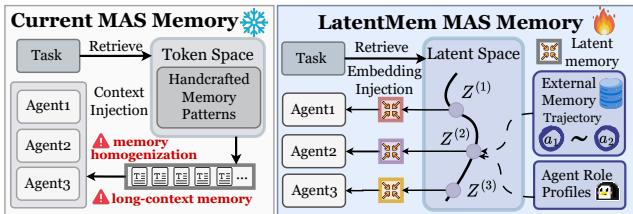

[← 返回 README](../README.md)

# 1. Introduction

## 📌 预览

Introduction 讲清楚三件事：(1) 多智能体记忆的重要性；(2) 现有方法的两大局限——memory homogenization 和 information overload；(3) LatentMem 的核心思路和三大优势。

---

Large Language Model (LLM)-powered multiagent systems (MAS), have emerged as a powerful framework for solving complex tasks by allowing agents to collaborate [Ye et al., 2025, Yue et al., 2025, Zhang et al., 2024a] or compete [Yang et al., 2025b, Zhang et al., 2024c] beyond the capabilities of individual LLM agents. Pivotal to this success is the concept of multiagent memory [Hu et al., 2025, Wu et al., 2025b], which enables agents to accumulate, retain, and reuse experiences through interactions with both other agents and the environment, thereby supporting more coherent coordination and continual adaptation.

> 💡 **背景铺设**: MAS 的核心能力来自 agent 间的协作/竞争，而 memory 是支撑这种协作的关键机制——让 agent 能"记住"过去的交互经验。

---

*Figure 1 | The paradigm comparison between existing multi-agent memory and LatentMem. Instead of relying on handcrafted memory units, LatentMem extracts agent-specific memories from the latent space by combining raw trajectories with agent profiles.*

> 💡 **Figure 1 批读**:
> - 左侧是现有方法：raw trajectory → 手工设计的离散记忆单元（如 insight extraction、skill schema），所有 agent 共享同一套
> - 右侧是 LatentMem：raw trajectory + agent profile → memory composer → agent-specific latent memory（连续表示）
> - 关键区别：(1) 角色感知——不同 agent 得到不同 memory；(2) latent space——不是文本而是 embedding

---

Building on this memory foundation, recent studies have increasingly explored multi-granularity memory repositories that capture experiences at different levels of abstraction, including (i) MAS trajectories [Qian et al., 2024b, Wang and Chen, 2025], (ii) distilled semantic insights [Liu et al., 2025, Zhu et al., 2025], and (iii) orchestrable skill schemas [Han et al., 2025, Zhang et al., 2025d]. These designs endow memory systems with the ability to capture diverse memory patterns, such as trajectory summarization and high-level insight extraction, enabling MAS to adaptively integrate past experiences and jointly refine decision-making strategies [Tomilin et al., 2025, Zheng et al., 2026].

> 💡 **现有记忆的三个粒度**:
> - **轨迹级**（raw trajectory）：最细粒度，保留完整交互历史
> - **语义级**（distilled insights）：从轨迹中提炼高层经验
> - **技能级**（skill schemas）：可编排的技能模板
> - 这三个粒度的共同问题：都是"one-size-fits-all"，不区分 agent 角色

---

However, despite the growing sophistication of existing memory systems, they remain constrained by two key limitations: (i) Memory homogenization: Most methods adopt a one-size-fits-all strategy, ignoring the functional heterogeneity of agents, which undermines role adherence and amplifies correlated errors [Cemri et al., 2025], weakening system robustness and hindering long-term adaptation. (ii) Information overload: MAS inherently involves long interaction contexts [Zhang et al., 2024a], and multi-granularity memory designs further amplify this burden by introducing large volumes of stored entries [Wang and Chen, 2025, Zhang et al., 2025a], ultimately overwhelming agents and obscuring critical decision signals. Given the aforementioned challenges, a natural question arises:

> 💡 **两大核心问题**:
> - **Memory Homogenization**：所有 agent 拿到一样的记忆 → 角色遵守性下降 → 相关性错误放大（比如所有 agent 犯同一类错误）
> - **Information Overload**：MAS 本身上下文就长，多粒度记忆进一步加剧 → agent 被海量信息淹没，关键信号被掩盖
> - 这两个问题互相加剧：同质化记忆本身就是冗余的，加上信息量又大

---

Given long and complex contexts in MAS, can we design a learnable memory that is both role-aware and token-efficient, without extensive manual engineering?

> 💡 **Research Question**: 三个关键词——(1) learnable（可学习，非手工设计）；(2) role-aware（角色感知）；(3) token-efficient（token 高效）

---

To address these challenges, we propose LatentMem, a latent multi-agent memory framework that materializes agent-aware memory customization via token-efficient latent memory generation. Specifically, LatentMem consists of two components: a lightweight experience bank for storing and retrieving raw MAS trajectories, and a memory composer that leverages agent profiles to distill raw trajectories into role-aware, compact latent memories and integrate them into the agents' reasoning process. To encourage the memory composer to distill transferable, high-utility latent representations from raw trajectories, we propose Latent Memory Policy Optimization (LMPO), which computes advantages from relative rewards within multi-agent rollouts, optimizes token-level objectives, and exploits latent memory differentiability to enable gradient backpropagation through the memory composer.

> 💡 **LatentMem 方法概览**:
> - **Experience Bank**：轻量级轨迹存储，只存 raw trajectory，不做任何人工设计的提炼
> - **Memory Composer**：neural network，输入 = 检索到的轨迹 + agent profile，输出 = 固定长度 latent memory
> - **LMPO**：基于 GRPO 的 RL 算法，关键创新是利用 latent memory 的可微性反传梯度到 composer
> - 设计哲学：Bitter Lesson——用通用学习机制代替手工知识

---

As a novel attempt in latent MAS memory, LatentMem offers three principal advantages: (I) It conditions the memory composer on agent role profiles to customize role-aware latent memories, thereby mitigating memory homogenization; (II) It encodes multi-agent memory as fixed-length latent representations rather than unbounded discrete textual traces, thereby mitigating information overload; (III) It exploits LMPO and latent memory differentiability to enable autonomous memory internalization and reconstruction, thereby avoiding language constraints and obviating the need for meticulously engineered memory architectures.

> 💡 **三大优势对应两大问题**:
> - 优势 I → 解决 Memory Homogenization：通过 agent profile conditioning
> - 优势 II → 解决 Information Overload：固定长度 latent 表示 vs 无界文本
> - 优势 III → 额外 bonus：端到端可学习，不需要手工设计记忆架构

---

Extensive experiments across six benchmarks and four mainstream MAS frameworks demonstrate that LatentMem achieves: (I) high performance, improving state-of-the-art MAS by up to $16.20\%$ and $18.45\%$ in knowledge QA and code generation tasks, respectively; (II) high efficiency, using $50\%$ fewer tokens and reducing inference time to $\sim 2/3$ compared to mainstream memory designs; and (III) strong generalization, with out-of-domain datasets such as PDDL showing a $7.10\%$ improvement, and unseen MAS such as CAMEL exhibiting a $7.90\%$ gain compared to the vanilla setting. These results establish LatentMem as a novel and effective framework for MAS memory.

> 💡 **实验亮点速览**:
> - **性能**：QA +16.20%，代码 +18.45%
> - **效率**：token -50%，时间 ×2/3
> - **泛化**：OOD 数据集 +7.10%，unseen MAS +7.90%
> - 特别注意 generalization 结果——很多 baseline 在 OOD 上反而掉点

---

## 🔖 Section 总结

### 核心洞察
1. 论文定位非常清晰：现有 MAS memory 的两大痛点（homogenization + overload）→ latent memory 同时解决两者
2. "Learnable + role-aware + token-efficient" 三位一体的设计目标很有吸引力
3. Bitter Lesson 哲学贯穿全文：不做 insight extraction、不做 skill schema，只存 raw trajectory + 学习压缩
