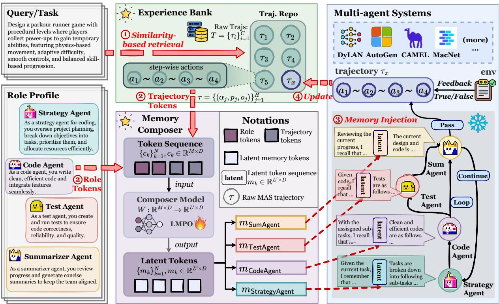

[← 返回 README](../README.md)

# 2. Related Works

## 📌 预览

Related Work 分两块：(1) LLM-Based MAS 的发展脉络（静态 → 动态拓扑）；(2) MAS Memory 的演进（simple pool → multi-granularity → LatentMem 的角色感知 latent memory）。

---

**LLM-Based Multi-Agent Systems.** MAS is a framework in which multiple agents collaborate by assuming distinct roles to achieve shared objectives [Guo et al., 2024, Li et al., 2024, Tran et al., 2025]. Our work focuses on leveraging MAS for task-specific problem solving. Early task-solving MAS frameworks [Du et al., 2023, Hong et al., 2023, Li et al., 2023, Liang et al., 2023, Wang et al., 2024, Wu et al., 2024, Zhang et al., 2024d] typically rely on predefined, static workflows, while more recent studies [Yang et al., 2026, 2025a, Yue et al., 2025, Zhang et al., 2024b, 2025c, Zhou et al., 2025a,b, Zhuge et al., 2024] have enabled MAS to dynamically reconfigure their organizational structures, improving adaptability to diverse and complex tasks while reducing computational costs. However, these methods typically require extensive searches over the design space, resulting in considerable computational and token overhead. Consequently, developing a lightweight mechanism for flexible MAS adaptation remains an open and challenging research problem.

> 💡 **MAS 发展脉络**:
> - **早期**：静态工作流（MetaGPT、ChatDev、AutoGen 等），角色和流程预定义
> - **近期**：动态拓扑（G-Designer、GPTSwarm 等），自动搜索最优组织结构
> - **问题**：动态方法搜索开销大 → 需要轻量级适应机制
> - LatentMem 的定位：不改 MAS 拓扑，而是通过 memory 增强 agent 能力

---

*Figure 2 | Overview of LatentMem. The framework proceeds as follows: (1) retrieve relevant trajectories from the experience bank; (2) compress them with agent role profiles into latent memories via the LMPO-trained memory composer; (3) inject these memories into agent reasoning processes without altering the agent architectures; and (4) store new trajectories for continual improvement.*

> 💡 **Figure 2 批读**:
> - 这是 LatentMem 的完整流程图，4 个步骤形成闭环：
>   1. **Retrieve**：新 query → 从 Experience Bank 检索相似轨迹
>   2. **Compress**：memory composer 将轨迹 + agent profile → latent memory (L' 个 token)
>   3. **Inject**：latent memory concat 到 agent 的 hidden states，透明注入
>   4. **Store**：任务完成后新轨迹存回 Experience Bank
> - 注意 memory composer 是用 LMPO 训练的，但 agent backbone 是 frozen 的
> - Self-improving loop：越用越好，经验积累 → memory 质量提升

---

**Memory in Multi-Agent Systems.** Memory enables agents to accumulate experience through interactions, thereby supporting coherent coordination and continual adaptation [Hu et al., 2025, Xu et al., 2025a]. It plays a crucial role in task-solving and social simulation; our focus lies primarily on the former. Early memory designs in MAS typically rely on simple, within-trial mechanisms coupled to the system itself, such as a shared pool storing raw trajectories [Chen et al., 2023, Hong et al., 2023, Qian et al., 2023, 2024a, Rezazadeh et al., 2025, Yin et al., 2023]. Modern memories, by contrast, have shifted towards more intricate and flexible structures. Representative examples include OAgents, which employs multi-granularity memory [Zhu et al., 2025]; EvolveR [Wu et al., 2025a] and Agent KB [Tang et al., 2025], which compress raw trajectories into high-level semantic units; and MIRIX [Wang and Chen, 2025], which transforms user goals into orchestrable procedural memories. However, these approaches overlook heterogeneous, role-aware memory design. LatentMem addresses this limitation by equipping each agent with a compact, role-aware latent memory, thereby reinforcing role compliance, enhancing coordination, and improving continual adaptation.

> 💡 **MAS Memory 演进**:
> - **早期**：shared pool 存 raw trajectory（MetaGPT、ChatDev 等）——简单但信息过载
> - **中期**：多粒度记忆（OAgents）、语义压缩（EvolveR、Agent KB）、程序化记忆（MIRIX）
> - **共同缺陷**：都不考虑 agent 角色差异 → memory homogenization
> - **LatentMem 的定位**：唯一做 role-aware + latent 压缩的方法
>
> 对比表：
> | 方法 | 角色感知 | Token 效率 | 可学习 |
> |------|---------|-----------|--------|
> | MetaGPT/ChatDev | ❌ | ❌ | ❌ |
> | OAgents | ❌ | ❌ | ❌ |
> | G-Memory | 部分 | ❌ | ❌ |
> | LatentMem | ✅ | ✅ | ✅ |

---

## 🔖 Section 总结

### 核心洞察
1. LatentMem 填补了 "role-aware + learnable memory" 的空白
2. 与 latent reasoning 方向（MemGen、SoftCoT、LatentSeek）有关联，但它们都是单 agent，LatentMem 首次扩展到多 agent
3. LatentMAS（Zou et al., 2025）做 latent communication，LatentMem 做 latent memory，切入点不同
