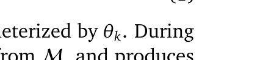
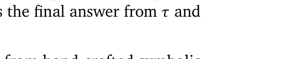

[← 返回 README](../README.md)

# 3. Preliminary

## 📌 预览

定义 MAS 的基本符号和优化目标。核心形式化：MAS = (Agents, Execution Graph, Memory)，目标是找到最优 Memory 模块使系统期望性能最大化。

---

**Notations.** Consider a multi-agent system $\chi$ containing $N$ agents $\mathcal{A} = \{a_1, a_2, \ldots, a_N\}$, and equipped with a global memory module $M$ that stores and retrieves shared information among agents. Formally, the system can be represented as the tuple:

Each agent $a_k = (\gamma_k, \pi_{\theta_k})$ is defined by a role profile $\gamma_k$ and a policy $\pi_{\theta_k}$ parameterized by $\theta_k$. During execution, an agent receives an input prompt $p$ and a retrieved memory $m$ from $M$, and produces a response $o$, denoted as $o = a_k(p, m)$. The execution graph $\mathcal{G}$ governs the topological order in which agents operate. Depending on the system architecture, $\mathcal{G}$ can be instantiated as either a static predefined topology [Qian et al., 2024b] or a centralized dynamic regulation mechanism [Wang et al., 2025].

> 💡 **符号解读**:
> - **MAS 三元组** $\chi = (\mathcal{A}, \mathcal{G}, \mathcal{M})$：Agents + Execution Graph + Memory
> - **Agent 二元组** $a_k = (\gamma_k, \pi_{\theta_k})$：角色 profile + 策略（即 LLM）
> - **Execution Graph** $\mathcal{G}$：决定 agent 执行顺序，可以是静态（如 ChatDev 的瀑布流）或动态（如 DyLAN 的 importance-based 选择）
> - Agent 的计算：$o = a_k(p, m)$，输入是 prompt + memory，输出是 response

---

**Problem Formulation.** Our objective is to find the memory module $\mathcal{M}$ that maximizes the expected performance of MAS $\chi$, which is formally defined as:

where $\mathcal{D}$ denotes the dataset and $q$ is a query sampled from it. The system $\chi$ processes the query $q$ to produce a reasoning trajectory $\tau$, and the reward function $R$ extracts the final answer from $\tau$ and evaluates its correctness.

> 💡 **优化目标解读**:
> - 目标很直接：找最优 Memory 模块，使 MAS 在数据集上的期望 reward 最大化
> - $R(\tau)$ 是轨迹级 reward（提取最终答案 → 判断正确性），是 0/1 还是连续值后面会看到
> - 这个 formulation 足够通用，既适用于手工设计的记忆，也适用于可学习的记忆

---

This formulation is agnostic to specific memory architectures, ranging from hand-crafted symbolic systems to learnable, parameterized counterparts. Conventional memory systems often rely on predefined patterns to accumulate experiences, while our approach adopts a learnable memory module that generates compact, role-aware latent representations for dynamic integration into each agent's reasoning.

> 💡 **关键洞察**: 这段点明了 LatentMem 的本质——把 Memory 模块从"手工设计的符号系统"变成"可学习的参数化模型"。这意味着 Memory 的质量可以通过训练不断提升，而非固定不变。

---

## 🔖 Section 总结

### 关键符号速查

| 符号 | 含义 |
|------|------|
| $\chi = (\mathcal{A}, \mathcal{G}, \mathcal{M})$ | MAS 系统 |
| $a_k = (\gamma_k, \pi_{\theta_k})$ | Agent = 角色 profile + 策略 |
| $\mathcal{G}$ | 执行图（agent 调用顺序） |
| $\mathcal{M}$ | 记忆模块 |
| $q$ | 用户查询 |
| $\tau$ | 推理轨迹 |
| $R(\tau)$ | 轨迹 reward |
