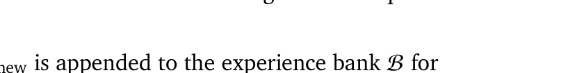
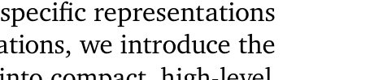
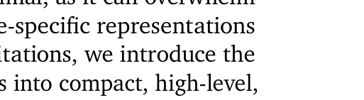
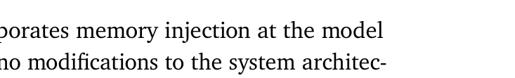
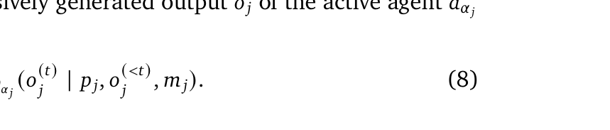
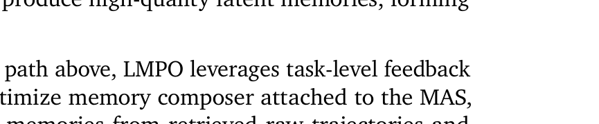
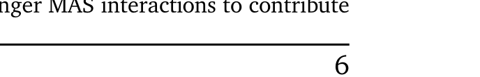
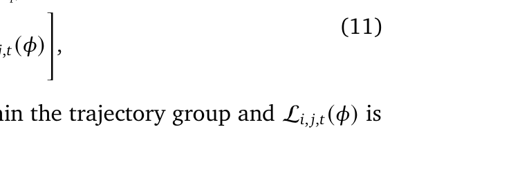
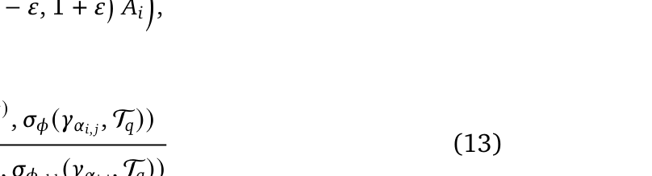
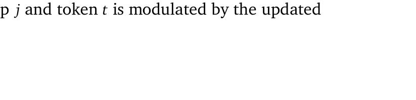

[← 返回 README](../README.md)

# 4. Methodology

## 📌 预览

这是论文的核心方法部分。LatentMem 由三个模块组成：(1) Overall Pipeline——整体流程；(2) Experience Bank——轻量级轨迹存储与检索；(3) Memory Composer——将轨迹压缩为角色感知 latent memory；(4) LMPO——端到端优化 memory composer 的 RL 算法。

---

In this section, we first present the overall pipeline of our proposed LatentMem framework (Section 4.1). Then we detail each module within the framework, including the experience bank (Section 4.2) and the memory composer (Section 4.3). Finally, we introduce Latent Memory Policy Optimization (LMPO), which enables end-to-end optimization of the memory composer through task-level feedback and reinforcement learning algorithm (Section 4.4).

---

## 4.1. Overall Pipeline

The overall pipeline of our proposed LatentMem framework is illustrated in Figure 2. It consists of two core components: a lightweight experience bank $\mathcal{B}$ for storing and retrieving historical trajectories, and a learnable memory composer $c$ that transforms the retrieved relevant trajectories into compact, role-aware latent memories.

Upon receiving a new query, LatentMem first retrieves a subset of relevant trajectories from the experience bank. These trajectories capture the interactions and behaviors of agents in previous MAS executions, forming a historical context that can guide reasoning. The retrieved trajectories, together with each agent's role profile, are then processed by the memory composer, which distills them into compact latent memories tailored to the corresponding agents. During each agent's reasoning process, these latent memories are appended to the token embeddings as additional latent tokens, forming a memory-augmented representation that incentivizes the agent to leverage prior experience and generate improved outputs. After the MAS completes a task, the newly generated trajectory is appended to the experience bank, enabling incremental accumulation of experiences.

> 💡 **Pipeline 要点**:
> - 四步闭环：Retrieve → Compress → Inject → Store
> - **Inject 方式**：latent memory 作为额外 token concat 到 hidden states（不是 prompt text！）
> - **Self-improving**：新轨迹不断积累，memory composer 能利用更多经验
> - 关键设计：注入在 embedding 层，不修改 agent 架构 → 即插即用

---

This procedure forms a self-improving loop, allowing LatentMem to continuously refine agent reasoning, support long-horizon coordination, and enhance continual adaptation. Moreover, the injection of latent memories maintains end-to-end differentiability of the entire forward process, facilitating efficient RL-based post-training [Qu et al., 2025] without incurring the heavy computation of retraining foundation models.

> 💡 **端到端可微的重要性**: latent memory 是连续表示而非离散文本 → 梯度可以从 agent 输出反传到 memory composer → 用 RL 直接优化 memory 质量。如果用文本 memory，这条梯度通路就断了。

---

## 4.2. Experience Bank

To accurately record historical MAS trajectories for future reuse, we construct an extremely lightweight experience bank $\mathcal{B}$. In line with the principle that scalable systems should rely on general learning mechanisms rather than hand-crafted knowledge [Sutton, 2019], this bank stores and retrieves only raw trajectories, without introducing any human priors such as trajectory condensation [Wang and Chen, 2025] or insight extraction [Zhao et al., 2024],

> 💡 **Bitter Lesson 在此体现**: Experience Bank 故意"不做任何加工"——不提炼 insight、不压缩轨迹。所有的"理解"和"压缩"都交给 memory composer 去学习。

---

**Initialization.** We populate the experience bank $\mathcal{B}$ with a wide-ranging collection of trajectories covering multiple domains and MAS frameworks to enable the memory composer $c$ to learn generalizable memory patterns across diverse domains and agent coordination patterns. The resulting initialized bank is denoted as $\{\tau_i\}_{i=1}^{C}$, where $C$ specifies its initial capacity. Each trajectory $\tau = \{(\alpha_j, p_j, o_j)\}_{j=1}^{H}$ records, at each step, the index of the active agent $\alpha_j$ along with its input prompt $p_j$ and corresponding output $o_j$, where $H$ denotes the trajectory horizon.

> 💡 **轨迹格式**: 每条轨迹 = 一系列 (agent_index, prompt, output) 三元组。注意是记录完整的 MAS 执行过程，不只是单个 agent 的输出。初始化用多域、多框架的轨迹 → 确保泛化性。

---

**Retrieval.** Upon receiving a new user query $q$, LatentMem performs similarity-based retrieval over $\mathcal{B}$ to obtain a subset of $K$ relevant trajectories $\mathcal{T}_q$:

where $\mathbf{v}(\cdot)$ maps queries or trajectories into a latent embedding space, e.g., using MiniLM [Wang et al., 2020a], and $sim(\cdot, \cdot)$ denotes the cosine similarity. The retrieved trajectories will be subsequently processed by the memory composer, which distills them into latent memories to guide subsequent MAS reasoning tasks.

> 💡 **检索机制**:
> - 用 MiniLM (all-MiniLM-L6-v2) 做 embedding，cosine similarity 做 top-K 检索
> - 默认 $K=1$（只检索 1 条最相关轨迹），ablation 显示 LatentMem 在 K 增大时仍持续提升
> - 检索粒度是整条轨迹（不是 agent 级别），因为轨迹包含完整协作过程

---

**Update.** Once a task is completed, the new trajectory $\tau_{\text{new}}$ is appended to the experience bank $\mathcal{B}$ for future reuse:

This streamlined update mechanism allows LatentMem to incrementally accumulate experiences online during inference, facilitating continual adaptation and cross-task coordination without the need for retraining.

> 💡 **在线更新**: 不需要重新训练，只是 append 新轨迹。这是"continual adaptation"的基础——memory composer 的参数不变，但 experience bank 在不断扩大。

---

However, directly feeding the retrieved raw trajectories to agents is suboptimal, as it can overwhelm LLMs with excessive context [Cemri et al., 2025] and fails to capture role-specific representations in heterogeneous MAS [Subramaniam et al., 2025]. To address these limitations, we introduce the memory composer $c$, which effectively transforms low-level raw trajectories into compact, high-level, role-aware latent memories.

> 💡 **为什么不能直接用 raw trajectory**: (1) 太长，超出 context window 或降低推理质量；(2) 不区分角色，所有 agent 看到同样的信息。Memory composer 就是解决这两个问题的。

---

## 4.3. Memory Composer

> 💡 **4.3 要点预览**: Memory Composer 是 LatentMem 的核心创新。它把 (轨迹, agent profile) → 固定长度 latent memory matrix，然后 concat 到 agent hidden states。

---

After identifying the relevant raw trajectories $\mathcal{T}_q$, we introduce the memory composer $c$, which provides each agent with generalizable memories. Formally, $c$ is instantiated as a deep neural network $\sigma_\phi$ parameterized by $\phi$. At each reasoning step $j$, $\sigma_\phi$ takes as input the retrieved trajectories $\mathcal{T}_q$ and the role profile $\gamma_{\alpha_j}$ of the active agent $a_{\alpha_j}$, producing a fixed-length, agent-aware latent memory matrix:

where $L'$ is a fixed length of the latent memory and $D$ denotes the hidden dimension of the foundation model.

> 💡 **Memory Composer 架构**:
> - 输入：检索到的轨迹 $\mathcal{T}_q$ + 当前 agent 的 role profile $\gamma_{\alpha_j}$
> - 输出：$m_j \in \mathbb{R}^{L' \times D}$，固定 $L'=8$ 个 token，维度 = LLM hidden dim
> - 实现：用 backbone LLM 初始化 + LoRA 微调（不是从头训练！）
> - 关键：**不同 agent 的 role profile 不同 → 输出的 latent memory 不同** → 角色感知

---

To conduct reasoning, the active agent $a_{\alpha_j}$ first encodes its input prompt $p_j$ into a sequence of hidden state vectors $h_j = (h_j^{(1)}, \ldots, h_j^{(L)}) \in \mathbb{R}^{L \times D}$. The agent's latent memory $m_j$ is then concatenated to $h_j$ to form an extended input shaped $\mathbb{R}^{(L+L') \times D}$, resulting in a memory-augmented policy:

where $\tilde{\pi}_{\theta_{\alpha_j}}$ is a wrapped version of $\pi_{\theta_{\alpha_j}}$ that seamlessly incorporates memory injection at the model level, remaining transparent to the agent layer and requiring no modifications to the system architecture.

> 💡 **Memory 注入方式**:
> - 把 latent memory ($L'=8$ tokens) concat 到 prompt hidden states 后面
> - Agent 看到的是 $(L+8)$ 个 token 的 hidden state 序列
> - **透明注入**：agent 层面完全不知道 memory 的存在，不需要改 prompt 格式
> - 类似于 prefix tuning / soft prompt 的思路，但这里的"前缀"是由 memory composer 动态生成的

---

## 4.4. Latent Memory Policy Optimization (LMPO)

> 💡 **4.4 要点预览**: LMPO 是基于 GRPO 的 RL 算法，核心创新是利用 latent memory 的可微性，让任务级 reward 可以反传到 memory composer。只训练 composer，不训练 agent backbone。

---

To enable end-to-end optimization of LatentMem while preserving strong generalization across diverse domains and MAS frameworks, we propose Latent Memory Policy Optimization (LMPO), a variant of GRPO [Shao et al., 2024], which encourages the memory composer to generate transferable, high-utility latent representations.

---

**Parametric Dependency.** We first describe the gradient flow during LMPO, in which the learning signal propagates through the latent memories to optimize the memory composer $c$, while keeping the agent backbone $\{\theta_k\}_{k=1}^N$ frozen. Formally, given a query $q$ and the retrieved trajectories $\mathcal{T}_q$ from the experience bank $\mathcal{B}$, the generation of a new trajectory $\tau = \{(\alpha_j, p_j, o_j)\}_{j=1}^{H}$ is factorized sequentially as:

> 💡 **梯度流关键**: Agent backbone $\theta_k$ 是 frozen 的！只训练 memory composer $\phi$。轨迹生成概率可以分解为每步的条件概率之积。

---

Crucially, the latent memory $m_j = \sigma_\phi(\mathcal{T}_q, \gamma_{\alpha_j})$, as defined in Equation (5), serves as a differentiable interface through which $\phi$ influences the autoregressively generated output $o_j$ of the active agent $a_{\alpha_j}$ at reasoning step $j$:

Since the composite policy $\tilde{\pi}_{\theta_{\alpha_j}}$ is conditioned on $m_j$, the gradient of any task-level objective can be backpropagated through the agent's forward pass to refine $\phi$. This dependency ensures that the memory composer can be optimized end-to-end to produce high-quality latent memories, forming the basis of our policy optimization strategy.

> 💡 **可微路径**: $\phi \to m_j \to \tilde{\pi} \to o_j \to R(\tau)$。因为 $m_j$ 是连续的 latent 表示（不是离散文本），梯度可以从 reward 一路反传到 $\phi$。这是整个方法能 work 的关键技术前提。

---

**Policy Optimization.** Building on the differentiable path above, LMPO leverages task-level feedback through latent memories as a bridge to directly optimize memory composer attached to the MAS, encouraging it to distill high-utility, agent-specific memories from retrieved raw trajectories and thereby enhance reasoning quality and overall performance.

Formally, given a query $q$ and its retrieved relevant trajectories $\mathcal{T}_q$, we sample a group of $G$ trajectories:

Each trajectory is evaluated using reward $R(\hat{\tau}_i)$, and its relative quality is captured by the group-based advantage:

> 💡 **GRPO 核心思想**: 不需要 value network！采样 G 条轨迹，用组内相对 reward 计算 advantage。比 PPO 简单很多，特别适合 LLM 场景。

---

While standard reinforcement learning [Zhang et al., 2025f] often employs trajectory-level objectives, such approaches treat all sequences equally, causing tokens in longer MAS interactions to contribute disproportionately less to the gradient [Yu et al., 2025]. This makes it difficult for the memory composer to capture critical coordination patterns within long-horizon tasks. Instead, we adopt a token-level surrogate objective:

where $|\{\hat{\tau}_i\}_{i=1}^{G}|$ is the total number of generated tokens within the trajectory group and $\mathcal{L}_{i,j,t}(\phi)$ is defined as:

> 💡 **Token-level vs Trajectory-level**:
> - Trajectory-level：所有 token 的梯度被轨迹长度平均 → 长轨迹中每个 token 贡献很小
> - Token-level：每个 token 独立计算 loss → 长轨迹中的关键 coordination pattern 不会被稀释
> - 这对 MAS 特别重要，因为 MAS 轨迹通常很长（多轮多 agent 交互）

---

and the token-level importance sampling ratio

measures how the policy of agent $a_{\alpha_{i,j}}$ at reasoning step $j$ and token $t$ is modulated by the updated memory.

> 💡 **Importance Sampling Ratio 解读**: $r_{i,j,t}(\phi)$ 比较的是"新 memory 下的 token 概率" vs "旧 memory 下的 token 概率"。注意分子分母的区别只在 $\sigma_\phi$ vs $\sigma_{\phi_{\text{old}}}$——同一个 agent backbone，不同的 memory composer 参数。PPO 的 clip 机制防止更新过大。

---

## 🔖 Section 总结

### 关键数字速查
| 配置 | 值 |
|------|-----|
| Latent memory 长度 $L'$ | 8 tokens |
| 检索数量 $K$ | 1 |
| Memory composer 初始化 | Backbone LLM + LoRA |
| LoRA r / alpha | 16 / 32 |
| Embedding 模型 | all-MiniLM-L6-v2 |
| Clipping $\varepsilon$ | 0.2 |

### 核心洞察
1. **Bitter Lesson 贯穿设计**：Experience Bank 不做加工，Memory Composer 学习压缩
2. **Latent memory 是技术关键**：连续表示 → 可微 → 端到端 RL 优化成为可能
3. **LMPO vs GRPO**：主要改动是 token-level objective + 只训练 composer（不训练 agent）
4. **架构选择**：Memory Composer 用 backbone LLM + LoRA，而非从头设计新网络 → 复用预训练知识
