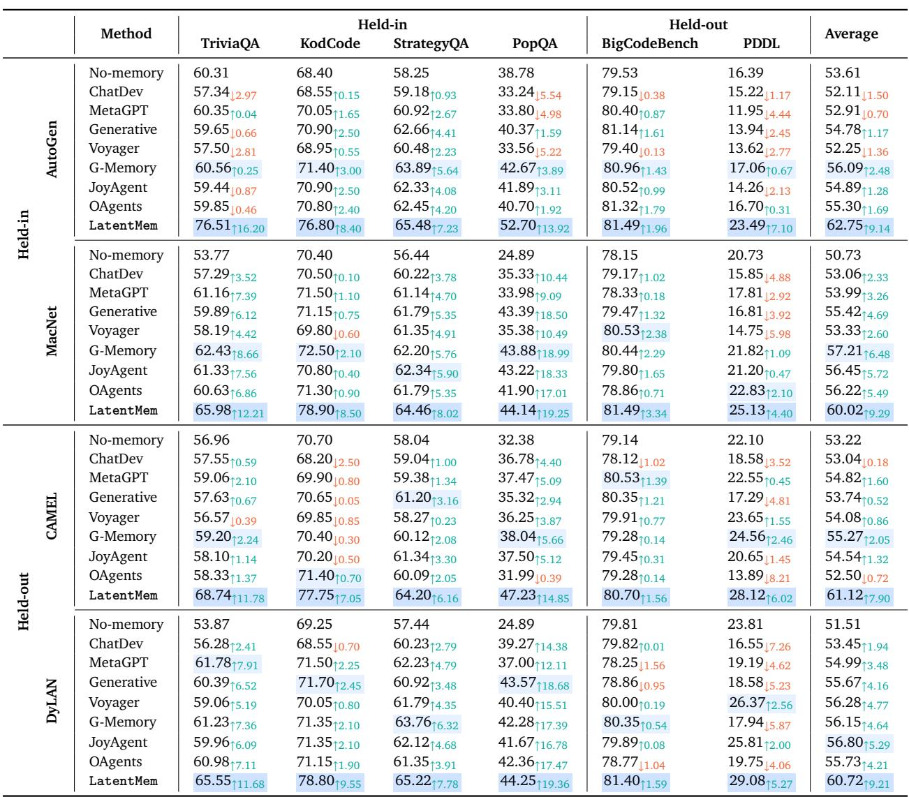
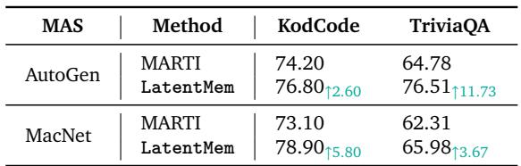

[← 返回 README](../README.md)

# 5. Experiments

## 📌 预览

实验部分覆盖 6 个 benchmark × 4 个 MAS 框架，从五个维度验证 LatentMem：(1) 主实验性能；(2) 效率分析；(3) vs multi-agent finetuning；(4) 框架分析（角色感知 + 扩展性）；(5) 消融和敏感度分析。

---

## 5.1. Experimental Setup

**Datasets and Benchmarks.** Our evaluation covers six benchmarks across four domains: (1) Knowledge-intensive QA: TriviaQA [Joshi et al., 2017] and PopQA [Mallen et al., 2023]; (2) Coding: KodCode [Xu et al., 2025c] and BigCodeBench [Jain et al., 2024]; (3) Reasoning QA: StrategyQA [Geva et al., 2021]; and (4) Symbolic Planning: PDDL [Silver et al., 2024]. Detailed information for these benchmarks are provided in Appendix B.1.

> 💡 **数据集设计**: 4 个 in-domain（TriviaQA, KodCode, StrategyQA, PopQA）+ 2 个 out-of-domain（BigCodeBench, PDDL），专门测试泛化能力。

---

**Baselines.** Besides memory-free methods, we select three representative single-agent memory baselines, including Voyager [Wang et al., 2023], Generative [Park et al., 2023], and JoyAgent [Liu et al., 2025], as well as four multi-agent memory baselines adopted from mainstream MAS frameworks: MetaGPT [Hong et al., 2023], ChatDev [Qian et al., 2024a], OAgents [Zhu et al., 2025], JoyAgent Liu et al. [2025], and MAS-specific G-Memory [Zhang et al., 2025a]. Additional details are provided in Appendix B.2.

> 💡 **Baselines 分类**:
> - **No-memory**：不用任何记忆
> - **单 agent memory**：Voyager（技能库）、Generative（观察+反思）、JoyAgent（分层记忆）
> - **多 agent memory**：MetaGPT（共享消息池）、ChatDev（trial 内记忆）、OAgents（多粒度）、G-Memory（层级图记忆）
> - G-Memory 是最强 baseline（同一作者组的前作）

---

**MAS and LLM Backbones.** Four representative multi-agent frameworks are adopted to integrate with LatentMem and the baselines, including AutoGen [Wu et al., 2024], MacNet [Qian et al., 2024b], CAMEL [Li et al., 2023] and DyLAN [Liu et al., 2024]. More details on the MAS setups are placed in Appendix B.3. To instantiate these MAS frameworks, we adopt two common LLMs with different sizes, i.e., Qwen/Qwen3-4B-Instruct-2507 and meta-llama/Llama-3.1-8B-Instruct.

> 💡 **MAS 框架选择**:
> - **In-distribution**（训练时见过）：AutoGen（2 agents, 检索增强）、MacNet（5 agents, 去中心化）
> - **Out-of-distribution**（训练时没见过）：CAMEL（4 agents, 角色扮演辩论）、DyLAN（5 agents, 辩论+早停）
> - 用 2 个不同规模的 LLM 测试可扩展性

---

**Training Configurations.** We implement the embedding function $\mathbf{v}(\cdot)$ mentioned in Equation (3) with the all-MiniLM-L6-v2 model Wang et al. [2020b]. The memory composer $c$ is realized as a lightweight transformer, with its parameters initialized from the backbone LLM and trained using LoRA Hu et al. [2022]. We set $K = 1$ in Equation (3) and fix the latent memory sequence length to $L' = 8$. The ablation study on hyper-parameter settings is reported in Section 5.6. Detailed training setups and parameter configurations are listed in Appendix B.4.

> 💡 **训练关键配置**: Memory Composer = Backbone LLM + LoRA (r=16, alpha=32)。只需训练 LoRA 参数，非常轻量。$K=1$（只检索 1 条轨迹），$L'=8$（8 个 latent token）。

---

## 5.2. Main Results

*Table 1 | Performance comparison across diverse memory frameworks on six benchmarks, using Qwen3-4B-Instruct-2507 as the backbone. The best and second best results are highlighted.*

> 💡 **Table 1 批读**:
> - **AutoGen (Held-in)**：LatentMem 在 TriviaQA 上 76.51%（+16.20%），碾压所有 baseline
> - **MacNet (Held-in)**：KodCode 78.90%（+8.50%），同样大幅领先
> - **CAMEL (Held-out MAS)**：在没见过的框架上，KodCode +7.05%，证明泛化能力
> - **DyLAN (Held-out MAS)**：KodCode 78.80%（+9.55%），最强表现
> - **OOD benchmarks**：PDDL 上 LatentMem +7.10%（AutoGen），而 MetaGPT -4.44%、Voyager -2.77%
> - **关键观察**：现有 memory 方法在 OOD 和 unseen MAS 上经常掉点，LatentMem 始终提升

---

**LatentMem Delivers High-Performance Memory Across Domains and MAS Frameworks.** As shown in Table 1, when integrated with in-domain MAS frameworks such as AutoGen and MacNet that are powered by Qwen3-4B-Instruct-2507, LatentMem outperforms the state-of-the-art single- and multi-agent memory baselines by an average of $7.86\%$ and $6.66\%$, respectively. Notably, it yields a $16.20\%$ improvement for AutoGen on the TriviaQA benchmark. Furthermore, LatentMem exhibits strong scalability with the model size increases. As shown in Appendix 4, it elevates MacNet's performance on KodCode from $48.50\%$ to $65.50\%$ using Llama-3.1-8B-Instruct.

> 💡 **性能亮点**: 平均超过单 agent memory +7.86%，超过多 agent memory +6.66%。在 Llama-3.1-8B 上 KodCode 从 48.50% → 65.50%（+17%），说明对更大模型也很有效。

---

**LatentMem Exhibits Strong Generalization Capability.** On out-of-domain benchmarks, most MAS memory methods fail to generalize. As shown in Table 1, LatentMem improves AutoGen on PDDL by $7.10\%$, while MetaGPT and Voyager drop by up to $4.44\%$ and $2.77\%$, respectively. Similarly, on previously unseen MAS frameworks, LatentMem boosts CAMEL on KodCode by $7.05\%$, whereas nearly all baselines decline. We attribute these gaps to the rigid and homogeneous memory designs of existing methods, which limit adaptability and representational capacity. These results demonstrate LatentMem's robustness across domains, agent roles, and collaboration patterns, highlighting the importance of role-aware memory for generalizable MAS.

> 💡 **泛化性分析**: 这是 LatentMem 最有说服力的结果——其他方法在 OOD 上掉点，LatentMem 仍然提升。原因：(1) latent 表示比文本记忆更 transferable；(2) 角色感知让 memory 自动适应新角色。

---

## 5.3. Cost Analysis

*Figure 3 | Time and token consumption of LatentMem. Each panel shows the trade-off between performance and resource cost under different memory architectures: the top row plots performance versus time, the bottom row plots performance versus token cost. Circle area reflects relative resource consumption.*

> 💡 **Figure 3 批读**:
> - 上排：性能 vs 时间。LatentMem 在右上角（高性能 + 低时间），OAgents 在左下角（低性能 + 高时间）
> - 下排：性能 vs token 数。LatentMem 的 token 消耗甚至比 No-Memory 还少（因为 8 个 latent token 替代了长文本 memory）
> - JoyAgent 典型反面：多花 1.87M tokens 只换来 2.50% 提升
> - LatentMem 推理时间是 OAgents 的 1/2.16

---

As shown in Figure 3, LatentMem achieves the largest performance gains among memory-based baselines while incurring minimal time and token costs. It delivers the greatest improvement on TriviaQA for DyLAN ($+11.68\%$ over No-memory) with substantially lower time overhead (e.g., cutting inference time by a factor of $2.16\times$ relative to OAgents), and achieves the highest gain on KodCode for AutoGen ($+8.40\%$) while using even fewer tokens than No-Memory (0.01M tokens less). In contrast, JoyAgent consumes 1.87M additional tokens for only a $2.50\%$ gain, highlighting the superior efficiency of LatentMem.

---

## 5.4. Comparison with Multi-Agent FineTuning

*Table 2 | Performance comparison between the multi-agent fine-tuning method MARTI and LatentMem on KodCode and TriviaQA across two MAS frameworks, AutoGen and MacNet.*

> 💡 **Table 2 批读**:
> - MARTI 直接微调 agent backbone（所有 agent 共享一个 LLM）
> - LatentMem 只训练 memory composer（agent backbone frozen）
> - 在 AutoGen/TriviaQA 上：LatentMem 76.51 vs MARTI 64.78（+11.73%）
> - 在复杂 MAS（MacNet）上差距更大：MARTI 的 KodCode 从 AutoGen 的 74.20 掉到 73.10，LatentMem 反而从 76.80 升到 78.90
> - **洞察**：直接 finetune backbone 容易破坏 agent 间的协作模式，而 LatentMem 通过 memory 注入更好地利用 MAS 结构

---

As shown in Table 2, LatentMem consistently outperforms direct agent backbone fine-tuning across all settings. Notably, on the TriviaQA dataset with the AutoGen framework, LatentMem achieves a substantial improvement of $11.73\%$. Moreover, on more complex MAS settings such as MacNet, MARTI experiences a $1.10\%$ performance drop on KodCode compared to AutoGen, whereas LatentMem instead surpasses its AutoGen counterpart by $2.10\%$.

These results indicate that LatentMem better exploits the structural advantages of complex MAS, leading to stronger performance gains than direct backbone fine-tuning.

---

## 5.5. Framework Analysis

**LatentMem Consistently Delivers Role-Aware Memory.** As shown in Figure 4, LatentMem consistently generates role-specific latent memories across both in-domain and out-of-domain datasets, as well as seen and unseen MAS. In the left panel (in-domain KodCode, seen MAS AutoGen), user-proxy and assistant memories form two clearly separated clusters. In the right panel (out-of-domain BigCodeBench, unseen MAS CAMEL), the role-specific memories remain well separated, demonstrating LatentMem's ability to avoid homogeneous memory even in entirely novel task domains, agent roles, and collaboration patterns.

*Figure 4 | t-SNE visualization of latent memories generated by LatentMem across different datasets and MAS frameworks.*

> 💡 **Figure 4 批读**:
> - t-SNE 可视化 latent memory 的分布
> - 左图（in-domain）：user-proxy 和 assistant 的 memory 聚类明显分离
> - 右图（OOD + unseen MAS）：不同角色的 memory 仍然分离 → 角色感知能力可迁移
> - 这证明 memory composer 确实学到了"根据角色生成不同 memory"的能力，而非简单复制

---

**LatentMem Scales Efficiently as Task Horizon Expands.** We visualize the cumulative gains of different memory systems as tasks progress, specifically by tracking their impact on cumulative accuracy. As shown in Figure 5, LatentMem steadily improves as more experiences are collected, surpassing all baselines that rely on complex, multi-granularity memory. Although early performance exhibits higher variance due to limited samples, LatentMem quickly stabilizes and continues to improve, demonstrating its ability to efficiently distill high-utility, transferable knowledge from past interaction trajectories, which can then be leveraged to guide the reasoning process of MAS.

*Figure 5 | Evolution of cumulative accuracy (reward) across question indices. The cumulative accuracy at index n is defined as the average accuracy (reward) over the first n questions.*

> 💡 **Figure 5 批读**:
> - 横轴：问题序号（时间推进），纵轴：累积准确率
> - LatentMem 的曲线持续上升且最终收敛到最高水平
> - 早期波动大（经验少），后期稳定提升 → continual learning 特性
> - 多粒度 baseline 的曲线趋于平坦甚至下降 → 信息过载导致收益递减

---

## 5.6. Sensitivity & Ablation Study

**Sensitivity Analysis.** We analyze the sensitivity of LatentMem to two key hyperparameters: the latent memory length $L'$ and the number of relevant trajectories $K$. As shown in Figure 6 (Left), performance generally improves with larger $L'$, but with diminishing returns; balancing accuracy and computational cost, we set $L' = 8$. The effect of $K$ is detailed in Appendix C.3: while baselines such as G-Memory degrades when $K > 3$ due to information overload, LatentMem consistently improves on both TriviaQA and KodCode, demonstrating its ability to distill useful information from redundant trajectories via latent memory.

*Figure 6 | (Left) Sensitivity of model performance to the latent memory length L'. (Right) Ablation results highlighting the impact of the memory composer and the experience bank.*

> 💡 **Figure 6 批读**:
> - **Left (L' 敏感度)**：L'=2 到 L'=8 性能持续提升，L'=8 后趋于饱和 → 8 tokens 足以编码 memory
> - **Right (消融实验)**：
>   - "w/o role"：去掉 agent profile → 简单 MAS (AutoGen) 掉 2.30%，复杂 MAS (MacNet) 掉 6.45% → 角色感知在复杂 MAS 中更重要
>   - "w/o experience"：不更新 experience bank → KodCode 掉 3.60%，PDDL 掉 7.63% → 在线更新对复杂任务分布至关重要

---

**Component Ablation.** We present ablation studies of LatentMem in Figure 6 (Right), where we introduce two variants: without role and without experience, corresponding to the removal of agent profile guidance in eq. (5) and the disabling of real-time updates in the experience bank (as in eq. (4)), respectively. When the memory composer no longer receives agent profiles, resulting in identical latent memories across agents, performance drops slightly for simple MAS such as AutoGen ($2.30\%$ on KodCode) and more substantially for complex MAS like MacNet ($6.45\%$), highlighting the importance of agent-aware memory. Disabling real-time updates in the experience bank leads to minor performance degradation on KodCode ($3.60\%$ on MacNet) but a larger drop on PDDL ($7.63\%$), demonstrating its crucial role in adapting to complex task distributions. These results underscore the contributions of both components to the overall effectiveness of LatentMem.

---

## 5.7. Case Study

*Figure 7 | Case study of LatentMem. By leveraging role-aware and compact latent memory, LatentMem prevents common MAS issues such as step repetition and blindly following retrieved trajectories, while enabling role-aware coordination and self-correction.*

> 💡 **Figure 7 批读**:
> - **Vanilla MacNet**：陷入 step repetition（反复移动 ball2）→ 死循环
> - **MacNet + OAgents**：盲目跟随检索到的旧轨迹，不管当前任务条件是否匹配 → disobey task specification
> - **MacNet + LatentMem**：即使出现短期错误（pick ball5 rooma right 无效），下一步立即自我纠正 → role-aware coordination 使 actor-critic 机制正常运作
> - **关键区别**：latent memory 提供的是高层经验指导，而非具体步骤 → 不会盲目复制旧轨迹

---

Figure 7 shows that LatentMem, by providing role-aware memory, can prevent or promptly correct common error patterns in MAS. Vanilla MacNet often suffers from step repetition, while MacNet with OAgents blindly follow the retrieved trajectories, violating task specifications. In contrast, LatentMem's high-level, role-aware latent memory enables agents to reinforce role compliance and coordinate effectively, allowing the MAS to self-correct short-term errors and complete tasks successfully. Detailed trajectories and error analyses are in Appendix C.4.

---

## 🔖 Section 总结

### 关键数字速查
| 指标 | 数值 |
|------|------|
| 最大单项提升 (vs vanilla) | +19.36% (PopQA, MacNet, Qwen3-4B) |
| 最大单项提升 (vs SOTA) | +16.20% (TriviaQA, AutoGen) |
| 平均超过 single-agent memory | +7.86% |
| 平均超过 multi-agent memory | +6.66% |
| OOD 提升 (PDDL) | +7.10% |
| Unseen MAS 提升 (CAMEL avg) | +7.90% |
| vs MARTI | +11.73% (TriviaQA) |
| Token 效率 | 比 No-Memory 还少 0.01M |
| 时间效率 | OAgents 的 1/2.16 |

### 核心洞察
1. LatentMem 在所有维度（性能、效率、泛化）都优于现有方法，且差距很大
2. 最有说服力的是 OOD + unseen MAS 的结果：别人掉点，它仍提升
3. vs MARTI 的比较说明：不改 backbone、只加 memory 比直接 finetune backbone 更好
4. 消融实验证明 role-aware 和 experience bank 都不可或缺
