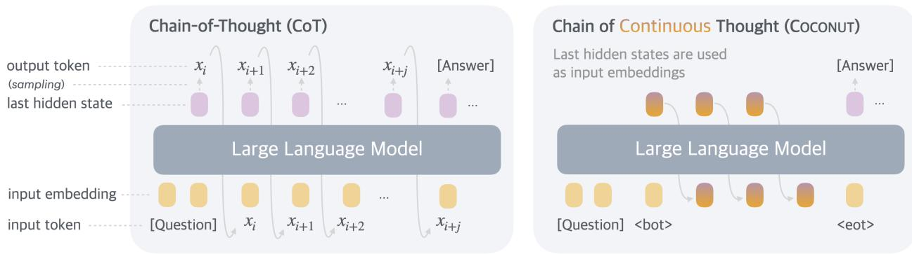

[← 返回 README](../README.md)

# 1 Introduction

## 📌 预览
为什么 LLM 不应该被限制在语言空间推理？脑科学证据 + CoT 的根本缺陷 + Coconut 的方案概述。

---

Large language models (LLMs) have demonstrated remarkable reasoning abilities, emerging from extensive pretraining on human languages (Dubey et al., 2024; Achiam et al., 2023). While next token prediction is an effective training objective, it imposes a fundamental constraint on the LLM as a reasoning machine: the explicit reasoning process of LLMs must be generated in word tokens. For example, a prevalent approach, known as chain-of-thought (CoT) reasoning (Wei et al., 2022), involves prompting or training LLMs to generate solutions step-by-step using natural language. However, this is in stark contrast to certain human cognition results. Neuroimaging studies have consistently shown that the language network – a set of brain regions responsible for language comprehension and production – remains largely inactive during various reasoning tasks (Amalric and Dehaene, 2019; Monti et al., 2012, 2007, 2009; Fedorenko et al., 2011). Further evidence indicates that human language is optimized for communication rather than reasoning (Fedorenko et al., 2024).

> 💡 **脑科学论据**: 人脑做推理时，语言区域几乎不活跃。语言是为交流优化的，不是为推理优化的。这给了 Coconut 一个很强的 motivation：如果人脑推理不用语言，为什么 LLM 非要用？

A significant issue arises when LLMs use language for reasoning: the amount of reasoning required for each particular token varies greatly, yet current LLM architectures allocate nearly the same computing budget for predicting every token. Most tokens in a reasoning chain are generated solely for fluency, contributing little to the actual reasoning process. By contrast, some critical tokens require complex planning and pose huge challenges to LLMs. While previous work has attempted to fix these problems by prompting LLMs to generate succinct reasoning chains (Madaan and Yazdanbakhsh, 2022), or performing additional reasoning before generating some critical tokens (Zelikman et al., 2024), these solutions remain constrained within the language space and do not solve the fundamental problems. On the contrary, it would be ideal for LLMs to have the freedom to reason without any language constraints, and then translate their findings into language only when necessary.

> 💡 **计算分配不均问题**: 这是 CoT 的核心问题——"Let's think step by step" 中 "Let's" 和 "step" 这些词各分配一次 forward pass，但推理价值天差地别。Quiet-STaR (Zelikman et al., 2024) 尝试在关键 token 前额外推理，但仍在语言空间。Coconut 的方案更彻底：直接在 latent space 推理，不受 token 粒度约束。

*Figure 1: A comparison of Chain of Continuous Thought (Coconut) with Chain-of-Thought (CoT). In CoT, the model generates the reasoning process as a word token sequence. Coconut regards the last hidden state as a representation of the reasoning state (termed "continuous thought"), and directly uses it as the next input embedding.*

> 💡 **Figure 1 批读**:
> - **左边 CoT**: question → token sequence (language reasoning) → answer。每步都要经过 "hidden → LM head → softmax → token → embedding" 的离散化瓶颈。
> - **右边 Coconut**: question → `<bot>` → continuous thoughts (hidden states 直接传递) → `<eot>` → answer。推理在 latent space 完成，只在需要输出时才回到语言空间。
> - 关键区别：CoT 的中间表示是离散 token（信息有损），Coconut 的中间表示是连续向量（信息无损）。

In this work we instead explore LLM reasoning in a latent space by introducing a novel paradigm, Coconut (Chain of Continuous Thought). It involves a simple modification to the traditional CoT process: instead of mapping between hidden states and language tokens using the language model head and embedding layer, Coconut directly feeds the last hidden state (a continuous thought) as the input embedding for the next token (Figure 1). This modification frees the reasoning from being within the language space, and the system can be optimized end-to-end by gradient descent, as continuous thoughts are fully differentiable. To enhance the training of latent reasoning, we employ a multi-stage training strategy inspired by Deng et al. (2024), which effectively utilizes language reasoning chains to guide the training process.

> 💡 **可微分是关键**: continuous thought 全程可微 → 可以端到端梯度优化 → 模型可以学到比人类语言更高效的推理表示。这是对比 discrete token（不可微，需要 RL/REINFORCE）的核心优势。训练策略借鉴 iCoT (Deng et al., 2024) 的渐进替换思路。

Interestingly, our proposed paradigm leads to an efficient reasoning pattern. Unlike language-based reasoning, continuous thoughts in Coconut can encode multiple potential next steps simultaneously, allowing for a reasoning process akin to breadth-first search (BFS). While the model may not initially make the correct decision, it can maintain many possible options within the continuous thoughts and progressively eliminate incorrect paths through reasoning, guided by some implicit value functions. This advanced reasoning mechanism surpasses traditional CoT, even though the model is not explicitly trained or instructed to operate in this manner, as seen in previous works (Yao et al., 2023; Hao et al., 2023).

> 💡 **BFS 涌现的直觉**: 
> - 离散 token 必须 "commit" 到一个选择（贪心搜索）
> - 连续向量可以是多个选择的 "superposition"（同时保持概率分布）
> - 随着推理步骤增加，错误路径被逐渐排除，正确路径概率增大
> - 这就是 BFS：先展开所有候选，再逐步剪枝
> - 重要：**没有显式训练 BFS**，是 latent space 的天然属性导致的涌现行为

Experimentally, Coconut successfully enhances the reasoning capabilities of LLMs. For math reasoning (GSM8k, Cobbe et al., 2021), using continuous thoughts is shown to be beneficial to reasoning accuracy, mirroring the effects of language reasoning chains. This indicates the potential to scale and solve increasingly challenging problems by chaining more continuous thoughts. On logical reasoning including ProntoQA (Saparov and He, 2022), and our newly proposed ProsQA (Section 4) which requires stronger planning ability, Coconut and some of its variants even surpasses language-based CoT methods, while generating significantly fewer tokens during inference. We believe that these findings underscore the potential of latent reasoning and could provide valuable insights for future research.

> 💡 **实验结果预览**:
> - GSM8k: Coconut (34.1%) 在 No-CoT (16.5%) 和 CoT (42.9%) 之间——说明 continuous thought 确实有用，但还没完全替代 CoT
> - ProntoQA/ProsQA: **Coconut 超越 CoT**，且 token 数量大幅减少——在需要搜索规划的任务上，latent reasoning 的优势明显
> - "chaining more continuous thoughts" → 性能提升 → test-time scaling 的潜力

---

## 🔖 Section 总结

### 核心洞察
1. **脑科学支撑**: 人脑推理不依赖语言网络 → LLM 也不必在语言空间推理
2. **CoT 的根本缺陷**: 计算分配不均 + 离散化信息瓶颈 + 无法回溯
3. **Coconut 方案**: last hidden state 直接反馈 → 连续可微 → 端到端优化
4. **涌现行为**: BFS-like 多路径探索，不需要显式训练
5. **与 MemGen 的联系**: Coconut 证明了 hidden state 可以作为有效的推理载体，MemGen 进一步把这种 latent representation 扩展为可存储和复用的 memory
