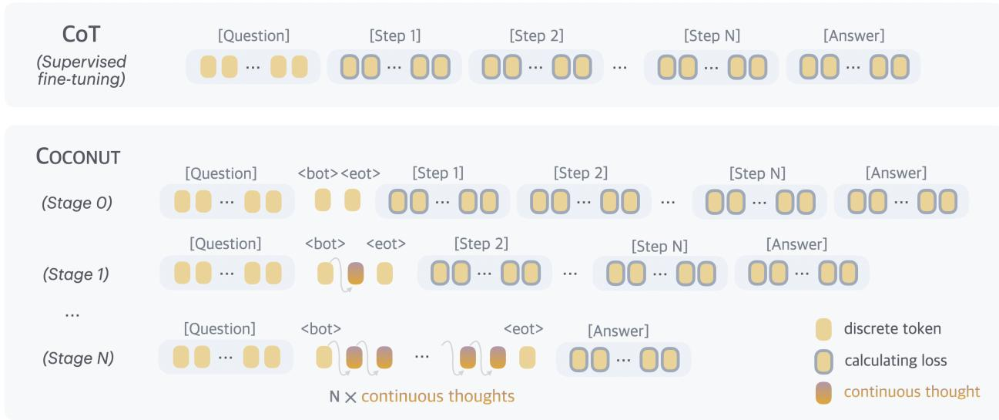

[← 返回 README](../README.md)

# 3 Coconut: Chain of Continuous Thought

## 📌 预览
方法核心：language mode vs latent mode 切换机制 + `<bot>`/`<eot>` 特殊 token + 多阶段课程训练 + 推理流程。

---

In this section, we introduce our new paradigm Coconut (Chain of Continuous Thought) for reasoning in an unconstrained latent space. We begin by introducing the background and notation we use for language models. For an input sequence $\boldsymbol{x} = (x_1, ..., x_T)$, the standard large language model $\mathcal{M}$ can be described as:

$$H_t = \text{Transformer}(E_t)$$
$$\mathcal{M}(x_{t+1} \mid x_{\leq t}) = \text{softmax}(Wh_t)$$

where $E_t = [e(x_1), e(x_2), ..., e(x_t)]$ is the sequence of token embeddings up to position $t$; $H_t \in \mathbb{R}^{t \times d}$ is the matrix of the last hidden states for all tokens up to position $t$; $h_t$ is the last hidden state of position $t$, i.e., $h_t = H_t[t, :]$; $e(\cdot)$ is the token embedding function; $W$ is the parameter of the language model head.

> 💡 **标准 LLM pipeline**: input tokens → embedding $e(x)$ → Transformer → hidden states $H$ → LM head $W$ → softmax → next token distribution。关键信息瓶颈在 $h_t \rightarrow \text{softmax}(Wh_t) \rightarrow x_{t+1} \rightarrow e(x_{t+1})$：一个 $d$ 维向量被压缩成一个 token（vocabulary 大小的 one-hot），再展开回 $d$ 维 embedding。Coconut 的核心就是跳过这个压缩-展开步骤。

---

### Method Overview

In the proposed Coconut method, the LLM switches between the "language mode" and "latent mode" (Figure 1). In language mode, the model operates as a standard language model, autoregressively generating the next token. In latent mode, it directly utilizes the last hidden state as the next input embedding. This last hidden state represents the current reasoning state, termed as a "continuous thought".

Special tokens `<bot>` and `<eot>` are employed to mark the beginning and end of the latent thought mode, respectively. As an example, we assume latent reasoning occurs between positions $i$ and $j$, i.e., $x_i =$ `<bot>` and $x_j =$ `<eot>`. When the model is in the latent mode ($i < t < j$), we use the last hidden state from the previous token to replace the input embedding, i.e., $E_t = [e(x_1), e(x_2), ..., e(x_i), h_i, h_{i+1}, ..., h_{t-1}]$. After the latent mode finishes ($t \geq j$), the input reverts to using the token embedding, i.e., $E_t = [e(x_1), e(x_2), ..., e(x_i), h_i, h_{i+1}, ..., h_{j-1}, e(x_j), ..., e(x_t)]$.

> 💡 **Hidden state 如何回馈（核心机制）**:
> 1. 遇到 `<bot>` → 进入 latent mode
> 2. 在 latent mode 中：$h_t$（last hidden state, 经过 final norm）直接作为位置 $t+1$ 的输入 embedding
> 3. 不经过 LM head、不 softmax、不选 token、不查 embedding table
> 4. 遇到 `<eot>` → 回到 language mode，继续正常解码
> 
> **信息流**: $e(x_i) \rightarrow h_i \rightarrow h_{i+1} \rightarrow ... \rightarrow h_{j-1} \rightarrow e(x_j)$
> 
> 注意 hidden state 经过了 final normalization layer（如 RMSNorm），所以幅度不会爆炸。这也意味着 continuous thought 和 token embedding 在同一个数值范围内，可以混合输入。

It is worth noting that the last hidden states have been processed by the final normalization layer, so they are not too large in magnitude. $\mathcal{M}(x_{t+1} \mid x_{\leq t})$ is not defined when $i < t < j$, since the latent thought is not intended to be mapped back to language space. However, $\text{softmax}(Wh_t)$ can still be calculated for probing purposes (see Section 5).

> 💡 **Probing 技巧**: 虽然 latent mode 不需要输出 token，但仍然可以对 $h_t$ 做 $\text{softmax}(Wh_t)$ 来 "窥探" continuous thought 编码了什么信息。这是 Section 4.3 分析 BFS 涌现的关键手段——通过 probing 发现 continuous thought 同时编码了多个候选推理步骤。

---

### Training Procedure

*Figure 2: Training procedure of Chain of Continuous Thought (Coconut). Given training data with language reasoning steps, at each training stage we integrate c additional continuous thoughts (c = 1 in this example), and remove one language reasoning step. The cross-entropy loss is then used on the remaining tokens after continuous thoughts.*

> 💡 **Figure 2 批读**:
> - **Stage 0**: 完整 CoT 训练（标准 SFT）
> - **Stage 1**: 第 1 个 reasoning step 被替换为 $c$ 个 continuous thought（`<bot>` thought `<eot>`），剩余 step 保留为 language
> - **Stage 2**: 前 2 个 step 被替换为 $2c$ 个 continuous thought
> - **Stage k**: 前 $k$ 个 step → $k \times c$ 个 continuous thought
> - Loss 只算 `<eot>` 后面的 language token，不算 question 和 continuous thought
> 
> **关键**: 这是 "课程学习" (curriculum learning)——模型先学会用语言推理，再逐步学会用 latent space 替代。如果直接跳到全 latent（w/o curriculum），性能会崩塌。

In this work, we focus on a problem-solving setting where the model receives a question as input and is expected to generate an answer through a reasoning process. We leverage language CoT data to supervise continuous thought by implementing a multi-stage training curriculum inspired by Deng et al. (2024). As shown in Figure 2, in the initial stage, the model is trained on regular CoT instances. In the subsequent stages, at the $k$-th stage, the first $k$ reasoning steps in the CoT are replaced with $k \times c$ continuous thoughts, where $c$ is a hyperparameter controlling the number of latent thoughts replacing a single language reasoning step. Following Deng et al. (2024), we also reset the optimizer state when training stages switch. We insert `<bot>` and `<eot>` tokens (which are not counted towards $c$) to encapsulate the continuous thoughts.

> 💡 **超参数 $c$ 的含义**: $c$ = 每个 language reasoning step 替换为多少个 continuous thought。
> - $c = 1$: 一对一替换（逻辑推理任务用这个）
> - $c = 2$: 一个 language step → 2 个 continuous thoughts（GSM8k 用这个，因为数学推理更复杂）
> - $c = 3$: 实验发现不稳定（Appendix C.1）
> 
> **Optimizer reset**: 每次切换 stage 时重置优化器状态，避免旧的 momentum 干扰新阶段的学习。这是从 iCoT 借鉴的技巧。

During the training process, we optimize the normal negative log-likelihood loss, but mask the loss on questions and latent thoughts. It is important to note that the objective does not encourage the continuous thought to compress the removed language thought, but rather to facilitate the prediction of future reasoning. Therefore, it's possible for the LLM to learn more effective representations of reasoning steps compared to human language.

> 💡 **不是压缩，是预测**: continuous thought 的训练目标不是 "重建被删除的 language step"，而是 "帮助预测后续 token"。这意味着模型可以自由地学到比人类语言更高效的推理表示——不需要遵守语法、不需要逐步写出来，只要能帮助最终答对就行。这是 latent reasoning 可能超越 CoT 的理论基础。

---

### Training Details

Our proposed continuous thoughts are fully differentiable and allow for back-propagation. We perform $n + 1$ forward passes when $n$ latent thoughts are scheduled in the current training stage, computing a new latent thought with each pass and finally conducting an additional forward pass to obtain a loss on the remaining text sequence. While we can save any repetitive computing by using a KV cache, the sequential nature of the multiple forward passes poses challenges for parallelism. Further optimizing the training efficiency of Coconut remains an important direction for future research.

> 💡 **训练效率问题**: $n$ 个 continuous thought 需要 $n + 1$ 次 sequential forward pass（因为每个 thought 依赖前一个的 hidden state）。这和 standard CoT training（一次 forward pass 处理完整序列）相比开销大很多。虽然可以用 KV cache 避免重复计算 question 部分，但 sequential nature 限制了并行度。这是 Coconut 的主要工程瓶颈。
>
> **与 MemGen 的对比**: MemGen 也有类似的问题——生成 latent memory 需要额外的 forward pass。但 MemGen 的 memory 可以跨 episode 复用，均摊了成本。

---

### Inference Process

The inference process for Coconut is analogous to standard language model decoding, except that in latent mode, we directly feed the last hidden state as the next input embedding. A challenge lies in determining when to switch between latent and language modes. As we focus on the problem-solving setting, we insert a `<bot>` token immediately following the question tokens. For `<eot>`, we consider two potential strategies: a) train a binary classifier on latent thoughts to enable the model to autonomously decide when to terminate the latent reasoning, or b) always pad the latent thoughts to a constant length. We found that both approaches work comparably well. Therefore, we use the second option in our experiment for simplicity, unless specified otherwise.

> 💡 **推理时的实际操作**:
> 1. 输入 question + `<bot>`
> 2. 做 $k$ 次 forward pass，每次取 last hidden state 作为下一步输入
> 3. 插入 `<eot>`
> 4. 正常 autoregressive 解码输出答案
> 
> **固定长度 vs 自适应**: 作者发现固定长度就够用了。这有点 surprising——说明模型能在固定计算预算内自适应地完成不同难度的推理。不过这也可能是因为实验任务的推理深度有上限（最多 6 步）。

---

## 🔖 Section 总结

### 关键数字速查
| 配置 | 值 |
|------|-----|
| 超参数 $c$ (逻辑推理) | 1 |
| 超参数 $c$ (GSM8k) | 2 |
| Forward passes per sample | $n + 1$ (n = latent thoughts 数) |
| 特殊 token | `<bot>`, `<eot>` |
| Optimizer | 每个 stage 重置 |

### 核心洞察
1. **Continuous thought = hidden state 直接反馈**，跳过 token 离散化瓶颈
2. **多阶段课程训练**是成功的关键——没有它性能崩塌（见 Table 1 ablation）
3. **训练目标是预测未来**，不是压缩过去 → 模型可以学到比语言更高效的表示
4. **训练开销**：$n+1$ sequential forward passes → 是主要工程瓶颈
5. **推理时固定长度**即可，简单有效
