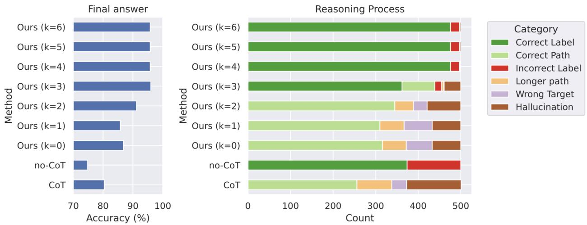
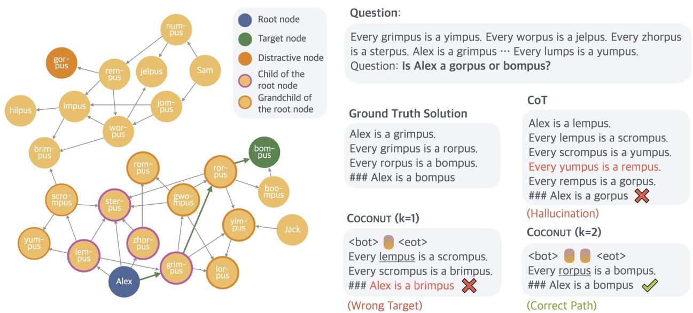
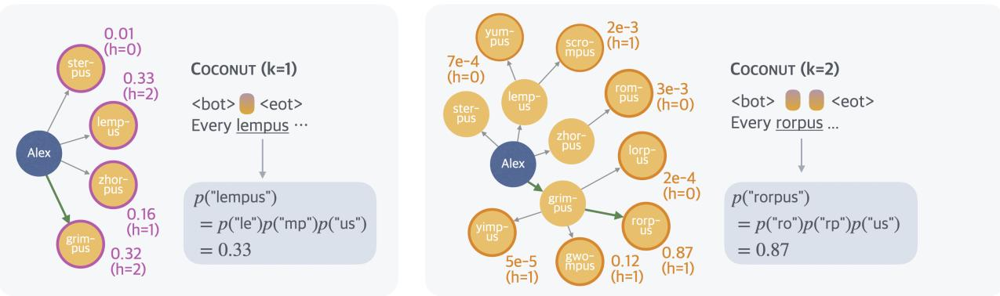
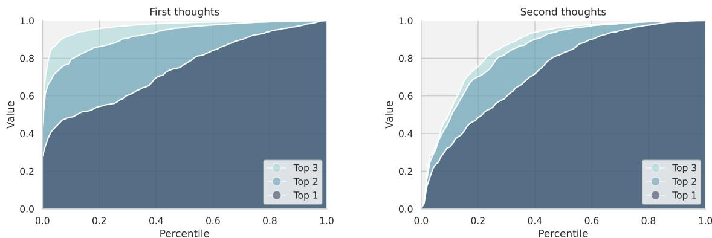
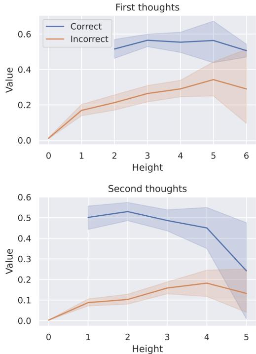

[← 返回 README](../README.md)

# 4 Continuous Space Enables Latent Tree Search

## 📌 预览
Coconut 最核心的分析章节：在 ProsQA 上展示 latent reasoning 的优势，通过 probing 揭示 BFS 涌现机制。包含 ProsQA 数据集设计、k-variant 消融、tree search 可视化和理论解释。

---

In this section, we provide a proof of concept of the advantage of continuous latent space reasoning. On ProsQA, a new dataset that requires extensive planning ability, Coconut outperforms language space CoT reasoning. Interestingly, our analysis indicates that the continuous representation of reasoning can encode multiple alternative next reasoning steps. This allows the model to perform a breadth-first search (BFS) to solve the problem, instead of prematurely committing to a single deterministic path like language CoT.

We start by introducing the experimental setup (Section 4.1). By leveraging Coconut's ability to switch between language and latent space reasoning, we are able to control the model to interpolate between fully latent reasoning and fully language reasoning and test their performance (Section 4.2). This also enables us to interpret the latent reasoning process as tree search (Section 4.3). Based on this perspective, we explain why latent reasoning can help LLMs make better decisions (Section 4.4).

> 💡 **章节结构**: 4.1 实验设置 → 4.2 结果总览 → 4.3 BFS 可视化分析 → 4.4 理论解释。这是一个非常漂亮的 "现象 → 分析 → 解释" 叙事结构。

---

## 4.1 Experimental Setup

> 💡 **4.1 要点预览**: ProsQA 数据集设计 + GPT-2 base model + k-variant 控制实验。

**Dataset.** We introduce ProsQA (Proof with Search Question-Answering), a new logical reasoning dataset. A visualized example is shown in Figure 4. Each instance in ProsQA consists of a directed acyclic graph (DAG) of logical relationships between concepts, presented as natural language statements. The task requires models to determine logical relationships by finding valid paths through this graph, demanding sophisticated planning and search strategies. Unlike previous logical reasoning datasets like ProntoQA (Saparov and He, 2022), ProsQA's DAG structure introduces complex exploration paths, making it particularly challenging for models to identify the correct reasoning chain. More comprehensive details about the dataset construction and characteristics can be found in Appendix A.

> 💡 **ProsQA vs ProntoQA**:
> - **ProntoQA**: 线性推理链（A→B→C→D），不需要搜索，只需要正确 follow 规则
> - **ProsQA**: DAG 结构，有分支和死胡同，必须搜索和回溯才能找到正确路径
> - 这就是为什么 CoT 在 ProntoQA 上很好（98.8%）但在 ProsQA 上不行（77.5%）——贪心的 token-by-token 生成无法回溯

**Setup.** We use a pre-trained GPT-2 model as the base model for all experiments. The learning rate is set to $1 \times 10^{-4}$ while the effective batch size is 128. We train a Coconut model following the training procedure in Section 3. Since the maximum reasoning steps in ProsQA is 6, we set the number of training stages to $N = 6$ in the training procedure. In each stage, we train the model for 5 epochs, and stay in the last stage until the 50 epochs. The checkpoint with the best accuracy in the last stage is used for evaluation.

As reference, we report the performance of (1) *CoT*: the model is trained with CoT data, and during inference, the model will generate a complete reasoning chain to solve the problem. (2) *no-CoT*: the model is trained with only the question and answer pairs, without any reasoning steps. During inference, the model will output the final answer directly.

To understand the properties of latent and language reasoning space, we manipulate the model to switch between fully latent reasoning and fully language reasoning, by manually setting the position of the `<eot>` token during inference. When we enforce Coconut to use $k$ continuous thoughts, the model is expected to output the remaining reasoning chain in language, starting from the $k + 1$ step. In our experiments, we test variants of Coconut on ProsQA with $k \in \{0, 1, 2, 3, 4, 5, 6\}$. Note that all these variants only differ in inference time while sharing the same model weights.

> 💡 **k-variant 实验设计很巧妙**: 同一个模型，推理时通过控制 `<eot>` 位置来调节 latent/language 的比例。$k=0$ 是纯 language reasoning，$k=6$ 是纯 latent reasoning。这让我们可以在同一个模型上连续观察 latent reasoning 的效果。

**Metrics.** We apply two sets of evaluation metrics. One of them is based on the correctness of the final answer, regardless of the reasoning process. It is also the main metric used in the later sections (Section 5.3). To enable fine-grained analysis on ProsQA, we define another metric on the reasoning process. We classify a reasoning chain into (1) Correct Path: The output is one of the shortest paths to the correct answer. (2) Longer Path: A valid path that correctly answers the question but is longer than the shortest path. (3) Hallucination: The path includes nonexistent edges or is disconnected. (4) Wrong Target: A valid path in the graph, but the destination node is not the one being asked. These four categories naturally apply to the output from Coconut ($k = 0$) and *CoT*, which generate the full path. For Coconut with $k > 0$ that outputs only partial paths in language (with the initial steps in continuous reasoning), we classify the reasoning as a Correct Path if a valid explanation can complete it. Also, we define Longer Path and Wrong Target for partial paths similarly. If no valid explanation completes the path, it's classified as Hallucination. In no-CoT and Coconut with larger $k$, the model may only output the final answer without any partial path, and it falls into (5) Correct Label or (6) Incorrect Label. These six categories cover all cases without overlap.

> 💡 **六类评估指标**: 除了答案对错，还细分了推理过程的质量。特别有用的是区分 Hallucination（编造不存在的边）和 Wrong Target（路径有效但目标错误）——这两类错误恰好是 CoT 贪心搜索的典型失败模式。

---

## 4.2 Overall Results

*Figure 3: The accuracy of final answer (left) and reasoning process (right) of multiple variants of Coconut and baselines on ProsQA.*

> 💡 **Figure 3 批读**:
> - **左图 (Answer Accuracy)**: 随着 $k$ 增大（更多 latent reasoning），准确率稳步提升。$k=6$（纯 latent）达到最高。CoT 只有约 77%。
> - **右图 (Reasoning Process)**: 随 $k$ 增大，Hallucination 和 Wrong Target 大幅减少，Correct Path/Label 大幅增加。
> - **关键信息**: latent reasoning 不仅提高最终准确率，更重要的是减少了推理过程中的错误——模型不再胡编乱造。

Figure 3 presents a comparative analysis of various reasoning methods evaluated on ProsQA. The model trained using *CoT* frequently hallucinates non-existent edges or outputs paths leading to incorrect targets, resulting in lower answer accuracy. In contrast, Coconut, which leverages continuous space reasoning, demonstrates improved accuracy as it utilizes an increasing number of continuous thoughts. Additionally, the rate of correct reasoning processes (indicated by "Correct Label" and "Correct Path") significantly increases. At the same time, there is a notable reduction in instances of "Hallucination" and "Wrong Target," issues that typically emerge when the model makes mistakes early in the reasoning process.

*Figure 4: A case study of ProsQA. The model trained with CoT hallucinates an edge (Every yumpus is a rempus) after getting stuck in a dead end. Coconut (k=1) outputs a path that ends with an irrelevant node. Coconut (k=2) solves the problem correctly.*

> 💡 **Figure 4 批读（Case Study）**:
> - **CoT 失败模式**: 走到死胡同后，编造一条不存在的边 "Every yumpus is a rempus" 来强行继续。这就是 autoregressive 的致命缺陷——一旦 commit 了错误方向，只能硬着头皮走下去。
> - **Coconut k=1**: 1 步 latent reasoning 不够，输出的路径终点是无关节点。
> - **Coconut k=2**: 2 步 latent reasoning 后，模型成功找到正确路径。
> - **关键洞察**: Coconut 的 latent reasoning 让模型在 "下笔" 之前有机会充分探索，避免过早 commit。

An intuitive demonstration of the limitations of reasoning in language space is provided by the case study depicted in Figure 4. As shown, models operating in language space often fail to plan ahead or backtrack. Once they commit to an incorrect path, they either hallucinate unsupported edges or terminate with irrelevant conclusions. In contrast, latent reasoning avoids such premature commitments by enabling the model to iteratively refine its decisions across multiple reasoning steps. This flexibility allows the model to progressively eliminate incorrect options and converge on the correct answer, ultimately resulting in higher accuracy.

---

## 4.3 Interpreting the Latent Reasoning as Tree Search

> 💡 **4.3 要点预览**: 通过 probing continuous thought，揭示模型内部同时维护多个候选路径 → BFS-like 行为。

To better understand Coconut, we probe the latent reasoning process by forcing the model to explicitly generate language reasoning steps following intermediate continuous thoughts (Figure 5). Using the example presented in Figure 4, at the initial reasoning step, the model must select which immediate child node of "Alex" to consider next, specifically from the set {"lempus", "sterpus", "zhorpus", "grimpus"}. The distribution over these candidate next steps is visualized in Figure 5, left. In the subsequent reasoning step, these nodes expand further into an extended set of potential paths, including all grandchildren of "Alex" (Figure 5, right).

*Figure 5: An illustration of the latent search trees. The height of a node (denoted as h in the figure) is defined as the longest distance to any leaf nodes in the graph. We show the probability of the first concept predicted by the model following latent thoughts. This metric can be interpreted as an implicit value function estimated by the model, assessing the potential of each node leading to the correct answer.*

> 💡 **Figure 5 批读（BFS 涌现的核心证据）**:
> - **左图（第 1 步 latent thought 后 probe）**: 4 个候选子节点都有非零概率——lempus (0.33), sterpus (0.21), zhorpus (0.14), grimpus (0.32)。模型没有 commit 到任何一个！
> - **右图（第 2 步 latent thought 后 probe）**: 扩展到孙子节点级别，rorpus (grimpus 的子节点) 获得最高概率 0.87。
> - **关键发现**: 
>   - 第 1 步中 lempus 概率最高 (0.33)，但第 2 步模型选择了 grimpus 的后代 rorpus。这**不是贪心搜索**！
>   - 模型先广度探索 (BFS)，再根据更深层信息做决策——就像人类先 "扫一眼" 所有选项再深入
>   - Probing 出的概率分布可以理解为 **implicit value function**——评估每个节点通向正确答案的潜力

We define the predicted probability of a concept following continuous thoughts as a value function (Figure 5), estimating each node's potential for reaching the correct target. Interestingly, the reasoning strategy employed by Coconut is not greedy search: while "lempus" initially has the highest value (0.33) at the first reasoning step (Figure 5, left), the model subsequently assigns the highest value (0.87) to "rorpus," a child of "grimpus," rather than following "lempus" (Figure 5, right). This characteristic resembles a breadth-first search (BFS) approach, contrasting sharply with the greedy decoding typical of traditional CoT methods. The inherent capability of continuous representations to encode multiple candidate paths enables the model to avoid making immediate deterministic decisions. Importantly, this tree search pattern is not limited to the illustrated example, but constitutes a fundamental mechanism underlying the consistent improvement observed with larger values of $k$ in Coconut.

*Figure 6: Analysis of parallelism in the first two steps of the latent tree search. The three curves in each panel depict the cumulative value of the top-1, top-2, and top-3 candidate nodes.*

> 💡 **Figure 6 批读（并行度分析）**:
> - **左图（第 1 步）**: top-1/top-2/top-3 之间有明显间隔 → 概率分散在多个候选上 → 高并行度，广度探索
> - **右图（第 2 步）**: 间隔收窄 → 概率集中到少数候选 → 从广度探索转向深度聚焦
> - **这就是 BFS 的两阶段**: 先展开（explore），再收敛（exploit）
> - 统计上，这个模式在整个测试集上一致出现，不是个例

Figure 6 presents an analysis of the parallelism in the model's latent reasoning across the first and second thoughts. For the first thoughts (left panel), the cumulative values of the top-1, top-2, and top-3 candidate nodes are computed and plotted against their respective percentiles across the test set. The noticeable gaps between the three lines indicate that the model maintains significant diversity in its reasoning paths at this stage, suggesting a broad exploration of alternative possibilities. In contrast, the second thoughts (right panel) show a narrowing of these gaps. This trend suggests that the model transitions from parallel exploration to more focused reasoning in the second latent reasoning step, likely as it gains more certainty about the most promising paths.

---

## 4.4 Why is Latent Space Better for Planning?

> 💡 **4.4 要点预览**: 为什么延迟决策有帮助？因为离目标越远的节点越难准确评估 → 先探索再决策能获得更准确的 value 估计。

Building upon the tree search perspective, we further examine why latent reasoning benefits planning tasks—specifically, why maintaining multiple candidate paths and postponing deterministic decisions enhances reasoning performance. Our hypothesis is that nodes explored in the early reasoning stages are inherently more challenging to evaluate accurately because they are farther from the final target nodes. In contrast, nodes positioned closer to potential targets, having fewer subsequent exploration possibilities, can be assessed accurately with higher confidence.

*Figure 7: The correlation between the predicted value of correct/incorrect nodes and their heights.*

> 💡 **Figure 7 批读（value 准确度 vs 节点高度）**:
> - **横轴**: 节点高度（到叶节点的最长距离），越高 = 离目标越远
> - **正确节点**（蓝色）: 高度低时 value 接近 1.0（confident correct），高度高时 value 较低且不确定
> - **错误节点**（红色）: 高度低时 value 接近 0（confident incorrect），高度高时 value 较高（不确定）
> - **关键结论**: 远处的节点难以评估好坏，近处的节点很容易区分 → 所以延迟决策（多做几步再 commit）能显著提高准确率
> - 这也解释了为什么 CoT 的贪心策略在需要搜索的任务上容易失败：它在信息最不充分时就被迫做决策

To systematically test this, we define the height of a node as its shortest distance to any leaf node and analyze the relationship between node height and the model's estimated value. Ideally, a correct node—one that can lead to the target node—should receive a high estimated value, whereas an incorrect node—one that cannot lead to the target node—should receive a low value. Empirical results across the test set (Figure 7) support our hypothesis: nodes with lower heights consistently receive more accurate and definitive probability evaluations. Conversely, nodes with greater heights exhibit more ambiguous evaluations, reflecting increased uncertainty.

These findings underscore the advantage of latent space reasoning. By delaying deterministic decisions and allowing exploration to proceed toward terminal states, latent reasoning significantly enhances the model's ability to differentiate correct paths from incorrect ones, thereby improving performance on complex, planning-intensive tasks compared to traditional greedy methods.

> 💡 **与 MemGen 的联系**: Coconut 证明了 latent space 可以 "延迟决策 + 多路径探索"。MemGen 进一步扩展了这个思想——latent memory 不仅延迟一次推理内的决策，还能跨 episode 保持探索信息，让模型在多次交互中逐步收敛到正确策略。

---

## 🔖 Section 总结

### 关键数字速查
| 指标 | 数值 |
|------|------|
| ProsQA Coconut (k=6) | ~97% acc |
| ProsQA CoT | 77.5% acc |
| Base model | GPT-2 |
| 最大推理步数 | 6 |
| DAG 平均节点数 | 23.0 |
| DAG 平均边数 | 36.0 |

### 核心洞察
1. **BFS 涌现**: continuous thought 同时编码多个候选路径，probing 可验证
2. **探索→聚焦**: 第 1 步高并行度（广度），第 2 步收敛（深度）
3. **延迟决策优势**: 远处节点难评估，近处节点易区分 → 多走几步再 commit 更好
4. **CoT 失败模式**: 贪心 commit → 死胡同 → hallucinate 不存在的边
5. **k 越大越好**: 更多 latent thought → 更充分的探索 → 更高准确率
