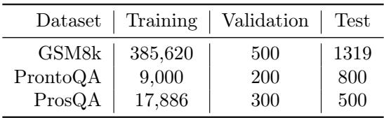
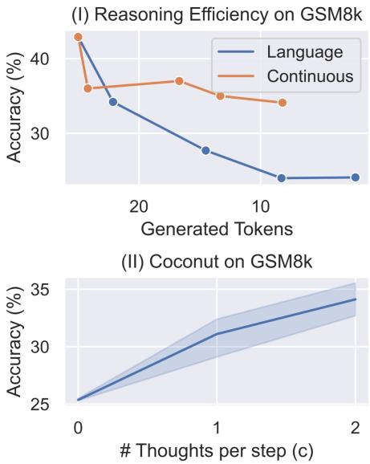
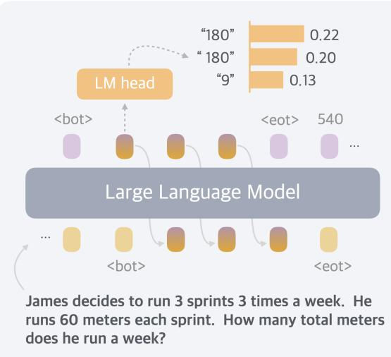

[← 返回 README](../README.md)

# 5 Empirical Results with Coconut

## 📌 预览
三个数据集的综合实验：GSM8k (数学)、ProntoQA (简单逻辑)、ProsQA (复杂逻辑)。核心发现：continuous thought 有效增强推理、效率更高、课程训练是关键。

---

After analyzing the promising parallel search pattern of Coconut, we validate the feasibility of LLM reasoning in a continuous latent space through more comprehensive experiments, highlighting its better reasoning efficiency over language space, as well as its potential to enhance the model's expressivity with test-time scaling.

---

## 5.1 Experimental Setup

**Math Reasoning.** We use GSM8k (Cobbe et al., 2021) as the dataset for math reasoning. It consists of grade school-level math problems. To train the model, we use a synthetic dataset generated by Deng et al. (2023). We use two continuous thoughts for each reasoning step (i.e., $c = 2$). The model goes through 3 stages besides the initial stage. We then include an additional stage where still $3 \times c$ continuous thoughts are used as in the previous stage, but with all the remaining language reasoning chain removed. This handles the long-tail distribution of reasoning chains longer than 3 steps. We train the model for 6 epochs in the initial stage, and 3 epochs in each remaining stage.

> 💡 **GSM8k 训练细节**:
> - $c = 2$: 每个 language step → 2 个 continuous thoughts（数学推理更复杂，需要更多 latent capacity）
> - 3+1 stages: 前 3 个 step 逐步替换 + 额外 1 stage 处理长尾（>3 步的推理链）
> - 额外 stage 很聪明：直接删掉所有剩余 language chain，不再逐步替换

**Logical Reasoning.** Logical reasoning involves the proper application of known conditions to prove or disprove a conclusion using logical rules. We use the ProntoQA (Saparov and He, 2022) dataset, and our newly proposed ProsQA dataset, which is more challenging due to more distracting branches. We use one continuous thought for every reasoning step (i.e., $c = 1$). The model goes through 6 training stages in addition to the initial stage, because the maximum number of reasoning steps is 6 in these two datasets. The model then fully reasons with continuous thoughts to solve the problems in the last stage. We train the model for 5 epochs per stage.

For all datasets, after the standard schedule, the model stays in the final training stage, until reaching 50 epochs. We select the checkpoint based on the accuracy on the validation set. For inference, we manually set the number of continuous thoughts to be consistent with their final training stage. We use greedy decoding for all experiments.

---

## 5.2 Baselines and Variants of Coconut

We consider the following baselines: (1) CoT, and (2) No-CoT, which were introduced in Section 4. (3) *iCoT* (Deng et al., 2024): The model is trained with language reasoning chains and follows a carefully designed schedule that "internalizes" CoT. As the training goes on, tokens at the beginning of the reasoning chain are gradually removed until only the answer remains. During inference, the model directly predicts the answer. (4) *Pause token* (Goyal et al., 2023): The model is trained using only the question and answer without a reasoning chain. However, different from No-CoT, special `<pause>` tokens are inserted between the question and answer, which provides the model with additional computational capacity to derive the answer. The number of `<pause>` tokens is set the same as continuous thoughts in Coconut.

> 💡 **Baseline 设计的公平性**:
> - Pause token 和 Coconut 用相同数量的额外 token → 控制计算量
> - iCoT 和 Coconut (w/o thought) 用类似的渐进训练策略 → 控制训练方法
> - 这样可以精确归因：Coconut 的提升来自 continuous thought 本身，还是课程训练

We also evaluate some variants of Coconut: (1) *w/o curriculum*, which directly trains the model in the last stage. The model uses continuous thoughts to solve the whole problem. (2) *w/o thought*: We keep the multi-stage training, but don't add any continuous latent thoughts. While this is similar to *iCoT* in the high-level idea, the exact training schedule is set to be consistent with Coconut, instead of *iCoT*, for a strict comparison. (3) *Pause as thought*: We use special `<pause>` tokens to replace the continuous thoughts, and apply the same multi-stage training curriculum as Coconut.

---

## 5.3 Results and Discussion

*Table 1: Results on three datasets: GSM8k, ProntoQA and ProsQA. Higher accuracy indicates stronger reasoning ability, while generating fewer tokens indicates better efficiency.*

> 💡 **Table 1 批读（核心结果）**:
> 
> | 方法 | GSM8k | ProntoQA | ProsQA | 要点 |
> |------|-------|----------|--------|------|
> | CoT | 42.9% | 98.8% | 77.5% | token 多，ProsQA 表现差 |
> | No-CoT | 16.5% | 93.8% | 76.7% | 最快但最差 |
> | iCoT | 30.0% | 99.8% | 98.2% | 内化 CoT，逻辑推理很强 |
> | Pause Token | 16.4% | 77.7% | 75.9% | 无用，甚至比 No-CoT 差 |
> | **Coconut** | **34.1%** | **99.8%** | **97.0%** | 逻辑推理接近 iCoT，数学优于 iCoT |
> | w/o curriculum | 14.4% | 52.4% | 76.1% | **课程训练是关键！** |
> | w/o thought | 21.6% | 99.9% | 95.5% | 课程本身也有价值 |
> | pause as thought | 24.1% | 100% | 96.6% | pause + 课程也不错 |
> 
> **三个核心发现**:
> 1. Coconut > No-CoT (continuous thought 有用)
> 2. Coconut w/o curriculum 崩塌 (课程训练必不可少)
> 3. Coconut > Pause token (hidden state >> 固定 embedding)

We show the overall results in Table 1. Using continuous thoughts effectively enhances LLM reasoning over the No-CoT baseline. For example, by using 6 continuous thoughts, Coconut achieves $34.1\%$ accuracy on GSM8k, which significantly outperforms No-CoT ($16.5\%$). We highlight several key findings below.

### "Chaining" continuous thoughts enhances reasoning

Language CoT proves to increase the effective depth of LLMs and enhance their expressiveness (Feng et al., 2023). Thus, generating more tokens serves as a way to inference-time scaling for reasoning (Guo et al., 2025; Snell et al., 2024). This desirable property holds naturally for Coconut too. On GSM8k, Coconut outperformed other architectures trained with similar strategies, including Coconut (pause as thought) and Coconut (w/o thought). Particularly, it surpasses the latest baseline *iCoT* (Deng et al., 2024), which requires a more carefully designed training schedule.

Additionally, we experimented with adjusting the hyperparameter $c$, which controls the number of latent thoughts corresponding to one language reasoning step (Figure 8, II). As we increased $c$ from 0 to 1 to 2, the model's performance steadily improved. This further validates the potential of continuous thoughts to scale up to harder problems. In two other synthetic tasks, we found that the variants of Coconut (w/o thoughts or pause as thought), and the *iCoT* baseline also achieve impressive accuracy. This indicates that the model's computational capacity may not be the bottleneck in these tasks. In contrast, GSM8k involves more complex contextual understanding and modeling, placing higher demands on computational capability.

> 💡 **Scaling 潜力**: $c$ 从 0→1→2 性能稳步提升 → 更多 continuous thought = 更强推理能力 → test-time scaling 的新方式。不过 $c=3$ 会不稳定（Appendix C.1），说明不能简单堆叠，需要更好的训练策略。

*Figure 8: Efficiency comparison of reasoning space and Coconut with different c.*

> 💡 **Figure 8 批读**:
> - **左图 (I)**: GSM8k 上 accuracy vs token 数。Language CoT 一旦 internalize 几步就急剧掉性能，而 Coconut 用 continuous thought 替换后性能下降缓慢。**同样 token 数下，Coconut 的 accuracy 远高于 internalized CoT**。
> - **右图 (II)**: $c=0,1,2$ 的对比，$c$ 越大性能越好，但 token 数也增加。
> - **核心信息**: continuous thought 是比 language token 更高效的推理表示。

### Continuous thoughts are efficient representations of reasoning

Compared to traditional CoT, Coconut generates fewer tokens while achieving higher accuracy on ProntoQA and ProsQA (Table 1). Although Coconut does not surpass *CoT* on GSM8k, it offers a superior trade-off between reasoning efficiency and accuracy (Figure 8, I). To illustrate this, we train a series of CoT models that progressively "internalize" (Deng et al., 2024) the initial $m = \{0, 1, 2, 3, \text{ALL}\}$ reasoning steps, and plot their accuracy versus the number of generated tokens (labeled as "language" in the figure). These models quickly lose accuracy as more reasoning steps are skipped. In contrast, by applying Coconut training strategy—replacing each language reasoning step with two continuous thoughts—the accuracy drop is substantially mitigated, maintaining higher performance even when fewer tokens are generated.

Another interesting observation is that, when we decode the first continuous thought, it often corresponds to possible intermediate variables in the calculation (Figure 9). This also suggests that the continuous thoughts are more efficient representations of reasoning.

*Figure 9: Decoding a continuous thought into language tokens in a math word problem. The decoded tokens correspond to intermediate variables that help solve the problem.*

> 💡 **Figure 9 批读**: 对 continuous thought 做 probing（softmax(Wh)），解码出的 token 是中间计算变量（如算式中间结果）。说明 continuous thought 确实在做有意义的推理，不是 noise。而且它可以用一个 hidden state 编码多个信息，比写出完整的 "Step 1: 4 - 2 = 2" 高效得多。

### The LLM still needs guidance to learn latent reasoning

In the ideal case, the model should learn the most effective continuous thoughts automatically through gradient descent on questions and answers (i.e., Coconut *w/o curriculum*). However, from the experimental results, we found the models trained this way do not perform any better than no-CoT.

On the contrary, with the multi-stage curriculum, Coconut is able to achieve top performance across various tasks. The multi-stage training also integrates well with pause tokens (Coconut- pause as thought). Despite using the same architecture and similar multi-stage training objectives, we observed a small gap between the performance of *iCoT* and Coconut (w/o thoughts). The finer-grained removal schedule (token by token) and a few other tricks in *iCoT* may ease the training process. We leave combining *iCoT* and Coconut as future work. While the multi-stage training used for Coconut has proven effective, further research is definitely needed to develop better and more general strategies for learning reasoning in latent space, especially without the supervision from language reasoning chains.

> 💡 **课程训练的必要性**:
> - w/o curriculum: GSM8k 14.4%（比 No-CoT 还差！）→ 直接从头学 latent reasoning 几乎不可能
> - 必须先有 language CoT 作为 "脚手架"，再逐步过渡到 latent space
> - 这和人类学习类似：先学会用语言描述推理过程，再内化为直觉
> - **对 MemGen 的启示**: MemGen 的 latent memory 也需要类似的引导策略——不能指望模型从零学会生成有用的 latent memory

---

## 🔖 Section 总结

### 关键数字速查
| 配置 | 值 |
|------|-----|
| GSM8k: Coconut vs CoT | 34.1% vs 42.9% |
| ProsQA: Coconut vs CoT | 97.0% vs 77.5% |
| ProsQA token 效率 | 14.2 vs 49.4 tokens |
| 最优 $c$ | 2 (GSM8k), 1 (逻辑推理) |
| w/o curriculum GSM8k | 14.4% (崩塌) |

### 核心洞察
1. **Continuous thought 有效**: 显著优于 No-CoT，证明 latent reasoning 可行
2. **效率优势**: 同等 token 数下远优于 internalized CoT
3. **课程训练不可或缺**: 没有 language CoT 引导，latent reasoning 学不起来
4. **$c$ 可 scale**: 更多 continuous thought → 更好性能，但有稳定性上限
5. **GSM8k 仍不如 CoT**: 数学推理更依赖精确的符号操作，latent space 的优势不如在规划任务上明显
