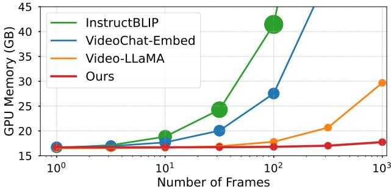

[← 返回 README](../README.md)

# 1. Introduction

## 📌 预览
详细展开问题（LLM context limit + GPU memory）、现有方案的缺陷（concat/avg pool/extra Q-Former），引出 MA-LMM 的 memory bank 设计 + 三大贡献。

---

*Figure 1. (a) We propose the long-term memory bank to auto-regressively store and accumulate past video information, different from previous methods directly feeding the visual encoder's outputs into the querying transformer. (b) GPU memory and token number v.s. video frame length of multimodal methods and MA-LMM during inference. Circle sizes represent the number of text tokens.*

> 💡 **Figure 1 批读**:
> - **(a)** 左侧是传统方案：所有帧特征直接 concat 送入 Q-Former。右侧是 MA-LMM：逐帧处理，memory bank 缓存历史。
> - **(b)** 关键图：随着帧数增加，传统方法 GPU memory 和 token 数线性增长，而 MA-LMM **保持恒定**。这就是核心优势。

---

Large language models (LLMs) have gained significant popularity in the natural language processing field. By pretraining on large-scaled textual data, LLMs (e.g. GPT [1–4], LLaMA [5, 6]) have demonstrated remarkable abilities to perform both generative and discriminative tasks with a unified framework. Recently, there has been a growing interest in utilizing LLMs on multimodal tasks. By integrating LLMs with visual encoders, they can take images and videos as input and show incredible capabilities in various visual understanding tasks, such as captioning, question answering [7–13], classification, detection, and segmentation [14–20].

> 💡 **批注**: 标准 LLM → multimodal LLM 的发展背景。

---

To handle video inputs, some prior large multimodal models [7, 9] directly feed the concatenated query embeddings of each frame along the temporal axis into LLMs. However, the inherent context length limitation of LLMs and GPU memory consumption restrict the number of video frames that can be processed. For example, LLaMA has a context length limitation of 2048 while large multimodal models like LLaVA [8] and BLIP-2 [7, 9] take in 256 and 32 tokens per image respectively. Therefore, this design is not practical and feasible when video duration is much longer (e.g. movies and TV shows). To address these issues, a naive solution is to apply average pooling along the temporal axis like VideoChatGPT [21], but this leads to inferior performances as it lacks explicit temporal modeling. An alternative method involves adding a video modeling component to capture temporal dynamics, as seen in Video-LLaMA [12], which employs an extra video querying transformer (Q-Former) to obtain video-level representation. However, this design adds model complexities, increases the training parameters, and is not suitable for online video analysis.

> 💡 **问题分析**:
> | 方案 | 缺点 |
> |------|------|
> | Concat query embeddings | LLM context 爆了（LLaMA 2048 tokens，LLaVA 256/img → 8 帧就满了）|
> | Average pooling (VideoChatGPT) | 丢失时序信息 |
> | Extra Video Q-Former (Video-LLaMA) | 模型复杂度高 + 不支持在线 |
>
> 这三种方案分别代表：暴力 concat、压缩丢信息、增加模块。MA-LMM 选了第四条路：**在线处理 + 记忆**。

---

With these in mind, we introduce a Memory-Augmented Large Multimodal Model (MA-LMM), aiming for efficient and effective long-term video modeling. MA-LMM adopts a structure similar to existing large multimodal models [7, 9, 12], which comprise a visual encoder to extract visual features, a querying transformer to align the visual and text embedding spaces, and a large language model. As illustrated in Figure 1(a), as opposed to directly feeding visual encoder outputs to the querying transformer, we opt for an online processing approach that takes video frames sequentially and stores the video features in the proposed long-term memory bank. This strategy of sequentially processing video frames and leveraging a memory bank significantly reduces the GPU memory footprint for long video sequences. It also effectively addresses the constraints posed by the limited context length in LLMs as demonstrated in Figure 1(b). Our design provides a solution for long-term video understanding with large multimodal models with great advantages over prior approaches [7, 9, 12, 13, 21] which consume huge GPU memory and require a large number of input text tokens.

> 💡 **MA-LMM 核心设计**:
> - 架构三件套不变：visual encoder + Q-Former + LLM
> - 创新点：在 Q-Former 内部加 memory bank，**在线逐帧处理**
> - 结果：GPU memory 恒定，LLM 输入 token 恒定（32 tokens 而非 32×T）

---

The core contribution of our approach is the introduction of a long-term memory bank that captures and aggregates historical video information. Specifically, the memory bank aggregates past video features in an auto-regressive manner, which can be referenced during subsequent video sequence processing. Also, our memory bank is designed to be compatible with the Q-Former, where it acts as the key and value in the attention operation for long-term temporal modeling. As a result, it can be seamlessly integrated into existing large multimodal models in an off-the-shelf manner to enable long-term video modeling ability. To further enhance efficiency, we propose a memory bank compression method that maintains the length of the memory bank constant relative to the input video length. By selecting and averaging the most similar adjacent frame features, it can preserve all the temporal information while significantly reducing the temporal redundancies in long videos.

> 💡 **技术要点**:
> - Memory bank 作为 attention 的 **K/V**，learned query 作为 **Q** → 标准 cross-/self-attention
> - **Memory Bank Compression (MBC)**: 合并最相似的相邻帧特征 → 恒定长度
> - 灵感来自 Token Merging [24]，但应用在时间轴上

---

We summarize our main contributions as follows:

- We introduce a novel long-term memory bank design to enhance existing large multimodal models, equipping them with long-term video modeling capability.
- Our model significantly reduces the GPU memory usage and addresses LLMs' context length limitations by processing video sequences in an online fashion.
- Our approach has achieved new state-of-the-art performances on various downstreaming video tasks, including long-term video understanding, video question answering, and video captioning.

> 💡 **贡献总结**: (1) Memory bank 设计 (2) 在线处理省显存 (3) 多任务 SOTA。三个贡献对应：方法创新 + 效率优势 + 实验验证。

---

## 🔖 Section 总结

### 核心洞察
1. 长视频理解的四种路线：concat（爆 context）、avg pool（丢时序）、extra module（复杂）、**memory bank（MA-LMM）**
2. Memory bank 的 K/V 角色设计使其可以 plug-and-play 嵌入任何基于 Q-Former 的模型
3. MBC 压缩保证恒定计算成本，核心思路是「合并最冗余的」
