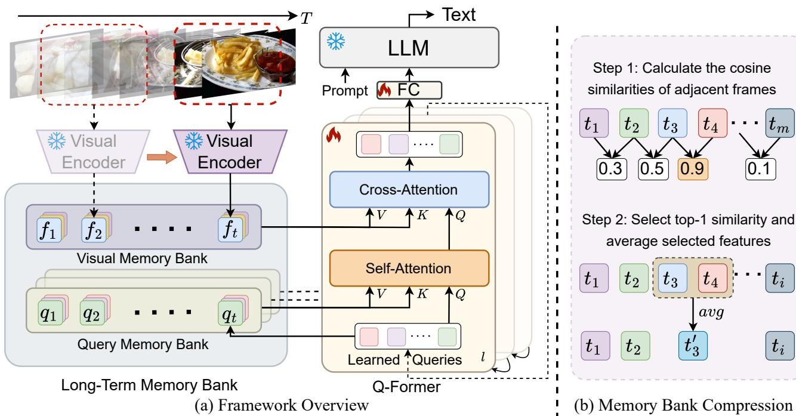

[← 返回 README](../README.md)

# 3. Method

## 📌 预览
**核心 Section**。三部分：(1) Visual Feature Extraction：逐帧提取 + position embedding；(2) Long-term Temporal Modeling：**Visual Memory Bank**（cross-attention 的 K/V）+ **Query Memory Bank**（self-attention 的 K/V）+ **Memory Bank Compression**；(3) Text Decoding：只取最后时刻的 Q-Former 输出，token 数 N×T → N。

---

We introduce MA-LMM, a memory-augmented large multimodal model for long-term video understanding. Instead of processing more frames simultaneously as most video understanding methods [31, 42–49], we propose to auto-regressively process video frames in an online manner, which draws inspiration from the online processing fashion with long-term memory design presented in MeMViT [41]. Figure 2(a) illustrates the overview of our MA-LMM framework. Following similar practices of large multimodal models [7–9, 12], the overall model architecture can be divided into three parts: (1) visual feature extraction with a frozen visual encoder (Sec. 3.1), (2) long-term temporal modeling with a trainable querying transformer (Q-Former) to align the visual and text embedding spaces (Sec. 3.2), and (3) text decoding with a frozen large language model (Sec. 3.3).


*Figure 2. (a) Framework overview. MA-LMM auto-regressively processes video frames in an online manner. Two long-term memory banks are designed to store the raw visual features and learned queries at each timestep, which are used for future reference. The Q-Former is composed of several cascaded blocks, indexed by l. LLM outputs text for various video understanding downstream tasks. The snowflake icon indicates components with fixed parameters, while the flame icon denotes parts of the model that are fine-tuned. (b) Illustration of the memory bank compression technique, which is applied to maintain the length of the memory bank constant.*

> 💡 **Figure 2 批读**:
> - **(a) 架构图**：三个冻结组件（❄️ Visual Encoder、❄️ LLM）+ 一个训练组件（🔥 Q-Former）
>   - **Visual Memory Bank**: 存 raw visual features（每帧 P×C），跨所有 Q-Former block **共享一个**
>   - **Query Memory Bank**: 存 learned queries（每帧 N×C），每个 Q-Former block **各自独立**
>   - 核心：memory bank 作为 **K/V**，当前帧的特征/query 作为 **Q**
> - **(b) MBC 压缩**：找时间轴上最相似的相邻帧 → 平均合并 → 长度减 1
>
> 💡 **与 VisMem 的对比**:
> - VisMem 的 memory 是 **latent space** 中的隐式记忆（特殊 token 触发读写）
> - MA-LMM 的 memory 是 **token-level** 的显式缓存（直接存 feature，用 attention 读取）
> - MA-LMM 更透明可解释，但 VisMem 的隐式记忆可能更灵活

---

## 3.1. Visual Feature Extraction

> 💡 **3.1 要点预览**: 逐帧过 ViT → 加 temporal position embedding → 得到每帧 P×C 的特征。关键是 **sequential processing**，灵感来自人类逐序处理视觉信息的认知过程。

This design draws inspiration from the cognitive processes humans use to handle long-term visual information. Instead of concurrently processing extensive duration of signals, humans process them in a sequential manner, correlate current visual inputs with past memories for comprehension, and selectively retain salient information for subsequent reference [41]. Similarly, our MA-LMM processes video frames sequentially, dynamically associating new frame input with historical data stored in the long-term memory bank, ensuring that only discriminative information is conserved for later use. This selective retention facilitates a more sustainable and efficient approach to video understanding, which further allows the model to automatically support online video reasoning tasks.

> 💡 **批注**: 认知科学类比很合理：人看长视频也不是同时处理所有帧，而是逐帧看 + 记忆。但需注意：人的记忆是 **语义级别** 的（记住"发生了什么"），而 MA-LMM 的 memory bank 是 **feature 级别** 的（存 patch tokens）。VisMem 的短期视觉 + 长期语义设计可能更接近人类认知。

---

Formally, given a sequence of $T$ video frames, we pass each video frame into a pre-trained visual encoder and obtain the visual features $V = [v_1, v_2, .., v_T], v_t \in \mathbb{R}^{P \times C}$, where $P$ is the number of patches for each frame and $C$ is the channel dimension for the extracted frame feature. Then we inject temporal ordering information into the frame-level features by a position embedding layer (PE) as

$$f_t = v_t + PE(t), f_t \in \mathbb{R}^{P \times C}.$$

> 💡 **批注**: Position embedding 是简单的加法注入时序信息。注意 visual encoder 是 **frozen** 的（ViT-G/14 from EVA-CLIP），所以每帧独立提取，没有帧间交互。帧间交互完全由 Q-Former 中的 memory bank 实现。

---

## 3.2. Long-term Temporal Modeling

For aligning the visual embedding to the text embedding space, we use the same architecture as the Querying Transformer (Q-Former) in BLIP-2 [7, 9]. Q-Former takes in the learned queries $z \in \mathbb{R}^{N \times C}$ to capture video temporal information, where $N$ is the number of learned queries, and $C$ is the channel dimension. In our experiments, Q-Former outputs 32 tokens for each image, which is more efficient than 256 tokens produced by LLaVA [8]. Each Q-Former block consists of two attention submodules: (1) cross-attention layer, which interacts with the raw visual embedding extracted from the frozen visual encoder, and (2) self-attention layer, which models interactions within the input queries. Different from the original Q-Former in BLIP-2 that only attends to the current frame's embedding, we design a long-term memory bank consisting of the visual memory bank and the query memory bank, which accumulates the past video information and augments the input to cross- and self-attention layers for effective long-term video understanding.

> 💡 **批注**: Q-Former 的结构回顾：
> ```
> Q-Former Block (×L):
>   ├── Cross-Attention: Q=learned_query, K/V=visual_features
>   └── Self-Attention:  Q=K=V=learned_query
> ```
> MA-LMM 的改造：
> ```
> Q-Former Block (×L):
>   ├── Cross-Attention: Q=z_t, K/V=Visual_Memory_Bank (共享)
>   └── Self-Attention:  Q=z_t, K/V=Query_Memory_Bank (每层独立)
> ```
> **关键区别**: BLIP-2 只看当前帧，MA-LMM 看所有历史帧。

---

### Visual Memory Bank

> 💡 **Visual Memory Bank 要点预览**: 存 raw visual features，做 cross-attention 的 K/V。跨所有 Q-Former block 共享（因为所有 cross-attention 都 attend 到同一组 visual features）。

The visual memory bank stores the raw visual features of each frame extracted from the frozen visual encoder. Specifically, for the current time step $t$, the visual memory bank contains the concatenated list of past visual features $F_t = \text{Concat}[f_1, f_2, .., f_t], F_t \in \mathbb{R}^{tP \times C}$. Given the input query $z_t$, the visual memory bank acts as the key and value as:

$$Q = z_t W_Q, K = F_t W_K, V = F_t W_V.$$

Then we apply the cross-attention operation as:

$$O = \text{Attn}(Q, K, V) = \text{Softmax}\left(\frac{QK^T}{\sqrt{C}}\right)V.$$

In this way, it can explicitly attend to past visual information through the cached visual memory bank with long-term context. Since all the cross-attention layers in the Q-Former attend to the same visual feature, there is only one visual memory bank that is shared across all the Q-Former blocks.

> 💡 **Visual Memory Bank 小结**:
> - **存什么**: 每帧的 raw patch features $f_t \in \mathbb{R}^{P \times C}$（frozen ViT 输出 + PE）
> - **怎么用**: 作为 cross-attention 的 K/V
> - **共享策略**: 所有 Q-Former block 共享一个 → 节省显存
> - **复杂度**: attention 计算 $O(N \times tP)$，随 t 线性增长 → 需要 MBC 压缩
>
> 💡 **与 MemGen 对比**: MemGen 的记忆是 LLM 生成的文本摘要（语义级），MA-LMM 是 feature 级。Feature 级保留更多细节但更冗余。

---

### Query Memory Bank

> 💡 **Query Memory Bank 要点预览**: 存 learned queries（Q-Former 的输入），做 self-attention 的 K/V。**每层独立**（因为 queries 在不同层有不同的抽象级别）。这是 MA-LMM 区别于 MovieChat 等方法的关键创新。

Different from the fixed visual memory bank which stores the raw and static visual features, the query memory bank accumulates input queries of each timestep, represented as $Z_t = \text{Concat}[z_1, z_2, .., z_t], Z_t \in \mathbb{R}^{tN \times C}$. By storing these queries, we maintain a dynamic memory of the model's understanding and processing of each frame up to the current timestep via the Q-Former. The query memory bank also acts as key and value as:

$$Q = z_t W_Q, K = Z_t W_K, V = Z_t W_V.$$

similar to the Eq 2. Then we apply the same attention operation as Eq. 3. At each time step, $z_t$ contains the learned important information specifically for each video till the current timestep $t$. Different from the static visual memory bank, the input queries $z_t$ evolve through cascaded Q-Former blocks during the model training, capturing distinct video concepts and patterns at increasing levels of abstraction. As a result, each self-attention layer has a unique query memory bank, where the contained input queries are updated during the training time.

> 💡 **Query Memory Bank 小结**:
> - **存什么**: 每帧 each layer 的 learned queries $z_t \in \mathbb{R}^{N \times C}$
> - **怎么用**: 作为 self-attention 的 K/V
> - **独立策略**: 每个 Q-Former block 各自维护独立的 query memory bank
> - **关键区别**: Visual MB 是 **static**（raw features 不变），Query MB 是 **dynamic**（queries 随训练演化）
> - **消融结果**: Visual MB > Query MB（Table 6），但两者互补（+14.7% on LVU）
>
> 💡 **Dual Memory 的设计直觉**:
> - Visual MB ≈ "原始感知记忆"（raw pixels → patches）
> - Query MB ≈ "加工后的理解记忆"（经过 attention 提炼的信息）
> - 类比人类：看到红色（感知）→ 理解是红灯（语义）

---

### Memory Bank Compression

> 💡 **MBC 要点预览**: 核心问题是 memory bank 随帧数线性增长。MBC 方案：找 token 级别最相似的相邻帧 → 平均合并 → 长度减 1。优于 FIFO（丢最早信息）和 learnable pooling（额外参数）。

Given that our model directly stores past video information in the memory banks, the GPU memory and computational cost increase linearly as the number of past video frames. This becomes particularly challenging for long videos, and thus it is essential to further compress the memory bank to a smaller size. One conventional approach to managing temporal sequences involves employing a first-in-first-out queue. Here, features from the earliest time step are removed when the memory bank reaches a predefined limit, a strategy utilized in MeMViT [41]. However, it results in the loss of earlier historical information as new frames are added and old features are popped to maintain memory bank capacity. Alternatively, MeMViT employs learnable pooling operators to compress the spatio-temporal size of stored feature in the memory bank, albeit at the cost of introducing additional trainable parameters.

> 💡 **批注**: 三种压缩策略对比：
> | 方法 | 保留早期信息？ | 额外参数？ | 时序不变？ |
> |------|:---:|:---:|:---:|
> | FIFO (MeMViT) | ❌ | ❌ | ✅ |
> | Learnable pooling (MeMViT) | ✅ | ✅ | ❌ |
> | **MBC (MA-LMM)** | **✅** | **❌** | **✅** |

---

Drawing inspiration from the effectiveness of token merging and pruning techniques showcased in works such as [24, 50–52], we introduce a novel Memory Bank Compression (MBC) technique to exploit temporal redundancies inherent in videos. Our proposed method aggregates and compresses video information over time by leveraging the similarity between adjacent features, thereby retaining early historical information. This approach effectively compresses repetitive information within the memory bank while preserving discriminative features. Notably, several concurrent works [25–27] have similarly embraced the token merging strategies to reduce video redundancies.

Same as MeMViT [41], which applies feature compression at each iteration, our method applies the compression algorithm at each auto-regressive step if the current length of the memory bank exceeds the predefined threshold $M$. Formally, given the visual memory bank containing a list of $[f_1, f_2, .., f_M], f_t \in \mathbb{R}^{P \times C}$, when a new frame feature $f_{M+1}$ comes in, we need to compress the memory bank by reducing the length by 1. At each spatial location $i$, we first calculate the cosine similarity between all the temporally adjacent tokens as

$$s_t^i = \cos(f_t^i, f_{t+1}^i), t \in [1, M], i \in [1, P].$$

Then we select the highest similarity across time, which can be interpreted as the most temporally redundant features:

$$k = \text{argmax}_t(s_t^i).$$

Next, we simply average the selected token features at all the spatial locations to reduce the memory bank length by 1:

$$\hat{f}_k^i = (f_k^i + f_{k+1}^i) / 2.$$

In this way, we can still preserve the most discriminative features while keeping the temporal ordering unchanged as depicted in Figure 2(b). The same procedure is adopted to compress the query memory bank.

> 💡 **MBC 算法总结**:
> ```
> 输入: memory bank [f_1, ..., f_M] + 新帧 f_{M+1}
> 1. 对每个空间位置 i，计算相邻帧的 cosine similarity
> 2. 找最相似的一对 (k, k+1)
> 3. 用平均值替换: f_k ← (f_k + f_{k+1}) / 2，删除 f_{k+1}
> 4. 加入新帧 f_{M+1}
> 输出: memory bank 长度保持 M
> ```
>
> 💡 **关键细节**: argmax 是跨**时间**维度的（对每个空间位置独立）。这意味着不同空间位置可能选择不同的时间对进行合并。但 Eq 7 的合并是对"所有空间位置"统一操作的... 这里有个细节值得注意：实际实现可能是先取 spatial average 再 argmax，然后统一合并整帧。
>
> 💡 **医学影像迁移思考**:
> - CT/MRI 相邻切片的相似度通常很高（解剖结构连续变化），MBC 的 similarity-based merging 天然适用
> - 但医学影像的关键信息可能集中在少数切片（如病变区域），需要确保 MBC 不会过度压缩这些关键帧
> - 可能需要改造：除了 similarity-based merging，还可以加 attention-based importance weighting

---

## 3.3. Text Decoding

As we process video frames in an auto-regressive manner, the Q-Former output at the final timestep contains all historical information, which is then fed into the LLM. Therefore, we can significantly reduce the number of input text tokens from $N * T$ to $N$, addressing the context length limitation of the current LLMs and substantially easing the GPU memory requirements. During training, given a labeled dataset consisting of video and text pairs, our model is supervised with the standard cross entropy loss as:

$$\mathcal{L} = -\frac{1}{S}\sum_{i=1}^{S}\log P(w_i | w_{<i}, V).$$

in which $V$ represents the input video, and $w_i$ is the $i$-th ground-truth text token. During training, we update the parameters of the Q-Former while keeping the weights of both the visual encoder and the language model frozen.

> 💡 **Text Decoding 批读**:
> - **Token 压缩**: N×T → N。对于 100 帧视频，从 3200 tokens → 32 tokens，**100 倍压缩**
> - **训练策略**: 只训练 Q-Former，visual encoder 和 LLM 都 frozen → 训练高效
> - **损失函数**: 标准 cross-entropy，auto-regressive text generation
> - **关键 insight**: 最后一个时刻的 query 已经通过 memory bank 聚合了所有历史信息，所以只需要 N 个 token

---

## 🔖 Section 总结

### 关键数字速查
| 指标 | 数值 |
|------|------|
| Learned queries (N) | 32 |
| Visual encoder | ViT-G/14 (EVA-CLIP), frozen |
| LLM | Vicuna-7B, frozen |
| 可训练参数 | Q-Former only |
| Token 压缩比 | N×T → N (100× for 100 frames) |

### 核心洞察
1. **Dual memory bank** 是核心创新：Visual MB（static, shared）+ Query MB（dynamic, per-layer）
2. **MBC** 通过 similarity-based merging 保持恒定长度，优于 FIFO + learnable pooling
3. 整个设计的美在于 **只改 Q-Former 内部的 attention**，不引入新模块
4. 对医学影像：逐 slice 处理 + memory bank 存历史 slice 信息 → 跨 slice 推理。但需要考虑病变切片的保护机制
