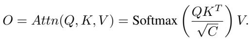
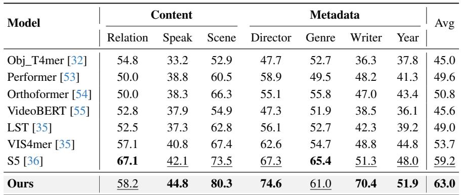
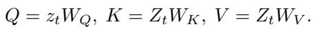
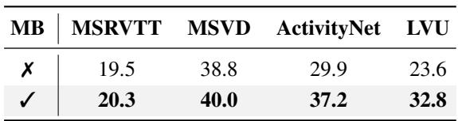
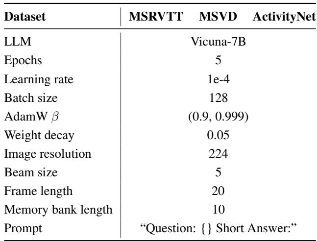
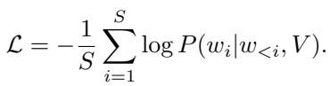
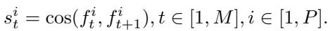
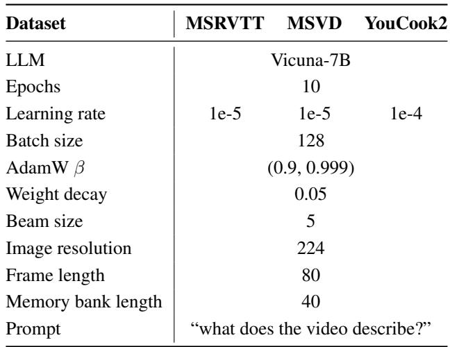
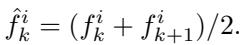

[← 返回 README](../README.md)

# 4. Experiments

## 📌 预览
五个任务验证：(1) Long-term Video Understanding（LVU/Breakfast/COIN，核心）、(2) Video QA、(3) Video Captioning、(4) Online Action Prediction、(5) 消融实验（dual MB 贡献、MBC vs FIFO、memory bank 长度、off-the-shelf）。

---

## 4.1. Tasks and Datasets

To validate the effectiveness of the proposed MA-LMM, we mainly focus on the long-term video understanding task. We also extend the evaluation to standard video understanding tasks (e.g., video question answering, video captioning) to further compare with existing multimodal methods.

**Long-term Video Understanding.** We conduct experiments on three widely used long-term video datasets including LVU [32], Breakfast [56], and COIN [57]. We report the top1 classification accuracy as the evaluation metric. The LVU dataset contains ~30K videos extracted from ~3K movies, with each video lasting 1 to 3 minutes. Given that current large multimodal models generally perform text generation and lack regression capability, we limit our experiments to seven classification tasks: relationship, speaking style, scene, director, genre, writer, and release year. The Breakfast [56] dataset includes videos related to breakfast preparation, which consists of 1712 videos with an average length of around 2.7 minutes. COIN [57] is a large-scale dataset for comprehensive instructional video analysis, which comprises 11827 instructional videos from YouTube, covering 180 distinct tasks in 12 domains related to daily life. The average length of a video is 2.36 minutes.

**Video Question Answering.** We conduct evaluation on three open-ended video question answering datasets including MSRVTT-QA [62], MSVD-QA [62], and ActivityNet-QA [63]. ActivityNet-QA contains long videos with average durations of 2 minutes, while MSRVTT-QA and MSVD-QA consist of short videos with 10-15 seconds duration.

**Video Captioning.** We report the video captioning results of METEOR [64] and CIDEr [65] metrics on three popular datasets: MSRVTT [66], MSVD [67] and Youcook2 [68].

**Online Action Prediction.** We further evaluate the online prediction capability of our model by conducting experiments on the EpicKitchens-100 [69] dataset, which consists of 700 long videos of cooking activities with 100 total hours. It includes 97 verbs, 300 nouns, and 3807 action types. Following the same experimental setting in [70], we report the top-5 accuracy and recall results on the validation dataset.

> 💡 **数据集总结**:
> | 数据集 | 任务 | 视频时长 | 规模 |
> |--------|------|---------|------|
> | LVU | 分类（7 类任务）| 1-3 min | 30K 视频 |
> | Breakfast | 活动分类 | ~2.7 min | 1712 视频 |
> | COIN | 指令分类 | ~2.36 min | 11827 视频 |
> | MSRVTT-QA | VQA | 10-15s | - |
> | MSVD-QA | VQA | 10-15s | - |
> | ActivityNet-QA | VQA | ~2 min | - |
> | EpicKitchens-100 | 在线预测 | 长视频 | 700 视频 |

---

## 4.2. Implementation Details

For the visual encoder, we adopt the pre-trained image encoder ViT-G/14 [71] from EVA-CLIP [72], it can be further changed to other clip-based video encoders. We use the pre-trained Q-Former weights from InstructBLIP [9] and adopt Vicuna-7B [73] as the LLM. All the experiments are conducted on 4 A100 GPUs. More details about training and evaluation are described in the supplementary material.

> 💡 **实现要点**:
> - Visual encoder: ViT-G/14 (EVA-CLIP) — 非常大的 ViT，冻结
> - Q-Former: 从 InstructBLIP 预训练权重初始化 → 不是从头训练
> - LLM: Vicuna-7B（冻结）
> - 硬件: 4× A100 — 训练成本可控

---

## 4.3. Main Results

### Long-term Video Understanding

We compare MA-LMM with previous state-of-the-art (SOTA) methods on the LVU benchmark [32] in Table 1. Notably, MA-LMM outperforms existing long-term video models (S5 [36], ViS4mer [35], VideoBERT [55], and Object Transformer [32]) in both content understanding and metadata prediction tasks. This results in significant improvement in most tasks, enhancing the average top-1 accuracy by 3.8% compared to the S5 [36] model. Unlike previous video-based models which process all video frames simultaneously in an offline manner and predict probabilities for each class, our MA-LMM processes video frames in an online fashion and directly outputs the text label for each class type.

*Table 1. Comparison with state-of-the-art methods on the LVU dataset. Bold and underline represent the top-1 and top-2 results.*

> 💡 **Table 1 批读**:
> - LVU 平均 63.0% vs S5 的 59.2%（+3.8%）
> - **Scene 80.3%** 和 **Director 74.6%** 提升最大 — 这些任务需要长程上下文
> - Relation 58.2% 比 S5 67.1% **低** — 关系理解可能需要更细粒度的时序建模
> - 注意：MA-LMM 是 generative（输出文本标签），其他方法是 discriminative（输出概率），公平性值得讨论

---

We also evaluate our MA-LMM on the Breakfast [56] and COIN [57] datasets that pose a challenge for the long-term video activity classification task. We show the results in Table 2. Our method improves upon the previous best method, S5[36], by 2.3% and 2.4% respectively on the top1 accuracy metric. This result further proves the superior long-term video understanding capability of our approach.

*Table 2. Comparison on the Breakfast and COIN datasets. The top-1 accuracy is reported here.*

> 💡 **Table 2 批读**: Breakfast 93.0%（+2.3%），COIN 93.2%（+2.4%）。这两个数据集视频长度 2-3 分钟，MA-LMM 的优势一致。

---

### Video Question Answering

To compare with existing multimodal video understanding methods, we conduct experiments on the open-ended video question answering datasets in Table 3 to demonstrate the generalization ability of our model. Given that these are mostly short videos, it is expected that our memory bank will be less effective. Interestingly, we observe that our MA-LMM achieves new state-of-the-art performances on the MSRVTT and MSVD datasets while falling short of VideoCoCa's performance on the ActivityNet dataset. On the latter, it is not surprising, since VideoCoCa [81] leverages large-scale video-text datasets for pre-training (e.g., HowTo100M [84] and VideoCC3M [85]) while our MA-LMM uses model weights only pre-trained on the image-text datasets.

*Table 3. Comparison with state-of-the-art methods on the video question answering task. Top-1 accuracy is reported.*

> 💡 **Table 3 批读**:
> - MSRVTT 48.5%, MSVD 60.6%: 短视频也 SOTA！说明 memory bank 不会"hurt"短视频
> - ActivityNet 49.8% < VideoCoCa 56.1%: 预训练数据差异（image-text vs video-text）
> - 大幅超越 Video-LLaMA: MSRVTT +2.0, MSVD +2.3, ActivityNet +4.3

---

Notably, our MA-LMM significantly outperforms the recent LLM-based model Video-LLaMA [12] on all three datasets. Video-LLaMA concatenates all the query embeddings from the frozen image Q-Former and trains an additional video Q-Former from scratch to model temporal dependencies, consuming too much GPU memory to be feasible for long video inputs. In contrast, our MA-LMM simply fine-tunes the weights from the pre-trained image Q-Former without introducing an additional video Q-Former, yet is able to effectively capture temporal relationships by virtue of the long-term memory bank. This result strongly justifies the superiority of our design on the general video question answering task, and reveals that even a few frames and queries captured in the memory banks can have significant beneficial effects.

> 💡 **与 Video-LLaMA 对比**: Video-LLaMA 需要额外的 video Q-Former（从头训练），MA-LMM 只微调 image Q-Former + memory bank → 更简单、更高效、性能更好。

---

### Video Captioning

To further evaluate the capabilities of our MA-LMM in generating free-form text, we conduct experiments on the standard video captioning datasets including MSRVTT [66], MSVD [67] and YouCook2 [68] in Table 4. Although these datasets only consist of videos with short duration and our model is initially pre-trained merely on image-text dataset pairs, our MA-LMM exhibits outstanding performances across all the metrics. It consistently ranks among the top-2 positions compared to current leading methods. Remarkably, our results also surpass the recent Video-LLaMA [12] on these datasets, highlighting the significant improvements our model offers in both video captioning and question-answering tasks.

*Table 4. Comparison with state-of-the-art methods on the video captioning task. METEOR (M) and CIDEr (C) results are reported.*

> 💡 **Table 4 批读**: 全面 top-2，YouCook2 上 CIDEr 131.2 是最高的。仅用 image-text 预训练就能在 video captioning 上这么强，证明 memory bank 设计的通用性。

---

### Online Action Prediction

Since our model can naturally support the online video understanding task, we compare our MA-LMM with Video-LLaMA on the EpicKitchens-100 [69] dataset to investigate the online action prediction capability. In Table 5, our MA-LMM outperforms Video-LLaMA, achieving more accurate results in both top-5 accuracy and recall measures. This highlights our model's superior capacity to anticipate actions in an online manner, showcasing its effectiveness for applications that require real-time analytical capabilities.

*Table 5. Action anticipation results on EpicKitchens-100.*

> 💡 **Table 5 批读**: 在线预测是 MA-LMM 架构的天然优势 — 不需要看完整个视频就能输出。Noun 提升最大（50.7 vs 47.5），说明 memory bank 帮助识别物体。

---

## 4.4. Ablation Studies

### Contribution of each component

To further investigate the contribution of the visual memory bank and query memory bank, we conduct ablation studies in Table 6. Initially, we observe that without any memory bank module, the performances across all three datasets are notably worse, due to the lack of temporal context. The introduction of either memory bank results in substantial improvements, confirming their roles in enhancing the model's ability to understand temporal sequences. We also find that the visual memory bank achieves better performance than the query memory bank. We hypothesize that the explicit method of storing historical raw video features in the visual memory bank is more effective than the query memory bank which implicitly captures video information through the input learned queries. And two memory banks are complementary to each other. When incorporating two memory banks together, our approach can boost the final performance by 14.7%, 18.4%, and 20.9% on the LVU, Breakfast, and COIN, respectively.

*Table 6. Contribution of visual and query memory banks.*

> 💡 **Table 6 批读 — 最重要的消融**:
> | 配置 | LVU | Breakfast | COIN |
> |------|-----|-----------|------|
> | No MB | 48.3 | 74.6 | 72.3 |
> | Visual only | 61.5 | 91.8 | 92.4 |
> | Query only | 58.0 | 81.4 | 88.5 |
> | **Both** | **63.0** | **93.0** | **93.2** |
>
> **核心发现**:
> 1. Visual MB (+13.2 on LVU) > Query MB (+9.7 on LVU) — raw features 比 learned queries 更有效
> 2. 两者互补，合在一起进一步提升
> 3. 没有 MB 时性能大幅下降（LVU 48.3 vs 63.0），说明时序上下文至关重要

---

### Long-term temporal modeling ablation

We compare different temporal modeling approaches in Table 8. In our setup, the Q-Former outputs 32 text tokens per frame. The most straightforward approach for temporal feature integration is either concatenating or averaging frame-level features. However, they resulted in inferior performances. Notably, concatenation requires a significantly higher number of text tokens and computational cost compared to other variants, which also introduces higher GPU memory consumption since they need to takes in all the video frames simultaneously. In addition, we conduct experiments using ToMe [24] to reduce the number of text tokens per frame from 32 to 2. However, without our auto-regressive strategy, it still requires 200 text tokens for 100-frame input. The second part of this table presents the performances of different memory bank compression approaches. The first-in-first-out (FIFO) technique removes the oldest features to main the length of the memory bank fixed, while the memory bank compression (MBC) strategy merges temporally consecutive features with the highest similarity, effectively reducing the most redundant information while keeping the temporal ordering unchanged. With this design that theoretically keeps all historical information, MBC outperforms FIFO by 1.7%, 4.5%, and 2.8% accuracy across three datasets. This experimental result validates the superior efficiency and effectiveness of our approach in modeling long-term temporal information.

*Table 8. Ablation of different temporal modeling methods.*

> 💡 **Table 8 批读 — 时序建模方法对比**:
> | 方法 | #Token | GPU (GB) | LVU |
> |------|--------|----------|-----|
> | Concat | 1920 | 49.2 | 62.6 |
> | Avg Pool | 32 | 21.2 | 57.6 |
> | ToMe | 200 | 22.2 | 61.5 |
> | FIFO | 32 | 19.1 | 61.3 |
> | **MBC** | **32** | **19.1** | **63.0** |
>
> - MBC 以最少的 token 和 GPU 占用达到最高精度
> - Concat 虽然性能不错（62.6），但 token 数 60× 多，GPU 2.5× 多
> - MBC vs FIFO: 同样 32 tokens + 19.1 GB，但 MBC +1.7%（LVU），+4.5%（Breakfast）

---

### Off-the-shelf evaluation

A key advantage of MA-LMM is that our long-term memory bank can be inserted into existing large multimodal models in an off-the-shelf manner, thereby endowing them with effective temporal modeling capabilities without retraining. As presented in Table 7, MA-LMM can consistently boost the final performance when incorporating the long-term memory bank to the baseline method [9]. Particularly, on long-term video datasets like ActivityNet and LVU, MA-LMM can largely improve the results by 7.3% and 9.2%. This highlights the robustness of long-term memory banks in temporal modeling under the off-the-shelf setting.

*Table 7. Contribution of the long-term memory bank (MB) under off-the-shelf evaluation without training.*

> 💡 **Table 7 批读**:
> - **零训练**直接插入 InstructBLIP → ActivityNet +7.3%, LVU +9.2%
> - 这是 MA-LMM 最强的卖点之一：plug-and-play，不需要重新训练
> - 短视频提升较小（MSRVTT +0.8, MSVD +1.2），长视频提升大 — 符合预期

---

### Different language model architectures

Our MA-LMM can utilize different language model architectures including but not limited to encoder-decoder models and decoder-only models. We experimented with two popular models FlanT5-XL [86] and Vicuna-7B [73], and show the results in Table 9 that the Vicuna-7B marginally outperforms the FlanT5-XL on these video tasks.

*Table 9. The comparison of using different LLMs.*

> 💡 **Table 9 批读**: Vicuna-7B 略优于 FlanT5-XL。Decoder-only > Encoder-decoder，与 LLM 发展趋势一致。

---

### Memory bank length ablation

In Figure 3, we conduct experiments to evaluate the effect of varying the memory bank length. Given an input of 100 video frames, the top-1 accuracy first increases as the feature bank length becomes larger. This rise can be attributed to the augmented storage capacity of the memory bank, which can preserve more historical data and consequently boost the final performance. However, we observe that performances begin to saturate when the memory bank length is around 10 to 20. This supports our hypothesis that there are prevalent temporal redundancies in long videos, and we can significantly reduce the frame length without sacrificing the performance.

*Figure 3. Impact of different memory bank lengths.*

> 💡 **Figure 3 批读**:
> - 100 帧视频，memory bank 长度 10-20 就饱和了 → **5-10× 压缩**不损失性能
> - 这说明视频存在大量时间冗余（相邻帧高度相似）
> - **对医学影像的启示**: CT/MRI 相邻切片也高度相似，理论上 memory bank 长度 10-20 也可能足够（假设 ~100 切片输入）

---

## 4.5. Visualization

In Figure 4, we provide a comprehensive visual comparison between MA-LMM and Video-LLaMA [12]. In the video question answering task, MA-LMM exhibits superior memorization and recognition capabilities. Specifically, it can accurately memorize historical information and recognize fine-grained information, such as the color of the man with No.7, and precisely count the number of goalkeepers who appeared in the video. With the auto-regressive design, our model supports online reasoning directly. This capability is further exemplified in our experiments on off-the-shelf evaluations using custom questions. MA-LMM can correctly anticipate the next step of the video ("egg will be cooked") and predict the correct recipe ("scrambled egg"). More visualization examples are shown in the supplementary material.

*Figure 4. Visualization results on the video question answering task and the online off-the-shelf setting.*

> 💡 **Figure 4 批读**:
> - **(a) VQA**: MA-LMM 能准确回忆历史信息（7 号球员颜色=红色、守门员数量=2），Video-LLaMA 不行
> - **(b) Online**: 能预测下一步（"egg will be cooked"）和整体菜谱（"scrambled eggs"）— online 推理的典型应用

---

Figure 5 provides a visualization of the compressed visual memory bank. We set the memory bank length to 5 for this illustration. The compressed visual memory bank appears to group consecutive frames with similar visual content. For instance, in the presented video, the video frames are effectively grouped into five clusters, each capturing a distinct yet semantically consistent activity, which is similar to the effect of temporal segmentation.

*Figure 5. Visualization of the compressed visual memory bank.*

> 💡 **Figure 5 批读**:
> - MBC 的效果类似于 **自动时间分割** — 相似帧合并后，每个 memory slot 对应一个语义一致的活动片段
> - 这说明 MBC 的 similarity-based merging 确实在"去冗余"而非"丢信息"

---

## 🔖 Section 总结

### 关键数字速查
| 指标 | MA-LMM | 最佳对比 | 提升 |
|------|--------|---------|------|
| LVU Avg | 63.0% | S5: 59.2% | +3.8% |
| Breakfast | 93.0% | S5: 90.7% | +2.3% |
| COIN | 93.2% | S5: 90.8% | +2.4% |
| MSRVTT-QA | 48.5% | mPLUG-2: 48.0% | +0.5% |
| MSVD-QA | 60.6% | Video-LLaMA: 58.3% | +2.3% |
| Off-the-shelf LVU | +9.2% | - | 零训练 |

### 核心洞察
1. **长视频是主战场**: LVU/Breakfast/COIN 提升最大，短视频也不掉分
2. **Visual MB > Query MB**，但两者互补
3. **MBC > FIFO**: 保留全部历史信息的压缩优于丢弃最早信息
4. **Memory bank 长度 10-20 即饱和**: 视频时间冗余非常大
5. **Plug-and-play 有效**: 零训练直接插入也能大幅提升
