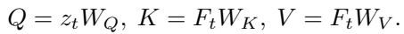
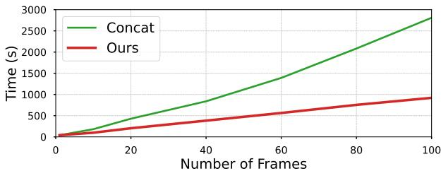
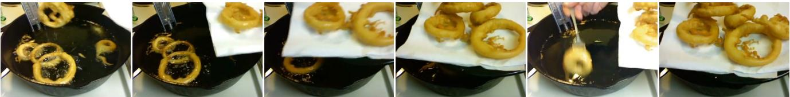
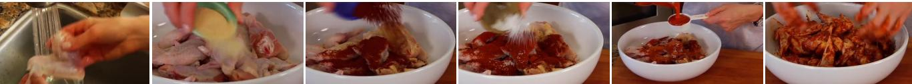

[← 返回 README](../README.md)

# Appendix

## 📌 预览
额外消融（frame-level vs token-level 压缩）、更多可视化、与 concurrent works（TESTA/MovieChat/Chat-UniVi）的详细对比、超参数细节、局限性与未来方向。

---

## A. Additional Experiments

### Memory bank compression at different spatial levels

In Table 10, we show comparison results of compressing the memory bank at different spatial levels (frame-level vs. token-level) on the LVU [32], Breakfast [56] and COIN [57] datasets. For the frame-level compression, we calculate the cosine similarity between adjacent frame features and average the frame-level features with the highest similarity. For the token-level compression, the cosine similarity is calculated between tokens at the same spatial location across the entire temporal axis, given that each frame-level feature contains multiple tokens at different spatial locations. The results indicate that token-level compression consistently surpasses frame-level compression in performance. Particularly, on the Breakfast dataset, the token-level surpasses the frame-level by 6.5% in top-1 accuracy. This superiority can be attributed to the importance of recognizing the object type of breakfast in videos. And token-level compression can help preserve much more fine-grained spatial information and details.

*Table 10. Memory bank compression at different spatial levels.*

> 💡 **Table 10 批读**:
> | 压缩级别 | LVU | Breakfast | COIN |
> |----------|-----|-----------|------|
> | Frame-level | 61.8 | 86.5 | 91.1 |
> | **Token-level** | **63.0** | **93.0** | **93.2** |
>
> - Token-level 在 Breakfast 上 +6.5%！说明细粒度空间信息很重要
> - Frame-level 压缩相当于对整帧取相似度再合并，丢失了空间细节
> - **关键 insight**: 不同空间位置的 tokens 在时间轴上有不同的冗余模式，应该分别处理

---

### Inference time vs. video frame lengths

In Figure 6, the inference time of MA-LMM increases linearly with respect to the frame lengths, due to its auto-regressive design of processing video frames sequentially. In contrast, directly concatenating frame-level features takes much longer time and higher GPU memory consumption, since it needs to process all video frames simultaneously.

*Figure 6. Inference time vs. input frame length.*

> 💡 **Figure 6 批读**:
> - MA-LMM 推理时间线性增长（逐帧处理），但 GPU memory 恒定
> - Concat 方法 GPU memory 和时间都随帧数增长
> - **Trade-off**: MA-LMM 用时间换空间 — 对于长视频（> 60 帧），concat 会 OOM，MA-LMM 仍可运行

---

## B. More Qualitative Results

Our model's enhanced capabilities in video captioning are further showcased through additional visualization results in Figure 7. Here, our MA-LMM significantly outperforms Video-LLaMA [12] in generating detailed and accurate sentence descriptions. For instance, in the first video, our model precisely describes the action as "remove the onion rings and place them on the paper towel," capturing the entire action steps, while Video-LLaMA's description lacks this completeness, notably missing the crucial action of removing the onion rings. In the second video example, our model distinguishes itself by accurately identifying subtle details such as specific ingredients: chili powder, salt, and garlic powder, which Video-LLaMA overlooks. This highlights the enhanced capability of our MA-LMM in recognizing and describing fine-grained details.

*Figure 7. Visualization results on the video captioning task.*

> 💡 **Figure 7 批读**: MA-LMM 能捕捉完整动作序列和细粒度物体（洋葱圈、辣椒粉等），而 Video-LLaMA 只能给出粗略描述。Memory bank 帮助保留了早期帧的细节信息。

---

## C. Relations to Concurrent Works

In this section, we compare and discuss the relations between our MA-LMM with the concurrent works including TESTA [25], MovieChat [26] and Chat-UniVi [27]. All of these methods focus on utilizing the idea of token merging [24] to reduce video redundancies.

**Temporal Modeling.** Temporal modeling across these methodologies falls into three categories. Chat-UniVi [27] directly feed visual tokens into large language models (LLMs) without explicit temporal modeling, utilizing LLMs' inherent sequence processing for video understanding. In contrast, TESTA [25] and MovieChat [26] employ global self-attention; TESTA captures interactions along spatial and temporal dimensions, whereas MovieChat processes long videos in segments, compresses these into short-term memories, then concatenates and models global temporal interactions using a video Q-Former. Differently, our MA-LMM adopts causal self-attention, restricting each frame's feature access to prior video information only. Such a design naturally endows our MA-LMM with the capability to support online video applications in robotics, AR/VR, and video streaming.

**Token Merging Application.** Building on the token merging [24] strategy, four methodologies have adopted and modified this approach to reduce video data redundancy. Each uses the core concept of merging similar tokens but differs in implementation. TESTA [25] utilizes a cascaded module for spatial and temporal aggregation, progressively shortening video length and decreasing tokens per frame. In contrast, Chat-UniVi's [27] modules operate in parallel, merging tokens across both dimensions before LLM reasoning. MovieChat [26] employs a selective strategy to merge similar adjacent frames, reducing the number of video frames. Similarly, our MA-LMM conducts token merging along the temporal dimension to condense video length but at a more fine-grained spatial level. It independently compresses visual and query tokens across different spatial areas, enhancing performance as evidenced in Table 10.

**Based Model.** Both TESTA [25] and Moviechat [26] are built upon the video-based multimodal model. TESTA integrates TimeSFormer [47] as its video encoder, facilitating long-range video modeling. Meanwhile, MovieChat adopts the Video-LLaMA [12] framework, combining an image Q-Former with a video Q-Former to effectively manage long-term temporal relationships. On the contrary, another group involves adapting image-based multimodal models for video understanding. Chat-UniVi [27] leverges the LLaVA [8] architecture, feeding concatenated visual tokens along the temporal axis into LLMs. Our MA-LMM builds on InstructBLIP [9] as a plug-and-play module that significantly boosts long-term temporal modeling. Demonstrated in Table 7, our memory bank module greatly excels over InstructBLIP under the off-the-shelf setting without video-specific pre-training or introducing additional parameters.

**Memory Bank Design.** The integration of memory banks to enhance long-term video understanding has been thoroughly explored [38, 39, 41, 87, 88]. Building on these studies, MovieChat [26] and our MA-LMM both employ memory bank designs. MovieChat primarily uses memory banks to consolidate raw and static visual features. In contrast, our MA-LMM innovates with an additional query memory bank that captures dynamic memory, reflecting the evolving understanding of past video frames. The effectiveness of our query memory bank is evidenced in Table 6.

> 💡 **Concurrent Works 对比总结**:
> | 维度 | TESTA | MovieChat | Chat-UniVi | **MA-LMM** |
> |------|-------|-----------|------------|-----------|
> | 时序建模 | Global self-attn | Segment + global | LLM 隐式 | **Causal self-attn** |
> | Token merging | 级联(spatial+temporal) | 帧级合并 | 并行 spatial+temporal | **Token 级时间合并** |
> | 基座 | TimeSFormer | Video-LLaMA | LLaVA | **InstructBLIP** |
> | Memory bank | ❌ | Raw visual only | ❌ | **Visual + Query** |
> | 在线处理 | ❌ | ❌ | ❌ | **✅** |
>
> MA-LMM 的独特优势：(1) causal attention → 在线处理 (2) dual memory bank (3) token-level 压缩

---

## D. Experiment Details

We build our MA-LMM on top of InstructBlip [9], following the codebase [89]. We show the details of hyper-parameters in the following table for different tasks and datasets. For all the experiments, we use a cosine learning rate decay. For the LVU dataset, we follow the same practice in [35, 36], we sample 100 frames of 1 fps for each video clip. For the Breakfast [56] and COIN [57], we uniformly sample 100 frames from the whole video.

> 💡 **超参数要点**:
> - 统一采 100 帧，memory bank 长度 20（长视频任务）或 10（VQA）或 40（captioning）
> - 学习率 1e-4（大部分任务），batch size 64-128
> - 训练 5-20 epochs（任务相关）
> - 全部用 cosine decay

---

## E. Limitation and Future Work

Since our model takes in video frames in an online manner, leading to reduced GPU memory usage, but at the cost of increased video processing time. This trade-off becomes particularly noticeable with extremely long videos, where processing times can become significantly prolonged. To mitigate this issue, we suggest a hierarchical method to process extremely long-term video sequences. This strategy involves dividing extensive videos into smaller segments and then processing each segment sequentially in an auto-regressive fashion as we present in the main paper. Then we can employ additional video modeling techniques to model inter-segment relationships. This method aims to strike a balance between memory efficiency and processing speed, making it a practical solution for long-term video understanding.

For the future work, there are several potential aspects to further enhance the model's capabilities. First, replacing the existing image-based visual encoder with a video or clip-based encoder can naturally enhance the model's ability to capture short-term video dynamics. This provides a better representation of the video's temporal dynamics. Second, the model's overall performance in understanding videos can substantially benefit from the pre-training stage on large-scale video-text datasets. This approach is a common practice in existing research and has proven effective in enhancing generalization capabilities. Finally, the flexibility inherent in our model's architecture allows for the incorporation of a more advanced LLM as the language decoder. This integration offers a clear opportunity for boosting the final performance, making our model more effective in interpreting and responding to complex video content.

> 💡 **局限性与未来方向批读**:
> 1. **时间 vs 空间 trade-off**: 省 GPU memory 但增加处理时间 — 建议分层处理（segment + inter-segment）
> 2. **Image encoder → Video encoder**: 当前用 frozen ViT（每帧独立），换成 video encoder 可以捕获短期动态
> 3. **Video-text 预训练**: 当前只用 image-text 预训练，video-text 预训练可进一步提升
> 4. **更强 LLM**: Vicuna-7B → 更大模型
>
> 💡 **医学影像场景适用性总结**:
> - ✅ 在线逐帧处理 → 逐切片处理 CT/MRI
> - ✅ Memory bank 恒定长度 → 适合大量切片（如 100+ 切片的全身 CT）
> - ✅ MBC token-level 压缩 → 相邻切片相似度高，天然适合
> - ⚠️ 需要考虑病变切片的保护（不被过度压缩）
> - ⚠️ 医学影像不需要 online reasoning，但 constant memory 仍有价值
> - ⚠️ 需要 domain-specific visual encoder（不是 EVA-CLIP）

---

## 🔖 Section 总结

### 核心洞察
1. Token-level 压缩 > Frame-level 压缩（Breakfast +6.5%）— 细粒度空间信息很重要
2. MA-LMM 是唯一支持在线处理的方法（causal attention），其他 concurrent works 都是 offline
3. 主要局限：处理时间线性增长，对极长视频需要分层策略
