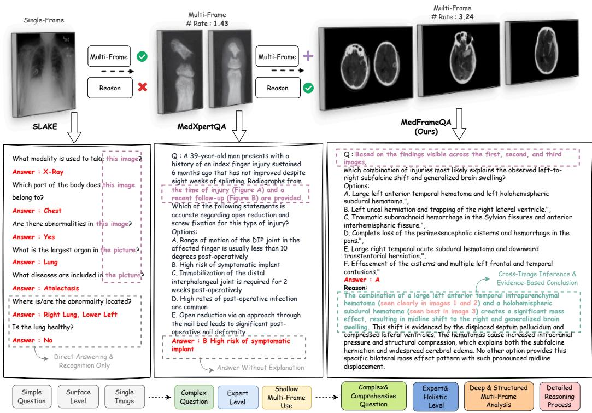
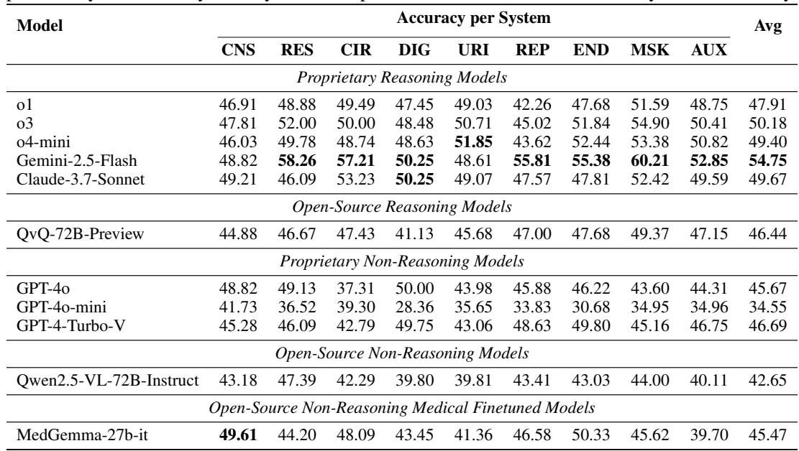

[← 返回 README](../README.md)

# 1. Introduction

## 📌 预览
Introduction 的核心论点：现有医学 VQA benchmark 都是单图或伪多图（多图但不需要真正跨图推理），MedFrameQA 利用医学教育视频的天然时序连贯性来构建需要真正跨图推理的 VQA。

---

Multimodal Large Language Models (MLLMs) have quickly emerged as a powerful paradigm for enabling advanced AI systems in clinical and medical domains (Xie et al., 2025; OpenAI, 2023a; Li et al., 2023; Tu et al., 2023; Saab et al., 2024; Huang et al., 2025; Wu et al., 2025). In practice, clinicians frequently employ multi-image diagnostic workflows, comparing related scans and synthesizing findings across different views and time points. Current evaluation benchmarks, however, focus predominantly on isolated, single-image analysis, e.g., (Lau et al., 2018; Ben Abacha et al., 2019; 2021; He et al., 2020; Liu et al., 2021; Zhang et al., 2023; Hu et al., 2024; Chen et al., 2024). The left panel of Figure 1 shows a typical SLAKE (Liu et al., 2021) example whose answer requires nothing more than basic object recognition in one frame. In everyday care, however, clinicians rarely rely on a lone snapshot; they routinely compare multiple images taken from different views, modalities, or time points before making a diagnosis.

> 💡 **现状 gap**: MLLM 在医学领域很火，但 benchmark 全是单图。临床实践需要比较多张影像（不同视角/模态/时间点），现有评测完全覆盖不到这一点。

Only recently has the vision community begun to tackle multi-image VQA. A handful of new benchmarks—such as Yue et al. (2024a;b); Zuo et al. (2025)—include questions that reference more than one picture. Yet their tasks still fall short of the integrative reasoning medicine demands, as the images from these benchmarks are typically treated as separate clues rather than as innately complementary pieces of a single, coherent scenario. The MedXpertQA example in the middle panel of Figure 1 illustrates this gap: the two images share no obvious physiological connection or causal chain, so it is possible for a model to still answer correctly without genuinely synthesizing information from both. Consequently, success on such datasets therefore says little about a system's ability to perform the integrative, cross-image reasoning required for real diagnostic practice.

> 💡 **对现有"多图" benchmark 的批评**: MMMU、MedXpertQA 等虽然有多图，但图片之间缺乏内在联系（没有生理连接或因果链），模型可以不综合所有图片就答对。这是"伪多图"——形式上多图，实质上仍是独立线索。
>
> 这个批评很到位。真正的跨图推理应该要求模型必须综合所有图片才能得出答案。

*Figure 1: Comparison of medical VQA benchmarks. MEDFRAMEQA introduces multi-image, clinically grounded questions that require comprehensive reasoning across all images.*

> 💡 **Figure 1 批读**:
> 三个 benchmark 对比：
> - **SLAKE**（左）：单图 VQA，基础目标识别即可
> - **MedXpertQA**（中）：多图但图片无内在关联，可以单独看每张图
> - **MedFrameQA**（右）：多图且来自同一临床场景的连续帧，必须跨图综合推理
>
> 关键区别在于图片之间是否有 "temporal and semantic coherence"。

To bridge this gap, we introduce MEDFRAMEQA, the first benchmark explicitly designed to test multi-image reasoning in medical VQA by leveraging YouTube's rich repository of medical education videos (Osman et al., 2022; Akakpo and Akakpo, 2024). Our approach focuses on educational video sequences with temporally and semantically connected visual content that demonstrate diagnostic reasoning within coherent clinical presentations. Building on this insight and drawing inspiration from the prior work (Ikezogwo et al., 2023), we propose a VQA generation pipeline that automatically constructs multi-image VQA questions from keyframes extracted from 3,420 medical videos, spanning 9 human body systems and 43 organs across diverse anatomical regions.

> 💡 **核心创新点**: 利用 YouTube 医学教育视频的天然时序连贯性。视频中连续帧本就描述同一个临床场景，天然具有跨图推理所需的语义连贯性。灵感来自 Quilt-1M（从组织病理视频提取图-文对）。

We first curated videos ranging from 5 minutes to 2 hours using 114 combinatorial search queries across imaging modalities and clinical findings. Keyframes were then extracted and rigorously filtered by GPT-4o for image quality, medical relevance, informativeness, and privacy. Audio narrations were transcribed, temporally aligned to frames within a defined margin, and refined by GPT-4o for clinical accuracy. Consecutive frame-caption pairs with a shared clinical focus were merged into multi-frame clips to preserve narrative continuity. GPT-4o then generated multiple-choice VQA items for each clip, requiring advanced clinical reasoning and multi-image analysis. A final two-stage filtering process—automated difficulty filtering via strong MLLMs and manual quality control—ensured a challenging, high-quality VQA benchmark tailored for medical imaging content.

> 💡 **Pipeline 概览（详见 Section 3）**:
> 1. 114 个搜索词组合 → 3,420 视频
> 2. FFmpeg 关键帧提取 → GPT-4o 四维过滤（质量/医学相关性/信息量/隐私）
> 3. Whisper 语音转文字 → 时间对齐 → GPT-4o 润色
> 4. 文本相关性判断 → 合并连续帧为 2-5 帧 clips
> 5. GPT-4o 生成 MCQ
> 6. 难度过滤（三个模型都答对则剔除）+ 人工质检

This data curation pipeline yields MEDFRAMEQA, which consists of 2,851 challenging multi-image VQA questions requiring reasoning across temporally coherent sequences (2-5 frames each). These sequences include multi-view images of the same anatomy, progressive disease stages within educational narratives, and cross-modal comparisons—all derived from continuous educational video content rather than arbitrary image collections. As illustrated in the right panel of Figure 1, each item bundles a natural-language query with multiple frames, reducing reliance on single-image analysis. Moreover, we provide gold-standard rationales derived from source video transcripts, explicitly linking each image to the answer.

> 💡 **数据特点**: 三类跨图关系——(1) 同一解剖结构多视角；(2) 疾病进展阶段；(3) 跨模态对比。每个 VQA 都附带 gold-standard rationale，来源于视频旁白转录。

We benchmark 11 state-of-the-art MLLMs on MEDFRAMEQA and find that their accuracies mostly fall below 50% with substantial performance across different body systems, organs, and modalities, revealing critical gaps between current model capabilities and clinical diagnostic requirements, particularly in video-derived multi-image reasoning scenarios.

*Table 1: Comparison of MEDFRAMEQA with Existing Benchmarks.*

> 💡 **Table 1 批读**:
> 关键对比维度：
> - **Multi-Image**: 大部分 benchmark ✗，只有 MMMU/MMMU-Pro/MedXpertQA/MedFrameQA ✓
> - **Real World Scenarios**: 只有 MedXpertQA 和 MedFrameQA ✓
> - **Paired Reasoning Across Multi Images**: 只有 MedFrameQA ✓（从视频转录派生的配对推理）
> - **Images/Questions ratio**: MedFrameQA 3.24，远超其他（说明每题确实需要多图）
>
> MedFrameQA 是唯一在三个维度上全 ✓ 的 benchmark。

---

## 🔖 Section 总结

### 核心洞察
1. 现有多图 benchmark 的图片缺乏内在关联——"伪多图"问题
2. 医学教育视频是天然的多图推理数据来源，帧序列具有时序和语义连贯性
3. Pipeline 高度依赖 GPT-4o（帧过滤、字幕润色、相关性判断、VQA 生成），成本和偏差问题值得关注
