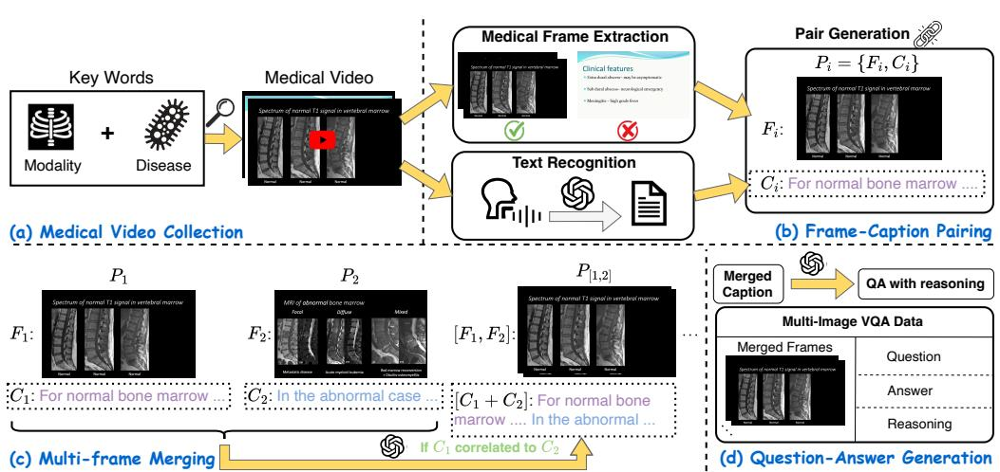

[← 返回 README](../README.md)

# 3. MedFrameQA Benchmark

## 📌 预览
这是论文最核心的 Section——数据构建 pipeline 四阶段：视频收集 → 帧-字幕配对 → 多帧合并 → VQA 生成，加上两阶段过滤。

---

*Figure 2: Our data generation pipeline. (a) Medical Video Collection → (b) Frame-Caption Pairing → (c) Multi-Frame Merging → (d) Question-Answer Generation.*

> 💡 **Figure 2 批读**:
> Pipeline 四阶段清晰：
> - **(a)** 114 组合搜索词 → 3,420 视频
> - **(b)** FFmpeg 关键帧 + Whisper 转录 → GPT-4o 过滤和润色 → 帧-字幕对
> - **(c)** 相邻帧字幕相关性判断 → 滑动合并为 2-5 帧 clips
> - **(d)** GPT-4o 从 clips 生成 MCQ
>
> 整个 pipeline 重度依赖 GPT-4o，这是优点（自动化、可扩展）也是隐患（GPT-4o 的偏差会渗透到数据中）。

---

## 3.1 Medical Video Collection

As the first step in building MEDFRAMEQA, we assemble a large pool of clinically relevant videos from YouTube (illustrated in Figure 2(a)). Specifically, we curate 114 carefully designed search queries, each formed by pairing a common imaging modality (e.g. MRI, X-Ray, CT, and radiograph) with a frequently encountered disease or finding (e.g. brain tumor, pneumonia, chest, and bone fracture). This combinatorial list gives broad coverage of routine diagnostic scenarios; the full set of keywords is provided in Section D. Then, for every query, we retrieve the top results and discard clips shorter than 5 minutes or longer than 2 hours. The remaining corpus comprises 1,971 high-resolution, narration-rich medical videos that serve as the raw material for MEDFRAMEQA.

> 💡 **3.1 要点**:
> - 搜索策略：模态 × 疾病/发现 = 114 个组合查询词
> - 时长过滤：5min-2h（太短信息不足，太长噪声太多）
> - 结果：1,971 个高清、有旁白的视频
>
> 注意这里说 1,971，但后面 Section 4 说 3,420。可能是 1,971 个 unique 视频产出了 3,420 个有效视频片段，或者后续有补充采集。

---

## 3.2 Frame-Caption Pairing

> 💡 **3.2 要点预览**: 帧提取→过滤→语音转录→时间对齐→GPT-4o 润色。核心挑战是旁白和画面的时间差。

### Medical Frame Extraction

To process the raw video collected, the first task is to identify the corresponding medical frames. Following Ikezogwo et al. (2023), we run FFmpeg to extract key-frames—those delineating the scene boundaries and often indicating significant visual transitions—and record the corresponding temporal span of each segment $(f_{\mathrm{start}}, f_{\mathrm{end}})$. Each candidate frame is then evaluated by GPT-4o (Hurst et al., 2024) under four criteria: (1) image quality, evaluating the clarity and medical relevance of the frame; (2) prominence of medical content, determining if the frame predominantly consists of medical imagery; (3) informative content, checking if the frame is understandable and holds significant information; and (4) privacy, ensuring the frame excludes unrelated human faces, such as those of presenters in video conferences. Note that only frames satisfying all four requirements are retained. More details about the frame filtering criteria can be found in Section F.1.

> 💡 **帧过滤四准则**:
> 1. 图像质量（清晰度 + 医学相关性）
> 2. 医学内容主导（≥85% 面积是医学影像）
> 3. 信息量（可理解且有意义）
> 4. 隐私（无演讲者人脸等）
>
> 全部由 GPT-4o 判断。从 111,942 关键帧筛到 9,237，淘汰率 91.7%——过滤很激进。

This filtering step leaves us with a sequence of qualified key-frames and their temporal spans:

$$S_F = [F_1, \cdots F_m], \quad D_F = [(f_{start}^1, f_{end}^1), \cdots (f_{start}^m, f_{end}^m)],$$

where $m$ is the number of extracted medical frames. $S_F$ and $D_F$ are the sequence of frames and times, respectively.

### Text Recognition

We next transcribe the audio track with Whisper (Radford et al., 2023). The model returns a sequence of $n$ text snippets and their time stamps:

$$S_T = [T_1, \cdots T_n], \quad D_T = [(t_{start}^1, t_{end}^1), \cdots (t_{start}^n, t_{end}^n)],$$

### Pair Generation

Our third task now is to pair the medical frame with the corresponding caption. Intuitively, each frame can be simply paired with the text snippets that emerge concurrently with it during the same time interval. However, narration in medical videos can lag behind or precede the exact moment a frame is shown. To associate each frame $(F_i)$ with all relevant speech, we define a symmetric margin $(\Delta)$ seconds around the frame's interval and gather every transcript whose span intersects that window $[f_{\mathrm{start}}^i - \Delta, f_{\mathrm{end}}^i + \Delta]$. Then all snippets within this window range will be concatenated to form a coarse caption $\tilde{C}_i = [T_j, T_{j+1}, \dots, T_k]$.

> 💡 **时间对齐策略**: 对称 margin Δ 解决旁白与画面的时间差。这是个实用但粗糙的方案——Δ 太大会引入无关内容，太小会漏掉相关旁白。论文没提 Δ 的具体值。

Then we leverage GPT-4o to enhance the quality of $\tilde{C}_i$. Specifically, GPT-4o is instructed to (i) remove statements unrelated to the displayed frame and (ii) refine the description to ensure the correct usage of clinical terminology. Formally,

$$C_i = \mathrm{GPT\text{-}4o}(\tilde{C}_i, F_i \mid I_{rephrase}),$$

where $C_i$ denotes the refined caption, and $I_{rephrase}$ is the prompt (see Section F.1 for more details). The final frame–caption pair is $P_i = \{F_i, C_i\}$, and the sequence of frame-caption pairs of the entire video is $S_P = [P_1, \cdots, P_n]$.

> 💡 **GPT-4o 润色字幕**: 输入粗字幕 + 帧图片，GPT-4o 去除无关内容并规范化术语。这步很关键——既去噪又确保 caption 准确描述帧内容。但也意味着最终数据受 GPT-4o 医学知识的约束。

---

## 3.3 Multi-Frame Merging

The paired frames described above usually belong to longer narrative units within educational presentations—for example, a radiologist may spend several consecutive slides discussing the same lesion during a structured teaching session. To capture such continuity, we merge adjacent frame-caption pairs into multi-frame "clips" whenever their captions describe the same clinical concept within the educational context.

> 💡 **核心创新之一**: 多帧合并。教育视频中相邻帧通常讨论同一临床主题（同一病灶的不同视角/阶段），合并后形成天然的跨图推理场景。

The paired caption of each frame already provides a description of its visual content; hence, we rely entirely on the textual correlation between the captions to determine if there is a connection between two frames. Specifically, as illustrated in Figure 2(c), for every consecutive pair $P_i = \{F_i, C_i\}$ and $P_{i+1} = \{F_{i+1}, C_{i+1}\}$, we ask GPT-4o (prompt in Section F.2) whether these two captions are correlated. If yes, we then combine these two pairs: $P_{[i,i+1]} = \{[F_i, F_{i+1}], [C_i \oplus C_{i+1}]\}$, where $\oplus$ represents the text concatenation. We then compare the merged caption $[C_i \oplus C_{i+1}]$ with the next caption $C_{i+2}$; if the relation persists, we append $P_{i+2}$ to the group. This sliding process continues until (i) the next caption is judged unrelated or (ii) the group reaches a maximum of five frames, the limit we adopt in this work.

> 💡 **合并机制**:
> - 仅基于文本相关性（不看图片）→ 可能漏掉视觉上相关但文字描述不同的帧
> - 滑动窗口式合并，上限 5 帧
> - 由 GPT-4o 判断相关性
>
> 为什么上限是 5？论文没有 ablation。可能是实验发现超过 5 帧后 VQA 质量下降。

Applying the above procedure to all videos yields 7,998 multi-frame clips, each containing 2–5 medically coherent frame-caption pairs. These clips constitute the basic building blocks for the subsequent VQA-item generation stage.

> 💡 **产出**: 7,998 个 clips → 后续经 VQA 生成和过滤后变成 2,851 个最终 VQA（留存率 35.6%）。

---

## 3.4 Question Answering Generation

As shown in Figure 2(d), for each merged group $P_{[i, i+1\cdots]} = \{[F_i, F_{i+1}, \cdots], [C_i \oplus C_{i+1}, \cdots]\}$, we instruct GPT-4o to generate challenging multiple-choice questions. Formally,

$$Q, A, R = \mathrm{GPT\text{-}4o}([C_i \oplus C_{i+1} \cdots] \mid I_{gen}),$$

where $Q, A, R$ are the generated question, the correct answer, and the reasoning, respectively. $I_{gen}$ is the generation prompt, enforcing four requirements:

(1) **Information Grounding**: all questions must rely solely on visual evidence explicitly described in the educational video captions;

(2) **Educational Clinical Reasoning**: each question should probe skills demonstrated in medical education contexts such as anatomical localization and differential diagnosis within structured presentations;

(3) **Contextual Interaction**: the wording must reference the images in order (e.g., "in the first image ..., whereas in the third image ...") and require synthesizing information across the educational sequence;

(4) **Distraction Options**: every item includes plausible but incorrect answer choices that differ from the ground truth in clinical details within the educational context.

> 💡 **VQA 生成四约束**:
> 1. **信息接地** — 只能基于字幕中描述的视觉证据
> 2. **临床推理** — 测试解剖定位、鉴别诊断等临床技能
> 3. **跨图交互** — 问题措辞必须引用多张图并要求综合
> 4. **干扰选项** — 临床上可混淆的错误选项
>
> 注意：VQA 是从 **caption**（而非图片）生成的。这意味着问题的难度和质量完全取决于 caption 的质量。模型评测时看的是图片而非 caption，这个 gap 可能导致问题与图片不完全对应。

The complete $I_{gen}$ is provided in Section F.3. Lastly, each clip is packaged as $\{Q, A, R, [F_i, F_{i+1} \cdots]\}$, forming a single entry.

---

## 3.5 Data Filtering

### Difficulty Filtering

To ensure the high challenge of MEDFRAMEQA, we utilize 3 advanced MLLMs—GPT-4-Turbo-V (OpenAI, 2023b), o1 (Jaech et al., 2024), and GPT-4o (Hurst et al., 2024)—for further filtering. If any of the models selects the correct option, the question is deemed too easy and discarded. This step trims the pool from 4,457 to 3,654 items.

> 💡 **难度过滤策略**: 三个强模型（GPT-4-Turbo-V、o1、GPT-4o）如果任一答对则剔除。这确保了 benchmark 的难度，但也引入了对这三个模型的偏差——剩下的题目可能恰好是这些模型的盲区，而非真正困难的题目。
>
> 4,457 → 3,654，剔除了 18%。

### Human Evaluation

Additionally, we conduct a manual evaluation to eliminate entries featuring low-quality frames. In detail, we exclude entries with frames that are: (i) blurred or display overlapping visuals due to faulty video extraction; (ii) show recognizable human faces, infringing upon the privacy guidelines described in Section 3.2; (iii) devoid of significant visual medical content. As a result, 803 entries were excluded, yielding a final benchmark set of 2,851 high-quality entries.

> 💡 **人工质检**: 3,654 → 2,851，剔除 803 条（22%）。主要剔除模糊帧、人脸、无医学内容。这步是必要的——GPT-4o 的帧过滤不完美。

---

## 🔖 Section 总结

### 关键数字速查
| 指标 | 数值 |
|------|------|
| 搜索词组合 | 114 |
| 原始视频 | 1,971 (→ 3,420 处理后) |
| 提取关键帧 | 111,942 |
| 过滤后帧 | 9,237 (留存 8.3%) |
| 多帧 clips | 7,998 |
| VQA 生成后 | 4,457 |
| 难度过滤后 | 3,654 |
| 人工审核后 | 2,851 (最终) |

### 核心洞察
1. **Pipeline 高度自动化但强依赖 GPT-4o**：帧过滤、字幕润色、相关性判断、VQA 生成全用 GPT-4o，成本约 14,255 API calls
2. **从 caption 生成 VQA 而非从图片**：这是个设计选择，保证了问题与帧内容的一致性，但也受限于 caption 质量
3. **难度过滤会引入模型偏差**：用 GPT 系模型过滤会导致 benchmark 对 GPT 系模型"更难"
4. **多帧合并仅基于文本**：不看图片，可能漏掉视觉相关但文字不同的帧对
