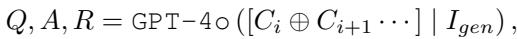
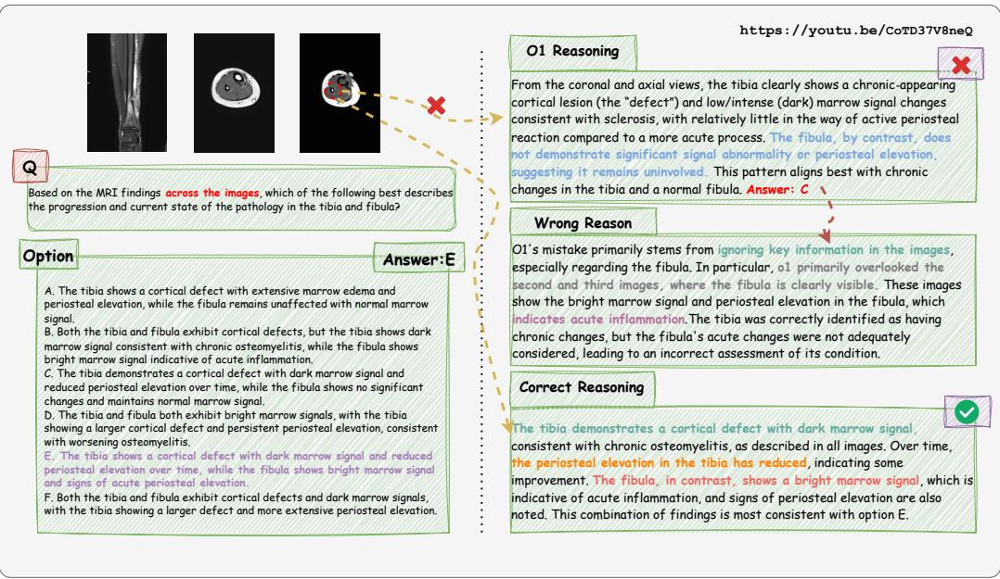
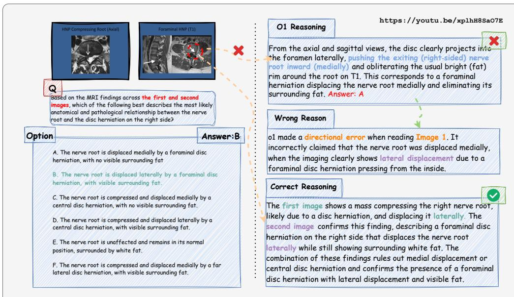
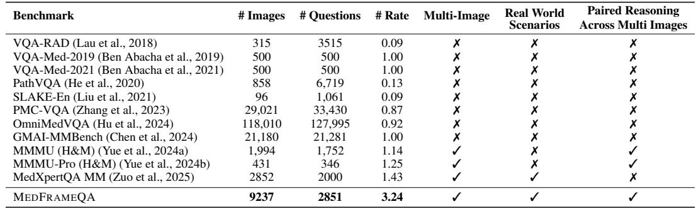

[← 返回 README](../README.md)

# 4. Experiments

## 📌 预览
11 个 MLLM 的全面评测：所有模型准确率 < 55%，推理模型优于非推理模型约 9%，错误分析揭示忽略帧信息和错误传播两大失败模式。

---

## 4.1 Data Statistics

In this section we summarize the data distribution of MEDFRAMEQA. Starting from the 3,420 instructional videos collected in Section 3.1, we extract 111,942 key-frames and retain 9,237 high-quality, medically relevant frames. These frames are used to construct 2,851 multi-image, closed-ended, single-choice VQA pairs, which span 9 human body systems and 43 organs, featuring 114 unique keyword combinations derived from the most common diseases and their associated diagnostic imaging modalities for each organ following Herring (2019). Each generated VQA pair consists of 2–5 frames, accompanied by a challenging question that requires integrating information across all provided frames to answer correctly.

> 💡 **数据分布**: 2,851 VQA 中：1,186 对含 2 帧（41.6%）、602 含 3 帧（21.1%）、256 含 4 帧（9.0%）、807 含 5 帧（28.3%）。2 帧和 5 帧最多，4 帧最少。

We stress that the defining feature of MEDFRAMEQA is that every question is tethered to multiple images, deliberately pushing models to reason across frames—a core requirement in real-world diagnosis. Concretely, among the 2,851 VQA items, 1,186 pairs contain 2 frames, 602 pairs contain 3 frames, 256 pairs contain 4 frames, and 807 pairs contain 5 frames.

---

## 4.2 Models

We evaluate both proprietary and open-source MLLMs on MEDFRAMEQA, encompassing reasoning and non-reasoning models, with a particular focus on recent advancements in medical reasoning.

**Reasoning Models**: o4-mini, o3, o1, Claude-3.7-Sonnet, Gemini-2.5-Flash, QvQ-72B-Preview.

**Non-Reasoning Models**: GPT-4o, GPT-4o-mini, GPT-4-Turbo-V, Qwen2.5-VL-72B-Instruct, MedGemma-27b-it.

> 💡 **模型选择**: 覆盖了当时最强的模型。注意 GPT-4-Turbo-V、o1、GPT-4o 在难度过滤阶段被用过（答对的题被剔除），所以这三个模型在 benchmark 上"天然不利"。这是实验设计上的潜在问题。

---

## 4.3 Main Results

*Table 2: Accuracy of Models on MEDFRAMEQA. System-wise accuracy, averaged over all tasks.*

> 💡 **Table 2 批读**:
> - **最佳**: Gemini-2.5-Flash 54.75%（唯一超过 50% 较多的模型）
> - **最差**: GPT-4o-mini 34.55%（接近随机猜测水平，4-6 选项随机约 17-25%）
> - **推理 vs 非推理**: Gemini-2.5-Flash (54.75%) vs GPT-4o (45.67%)，差 9.08%
> - **开源最佳**: QvQ-72B 46.44% vs Qwen2.5-VL-72B 42.65%，推理带来 3.79% 提升
> - **医学微调无用**: MedGemma-27b-it (45.47%) 和通用模型差不多
>
> 系统维度差异大：MSK 最高（Gemini 60.21%），REP 最低（多数 < 48%）

**Advanced MLLMs struggle to holistically understanding multi-images.** Table 2 presents the evaluation of 11 advanced MLLMs on MEDFRAMEQA. In general, all assessed models demonstrate persistently low accuracy, with the peak accuracy remaining below 55.00%. To reduce model performance variability, for open-source models, we run each experiment three times and report the average results, whereas for proprietary models, we conduct only a single run due to API cost constraints. The proprietary model, GPT-4o, reaches an average accuracy of 45.67%, significantly lower in comparison to its performance on the single medical VQA benchmark (69.91% on VQA-RAD as reported by Yan et al. (2024)). The leading open-source model, Qwen2.5-VL-72B-Instruct, achieves merely 42.65 ± 0.34% (SE) accuracy. To further verify that the suboptimal performance was attributable to deficient reasoning processes rather than inadequate medical knowledge, we evaluated MedGemma-27b-it, which similarly yielded poor results with 45.47 ± 0.59% (SE) accuracy.

> 💡 **核心发现**:
> - GPT-4o 在 VQA-RAD 单图 69.91% → MedFrameQA 多图 45.67%，骤降 24%
> - MedGemma 微调过医学数据但表现没好多少 → 问题不在医学知识，在跨图推理能力
> - 这与 Agent Memory 的观察一致：给 agent 更多信息不一定帮助，关键是能否有效综合

**Reasoning enhances multi-image understanding.** As shown in Table 2, we find that reasoning MLLMs consistently outperform non-reasoning ones. Gemini-2.5-Flash attains the highest accuracy among all models, notably outperforming the top non-reasoning model GPT-4o by 9.08% (54.75% vs 45.67%). Among the open-source models, QvQ-72B-Preview achieves an accuracy of 46.44% ± 0.66% (SE), showcasing a 3.79% enhancement compared to its non-reasoning counterpart, Qwen2.5-VL-72B-Instruct.

> 💡 **推理能力对多图任务特别重要**: 这暗示 Chain-of-Thought 或类似推理机制有助于模型在多图间建立联系。但即使有推理，准确率仍 < 55%。

---

### 错误案例分析

**Overlooking or misinterpreting hinders reasoning across image sequence.** Despite the relatively enhanced performance of reasoning models, their performance is still limited. Our investigation reveals this arises from neglecting or misinterpreting the intermediary images during continuous reasoning over an image sequence.

**Case 1: Negligence of important information within multiple frames.**

*Figure 3: Failure case study of o1. Negligence of important information across multiple frames.*

> 💡 **Figure 3 批读 — 忽略帧信息**:
> o1 正确识别了 Doppler 帧中的"polar vessel sign"（甲状旁腺腺瘤标志），但忽略了横断面和矢状面中的解剖定位线索（病灶位于甲状腺后下方）。只看一帧的血管特征，错过了其他帧中最具诊断价值的空间定位信息。
>
> **Agent Memory 视角**: 这就像 agent 只记住了最新的信息而忽略了早期的关键线索。

**Case 2: Mistake drawn from single image resulting in significant errors in subsequent reasoning.**

*Figure 4: Failure case study of o1. A mistake originating from a single image can result in significant errors in subsequent reasoning.*

> 💡 **Figure 4 批读 — 错误传播**:
> o1 在轴位图上误判了神经根位移方向（应该是外侧位移，o1 判断为内侧），这个错误贯穿整条推理链，最终选错答案。
>
> **Agent Memory 视角**: 这是典型的 "error propagation in reasoning chains"。早期记忆/判断错误会污染后续所有推理步骤。这与 Agent 中记忆质量对下游决策的影响完全类比。

---

## 4.4 Evaluation Across Anatomical Structures or Frame Numbers

*Table 3: Accuracy (%) of Models by Frame Count and Modality on MEDFRAMEQA.*

> 💡 **Table 3 批读**:
> **按帧数**:
> - 准确率随帧数波动而非单调下降。GPT-4o SD=3.01（波动大），GPT-4-Turbo-V SD=0.83（稳定）
> - Gemini-2.5-Flash 在 5 帧时 55.76%，反而是最高的 → 可能因为 5 帧提供了更多冗余信息
>
> **按模态**:
> - Ultrasound 和 X-ray 通常更好（可能训练数据中更多）
> - MRI 普遍偏低
> - Other 类别波动大
>
> 关键洞察：帧数多不一定更难，模态差异显著 → 模型的多图推理能力不均匀。

**Comparisons between anatomical structures and modalities.** The system-wise performance reveals substantial variability in task difficulty. For instance, Gemini-2.5-Flash achieves an accuracy of 60.21% on questions related to the musculoskeletal system, but only 48.61% on the urinary system, resulting in an accuracy gap of 11.60 percentage points. QvQ-72B-Preview exhibits a 4.24% performance gap between Ultrasound and X-ray, whereas Gemini-2.5-Flash shows a 4.54% gap between MRI and X-ray.

> 💡 **模态敏感性**: MSK 系统准确率高可能因为骨骼/关节影像更直观、对比度高。泌尿系统/生殖系统较低可能因为软组织影像解读更复杂。

**Comparisons between VQAs with different numbers of frames.** Empirically, we observe that accuracy fluctuates as the number of images per question increases, with performance improving at certain frame counts and declining at others. These fluctuations suggest that model performance is not strictly determined by the number of frames, but may instead be influenced by the complexity or redundancy of visual information across frames.

> 💡 **帧数与难度的关系**: 不是简单的"更多帧=更难"。可能的解释：(1) 更多帧有时提供冗余信息，反而帮助推理；(2) 帧数少时可能问题更精准，需要更细致的观察。这个发现有趣但论文没深入分析。

---

## 🔖 Section 总结

### 关键数字速查
| 指标 | 数值 |
|------|------|
| 评测模型数 | 11 |
| 最高准确率 | Gemini-2.5-Flash 54.75% |
| GPT-4o 准确率 | 45.67% (vs VQA-RAD 69.91%) |
| 推理 vs 非推理 gap | ~9% |
| MedGemma 准确率 | 45.47% (医学微调无显著帮助) |

### 核心洞察
1. **所有模型都不行**: 最好的也只有 54.75%，说明多图医学推理是真正的难题
2. **推理能力有帮助但不够**: +9% 的提升说明 CoT 类推理对多图任务有用
3. **两大失败模式**映射到 Agent Memory：信息遗漏 ≈ 记忆检索不全；错误传播 ≈ 记忆质量污染
4. **实验设计缺陷**: 难度过滤用了 GPT-4/o1/GPT-4o，这些模型在 benchmark 上"天然不利"
